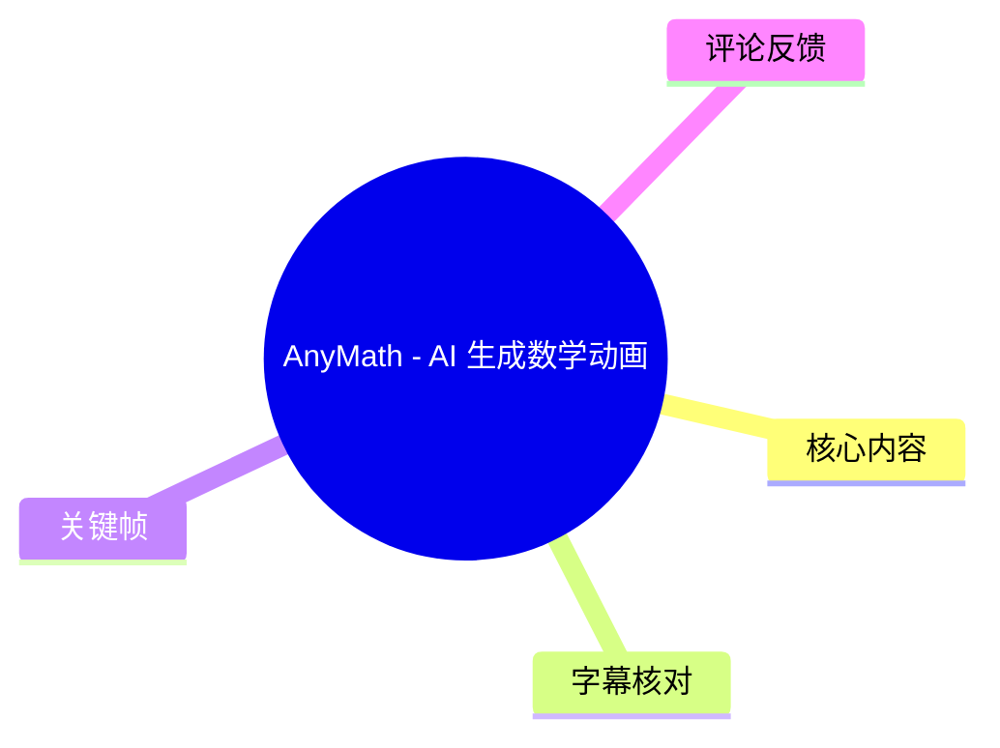
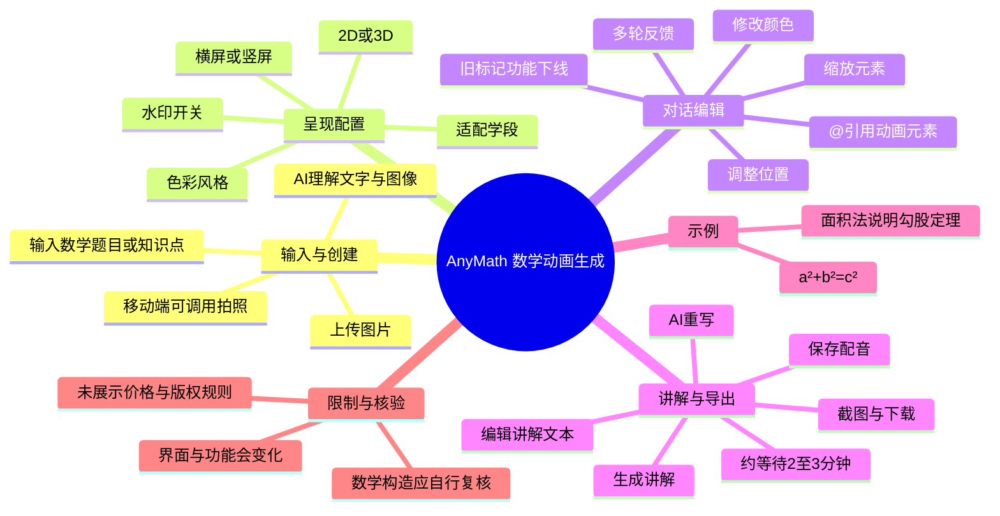
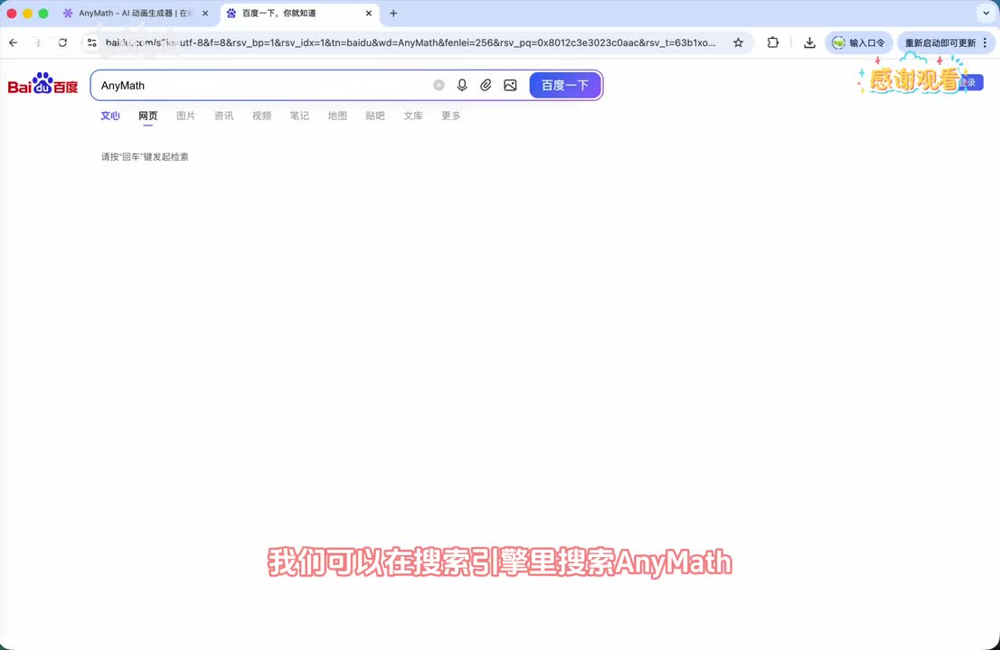

# AnyMath - AI 生成数学动画

> 来源：[Bilibili 视频](https://www.bilibili.com/video/BV1fCLV65Evn) 
> UP 主：词元AI｜发布时间：2026-05-17｜视频时长：6 分 10 秒 
> 视频描述：输入题目或知识点，AI 自动生成可播放、可编辑、带讲解的专业数学动画。

## 小结

视频演示了 AnyMath 的「对话创建数学动画」流程：用户可输入数学题目、知识点或上传图片，让 AI 理解文本、图像后生成数学动画；生成结果还可通过多轮对话继续修改。

界面中可设置动画维度与呈现方式，包括 **2D/3D**、**横屏/竖屏**、色彩风格、面向的学段，以及水印开关。画面中展示的默认示例为「2D 平面、16:9、海蓝、大学」和开启状态的水印开关；这些是当时演示界面的配置，不应视为固定默认值或完整可选项清单。

视频强调新版的精确编辑机制：在输入框中使用 `@` 引用动画中已有元素，再提出位置、颜色、大小等修改要求。UP 主称该机制比旧的「标记」功能更精确，并表示旧标记功能已在该版本下线。

动画生成后，若节奏过快，可点击「生成讲解」。视频称等待约 **2—3 分钟**后会得到讲解文本；用户能够手动编辑文本后保存配音，或通过「AI 重写」整体改写讲解。该耗时是视频中的经验值，实际时长会随服务版本、队列和网络状态变化。

末尾以直角三角形外接正方形为例，播放了一个关于勾股定理的面积说明动画：定义 \(S_A=a^2\)、\(S_B=b^2\)、\(S_C=c^2\)，并给出 \(S_A+S_B=S_C\)，从而得到 \(a^2+b^2=c^2\)。该示例展示的是成品动画的讲解风格；若用于严谨教学，还应在画面与讲解中明确「两个小正方形面积之和等于斜边正方形面积」所依赖的几何拼接或重排构造。

工具功能与界面均具有时效性。本视频录制时展示的是新版 AnyMath，且 ASR 将产品名多次识别为“Animus/Animals”；结合浏览器地址 `anymath.co/creator`、页面 Logo 与视频标题，可校正为 **AnyMath**。视频未说明登录门槛、积分/计费规则、导出格式、版权条款或可用地区，实际使用前需要以产品当前页面为准。

## 思维导图

## 目录

- [工具定位与入口](#工具定位与入口)
- [创作页面与输入方式](#创作页面与输入方式)
- [动画参数与适用对象](#动画参数与适用对象)
- [多轮修改与 `@` 元素引用](#多轮修改与--元素引用)
- [生成讲解、配音与导出](#生成讲解配音与导出)
- [成品示例：面积法说明勾股定理](#成品示例面积法说明勾股定理)
- [可复用操作流程](#可复用操作流程)
- [限制、风险与时效性](#限制风险与时效性)
- [字幕比对](#字幕比对)
- [评论分析](#评论分析)
- [处理记录](#处理记录)

## [工具定位与入口](https://www.bilibili.com/video/BV1fCLV65Evn?t=0)

视频开头将 AnyMath 定位为一个通过自然语言对话生成数学动画的工具。UP 主的操作路径是：先在搜索引擎中搜索产品名，再进入网站。

需要注意名称识别问题：ASR 在开头转写为“Animus”，结尾又转写为“Animals”，但画面中的浏览器标签、网站左上角 Logo、地址栏 `anymath.co/creator` 以及视频标题均指向 **AnyMath**。因此本文统一采用 AnyMath。

> 图：关键帧展示在搜索引擎中检索 “AnyMath”。它用于确认工具名称与入口搜索方式，并辅助校正 ASR 对产品名的误识别。

视频只演示了通过搜索引擎进入产品的方式，未提供官方域名之外的注册、登录、账号权限或付费说明。画面中后续页面右上角可见“积分 90”，但视频没有解释积分的获得方式、消耗规则或与生成次数的关系，不能据此推断其定价策略。

## [创作页面与输入方式](https://www.bilibili.com/video/BV1fCLV65Evn?t=19)

进入创作页后，UP 主将页面划分为三个区域：

1. **历史创作区**：用于查看已有创作；
2. **当前创作区**：用于输入需求、设置参数和与 AI 对话；
3. **预览区**：用于查看动画生成结果。

页面标题为“对话创建 数学动画”，输入框用于填写希望生成的数学动画想法或题目。视频说明两类输入来源：

- **文字输入**：直接描述数学知识点、题目或期待的动画表现；
- **图片输入**：通过上传图片提交题目、图形或想法；在移动端，该入口可唤起摄像头拍照。

工具的工作方式是由 AI 理解用户提交的文本或图像，再生成数学动画。视频没有展示上传文件格式、图像尺寸限制、题目识别精度或支持的数学学科范围，因此这些能力边界仍待以实际产品说明验证。

> 图：关键帧完整呈现“对话创建 数学动画”的双栏界面：左侧为输入与设置区域，右侧为预览区域。这是理解后续参数配置、生成和预览关系的核心画面。

## [动画参数与适用对象](https://www.bilibili.com/video/BV1fCLV65Evn?t=73)

视频在输入框上方展示了若干生成参数：

| 参数类别 | 视频说明 | 画面中可见示例 | 使用意义 |
| --- | --- | --- | --- |
| 动画维度 | 可选 2D、3D | `2D 平面` | 决定图形表达维度 |
| 画幅方向 | 可选横屏、竖屏 | `16:9` | 影响成品适配的播放场景 |
| 色彩风格 | 可选择色彩风格 | `海蓝` | 调整视觉风格 |
| 学段 | 按受众选择学段 | `大学` | 用于约束 AI 讲解难度 |
| 水印 | 可开启或关闭 | 画面中开关为开启状态 | 影响导出或预览中的水印呈现，具体规则未说明 |

UP 主特别提出学段设置的教学意义：若动画面向小学生，应选择“小学”，以避免 AI 使用超出目标受众理解范围的讲解内容。该设置可以理解为对生成内容难度的约束，但视频没有承诺其一定能保证数学表述、术语或推理严格适龄。

> 图：关键帧可见输入框及其上方的 `2D 平面`、`16:9`、`海蓝`、`大学` 和水印开关。这张图为视频所述参数提供了画面佐证，也表明这些设置位于发起生成前的输入侧。

## [多轮修改与 `@` 元素引用](https://www.bilibili.com/video/BV1fCLV65Evn?t=107)

UP 主以一次实际生成过程说明，AnyMath 支持连续对话修改。示例中，第一次请求生成后，黄色正方形的位置不正确，需要将整体图像向上移动；因此又发送了第二次修改指令。

这一示例传达了两个实操经验：

- 当问题涉及复杂位置关系、多个对象或难以准确描述的画面时，提示词可能较长；
- 当修改目标清晰时，可以使用更直接的语言，例如“图形整体向上移动一个行距”。

这意味着初稿并非最终成品。更可靠的工作方式是：先让 AI 生成可供检查的版本，再针对可观察的错误逐项迭代，而不是期望一次提示就达到精确布局。

### [`@` 引用：面向具体元素的修改](https://www.bilibili.com/video/BV1fCLV65Evn?t=153)

新版功能允许用户在输入框中键入 `@`，引出并选择动画中的元素。选中元素后，用户可将修改要求绑定到该对象，例如：

- 移动位置；
- 改变颜色；
- 放大或缩小；
- 对特定对象表达更精确的调整意图。

UP 主的判断是：相较于此前的「标记」方式，元素引用更精确；因此旧的标记功能已在当前版本下线。这里的“更精确”是视频作者的产品使用评价，并非对所有数学图形、复杂场景或所有生成结果的量化保证。

> 图：关键帧中输入框已填写“微积分原理…”，同时保留参数栏。这有助于理解 AnyMath 的基本交互是“主题/修改指令 + 参数约束”的对话式创作，而非传统时间轴剪辑界面。

## [生成讲解、配音与导出](https://www.bilibili.com/video/BV1fCLV65Evn?t=193)

经过两轮对话后，UP 主认为动画已生成，但指出动画整体节奏通常会比较快。针对这一情况，视频给出的补充流程是生成讲解：

1. 点击页面中的「生成讲解」按钮；
2. 等待约 **2—3 分钟**；
3. 页面会列出与当前动画对应的讲解内容；
4. 人工编辑讲解文本；
5. 保存配音，使编辑后的讲解适配到动画中；
6. 若对整篇讲解不满意，点击「AI 重写」重新生成整体文案。

这里包含一个重要的内容审核节点：AI 自动写出的讲解可编辑，说明使用者应在配音前检查数学符号、概念定义、推理顺序、受众难度和措辞。视频并未展示逐句时间轴编辑、声音选择、语速控制、语言选择或配音质量参数，因此不能假定这些功能存在。

### [截图与下载](https://www.bilibili.com/video/BV1fCLV65Evn?t=255)

界面右上角展示「截图」与「下载」入口。UP 主说明截图用于从动画中取一张图，例如制作封面；下载用于导出成品。

视频未说明下载得到的是视频、图片、工程文件还是其他格式，也未说明分辨率、清晰度、下载次数、水印规则或商用许可。因此在正式发布、教学分发或商业使用前，应查阅 AnyMath 当时有效的导出与版权条款。

## [成品示例：面积法说明勾股定理](https://www.bilibili.com/video/BV1fCLV65Evn?t=285)

视频最后播放成品动画，用面积关系说明勾股定理。讲解的推导顺序如下：

1. 取一个直角三角形，两条直角边记为 \(a\)、\(b\)，斜边记为 \(c\)；
2. 分别以边 \(a\)、\(b\)、\(c\) 向外作正方形；
3. 记三个正方形面积为：
   \[
   S_A=a^2,\qquad S_B=b^2,\qquad S_C=c^2
   \]
4. 视频给出几何面积关系：
   \[
   S_A+S_B=S_C
   \]
5. 代入面积表达式，得到：
   \[
   a^2+b^2=c^2
   \]
6. 最后将其概括为直角三角形三边长度之间的基本数量关系。

视频称其为“用面积方法来证明勾股定理”。不过，严格意义上的面积证明通常需要明确展示一个可验证的重排、拼接或全等面积构造，来论证为何 \(S_A+S_B=S_C\)。仅画出三边上的正方形并直接陈述面积和关系，会把需要证明的关键关系作为前提。因此，这段更适合视为动画讲解示例，而非可替代完整几何证明的严谨教材版本。

> 图：关键帧中输入框填写“微积分原理…”的状态与本段的最终勾股定理示例共同说明：工具以自然语言主题驱动生成。该帧并非勾股定理成品画面，而是用于说明成品动画之前的创作入口；素材所给关键帧未包含末尾完整动画的清晰截图。

## [可复用操作流程](https://www.bilibili.com/video/BV1fCLV65Evn?t=19)

结合视频演示，可整理为以下创作流程：

1. **进入 AnyMath 创作页**  
   进入「AI 创作」中的对话创建页面，确认左侧输入区与右侧预览区可用。

2. **选择呈现参数**  
   按目标场景设置 2D/3D、横竖屏、色彩风格与学段；如有水印要求，再检查水印开关状态。  
   - 面向小学受众时，视频建议将学段设为“小学”；  
   - 面向桌面视频平台时，画面示例使用 16:9，但视频未规定必须使用该比例。

3. **提交数学主题或题目**  
   可直接输入文本；若题目或图形更适合从图片表达，可通过上传或移动端拍照提交。

4. **检查首版动画**  
   重点检查图形位置、颜色、比例、符号、标签、讲解对象是否正确。视频中的首版问题是黄色正方形位置偏移。

5. **通过多轮对话修正**  
   对整体调整可使用明确的自然语言描述；对某一对象，先输入 `@` 选择元素，再提出移动、变色、缩放等具体要求。

6. **生成与审校讲解**  
   若动画节奏较快，使用「生成讲解」。视频经验值为约等待 2—3 分钟。生成后应人工核验数学结论、符号和语言难度，再保存配音；整体不满意时可选择 AI 重写。

7. **制作封面并导出**  
   使用截图截取动画画面作为封面，使用下载功能导出。导出格式、清晰度与授权范围需要另行确认。

## [限制、风险与时效性](https://www.bilibili.com/video/BV1fCLV65Evn?t=268)

### 视频已明确呈现的限制

- **生成并非一次完成**：示例中首版出现图形位置错误，需要二次对话修正。
- **动画节奏可能偏快**：UP 主建议通过生成讲解来补足说明。
- **讲解生成需要等待**：视频给出的等待时间约为 2—3 分钟，不是即时输出。
- **旧功能已发生变动**：标记功能已下线，改为 `@` 引用元素；说明产品交互会迭代。
- **截图与下载存在但细节未知**：视频未说明格式、分辨率、是否受积分或水印限制。

### 使用时应额外核验的风险

1. **数学正确性**  
   图形、公式、面积关系和叙述顺序均应人工复核。尤其是“证明”类内容，必须确认关键几何构造没有被省略。

2. **教学适配性**  
   选择学段是辅助约束，不能代替教师或内容创作者对术语、步骤复杂度和先验知识的判断。

3. **布局与视觉准确性**  
   生成图可能出现位置、大小、颜色或对象对应关系问题。应以预览结果为准，通过对象引用逐一调整。

4. **产品规则未知**  
   视频未覆盖账号、积分、价格、免费额度、数据处理、商用许可、版权归属与导出规格；这些都不能从本视频推断。

5. **时效性**  
   元数据记录视频发布于 2026-05-17，素材获取于 2026-07-16。AnyMath 的入口、参数项、旧功能状态、积分机制与生成速度此后均可能变化。本文只记录视频和关键帧中可见的当时状态。

## 字幕比对

站内未提供可用字幕，但本次 ASR 结果可用，且具有完整时间戳。ASR 诊断显示音频时长为 369.406 秒，识别语种为中文，语言置信度为 0.9985；共识别 23 段、语音覆盖约 336.07 秒，占视频约 90.98%。诊断中**未标记** `noAudioStream=true`，说明源视频存在可识别音轨。

| 字幕来源 | 完整性 | 专有名词 | 时间轴 | 主要问题 |
| --- | --- | --- | --- | --- |
| Bilibili 站内字幕 | 未提供可用字幕，无法采用 | 无法核验 | 无 | 素材明确标注“未提供可用站内字幕” |
| 本次 ASR 字幕 | 较完整，覆盖从 00:00:00.820 至 00:06:08.170 的主要口播 | 存在误识别，需结合画面校正 | 完整，23 个 SRT 分段可直接换算为时间轴秒数 | 产品名、个别术语和数学符号存在同音或错字问题 |

### 最终字幕选择与校正

本文采用**本次 ASR 的时间轴**作为章节定位依据，并结合关键帧、页面可见文字、视频标题和元数据修正内容表述。关键校正包括：

| ASR 原识别 | 校正结果 | 校正依据 |
| --- | --- | --- |
| Animus / Animuss / Animals | AnyMath | 视频标题、页面 Logo、浏览器标签、地址栏 `anymath.co/creator` |
| 搜索运行 | 搜索引擎 | 开头关键帧展示百度搜索页面 |
| Animate 水印 | AnyMath 水印 | 产品页面为 AnyMath；ASR 对专名存在混淆 |
| 内幕 / 发射给 AI | 内容 / 发送给 AI | 上下文是向 AI 发起两轮创作与修改请求 |
| 精凳地 | 精准地 | 语义与后文“引用功能会更加精准”一致 |
| 编织 / 编集 | 编辑 | 后续动作是编辑讲解文本并保存配音 |
| 面移、平放 | 面积、平方 | 结合勾股定理公式与上下文校正 |

ASR 不能单独证明页面中的每个按钮细节，因此涉及界面参数时以关键帧可见内容为优先依据；涉及口播步骤与等待时间时以带时间戳的 ASR 为依据。

## 评论分析

以下仅处理素材中可获取的热评前三条。评论反映的是用户观点或建议，不作为已验证事实。

| 热评 | 观点与补充 | 可信度与讨论 |
| --- | --- | --- |
| 小阿兜-（3 赞）：“我一直想实现功能，原来你们在做。我去玩玩” | 表达对“自动生成数学动画”能力的兴趣，并表示愿意尝试。 | 属于潜在用户反馈，说明该需求具有吸引力，但未提供实际体验结果、质量评价或功能验证。 |
| deerice5（2 赞）：“\(c²=1/2*a*b * 4 + (b-a)²\)，应该画这个吧” | 提出另一种常见的面积拼接思路：由四个直角三角形面积与中心正方形面积构成外部大正方形面积关系。 | 该评论指出了视频示例在“面积法证明”上可能遗漏关键构造的问题，和正文的严谨性提醒一致。但评论未附完整图形与前提，不能仅凭这条文字确认其对应的具体动画布局。 |
| deerice5（2 赞）：“一元二次三次方程，真的就是一条线吗？” | 对工具是否能恰当表达更复杂代数主题提出疑问。 | 这是合理的能力边界追问。视频只演示了勾股定理相关动画，未展示一元二次、三次方程的具体可视化效果，无法据此判断 AnyMath 是否会将其“画成一条线”。 |

## 处理记录

- **Worker ID**：worker-mrj0wjed-b0c290ad
- **模型**：gpt-5.6-terra
- **调用工具与素材**：任务提供的视频元数据、关键帧清单与画面、ASR 诊断与 SRT 时间轴字幕、热评 JSON。
- **ASR 检查结果**：已检查本次 ASR；识别模型为 `medium`，语言为中文，带时间戳，音轨存在，未出现 `noAudioStream=true` 标记。
- **字幕选择**：站内无可用字幕；采用本次 ASR 的 SRT 时间轴作为定位基础，并以视频标题、网页可见 Logo、地址栏及关键帧校正 AnyMath 等专有名词和明显错字。
- **时间轴依据**：章节链接均由 ASR SRT 的实际起始时间换算为秒数，例如创作页为 19.980 秒、参数页为 73.780 秒、讲解生成为 203.850 秒、成品示例为 285.530 秒；未按文本顺序臆测时间。
- **关键帧选择依据**：`frame-001.jpg` 用于确认搜索入口与产品名称；`frame-002.jpg` 用于说明创作页分区；`frame-003.jpg` 与 `frame-004.jpg` 用于确认输入区及 2D、16:9、海蓝、大学、水印等可见参数。所提供画面未包含末尾成品动画的清晰完整帧，因此未将关键帧内容虚构为勾股定理成品。
- **缓存清理**：提供的素材中未包含缓存清理日志；未据此编造已执行清理的结果。
- **未解决问题**：视频未说明 AnyMath 的登录/积分/价格规则、上传与导出规格、版权与商用许可、生成成功率，以及数学讲解和图形生成的准确率。
