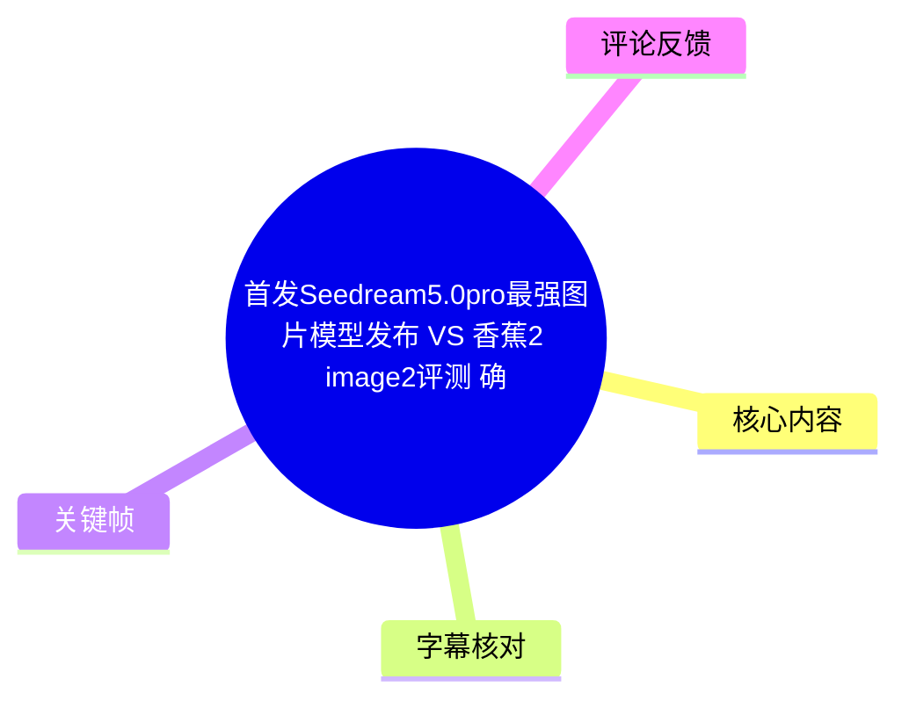
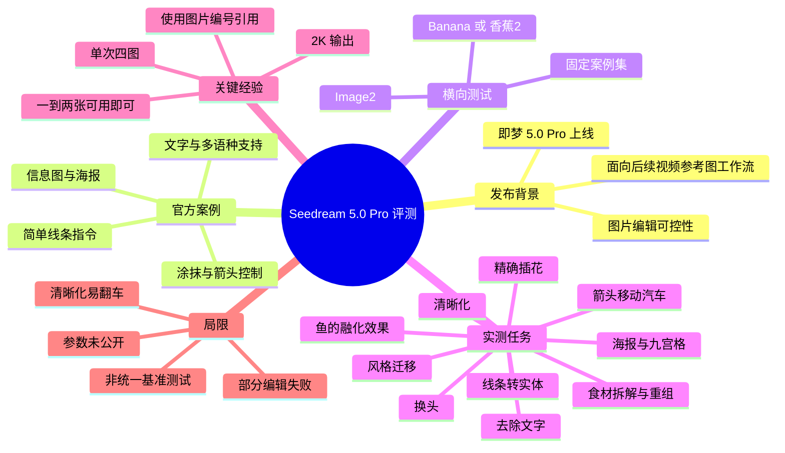
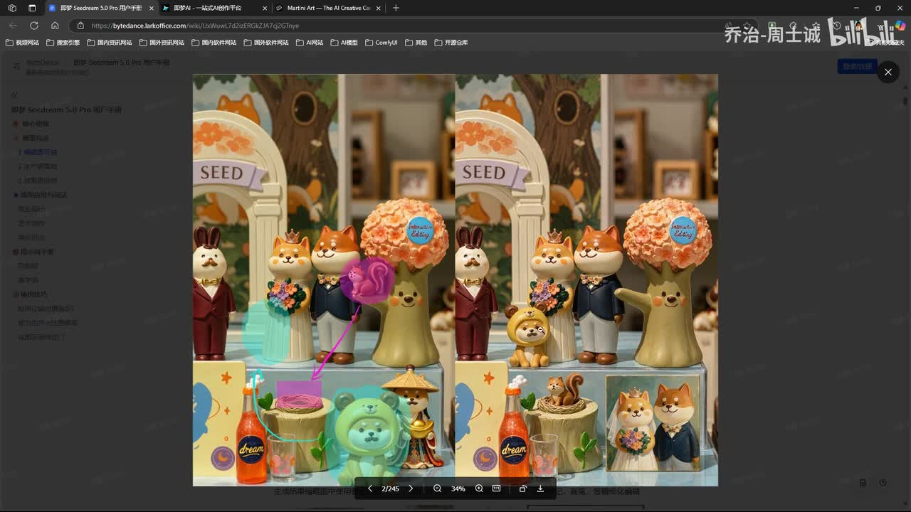
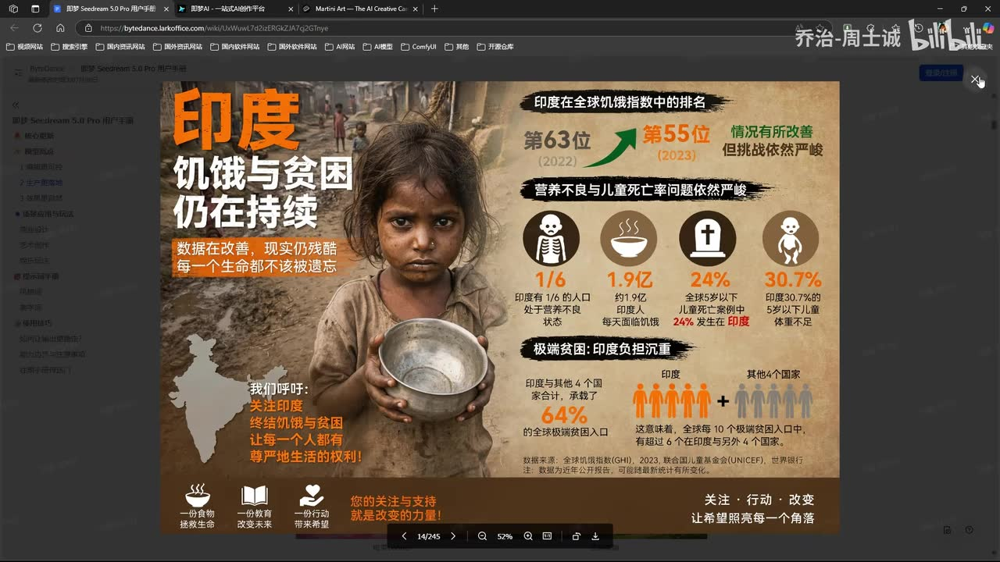
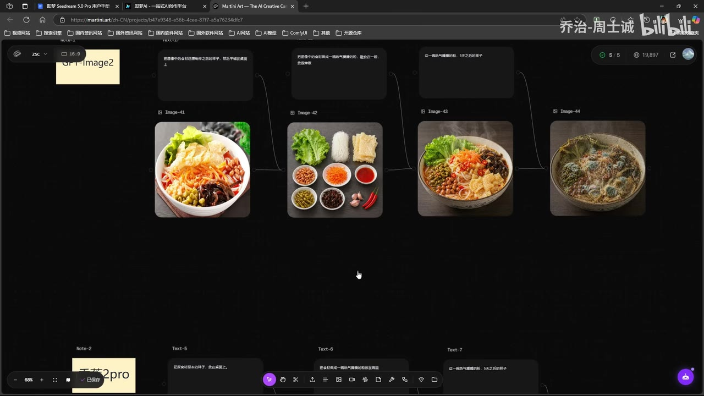
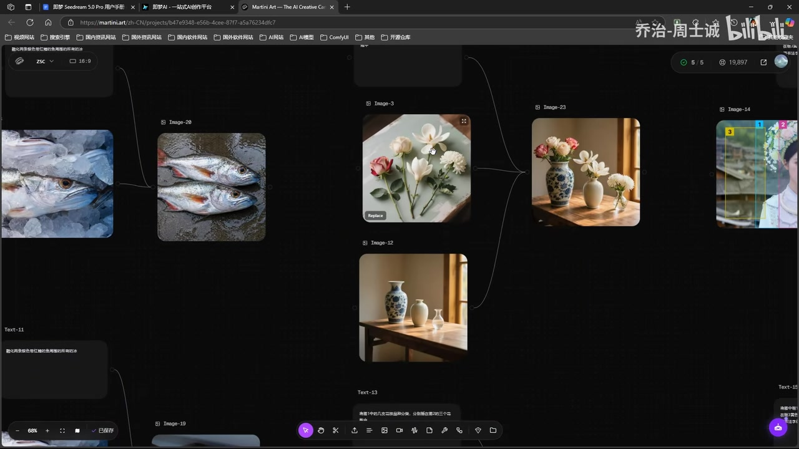

## 小结

本视频是 UP 主乔治-周士诚对即梦（Seedream）5.0 Pro 图片模型的首发体验与横向观察，重点不在纯文生图审美，而在**基于涂抹、箭头、线条、多图输入的可控图像编辑**。视频以其长期使用的一组测试案例，对照标题中提及的 Image2 与“香蕉2”（口播中亦称 Banana，具体版本无法仅据 ASR 完全确认）。

UP 主的主要结论是：Seedream 5.0 Pro 在其有限测试集内已达到“第一梯队”水平。其较突出的场景包括局部对象移动、去文字、实体化、海报编辑、换头、多图融合、九宫格故事，以及最受肯定的**按数量进行插花**。视频认为，图片阶段的结构、位置和数量控制能力提升后，也可能有利于后续图生视频工作流中的参考图制作。

测试采用 **2K** 输出，模型每次生成 **4 张图**。UP 主的实际筛选标准是四张中有一到两张可用即可，因此视频展示的是“批量生成后选优”的工作流效果，而不是四张全部成功的稳定性证明。尤其在汽车箭头移动任务中，Seedream 5.0 Pro 的四张结果并非全部成功。

视频明确指出的短板是**去水印后的清晰化**和**从严重模糊图恢复清晰图**：UP 主称自己重复测试后仍发现较高翻车概率。风格迁移虽然可用，但效果相对保守，色彩不会明显转向高饱和、强风格化方向。

视频没有公开完整提示词、原始图片、随机种子、所有四图输出、生成耗时、额度／价格和统一评分标准；Image2、Banana／香蕉2的精确版本也未被完整确认。因此，“最强”“第一梯队”“强于某模型”等应理解为 UP 主基于个人测试案例和工作流的体验判断，不构成可复现的行业排名。

本期内容具有时效性。视频涉及的 Seedream 5.0 Pro、相关文档、多图引用交互、生成额度和模型能力，均可能在视频发布及素材抓取后发生更新。适合需要制作 AI 视频参考图、海报、商品视觉图或局部编辑图片的创作者，将视频中的案例作为试用清单，而非直接作为模型选型定论。

## 思维导图

## 目录

- [发布背景与能力定位](#发布背景与能力定位)
- [官方案例：视觉标记、海报与文字](#官方案例视觉标记海报与文字)
- [既有测试集与横向参照](#既有测试集与横向参照)
- [Seedream 5.0 Pro 实测结果](#seedream-50-pro-实测结果)
- [可复用测试步骤与经验](#可复用测试步骤与经验)
- [结论、限制与时效性](#结论限制与时效性)
- [字幕比对](#字幕比对)
- [评论分析](#评论分析)
- [处理记录](#处理记录)

# 首发 Seedream 5.0 Pro 最强图片模型发布 VS 香蕉2 Image2 评测

> 来源：[Bilibili 视频](https://www.bilibili.com/video/BV1WLMG6FEPW)  
> UP 主：乔治-周士诚  
> 分区收藏：AIcode  
> 视频时长：4 分 44 秒  
> 素材抓取时间：2026-07-13  
> 视频简介中的模型文档：[Seedream 5.0 Pro 用户手册](https://bytedance.larkoffice.com/wiki/UxWuwL7d2izERGkZJA7cj2GTnye)

## 发布背景与能力定位 [00:00](https://www.bilibili.com/video/BV1WLMG6FEPW?t=0)

UP 主开场表示，即梦的 Seedream 5.0 Pro 已上线。本期聚焦其图片编辑能力是否更加“可控”，而不是仅比较单张图片的美观程度。

视频中的“可控”主要包括以下能力：

- 在原图指定区域涂抹后进行局部改动；
- 借助箭头表达物体移动方向或目标位置；
- 通过简单线条表达想要生成或替换的对象；
- 在多张输入图片之间引用主体、风格或局部元素；
- 对对象数量、布局、位置和风格进行限制。

UP 主将图片可控性与后续视频生成工作流联系起来：先让图片中的主体、构图、位置和关键物体稳定下来，再将其作为视频生成的参考图，理论上更有利于控制后续画面。视频口播中出现了被 ASR 识别为“Cdance”的名称；结合上下文，本文仅将其理解为与 Seedance／后续视频生成有关的工作流方向，不把具体产品版本、功能或已经实现的能力视为已证实事实。

## 官方案例：视觉标记、海报与文字 [00:10](https://www.bilibili.com/video/BV1WLMG6FEPW?t=10)

UP 主先查看官方示例，认为此次版本最明显的变化是编辑可控性提升。视频强调，箭头、标识、涂抹区域等视觉指令可以帮助模型理解用户的局部修改意图。

> 图：该关键帧显示官方示例中的玩偶场景，左图带有箭头、圈选和涂抹标记，右图为编辑结果。它直观说明视频所说的“可控编辑”包含视觉标记，而非仅依赖自然语言提示词。

UP 主还提到，在具有“中国化”视觉形式或复杂本地化元素的图像中，许多模型可能出现理解或编辑错误；而官方案例试图显示 Seedream 5.0 Pro 可以通过较简单的线条标记，完成用户想要的局部结果。视频未对“中国化形式”作出明确技术定义，也没有给出与其他模型的同条件统计比较。

除局部编辑外，视频还浏览了知识类图片、信息图、海报设计和文字相关案例。UP 主提到模型支持更多语种，但没有针对语言范围、错别字率、字体一致性、排版稳定性或中文长文本准确率展开独立测试。

> 图：该关键帧展示带有人物照片、统计数据、图标和多段文字的信息图海报。它说明官方案例覆盖海报与知识类视觉内容；但该画面仅是官方示例浏览，不能据此推断文字内容已被 UP 主逐项验证准确。

视频简介提供了 Seedream 5.0 Pro 的文档地址。该文档是否仍可访问、与录制时模型版本是否一致，以及其中规则是否已经更新，需要以实际访问时的官方页面为准。

## 既有测试集与横向参照 [01:15](https://www.bilibili.com/video/BV1WLMG6FEPW?t=75)

在开始 Seedream 5.0 Pro 测试前，UP 主展示自己的常用测试案例，并称这套案例长期用于测评图片模型，因此对结果较敏感。

标题中写有“香蕉2 Image2”，ASR 则出现“本拿”“A面质 2.0”等误识别。根据标题与语境，正文将对照对象暂记为：

- **Image2**：标题中明确出现；
- **Banana／香蕉2**：标题出现“香蕉2”，但口播具体版本无法完全确认；
- **Seedream 5.0 Pro**：本期主要测试对象。

视频中涉及的测试项目如下。

| 测试类别 | 视频任务 | 主要观察点 |
| --- | --- | --- |
| 物体移动 | 给汽车画箭头，要求移动到指定位置 | 是否理解方向、位置与主体保持 |
| 线条转实体 | 将线条或抽象轮廓转为实体效果 | 结构理解与物体合理性 |
| 清晰化 | 模糊图变清晰、去水印后增强清晰度 | 细节是否可信、是否重绘或变形 |
| 风格迁移 | 将图片变换到另一种风格 | 主体保留与风格强度 |
| 物体融化 | 让鱼等对象产生融化或化开效果 | 局部形变自然度 |
| 插花 | 根据花材与花瓶完成插花 | 数量、位置与融合效果 |
| 海报制作 | 移动元素、添加文字 | 版式与图文关系 |
| 换头 | 将一张图的人头换到另一张图中 | 风格一致性与人物结构 |
| 九宫格故事 | 根据一张图生成九宫格叙事 | 分镜连续性与主体一致性 |

> 图：该关键帧展示一碗面、拆分出的食材、重新组合后的面以及变质状态的结果。它体现 UP 主的测试包含连续编辑链路，而不是只观察一张最终成图。

UP 主展示部分既有对照结果时称，Image2 在“画箭头把车移过来”的示例中完成了任务，而 Banana 的同类结果失败。该结论仅对应视频展示的个案；视频未提供所有生成批次、输入条件与重复次数，不能推广为两个模型在全部场景下的稳定排序。

## Seedream 5.0 Pro 实测结果 [02:00](https://www.bilibili.com/video/BV1WLMG6FEPW?t=120)

### 生成设置与筛选标准 [02:00](https://www.bilibili.com/video/BV1WLMG6FEPW?t=120)

UP 主进入即梦 Seedream 5.0 Pro 后，以 **2K** 规格开始测试。根据视频可确认的参数只有“2K”；未展示或未说明以下信息：

- 图像长宽比；
- 原始提示词全文；
- 负面提示词；
- 固定随机种子；
- 采样参数；
- 单次生成耗时；
- 消耗额度或价格；
- 是否使用额外参考图控制参数。

视频明确表示，每轮会得到 **4 张图片**。UP 主认为四张中有部分结果跑偏是正常现象，只要能选出一张可用图即可；在一些任务中，他认为四张中有一到两张成功就可以接受。

这意味着本视频评价标准更接近实际创作中的“多图生成—人工挑选”流程。若要衡量模型稳定性，则不能只看挑出的最佳图，还应统计每轮四张中的成功数量和失败类型。

### 食材拆解、重组与“放五天后” [02:10](https://www.bilibili.com/video/BV1WLMG6FEPW?t=130)

首个核心测试是将“一碗面”拆成食材，再用食材重组成一碗面，最后生成这碗面“放五天之后”的状态。

UP 主对其中部分输出评价较好，尤其认可前两张食材拆解结果，以及由食材重新生成的一碗面。该任务实际同时考察：

1. 是否能从成品食物中识别可见食材；
2. 是否能将食材按合理方式组合回成品；
3. 是否能让同一对象呈现时间变化后的状态；
4. 连续多步编辑时，是否保留主体身份与画面关系。

不过，“放五天后”的结果并不能证明模型具备真实食品腐败过程的模拟能力。视频没有给出物理真实性判断标准，也没有展示每轮四图的完整结果；可确认的仅是 UP 主对选定样图的主观正面评价。

### 箭头移动、删字、实体化与风格迁移 [02:40](https://www.bilibili.com/video/BV1WLMG6FEPW?t=160)

UP 主继续用自己的经典案例测试 Seedream 5.0 Pro。

- **汽车按箭头移动**：展示结果中有成功样张，也有失败样张。UP 主的结论是，四张中出现一到两张符合预期即可接受。
- **去除文字**：视频展示了删除图中文字的编辑任务。
- **变成实体**：视频提到将线条转成实体效果。
- **风格迁移**：UP 主认为结果不错，但整体比较保守，没有变得非常鲜艳。
- **去水印后清晰化**：此处被评价为较容易翻车。
- **严重模糊图清晰化**：UP 主称自己多次测试后，认为 Seedream 5.0 Pro 在此类任务上的表现不够好。

因此，视频给出的边界很明确：该模型的局部编辑和对象控制可以获得可用结果，但严重模糊图的细节恢复并不稳定。对于清晰化任务，还应额外判断模型是否只是生成了“看起来更清楚”的新细节，而非忠实恢复原始图像细节。

### 精确插花：视频最肯定的案例 [03:12](https://www.bilibili.com/video/BV1WLMG6FEPW?t=192)

插花是 UP 主在视频中评价最高的测试之一。他先让观众数花朵，再测试是否能将指定花材准确插入花瓶。

UP 主称，自己此前测试的 Image2 与 Banana 未能实现足够精准的插花；而 Seedream 5.0 Pro 的插花结果让他感到“惊艳”，并认为四张输出几乎都没有翻车，尤其在花朵数量控制方面表现较好。

> 图：该关键帧同时显示花材图片、空花瓶图片和插花后的成品图片。它直接对应视频中的“精确插花”任务，可用于观察多张输入图如何被合成为一个具有明确摆放关系的画面。

视频没有完整公布插花的提示词、目标数量、逐张验收标准及全部生成批次。因此，“精准插花”属于 UP 主基于演示样图的观察。更严格的复测应将成功判定拆分为：花朵数量正确、插入位置正确、花瓶结构完整、花材形态自然、背景未被错误改写。

### `@` 图片引用、换头、海报与九宫格 [03:35](https://www.bilibili.com/video/BV1WLMG6FEPW?t=215)

UP 主介绍了此版本的一种多图引用逻辑：编辑时可通过类似 `@图1` 的方式直接选定某一张图。他认为，这比自然语言中反复描述“图一中的什么”“图二中的什么”更准确。

视频中没有展示完整指令文本或所有界面步骤，因此不能确认具体语法必须写作何种形式；可以确认的是，UP 主认为“按图片编号直接引用”有助于降低多图指代歧义。

后续展示的任务包括：

1. **换头**：将一张图像中的头部换到另一图人物上，同时尽量保持原画面的风格；
2. **海报制作**：将对象移动到指定位置并添加文字，UP 主认为表现不错；
3. **九宫格故事**：基于一张图生成故事型九宫格，UP 主评价“挺 OK”。

这些案例反映出 Seedream 5.0 Pro 被 UP 主视为可用于制作视觉素材和视频参考图的工具。但视频没有对肖像权、版权素材、商标、水印处理、商业授权或平台内容规范作测试或讨论，实际使用仍需另行遵守产品规则与素材授权要求。

## 可复用测试步骤与经验 [03:55](https://www.bilibili.com/video/BV1WLMG6FEPW?t=235)

以下步骤根据视频实际展示的工作流整理，其中视频未提供的信息不作补充假设。

1. **准备固定测试素材。**  
   选用同一批原图、相同编辑目标和相同验收条件，覆盖对象移动、局部删除、线条实体化、风格迁移、清晰化、融化效果、数量控制插入、海报编辑、换头和九宫格等任务。

2. **使用 Seedream 5.0 Pro，并选择 2K 输出。**  
   视频仅明确说明了 2K。复测时应自行记录实际尺寸、比例、模型档位、生成时间和消耗成本。

3. **在空间编辑中加入箭头、圈选或涂抹。**  
   对“把某物移到哪里”“修改哪个局部”等需求，使用视觉标记与文字指令结合。视频认为这类标记是本次可控性提升的重要使用方式。

4. **多图任务直接引用指定图片。**  
   若当前产品界面支持类似 `@图1` 的图片引用，可直接指向目标输入图，减少“图一里的某个物体”这类长文本指代可能带来的歧义。实际语法应以产品界面和官方文档为准。

5. **保留每轮全部四张输出。**  
   不应只保存最佳图。建议同时记录：
   - 四张中成功张数；
   - 失败的具体原因；
   - 是否存在主体漂移、位置错误、数量错误、结构破碎或文字错误；
   - 是否需要二次编辑；
   - 最终选图理由。

6. **将“最佳样张质量”和“批次成功率”分开评价。**  
   视频的工作流允许四张中只选一张。若目标是生产交付，应进一步统计可用率，避免将一张优秀结果误认为整体稳定性。

7. **对严重清晰化需求重复测试。**  
   视频已指出严重模糊图清晰化与去水印后增强存在较高翻车概率。此类场景应多轮生成，并检查结构、文字、人脸和边缘是否被模型虚构性重绘。

8. **对数量控制类任务制定验收表。**  
   以插花为例，至少分别确认花材数量、位置、朝向、花瓶边缘、背景稳定性和整体自然度，而不只凭“看起来好看”判断是否成功。

9. **用于视频前先检查参考图一致性。**  
   如果计划将成图用于后续视频生成，应优先选取主体轮廓清晰、关键物体明确、文字较少、局部结构未破碎的图片。视频提出了“图片可控有助于视频生成”的方向，但并未实际展示由这些图片生成的视频成片。

## 结论、限制与时效性 [04:25](https://www.bilibili.com/video/BV1WLMG6FEPW?t=265)

UP 主最终认为 Seedream 5.0 Pro 已经达到“第一梯队”，并表示这次结果“确实不错”。其判断的主要依据包括：

- 局部编辑与箭头移动任务能在部分输出中成功；
- 去文字、实体化、风格转换等任务可获得可用样张；
- 换头和海报合成表现被评价为不错；
- 九宫格故事生成达到可接受水平；
- 插花任务中的数量与位置控制最受肯定；
- 一次四张的生成方式支持筛选出可用图。

但视频同样呈现了重要限制：

| 限制 | 视频证据或缺失信息 | 对实际使用的影响 |
| --- | --- | --- |
| 非全图稳定成功 | 四张中会有失败或跑偏结果 | 需要人工挑选和重试 |
| 清晰化容易翻车 | UP 主称多次测试后仍不理想 | 不宜直接用于高要求修复任务 |
| 风格迁移偏保守 | 色彩不够艳丽 | 强视觉风格需求可能需额外迭代 |
| 对比条件不完整 | 未公开所有模型版本、提示词和种子 | 无法形成严格横评结论 |
| 生成成本未知 | 未提供时间、积分、价格与并发信息 | 无法判断生产效率 |
| 样本规模有限 | 基于 UP 主案例与展示结果 | 不代表全部题材和提示词表现 |
| 后续视频能力未实测 | 仅提出图片可控对视频有帮助 | 不能等同于视频生成效果已验证 |

因此，较稳妥的结论是：**若创作需求集中于局部修改、多图融合、对象位置控制、海报组合和视频参考图制作，Seedream 5.0 Pro 值得纳入试用名单；若需求集中于严重模糊图修复、绝对稳定的批量交付或严格量化的模型排名，则必须按自身素材、提示词与成本条件进行复测。**

标题中的“最强图片模型”属于标题表达，视频本身提供的是有限任务集上的体验型证据。模型版本、功能入口、文档内容和生成机制可能随时间变化，本文不将视频发布时的描述外推为永久能力结论。

## 字幕比对 [04:35](https://www.bilibili.com/video/BV1WLMG6FEPW?t=275)

本次 ASR 已执行。站内字幕未能获取到可用文本，因此正文以 ASR 为主要口播依据，并结合视频标题、简介、关键帧和上下文对高置信名词作有限校正。

| 字幕来源 | 完整性 | 专有名词 | 时间轴 | 主要问题 |
| --- | --- | --- | --- | --- |
| Bilibili 站内字幕 | 未提供可用字幕 | 无法评估 | 无法评估 | 字幕工具报错：`Missing JSON resource URL`，未获取到站内字幕内容。 |
| 本次 ASR 字幕 | 覆盖主要口播内容 | 存在多处同音或近音误识别 | 未提供逐句时间戳，仅能依据内容估算段落位置 | 模型名、产品名及术语出现误识别，如“吉梦”“本拿”“A面质”“Cdance”“羽种”等。 |

重要校正如下。

| ASR 写法 | 正文处理 | 校正依据与不确定性 |
| --- | --- | --- |
| 吉梦 | 即梦／Seedream 5.0 Pro | 视频标题、简介模型文档和上下文均指向该模型；高置信。 |
| A面质 2.0 | Image2 | 视频标题中明确含有 `image2`；高置信。 |
| 本拿 | Banana／香蕉2 | 标题中出现“香蕉2”，ASR 口播出现近音词；具体产品版本不完全确定。 |
| Cdance | 与 Seedance 相关的后续模型或工作流 | 语境涉及图片可控与后续视频生成；不确认具体版本和技术关系。 |
| 羽种 | 多语种 | 前后文讨论文字和语言支持；未外推具体语言范围。 |
| 插滑 | 插花 | 上下文为数花朵、将花插入花瓶；高置信。 |
| 石井 | 实体 | 上下文为“线条转实体效果”；高置信。 |

字幕选择结论：**站内字幕不可用，本次 ASR 已执行并作为主体文本来源；正文仅对标题、简介和画面能够支持的高置信信息进行校正，对产品版本和技术归属无法确认的部分保留不确定性。**

## 评论分析 [04:45](https://www.bilibili.com/video/BV1WLMG6FEPW?t=284)

仅分析素材中可获取的热评前三条。以下均为评论者个人观点或体验，不应替代视频证据或模型基准测试。

1. **雷古洛斯-科尼亚斯，2 赞**  
   > “NSFW很强[doge]”

   该评论认为模型在 NSFW 相关内容上表现强，但没有给出样图、测试条件、功能定义或版本信息。视频正文没有测试这类内容，也没有讨论平台安全策略，因此该说法无法验证，且实际使用还受产品内容规范约束。

2. **青笙挽歌如梦，28 赞**  
   > “进步明显，与香蕉2互有胜负，略弱于image2[星星眼]”

   评论者认为模型进步明显，与香蕉2各有胜负，但整体略弱于 Image2。这与视频中“Seedream 5.0 Pro 已进入第一梯队”的体验判断大体可并存，但视频没有提供足以证明“整体略弱于 Image2”的大样本数据。该评论可视为社区中的相对体验观点，不能视为确定排名。

3. **忘-月，5 赞**  
   > “真实感强于nanobanana，稍逊于GPT，但不会出现GPT破碎感的问题，出图整体符合物理视角。出的图可以直接用到seedance2里面生成视频，我怀疑就是seedance2的视频模型应用到图片上了。在视频参考图制作上，整体体验要优于目前的其他图片模型。”

   此评论补充了真实感、物理视角、视频参考图制作和模型技术来源等看法。其中，“可以直接用到 Seedance2 里面生成视频”与视频提出的图片—视频工作流方向一致，但视频没有展示实际视频生成结果；“我怀疑就是 Seedance2 的视频模型应用到图片上”是评论者明确标注为猜测的技术推断，不能作为模型架构或技术来源事实。

## 处理记录 [04:44](https://www.bilibili.com/video/BV1WLMG6FEPW?t=284)

- **Worker ID**：`worker-mrj0wbly-5dc4e50c`
- **模型**：`gpt-5.6-terra`
- **素材依据**：任务提供的视频元数据、视频描述、ASR 字幕、关键帧、热评前三条和素材处理记录。
- **已知素材产物**：`merged.mp4`、`audio/audio.wav`、`frames/`、`info.json`、`comments/comments.json`、`asr/`。
- **站内字幕获取情况**：未提供可用站内字幕；工具告警为 `subtitles: Tool process exited with code 1. [video-tool] Missing JSON resource URL.`。
- **字幕选择**：本次 ASR 已执行。因站内字幕不可用，采用 ASR 作为主体，并结合标题、简介、上下文和关键帧校正高置信术语；无法确认的版本名与技术关系均保留不确定性。
- **关键帧选择依据**：
  - `frames/frame-001.jpg`：含箭头、圈选、涂抹与编辑结果，直接说明可控局部编辑；
  - `frames/frame-002.jpg`：展示信息图式海报，支撑视频提到的知识类图片和海报制作方向；
  - `frames/frame-003.jpg`：展示面条拆解、食材重组与状态变化，说明连续编辑链路；
  - `frames/frame-004.jpg`：展示花材、花瓶与插花结果，直接支撑视频最重点肯定的插花任务。
- **热评处理范围**：严格限制为可获取的热评前三条，未分析其他评论、回复或弹幕。
- **缓存清理**：任务素材中未提供缓存清理执行日志或结果；无法确认是否完成缓存清理，故不表述为已完成。
- **未解决问题**：缺少逐句 ASR 时间戳、完整提示词、全部四图输出、固定随机种子、生成耗时、成本信息、Image2 与 Banana／香蕉2的精确版本，以及同条件大样本横向测试数据。

## 评论分析

本次流程未获取到可用热评，因此不推断观众态度或额外结论。
