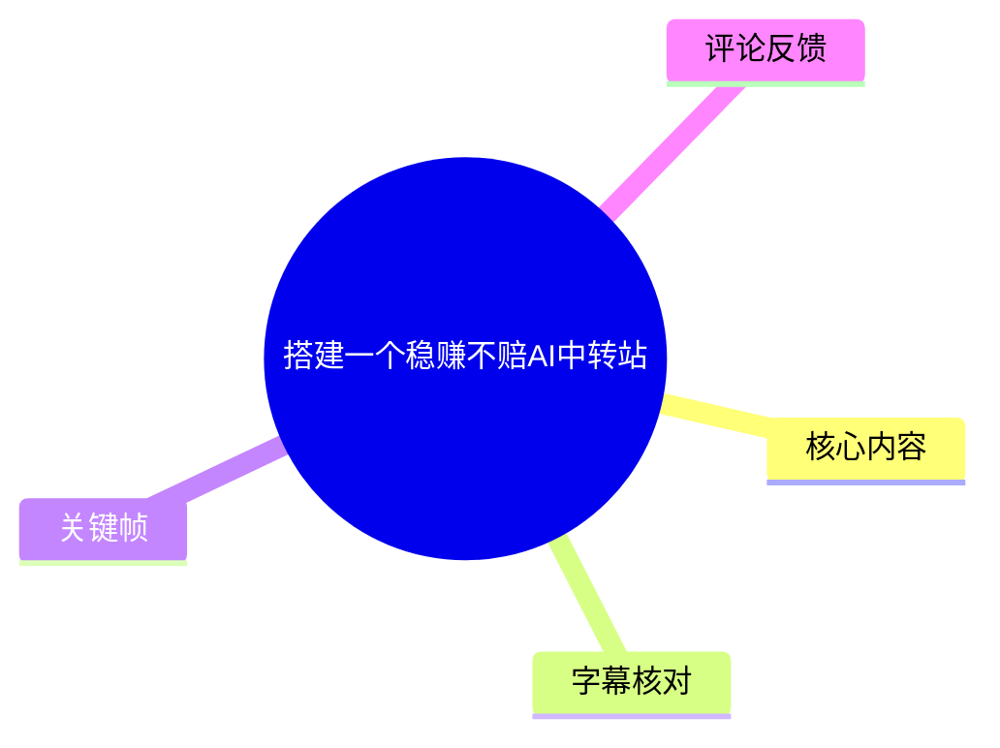
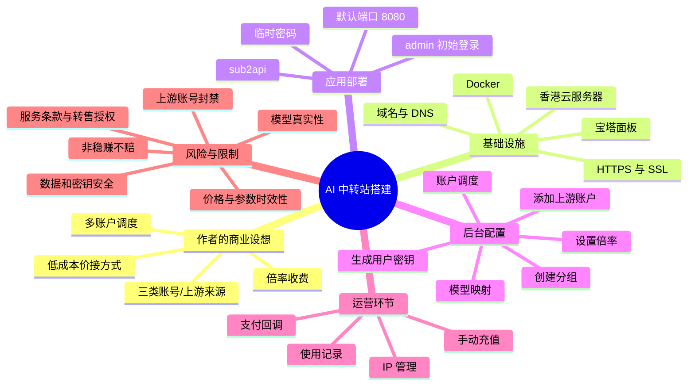
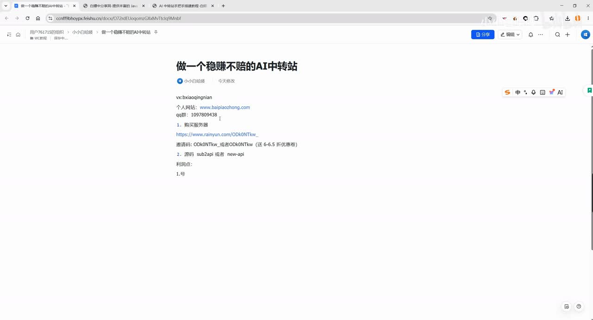
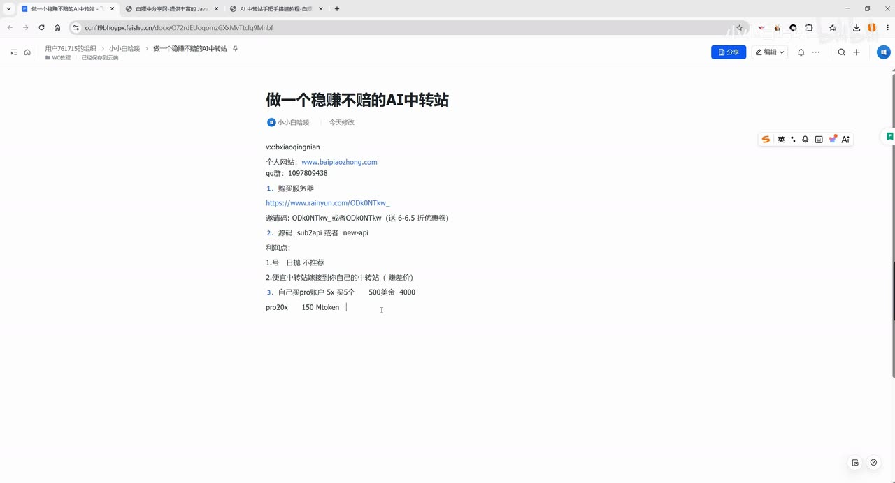
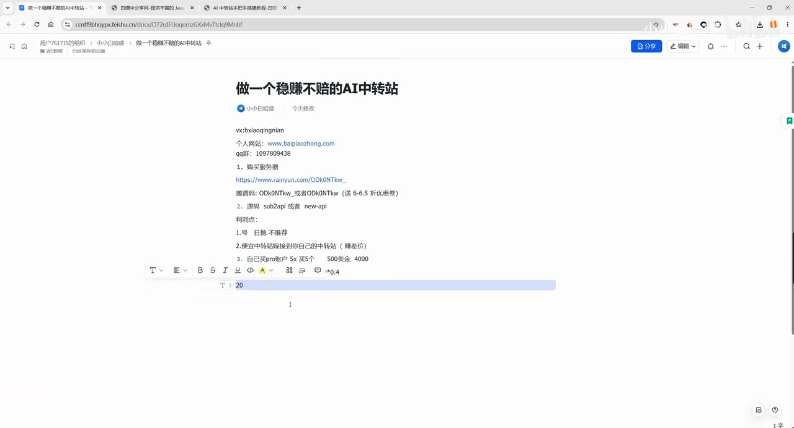

# 搭建一个稳赚不赔AI中转站

> 来源：[Bilibili 视频](https://www.bilibili.com/video/BV1kZEH6mEcG)<br>
> UP 主：小小白哈喽｜时长：22:01｜合集：AIcode  
> **重要提示**：视频标题及口播使用“稳赚不赔”表述，但这属于作者的营销性/经验性判断，并非已验证的财务结论。账号封禁、上游价格变化、服务条款、支付合规、模型真实性、用户投诉与基础设施故障均可能造成损失或责任。

## 小结

视频讲解了作者设想的“AI 中转站”搭建与收费模式：在一台云服务器上部署 `sub2api`，通过域名、反向代理和 SSL 证书提供 HTTPS 访问；随后在后台创建分组、设置倍率、添加上游 API 账户、启用调度，并向终端用户发放 API Key 或积分。

作者将货源分为三类：自行注册/持有账号、接入其他中转站的低价 API、直接购买多个高倍率账户。其中，作者更偏向第二种“价接/对接其他中转站”的轻资产方式：用多个上游账户分散风险、按使用量加价转售，并在单个上游失效时由调度切换至其他上游。作者认为这能降低前期投入，但这不等于风险消失，而是把一部分供给风险转移给上游。

技术路径的关键前提是：视频所用 `sub2api` 被作者描述为需要 HTTPS，因此不能仅用 IP 访问；需要购买域名、将 DNS 记录指向服务器公网 IP、在宝塔面板添加反向代理至 `127.0.0.1:8080`，并申请 SSL 证书。视频未逐字给出 Docker 部署命令，只展示从项目 GitHub/Docker 页面复制“一键部署”命令后在宝塔终端执行。

视频中的价格、模型名、倍率、账户供给、优惠券、服务器配置与回本周期都具有很强时效性，且 ASR 对数字与专有名词有较多误识别。例如口播中可辨识出“Pro 20X”“150M Token”“0.4”等估算参数，但其计费单位、上游能力和可持续性均未被独立验证。因此，本文将其标注为**作者口径**，不将其视为投资建议或稳定收益承诺。

从合规与工程角度看，最需警惕的不是“能否部署”，而是上游授权边界：若将个人订阅、试用资格、非商业 API Key 或未获转售许可的账户用于多人转售，可能违反上游服务条款，造成封禁、密钥泄露、数据泄露、退款纠纷或资金损失。评论区中也有人质疑部分中转站可能使用虚假模型名或低能力模型冒充高版本模型；视频本身没有提供模型真实性、数据隔离或账户授权的验证证据。

## 思维导图





## 目录

- [背景、模式与收益口径](#背景模式与收益口径-0001)
- [基础设施：服务器、宝塔与 Docker](#基础设施服务器宝塔与-docker-0385)
- [域名、DNS、反向代理与 HTTPS](#域名dns反向代理与-https-0497)
- [部署 sub2api 并完成初始登录](#部署-sub2api-并完成初始登录-0621)
- [分组、倍率与用户 API Key](#分组倍率与用户-api-key-0903)
- [接入上游账户、模型限制与调度](#接入上游账户模型限制与调度-1039)
- [计费、充值与支付](#计费充值与支付-1270)
- [风险、限制与时效性](#风险限制与时效性-0001)
- [字幕比对](#字幕比对)
- [评论分析](#评论分析)
- [处理记录](#处理记录)

## [背景、模式与收益口径](https://www.bilibili.com/video/BV1kZEH6mEcG?t=1) `00:01`

视频开头，作者说明已有自己的中转站，并称后续会在个人网站更新相关内容。其核心目标是让观看者理解中转站的“利润点”，并按作者的说法以较低成本运营服务。



> 图：关键帧显示作者在文档页面整理“做一个稳赚不赔的 AI 中转站”的内容提纲，包括服务器、源码/程序及“利润点”等。它有助于确认本视频主要是屏幕演示型教程，而非对模型或财务数据进行独立测评。

### [三种上游/账号路线](https://www.bilibili.com/video/BV1kZEH6mEcG?t=25) `00:25`

作者将来源概括为以下三类：

1. **自行处理账号问题**  
   作者提到“号”的获取与管理，并表示不推荐购买“零食号”“日抛号”等非自己持有的短期账号，理由是这些账号“不属于你”。视频未提供账号注册、授权取得或平台许可的完整做法。

2. **接入其他中转站（作者重点推荐）**  
   当无法自行取得账号时，作者建议购买价格较低的中转站 API 并再对外提供服务。作者的逻辑是：选择多个较便宜的上游，每个账户只充值较小金额，以降低单点故障的资金暴露；本地中转站负责账户调度和二次收费。

3. **直接购买多个账户并自行销售**  
   作者称此方式利润可能较高，但启动成本与账号封禁风险更高。其举例称可购买多个“5X”账户，提及“500 美金”“约 3,000～4,000 元”等成本量级；这些均为作者在视频中的估算口径，未提供可验证报价来源。

### [作者的回本算式与其前提](https://www.bilibili.com/video/BV1kZEH6mEcG?t=129) `02:09`

作者以其曾使用的“Pro 20X”账户举例，口播中提到：

- 平均每天约使用 **150M Token**；
- 按 7 天限额和“0.4”这一价格/倍率口径进行估算；
- 口播呈现的计算形式接近 `150 × 7 × 0.4`；
- 作者称一个账户可在首周回收“大半成本”，约两周大概率回本；
- 作者同时承认核心不确定性在于第二、三周账户是否会被封。

需要特别区分：

- **视频事实**：作者确实提出上述数字和回本判断。
- **不可验证部分**：`150M` 的具体单位、`0.4` 的计价单位、账户实际能力、上游模型、可售价格、客户留存及封禁概率，素材中都没有可审计证据。
- **直接风险**：账户被封、上游拒绝服务、用户并发超预期、售后退款、支付通道冻结等都会使估算失效。

### [轻资产“价接”模式](https://www.bilibili.com/video/BV1kZEH6mEcG?t=357) `05:57`

作者把“价接其他中转站”描述为更低风险的方案：

- 找多个低价中转站；
- 每个上游账户预存小额余额，口播示例为每账户约 20 元；
- 总前期投入被作者描述为不足约 200 元，加上服务器成本；
- 对自己的用户按更高倍率或单价收费；
- 通过多个上游账户调度，在一个账户余额耗尽或不可用时切换。

该方案的实际含义是**转售上游 API 供给**，因此至少需要确认：

- 上游是否明确允许转售、代理、多租户使用；
- 自己是否有权使用并再分发相关模型名称与能力；
- 用户数据是否会被上游记录或用于训练；
- 充值余额是否可退、是否存在最低消费或封禁清零；
- 上游是否会在高峰期限流，导致终端用户体验和退款压力。

## [基础设施：服务器、宝塔与 Docker](https://www.bilibili.com/video/BV1kZEH6mEcG?t=385) `06:25`

作者随后进入部署流程，采用“云服务器 + 宝塔面板 + Docker + sub2api”的组合。

### [服务器选型口径](https://www.bilibili.com/video/BV1kZEH6mEcG?t=385) `06:25`

作者建议：

- 地域选择香港；
- 不选择美国或东京节点；
- 规格可选择 **2 核 2G**，若无货则选择 **2 核 4G**；
- 建议购买约 3 个月，并称优惠券后服务器投入约 100 元。

这些是视频中的个人推荐，并不构成通用性能基准。实际规格应根据以下因素判断：

| 因素 | 对资源的影响 |
| --- | --- |
| 仅做 API 转发 | CPU、内存压力通常较低，但网络与稳定性更重要 |
| 用户数量和并发 | 并发请求、长连接、日志写入会提高资源需求 |
| 容器数量 | Docker、数据库、监控与反向代理同时运行会占用内存 |
| 访问地域 | 用户网络路径、跨境网络波动和合规要求可能比 CPU 更关键 |
| 安全防护 | WAF、日志保存、备份和监控会增加运维复杂度 |

### [宝塔面板与 Docker](https://www.bilibili.com/video/BV1kZEH6mEcG?t=437) `07:17`

作者的实际操作顺序为：

1. 购买并等待服务器默认安装系统；
2. 在服务器管理页面打开宝塔面板；
3. 使用面板显示的账号和密码登录；
4. 在宝塔的软件/应用区域找到 Docker；
5. 点击“立即安装”，按默认选项完成安装。



> 图：关键帧中的文档条目列出“购买服务器”以及“源码 sub2api 或者 new-api”等准备方向。它补充了口播的部署前置条件，也显示作者曾将不同程序作为可选方案；但实际操作演示使用的是 `sub2api`。

视频对 Docker 的解释是“独立、方便”。从工程实践看，还应补充但视频未展开的事项：

- 固定镜像版本并记录镜像来源；
- 不要直接暴露 Docker 守护进程；
- 配置容器重启策略、磁盘日志轮转和备份；
- 限制管理后台访问来源；
- 在升级前备份数据库、配置文件、密钥和反向代理配置。

## [域名、DNS、反向代理与 HTTPS](https://www.bilibili.com/video/BV1kZEH6mEcG?t=497) `08:17`

### [为什么需要域名与 HTTPS](https://www.bilibili.com/video/BV1kZEH6mEcG?t=497) `08:17`

作者称其使用的 `sub2api` 在安全方面要求 HTTPS，“用 IP 不行”，因此需要购买域名并部署 SSL 证书。根据视频演示，HTTPS 是该方案的必要配置之一。

作者建议购买 `.com` 域名，并演示在域名交易/注册平台中按价格排序，提到可能存在约 8 元的域名。域名价格、续费、可用性与注册规则均随时间变化，不能据此视为当前报价。

### [DNS 解析](https://www.bilibili.com/video/BV1kZEH6mEcG?t=560) `09:20`

作者演示的 DNS 操作要点：

1. 进入域名管理中心；
2. 打开“我的域名”中的解析管理；
3. 添加解析记录；
4. 在主机记录处填写子域名前缀。作者示例使用类似 `zd` 的前缀，表示“中转站”；
5. 将记录值填写为云服务器的公网 IP；
6. 保存并等待 DNS 生效；
7. 记录最终访问域名。

可以抽象为：

```text
记录类型：A（视频口播未明确说出类型，但“记录值填服务器 IP”的操作符合 A 记录用途）
主机记录：例如 zd
记录值：服务器公网 IPv4
最终地址：https://zd.你的域名/
```

> 视频没有展示 DNS 生效时间、TTL、IPv6 配置或解析验证命令。实际部署时应使用 DNS 查询工具确认解析已生效，再申请证书。

### [反向代理至本地 8080](https://www.bilibili.com/video/BV1kZEH6mEcG?t=783) `13:03`

作者说明应用部署后可通过域名加默认端口访问，端口为 **8080**。然后在宝塔的“网站”或反向代理设置中添加代理，将域名流量转发至：

```text
127.0.0.1:8080
```

作者演示的结构可整理如下：

```text
用户浏览器 / API 客户端
        │
        ▼
https://子域名.example.com
        │
        ▼
宝塔 Web 服务 / 反向代理
        │
        ▼
127.0.0.1:8080（sub2api 容器或本地服务）
```

将应用绑定至回环地址并通过反向代理统一提供 HTTPS，通常优于直接将 `8080` 暴露到公网；但视频没有展示防火墙规则。实际应避免将管理端口和不必要的容器端口直接开放到互联网。

### [SSL 证书申请与 HTTPS 验证](https://www.bilibili.com/video/BV1kZEH6mEcG?t=819) `13:39`

作者在宝塔中申请证书，绑定账户后为网站安装 SSL，并再次通过 `https://` 访问验证站点可用。视频强调“必须是 HTTPS”。

操作完成后，至少应检查：

- 域名访问是否自动跳转 HTTPS；
- 证书覆盖的域名是否与实际访问域名一致；
- 证书自动续期是否启用；
- HTTP 是否需要关闭或仅保留跳转；
- 管理员登录页、API 请求及回调地址是否均通过 HTTPS；
- 证书私钥、面板账户和 API Key 是否未暴露在截图、日志或公开仓库中。

## [部署 sub2api 并完成初始登录](https://www.bilibili.com/video/BV1kZEH6mEcG?t=621) `10:21`

### [从 GitHub/Docker 页面执行部署](https://www.bilibili.com/video/BV1kZEH6mEcG?t=621) `10:21`

作者进入 `sub2api` 的官网/GitHub 页面，定位到 Docker 的“一键部署”说明，随后：

1. 在宝塔中打开终端；
2. 复制项目文档中的第一条创建命令并执行；
3. 复制下一条部署命令并执行；
4. 等待安装过程完成；
5. 以终端输出的成功状态判断安装成功。

视频**没有完整、清晰地提供可供核对的命令文本**，因此不能据此重建或编造 Docker 命令。应以目标项目当前官方文档、已审查的发布版本和许可证为准，而不是盲目复制视频中的命令。

### [初始账户、临时密码和默认端口](https://www.bilibili.com/video/BV1kZEH6mEcG?t=723) `12:03`

作者称安装成功后，终端会生成临时密码；默认用户名为：

```text
admin
```

作者建议将临时密码记录在本地文本工具中，并通过域名加端口访问服务。视频所述默认端口为：

```text
8080
```

安全上，首次登录后不应只“记录密码”，而应立即：

1. 修改默认管理员密码；
2. 删除或妥善销毁含明文密码的临时文本；
3. 配置强密码和多因素认证（若软件支持）；
4. 限制后台访问 IP 或使用 VPN/零信任访问；
5. 更换默认管理路径或加额外访问认证（若适用）；
6. 检查应用日志中是否记录用户 API Key；
7. 对配置和数据库进行加密备份。

## [分组、倍率与用户 API Key](https://www.bilibili.com/video/BV1kZEH6mEcG?t=903) `15:03`

### [分组的作用](https://www.bilibili.com/video/BV1kZEH6mEcG?t=879) `14:39`

作者登录后台后，介绍“分组”是用户创建/使用密钥时可选择的服务类别。管理员创建 API Key 前，通常先创建相应分组。

作者提到的分组相关字段包括：

- 类型：示例为 OpenAI；
- 名称：作者口播中提到可写“Claude Code”等，但 ASR 对该专有名词识别不稳定；
- 倍率；
- 每分钟请求限制；
- 是否为专属分组；
- 是否允许 OAuth 账户、隐私过滤账户等选项。

视频没有解释每一项的完整语义，也没有展示具体限制值。具体字段应以当时实际软件版本为准。

### [倍率与计费逻辑](https://www.bilibili.com/video/BV1kZEH6mEcG?t=903) `15:03`

作者将“倍率”解释为用户消耗积分/余额时的扣费比例，并举例：

| 倍率 | 作者的解释 |
| --- | --- |
| `1` | 标准倍率，按 1:1 的充值/积分口径计费 |
| `0.5` | 半价 |
| `2` | 双倍扣费 |
| `0.1`、`0.2`、`0.3` | 作者称部分中转站会使用的较低扣费数值 |

作者还提出一种短时动态调价思路：当平台余额不足或供给紧张时，可能把倍率从标准值提高到 `2`，从而增加用户使用成本并“预留”资源。该做法可能导致价格不透明、用户争议和退款纠纷；若面向真实付费用户，应在服务协议、价格说明和变更通知中明确规则，而不应隐蔽调整。

### [创建用户密钥](https://www.bilibili.com/video/BV1kZEH6mEcG?t=995) `16:35`

视频中的基本顺序是：

1. 创建分组；
2. 进入 API Key/密钥相关页面；
3. 为用户或测试用途生成密钥；
4. 用户使用密钥访问该分组开放的模型和上游账户。

作者称普通用户登录后通常只能看到有限的用户侧功能，管理员侧则负责分组、账户和调度管理。



> 图：关键帧中的文档草稿写有“不推荐日抛号”“便宜中转站接到自己的中转站”“自己买 Pro 账户”等路线，以及“150M Token”“150×7×0.4”等作者估算。该画面有助于将收益表述识别为作者自拟的运营测算，而非平台官方保证。

## [接入上游账户、模型限制与调度](https://www.bilibili.com/video/BV1kZEH6mEcG?t=1039) `17:19`

### [添加上游账户](https://www.bilibili.com/video/BV1kZEH6mEcG?t=1039) `17:19`

作者介绍在“账户管理”中添加上游来源的做法。其演示内容包括：

- 选择授权方式；
- 选择 OpenAI 类型的平台；
- 选择 API Key 形式；
- 填写上游站点地址；
- 填写从上游获取的 API Key；
- 保存后进行测试。

作者强调上游地址“必须带 HTTPS”。这与此前的 HTTPS 部署思路一致，但上游是否可信、是否有转售授权、是否真实提供宣称模型，视频没有验证。

### [模型映射与白名单](https://www.bilibili.com/video/BV1kZEH6mEcG?t=1097) `18:17`

作者提到“模型映射”配置，并以“只允许某个 GPT 5.5 模型”作为示例，理由是其观察到某上游即使请求某模型，也可能自动调用另一个模型版本，影响效率。

这部分反映出一个关键运营问题：**模型名、实际模型、路由策略和输出能力可能并不一致**。因此，若提供商业服务，建议至少做到：

- 对外披露实际可用模型和可能的降级策略；
- 对关键模型进行固定提示词回归测试；
- 记录请求的目标模型、实际上游响应模型标识与错误码；
- 禁止把未知模型或兼容接口直接宣传为特定官方模型；
- 对用户说明上下文长度、工具调用、视觉能力和速率限制是否可用。

> 视频中出现的“GPT 5.5”“GPT 5.4”等名称仅是作者口播/ASR 中的称呼，未见官方模型文档、响应证据或模型卡，不应据此认定为真实、官方或等效模型。

### [账户测试、启用调度与分组授权](https://www.bilibili.com/video/BV1kZEH6mEcG?t=1178) `19:38`

作者说明添加账户后需要：

1. 对账户发起测试；
2. 确认测试显示有效；
3. 选择账户；
4. 启用“批量启用调度”；
5. 编辑账户可供哪些分组使用；
6. 为每个分组分配可用账户。

作者强调“分组下面必须有可用账户”，否则用户选择该分组时无法正常使用。其进一步举例称，可对接多个平台，每个平台预存小额余额；当一个上游挂掉或用完后，调度系统切换至另一个账户。

### [调度的真实边界](https://www.bilibili.com/video/BV1kZEH6mEcG?t=1226) `20:26`

多上游调度可以改善单点故障，但不能保证服务连续性：

| 作者的预期 | 现实中仍需验证的边界 |
| --- | --- |
| 一个账户失效后自动切换 | 切换是否会中断流式请求、工具调用或会话上下文 |
| 多个平台可分散风险 | 多个平台可能使用同一上游、同一风控规则或同一模型池 |
| 余额小、损失就小 | 小额余额不解决退款、投诉、法律责任和数据泄露风险 |
| 调度灵活即可避免亏损 | 调度不处理获客成本、坏账、税务、支付费率、运维和人工支持成本 |
| 上游模型可替代 | 不同模型的能力、价格、上下文、速率与合规性可能完全不同 |

## [计费、充值与支付](https://www.bilibili.com/video/BV1kZEH6mEcG?t=1270) `21:10`

视频最后提及后台可以查看：

- 使用记录；
- IP 管理；
- 用户充值；
- 支付配置指南；
- 商品前台/后台及回调等支付配置。

作者建议在用户量较小（口播示例为三五人）时手动设置充值；如需自动化，可以使用“易支付”或其他支付服务商。视频未提供支付接口的完整参数、密钥管理方式、回调验签规则或退款流程。

### [支付接入前的最低检查项](https://www.bilibili.com/video/BV1kZEH6mEcG?t=1294) `21:34`

对于任何自动充值和余额系统，至少应额外确认：

1. **回调验签**：不能只凭前端跳转或订单号就给余额；
2. **幂等处理**：同一支付回调重复到达不得重复加款；
3. **订单状态机**：创建、待支付、支付成功、关闭、退款、争议等状态需可追踪；
4. **金额校验**：订单金额、商户号、签名、币种、回调来源必须逐项核对；
5. **最小权限**：支付密钥不得放入前端、截图、公开仓库或普通日志；
6. **账务对账**：用户余额、上游消耗、支付流水和退款流水要可核对；
7. **用户协议**：应说明余额有效期、退款规则、模型可用性、限流与服务中断处理方式；
8. **法律与税务**：根据经营地和业务性质确认收款、发票、消费者权益、数据保护与经营资质要求。

## [风险、限制与时效性](https://www.bilibili.com/video/BV1kZEH6mEcG?t=1) `00:01`

### 视频中已经出现的限制

- 作者明确承认，购买账户的核心风险是后续周数内是否被封；
- 作者的“回本”依赖用户数量、用量、上游价格和账户可用性；
- 视频未给出完整 Docker 命令，也未展示完整源代码审计、版本号或部署日志；
- 视频未展示模型真实性验证、延迟测试、并发压测、故障演练、备份恢复或数据隔离；
- 视频对第三方中转站和上游账户的选择主要基于价格，没有给出资质、授权或安全证明；
- 自动支付部分仅作概览，没有给出回调安全与财务对账细节。

### 不应接受“稳赚不赔”结论的原因

“稳赚不赔”需要满足收入稳定、成本可控、供给连续、账户合法、支付顺畅、用户留存和责任可量化等多个条件。视频中的收益公式主要覆盖了作者假设的上游成本与用户扣费差，并未纳入：

- 获客、推广、客服与退款成本；
- 域名续费、服务器续费、备份、监控、告警、安全防护成本；
- 支付通道费率、拒付、冻结与税务成本；
- 账号封禁、上游跑路、余额不可提现、API 失效等损失；
- 用户提示词、代码、文件或业务数据经由第三方上游处理所带来的隐私和数据责任；
- 冒充模型、夸大能力、未披露降级的消费者纠纷风险；
- 违反上游服务条款后的停服、索赔或账号处置风险。

### 时效性说明

本视频的以下信息高度易变，应在实际操作前从官方文档和合同条款重新核实：

| 信息 | 视频中的口径 | 时效风险 |
| --- | --- | --- |
| 云服务器地域与配置 | 香港、2 核 2G / 2 核 4G | 库存、价格、网络质量、监管环境均会变化 |
| 域名价格 | 约 8 元的 `.com` 示例 | 首年与续费价格、可注册性随时变化 |
| 应用程序 | `sub2api`、Docker 一键部署 | 项目可能更名、停更、出现漏洞或改变配置 |
| 默认端口与账户 | `8080`、`admin`、临时密码 | 不同版本可能不同，默认凭据本身存在安全风险 |
| 账户类型与价格 | “5X”“Pro 20X”“0.4”等 | 来源、定价、限额和封禁政策不可视为稳定 |
| 模型称谓 | “GPT 5.5”“GPT 5.4”等 | 视频未验证官方身份与真实路由，不能据此采购或宣传 |
| 支付方式 | 易支付及其他通道 | 合规要求、接口规则、回调安全和可用性会变化 |

## 字幕比对

| 字幕来源 | 完整性 | 专有名词 | 时间轴 | 主要问题 |
| --- | --- | --- | --- | --- |
| Bilibili 站内字幕 `p01-ai-zh.srt` | 与本视频内容完全不匹配 | 内容是沃尔玛零食、烘焙和山姆对比 | 时间轴完整，但对应另一支约 6 分 32 秒的视频 | 严重串片：开头即为“之前做山姆视频的时候”，与本视频标题、时长、画面和口播均不一致，不能采用 |
| 本次 ASR 字幕 | 覆盖约 1151.64 秒语音，语音覆盖率 87.21%；全片至 21:59 有时间戳 | 多处误识别，如“AA 中转站”“中轢站”“GPD”“ITPS”“CloseCode”等 | 与本视频 1320.49 秒音频相符，时间分段可用 | 数字、模型名、软件名与口语停顿存在误识别；若干操作演示期间存在空档 |

### 最终字幕选择

最终以**本次 ASR 时间轴**作为章节定位依据，并结合标题、视频关键帧和上下文对词语进行保守校正。没有使用站内字幕，因为其内容显然属于另一支沃尔玛探店视频。

本次 ASR 诊断显示：

- 识别语言：中文；
- 模型：`medium`；
- 音频时长：1320.49 秒；
- `noAudioStream=true`：**未标记**，因此源视频存在可识别音轨；
- 最大语音间隔约 15.14 秒，发生在部署命令执行/等待等演示段落。

### 关键校正与保留原则

| ASR 表达 | 本文处理 | 依据 |
| --- | --- | --- |
| “AA 中转站”“中轢站”“中软站” | 统一表述为“AI 中转站” | 视频标题与上下文 |
| “sub2 api” | 记为 `sub2api` | 作者多次提及，且关键帧文档出现该拼写 |
| “宝卡/保查” | 记为“宝塔面板” | 中文语境与操作描述 |
| “agbs”“ITPS” | 记为 HTTPS | 上下文为 SSL 证书与浏览器访问 |
| “GPD 5.5/5.4” | 保留为作者/ASR 所称模型名，不认定真实性 | 无官方验证材料 |
| “CloseCode” | 不作为确定产品名，仅注明 ASR 专有名词不稳定 | 音频和画面未提供可复核拼写 |
| Docker 命令 | 不补写 | 素材未提供完整可核对命令文本 |

## 评论分析

> 仅获取到 2 条热评，未获取到第 3 条，因此不补充或推测第三条。

### 热评 1：模型真实性与服务质量质疑

- 用户：`风采天下66`
- 点赞：1
- 原意：认为大量中转站存在欺骗，可能使用虚假模型名，实际模型能力低、代码生成质量差。

这条评论提出的是重要风险线索：中转站前端展示的模型名称不必然等于实际调用模型。它与视频中作者提到“上游可能自动调用另一个模型版本”的说法形成呼应，但评论没有给出具体站点、请求记录、模型响应或复现步骤，因此不能视为已证实的行业结论。

可操作的验证方向是：要求服务方提供模型响应标识（若上游支持）、公开速率与上下文限制、使用固定基准提示词进行对照，并保留调用日志和账单记录。

### 热评 2：模型版本与知识截止时间疑问

- 用户：`薇风MAX`
- 点赞：1
- 原意：询问作者是否有可付费中转站，并称其最近加入的某站“GPT5.5”知识截止时间竟是 2024 年 6 月。

该评论反映用户会通过模型知识截止时间判断模型是否“名实相符”。但知识截止时间本身也可能来自系统提示、模型配置、检索增强状态、模型幻觉或服务方路由策略，不能单独作为模型身份的充分证据。它仍提示运营者应避免未验证的模型宣传，并对版本、知识截止、联网能力与降级策略作清晰披露。

## 处理记录

- Worker ID：`worker-mrj0wjed-b0c290ad`
- 模型：`gpt-5.6-terra`
- 素材与工具：视频元数据、关键帧清单、站内 SRT、`asr/transcript.srt`、`asr/asr-result.json` 诊断、热评 JSON；ASR 识别模型为 `medium`，CUDA / `float16`。
- 字幕选择：已检查站内字幕与本次 ASR。站内 `p01-ai-zh.srt` 内容为沃尔玛/山姆探店，和本视频完全不匹配，判定为串片字幕；正文采用本次 ASR 的真实时间段作为时间轴依据，并对明显误识别作谨慎校正。
- 音轨判断：ASR 诊断未标记 `noAudioStream=true`；音频时长约 1320.49 秒，说明源视频存在音轨，并非工具失败。
- 关键帧选择依据：
  - `frames/frame-001.jpg`：展示视频主题文档及“利润点”等提纲，用于确认教程主题与材料性质；
  - `frames/frame-002.jpg`：展示服务器与 `sub2api/new-api` 的准备条目，用于支撑部署前置说明；
  - `frames/frame-003.jpg`：展示作者关于账号路线、Pro 账户、Token 与公式的草稿，用于说明收益参数来自作者个人估算。
- 缓存清理：素材清单未提供可验证的缓存清理执行结果；本文不虚构清理状态。
- 未解决问题：
  - 未提供 `sub2api` 的完整部署命令、项目版本、镜像标签或许可证；
  - 未提供上游账号/接口的授权文件、服务条款或转售许可；
  - 未提供模型真实性、响应模型名、计费单价、并发能力、故障率和回本数据的独立验证；
  - 元数据中的发布时间时间戳与素材路径标注日期存在不一致，未擅自校正。
