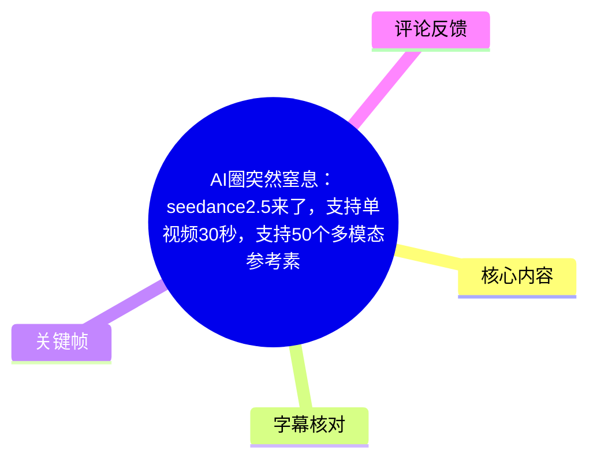
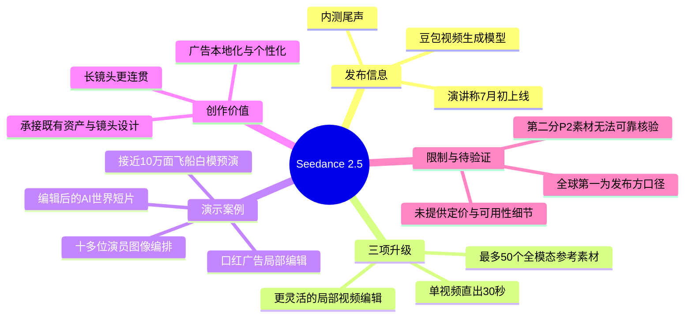
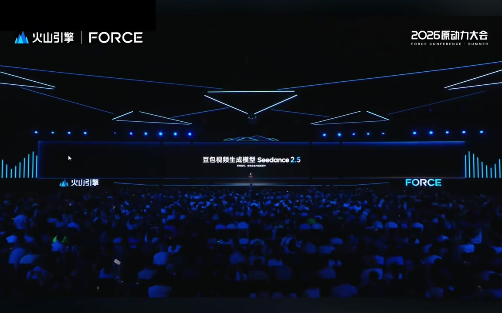
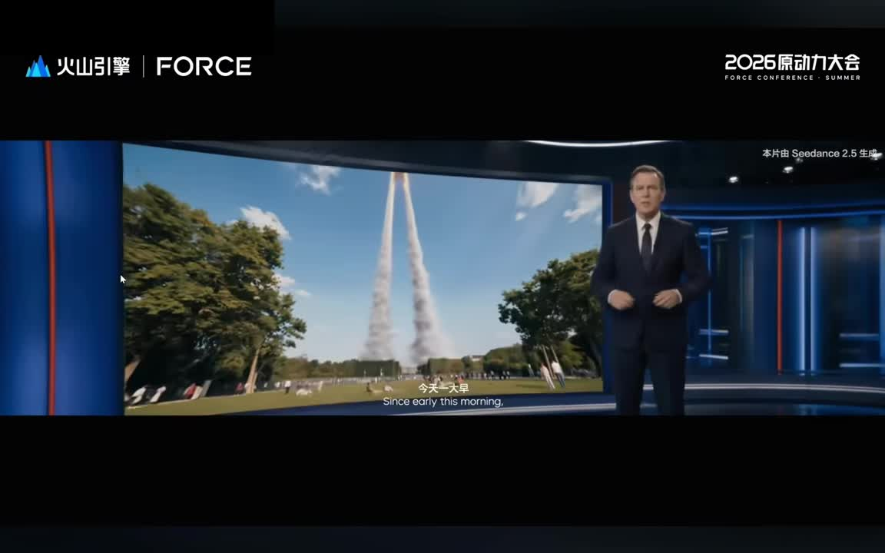
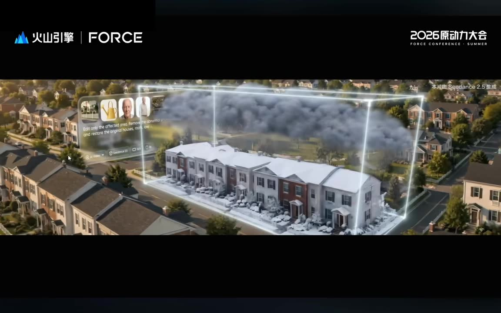
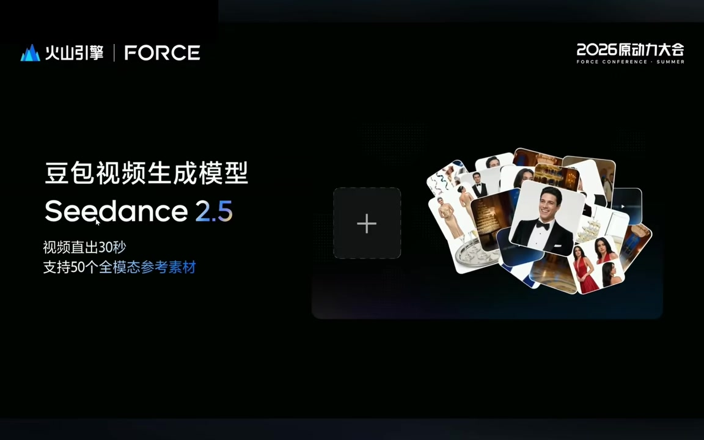

# AI圈突然窒息：Seedance 2.5 的 30 秒生成、多模态参考与局部编辑

> 来源：[Bilibili 视频](https://www.bilibili.com/video/BV1dej16eEkN) 
> UP 主：赛博同志｜视频元数据总时长：15:41｜本次可核验音频/ASR 覆盖：P1，约 07:15

## 小结

视频主体展示火山引擎在 2026 原动力大会上介绍的豆包视频生成模型 **Seedance 2.5**。发布方在演示中重点提出三项升级：单条视频最长可直出 **30 秒**、支持最多 **50 个全模态参考素材联合输入**、以及在整体画面尽量保持不变的前提下进行局部视频编辑。

视频将“30 秒”定位为解决长镜头连贯性与制作效率的问题：发布方称，彼时同类产品通常仅支持 15～20 秒直出；Seedance 2.5 将单条生成上限提升至 30 秒，以减少将多个短片段拼接为完整镜头的需求。此处“同类产品最多 15～20 秒”“全球第一/全球最多”等均为发布演讲中的口径，不应直接视为已独立验证的行业结论。

多参考能力的关键不只是增加可输入素材数量，而是同时做到对素材的理解、编排和生成过程中的稳定保持。演示先输入十多位演员图像资产，后又以接近 10 万面的宇宙飞船白模加渲染材质参考，考察模型在镜头推进和飞船运动下维持结构、比例与复杂细节的能力。

编辑能力的示例聚焦广告内容：创作者可在保持整体画面不变的条件下，单独微调背景、替换展示商品或模特。发布方将广告本地化、个性化视为一个应用场景，并进一步提出该能力可服务实体行业。但视频没有给出具体产品入口、计费标准、可用地区、审核规则、实际生成耗时或公开 API 参数。

时效上，演讲称模型当时已处于内测尾声，计划于 **7 月初正式上线**。视频标题提出“可能用不起”，热评也讨论价格和平台壁垒，但可提供的演讲字幕与 ASR 中均**没有价格、套餐或调用成本信息**，不能据此确认“用不起”的具体含义。

## 思维导图

## 目录

- [素材范围、背景与时效](#素材范围背景与时效)
- [开场短片：被编辑的 AI 世界](#开场短片被编辑的-ai-世界)
- [三项升级与关键参数](#三项升级与关键参数)
- [多参考素材：角色编排与资产保持](#多参考素材角色编排与资产保持)
- [白模预演：复杂飞船的结构一致性](#白模预演复杂飞船的结构一致性)
- [局部编辑：广告本地化示例](#局部编辑广告本地化示例)
- [视频呈现的创作流程与适用条件](#视频呈现的创作流程与适用条件)
- [限制、风险与待验证项](#限制风险与待验证项)
- [关键帧索引](#关键帧索引)
- [字幕比对](#字幕比对)
- [评论分析](#评论分析)
- [处理记录](#处理记录)

## 素材范围、背景与时效

### [发布背景与素材覆盖说明 00:00:00](https://www.bilibili.com/video/BV1dej16eEkN?t=0)

视频元数据表明该投稿包含两个分 P：

| 分 P | 元数据时长 | 标题 | 本次可核验情况 |
| --- | ---: | --- | --- |
| P1 | 07:16 | 好消息，Seedance 2.5 来了…… | 有站内字幕与本次 ASR，ASR 音频时长约 07:15，内容可核验。 |
| P2 | 08:25 | 火山引擎 Seedance 2.5 发布会全程来了…… | 所给站内字幕内容为一段关于“兴趣爱好”的独立讲话，与标题及 P1 内容明显不符；本次 ASR 也仅覆盖约 07:15 的音频。因此不能将该字幕当作 P2 发布会内容，更不能据此编造 P2 的发布会细节。 |

本文对 Seedance 2.5 的事实整理以 **P1 的站内字幕、ASR 和关键帧**为准。P1 演讲称模型在当时已到内测尾声，预计“7 月初”正式见面；视频元数据发布时间为 2026-06-23，故这是与该发布节点绑定的时效性信息，后续产品能力、开放范围与价格可能变化。

> 图：会场大屏明确标出“豆包视频生成模型 Seedance 2.5”，并出现火山引擎 FORCE / 2026 原动力大会标识。这是确认视频来源为发布会演示材料、而非普通产品实测的关键视觉依据。

## 开场短片：被编辑的 AI 世界

### [从异常新闻到局部修复的演示叙事 00:00:23](https://www.bilibili.com/video/BV1dej16eEkN?t=23)

开场先播放一段带有英文对白和新闻播报风格的 AI 视频：画面出现记者、异常自然现象与住宅区等场景。站内字幕可见“Multiple abnormal incidents have been reported across different parts of the world”等内容；随后画面转向对异常区域进行修复的视觉表达。

发布方在后续说明中将其概括为一个“被编辑的 AI 世界”。该短片承担的是能力展示而非技术细节讲解：通过异常场景被框选、局部替换和恢复的画面语言，为后文“保持整体画面、修改局部内容”的编辑能力做铺垫。

> 图：画面以新闻演播室和火箭/烟柱般的异常景象建立“AI 世界出现异常”的叙事。右上角标注“本片由 Seedance 2.5 生成”，可用于理解这段内容是模型演示样片。

> 图：画面中住宅区的一部分被透明边框圈定，框内外状态不同，直观呈现了“指定局部区域进行编辑/修复”的表达方式；它是后续局部编辑能力最直观的画面依据之一。

## 三项升级与关键参数

### [模型亮相与上线时间 00:02:54](https://www.bilibili.com/video/BV1dej16eEkN?t=174)

发布方在短片结束后宣布，这是一款“全新的豆包视频生成模型 Seedance 2.5”，并称模型已在内测阶段尾声，计划于 **7 月初**正式与用户见面。

随后演讲把本次更新归纳为三项重点：

1. **单视频生成长度最高 30 秒**；
2. **最多支持 50 个全模态素材联合输入**；
3. **更灵活、可控的视频编辑能力**。

> 图：该页直接展示“豆包视频生成模型 Seedance 2.5”“视频直出 30 秒”“支持 50 个全模态参考素材”，是视频中最集中、最清晰的参数性信息来源。

### [30 秒单条视频直出 00:03:17](https://www.bilibili.com/video/BV1dej16eEkN?t=197)

演讲对行业背景的描述是：过去一年多，视频生成模型在真实感、可控性和一致性方面进展很快，但**时长**仍是制约 AI 视频发展的关键要素。发布方称，市场上同类模型产品通常最高支持 15～20 秒直出，而 Seedance 2.5 将单条生成上限提升到 **30 秒**。

发布方给出的价值判断包括：

- 更长的单段时长可使镜头表达更连贯；
- 减少为延长内容而切碎镜头、拼接片段的需求；
- 有望提高创作效率和成片品质。

需要区分两层含义：

- **可核验的视频陈述**：该演讲明确给出“最长 30 秒”的参数。
- **尚待独立验证的结论**：“同类产品最多 15～20 秒”“直接突破瓶颈”“全球第一”等属于发布方的比较性宣传口径；素材未提供横向测试方法、样本或第三方报告。

### [50 个全模态素材联合输入 00:03:47](https://www.bilibili.com/video/BV1dej16eEkN?t=227)

发布方称，多参考是创作者喜欢的 Seedance 功能之一，Seedance 2.5 对此作了较大提升，最多可支持 **50 个全模态素材**联合输入，并使用“全球最多”的表述。

从视频可严格确认的参数是“最多 50 个”和“全模态素材联合输入”。但“全模态”的具体范围在给定演讲内容中未逐项定义，例如是否包括文本、图片、视频、音频、3D 文件或其他类型，均没有明确清单；因此不宜扩写为某种确定的输入格式支持表。

## 多参考素材：角色编排与资产保持

### [十多位演员图像资产的联合编排 00:04:02](https://www.bilibili.com/video/BV1dej16eEkN?t=242)

为展示多参考能力，演讲者说明一次性输入了**十多位演员的图像资产**，让模型对这些角色进行编排。视频随后播放派对、祝酒和舞蹈等场景，展示多个角色被组织进同一段视听叙事中的效果。

这个案例对应两项能力要求：

1. **理解输入资产**：识别不同人物参考资产；
2. **编排并生成**：在派对类场景中安排不同人物的出场与互动。

演讲者以“编排得非常完美”评价结果。这是主讲人的主观判断；给定素材没有提供角色身份对照表、输入图集合、生成提示词或失败样本，因而无法量化评估人物身份保持率、跨镜头一致性或多人物遮挡时的稳定性。

### [生成过程中稳定保持素材 00:04:52](https://www.bilibili.com/video/BV1dej16eEkN?t=292)

发布方特别强调，增加可理解的素材数目并非全部挑战，**在生成过程中稳定保持素材**同样关键。该表述将“多参考”从输入容量问题延伸为一致性问题：

- 输入阶段：能够接收并理解更多参考；
- 生成阶段：在人物、物体和镜头运动发生时，尽量不丢失关键参考特征；
- 结果阶段：使已有创作资产可以在生成视频中被持续承接。

对于实际创作，这意味着输入数量并不自动等于可控性。素材越多，角色优先级、资产之间的冲突、镜头中是否同时出现以及生成时的稳定保持，都会成为影响结果的变量；视频没有公布这些变量的控制语法或优先级规则。

## 白模预演：复杂飞船的结构一致性

### [接近 10 万面的飞船白模与材质参考 00:05:04](https://www.bilibili.com/video/BV1dej16eEkN?t=304)

演讲将该案例归入影视制作中的“白模预演”。输入包括：

- 一个复杂度接近 **10 万面**的宇宙飞船白模；
- 一份渲染材质参考；
- 目标：让 Seedance 2.5 生成渲染视频，模拟相应镜头。

这里的“接近 10 万面”是视频出现的唯一明确几何复杂度参数。演讲者指出任务困难在于飞船本身包含大量细节，包括结构、比例与精细化设计。

### [镜头推进下的结构、光影与空间保持 00:05:16](https://www.bilibili.com/video/BV1dej16eEkN?t=316)

演讲对任务要求的拆分十分具体：

| 维度 | 视频提出的要求 |
| --- | --- |
| 几何一致性 | 在缓慢镜头推进和飞船运动中保持结构、比例与复杂细节。 |
| 视觉生成 | 根据材质参考生成对应材质、光影和空间效果。 |
| 镜头调度 | 生成能够模拟目标镜头的画面运动与空间表达。 |
| 专业流程衔接 | 承接创作者在前期投入的资产、设计与镜头调度。 |

发布方称，从结果看飞船主体轮廓、比例关系和复杂结构得到了稳定保持，并据此认为模型能够让专业创作流程更可控、更高效。

这里应保留边界：视频展示的是单个发布会演示案例，而非多资产、多镜头、多轮生成条件下的系统测试。它能证明发布方选择该场景作为能力目标，却不足以单独证明模型在所有复杂 3D 资产、任意长镜头或所有镜头角度下都能稳定保持几何结构。

## 局部编辑：广告本地化示例

### [整体不变、局部修改 00:06:05](https://www.bilibili.com/video/BV1dej16eEkN?t=365)

在第三项升级中，演讲者说明 Seedance 2.5 支持灵活的视频编辑：创作者可在**维持整体画面不变**的前提下，对局部内容单独修改。视频列举了三类可能操作：

1. 微调背景；
2. 更换演示商品；
3. 更换展示的模特。

该描述的重点是“局部修改”与“整体保持”的组合。它与开场中异常区域被框选修复的演示形成呼应：创作者并非一定要从零生成整条视频，也可以在已有视频结构中针对指定对象或区域改动。

### [口红广告：本地化与个性化 00:06:30](https://www.bilibili.com/video/BV1dej16eEkN?t=390)

视频以口红广告为例，画面中出现“I'm trying shade eleven today”等英文表达。演讲者随后评论，这种广告似乎能解决选择口红的困惑，并指出广告内容的**本地化和个性化**只是编辑能力的一个应用场景。

发布方进一步判断，编辑能力的提升可使视频模型向实体行业赋能。该判断可理解为潜在应用方向，而不是已经披露的行业落地数据。视频未说明：

- 商品替换是否需要商品图、遮罩、品牌资产或其他参考；
- 是否能精确保持人物身份、手部动作和商品交互；
- 编辑后视频是否需要人工复检；
- 是否存在商用授权、肖像权、品牌审核或合规限制。

## 视频呈现的创作流程与适用条件

### [从资产输入到局部迭代的流程归纳 00:04:02](https://www.bilibili.com/video/BV1dej16eEkN?t=242)

以下是根据视频案例整理的**概念性工作流**，用于说明演讲展示的创作结构；不是视频公开的产品界面操作指南，也不包含未披露的按钮、命令或参数。

1. **确定任务目标**  
   明确是生成较完整的单镜头、编排多角色、把白模转为预演视频，还是在现有画面上修改局部内容。

2. **准备可复用资产**  
   - 多角色案例：准备人物图像资产；  
   - 预演案例：准备复杂白模与材质参考；  
   - 广告案例：准备商品、背景、模特等需要替换或保持的资产。  
   视频强调专业创作前期投入的资产、设计与镜头调度具有被模型承接的价值。

3. **联合输入参考素材**  
   依据发布方口径，系统最多支持 50 个全模态素材联合输入。实际应输入多少、各类素材如何组合、优先级如何设定，视频未披露。

4. **生成或编辑目标片段**  
   对长镜头使用最长 30 秒单条视频生成；对编辑任务，在保持整体画面基础上修改局部背景、商品或模特。

5. **检查一致性与镜头效果**  
   视频案例尤其关注：人物/物体是否保持、飞船结构与比例是否稳定、材质光影空间是否符合参考、镜头推进时是否发生明显漂移。

6. **面向业务做版本适配**  
   广告场景可根据地区、商品或目标受众做本地化、个性化调整；但必须额外处理品牌审核、肖像授权和商用合规，这些并非视频已解决的问题。

## 限制、风险与待验证项

### [从广告案例延伸到实体行业 00:06:57](https://www.bilibili.com/video/BV1dej16eEkN?t=417)

### 已在视频中明确的信息

- 单条视频最长直出：**30 秒**；
- 联合输入能力：最多 **50 个全模态素材**；
- 白模演示资产复杂度：接近 **10 万面**；
- 编辑方向：背景、展示商品、模特等局部元素可修改；
- 发布节奏：演讲称当时处于内测尾声，计划 **7 月初**上线。

### 不能从视频确认的信息

| 项目 | 状态与原因 |
| --- | --- |
| 定价、套餐、调用成本 | 未提供。标题中的“可能用不起”不是可用于推导具体费用的证据。 |
| 可用地区、邀请资格与开放范围 | 未提供。 |
| 生成速度、并发限制、排队时长 | 未提供。 |
| 分辨率、帧率、码率、输出格式 | 未提供。 |
| “全模态素材”的类型清单 | 未提供具体定义。 |
| 50 个素材的单文件限制、总容量与优先级机制 | 未提供。 |
| API、工作流、提示词控制方式 | 未提供。 |
| “全球第一”“全球最多” | 发布方比较性口径，缺少对比范围、测评标准和独立验证。 |
| 30 秒生成的稳定性 | 仅有演示主张，未披露失败率、复杂动作/对话场景一致性等指标。 |

### 使用层面的风险

- **多参考并不等于自动可控**：参考数量增大后，人物或资产间的冲突、重要性排序和跨镜头保持仍需结果复核。
- **长时长并不自动消除剪辑**：30 秒可降低镜头切段需求，但无法仅凭时长保证叙事、动作、口型、逻辑与细节始终稳定。
- **编辑不等于无损替换**：局部商品或人物的替换可能影响遮挡、反射、手部接触、光影和品牌文字，视频没有展示失败边界。
- **商用仍需合规**：涉及模特、演员、商品和广告素材时，应自行确认肖像、版权、商标、授权和地区广告规范。

## 关键帧索引

| 关键帧 | 对应内容 | 使用价值 |
| --- | --- | --- |
| `frames/frame-001.jpg` | 新闻演播室中的异常事件 | 说明开场 AI 生成短片采用“新闻播报 + 异常世界”的叙事设定。 |
| `frames/frame-002.jpg` | 住宅区局部被框选并修复 | 直观支撑“局部编辑、整体保持”的视觉表达。 |
| `frames/frame-003.jpg` | FORCE 会场与 Seedance 2.5 舞台 | 确认素材属于火山引擎发布会演示场景。 |
| `frames/frame-004.jpg` | “视频直出 30 秒”“支持 50 个全模态参考素材” | 直接呈现视频最重要的两个量化卖点。 |

## 字幕比对

| 字幕来源 | 完整性 | 专有名词 | 时间轴 | 主要问题 |
| --- | --- | --- | --- | --- |
| Bilibili 站内字幕 P1 | 较完整，覆盖 P1 的开场、参数说明、飞船与广告案例 | “Seedance 2.5”多处被识别为“C档 / C down / SEDX”等，需结合画面校正 | 分段细，时间戳可直接使用 | 英文台词有明显听写偏差；部分中文专名转写不稳定。 |
| 本次 ASR（medium） | 仅覆盖约 07:15 音频，与 P1 时长基本对应；语音覆盖率约 48.03%，中间存在演示片段空档 | 多处识别为“C-DANCE / C-dance”，飞船、白模、渲染等词有错字 | 有时间戳，但部分语句被合并成长段，且存在断裂 | 将“飞船”识别为“飞传”、“结构”识别为“结架”等；开场和演示音乐/对白覆盖有限。 |
| Bilibili 站内字幕 P2 | 与该分 P 标题及本视频主题不一致 | 无法用于校正 Seedance 内容 | 时间戳存在，但对应的是无关讲话 | 内容为关于兴趣爱好、艺术与成长的长篇讲话，疑似字幕资产错配；未采用。 |

### 最终字幕选择

正文以 **P1 站内字幕为主、ASR 为交叉核验**，并结合关键帧修正关键专名：

- 站内字幕/ASR 中的“C档”“C down”“C-DANCE”“C-dance”“SEDX”等，统一校正为画面明确展示的 **Seedance 2.5**；
- “豆包视频生成模型”由发布会主舞台和参数页画面确认；
- “白模”依据站内字幕上下文采用；ASR 对相近词存在错识；
- “接近 10 万面”“30 秒”“50 个全模态素材”同时有站内字幕、ASR 或画面参数页支撑。

本次 ASR 诊断中**未标记 `noAudioStream=true`**，且识别到 P1 音频；因此不存在“源视频没有音轨”的情况。问题在于任务提供的 ASR 只覆盖约 435 秒，未覆盖元数据所示的完整双 P 总时长。

## 评论分析

以下仅分析可获取的热评前三条。评论反映用户观点，不构成对模型能力、市场地位或价格的事实验证。

1. **吃的少干的多｜55 赞**  
   - 观点：认为该模型可能进一步巩固垄断地位，并担心垄断后涨价，导致“用不起”。  
   - 补充价值：呼应标题对成本和市场结构的担忧。  
   - 可信度边界：视频及现有素材没有定价、市场份额或竞争格局数据，因而“垄断”“必涨价”属于评论者推测，不能作为结论。

2. **默默地小跟班｜28 赞**  
   - 观点：质疑 30 秒生成的实用性，认为提示词控制仍受字符数量限制；若让 AI 自由发挥，10 秒后可能崩坏，最终仍需剪掉无用内容。  
   - 补充价值：提出“生成时长”与“持续可控性”并非同一件事，提醒评估长视频时要看一致性与可用片段比例。  
   - 可信度边界：评论中的“2000 字符”“10 秒后一定会崩”均是个人经验性判断，视频没有提供对应的提示词上限或稳定性测试数据。

3. **风得旅人｜12 赞**  
   - 观点：反驳“30 秒无意义”，认为长文戏对话常需数分钟，原生 30 秒生成相较于将十几秒片段自行拼接，理论上更有利于连贯性。  
   - 补充价值：强调 30 秒的核心价值在于减少片段边界、改善连续镜头和长对话的衔接。  
   - 可信度边界：该判断在创作逻辑上合理，但“原生 30 秒一定更连贯”仍取决于模型在人物、对白、动作、场景和镜头连续性上的实际表现，视频未提供对照测试。

## 处理记录

- Worker ID：`worker-mrj0www4-e8d79408`
- 模型：`gpt-5.6-terra`
- ASR 模型：`medium`，语言识别为中文，语言置信度 `0.95849609375`，CUDA / float16。
- 使用的素材与工具结果：读取视频元数据、P1/P2 站内 SRT、`asr/transcript.srt`、`asr/asr-result.json` 的覆盖诊断、热评前三条及提供的关键帧。
- 字幕选择：采用 P1 站内字幕作为主要时间轴与语义来源，用本次 ASR 交叉核验；P2 站内字幕与视频主题明显错配，且 ASR 未覆盖 P2，未将其内容写入 Seedance 事实整理。
- 时间轴依据：正文时间轴均使用 P1 站内 SRT 或 ASR 中可直接读取的真实起始时间，换算为 Bilibili `t=<秒数>` 链接；未根据文字顺序猜测时间。
- 关键帧选择依据：选择发布会舞台、模型参数页、开场异常世界和局部修复画面，分别对应发布语境、核心参数和编辑能力；正文仅使用提供的相对路径 `frames/xxx.jpg`。
- 缓存清理：未执行缓存清理；本任务仅基于已提供的静态素材进行整理，未产生可报告的新增缓存。
- 未解决问题：未提供 P2 的可靠 Seedance 字幕、可核验音频 ASR 或对应关键帧；未提供定价、开放资格、接口、输出规格和独立性能评测，均不能补写。
