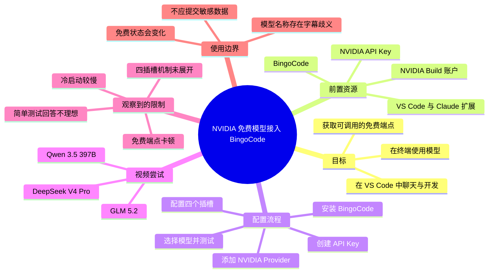
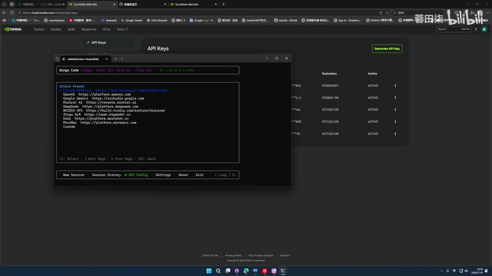
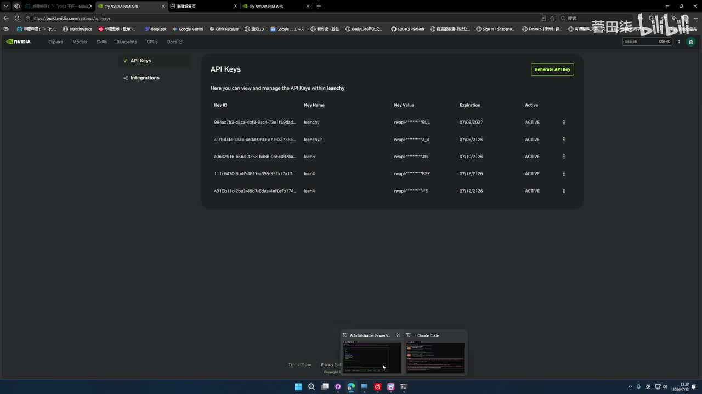
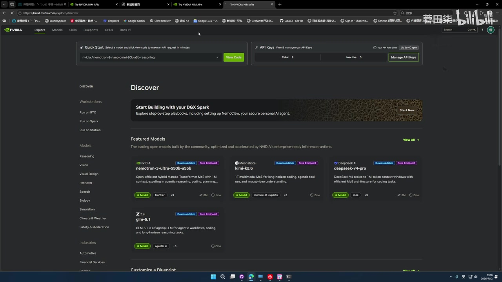
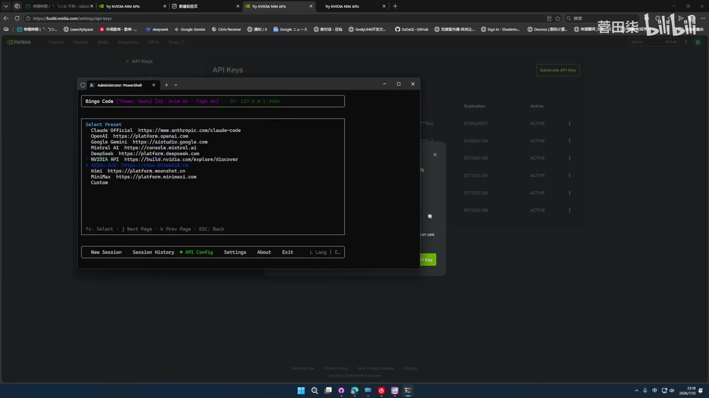

# [免费AI]科研必备！上百种免费大模型，免费开源agent。全部免费，科研必备！！！

> 来源：[Bilibili 视频](https://www.bilibili.com/video/BV1pmNg6UEhP)  
> UP 主：菅田柒｜合集：AIcode｜时长：13 分 54 秒  
> 视频简介提供的链接：  
> - 免费 AI Key：<https://build.nvidia.com/explore/discover>  
> - BingoCode：<https://github.com/leanchy/BingoCode>  
> - 交流 QQ 群：1059901449

## 小结

视频演示了一条将 **NVIDIA Build（NVIDIA NIM）提供的模型 API** 接入 BingoCode 的工作流：安装 BingoCode、在 NVIDIA 页面创建 API Key、在 BingoCode 的 API Config 中添加 NVIDIA 提供商、为多个配置插槽选定模型，最后在终端及 VS Code 中调用。

UP 主的核心主张是：NVIDIA 页面上有大量带有 “Free Endpoint” 标记的开源模型可供调用，适合科研、程序开发和体验不同模型。视频实际展示了 NVIDIA Discover 页面与 API Key 管理页，并尝试了千问、DeepSeek 与智谱 GLM 系列模型；画面中可见的模型卡包括 `deepseek-v4-pro`、`kimi-k2.6`、`glm-5.1` 和 NVIDIA Nemotron 系列。

实践上，最关键的不是“模型名称”，而是三项配置：**NVIDIA 登录态与 API Key、BingoCode 的 NVIDIA Provider 配置、Claude Code/BingoCode 所要求的四个插槽配置**。UP 主称四插槽是 Claude Code 的特性，但未在视频中进一步解释每个插槽的具体职责或配置文件结构。

视频也实测到明显限制：Qwen 3.5 397B 与 DeepSeek 的测试均对“50 米去洗车店该开车还是走路”的问题回答“走路去”，UP 主据此认为测试失败；GLM 5.2 长时间等待，表现为未报 API 错、未显示 Token 消耗但持续卡顿。故“免费”“可用”不能直接等同于稳定、低延迟或高质量。

“全部免费”“上百种模型”“最强”等均为视频中的表述或界面观察，不能据此推导为长期、无限额、无速率限制的服务承诺。视频发布于 2026-07-13；模型清单、免费端点资格、并发限制、额度、API 规则和 BingoCode 的实现均可能随时变化，使用前应以 NVIDIA Build 与项目仓库的当前页面、条款和控制台信息为准。

## 思维导图




## 目录

- [背景、资源与时效性](#背景资源与时效性)
- [安装 BingoCode 并进入 API 配置](#安装-bingocode-并进入-api-配置)
- [创建 NVIDIA API Key](#创建-nvidia-api-key)
- [选择 NVIDIA 免费端点与模型](#选择-nvidia-免费端点与模型)
- [配置插槽与终端测试](#配置插槽与终端测试)
- [接入 VS Code](#接入-vs-code)
- [限制、风险与可迁移经验](#限制风险与可迁移经验)
- [字幕比对](#字幕比对)
- [评论分析](#评论分析)
- [处理记录](#处理记录)

## [背景、资源与时效性](https://www.bilibili.com/video/BV1pmNg6UEhP?t=0)

视频从“免费 AI”和“几十到上百种模型”的承诺切入，目标用户是希望以较低成本试用大模型、进行科研辅助或编程任务的用户。UP 主指向两个关键资源：

1. **BingoCode GitHub 仓库**：`https://github.com/leanchy/BingoCode`；
2. **NVIDIA Build Discover 页面**：`https://build.nvidia.com/explore/discover`。

视频中的方案不是下载模型到本机运行，而是通过 API 将模型能力接入 BingoCode。UP 主多次将模型称作“NVIDIA 官方本地部署”或“部署在 NVIDIA 服务器上”；从演示方式能确认的是它在调用远端 API，至于具体底层部署位置、资源隔离方式和服务级别，视频未提供可验证的技术细节。

视频元数据显示其发布日为 **2026-07-13**，在采集时有 1,171 播放、42 收藏、19 点赞和 3 条回复。由于云端模型、免费端点及产品页面都具有变化性，以下内容应视为该时点的操作记录，而不是永久有效的配置保证。

## [安装 BingoCode 并进入 API 配置](https://www.bilibili.com/video/BV1pmNg6UEhP?t=29)

UP 主首先演示安装 BingoCode，随后在终端输入 `bingo` 打开其交互界面，并从中进入 **API Config**。

视频口述的安装文本如下；原字幕未能明确区分包名中是否有连字符，且未展示命令执行结果，因此仅按视频记录，不将其视为已独立验证的精确安装命令：

```bash
npm install bingo code
```

进入程序后，UP 主展示了 API 提供商列表。列表中可见 Claude Official、OpenAI、Google Gemini、Mistral AI、DeepSeek、NVIDIA API、智谱 GLM、Kimi、MiniMax 与 Custom 等选项。UP 主指出，其中存在预设收费服务，而 NVIDIA 是他此次要添加的免费来源。



> 图：该画面直接说明 BingoCode 支持按 Provider 管理 API，而不是只能使用单一模型。它也是理解后续“添加 NVIDIA 配置”和“切换模型”的界面依据。

### 操作步骤

1. 按项目文档安装 BingoCode；视频中口述为上述 npm 命令。
2. 在终端运行 `bingo`。
3. 在主界面进入 **API Config**。
4. 在提供商列表中选择或添加 **NVIDIA API**。
5. 在后续页面填入 API Key，并进行配置或连接测试。

UP 主在填入 Key 后点击“测试连接”时出现问题，并直接说“有问题先不管”，转而继续配置。因此，视频没有提供一次完整、成功且可复现的“测试连接”证明；其后续终端响应被 UP 主作为连接成功的依据。

## [创建 NVIDIA API Key](https://www.bilibili.com/video/BV1pmNg6UEhP?t=73)

要使用 NVIDIA 提供商，视频要求先登录 NVIDIA 网站，并从个人页面进入 **API Keys**。UP 主演示了创建 Key 时需要设置的字段：

- **Key Name**：为密钥命名；
- **Expiration**：选择过期时间；
- 视频中选择了“永不过期”；
- 创建完成后，将生成的 Key 复制回 BingoCode。



> 图：画面展示了 API Key 的集中管理界面、密钥名称和到期日期字段，因此可帮助理解视频中“新建、命名、设置有效期”的步骤。图中密钥值以掩码显示，正文不记录任何可识别的凭据。

### 安全与维护建议

视频选择“永不过期”，但这是一种便利性设置，不应等同于最佳安全实践。尤其在科研协作、代码仓库、共享电脑或录屏环境中，应注意：

- 不在公开仓库、截图、终端历史、聊天记录中暴露 API Key；
- 优先使用环境变量、系统凭据管理或工具的安全存储机制；
- 若怀疑密钥泄露，应在 NVIDIA 控制台立即撤销并重新创建；
- 根据项目生命周期设置过期时间，并定期清理无用 Key；
- 不应假定免费端点没有用量、速率或并发方面的限制。

## [选择 NVIDIA 免费端点与模型](https://www.bilibili.com/video/BV1pmNg6UEhP?t=166)

UP 主打开 NVIDIA Build 的 Discover 页面，展示其中的模型卡片。画面中模型卡上可以看到 “Free Endpoint” 标记；这是视频判断其可免费试用的主要界面证据。



> 图：这张图的价值在于区分“模型可下载（Downloadable）”与“可通过免费端点调用（Free Endpoint）”两类标签，并展示页面确实存在多个模型入口，而非仅限于单一模型。

### 视频提及或画面可见的模型

下表严格区分“画面可辨认名称”和“UP 主口述名称”。由于字幕与 ASR 对专有名词识别不稳定，不将二者无法一致的名称强行合并。

| 来源 | 模型或系列 | 视频中的说法/画面 | 备注 |
| --- | --- | --- | --- |
| 画面模型卡 | `deepseek-v4-pro` | 页面展示 DeepSeek 卡片并带 Free Endpoint | UP 主后续尝试切换到 DeepSeek V4 Pro。 |
| 画面模型卡 | `kimi-k2.6` | 页面展示 Moonshot AI Kimi 卡片 | 未在终端进行测试。 |
| 画面模型卡 | `glm-5.1` | 页面展示 Z.ai GLM 卡片 | 与后续口述“GLM 5.2”不一致。 |
| 画面模型卡 | `nemotron-3-nano-omni-30b-a3b-reasoning` | NVIDIA Nemotron 模型卡 | 未在终端测试。 |
| UP 主口述 | Qwen 3.5 397B | 选作首次终端测试模型 | “397B”是口述信息，未在画面中独立核验。 |
| UP 主口述 | Google Gemma 31B | 被描述为 Google 的本地模型 | 具体版本未清楚展示。 |
| UP 主口述 | Meta 70B | 被描述为 Meta 的本地模型 | 具体模型名称未清楚展示。 |
| UP 主口述 | MiniMax、OpenAI OSS、Qwen、DeepSeek | 作为可选模型系列列举 | 不代表视频逐一完成实际调用。 |

UP 主还声称 NVIDIA 提供的可选模型很多，并提及模型页中可看到千问、DeepSeek、Google、Meta、MiniMax、NVIDIA 自有模型、OpenAI OSS 等。这里应注意：**“页面存在模型卡”不等于所有模型在所有地区、账户、时段均可使用，也不等于每一个都可无限制免费调用。**

## [配置插槽与终端测试](https://www.bilibili.com/video/BV1pmNg6UEhP?t=263)

配置提供商后，UP 主进入“配置插槽”页面。视频中称共有 **四个插槽**，并说上方的若干插槽已配置为自己付费的 DeepSeek API，下方有 NVIDIA 的免费配置。对于“为什么必须配四个插槽”，UP 主的解释是这是 “Claude Code 的特性”，但没有继续说明插槽与模型角色、任务分工、故障切换或配置文件格式之间的关系。



> 图：该帧补充了“BingoCode 前台配置”与“NVIDIA 控制台”之间的衔接：用户需要在本地工具内选择 NVIDIA Provider，而不是只在网页上创建 Key 即可完成调用。

### 视频中的配置逻辑

1. 在 API Config 中添加 NVIDIA；
2. 可为该配置随意填写显示名称；
3. 将在 NVIDIA 创建的 API Key 粘贴到对应字段；
4. 进入配置插槽；
5. 为四个插槽分别选择模型或切换到 NVIDIA 方案；
6. 保存后新开终端，输入视频所述的 `crowd`，进入模型会话。

这里存在明显的术语不确定性：UP 主及字幕多次把工具/命令说成 “crowd”，结合其后文“Claude Code 特性”“安装 Claude 官方扩展”“切换 Claude Code”的画面语境，更可能是在指 **Claude Code**；但视频未展示清晰的命令拼写，也没有给出配置文件，因此不能确认 `crowd` 是否为实际命令、转写误差或另一个工具命令。

### Qwen 3.5 397B 测试

在约 5 分钟处，UP 主选择并进入“千问 3.5 397B”模型会话，先询问模型“你是什么模型”，随后提出测试题：

> “我现在要去洗车店，店里（离我）50 米，我是开车去还是走路去？”

模型回答“走路去”。UP 主以“测智力失败”评价该回答，并因此决定更换模型。

这只是一条带有明显主观标准的单轮问题，不能构成对模型整体推理、编程、科研写作或工具调用能力的可靠评测；但它确实说明了视频作者在实际体验中对该响应不满意。

### DeepSeek V4 Pro 测试

随后 UP 主切换到 DeepSeek，视频与 NVIDIA 页面中均可见接近 `deepseek-v4-pro` 的名称。其观察包括：

- 第一句可能有“冷启动”，因此等待时间较长；
- 重新进入会话后，模型可以返回内容，UP 主据此认为连接成功；
- 对相同的洗车问题，模型同样回答“走路去”；
- UP 主再次认为结果不理想。

视频中的“冷启动”仅是 UP 主基于等待现象的推测，未提供服务端日志、响应时间统计或官方文档佐证。

## [接入 VS Code](https://www.bilibili.com/video/BV1pmNg6UEhP?t=539)

UP 主接着介绍 VS Code 使用方式，流程为：

1. 安装 VS Code；
2. 在扩展市场安装视频所称的 Claude 官方扩展；
3. 在扩展内切换到 Claude Code；
4. 按提示登录；
5. 在 BingoCode 的“连接 VS Code”功能中打开连接；
6. 重启或重新打开 VS Code；
7. 在 VS Code 中开始聊天或执行开发辅助任务。

视频中，UP 主表示连接注入后，VS Code 界面会把它显示为 Claude 模型，并称这是一种“伪装”；但仍认为能够在该界面使用已配置的模型。视频没有展示其注入机制、是否符合扩展或服务条款、具体请求流向及认证方式，因此不宜将该说法延伸为对兼容性或合规性的结论。

### GLM 5.2 的等待现象

UP 主选择了口述中的 “GLM 5.2”，称其为智谱最新开源模型，并将其能力类比为最新 OpenAI 模型。该比较属于视频作者主观看法，视频未提供基准、任务集或官方评估来源。

在等待过程中，UP 主观察到：

- 界面显示为智谱 AI 的 GLM 5.2；
- 模型长时间处于思考或无输出状态；
- 约一分钟后仍明显卡顿；
- 没有看到 API 被拒绝的报错；
- 也没有看到 Token 使用信息；
- UP 主推测可能是免费服务用户多、模型服务压力大。

最终，UP 主通过“可以在 VS Code 中使用”的画面展示结束说明，但未完成 GLM 的同一测试题输出。故该段只能证明视频演示时的连接界面可出现，**不能证明 GLM 5.2 在当时已稳定完成任务**。

## [限制、风险与可迁移经验](https://www.bilibili.com/video/BV1pmNg6UEhP?t=715)

### 视频已暴露的限制

| 维度 | 视频观察 | 对实际使用的含义 |
| --- | --- | --- |
| 连接测试 | 填 Key 后测试连接曾出现问题，UP 主未排查即继续 | 配置成功不能只依赖“已保存”，应以实际请求、错误码和日志核验。 |
| 延迟 | DeepSeek 首句较慢；GLM 长时间卡顿 | 免费端点可能不适合严格时延要求的交互、批量任务或临近截止的科研流程。 |
| 输出质量 | Qwen 与 DeepSeek 在同一生活问题上均给出“走路去” | 应按具体任务构建评测集，不应只按模型名或参数量选择。 |
| 插槽配置 | 必须配置四个插槽的原因未展开 | 初次接入者仍需查看 BingoCode/Claude Code 的当前文档。 |
| 模型版本 | 画面有 `glm-5.1`，口述出现 GLM 5.2；其他专名也有转写偏差 | 复制配置前必须以控制台实际模型 ID 为准。 |
| 收费与免费 | UP 主展示免费端点，同时也展示了自己的收费 API 配置 | 免费与收费配置可并存；免费资格不保证永久有效。 |

### 建议的科研使用策略

1. **先验证再投入任务**：创建 Key 后，以一个小请求确认认证、模型 ID、地区可用性、速率限制与错误处理。
2. **将免费端点用于非敏感的探索性任务**：如提示词试验、代码草稿、文献主题梳理；涉及未公开数据、受试者信息、商业机密或敏感研究材料时，应先核对数据政策与机构合规要求。
3. **建立可复现实验记录**：保存模型 ID、调用日期、提示词、参数、响应时间、失败重试次数与结果，以便科研复核。
4. **准备备用方案**：视频本身展示了免费端点可能卡顿。对有时限的工作，应保留本地模型、其他 Provider 或付费 API 的降级路径。
5. **不要把“参数大”直接当成“结果好”**：视频中的 Qwen 397B 单轮测试不理想，也说明应用效果需要以目标任务验证。
6. **以实际控制台为准选择模型**：尤其是 GLM 版本、DeepSeek 后缀、Qwen 参数量等，均应从当前页面复制真实模型 ID，而非依赖口述或自动字幕。

## [字幕比对](https://www.bilibili.com/video/BV1pmNg6UEhP?t=0)

本次任务中**站内字幕与本次 ASR 均已执行并可获取**。两者覆盖了视频的大部分口述内容，但都缺少逐句时间戳，且在模型名、命令与产品名上存在较多识别问题。

| 字幕来源 | 完整性 | 专有名词 | 时间轴 | 主要问题 |
| --- | --- | --- | --- | --- |
| Bilibili 站内字幕 | 较完整，基本覆盖安装、Key、模型测试、VS Code 接入和结尾说明 | 整体优于 ASR，但仍有混淆 | 未提供逐句时间戳 | 将 Claude/Code 相关词转为“crowd cro”等；将部分模型名识别为“ki deep seek with pro”“G2M5.1”等。 |
| 本次 ASR 字幕 | 较完整，覆盖范围与站内字幕接近 | 误识别更多 | 未提供逐句时间戳 | 出现“幾次上百種”“Himmi”“Waze Pro”“G2A 梦”“Zip”等明显误识别；命令、模型版本和公司名不稳定。 |

### 最终字幕选择与校正原则

正文以**站内字幕为主、本次 ASR 为交叉参考**，再结合关键帧中可直接读到的网页文字及前后语境校正。以下项目尤其需要谨慎：

- `NVIDIA`：两份字幕均有不同程度拼写偏差，但网页画面中 NVIDIA 标识清晰；
- `API Key`：由页面栏目 “API Keys” 与口述共同确认；
- `BingoCode`：由视频简介给出的 GitHub 链接确认；
- `deepseek-v4-pro`、`kimi-k2.6`、`glm-5.1`：以 Discover 页面画面可读模型卡为准；
- “GLM 5.2”：为 UP 主后续口述；与画面中的 `glm-5.1` 不一致，正文保留这项差异；
- “Claude Code / crowd”：根据上下文推定 UP 主意图指向 Claude Code，但视频没有清晰展示准确终端命令，因此未将 `crowd` 当作已验证命令。

## [评论分析](https://www.bilibili.com/video/BV1pmNg6UEhP?t=794)

任务仅获取到 2 条热评，少于“热评前三条”的上限；以下仅分析实际可获取内容，不补造第三条评论。

1. **鑫源子金**：  
   > “谢谢分享，API可以接人其它智能体吗？”  
   评论关注 API 的可扩展性，即 NVIDIA/BingoCode 配置是否能接入其他 Agent。视频确实介绍了 BingoCode 与 VS Code/Claude Code 的连接，但没有演示将这套 API 接入“其他智能体框架”的具体方法，也没有展示通用 OpenAI 兼容端点、SDK 或 Agent 协议。因此这是一项合理但未被视频回答的问题，不能据视频确认兼容范围。

2. **讲5GGGGG**：  
   > “大模型落地政务教育医疗工业 市场比想象大”  
   该评论表达对大模型行业应用规模的判断，与视频的“科研、编程辅助”主题存在关联，但没有为本视频提供关于 NVIDIA 免费端点、BingoCode 配置或模型效果的新增证据。政务、教育、医疗和工业领域还涉及数据安全、可靠性、监管与行业流程问题，不能仅从本次演示推导出实际落地结论。

## [处理记录](https://www.bilibili.com/video/BV1pmNg6UEhP?t=0)

- **Worker ID**：`worker-mrj0www4-e8d79408`
- **模型**：`gpt-5.6-terra`
- **调用工具与素材**：视频元数据、视频音频 ASR 结果、Bilibili 站内字幕、关键帧列表、热评抓取结果；未对视频未展示的产品能力进行外部事实补充。
- **字幕选择**：站内字幕为主，本次 ASR 用于交叉比对；对 NVIDIA、BingoCode、API Keys 与画面可辨认模型卡采用关键帧校正。无法从素材确定的命令拼写、模型版本和机制均显式保留不确定性。
- **关键帧选择依据**：  
  - `frames/frame-001.jpg`：展示 NVIDIA API Keys 管理与生成入口，支撑创建 Key 步骤；  
  - `frames/frame-002.jpg`：展示 BingoCode Provider 菜单，支撑添加 NVIDIA Provider 的步骤；  
  - `frames/frame-003.jpg`：展示 NVIDIA Discover 模型卡及 Free Endpoint 标签，支撑“页面存在免费端点”的描述；  
  - `frames/frame-004.jpg`：展示 BingoCode API Config 与 NVIDIA 项，支撑本地工具配置流程。  
  未选用其余关键帧，原因是当前正文已由上述四张画面覆盖最关键的网页与配置节点，避免重复插图。
- **评论处理范围**：仅处理可获取热评前 3 条；实际返回 2 条，已全部分析，未虚构缺失评论。
- **缓存清理**：素材清单未提供独立缓存清理日志；本记录未声明已执行不存在证据的删除操作。输出仅引用相对路径关键帧，不暴露任何 API Key。
- **未解决问题**：BingoCode 的准确安装包名与 CLI 命令、四插槽的确切功能、Claude Code 注入机制、各模型真实可用性/配额/地域限制、GLM 5.1 与 GLM 5.2 的版本差异，均需要以项目仓库、当前 NVIDIA 控制台和相关产品官方文档进一步确认。

## 评论分析

本次流程未获取到可用热评，因此不推断观众态度或额外结论。
