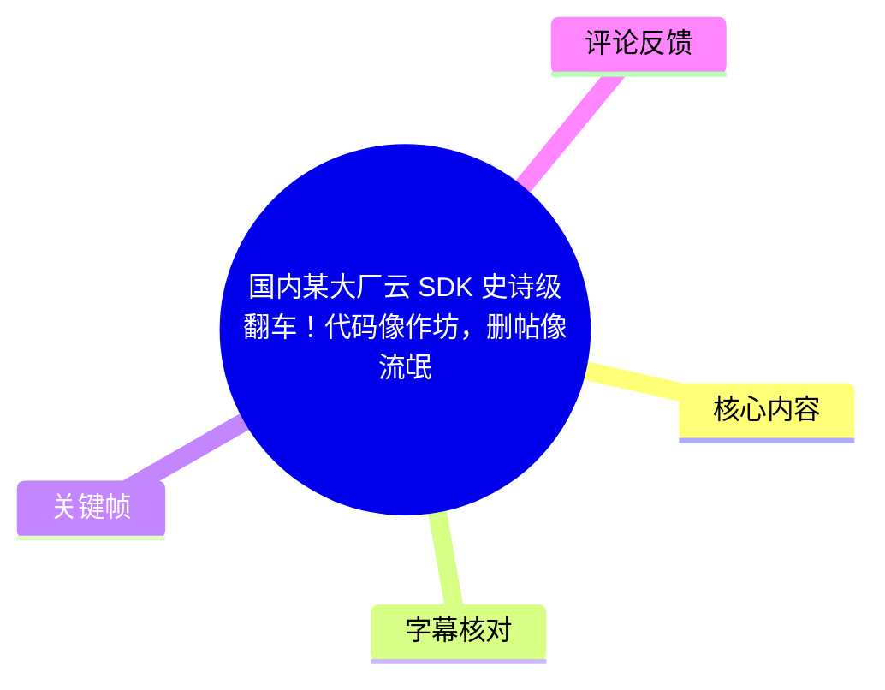
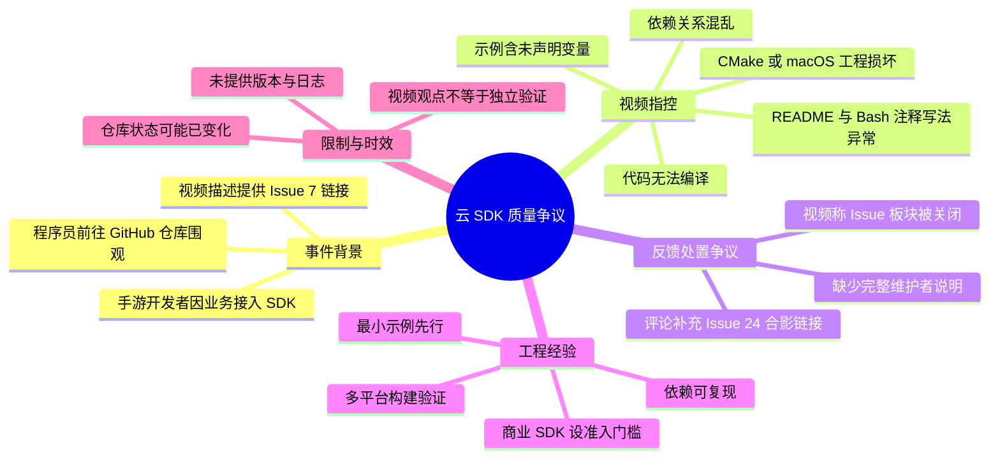

# 国内某大厂云 SDK 史诗级翻车！代码像作坊，删帖像流氓

> 来源：[Bilibili 视频](https://www.bilibili.com/video/BV1FFFDzxEyG)  
> UP 主：面试鸭｜发布时间：2026-02-10｜时长：1 分 20 秒｜分辨率：2160 × 3840（竖屏）  
> 视频描述提供的 Issue 地址：[huaweicloud/huaweicloud-sdk-cpp-v3#7](https://github.com/huaweicloud/huaweicloud-sdk-cpp-v3/issues/7)

## 小结

视频讨论一起围绕某国内大型云厂商 C++ SDK 的争议。UP 主称，一名因业务需要接入该 SDK 的手游开发者检查源码后，发现 README 示例、构建脚本、变量声明、macOS 工程和依赖关系等多个问题，并以“无法编译”为最关键的质量指控。

视频陈述的具体技术问题包括：在 **Bash 脚本**中使用 `//` 作为注释、示例代码存在未声明变量、CMake/macOS 工程不可用、依赖关系混乱，以及整体代码无法通过编译。需要注意：这些均为视频转述的开发者评价与指控；素材中没有完整复现日志、SDK 版本号、编译器版本、操作系统版本或 CI 结果，不能据此直接认定全部问题在当前版本仍然存在。

事件的另一焦点是 GitHub Issue 区的处置。视频称官方没有先修复问题，而是关闭了整个 Issue 板块；评论区也有人将这一行为理解为“删帖”或“关闭反馈入口”。但视频未展示完整的仓库设置变更记录、维护者公告或关闭原因，因此应将其视为视频发布时点的观察，而不是对平台治理动机的确定性结论。

对工程实践而言，视频最有价值的启示不是情绪化评价，而是：**第三方 SDK 接入前，必须用最小可编译示例、目标平台构建、依赖锁定与问题反馈渠道四个维度做验收。** 对商业云产品尤其如此，因为接入方往往承担业务上线压力和故障风险。

本视频属于时效性较强的争议内容。仓库代码、README、Issue 开关状态及维护者回应都可能在发布后发生变化；本文仅记录素材所覆盖的约 2026-02-10 前后信息，不替代对目标仓库当前状态的检查。

## 思维导图





## 目录

- [事件背景：SDK 接入与仓库围观](#事件背景sdk-接入与仓库围观)
- [视频列举的文档与脚本问题](#视频列举的文档与脚本问题)
- [代码质量与无法编译的指控](#代码质量与无法编译的指控)
- [Issue 板块关闭争议](#issue-板块关闭争议)
- [可迁移的 SDK 接入验收步骤](#可迁移的-sdk-接入验收步骤)
- [结论、限制与时效性](#结论限制与时效性)
- [字幕比对](#字幕比对)
- [评论分析](#评论分析)
- [处理记录](#处理记录)

## [事件背景：SDK 接入与仓库围观](https://www.bilibili.com/video/BV1FFFDzxEyG?t=0)

视频开头称，“这两天”有大量程序员到相关 GitHub 仓库“合影留念”，并将原因归结为“国内某大厂云的 SDK 翻车”。视频描述中明确给出了一个相关讨论入口：`huaweicloud/huaweicloud-sdk-cpp-v3` 仓库的 [Issue #7](https://github.com/huaweicloud/huaweicloud-sdk-cpp-v3/issues/7)。

随后，UP 主转述一名手游开发者的处境：其因业务需要而不得不接受该 SDK；在翻看源码后，认为问题密集。这里的“不得不接受”反映的是视频叙事中的接入约束，可能涉及项目既有云服务选型、业务依赖或组织要求，但素材并未解释具体合同、技术架构或替代方案。


> 图：画面将“合影留念”的评论列表叠加在人物镜头上，直观对应视频关于开发者集中围观仓库的叙述。它只能说明视频的表达方式，不能独立证明评论或仓库互动的完整规模。


> 图：画面以醒目字幕展示“每一步都是坑，多走一步就是吃屎”，是视频对接入体验的强烈主观概括。该表述体现叙述者态度，不应替代具体技术证据。

### 视频中的对象与信息边界

| 项目 | 素材可确认信息 | 不可由素材确认的信息 |
| --- | --- | --- |
| 争议对象 | 视频描述链接指向 `huaweicloud-sdk-cpp-v3` 仓库的 Issue #7 | 出问题的精确 SDK 版本、提交哈希、发布包版本 |
| 接入场景 | 视频称为手游开发者因业务需要接入 | 项目规模、云产品范围、接入方式、合同关系 |
| 影响描述 | 视频称源码问题导致强烈负面体验，并称“连编译都过不去” | 是否所有平台、所有用户、所有版本均无法编译 |
| 讨论热度 | 元数据抓取时显示 230,623 播放、9,228 点赞、768 回复 | 数据之后的持续增长情况与统计口径变化 |
| 处置行为 | 视频称整个 Issue 板块被关闭 | 关闭时间、操作者、维护团队的解释和后续恢复情况 |

## [视频列举的文档与脚本问题](https://www.bilibili.com/video/BV1FFFDzxEyG?t=16)

从约 00:16 起，视频先讨论 README 与示例的可用性。其重点是：README 中的 Bash 脚本使用了双斜杠 `//` 写注释。对于常见 Bash 语法，注释符通常应为 `#`；若 `//` 出现在命令行上下文，Shell 会尝试将其解释为命令、路径或参数的一部分，具体结果取决于所在语句，确实可能导致脚本不能按预期执行。

视频还声称：

1. “但凡跑一遍就知道绝对报错”；
2. 示例代码中存在未声明变量；
3. CMake/macOS 工程“也是坏了”；
4. 依赖关系“一塌糊涂”。

其中，Bilibili 中文站内字幕在 00:31.160—00:32.640 写作“`c Mac工程也是坏了`”，而本次 ASR 识别为“`CMAC工程也是坏了`”。结合上下文的“依赖关系”“编译”和关键帧中显示的 `cmake` 片段，可较稳妥地整理为：**视频在讨论 CMake/面向 macOS 的工程构建问题**。但原视频并未给出工程目录、`CMakeLists.txt` 内容或实际构建命令，因此不能进一步确认是“CMake 工程”“Mac 工程”还是二者同时存在故障。


> 图：画面字幕为“在 bash 脚本里”，并叠加可辨识的 `cmake -DCMAKE_POSITION_INDEPENDENT_CODE=...` 命令片段。这支持视频讨论 Bash/CMake 构建文档的语境，也有助于校正站内字幕中“BH 脚本”的疑似识别或翻译问题；不过画面未完整展示注释行和报错输出。

### 关键语法问题：Bash 注释应如何审查

视频没有给出完整脚本，以下内容是对其所述问题的通用工程解释，而非对目标仓库文件的复现：

```bash
# Bash 中的常规注释写法
cmake -S . -B build

# 若写成 // 这不是 Bash 的常规注释
// cmake -S . -B build
```

审查 README 中命令时，应区分三类情况：

- `//` 位于自然语言、URL、C++/JavaScript 代码块中：不一定有问题。
- `//` 位于声明为 `bash`、`shell` 或直接复制执行的命令块首部：应优先怀疑为语法问题。
- 文档与实际脚本不一致：即使仓库内脚本正确，README 示例仍会造成用户接入失败，因此同样属于文档质量问题。

## [代码质量与无法编译的指控](https://www.bilibili.com/video/BV1FFFDzxEyG?t=41)

约 00:41 起，视频强调：文档问题“还只是前菜”，更严重的是源码本身质量。UP 主没有逐条展开全部细节，只提取了一个可感知的后果：开发者称代码“连编译都过不去”。

视频将 SDK 的商业属性作为批评的重要前提：用户使用云产品“是付了费的”，因此不应以免费开源玩具的低标准看待其 SDK。这是一个价值判断，但背后对应了实际的软件供应链风险：

- **构建失败**会直接阻断项目集成、CI 流水线和交付排期；
- **示例失效**会提高首次接入成本，且可能误导问题定位；
- **未声明变量**通常意味着示例未经过完整编译或运行验证；
- **依赖失序**会带来版本冲突、平台差异和不可复现构建；
- **跨平台工程损坏**会使特定开发环境的用户承担额外修复成本。

视频以“像小作坊写出来的大作业”“怀疑纯 AI 生成”等措辞形容质量。这些是评论性、情绪化表达，不能从中推导出代码确实由 AI 生成，也不能将其视为软件工程审计结论。要验证“无法编译”，至少需要明确以下参数：

| 验证维度 | 应记录的参数 | 本素材是否提供 |
| --- | --- | --- |
| SDK 来源 | Release 版本、Git Tag、Commit SHA、下载方式 | 未提供 |
| 构建环境 | 操作系统、CPU 架构、编译器及版本 | 未提供 |
| 构建系统 | CMake 版本、Generator、构建类型 | 未提供 |
| 依赖环境 | 包管理器、锁文件、依赖版本、网络源 | 未提供 |
| 复现过程 | 完整命令、标准输出、错误日志、最小项目 | 未提供 |
| 影响范围 | 是否仅 macOS、是否仅示例、是否影响主库 | 未提供 |

## [Issue 板块关闭争议](https://www.bilibili.com/video/BV1FFFDzxEyG?t=58)

约 00:58 起，视频将叙事推进到“最骚的来了”，随后明确称“删帖了”。在 01:06—01:12，视频的具体说法是：官方看到问题后的反应不是修复 bug，而是“直接把整个 Issue 板块给关了”。视频接着用“解决不了问题就解决提出问题的人”概括这种处置方式，并提醒观众“且看且珍惜”。

这里需要严格区分三个层次：

1. **视频陈述**：视频称相关 GitHub 仓库的 Issue 板块被关闭。
2. **评论者解释**：热评将其理解为把“控评”延伸到 GitHub，认为这不符合开源社区的反馈文化。
3. **尚待验证的事实**：关闭是否确实发生、是关闭新建 Issue 还是关闭特定 Issue、是否临时关闭、是否已有替代反馈渠道、维护者是否发布说明，均需要查看仓库当时与当前的设置、公告及事件记录。

对 SDK 使用者而言，Issue 区的可用性不只是社区氛围问题，也会影响工程支持链路。若官方 Issue 不可用，团队至少应预先确认以下替代渠道：工单系统、技术支持邮箱、服务等级协议（SLA）入口、文档反馈渠道、企业客户支持群或公共讨论区。视频没有说明这些渠道是否存在，因此不能据其断言“完全没有反馈途径”。

## [可迁移的 SDK 接入验收步骤](https://www.bilibili.com/video/BV1FFFDzxEyG?t=20)

本节依据视频暴露的风险点，整理为通用的接入验收流程；它不是视频实际展示的操作教程，也不代表对目标仓库已完成复现。

### 1. 固定待验证版本，而不是只看仓库主页

记录并冻结：

- SDK 名称、语言与包名；
- Release 版本或 Git Commit SHA；
- 目标云服务与 API 区域；
- 操作系统、CPU 架构；
- 编译器、CMake、包管理器版本。

没有版本锚点的“SDK 编译不过”无法被有效复现，也无法判断问题是否已经修复。

### 2. 从 README 的最小命令开始，逐行复制验证

将文档命令写入独立脚本，并启用严格模式以尽早暴露变量、管道和命令执行问题：

```bash
#!/usr/bin/env bash
set -euo pipefail

cmake -S . -B build
cmake --build build --config Release
```

验收重点：

- 代码块标记的语言是否与实际命令一致；
- 注释是否使用目标 Shell 支持的语法；
- 示例中引用的环境变量是否已声明；
- 文档所称依赖是否可被自动安装或明确定位；
- 每一步是否能在干净环境执行。

`set -u` 对未定义变量尤其敏感，适合发现示例中“变量未声明”一类问题；但是否能直接用于某个具体项目，仍要考虑项目脚本的兼容性。

### 3. 进行最小编译与跨平台矩阵验证

至少为团队实际支持的平台建立构建矩阵，例如：

| 维度 | 建议覆盖项 |
| --- | --- |
| 操作系统 | Linux、macOS；如业务需要则加入 Windows |
| 编译器 | GCC、Clang、MSVC 中与项目相符的组合 |
| 构建类型 | Debug、Release |
| CPU 架构 | x86_64；如目标设备涉及则加入 arm64 |
| 构建入口 | 官方 README 命令、最小示例、主工程集成 |

输出应保留：构建命令、依赖解析结果、CMake configure 日志、失败时的完整错误栈。仅有“编译失败”的结论，不足以判断根因是 SDK、环境、文档还是用户工程配置。

### 4. 对依赖进行可复现性检查

针对视频所称“依赖关系一塌糊涂”，应检查：

- 依赖版本是否有明确下限、上限或锁定文件；
- 是否依赖系统预装组件；
- 下载源是否稳定、是否需要网络代理；
- CMake 的 `find_package`、FetchContent 或自定义脚本是否可重复执行；
- 同名库、ABI、静态/动态链接是否会冲突。

若依赖未被锁定，即使当前能编译，未来也可能因上游版本变化失效。

### 5. 将社区反馈能力纳入供应商准入

对于商业 SDK，不应只看“能否调用 API”，还应评估：

- Issue、工单、文档反馈是否可访问；
- 安全漏洞、兼容性故障的上报路径；
- 问题响应时限与升级机制；
- Release Note 是否说明破坏性变更；
- 是否有活跃维护、测试与版本发布节奏。

这一步对应视频中“Issue 板块关闭”引发的担忧：**支持渠道的稳定性，也是 SDK 可用性的一部分。**

## [结论、限制与时效性](https://www.bilibili.com/video/BV1FFFDzxEyG?t=76)

视频以 SDK 文档、构建与反馈机制三条线索，表达了对某云厂商 C++ SDK 工程质量和社区处置方式的不满。其最具体、最值得技术团队警惕的信号是：README 示例可能无法直接运行、示例或工程可能无法编译，以及问题反馈入口可能不可持续。

不过，素材本身属于短视频评论，证据颗粒度有限。它没有提供源码片段全貌、复现命令、构建日志、SDK 精确版本、维护者回应或仓库设置历史。因此，本文不能将“所有代码无法编译”“官方故意删帖”“代码由 AI 生成”等表述写成已独立证实的事实。

建议将视频作为一次供应链质量预警，而非最终技术裁决。真正的决策依据应当是：在目标项目环境中固定版本复现、查阅当前 README 与 Release、运行最小示例、审计依赖、确认支持渠道，并保留可追溯的验证记录。

**时效性说明：**

- 视频发布于 2026-02-10；本文使用的播放、点赞、评论等统计数据来自 2026-07-16 的素材抓取结果。
- GitHub Issue 状态、仓库代码和维护策略均可能在视频发布后变化。
- 视频结尾称“本条视频大家且看且珍惜，不知道啥时候就没了”，这是 UP 主的担忧，不能视为视频一定会被删除的事实。

## 字幕比对

本次同时检查了站内字幕与 ASR 结果。ASR 诊断**未标记** `noAudioStream=true`，且识别到音频语言为中文（`language: zh`、置信度 `1`），因此源视频存在音轨；本次 ASR 并非因无音轨而失败。

| 字幕来源 | 完整性 | 专有名词与术语 | 时间轴 | 主要问题 |
| --- | --- | --- | --- | --- |
| Bilibili 站内中文字幕 `p01-ai-zh.srt` | 覆盖 00:00.000—01:19.640，内容分段完整 | `GitHub`、`SDK`、`read me`、`bug`基本可辨；“BH 脚本”“c Mac工程”“一休板块”等词有误识别或机翻痕迹 | 与视频全长和叙述顺序一致，可作为章节时间轴依据 | 个别技术术语及 01:01.980—01:06.139 段落明显失真 |
| 本次 ASR `medium` | 识别文本覆盖约 53.1 秒语音，但只有 4 个超长片段 | `github`、`SDK`、`readme`、`bash`、`CMAC/CMake`可部分辨认 | 与站内字幕存在显著偏移：首段从 00:26.540 才开始，且片段过长；SRT 第 3 段结束时间还与诊断 JSON 不一致 | 大量同音错字、断句不足，如“合影邮言”“卫生名的变量”“伤铁了”；不适合作为细粒度时间轴 |
| 站内阿拉伯语/西班牙语/葡萄牙语字幕 | 与中文版本时段一致 | 可辅助印证“Bash 注释”“未声明变量”“编译失败”“关闭 Issue”等大意 | 时间段可用 | 为机器翻译文本，且在“删帖/Issue”段出现明显乱码或语义漂移，不作为中文事实表述主依据 |

### 最终字幕选择与校正

正文以**站内中文时间轴字幕**作为时间定位依据，原因是其从 00:00 起连续覆盖全片，分段粒度细，且与画面叙述进展一致；同时以本次 ASR 作为中文音频交叉核验，而不是忽略 ASR。

经站内字幕、ASR 和关键帧语境交叉校正后，采用以下谨慎表述：

| 原始疑点 | 交叉信息 | 正文采用表述 |
| --- | --- | --- |
| “BH 脚本” | ASR 识别为 `bash`；关键帧字幕显示“在 bash 脚本里” | Bash 脚本 |
| “c Mac工程” / “CMAC工程” | 关键帧可见 `cmake` 命令片段；上下文讨论构建与依赖 | CMake/macOS 工程构建问题，不进一步断定具体故障范围 |
| “一休板块” | 英语术语语境及多语字幕均指向 Issue 区 | Issue 板块 |
| “删帖” | 站内字幕明确出现“删帖了”，后文称关闭整个 Issue 板块 | 视频称“删帖”并称关闭 Issue 板块；不将动机视为已验证事实 |

## 评论分析

以下仅分析素材中可获取的热评前三条；评论代表各自用户观点，不构成独立技术验证。

1. **虚无银｜841 赞**  
   > “ai没这么蠢[笑哭]”  
   该评论回应视频中“怀疑代码是否纯 AI 生成”的讽刺说法，表达“即便 AI 也不至于如此”的调侃。其传播力较强，但没有提供代码、版本或复现信息，属于情绪评价，不能用于判断代码实际生成方式。

2. **EplqT｜768 赞**  
   > “已合影[doge] https://github.com/huaweicloud/huaweicloud-sdk-cpp-v3/issues/24”  
   该评论提供了另一个具体链接——Issue #24，并以“合影”呼应视频开头关于开发者涌入仓库留言的说法。这是可供后续核查的线索，但评论没有说明 Issue #24 的内容、创建时间或与 Issue #7 的关系；在未实际查看链接内容前，不能把它直接视为对视频全部主张的证明。

3. **尕臉沊｜448 赞**  
   > “知道最逆天的是啥吗？相关人员看看到#7之后，直接tm的把issue给关了。wk，这tm是开源社区啊，这不是国内的评论区啊，控评控到github上了”  
   评论将 Issue 关闭解读为“控评”，强调开源社区应保留问题讨论空间。它补充了“看到 #7 之后关闭”的时间关联主张，但没有附上仓库设置截图、维护者声明或事件记录；“控评”属于对行为动机的推断，应与“视频称 Issue 板块被关闭”这一较窄的陈述区分对待。

## 处理记录

- **Worker ID**：`worker-mrj0wjed-b0c290ad`
- **模型**：`gpt-5.6-terra`
- **ASR 模型与参数**：`medium`；语言自动识别为 `zh`，语言置信度 `1`；CUDA / `float16`；音频时长约 `79.6676875` 秒。
- **使用的素材与工具产物**：视频元数据、站内时间轴字幕（中文及阿拉伯语/西班牙语/葡萄牙语版本）、本次 ASR JSON/SRT、关键帧目录、热评 JSON；未对素材外网页内容进行补充检索或复现。
- **字幕选择**：采用站内中文 SRT 作为正文的主要时间轴，因为其覆盖 00:00—01:19.640 且分段连续；已检查 ASR，并用其中文语音识别结果及关键帧辅助校正“Bash”“CMake”“Issue”等术语。未发现 `noAudioStream=true` 标记。
- **关键帧选择依据**：选用 `frame-001.jpg` 展示“合影留念”的开场叙事，`frame-003.jpg` 呈现视频对接入体验的主观概括，`frame-004.jpg` 显示 Bash/CMake 构建语境并辅助术语校正。未使用未在所给画面预览中可确认内容的其他关键帧，避免过度解读。
- **缓存清理**：提供的素材清单未包含缓存清理日志；无法确认是否执行过缓存清理，故不作编造性记录。
- **未解决问题**：未提供 SDK 精确版本、完整代码、README 原文、构建命令、失败日志、Issue 关闭历史及维护者正式回应；“无法编译”和“Issue 板块关闭”的具体范围仍需在对应版本和仓库历史中独立核验。
