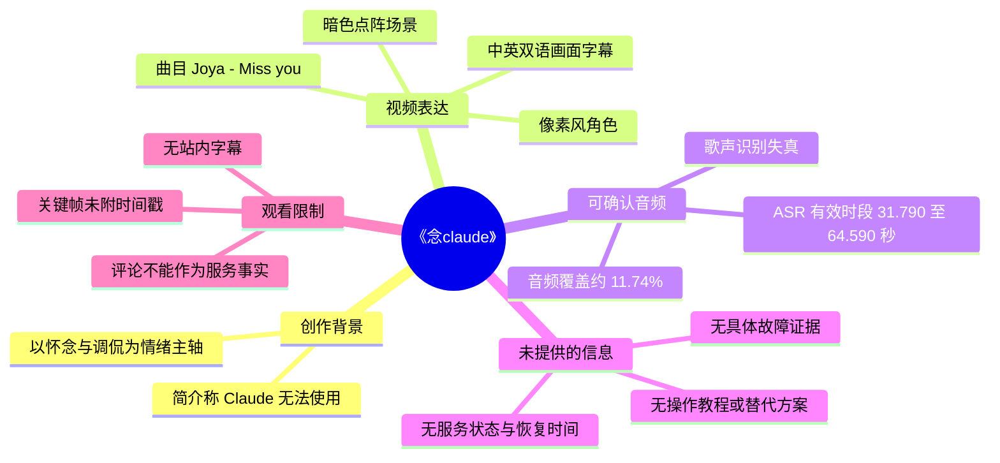
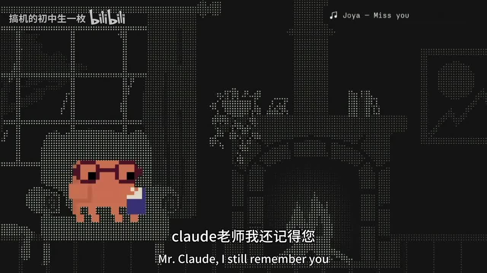
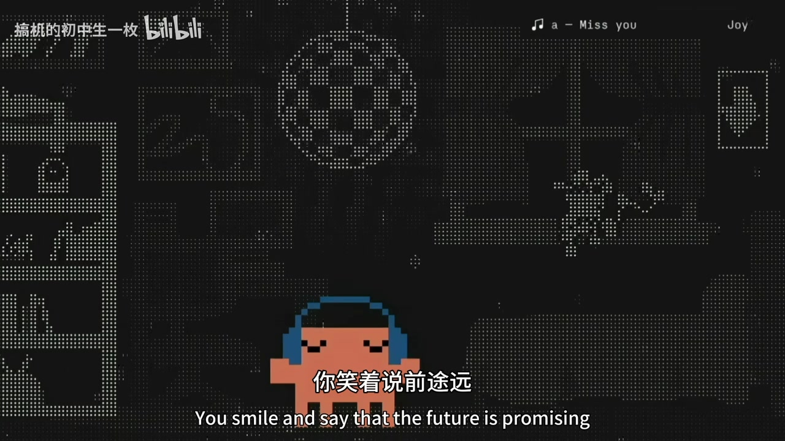

# claude老师 我还记得你——《念claude》

> 来源：[Bilibili 视频](https://www.bilibili.com/video/BV1mi7X6gEQF) 
> UP 主：搞机的初中生一枚｜发布时间：2026-06-03｜视频时长：02:27｜分辨率：1920×1080

## 小结

这是一支围绕 Claude 的短篇情绪化二创视频，而非 Claude 产品功能演示、技术教程或新闻报道。UP 主在简介中直接写道“Claude无法使用了呜呜呜呜”，并以“克劳德老师～我还记得你～”概括创作动机；标题《念claude》也指向对 Claude 暂时无法使用的怀念与调侃。

视频以像素风角色、暗色点阵城市／室内背景和歌曲《Miss you》的画面化表达构成主体。已提供画面可见粉色像素角色，以及“claude老师我还记得您”“克劳德老师我还记得你”“你笑着说前途远”等中英双语字幕；右上角显示曲目为“Joya - Miss you”。

可由本次 ASR 确认的有声内容仅分布在 00:31.790—01:04.590，合计约 17.24 秒、覆盖全片约 11.74%。识别文本明显受到歌声、伴奏及可能的混响影响，大量词语失真，不能据此还原完整歌词或据此推断 Claude 的具体故障原因。

视频没有给出 Claude 无法使用时的报错页面、服务状态、地区、账号类型、网络环境、恢复时间、替代方案或操作步骤。因此，“无法使用”只能作为 UP 主在视频简介中表达的个人使用情境，不能扩展为 Claude 的普遍性服务结论。

这份笔记适合需要快速辨识视频主题、画面表达、字幕可信度和时效边界的读者。若要判断 Claude 在当前是否可用，应以 Anthropic 官方状态页、账户提示和实时服务公告为准，不能以本视频或评论区代替验证。

## 思维导图

## 目录

- [背景与时效边界](#背景与时效边界)
- [视频内容与视觉叙事](#视频内容与视觉叙事)
  - [ASR 可定位的歌曲段落](#asr-可定位的歌曲段落)
  - [像素画面与双语字幕](#像素画面与双语字幕)
- [技术信息、参数与可复用经验](#技术信息参数与可复用经验)
- [结论与限制](#结论与限制)
- [字幕比对](#字幕比对)
- [评论分析](#评论分析)
- [处理记录](#处理记录)

## 背景与时效边界 [00:31](https://www.bilibili.com/video/BV1mi7X6gEQF?t=31)

视频标题为“claude老师 我还记得你——《念claude》”，归入 `AIcode` 合集，标签包含“人工智能”“claude”“ChatGPT”“claude code”“vibe coding”等。不过，标签仅说明发布者关联的主题范围，**不能证明视频实际比较或讲解了 ChatGPT、Claude Code、Vibe Coding 等产品功能**。

UP 主简介中的原话是：

> Claude无法使用了呜呜呜呜，克劳德老师～我还记得你～

据此可确认：视频表达的是创作者对 Claude 不可用状态的失落、怀念和玩梗。不能确认的包括：

- “无法使用”是网页端、移动端、API、Claude Code，还是其他接入方式；
- 问题是服务端故障、区域限制、账号限制、网络异常、订阅状态，还是单次访问异常；
- 不可用发生的准确时间、影响范围及持续时长；
- 该状态在视频发布后是否已经恢复。

视频发布于 2026-06-03，服务可用性具有强时效性。即使该描述在发布时真实，也不应将其当作 2026-07-16 素材抓取时或之后的实时状态判断。

## 视频内容与视觉叙事

### ASR 可定位的歌曲段落 [00:31](https://www.bilibili.com/video/BV1mi7X6gEQF?t=31)

本次 ASR 的首个有效片段从 **00:31.790** 开始，最后一个片段结束于 **01:04.590**。该区间内是带人声的歌曲段落，但转写结果残缺且存在明显误识别：

| 时间段 | 本次 ASR 原文 | 可确定程度 | 说明 |
| --- | --- | --- | --- |
| [00:31.790—00:34.700](https://www.bilibili.com/video/BV1mi7X6gEQF?t=31) | 云端上像雪一 | 低 | 语义不完整，不能当作可靠歌词。 |
| [00:36.980—00:42.020](https://www.bilibibili.com/video/BV1mi7X6gEQF?t=36) | 样笑着说前途远别献疤子 | 中低 | 与画面中可见的“你笑着说前途远”存在局部对应，但后半句无法可靠校正。 |
| [00:44.070—00:47.020](https://www.bilibili.com/video/BV1mi7X6gEQF?t=44) | 多少多深回家 | 低 | 词组不连贯，无法据此还原原句。 |
| [00:53.100—00:57.660](https://www.bilibili.com/video/BV1mi7X6gEQF?t=53) | 句话都在我心里一起 | 低 | 疑似歌词片段，但缺少可靠画面字幕或站内字幕佐证。 |
| [01:00.180—01:01.340](https://www.bilibili.com/video/BV1mi7X6gEQF?t=60) | 过来 | 低 | 单独词语，语境不足。 |
| [01:03.970—01:04.590](https://www.bilibili.com/video/BV1mi7X6gEQF?t=63) | 回了 | 低 | 单独词语，语境不足。 |

其中，00:36.980—00:42.020 的 ASR 文本“样笑着说前途远”与关键帧里清晰可见的画面字幕“你笑着说前途远”相互印证。可谨慎将这一小段校正为画面所示文字；除此之外，不能基于模糊识别结果补写或引用完整歌词。

### 像素画面与双语字幕 [00:36](https://www.bilibili.com/video/BV1mi7X6gEQF?t=36)

视频采用低分辨率像素角色叠加暗色点阵背景的视觉风格。已提供关键帧显示，角色在类似城市建筑、窗户、街道或室内墙面的抽象点阵场景中移动；这种画面风格与“怀念”“失联”主题形成统一的怀旧、孤独氛围。

> 图：该关键帧展示粉色像素角色、点阵背景及“claude老师我还记得您 / Mr. Claude, I still remember you”的中英双语文字。它直接证明视频的核心表达是对 Claude 的拟人化怀念，而不是功能教学画面。

从关键帧可直接读取到的画面文字包括：

- “claude老师我还记得您 / Mr. Claude, I still remember you”；
- “克劳德老师我还记得你 / Miss Claude, I still remember you”；
- “你笑着说前途远 / You smile and say that the future is promising”。

这几句中，中文对 Claude 的称呼在不同画面里出现“老师”与“克劳德老师”的拟人化表达；英文也可见 `Mr. Claude` 和 `Miss Claude` 两种称谓。它们是视频的画面文案，反映的是二创叙事与语言玩梗，不宜按严格的人称、性别或产品官方命名解读。

> 图：该关键帧展示戴蓝色耳机的像素角色，以及“你笑着说前途远 / You smile and say that the future is promising”。其价值在于可用于校正 00:36.980—00:42.020 附近 ASR 中可辨的“笑着说前途远”片段；但关键帧素材本身未提供精确采样时间，因此不能把该画面逐帧等同于某一个精确秒点。

画面右上角还显示“Joya - Miss you”。在现有素材下，可确认视频画面标注了这一曲目名称；但未提供版权授权、音源出处或完整歌词信息，不能进一步推断音乐使用授权状况。

## 技术信息、参数与可复用经验 [00:31](https://www.bilibili.com/video/BV1mi7X6gEQF?t=31)

本视频本身没有演示 Claude、Claude Code 或其他 AI 工具的使用步骤，也没有代码、命令、提示词、模型参数、接口参数或配置过程。因而不存在可从原视频提炼的产品实操流程。

素材处理阶段可确认的音频识别参数如下，这些是**本次整理流程的 ASR 参数，不是视频作者提供的技术配置**：

| 项目 | 值 |
| --- | --- |
| 音频总时长 | 146.8198125 秒 |
| 识别语言 | 中文（`zh`） |
| 语言自动检测置信度 | 0.99072265625 |
| 请求语言 | `auto` |
| ASR 模型 | `medium` |
| 运行设备 | `cuda` |
| 计算精度 | `float16` |
| 有效语音片段数 | 6 |
| 有声时长 | 17.24 秒 |
| 语音覆盖率 | 11.74% |
| 首段语音开始 | 31.79 秒 |
| 最后一段语音结束 | 64.59 秒 |

对类似“歌曲 + 动画字幕 + 情绪表达”的视频，可复用的整理方法是：

1. **先区分来源层级**：视频简介、画面文字、ASR、评论的可信度不同。简介可说明创作动机，画面可确认屏显文案，ASR仅在可辨识时用于时间定位，评论则属于观众反馈。
2. **以带时间戳的 ASR 定位，而非按文案顺序猜时间**：本片只有 6 段 ASR，因此正文链接集中在 00:31—01:04 的可验证范围。
3. **用清晰关键帧局部校正，不扩写模糊歌词**：如“你笑着说前途远”可被画面与 ASR 局部共同支持；其余失真片段保留不确定性。
4. **将服务状态和创作者情绪分开**：创作者说“无法使用”可以解释作品主题，但不能替代服务状态监测或故障归因。
5. **注明视觉素材的时间限制**：本任务提供的关键帧列表未带逐帧秒数，故其适合解释画面内容，不适合生成未经证实的精确画面时间轴。

## 结论与限制 [01:03](https://www.bilibili.com/video/BV1mi7X6gEQF?t=63)

《念claude》是一支将 Claude 拟人化为“老师”、以“想念”为主题的像素风音乐二创短片。视频的有效信息重点不在技术知识，而在三个层面：

1. **创作背景**：UP 主自述 Claude 无法使用，并把该情境转化为怀念式表达；
2. **叙事形式**：像素角色、暗色点阵背景、中英双语文案与《Miss you》曲目画面标注共同营造情绪；
3. **证据边界**：视频没有展示 Claude 故障的技术证据，也没有给出处理办法，不能据此形成任何关于产品稳定性、区域可用性或 API 状态的结论。

主要限制如下：

- 无可用 Bilibili 站内字幕，无法用官方/投稿字幕验证歌词；
- 本次 ASR 只有约 11.74% 语音覆盖，且歌声识别质量较低；
- 提供的关键帧没有对应的精确采样时间；
- 视频简介是创作者陈述，不是服务状态公告；
- 热评仅获取到两条，少于要求分析上限的“三条”，且均不构成技术证据；
- Claude 的可用性高度时效化，视频发布日的使用体验不能外推至当前。

## 字幕比对

| 字幕来源 | 完整性 | 专有名词 | 时间轴 | 主要问题 |
| --- | --- | --- | --- | --- |
| Bilibili 站内字幕 | 未提供可用字幕 | 无法核验 | 无法核验 | 素材明确标注“未提供可用站内字幕”。 |
| 本次 ASR 字幕 | 较低：仅 6 段、17.24 秒有声识别 | `Claude` 未被可靠识别；歌词多处失真 | 有：SRT 时间戳可直接使用，范围 00:31.790—01:04.590 | 受音乐、歌声与伴奏影响，出现“别献疤子”“多少多深回家”等无可靠语义的识别结果。 |

最终字幕策略：**不采用任何一份 ASR 作为完整歌词字幕**。正文以本次 ASR 的 SRT 时间为时间轴依据，并以关键帧中清晰可读的画面文字进行有限校正。

已进行的关键校正：

- ASR 在 [00:36.980—00:42.020](https://www.bilibili.com/video/BV1mi7X6gEQF?t=36) 识别出“样笑着说前途远别献疤子”；
- 关键帧中清晰显示“你笑着说前途远 / You smile and say that the future is promising”；
- 因而仅确认“你笑着说前途远”这一画面文案，**不对 ASR 后半段“别献疤子”作任何补写或语义解释**。

ASR 诊断中未标记 `noAudioStream=true`；相反，素材包含 `audio/audio.wav`，并识别到带时间戳的语音片段。因此本片不是“无音轨视频”，而是音频中的可稳定转写内容较少、识别质量受歌曲影响。

## 评论分析

本次仅获取到 **2 条热评**，少于可处理上限“前三条”；以下仅分析这两条，不补充未获取的评论。

### 1. 遂光_（3655 赞）

评论原文：

> 我：克勞德老師的status有點發橙，可能是服务器不好（X）  
> 克勞德老師：你代码寫不過我你信不信  
> [笑哭]

这条评论延续了视频将 Claude 拟人化为“老师”的表达，并把“状态发橙”与“代码能力强”的刻板印象结合起来，形成“不是服务器问题，而是 Claude 在嘲讽用户代码水平”的玩笑。

其补充信息价值有限：“status有点发橙”没有链接、截图、具体时间或官方来源，不能验证其所指状态页、状态颜色或服务异常是否真实。评论中的“你代码写不过我”显然是戏谑性拟人台词，不应解读为 Claude 的实际回复或性能结论。

### 2. 蕾姆酱是我老婆゙（2055 赞）

评论原文：

> [doge_金箍]

该评论只包含表情，不提供关于 Claude 可用性、视频制作、音乐出处或技术问题的可验证补充信息。其高点赞更多反映观众对玩梗氛围的互动，不构成事实材料。

## 处理记录

- Worker ID：`worker-mrj0www4-e8d79408`
- 模型：`gpt-5.6-terra`
- 调用工具与模型：素材处理链已生成合并视频、WAV 音频、关键帧、ASR SRT、ASR 结构化结果及评论 JSON；ASR 模型为 `medium`，运行于 `cuda`，计算精度为 `float16`。
- 使用的素材：`audio/audio.wav`、`asr/transcript.srt`、`asr/asr-result.json`、`frames/`、`comments/comments.json`、视频元数据与视频简介。
- 字幕选择：站内字幕不可用；已检查本次 ASR，采用其真实 SRT 时间戳作为时间定位依据。由于歌声识别失真，未将 ASR 当作完整歌词，仅以关键帧可读文字进行局部交叉校正。
- 关键帧选择依据：选用 `frames/frame-001.jpg` 展示标题性文案“claude老师我还记得您”及像素角色，选用 `frames/frame-004.jpg` 展示“你笑着说前途远”的双语文案，二者均直接服务于主题与字幕校正说明。关键帧清单未提供逐帧时间戳，故未为其虚构精确出现时间。
- 评论处理：请求上限为 3 条，实际可获取 2 条；已逐条分析，未将评论内容升级为已验证事实。
- 缓存清理：提供的素材未包含缓存清理执行记录，无法确认是否已清理；本记录不虚构清理结果。
- 未解决问题：无法从现有素材确认 Claude 具体不可用原因、受影响范围、当时或当前服务状态；无法可靠还原完整歌词；无法确定每张关键帧的精确秒点。
