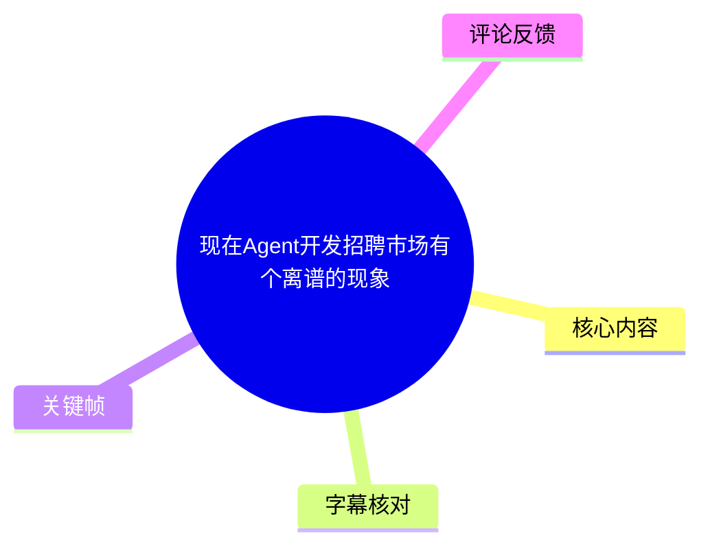
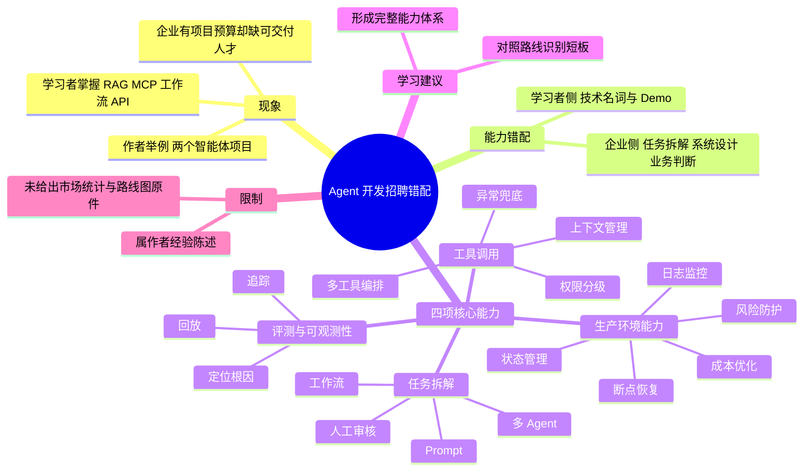
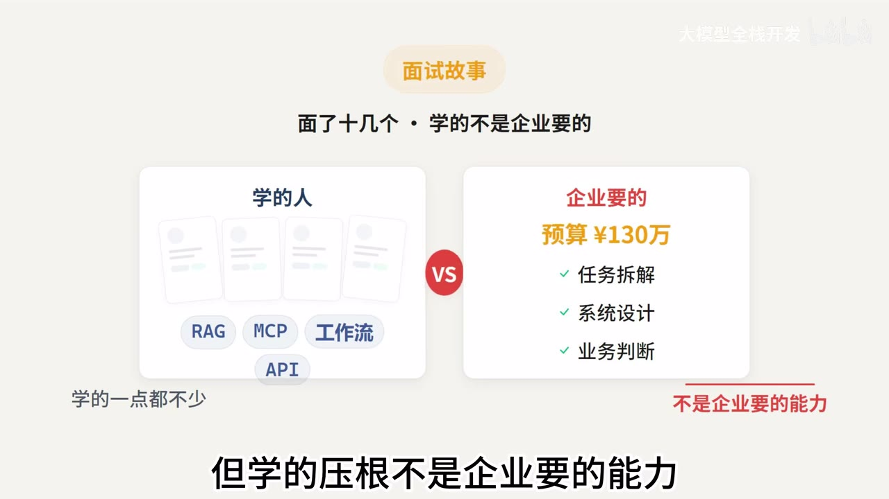
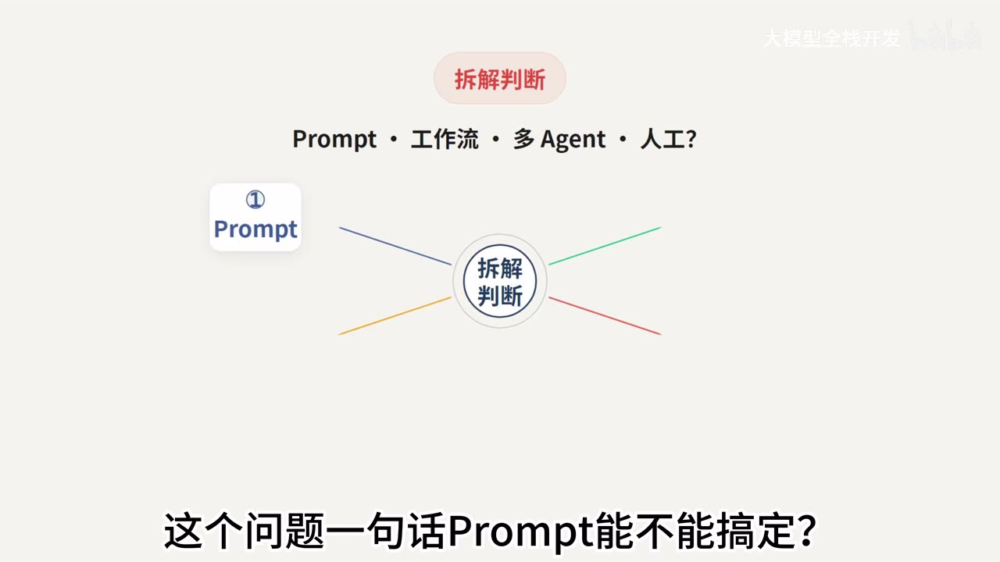

# 现在Agent开发招聘市场有个离谱的现象

> 来源：[Bilibili 视频](https://www.bilibili.com/video/BV1EU3164EM6) 
> UP 主：大模型全栈开发｜时长：02:48｜分辨率：3840 × 2160｜合集：AIcode  
> 视频发布于 2026-07-29。视频中的招聘现象、项目预算、学习路线名称均为作者在该时间点的陈述，不构成完整市场统计或岗位标准。

## 小结

视频讨论的核心矛盾是：许多求职者学习了 Agent、RAG、MCP、工作流和 API 调用，却仍难以承接项目或找到工作；作者认为原因不在于“学得少”，而在于所学能力与企业实际交付需求错位。

作者以朋友公司的两个智能体项目为例：一个项目“近百万”，另一个“近 30 万”，因缺人手面试十余位候选人后，得到“很多人学得不少，但不是企业要的能力”的判断。画面将两类能力对比为：学习者侧的 RAG、MCP、工作流、API，与企业侧的任务拆解、系统设计、业务判断；合计项目预算在画面中被概括为“130 万”。

视频给出的能力框架有四项：**任务拆解、工具调用、评测与可观测性、生产环境能力**。前两项决定能否把需求做出来，后两项决定成品是演示型 Demo 还是可以交付的产品。

对学习者而言，最可执行的启示不是继续堆叠框架和教程，而是将每个练习项目补齐完整链路：先判断是否需要 Prompt、工作流或多 Agent；再设计工具权限、异常与上下文；随后建立可追踪、可回放、可定位的评测与观测能力；最后验证中断、人工审核、恢复、日志、风险和成本等生产问题。

重要限制是：视频没有提供岗位样本、薪资数据、项目合同、候选人能力明细或评测指标。因此“企业招不到人”“90% 的人容易漏掉”等说法应视为作者的经验性判断，而不是可由本视频独立验证的行业结论。结尾提到的“2026 大模型学习路线图”也只说明其覆盖范围，未在视频中展示路线图原件或具体课程内容。

## 思维导图

## 目录

- [背景：技术学习与企业交付之间的错配](#背景技术学习与企业交付之间的错配)
- [能力一：任务拆解与方案判断](#能力一任务拆解与方案判断)
- [能力二：工具调用不是单纯调用 API](#能力二工具调用不是单纯调用-api)
- [能力三：评测与可观测性](#能力三评测与可观测性)
- [能力四：面向生产环境的工程能力](#能力四面向生产环境的工程能力)
- [从 Demo 到交付：四项能力的组合关系](#从-demo-到交付四项能力的组合关系)
- [学习路线与行动清单](#学习路线与行动清单)
- [结论、限制与时效性](#结论限制与时效性)
- [字幕比对](#字幕比对)
- [评论分析](#评论分析)
- [处理记录](#处理记录)

## 背景：技术学习与企业交付之间的错配 [00:00](https://www.bilibili.com/video/BV1EU3164EM6?t=0)

作者开场提出一个“细思极恐”的现象：一边有人高强度学习 Agent、RAG、MCP，并在简历中列出这些技术；另一边企业拿着数十万元预算，却难以招到合适的人。

在 [00:12](https://www.bilibili.com/video/BV1EU3164EM6?t=12) 至 [00:26](https://www.bilibili.com/video/BV1EU3164EM6?t=26) 的案例中，作者转述一位朋友的经历：

- 朋友所在公司刚承接两个智能体项目；
- 项目金额分别为“近百万”与“近 30 万”；
- 因人手不足，该朋友亲自面试十多位候选人；
- 面试后的主观结论是：候选人并非没有学习，而是学习方向未对准企业实际需要。

> 图：画面将“学的人”掌握的 **RAG、MCP、工作流、API**，与“企业要的”**任务拆解、系统设计、业务判断**并列，并标注“预算 ¥130 万”。它直观呈现视频的中心论点：技术关键词的积累不等于交付能力。这里的 130 万可由视频所述“近百万 + 近 30 万”理解为画面中的概括，但不是经过外部核验的项目金额。

作者进一步强调，“会搭工作流、会调 API”只是进入该领域的**敲门砖**，不足以单独证明可以完成企业级智能体项目。随后视频按四项能力展开说明。

## 能力一：任务拆解与方案判断 [00:38](https://www.bilibili.com/video/BV1EU3164EM6?t=38)

作者将第一项能力定义为**任务拆解能力**。其前提是：企业抛给开发者的通常不是边界清晰的技术题，而是混杂流程、规则、数据和人工环节的业务问题。

> 图：画面以“拆解判断”为中心，列出 Prompt、工作流、多 Agent、人工四个方向。这是理解作者方案选择逻辑的关键帧：先做架构与流程判断，再决定是否编码，而不是默认任何问题都使用 Agent。

### 作者提出的拆解顺序

面对一个业务需求，作者建议先判断：

1. **一句 Prompt 能否解决？**  
   若任务目标明确、输入输出简单，未必需要复杂编排。

2. **是否应采用工作流？**  
   当任务可分为稳定的串并行步骤，且步骤之间有确定的数据流或规则时，需要考虑工作流。

3. **是否需要多 Agent 协同？**  
   视频没有给出多 Agent 的具体触发阈值、框架或实现方式，只提出这是需要在方案阶段判断的选项，而不是默认选择。

4. **哪些环节能自动执行？**  
   应识别可重复、规则相对清晰、风险可控的步骤。

5. **哪些环节必须保留人工审核？**  
   对影响业务结果、涉及高风险操作或需要责任确认的节点，作者主张预留人工审核口子。

视频的明确观点是：不具备业务拆解能力，即使学习很多框架也难以形成价值。这里的“拆解”不仅是拆技术任务，也包括判断自动化边界与人工边界。

## 能力二：工具调用不是单纯调用 API [01:03](https://www.bilibili.com/video/BV1EU3164EM6?t=63)

第二项能力是**工具调用能力**。作者反对把智能体效果不佳简单归因于“模型不够强”，认为多数项目失败的责任点更可能在工具设计本身。

视频列出了影响智能体能否落地的四个设计问题：

| 工具设计问题 | 视频强调的含义 |
| --- | --- |
| 权限如何分级 | 不同操作应有不同授权边界，不能让智能体无差别执行所有动作。 |
| 异常如何兜底 | 工具调用失败、返回异常或流程偏离时，需要有处理路径。 |
| 上下文如何管理 | 智能体调用工具前后，需要管理其获得与保留的信息。 |
| 多工具如何编排 | 不只是“能调一个工具”，还要处理多个工具之间的调用关系与顺序。 |

作者的区分标准是：这些能力决定智能体能否**落地**，而不是能否运行一个 Demo。视频未展开工具协议、接口格式、鉴权模型、重试策略或具体代码，因此不能从中推导出某种具体技术实现；但它清楚地把“工具设计”置于模型能力之外，作为工程交付的独立能力层。

## 能力三：评测与可观测性 [01:22](https://www.bilibili.com/video/BV1EU3164EM6?t=82)

作者认为，**评测和可观测性**是“90% 的人最容易漏掉的能力”。这里的“90%”是视频中使用的强调性比例，未附带调查来源或统计口径。

视频批评用“我感觉效果还行”作为智能体评估方式，并指出企业不能依赖主观感觉。作者要求以下对象应当可被检查：

- 每一次推理；
- 每一次工具调用；
- 每一个关键节点。

对应的可观测性目标是：

- **能追踪**：知道流程运行到了哪里、发生过什么；
- **能回放**：可以复现或查看一次运行的过程；
- **能定位**：出现问题后能够找到根因或故障位置。

作者的结论是：如果出了问题连根因都找不到，就无法谈稳定交付。视频没有给出指标设计方法，例如成功率、任务完成率、幻觉率、延迟、成本、人工介入率，也没有展示链路追踪平台；因此这些具体指标应被视为实施时仍需补充的内容，而非视频已给出的参数。

## 能力四：面向生产环境的工程能力 [01:43](https://www.bilibili.com/video/BV1EU3164EM6?t=103)

第四项是**生产环境能力**，作者认为这是最能拉开差距的部分。其核心判断是：实验室环境运行顺畅，不代表投入生产后仍然可靠；上线后会遇到报错、中断、等待人工审核等情况。

作者点名的生产要求包括：

| 生产问题 | 视频中的要求 |
| --- | --- |
| 报错与中断 | 系统需要面对而非假设流程永远成功。 |
| 人工审核等待 | 流程应能在等待审核时保存状态，而不是丢失进度。 |
| 执行状态管理 | 需要管理流程所处状态。 |
| 断点恢复 | 中断后应具备恢复能力。 |
| 日志监控 | 需要记录运行信息并进行监控。 |
| 风险防护 | 需要处理运行与业务风险。 |
| 成本优化 | 生产项目还需关注成本。 |

视频将这些要素视为交付的必要组成部分，并强调“缺一个都交不了差”。这一说法体现作者的工程标准，但并未给出可量化的服务等级目标、并发量、预算上限、部署架构或安全合规方案。

## 从 Demo 到交付：四项能力的组合关系 [02:00](https://www.bilibili.com/video/BV1EU3164EM6?t=120)

作者用一句话概括四项能力的关系：

- **前两点**——任务拆解、工具调用——决定“做不做得出”；
- **后两点**——评测与可观测性、生产环境能力——决定做出来的是“玩具”还是“能交付的产品”。

据此可以把视频的实践路径整理为以下检查清单。该清单是对作者连续表达的结构化重组，并非视频展示的实际操作界面或标准流程。

1. **明确业务问题与结果边界**  
   不要把模糊业务描述直接翻译成“做一个 Agent”。

2. **选择最小充分方案**  
   按 Prompt、工作流、多 Agent、人工审核的关系做方案判断；视频强调的是判断能力，并没有主张多 Agent 一定优于其他方案。

3. **设计工具与控制边界**  
   梳理权限、异常处理、上下文管理和多工具编排。

4. **为运行过程建立观测与评测机制**  
   让推理、工具调用和关键节点能够追踪、回放、定位。

5. **在生产约束下验证流程**  
   重点检查报错、中断、人工等待、状态管理、断点恢复、日志监控、风险与成本。

这条链路的要点在于：技术组件只是其中一部分；从业务理解到运行保障的闭环，才是视频所称的“完整能力体系”。

## 学习路线与行动清单 [02:15](https://www.bilibili.com/video/BV1EU3164EM6?t=135)

作者解释，很多人学习半年 AI 教程、浏览大量资料后仍接不到项目或找不到工作，原因在于没有形成完整能力体系。结尾中，作者称自己将两年踩坑经历和企业真实用人标准拆分整理为一份“2026 大模型学习路线图”。

视频口述该路线图覆盖：

- 大模型核心原理；
- Agent 到 AI 应用开发；
- RAG 知识库体系；
- MCP 与工具调用；
- AI 产品设计与需求分析；
- 企业级项目落地框架。

作者建议观众对照路线图识别当前卡点，并据此决定下一阶段需要补什么，避免闷头、盲目学习。视频最后引导观众在评论区发送“AI路线图”索取资料。

### 可据视频执行的自查问题

- 我能否把一个业务需求拆成自动化步骤、人工步骤和风险点？
- 我是否只会调用工具，还是已经设计过权限、异常、上下文与工具编排？
- 我的项目能否查看单次运行的关键节点，并在失败后定位问题？
- 流程暂停、中断或等待人工审核后，能否恢复？
- 我是否只做过展示型 Demo，还是处理过日志、监控、风险和成本问题？

这些问题来源于视频的能力框架；答案标准与实施深度则需结合目标岗位、业务风险与团队工程规范另行确定。

## 结论、限制与时效性 [02:40](https://www.bilibili.com/video/BV1EU3164EM6?t=160)

视频的主结论是：AI 时代不仅比努力，更比学习和实践的方向；方向偏离时，持续投入不一定转化为可就业或可交付的能力。

### 可迁移经验

- 不要把 RAG、MCP、工作流、API 等关键词本身等同于项目交付能力。
- 应将“方案判断—工具设计—可观测性—生产保障”视为连续工程链路。
- 求职或接项目时，展示能处理业务边界、异常与运行保障的项目经历，至少在作者的框架中比单纯罗列技术名词更有价值。

### 信息边界

- 两个智能体项目、项目金额和面试结果均为作者转述的个案，没有独立佐证材料。
- 视频没有呈现招聘 JD、候选人简历、项目需求、源码、部署配置或评测数据。
- “90% 的人”及“缺一个都交不了差”属于作者观点，不应泛化为所有企业、所有行业的统一标准。
- 视频发布时间为 2026-07-29；Agent 框架、MCP 生态、企业招聘要求和项目报价可能随时间变化。
- 视频提到路线图但未展示完整内容，不能据此评估其准确性、完整性或适配性。

## 字幕比对

| 字幕来源 | 完整性 | 专有名词 | 时间轴 | 主要问题 |
| --- | --- | --- | --- | --- |
| Bilibili 站内字幕 `p01-ai-zh.srt` | 覆盖约 00:00–02:47，内容分段完整 | 大部分正确，可从上下文识别 Agent、RAG、MCP、Prompt、IDE、API、Demo 等 | 细粒度，起止时间连续，适合正文时间轴 | 首句写作“AIHA”；“掉 API”等存在口语/转写表达；个别断句不自然 |
| 本次 ASR `large-v3-turbo` | 诊断称语音覆盖约 82.08%，但仅输出 7 个超长片段 | 多处误识别，如“LHN”“LAG”“智慧体”“ID鞋代码”“日值监控”“路纷图” | 明显异常：首段从 00:29.800 开始，却将开场至约 00:31 的大量内容压入同一短片段 | 时间戳与文本长度不匹配，专名和术语误识别较多，不宜作为正文主时间依据 |

### 最终字幕选择

正文以**站内时间轴字幕**作为时间定位与文本骨架，因为其从 00:00.080 起连续分段，与视频时长基本一致；所有章节链接均按其真实 SRT 起点换算为秒数。

本次 ASR 已被检查：识别语言为中文，模型为 `large-v3-turbo`，诊断未标记 `noAudioStream=true`，因此不能将其归类为“源视频无音轨”。不过，其首段时间定位与容纳文本量明显矛盾，且存在较多术语误识别，故仅用于交叉核对整体主题，不用于确定章节时间。

结合视频标题、站内字幕上下文及关键帧文字，对以下重要词语采用规范写法：

- “AIHA / LHN”校正为 **Agent**；
- “LAG”校正为 **RAG**；
- “智慧体”校正为 **智能体**；
- “ID鞋代码”校正为 **IDE 写代码**；
- “日值监控”校正为 **日志监控**；
- “路纷图 / AI路纯图”校正为 **路线图 / AI路线图**。

## 评论分析

本次素材可获取热评 **2 条**，少于要求的前三条；以下仅分析已获取内容，不将评论视作已验证事实。

### 1. 不对称CPT：企业需求定义与培养责任的质疑

评论认为，问题的关键不只是应聘者能力不足，还包括企业希望候选人拥有真实场景经验、却不愿培养；同时，部分企业自身也未理清需求“线头”，却希望以较低薪酬快速招到能解决复杂问题的人。

这条评论对视频形成了重要补充：作者主要从求职者能力体系角度解释错配，而评论将视角扩展到企业的需求清晰度、招聘预期和培养投入。该观点具备现实讨论价值，但评论未提供企业样本、薪资地区、岗位描述或招聘数据，不能据此确认“多数企业”的实际情况。

### 2. -心跳0822：索取学习资料

评论仅发送“AI路线图”，对应视频结尾“评论区打 AI 路线图直接发你”的引导。这说明该观众主要将视频作为学习资料入口，而没有对四项能力框架提供额外论证或反驳。

## 处理记录

- Worker ID：`worker-mrj0wbly-5dc4e50c`
- 整理模型：`gpt-5.6-terra`
- ASR 模型：`large-v3-turbo`（语言：`zh`；设备：`cuda`；计算类型：`int8_float16`）
- 可用素材与工具产物：合并视频 `merged.mp4`、音频 `audio/audio.wav`、关键帧目录 `frames/`、站内字幕 `subtitles/`、ASR 结果 `asr/asr-result.json` 与 `asr/transcript.srt`、评论文件 `comments/comments.json`。
- 字幕选择：站内字幕 `p01-ai-zh.srt` 作为主字幕和时间轴依据；本次 ASR 已交叉检查，但因时间轴严重压缩、专名误识别较多，仅作辅助核验。
- 关键帧选择依据：`frames/frame-002.jpg` 清晰展示学习者技术栈与企业能力要求、130 万预算的对比；`frames/frame-004.jpg` 展示 Prompt、工作流、多 Agent、人工审核四种方案判断，均直接支撑正文核心论点。
- 评论处理范围：仅处理素材中可获取的 2 条热评；未虚构第 3 条评论。
- 缓存清理：提供的素材未包含缓存清理执行记录；本文不虚构清理结果。
- 未解决问题：未提供完整路线图文件、岗位样本、项目合同、技术实现、评测数据及关键帧的精确抽帧时间，故未对这些内容作超出素材的推断。
