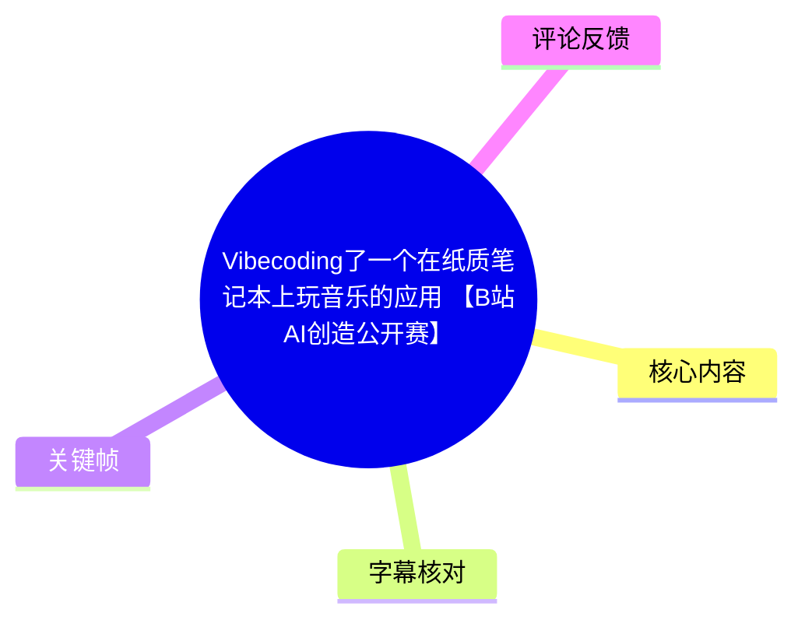
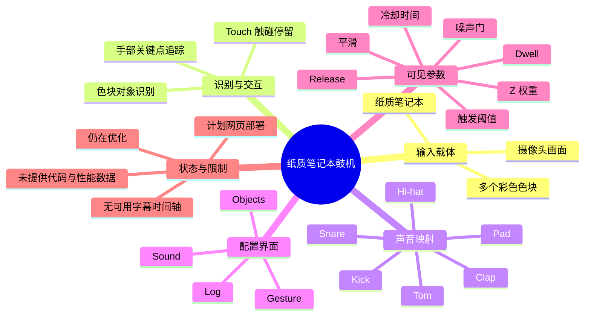
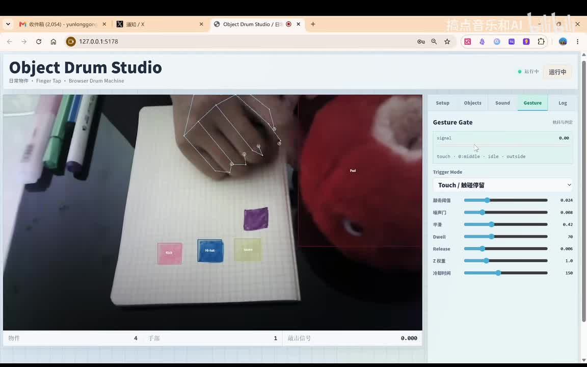
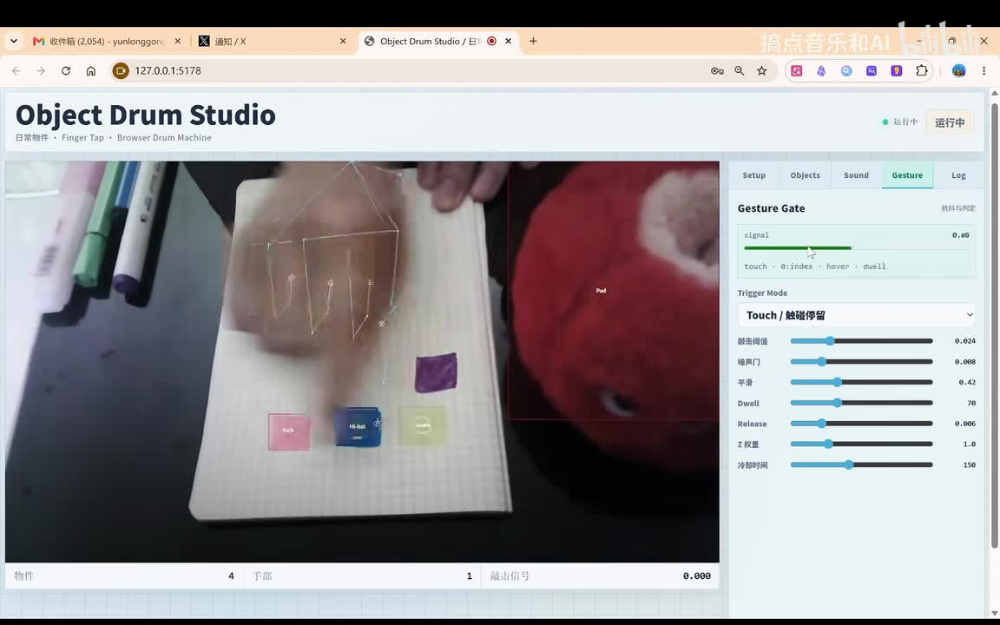
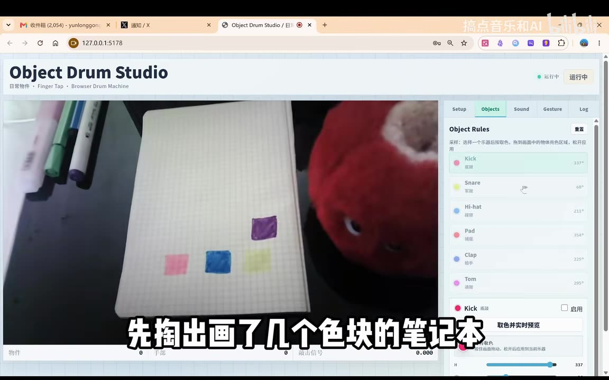
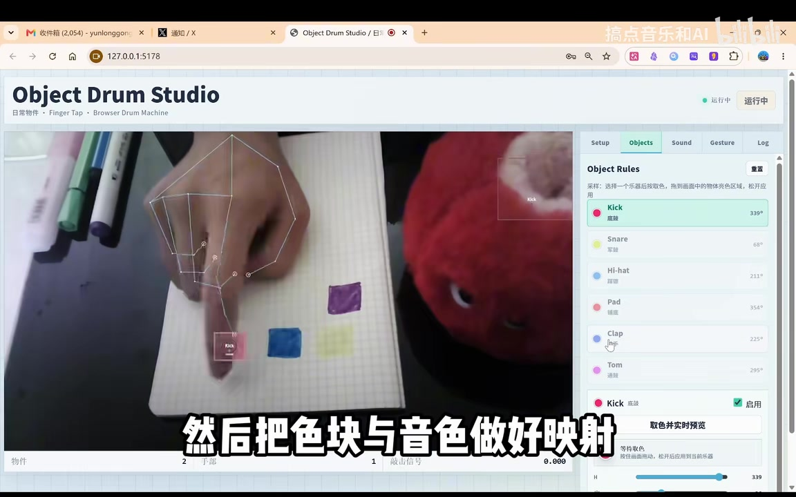

# Vibecoding了一个在纸质笔记本上玩音乐的应用 【B站AI创造公开赛】

> 来源：[Bilibili 视频](https://www.bilibili.com/video/BV13SEx66E3R) 
> UP 主：搞点音乐和AI｜视频时长：75 秒｜分辨率：1920 × 1200 
> 数据快照：抓取时播放 81,298、点赞 1,812、收藏 2,122、投币 245、分享 393、评论 149。

## 小结

这是一段展示型项目视频：UP 主制作了一个名为 **Object Drum Studio** 的浏览器应用，将纸质笔记本上的彩色色块识别为可触发的“对象”，再通过手部手势与色块发生交互，从而模拟鼓机/打击乐器演奏。

从画面可确认的核心链路是：在笔记本上画出多个色块 → 为色块配置或采样对应音色 → 摄像头识别纸面中的色块区域 → 追踪手部关键点 → 依据“触碰停留（Touch / 触碰停留）”等手势规则触发声音。应用界面包含 `Setup`、`Objects`、`Sound`、`Gesture`、`Log` 等功能页，说明项目至少把对象映射、声音配置、手势门控和日志分别组织。

视频中可见已配置的打击乐器类别包括 Kick、Snare、Hi-hat、Pad、Clap、Tom；其中 `Objects` 页给出了各对象的颜色标记和角度数值，`Gesture` 页展示了触发阈值、噪声门、平滑、停留时间、释放、Z 权重和冷却时间等参数。画面显示这些是当前演示配置，不应将其视为通用推荐参数或性能基准。

适合希望探索“实物交互 + 视觉识别 + 音乐控制”原型的人阅读。该项目的可迁移思路不局限于鼓机：纸上的图形、颜色或自定义标记可作为低成本实体控制界面。但视频没有提供代码、模型名称、浏览器兼容性、识别精度、延迟、声音引擎实现与部署地址，无法据此完整复现。

项目仍处于迭代阶段。视频简介明确称“还在优化细节”，并计划后续部署为网页供体验；因此其功能范围、参数与可访问方式均具有时效性。抓取素材中没有可用站内字幕，且本次 ASR 没有识别出语音片段，以下时间轴只能可靠定位到视频起点，不能将画面中的具体步骤精确绑定到秒级位置。

## 思维导图

## 目录

- [项目背景与素材边界](#项目背景与素材边界)
- [演示系统：纸面色块到鼓机触发](#演示系统纸面色块到鼓机触发)
- [对象与音色映射](#对象与音色映射)
- [手势门控与可见参数](#手势门控与可见参数)
- [可观察的操作流程](#可观察的操作流程)
- [复现边界、限制与时效性](#复现边界限制与时效性)
- [字幕比对](#字幕比对)
- [评论分析](#评论分析)
- [处理记录](#处理记录)

## 项目背景与素材边界 [00:00](https://www.bilibili.com/video/BV13SEx66E3R?t=0)

视频标题将项目描述为“在纸质笔记本上玩音乐的应用”，视频简介进一步将其概括为一个“手势交互 + 实物识别 + 鼓机模拟”的项目。由此可将其定位为一个把普通纸面作为交互平面的音乐应用原型，而非单纯的屏幕鼓机。

画面中的应用标题为 **Object Drum Studio**，副标题为：

> 日常物件 · Finger Tap · Browser Drum Machine

其中，“日常物件”“Finger Tap”“Browser Drum Machine”是界面中实际可见的产品定位文本；它们表明演示目标是借助手指操作实体物件，并在浏览器中完成鼓机交互。

需要注意以下素材边界：

- 没有提供可用的 Bilibili 站内字幕。
- 本次 ASR 的 `segments` 为空、语音覆盖率为 `0`，不能据音频转写还原讲解内容。
- ASR 诊断**没有**标记 `noAudioStream=true`；因此不能据此断言源视频没有音轨，只能确认本轮识别未得到可用语音文本。
- 关键帧素材未附带单帧时间戳，故不能把某一张图精确标为视频中的某秒；本节及后续内容均以画面可见信息为准。
- 视频未展示源代码、依赖清单、后端服务、模型版本或部署链接。

## 演示系统：纸面色块到鼓机触发 [00:00](https://www.bilibili.com/video/BV13SEx66E3R?t=0)

### 1. 可见的交互画面与反馈结构 [00:00](https://www.bilibili.com/video/BV13SEx66E3R?t=0)

应用主界面左侧是摄像头画面：一个打开的方格纸笔记本上分布着粉色、蓝色、浅黄色和紫色等色块；左上方可见数支笔，右侧有红色玩偶。这个现实场景为系统提供待识别的实体输入。

摄像头画面上叠加了两类机器视觉反馈：

1. **手部骨架/关键点连线**：在手部周围显示关节节点和连线，说明系统至少在可视化手部姿态或手指位置。
2. **对象区域与标签**：色块附近出现边框及如 `Kick`、`Hi-hat`、`snare`、`Pad` 等标签，表明识别结果被关联到音乐对象。

右侧的设置区域通过标签页拆分为 `Setup`、`Objects`、`Sound`、`Gesture`、`Log`。顶部状态区显示绿色圆点与“运行中”，说明该界面处于正在执行的状态；但该状态仅能证明演示画面的 UI 显示为运行中，不能替代对识别成功率或实时性指标的验证。

> 图：该关键帧展示纸质笔记本上的色块、摄像头画面上的手部关键点叠加层，以及右侧 `Gesture` 配置页。它说明本项目不是在纸面上直接触摸传感器，而是通过视觉画面识别手与纸面对象之间的关系。素材未提供该帧的精确时间戳。

### 2. 触碰动作的画面证据 [00:00](https://www.bilibili.com/video/BV13SEx66E3R?t=0)

另一帧中，手指向纸面中的色块靠近或落下，界面中手部骨架仍持续显示，右侧 `Gesture Gate` 的信号条变为绿色，读数从静止画面中的 `0.00` 变为约 `0.05`。这可作为系统正在将手势状态转换为某种触发信号的直接画面证据。

右侧当前触发模式显示为：

- `Touch / 触碰停留`

其下方状态文本包含 `touch`、`index`、`hover`、`dwell` 等英文状态词。受画面分辨率和无字幕限制，无法可靠确定其完整的状态机逻辑；但可以确认界面把“食指”“悬停/触碰”“停留”作为与触发有关的可见概念。

> 图：该关键帧展示手指在蓝色色块附近动作，`Gesture Gate` 的绿色信号条显示非零值。其价值在于将“纸面色块”和“手势门控”两部分连接起来，呈现演示中的实时反馈关系。

## 对象与音色映射 [00:00](https://www.bilibili.com/video/BV13SEx66E3R?t=0)

### 1. 先制作纸面色块 [00:00](https://www.bilibili.com/video/BV13SEx66E3R?t=0)

画面内嵌的大字幕写道：

> 先搞出画了几个色块的笔记本

这一步与摄像头画面一致：笔记本上存在多个彼此分离的彩色色块。色块在当前项目中承担可被识别和映射的实体标记角色。视频没有说明这些色块是否必须使用特定纸张、颜料、形状、面积或光照条件，也没有给出识别容差。

> 图：该关键帧左侧清楚显示纸面上的多个彩色色块，右侧打开 `Objects` 页；底部字幕直接说明先准备画有色块的笔记本。它为“纸面色块是交互对象”提供了最直观的画面依据。

### 2. 对象列表与可见的乐器类别 [00:00](https://www.bilibili.com/video/BV13SEx66E3R?t=0)

`Objects` 页标题为 **Object Rules**。画面可见的对象/音色类别如下：

| 界面对象 | 画面中可见的中文说明 | 可见颜色标记 | 可见角度值 |
| --- | --- | ---: | ---: |
| Kick | 底鼓 | 粉色 | 337° 或 339°（不同帧显示不同） |
| Snare | 军鼓 | 黄色 | 68° |
| Hi-hat | 镲帽 | 蓝色 | 211° |
| Pad | 铺底 | 粉色 | 354° |
| Clap | 拍手 | 蓝色 | 225° |
| Tom | 通鼓 | 紫色 | 295° |

这些角度值的单位在 UI 中以 `°` 显示，可能与颜色采样或色相范围相关；但视频没有解释角度的计算方式、容差范围或是否对应 HSV/HSL 色相。因此只能将其记为**对象规则页显示的配置数值**，不能进一步断言其底层算法。

画面中还能看到“取色并实时预览”“等待取色”等按钮或状态文字，以及对象的“启用”复选框。这表明至少存在取色、预览和按对象启用/禁用的操作入口。

### 3. 将色块与音色关联 [00:00](https://www.bilibili.com/video/BV13SEx66E3R?t=0)

画面内嵌字幕明确写道：

> 然后把色块与音色做好映射

此处的“映射”可由 UI 的对象规则和乐器名称得到支持：纸面色块并不是仅被检测出来，而是被分配到 Kick、Snare、Hi-hat 等具体打击乐器对象。演示时，纸面粉色色块附近显示 `Kick` 标签，蓝色色块附近显示 `Hi-hat` 标签，构成了色块—音色映射的视觉证据。

> 图：该关键帧显示手指指向粉色色块，纸面上方出现 `Kick` 标记；右侧对象规则中 `Kick` 被选中并显示“启用”。它有助于理解“物理色块 → 识别对象 → 鼓机音色”的映射链路。

## 手势门控与可见参数 [00:00](https://www.bilibili.com/video/BV13SEx66E3R?t=0)

### 1. Gesture Gate 的演示参数 [00:00](https://www.bilibili.com/video/BV13SEx66E3R?t=0)

`Gesture` 页的面板标题为 **Gesture Gate**。在画面中可辨识的参数及其当前值如下：

| 参数 | 画面显示值 | 可从名称推知的用途 | 素材未说明的部分 |
| --- | ---: | --- | --- |
| 触发阈值 | 0.024 | 控制触发信号的门槛 | 信号量纲、取值范围、推荐值 |
| 噪声门 | 0.008 | 抑制低幅度抖动或噪声 | 是否为位置噪声、置信度噪声或其他信号 |
| 平滑 | 0.42 | 平滑动作/信号变化 | 滤波算法与延迟代价 |
| Dwell | 70 | 与停留触发相关 | 单位未标明，不能确定是毫秒或帧数 |
| Release | 0.006 | 与释放/复位判定相关 | 单位及状态转换条件 |
| Z 权重 | 1.0 | 对深度 Z 维度赋权 | Z 的来源、坐标系与计算方式 |
| 冷却时间 | 150 | 限制连续重复触发 | 单位未标明，不能确定是毫秒或帧数 |

这些值仅对应视频录制时可见的界面状态。尤其是 `Dwell=70` 与“冷却时间=150”没有单位标签，不应擅自转换成毫秒；同样，`Z 权重` 虽表明系统考虑了深度相关因素，但视频没有说明其来自单目估计、手部关键点模型坐标还是其他来源。

### 2. 参数之间可合理建立的关系 [00:00](https://www.bilibili.com/video/BV13SEx66E3R?t=0)

从参数命名和界面结构可以谨慎整理出如下流程，属于基于 UI 的结构性解读：

1. 系统追踪手部，尤其是与 `index`（食指）有关的状态。
2. 系统计算某种手势/接近/触碰信号，并在 `Gesture Gate` 中显示信号数值。
3. 触发阈值、噪声门和平滑共同影响信号是否稳定进入可触发状态。
4. `Dwell` 使“短暂掠过”和“停留触碰”可能被区分。
5. `Release` 与冷却时间可能控制一次触发后的释放与再次触发。
6. 满足门控条件后，对应色块映射的乐器音色被触发。

其中第 1、2、3 点得到手部骨架、信号条和参数名称的直接支持；第 4 至 6 点是依据参数名称、触发模式名称以及鼓机项目目的作出的有限推断，视频没有给出状态机代码或逐步口述，不能把它当成实现细节。

## 可观察的操作流程 [00:00](https://www.bilibili.com/video/BV13SEx66E3R?t=0)

以下按视频画面与内嵌字幕可观察到的顺序整理，不补充未展示的代码、命令或模型配置。

### 1. 准备纸面交互对象 [00:00](https://www.bilibili.com/video/BV13SEx66E3R?t=0)

在纸质笔记本上制作多个颜色不同、位置分离的色块。视频实例中可见粉、蓝、浅黄、紫等颜色。其作用是向摄像头提供可识别的实体区域。

### 2. 进入 Objects 页面配置对象 [00:00](https://www.bilibili.com/video/BV13SEx66E3R?t=0)

在 `Objects` / `Object Rules` 页面中，选择乐器对象，例如 Kick、Snare、Hi-hat、Pad、Clap、Tom。画面显示有取色及实时预览相关入口，也可对对象进行启用设置。

可确认的是系统具备“色彩规则—乐器对象”的配置形式；不可确认的是每个色块采样次数、颜色空间、自动分割算法、环境光校正方法和对象冲突处理规则。

### 3. 把色块映射到音色 [00:00](https://www.bilibili.com/video/BV13SEx66E3R?t=0)

根据画面字幕“把色块与音色做好映射”，将纸面的颜色标记与鼓机乐器关联。界面中 `Kick` 被映射为底鼓，`Snare` 为军鼓，`Hi-hat` 为镲帽，另外还提供 Pad、Clap 和 Tom。

### 4. 调整手势触发条件 [00:00](https://www.bilibili.com/video/BV13SEx66E3R?t=0)

在 `Gesture` 页选择可见的 `Touch / 触碰停留` 模式，并查看或调节触发阈值、噪声门、平滑、Dwell、Release、Z 权重、冷却时间等控制项。视频只展示了参数面板，没有展示调参前后的定量对比，不能得出哪一组参数“最佳”。

### 5. 用手指在纸面色块上操作 [00:00](https://www.bilibili.com/video/BV13SEx66E3R?t=0)

将手放入摄像头画面，对应手部骨架出现；手指靠近或触及纸面色块时，界面会显示对象标签和手势信号反馈。演示目的显然是以手指操作替代鼠标/键盘来完成鼓机触发。

### 6. 观察运行状态与日志入口 [00:00](https://www.bilibili.com/video/BV13SEx66E3R?t=0)

顶部的“运行中”状态可用于确认界面当前处于运行状态，`Log` 标签页意味着应用设计了日志入口。但视频没有打开日志页，因此无法记录其日志内容、错误格式或调试流程。

## 复现边界、限制与时效性 [00:00](https://www.bilibili.com/video/BV13SEx66E3R?t=0)

### 已展示、可作为原型参考的经验

- **实体接口低门槛**：以纸上色块充当交互标记，制作成本低，便于快速改变布局。
- **视觉反馈重要**：将手部骨架、对象框、对象名称和触发信号叠加在实时画面上，有助于调试“系统看到了什么”和“为什么会触发”。
- **映射层与手势层分离**：`Objects` 与 `Gesture` 被拆分为不同页面，说明“识别何种对象/播放什么音色”和“什么动作触发”可以分别配置。
- **去抖与节流不可忽略**：界面中出现噪声门、平滑、停留和冷却时间，反映视觉手势交互必须处理抖动、误触发和连击问题。

### 未被视频证实的技术细节

下列信息均未出现在提供素材中，不能编造成既定实现：

- 使用了哪种手部关键点模型、对象检测模型或颜色分割方法；
- 是否使用 WebRTC、Canvas、WebGL、Web Audio API、MIDI 或后端推理；
- 音色样本来源、混音逻辑、复音数和音频延迟；
- 摄像头分辨率、帧率、CPU/GPU 占用及端到端响应延迟；
- 对弱光、反光、背景中相近颜色、纸张移动、遮挡和多手场景的鲁棒性；
- 取色角度值的颜色空间与有效范围；
- 网页部署地址、开源仓库、许可证及实际可体验版本。

### 时效性

视频元数据中的发布时间为 2026-06-07（按提供 Unix 时间戳换算，UTC），抓取记录时间为 2026-07-16。视频简介称：

> 还在优化细节，后续会部署成网页方便大家体验！

因此，“后续会部署”是发布时的计划，不等同于网页已经上线。文档不提供不存在的体验链接，也不将展示版功能视为最终产品能力。

## 字幕比对 [00:00](https://www.bilibili.com/video/BV13SEx66E3R?t=0)

| 字幕来源 | 完整性 | 专有名词 | 时间轴 | 主要问题 |
| --- | --- | --- | --- | --- |
| Bilibili 站内字幕 | 未提供可用字幕 | 无法核验 | 无 | 素材明确标注“未提供可用站内字幕” |
| 本次 ASR 字幕 | 空 | 无法转写或校正 | 无有效分段 | `medium` 模型未识别到语音片段，`segments=[]`，语音覆盖率为 0 |

本次 ASR 诊断信息如下：

- 模型：`medium`
- 请求语言：自动检测
- 检测语言：英语（置信度 `0.541015625`）
- 音频时长：`74.1413125` 秒
- 已识别语句数：`0`
- 语音覆盖时长：`0` 秒
- 最大空档、首段与末段语音时间：均无
- 诊断警告：未识别出语音片段，建议确认是否存在可听语音并检查音轨。

诊断中**未出现** `noAudioStream=true`，所以不能将本次空 ASR 解释为“视频无音轨”；正确表述是：源素材成功产出了 `audio/audio.wav`，但 ASR 未识别出可用语音内容。

最终未采用任何文本字幕作为事实来源，而是采用以下多模态证据：

1. 视频标题、简介与元数据；
2. 关键帧中可见的界面文字，如 `Object Drum Studio`、`Object Rules`、`Gesture Gate`、`Touch / 触碰停留`；
3. 关键帧内嵌的大字幕：“先搞出画了几个色块的笔记本”“然后把色块与音色做好映射”；
4. 可见的对象名称、参数名称与数值。

由于没有可用的 SRT/ASR 时间段，本报告所有章节链接均指向 `t=0`，仅代表可靠的视频起点，并不声称该内容发生在第 0 秒。

## 评论分析 [00:00](https://www.bilibili.com/video/BV13SEx66E3R?t=0)

仅处理可获取热评前三条。评论是用户观点或个人经历，不作为项目技术事实的证明。

### 1. 瞾天p：AI 降低原型开发时间成本

> “想当年我本科毕设也和视频差不多的思路……当时做出来一套合格的系统，花的时间都是按月算的。现在 AI 确实方便多了……”

- **观点**：类似“视觉交互 + 音乐控制”系统过去需要按月投入，如今 AI 工具可能显著降低实现门槛。
- **补充价值**：从个人项目经历侧面说明，该类跨越交互设计、视觉识别和声音控制的系统曾具有较高整合成本。
- **可信度与边界**：这是评论者的个人回忆，未说明其项目技术栈、年份、功能范围或评测标准；不能据此量化 AI 带来的实际效率提升。
- **热度**：350 赞。

### 2. 蓝田白玉：手绘键盘的延伸方向

> “可以啊，按照这个思路，可以做个手绘键盘了”

- **观点**：将当前的色块—音色映射扩展为手绘键盘。
- **补充价值**：该建议与视频的纸面实体交互思路一致，指出同一识别与手势门控框架可映射到离散按键，而不局限于鼓机。
- **可信度与边界**：这是可行性设想，不表示作者已实现手绘键盘；实际应用仍会受到色彩区分度、按键密度、误触、布局变化和延迟的约束。
- **热度**：203 赞。

### 3. 风间树叶：通用纸面控制器的设想

> “那我是不是可以在纸上画任意按键，然后操作任意东西，比如作为赛车游戏的方向盘，飞机大战的操作杆，马里奥小游戏的控制按键。”

- **观点**：把纸面上绘制的任意控件用于赛车方向盘、飞机大战操作杆、小游戏按键等更广泛的控制任务。
- **补充价值**：该评论将视频中的“物理标记 + 视觉识别 + 手势触发”抽象为通用实体控制器概念。
- **可信度与边界**：这属于产品想象而非视频已展示能力。连续控制（方向盘、摇杆）与离散触发（鼓点、按键）在追踪稳定性、校准、低延迟和状态保持方面的要求不同，不能直接视为现成功能。
- **热度**：108 赞。

## 处理记录 [00:00](https://www.bilibili.com/video/BV13SEx66E3R?t=0)

- Worker ID：`worker-mrj0wjed-b0c290ad`
- 模型：`gpt-5.6-terra`
- 可用素材与工具产物：视频元数据、关键帧目录 `frames/`、音频产物 `audio/audio.wav`、ASR 诊断与结果、评论数据；素材清单标记已生成合并视频、音频、关键帧和 ASR 输出。
- ASR 检查：已检查本次 ASR 结果。使用 `medium` 模型、CUDA、`float16`；结果为空，未识别到可用语音分段。
- 字幕选择：站内字幕未提供可用文件；ASR 为空；最终不采用字幕文本，而以关键帧可见 UI、内嵌画面字幕、标题、简介与元数据整理内容。
- 时间轴依据：没有站内 SRT 起止时间，也没有 ASR 分段时间。为避免根据文字顺序猜测位置，章节链接统一使用视频真实起点 `t=0`，并明确不将其解释为语义内容的精确发生时间。
- 关键帧选择依据：按素材展示顺序引用 `frames/frame-001.jpg` 至 `frames/frame-004.jpg`，分别用于说明手势页总览、手势信号变化、色块准备与对象规则、Kick 映射与启用状态。关键帧未提供时间戳，因此不附会具体秒数。
- 缓存清理：提供的素材中没有缓存清理执行日志；本记录不声称已清理任何缓存。
- 未解决问题：音轨中是否存在非语音音乐/音效、具体音频触发结果、识别模型与算法、参数单位、帧率/延迟、网页部署状态及源代码均无法从当前素材确认。

## 评论分析

- 热评 1：想当年我本科毕设也和视频差不多的思路。 当时做出来一套合格的系统，花的时间都是按月算的。 现在 AI 确实方便多了，要是当年有的话，就能实现更多、更好的想法啊。[甜蜜时光表情包_好疼]
- 热评 2：可以啊，按照这个思路，可以做个手绘键盘了
- 热评 3：那我是不是可以在纸上画任意按键，然后操作任意东西，比如作为赛车游戏的方向盘，飞机大战的操作杆，马里奥小游戏的控制按键。[星星眼][星星眼]

以上内容是观众反馈摘录，只用于补充理解视频反响，不作为正文事实依据。
