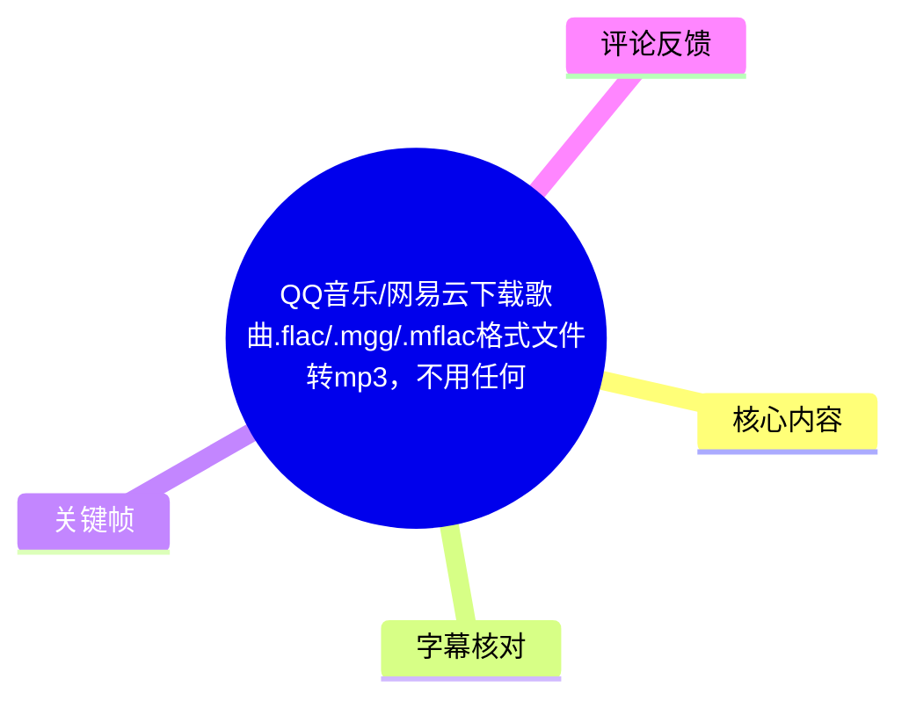
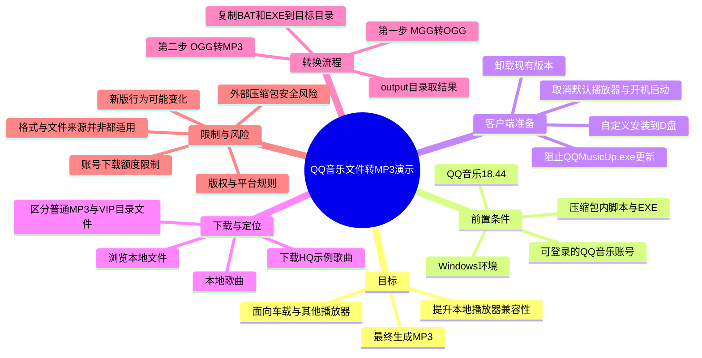
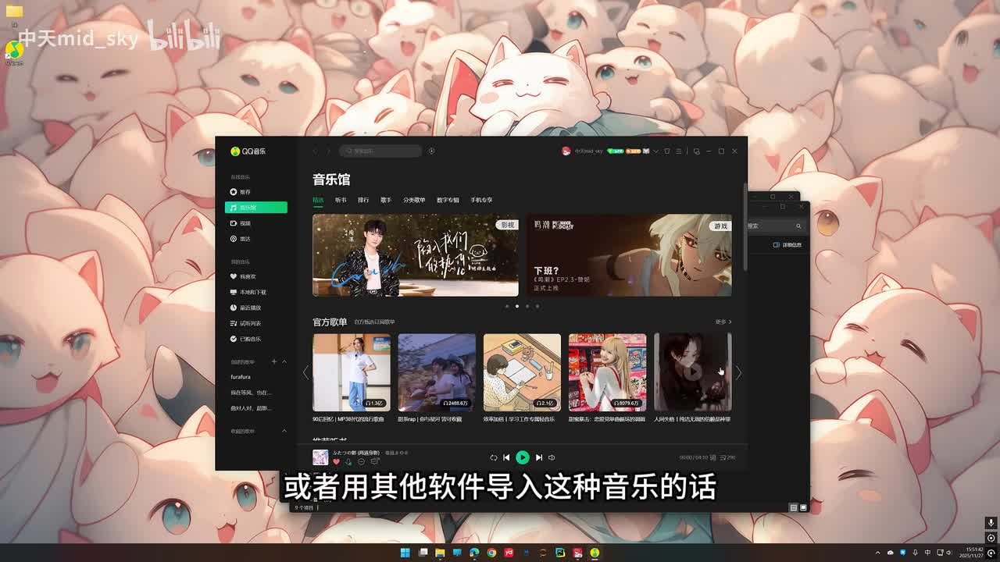
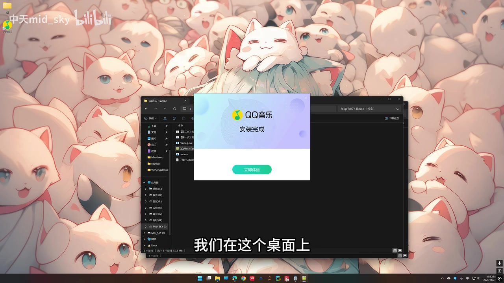
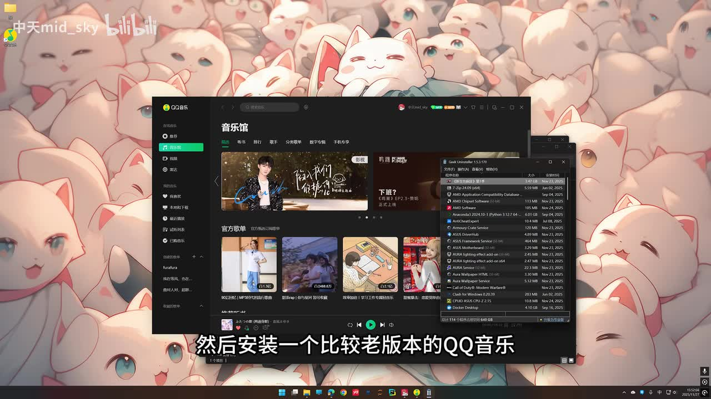

# QQ音乐/网易云下载歌曲.flac/.mgg/.mflac格式文件转mp3，不用任何第三方工具永久可用，本地听首歌真有这么难？

> 来源：[Bilibili 视频](https://www.bilibili.com/video/BV1QzSMBaE7g)<br>
> UP 主：中天mid_sky｜发布时间：2025-11-27｜视频时长：04:47<br>
> 视频标题涉及 QQ 音乐、网易云音乐及 `.flac`、`.mgg`、`.mflac` 等格式；但实际演示主体为 Windows 上的 QQ 音乐旧版本及其下载目录。

## 小结

视频提出的目标是：将 QQ 音乐客户端下载后、无法被其他播放器或车载设备直接识别的文件，最终整理为通用的 MP3 文件。UP 主的实际演示路径并非直接对任意音频格式转码，而是先安装并维持一个旧版 QQ 音乐客户端，再对下载目录内的特定文件运行压缩包提供的两步脚本/可执行文件。

核心流程可概括为：卸载当前 QQ 音乐 → 安装视频所示的 **QQ 音乐 18.44** → 阻止 `QQMusicUp.exe` 更新 → 下载示例歌曲的 HQ 高品质版本 → 从“浏览本地文件”定位下载目录 → 将工具包中的两个 `.bat` 和两个 `.exe` 放进目标目录 → 依次执行“MGG 转 OGG”和“OGG 转 MP3”，从同级 `output` 目录获取结果。

视频中最关键、也最具时效性的前提是旧版客户端行为。UP 主声称新版 QQ 音乐“加密严格”、无法按该方法处理，因此要求使用 18.44 版本并阻止升级。这是依赖特定客户端版本、账号权益、服务端策略及工具包内容的方案，不应理解为对所有 QQ 音乐、网易云音乐文件或所有 `.flac` 文件均有效。

标题中的“无需任何第三方工具”“永久可用”与视频实际内容存在张力：演示中出现卸载工具、压缩包内的两个 `.bat` 与两个 `.exe`，且简介还提供了网盘压缩包。因此，“不需要自行安装额外音频转换软件”可以视作 UP 主的宣传口径，但不能据此认定整个过程没有使用外部工具或可永久有效。

对于受版权、平台服务条款或数字权利管理（DRM）保护的内容，应优先使用平台提供的授权下载、离线播放或购曲方式。本视频仅记录其演示内容及限制，不验证其对受保护内容的适用性、合法性、安全性或持续有效性。

## 思维导图





## 目录

- [问题、范围与时效性](#问题范围与时效性)
- [旧版客户端的安装与更新阻断](#旧版客户端的安装与更新阻断)
  - [卸载现有客户端与安装 18.44](#卸载现有客户端与安装-1844)
  - [用防火墙阻止 QQMusicUp.exe 更新](#用防火墙阻止-qqmusicupexe-更新)
  - [验证版本与更新阻断状态](#验证版本与更新阻断状态)
- [下载文件、定位目录与两步转换](#下载文件定位目录与两步转换)
  - [下载 HQ 示例歌曲](#下载-hq-示例歌曲)
  - [定位本地文件并识别目标目录](#定位本地文件并识别目标目录)
  - [两步脚本处理与 output 输出](#两步脚本处理与-output-输出)
- [技术要点、限制与风险](#技术要点限制与风险)
- [字幕比对](#字幕比对)
- [评论分析](#评论分析)
- [处理记录](#处理记录)

## 问题、范围与时效性 [00:00](https://www.bilibili.com/video/BV1QzSMBaE7g?t=0)

视频开头将问题定义为本地播放兼容性：UP 主称，QQ 音乐下载后的音乐可能是 “MGD（ASR 原文）或者 FLAC” 格式，部分文件只能通过 QQ 音乐打开；若要导入车载系统或其他软件，可能无法播放。因此，他希望转为“通用的 MP3 格式”。

这里需要区分视频陈述与格式事实：

- 视频标题写的是 `.mgg`、`.mflac` 与 `.flac`；ASR 在开头识别为“MGD”，但后续多次提到 “MGG”，且标题标签亦包含 `mgg`。因此，正文将其记为 **MGG（ASR 开头存在误识）**。
- `.flac` 通常是无损音频容器/编码格式，本身不必然意味着不能由第三方播放器播放；能否播放取决于播放器支持、文件是否带平台限制以及具体文件结构。视频没有对这些情况逐一验证。
- 视频虽在标题提及网易云音乐和 `.mflac`，但 ASR 与关键帧所见的完整操作演示集中于 QQ 音乐；未见网易云音乐客户端界面或 `.mflac` 的单独实操验证。
- 视频发布于 2025-11-27，所展示的客户端版本和平台侧限制均可能已经变化；截至素材抓取时间 2026-07-15，未提供新的复测材料。



> 图：画面显示 QQ 音乐客户端界面，底部字幕对应“或者用其他软件导入这种音乐的话”。它直接呈现视频所讨论的使用场景：文件可在 QQ 音乐内管理，但 UP 主认为导入其他软件时会遇到兼容性问题。

## 旧版客户端的安装与更新阻断

### 卸载现有客户端与安装 18.44 [00:24](https://www.bilibili.com/video/BV1QzSMBaE7g?t=24)

UP 主在 [00:24](https://www.bilibili.com/video/BV1QzSMBaE7g?t=24) 至 [01:06](https://www.bilibili.com/video/BV1QzSMBaE7g?t=66) 提出的前置操作如下：

1. **卸载现有 QQ 音乐。**  
   视频认为“最新版本”的限制更严格，因此应先卸载当前客户端。UP 主口述推荐使用一个可同时清理注册表项的卸载工具；关键帧中显示的程序界面疑似为 Geek Uninstaller，但 ASR 将名称识别为“Zink”，无法仅凭现有素材确认其准确名称。

2. **运行压缩包内的旧版安装程序。**  
   UP 主明确称压缩包中有 **QQ 音乐 18.44** 版本安装包，并要求双击打开。

3. **使用“自定义安装”，修改安装盘符。**  
   其建议将默认安装位置从 C 盘改到 D 盘。视频没有给出必须改盘的技术原因，也没有说明其他路径是否会影响后续脚本；这应视为演示环境的选择，而非已验证的必要条件。

4. **取消两个勾选项后安装。**  
   ASR 识别为“默认播放器”和“开机自启动”，即不设为默认播放程序、不开机自动启动，然后继续安装。


> 图：画面展示 QQ 音乐安装窗口，左侧资源管理器中可见压缩包解压后的文件。此帧支持“旧版安装包来自视频所称压缩包”的操作背景，也说明该流程依赖外部文件，而非系统内置功能。



> 图：安装窗口显示“安装完成”和“立即体验”。该帧对应 UP 主“安装好之后先什么都不要点”的提醒：先处理更新程序，再打开客户端。

### 用防火墙阻止 `QQMusicUp.exe` 更新 [01:07](https://www.bilibili.com/video/BV1QzSMBaE7g?t=67)

在 [01:07](https://www.bilibili.com/video/BV1QzSMBaE7g?t=67) 至 [02:34](https://www.bilibili.com/video/BV1QzSMBaE7g?t=154)，UP 主解释安装后不要立刻进入客户端，理由是可能触发自动更新，将版本升级至最新版。

其展示的处理对象与路径逻辑为：

- 在桌面找到 QQ 音乐快捷方式；
- 右键选择“打开文件所在的位置”；
- 在安装目录中向下查找名为 **`QQMusicUp`** 的更新相关文件；
- UP 主称可通过改名或删除该文件阻止更新，但他实际选择的是使用 Windows 防火墙禁用其联网能力，以减少更新提醒；
- 打开路径：**控制面板 → 系统和安全 → Windows 防火墙 → 高级设置**；
- 在“高级设置”中进入 **出站规则**，选择 **新建规则**；
- 规则类型选择 **程序**；
- 浏览或粘贴程序路径，定位并选择 **`QQMusicUp.exe`**；
- 选择 **阻止连接**；
- 为规则命名，例如“禁止 QQ 音乐更新”，再完成创建。

视频所表达的是“阻止更新程序的出站连接”，并非禁止 QQ 音乐主程序整体联网。是否能够阻止升级，取决于当时客户端的更新机制是否仅由该可执行文件及出站通信负责；视频未提供网络日志、规则详情或不同版本复测。

> **操作边界：** 阻止软件更新会使客户端无法获得安全修复、兼容性改进与功能更新。视频没有展示恢复更新的方法；如需恢复，应自行检查创建的出站规则并评估软件安全性。

### 验证版本与更新阻断状态 [02:36](https://www.bilibili.com/video/BV1QzSMBaE7g?t=156)

[02:36](https://www.bilibili.com/video/BV1QzSMBaE7g?t=156) 后，UP 主完成规则创建，点击“立即体验”并登录 QQ 音乐。其验证方法是：

1. 打开客户端右上角“三点”菜单；
2. 找到“升级”；
3. 点击“一键升级”；
4. 若无法升级，则将其视为阻断成功；
5. 通过“帮助 → 关于”确认版本号为 **18.44**。

视频以“无法升级”作为成功判据，但未展示具体错误信息，也未证明未来启动时不会由其他组件更新。因此，这只是对录制当时该环境的可见结果，而非长期保证。



> 图：QQ 音乐客户端前景叠加有卸载程序窗口，画面底部字幕为“然后安装一个比较老版本的QQ音乐”。该帧有助于理解视频为何将“旧版客户端”视为整个方案的前置条件。

## 下载文件、定位目录与两步转换

### 下载 HQ 示例歌曲 [03:15](https://www.bilibili.com/video/BV1QzSMBaE7g?t=195)

在 [03:15](https://www.bilibili.com/video/BV1QzSMBaE7g?t=195) 至 [03:34](https://www.bilibili.com/video/BV1QzSMBaE7g?t=214)，UP 主开始下载示例歌曲：

- 示例之一为苏打绿《小情歌》；
- 选择的下载质量是 **HQ 高品质**；
- 演示中共下载了三首，但 ASR 没有完整识别出全部歌名；
- 下载完成后，UP 主从客户端的“本地”和“下载”相关位置查看已下载内容。

视频将其称为“VIP 的歌曲”，但不同歌曲的下载资格、数量额度与可用性取决于账号会员状态、平台规则和时间。该视频没有展示账号类型、实际授权条件或下载额度。

### 定位本地文件并识别目标目录 [03:36](https://www.bilibili.com/video/BV1QzSMBaE7g?t=216)

[03:36](https://www.bilibili.com/video/BV1QzSMBaE7g?t=216) 至 [04:00](https://www.bilibili.com/video/BV1QzSMBaE7g?t=240)，UP 主展示从客户端定位实际下载目录的方式：

1. 进入“本地歌曲”；
2. 对歌曲右键；
3. 选择 **“浏览本地文件”**；
4. 在资源管理器中查看歌曲所在目录；
5. UP 主称音乐目录下已有的 MP3 文件可直接播放，并将其描述为免费歌曲；
6. 他指出许多目标文件位于名为 **`VIP`** 的目录，并称该目录里的这类文件“不能播放”。

这一段的关键不是手动猜测 QQ 音乐下载路径，而是借助客户端的“浏览本地文件”功能找到当前实际目录。该办法相对适应自定义安装目录、不同账户或不同配置，但视频没有说明网易云音乐是否存在相同菜单与路径结构。

### 两步脚本处理与 `output` 输出 [04:00](https://www.bilibili.com/video/BV1QzSMBaE7g?t=240)

在 [04:00](https://www.bilibili.com/video/BV1QzSMBaE7g?t=240) 至 [04:32](https://www.bilibili.com/video/BV1QzSMBaE7g?t=272)，视频给出最终处理顺序：

1. 打开 UP 主提供的文件夹；
2. 确认其中有：
   - 第一步 `.bat` 文件；
   - 第二步 `.bat` 文件；
   - 两个 `.exe` 文件；
3. 将上述四个文件**全部复制到目标歌曲文件所在的目录**；
4. 双击执行第一步脚本。UP 主描述其作用为将 “MGG 格式” 先转换为 **OGG**；
5. 双击执行第二步脚本。UP 主描述其作用为将 **OGG** 转换为 **MP3**；
6. 脚本会在同级目录创建名为 **`output`** 的文件夹；
7. 从 `output` 文件夹中查找生成的 MP3；
8. 视频最后随机打开一个结果文件进行播放，以演示其可播放状态。

可将视频描述的文件流概括为：

```text
目标目录中的 MGG 文件
        │
        ├─ 双击“第一步” BAT
        ▼
OGG 中间文件
        │
        ├─ 双击“第二步” BAT
        ▼
同级 output 目录中的 MP3 文件
```

视频没有展示 `.bat` 脚本内容、所调用 `.exe` 的文件名、哈希值、音频编码参数（如码率、采样率、声道、是否保留元数据）或失败时的报错处理。因此，无法从素材确认：

- 输出 MP3 的具体编码器与码率；
- 是否发生重编码及其质量损失；
- 是否保留封面、歌词、标签、专辑信息；
- 是否支持 `.flac`、`.mflac`、其他 MGG 变体或批量子目录；
- 输出是否与源文件时长、音质、元数据一致；
- 脚本是否只适配录制时的旧版 QQ 音乐下载文件。

在 [04:32](https://www.bilibili.com/video/BV1QzSMBaE7g?t=272) 至 [04:44](https://www.bilibili.com/video/BV1QzSMBaE7g?t=284) 之间存在约 12 秒无 ASR 语音的播放演示空档；[04:44](https://www.bilibili.com/video/BV1QzSMBaE7g?t=284) 处 UP 主总结“这样我们就可以了”。

## 技术要点、限制与风险 [04:00](https://www.bilibili.com/video/BV1QzSMBaE7g?t=240)

### 视频方法依赖的要素

| 项目 | 视频中的信息 | 可确认程度 |
| --- | --- | --- |
| 操作系统 | 画面为 Windows 桌面、控制面板和防火墙界面 | 较高 |
| QQ 音乐版本 | 18.44 | 视频口述并以“关于”界面说明 |
| 更新组件 | `QQMusicUp.exe` | ASR 多次提及；具体路径未完整保留 |
| 下载质量 | HQ 高品质 | 视频明确口述 |
| 输入格式路径 | MGG → OGG → MP3 | 视频明确口述 |
| 输出位置 | 输入目录同级的 `output` 文件夹 | 视频明确口述 |
| 工具组成 | 两个 BAT、两个 EXE | 视频明确口述，文件名称与来源未完整展示 |
| 网盘资源 | 简介提供百度网盘链接及提取码 `2026` | 元数据可见；未对文件安全性验证 |

### 重要限制

1. **不是通用 FLAC 转 MP3 教程。**  
   标准 FLAC 文件可由常见播放器或转码器处理；视频的真正重点是针对其所称 QQ 音乐下载目录内、不能直接播放的特定文件进行两步处理。标题覆盖的格式范围大于演示证据范围。

2. **网易云音乐部分未被完整演示。**  
   标题和简介提到网易云音乐与 `.mflac`，但提供的 ASR、关键帧与操作步骤没有显示网易云音乐文件的定位、脚本执行或结果验证。不能据此推导其对网易云文件同样有效。

3. **“永久可用”未被证实。**  
   该流程依赖旧版 QQ 音乐、更新阻断、服务端可登录状态、账号下载权益和外部脚本。任一环节变更都可能导致失败。

4. **账号与平台额度可能成为前置限制。**  
   视频只展示了下载动作，没有绕过下载资格的证明。热评中亦有用户报告“本周期内付费歌曲下载额度已用完”，这只是用户反馈，但提示下载额度确实可能影响流程开始前的可行性。

5. **外部 EXE/BAT 存在安全风险。**  
   视频要求把未知来源的批处理文件和可执行文件复制到歌曲目录并双击运行，但未公开脚本代码、数字签名或校验信息。执行前至少应了解脚本内容、核验来源，并避免在含有重要文件的目录直接运行未知程序。

6. **格式转换不等于授权状态改变。**  
   文件可否转换、能否播放、能否复制或传播，分别涉及技术、平台规则和版权授权问题。视频没有提供针对这些问题的法律或服务条款依据。

## 字幕比对

| 字幕来源 | 完整性 | 专有名词 | 时间轴 | 主要问题 |
| --- | --- | --- | --- | --- |
| Bilibili 站内字幕 | 未提供可用字幕 | 无法评估 | 无法使用 | 素材明确标注“未提供可用站内字幕” |
| 本次 ASR 字幕 | 较完整，17 段，语音覆盖约 249.66 秒/286.98 秒（约 87%） | 存在误识与断词 | 可用，带毫秒级起止时间 | 将 MGG 识别为“MGD”，将“出站规则”等词识别错误；04:32—04:44 有约 12.04 秒语音空档 |

最终采用**本次 ASR 时间轴**作为章节链接依据；没有可供合并或优先采用的站内字幕。本次 ASR 诊断未标记 `noAudioStream=true`，且检测到中文音轨，语言置信度为 0.9995，因此不属于无音轨视频。

结合标题、标签及后续语句，对 ASR 中的重要词语作如下审慎校正：

- “MGD”统一记为 **MGG**：标题写明 `.mgg`，后续 ASR 亦多次读作 MGG；但原始音频口述不够清晰，保留这一校正依据。
- “QQ Music Up”规范记为 **`QQMusicUp.exe`**：视频口述其为 QQ 音乐更新文件，后文明确提到 `.exe`。
- “初战规则”校正为 **出站规则**：与 Windows 防火墙高级设置中的常见项目及语义一致。
- “主旨连接”校正为 **阻止连接**：与新建出站规则时的动作相符。
- 卸载工具名称不作强行校正：ASR 为“Zink”，关键帧视觉上疑似其他卸载工具，缺乏足够证据确认准确产品名。

## 评论分析

仅处理素材中可获取的热评前三条；评论是用户观点或经验，不作为已验证事实。

1. **宅是一种精神｜782 赞**  
   该评论肯定视频提供了可操作的“干货”，并将其与评论者感受到的“引导下载付费软件”的教程风格对比。它反映出观众对低门槛、本地化解决方案的偏好，但没有补充技术验证，也没有证明工具安全性或方案长期有效。

2. **呵呵哒Fzf｜145 赞**  
   评论提出替代思路：新建文本文件并重命名为 `QQMusicUp.exe`，再替换 QQ 音乐自带的更新程序，以避免使用防火墙。该方法与视频的“阻止更新”目标一致，但它是评论者补充，视频未演示；同时替换应用程序文件可能导致程序异常、更新机制变化或被后续安装覆盖，可信度和适用范围均未验证。

3. **国服第一BB机-｜139 赞**  
   评论引用“本周期内付费歌曲下载额度已用完”，表达对 QQ 音乐下载额度的抱怨。这为视频未展开的账号限制提供了一个用户侧案例，但无法据此确定所有账号、地区、会员类型或当前规则均存在相同额度。

## 处理记录

- Worker ID：`worker-mrj0wjed-b0c290ad`
- 模型：`gpt-5.6-terra`
- 调用工具与素材：视频元数据、关键帧抽取结果、ASR `medium` 模型输出、ASR SRT 时间轴、热评抓取结果。
- 使用的应用工具：素材中可确认展示 Windows 资源管理器、QQ 音乐安装程序、Windows 防火墙高级设置；卸载工具名称因 ASR 与画面不一致，未作确定性标注。
- 字幕选择：站内字幕未提供可用版本；已检查本次 ASR，采用其 17 个带时间戳分段制作全部时间轴链接，并依据标题、后续语境和关键帧对少数术语作审慎校正。
- 关键帧选择依据：选用 `frame-001.jpg` 展示 QQ 音乐与兼容性问题场景，`frame-002.jpg` 展示“旧版客户端”前置思路，`frame-003.jpg` 展示压缩包关联的安装操作，`frame-004.jpg` 展示安装完成后暂不启动、先处理更新的节点。
- 缓存清理：素材未提供缓存清理执行日志；无法确认是否已清理，故不作已完成声明。
- 未解决问题：未取得脚本源码、EXE 文件名/签名/哈希、转换参数和输出音频检测结果；未验证 `.mflac`、网易云音乐文件、不同 QQ 音乐版本、不同账号权益下的可用性；未验证网盘文件安全性与“永久可用”主张。
