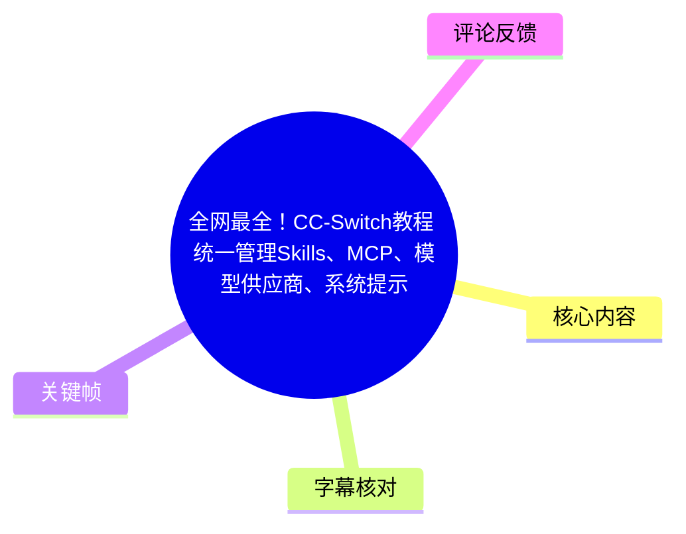
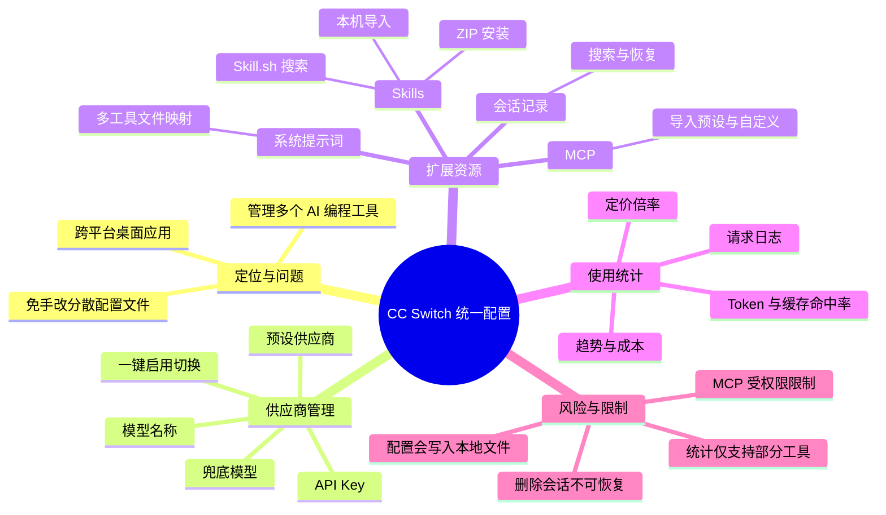
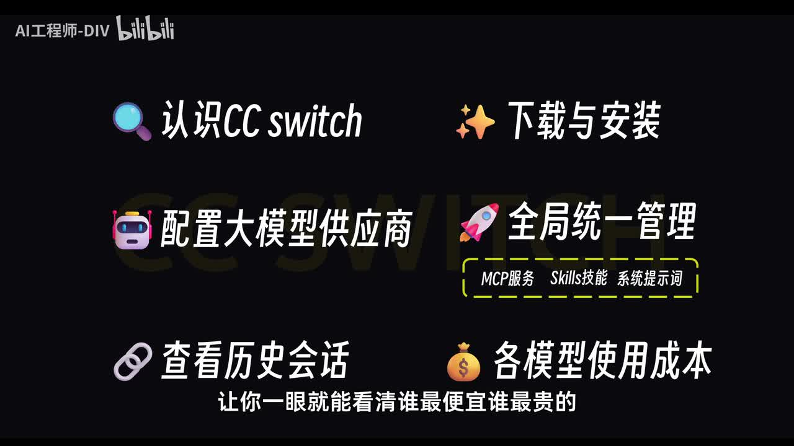
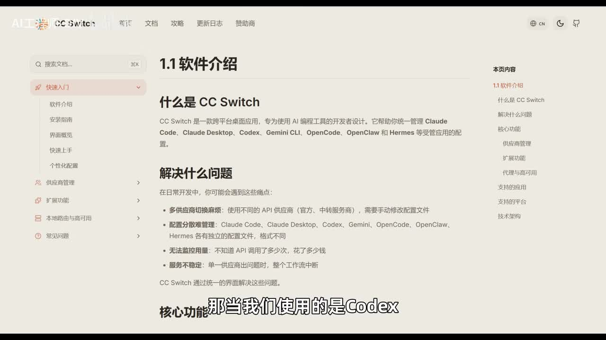
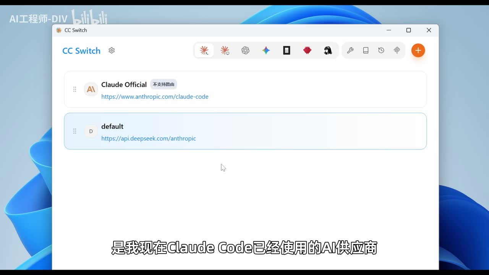
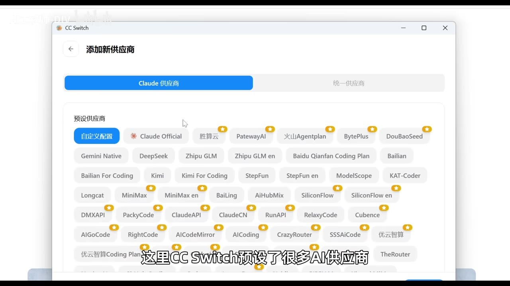

# 全网最全！CC-Switch教程：统一管理 Skills、MCP、模型供应商与系统提示词

> 来源：[Bilibili 视频](https://www.bilibili.com/video/BV15PVb6gE9k)  
> UP 主：AI工程师-DIV｜时长：16 分 05 秒｜分辨率：2560×1440  
> 视频主题：以 CC Switch 为中心，统一管理 Claude Code、Codex、Gemini CLI、OpenCode 等 AI 编程工具的模型供应商、Skills、MCP、提示词、会话和成本。

## 小结

CC Switch 被视频定位为一款面向 AI 编程开发者的跨平台桌面“总控台”，可在 macOS、Linux、Windows 上使用。其核心价值并非提供模型本身，而是将多个 AI 编程工具各自分散的配置文件、供应商与扩展配置集中到同一界面操作。

视频给出的主要工作流是：先安装 CC Switch，再在通用设置中开启“跳过 Claude Code 初次安装确认”；随后可为 Claude Code 等工具添加供应商，以 Kimi for Coding 为例填入 API Key、模型名和可选兜底模型，并通过“启用”在不同供应商间切换。

除供应商外，CC Switch 还可以管理四类跨工具资源：Skills 可导入本机已有技能、ZIP 安装包或从 Skill.sh 搜索安装；系统提示词可用一套预设映射至不同工具所识别的文件；会话记录可跨工具检索并复制命令恢复；MCP 可从既有配置导入、使用预设服务或通过配置向导自定义。

成本统计是视频强调的另一能力：当前统计页面仅支持 **Claude Code、Codex、Gemini CLI** 三类工具，可查看 Token、缓存命中率、请求次数、总成本、趋势、请求日志、供应商与模型统计。若 API 中转价格与官方不同，应在“成本定价”调整倍率；视频示例为官方价格八折时设为 `0.8`。

需要注意：这是一支具体版本界面的操作演示。供应商预设、支持工具范围、模型名称、Claude Code 的第三方 API 政策、MCP 服务可用性以及费用统计口径都可能随 CC Switch、各 CLI 工具与供应商更新而变化。视频展示的“跳过初次安装确认”和第三方供应商使用方法应结合当前官方文档、账号条款及本地配置备份审慎使用。

## 思维导图





## 目录

- [定位：CC Switch 解决什么问题](#定位cc-switch-解决什么问题)
- [下载、安装与首次使用设置](#下载安装与首次使用设置)
- [配置并切换模型供应商](#配置并切换模型供应商)
- [统一管理 Skills](#统一管理-skills)
- [系统提示词预设与映射](#系统提示词预设与映射)
- [会话记录的检索、恢复与删除](#会话记录的检索恢复与删除)
- [统一管理 MCP 服务](#统一管理-mcp-服务)
- [使用统计、成本与定价倍率](#使用统计成本与定价倍率)
- [限制、风险与时效性](#限制风险与时效性)
- [字幕比对](#字幕比对)
- [评论分析](#评论分析)
- [处理记录](#处理记录)

## 定位：CC Switch 解决什么问题 [00:00:41](https://www.bilibili.com/video/BV15PVb6gE9k?t=41)

视频将 CC Switch 描述为跨平台桌面应用，适用于 macOS、Linux、Windows，目标用户是同时使用多种 AI 编程工具的开发者。视频和画面中明确提到的工具包括 Claude Code、Claude Desktop、Codex、Gemini CLI、OpenCode、OpenClaw、Hermes 等；实际可用项目仍以当前软件界面为准。

其要解决的问题有三类：

1. **供应商切换繁琐**：不使用统一工具时，若从一个供应商切换到 Kimi、千问等模型，通常需要手动进入用户目录，修改模型、API Key 和 Base URL 等配置。
2. **不同工具的配置路径与格式不同**：视频指出，Claude Code、Codex、Gemini CLI 等工具的配置文件格式与位置并不一致，用户既要知道文件位置，也要避免修改出错。
3. **成本不透明**：多供应商、多模型并行时，单靠各平台后台不易横向查看调用次数与支出；CC Switch 试图集中展示这些数据。

视频用“总控台”比喻 CC Switch：用户不必直接操作每个工具的配置文件，而是在 CC Switch 内选择工具、维护供应商配置并执行切换。



> 图：画面概括了本视频的六个核心主题——认识/安装、供应商配置、全局管理 MCP/Skills/系统提示词、历史会话与模型成本。它有助于建立后续操作之间的关系：这些功能都围绕“统一配置”展开。

视频中展示的官方文档页面还列出其设计要解决的痛点，包括多供应商切换、多个工具配置管理、无法监控用量，以及单一供应商异常造成工作流中断等。



> 图：文档页可见“软件介绍”“解决什么问题”等栏目，并列出受管理的工具与典型痛点。这是理解视频功能边界的直接画面依据。

## 下载、安装与首次使用设置 [00:02:31](https://www.bilibili.com/video/BV15PVb6gE9k?t=151)

### 下载与启动步骤 [00:02:31](https://www.bilibili.com/video/BV15PVb6gE9k?t=151)

视频中的 Windows 演示步骤如下：

1. 进入 CC Switch 官网。
2. 点击免费下载。
3. 选择与操作系统匹配的版本；演示设备为 Windows。
4. 下载后打开安装文件。
5. 按安装向导持续执行“下一步”。
6. 完成后启动 CC Switch。

启动后的主界面由两部分组成：

- 顶部：不同 AI 编程工具的图标栏，可分别切换和配置。
- 下方：当前选中工具已有的供应商配置。视频示例中的 `default` 配置来自已存在的 Claude Code 配置文件导入；如果只安装 Claude Code 且未配置其他模型，界面可能仅显示官方默认配置。

右上角还有 Skills、提示词、会话历史、MCP 管理等入口，以及用于新增供应商的“+”按钮。



> 图：画面展示 Claude 工具页中的供应商列表，包括“Claude Official”和已导入的 `default`。它说明 CC Switch 的操作单位是“工具 + 供应商配置”，而非仅仅切换聊天模型。

### 首次使用：跳过 Claude Code 初次安装确认 [00:03:36](https://www.bilibili.com/video/BV15PVb6gE9k?t=216)

视频强调，在先不配置模型供应商的前提下，应先进行一项通用设置：

1. 点击左上角“设置”。
2. 进入“通用”。
3. 向下滚动。
4. 勾选“跳过 Claude Code 初次安装确认”。

视频解释：该选项用于跳过 Claude Code 初次使用时要求登录 Anthropic 账号的引导；开启后，才能继续配置并使用自己的模型供应商。UP 主将遗漏此设置导致的“安装 Claude Code 后无法正常使用、显示网络问题”称为可能原因之一。

> **边界说明：**这是视频中的经验性操作，不等同于 Claude Code 或 Anthropic 的官方兼容性承诺。涉及账号登录、第三方 API、代理或模型路由时，应以工具当前版本与服务条款为准。

## 配置并切换模型供应商 [00:04:11](https://www.bilibili.com/video/BV15PVb6gE9k?t=251)

### Kimi for Coding 示例：新增配置 [00:04:11](https://www.bilibili.com/video/BV15PVb6gE9k?t=251)

视频以 Claude Code 配置 Kimi for Coding 为例，给出以下流程：

1. 在 Claude Code 对应页面点击右上角“+”。
2. 在预设供应商列表中选择 **Kimi for Coding**。视频称其购买的是 Coding Plan。
3. 前往 Kimi 控制台，新建 API Key。
4. 将 API Key 粘贴回 CC Switch。
5. 在“高级选项”填写模型名称，视频示例填写 **Kimi 2.6**。
6. 可选填写“兜底模型”；视频示例设为 **Kimi 2.5**。其解释是：当 Claude Code 请求未明确落到某个模型角色时，可使用兜底模型；也可以留空。
7. 如有额外配置，在当前配置区域继续补充。
8. 点击“添加”。

添加成功后，视频显示该供应商可展示当前 **5 小时用量、7 天用量和刷新时长**。随后点击“启用”，Claude Code 即切换至该供应商。



> 图：画面显示“Claude 供应商”下的预设选项，包括 Claude Official、DeepSeek、Kimi、Kimi For Coding 等，也可选择“自定义配置”。它表明视频中的 Kimi 配置是从预设模板开始，而不是完全手写所有字段。

### 切换验证与兜底模型现象 [00:05:12](https://www.bilibili.com/video/BV15PVb6gE9k?t=312)

配置完成后，视频在终端输入：

```text
claude
```

视频称终端中显示为 **Kimi 2.5**，原因是前一步设置的兜底模型为 Kimi 2.5。若希望改用 DeepSeek，则在 CC Switch 中对 DeepSeek 再次点击“启用”即可。

同一思路也适用于顶部其他 AI 编程工具：先切换到目标工具，再在该工具页面配置供应商。

### 操作要点与敏感信息 [00:04:24](https://www.bilibili.com/video/BV15PVb6gE9k?t=264)

- API Key 是敏感凭据，录入本地工具前应确认系统账户、配置文件权限和设备安全。
- “模型名称”“兜底模型”和供应商支持能力必须与实际 API 兼容；视频只展示了示例名，不构成通用模型清单。
- 视频描述为“一键切换”，但本质上是由 CC Switch 写入或更新不同工具所需的本地配置；切换前建议备份原始配置。
- 工具界面显示的模型身份、实际 API 的计费归属和底层模型能力未必完全一致；这一点也在评论中被用户提出疑问。

## 统一管理 Skills [00:05:51](https://www.bilibili.com/video/BV15PVb6gE9k?t=351)

视频称 CC Switch 可统一管理多个 AI 编程工具的 Skills，目标是“安装一次，在多个工具中使用”。入口位于右上角扳手图标。

### 导入本机已有 Skills [00:06:15](https://www.bilibili.com/video/BV15PVb6gE9k?t=375)

进入 Skills 管理页后，当前列表可能为空，即使本机此前已安装过技能。视频给出的导入方法为：

1. 点击右上角“导入应用”。
2. CC Switch 检查本机相关目录，发现可导入的 Skills。
3. 选择技能并点击“导入已选”。
4. 勾选该 Skill 应应用到哪些工具；只有勾选 Claude Code 后，该 Skill 才能在 Claude Code 中使用。
5. 如需支持多个工具，则分别勾选对应项目。

视频还说明：

- 点击“检查更新”会检查当前列表内所有技能的版本；有新版本时可更新。
- 开发者以压缩包分发 Skill 时，可点击“从 ZIP 中安装”，选择安装包并打开完成导入。

### 搜索并安装 Skill.sh 技能 [00:07:04](https://www.bilibili.com/video/BV15PVb6gE9k?t=424)

视频展示在线搜索流程：

1. 点击右上角进入可安装 Skills 列表。
2. 在搜索来源中切换至 **Skill.sh**。
3. 输入关键词搜索。演示关键词为 `subtitle`。
4. 搜索结果按每个 Skill 的下载量降序排列。
5. 点击“安装”。
6. 返回上一级检查已安装结果。

视频示例为名为 “Bilibili title” 的字幕相关 Skill。其描述是从哔哩哔哩视频提取字幕并转为无字幕视频文件；触发条件涉及 Bilibili URL 或 BV 号等“提取 B 站字幕”的请求。点击分享按钮可跳转到该 Skill 对应的源代码仓库。

### Skills 的适用条件 [00:07:52](https://www.bilibili.com/video/BV15PVb6gE9k?t=472)

视频的核心改进点是简化安装与跨工具分配，但仍需注意：

- “安装一次、多工具可用”依赖该 Skill 是否兼容目标工具，以及是否已在 CC Switch 中勾选目标工具。
- 搜索结果按下载量排序并不等于安全性、维护质量或适用性排序。
- 应阅读 Skill 的仓库内容与权限需求，尤其是涉及文件读写、网络访问、命令执行或令牌读取的技能。
- 视频仅演示一个字幕相关 Skill，未证明所有技能均可无差异跨工具运行。

## 系统提示词预设与映射 [00:08:35](https://www.bilibili.com/video/BV15PVb6gE9k?t=515)

视频认为提示词管理适合频繁切换多个 AI 编程工具的用户。问题在于不同工具识别的系统提示词文件名不同，视频举例：

| 工具 | 视频提及的读取文件 |
| --- | --- |
| Claude Code | `CLAUDE.md` |
| Codex | `AGENTS.md` |
| Gemini CLI | `GEMINI.md` |

如果人工将同一套规范同步到多个文件，容易出现文件名、扩展名或内容遗漏。CC Switch 的做法是：维护一套提示词预设，在启用时映射或写入到不同工具对应的配置文件。

### 创建并启用预设 [00:09:23](https://www.bilibili.com/video/BV15PVb6gE9k?t=563)

视频步骤：

1. 点击右上角书本图标，进入提示词管理。
2. 点击右上角“添加提示词”。
3. 名称建议使用项目名称。
4. 视频建立 `demo1`，内容对应“前端项目”提示词，粘贴后保存。
5. 再建立 `demo2`，内容对应“后端项目”提示词，保存。
6. 开发前端项目时，打开 `demo1` 左侧的开关。
7. CC Switch 将该系统提示词映射到全部支持的 AI 编程工具中。
8. 切换到后端项目时，关闭/切换前端预设，启用后端预设；视频称 CC Switch 会把对应内容写入目标应用文件。

> **实践建议：**提示词预设应按项目、技术栈或角色明确命名，并将真正的项目规范纳入版本控制。启用前须确认覆盖规则，避免全局提示词覆盖项目中已有的 `CLAUDE.md`、`AGENTS.md` 或 `GEMINI.md`。

## 会话记录的检索、恢复与删除 [00:10:18](https://www.bilibili.com/video/BV15PVb6gE9k?t=618)

会话管理入口是右上角第三个图标。视频展示该页面左侧为会话列表，可查看与 AI 的对话记录。

### 查看与筛选 [00:10:35](https://www.bilibili.com/video/BV15PVb6gE9k?t=635)

- 当前筛选条件可只看某一个工具，例如 Claude Code。
- 切换至“全部”后，可看到其他工具的记录；视频示例中显示 OpenCode 的一条对话，内容为让 OpenCode 制作“贪吃蛇小游戏”。
- 当记录较多时，可使用“搜索会话”按关键词过滤；视频演示搜索“视频”。

### 恢复与删除 [00:10:59](https://www.bilibili.com/video/BV15PVb6gE9k?t=659)

恢复已有对话的方式是复制会话旁提供的一串命令，并粘贴至终端执行。视频称：

- 对 Claude Code 会话如此操作，可恢复此前的 Claude Code 对话记录。
- 对 OpenCode 会话同样复制相应命令后，可恢复该工具的会话。

删除操作则是：

1. 在会话页选择记录。
2. 点击全选。
3. 执行批量删除。

视频特别警告，该操作会直接删除电脑本机中的对话记录；删除后，未来无法再在对应 AI 编程工具中找到这些记录。

> **不可逆风险：**批量删除前应先确认是否有重要上下文、命令记录、需求决策或敏感信息需要导出。视频未展示回收站、撤销或备份恢复机制，因此不能假定删除可恢复。

## 统一管理 MCP 服务 [00:11:40](https://www.bilibili.com/video/BV15PVb6gE9k?t=700)

> 视频的站内字幕和 ASR 多次将 **MCP** 误识别为“NCP”；结合视频标题、关键帧文字与上下文，正文统一采用 MCP。

视频认为 MCP 管理可避免用户为每个 AI 编程工具重复配置同一个服务。入口在右上角 MCP 管理图标。

### 导入与预设 MCP [00:11:40](https://www.bilibili.com/video/BV15PVb6gE9k?t=700)

若 Claude Code 中已经配置 MCP，视频称可点击“导入已有的 MCP 服务”读取。新增流程为：

1. 点击“添加 MCP 服务”。
2. 从预设 MCP 服务中选择。视频提到有 `Fetch`、`Time` 等预设。
3. 选择 `Fetch`。视频将其解释为“用来请求网络地址”。
4. 界面会预填相关信息。
5. 勾选需要应用此 MCP 的工具。视频示例涉及 Claude Code、Codex、Gemini CLI；如还要应用至 OpenCode、OpenClaw、Hermes 等，也需勾选。
6. 查看该 MCP 的 JSON 配置。
7. 点击“添加”。

视频随后在终端运行 Claude Code，并输入 MCP 相关命令查看服务，称 `Fetch` 已配置成功。

### 调用验证与权限失败 [00:12:53](https://www.bilibili.com/video/BV15PVb6gE9k?t=773)

视频输入一个网址，要求模型总结网页内容，以测试 `Fetch` MCP 调用。演示中由于飞书平台的身份限制，服务无法直接读取页面内容；但界面显示已经调用了刚配置的 MCP 服务。

这一段提供了重要经验：**MCP 被成功配置和 MCP 能获取目标网页内容是两件不同的事**。即使工具调用链正常，目标站点的登录、身份验证、访问控制、反爬策略或网络限制仍可能导致读取失败。

### 自定义 MCP 配置 [00:13:17](https://www.bilibili.com/video/BV15PVb6gE9k?t=797)

未在预设列表中的 MCP 可通过自定义配置加入：

1. 点击“添加 MCP”。
2. 填写 MCP 标题名称。
3. 填写 MCP 显示名称，即 AI 编程工具内显示的名称。
4. 指定应用到哪些 AI 编程工具。
5. 点击“配置向导”。
6. 按 MCP 服务类别选择类型。
7. 再填写与前一步一致的 MCP 标题。
8. 选择执行命令类型：`npx` 或 `uvx`。
9. 填写对应参数。
10. 按需填写环境变量；视频举例说明某些 MCP 需要填写 Key。
11. 点击“应用配置”。

视频强调，具体命令、参数与环境变量以各 MCP 服务自身的使用文档为准。

```text
自定义 MCP 所需信息（按视频字段整理）
- 标题名称
- 显示名称
- 应用目标工具
- 类型
- 启动命令：npx 或 uvx
- 命令参数
- 可选环境变量（例如服务所需 Key）
```

## 使用统计、成本与定价倍率 [00:14:06](https://www.bilibili.com/video/BV15PVb6gE9k?t=846)

视频示例中配置了三个供应商：Claude 默认、DeepSeek 与前面添加的 Kimi。由于不同模型和供应商定价不同，用户可通过 CC Switch 的“设置 → 使用统计”查看成本。

### 可查看的指标 [00:14:30](https://www.bilibili.com/video/BV15PVb6gE9k?t=870)

视频称，统计功能当前只支持三个 AI 编程工具：

- Claude Code
- Codex
- Gemini CLI

在统计界面中可以按工具或模型查看：

- 实际消耗 Token 数；
- 输入 Token 数；
- 输出相关缓存命中率；
- 请求总数量；
- 总成本；
- 使用趋势图；
- 请求日志；
- 供应商统计；
- 模型统计。

视频给出一个判断：**缓存命中率越高，通常代表越省钱**。趋势图则可用于看清成本在哪个阶段较高、哪一天使用更多。

### 中转价格与定价倍率 [00:15:19](https://www.bilibili.com/video/BV15PVb6gE9k?t=919)

统计正确性的关键是定价数据。视频指出，如果接入中转服务，其价格可能与官方定价不同，需在“成本定价”中调整模型倍率。

示例：

```text
中转价格 = 官方价格 × 0.8
成本倍率 = 0.8
```

这样统计结果才更接近实际支出。视频还说明：

- 各模型成本可以单独设置。
- 对于尚无请求记录的模型，可在右侧添加自定义模型。

> **统计边界：**视频没有说明汇率、税费、订阅套餐折算、免费额度、并发折扣或供应商账单延迟是否纳入。因此 CC Switch 内的成本应视作配置与调用层面的参考值，最终结算仍以实际供应商账单为准。

## 限制、风险与时效性 [00:15:43](https://www.bilibili.com/video/BV15PVb6gE9k?t=943)

### 视频明确呈现的限制

| 主题 | 视频中的限制或条件 |
| --- | --- |
| 使用统计 | 当前仅支持 Claude Code、Codex、Gemini CLI 三类工具。 |
| MCP 网页读取 | Fetch MCP 在飞书页面案例中受身份限制，无法直接读取内容。 |
| MCP 自定义配置 | 命令、参数、环境变量必须以具体 MCP 文档为准。 |
| Skills 跨工具使用 | 需要在导入后勾选目标 AI 编程工具。 |
| 删除会话 | 批量删除会直接删除本机记录，之后无法在相应工具中找回。 |
| 成本统计 | 使用中转时需要手动调整价格倍率，否则统计可能不准确。 |
| 供应商切换 | 模型名、API Key、Base URL 等仍须由用户提供并保证兼容。 |

### 使用建议

1. **先备份再切换**：CC Switch 的价值是代替手工改配置，但这也意味着它会影响本地工具配置。首次导入、切换供应商、启用全局提示词前，备份关键配置。
2. **将 API Key 当作密钥管理**：不要在截图、日志、公开仓库或提示词中泄露；若更换设备或怀疑泄露，应到供应商控制台轮换。
3. **不要把界面显示的模型名称当作唯一证据**：应结合 API 账单、请求日志和实际响应能力确认调用链。
4. **MCP 最小权限**：只给 MCP 必需的环境变量和访问权限；对需要网络、文件系统或执行命令的服务先审阅来源。
5. **定期复核统计倍率**：中转商调价、模型升级、套餐规则变化后，原倍率可能失效。
6. **注意版本时效性**：视频元数据中的说明提到 UP 主曾“修正大模型配置视频画面”；而当前软件 UI、支持工具和预设供应商在视频发布后都可能继续变化，因此实际操作以当前版本与官方文档为准。

## 字幕比对

| 字幕来源 | 完整性 | 专有名词 | 时间轴 | 主要问题 |
| --- | --- | --- | --- | --- |
| Bilibili 站内字幕 | 覆盖 00:00:00.100–00:16:04.520，基本完整 | 存在大量音近误识别，如 Cloud CORE、NCP、绘画、Call death | 分段细，且从视频开头开始，适合作为时间轴主依据 | Claude Code、Codex、Gemini CLI、MCP、Settings JSON 等术语错误较多 |
| 本次 ASR（medium） | 诊断语音覆盖率 95.84%，时长覆盖至 00:16:04.300 | 术语误识别更明显，如 CCSwitch/CCSwich、NCP、Feature、CloudCore 等 | 有时间戳，但第一段从 00:00:30.660 开始，和站内字幕开头不一致；单段约 24 秒，粒度较粗 | 首段异常压缩、存在词语乱码或错断，专有名词可靠性较低 |

### 最终字幕选择与校正原则

正文以**站内 SRT 的真实分段时间**作为章节时间轴依据，并逐段检查了本次 ASR。未检测到 `noAudioStream=true`；ASR 诊断明确显示存在音频、识别语言为中文、语音覆盖率为 95.84%，因此不存在“源视频无音轨”的情况。

结合视频标题、关键帧界面文字、上下文和两份字幕，进行了以下必要校正：

| 字幕中的常见写法 | 正文采用写法 | 校正依据 |
| --- | --- | --- |
| cc switch / CCSwich / CCSwish | CC Switch | 视频标题、界面和文档画面 |
| cloud CORE / CloudCord / Color Code | Claude Code | 视频标题、上下文及应用名称 |
| Call death / Codice | Codex | 视频开头工具列表和后续统计说明 |
| Dinline / Gmin-Line / Germany | Gemini CLI | 视频开头与提示词文件段落 |
| NCP / NCB | MCP | 视频标题、封面关键帧“ MCP 服务 ”及 MCP 配置上下文 |
| 绘画记录 | 会话/对话记录 | 该段内容为历史对话检索、恢复和删除 |
| feature | Fetch | 视频说明其“用来请求网络地址”，对应预设名称语境；保留为视频演示中的推断性校正 |
| cloud 点 MD / agent 点 MD / GEMINI 点 MD | `CLAUDE.md` / `AGENTS.md` / `GEMINI.md` | 站内字幕上下文与常见文件命名；其中 Codex 文件名以视频陈述记录 |

## 评论分析

> 仅获取到 2 条热评，未获取到第 3 条，因此不补造内容。

### 热评 1：内容质量认可

- 评论者：小智快乐多
- 点赞：196
- 观点：“像这种粉丝比较少的号，干活最猛了”。

这是一条对视频实操密度和内容价值的正向评价，反映评论者认为 UP 主提供了“干货”式教程。该评论没有增加可独立验证的技术信息，也不应据此推导软件功能真实性或适用范围。

### 热评 2：第三方 API 的模型身份与费用疑问

- 评论者：名字被取完了这都不行
- 点赞：51
- 观点：其在 CC Switch 3.16 版本使用 DeepSeek API 时，Claude Code 仍认为自己是 Claude Opus，但 DeepSeek 侧费用正在扣除；评论者还提到曾看到某个 Claude Code 版本可能强制不允许第三方 API，因此暂以“Claude Code + 内嵌 DeepSeek API”使用国内模型，并询问 CC Switch 如何优化。

这条评论补充了实际使用中的一个重要现象：**界面或模型自我描述与实际计费供应商可能不一致**。但这是单个用户的版本、配置与记忆描述，其中“2.1.159 左右版本”“强制不允许第三方 API”等说法未经本视频或本素材验证，不能当作确定事实。

它与视频的成本统计功能形成了实践上的提醒：在使用代理或第三方兼容 API 时，应同时核对 CC Switch 请求日志、供应商账单、实际 Base URL 与模型配置，而不能只依赖 Claude Code 自报的模型名称。

## 处理记录

- Worker ID：worker-mrj0www4-e8d79408
- 模型：gpt-5.6-terra
- 使用素材与工具：视频元数据、站内时间轴字幕 `p01-ai-zh.srt`、本次 ASR 结果与 SRT、ASR 诊断、12 张关键帧清单、可获取热评数据。
- 字幕选择：以站内字幕作为时间轴主依据；已检查本次 ASR。ASR 有音频流且具时间戳，但首句起始时间异常为 00:00:30.660、专有名词误识别较多，故不作为正文主时间轴。
- 关键帧选择依据：
  - `frames/frame-001.jpg`：概览封面，展示教程覆盖的功能范围；
  - `frames/frame-002.jpg`：CC Switch 文档页，支撑“软件定位与痛点”；
  - `frames/frame-003.jpg`：主界面供应商列表示例，支撑“工具 + 供应商配置”的结构；
  - `frames/frame-004.jpg`：新增供应商预设列表，支撑 Kimi 等供应商配置流程。
- 热评处理：仅分析获取到的前 2 条热评；第 3 条未提供，不做虚构补全。
- 缓存清理：素材中未提供缓存清理执行日志；本文未声称已执行缓存清理。
- 未解决问题：
  - 未提供 CC Switch 的具体软件版本、官网链接和更新日志，无法确认视频界面与当前版本的一致性。
  - `Fetch` 的准确拼写虽由上下文校正，但未提供 MCP 原始 JSON 文本，无法核验其完整配置。
  - 评论中提及的 Claude Code 第三方 API 限制未经视频素材验证。
