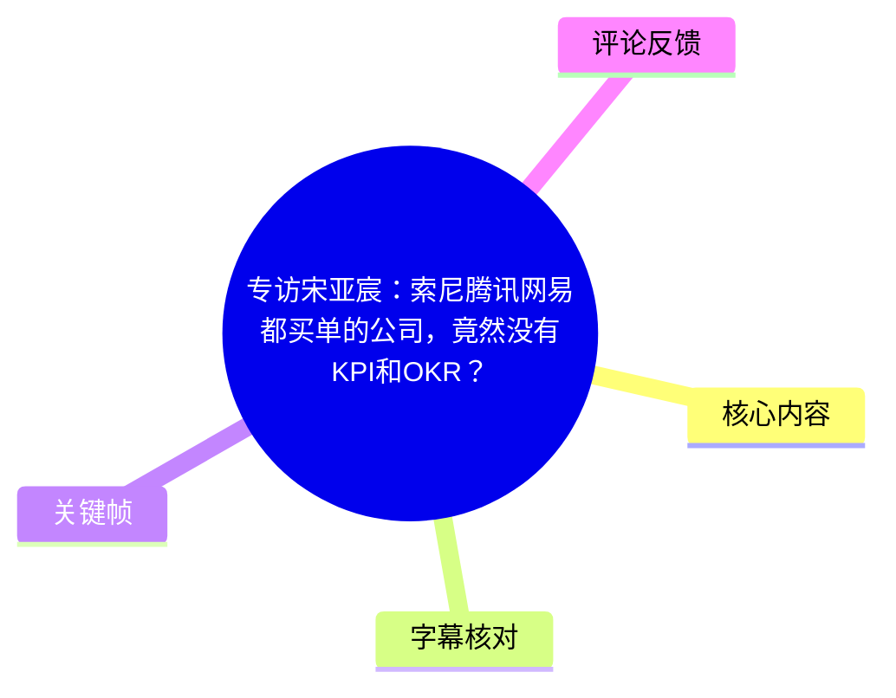
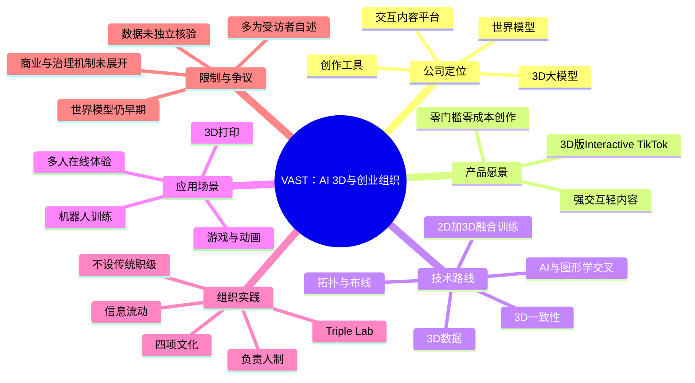
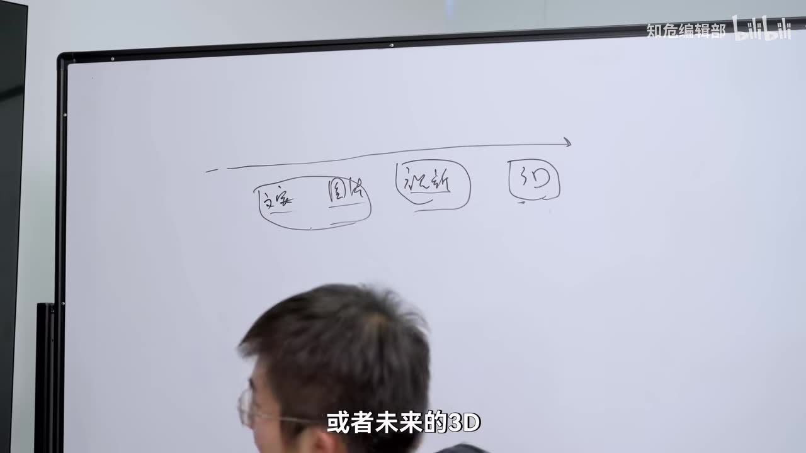
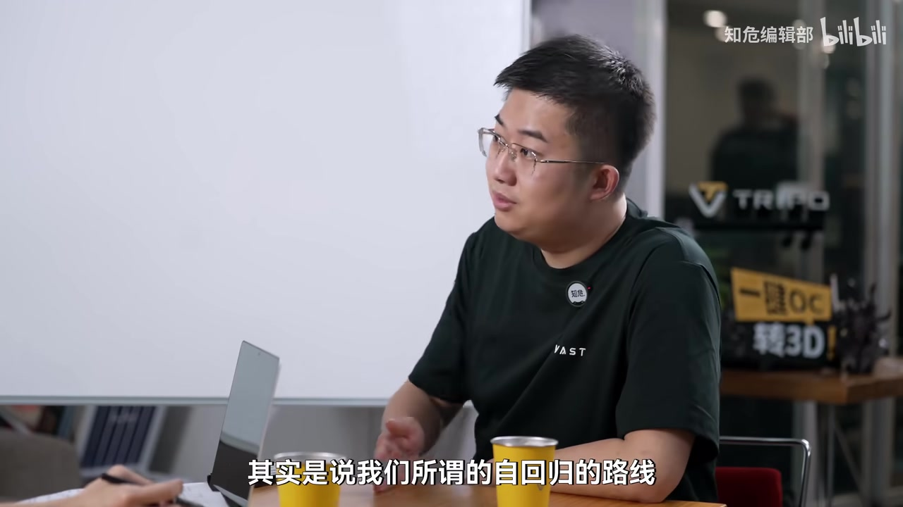
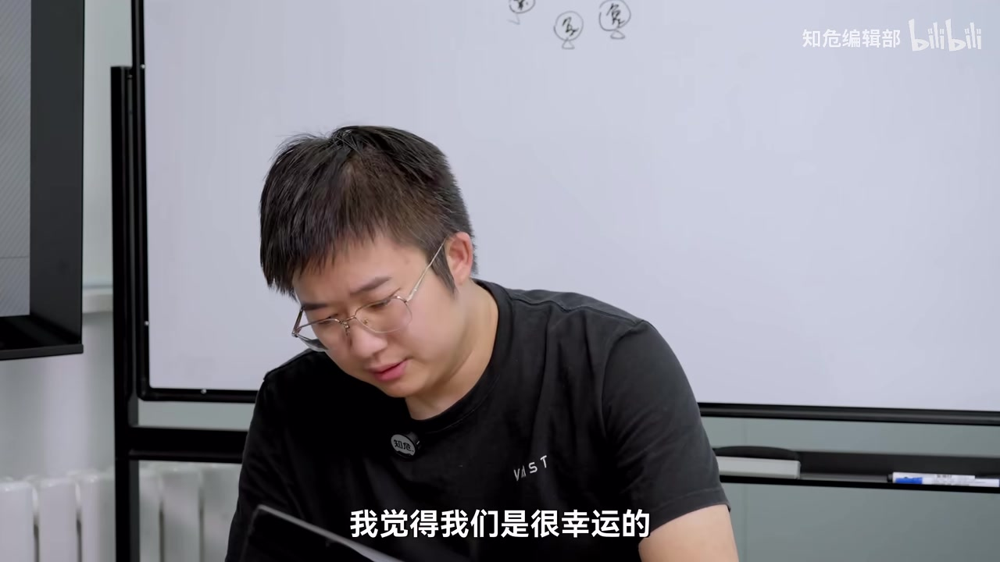

# 专访宋亚宸：索尼腾讯网易都买单的公司，竟然没有KPI和OKR？

> 来源：[Bilibili 视频](https://www.bilibili.com/video/BV1xCTs6vEmt)  
> UP 主：知危编辑部｜时长：53 分 53 秒｜标签：AI、人工智能、创业  
> 访谈对象：宋亚宸（视频及元数据中公司名存在 VAST / WAST 的 ASR 混淆，以下按画面与标题语境统一记为 **VAST**；未经外部核验）

## 小结

这是一场围绕 AI 3D、世界模型与创业组织管理的长访谈。宋亚宸将 VAST 定义为一家服务创作者的 AI 3D 公司：底层有 3D 模型与世界模型，中间提供创作工具，上层目标是形成一个可交互的 UGC 内容平台，访谈中称其为“Interactive TikTok（可交互的抖音）”。

技术路线是访谈最具体的部分。宋亚宸称，行业曾广泛采用由 2D 图像训练 3D 模型的“2D 生 3D”路线；VAST 在 2023 年 4 月提出“2D + 3D 融合”训练思路，以 2D 图片与 3D 数据共同训练，并强调 AI 与图形学交叉、3D 数据积累、3D 一致性、多人同步和长期稳定体验。上述均为受访者的公司技术主张，不能直接视作独立验证的行业事实。

在产品和市场判断上，访谈认为 3D 创作要成为真正 UGC，关键不只是生成质量，而是做到“零门槛、零成本、实时创作”。3D 打印被视为一个较近的落地场景：现有设备和建模流程仍主要服务 Maker，AI 3D 若能把设计端变成低门槛工作流，可能扩大至普通消费者。但“几分钟生成大量设计”“用户规模从数亿到数十亿”等表述是愿景或估计，不构成已实现的市场数据。

组织管理部分解释了标题中“没有 KPI 和 OKR”的含义：并非完全不用目标管理工具，而是不强制所有人写 OKR；公司用负责人制、目标与职责清晰化、匿名提问、全员会、CEO table 和按季度调整期权等方式维持信息流动。它取消传统职级和 title，强调责任范围可随业务变化而调整，并设置由“六边形战士”组成的 Triple Lab 处理跨部门、AI 化和快速补位问题。

访谈后半段大量内容属于受访者的未来观：他认为未来最重要的产业将是“体验”，个人价值可能体现为他人停留在其创造世界中的总时长。这套观点有鲜明的使命叙事，但没有在视频中给出充分的经济机制、治理机制、版权与安全方案；观众热评也集中质疑其从技术愿景到商业与社会结论之间的推理跳跃。

**适合阅读者：**AI 3D、游戏/内容工具、3D 打印、世界模型创业及早期组织设计的关注者。  
**时效性提示：**视频中涉及融资、客户、模型、竞争格局、团队规模和产品发布的内容均是访谈发生时的陈述；尤其“阿里、腾讯于 4 月底发布世界模型产品”“月初推出通用世界模型”等相对时间信息，需以视频发布时点为准，不能当作当前状态。

## 思维导图

## 目录

- [访谈背景与公司定位](#访谈背景与公司定位)
- [AI 3D 的产品判断：从 PGC 到 UGC](#ai-3d-的产品判断从-pgc-到-ugc)
- [技术路线、拓扑与世界模型](#技术路线拓扑与世界模型)
- [3D 打印：从 Maker 工具到大众工作流](#3d-打印从-maker-工具到大众工作流)
- [未来内容平台与体验经济设想](#未来内容平台与体验经济设想)
- [创业、融资与竞争判断](#创业融资与竞争判断)
- [没有 KPI/OKR 的组织如何运行](#没有-kpiokr-的组织如何运行)
- [个人经历、游戏体验与自我迭代](#个人经历游戏体验与自我迭代)
- [关键结论、限制与时效性](#关键结论限制与时效性)
- [字幕比对](#字幕比对)
- [评论分析](#评论分析)
- [处理记录](#处理记录)

## 访谈背景与公司定位 [00:00:28](https://www.bilibili.com/video/BV1xCTs6vEmt?t=28)

视频开场介绍称，VAST 的能力是用户通过一句话或一张图片，在数秒内生成“精度不错”的 3D 模型，可用于游戏、动画和 3D 打印；并称索尼、微软、腾讯、网易是其客户，且公司完成了两轮融资、合计接近 2 亿美元。由于这些信息来自视频旁白与受访者语境，素材中没有融资公告、客户合同或模型测评报告，故只能作为**节目陈述**记录。

宋亚宸自述为 29 岁、约翰·霍普金斯大学国际关系专业毕业、不会写代码的文科背景创业者。访谈在 VAST 北京、杭州办公室进行了两次对谈。

### 公司架构：模型、工具与平台 [00:02:26](https://www.bilibili.com/video/BV1xCTs6vEmt?t=146)

宋亚宸在白板上将业务分为三层：

1. **基础模型层**：3D 模型与世界模型；
2. **应用工具层**：面向创作者提供创作辅助；
3. **交互内容平台层**：目标是承载 E/UGC 交互内容的平台。

他认为公司不应替创作者生产内容或创意，而应提供生产力工具与平台能力。类比中，抖音既有面向用户的内容平台，也有分发、推荐和基础设施；VAST 希望在 3D 领域形成相似但更强调交互性的结构。

> 图：画面展示受访者在白板上梳理“文字—图片—视频—3D”等媒介演进。这有助于理解其为何将 3D 放在内容载体演进的终点或回归点上；白板文字并不完整，正文以带时间戳的 ASR 语音为主要依据。

### 3D 为什么被视为下一代内容载体 [00:04:53](https://www.bilibili.com/video/BV1xCTs6vEmt?t=293)

受访者提出三个判断：

- 3D 的信息密度持续提高；
- 3D 的体验质量持续提高；
- 3D 具备双向交互性。

他进一步将世界理解为天然的 3D 信息空间，认为从现实世界到平面文字、图片和视频，是某种“压缩”；回到 3D 则是“解压缩”或“返璞归真”。他还推测，如果未来有更通用的智能，训练数据应包含空间 3D 原始信息。

这一部分是哲学化的技术愿景，而非视频中经过形式化论证的结论。特别是“3D 是信息本质”“通用智能必须训练于 3D 原文件”等说法，应理解为受访者的路线判断。

## AI 3D 的产品判断：从 PGC 到 UGC [00:06:05](https://www.bilibili.com/video/BV1xCTs6vEmt?t=365)

### 内容生产的三阶段类比 [00:06:05](https://www.bilibili.com/video/BV1xCTs6vEmt?t=365)

宋亚宸用文字、图片、视频的发展来推演 3D：

| 阶段 | 内容特征 | 视频中的类比 |
| --- | --- | --- |
| 1.0 | 精英创作、专业制作 | 《红楼梦》、西斯廷教堂绘画、《阿凡达》；3D 对应大型游戏 |
| 2.0 | 大众级超级工具出现，出现 PGC/PUGC | 手机摄像头；3D 对应 Steam、Roblox 一类平台 |
| 3.0 | 低门槛、大规模 UGC | 微博、X、抖音、快手；3D 将出现对应的交互内容平台 |

访谈称，VAST 在 2023 年上半年推出过一个内测产品，但当时本质是 PGC：专业创作者制作一个可交互的世界，可能需要数月，且未必能形成可消费内容。这造成增长负担高、生产效率低的瓶颈。

### 真正 UGC 的条件：ROI 近似“零比零” [00:09:01](https://www.bilibili.com/video/BV1xCTs6vEmt?t=541)

受访者的关键经验是：UGC 与 PGC/OGC 的差异在于创作的投入和直接收入都接近零。他称这为“ROI 是零比零”，创作的回报主要是轻微的情绪价值，因此创作侧必须满足：

- **零门槛**
- **零成本**
- **实时创作**

在这一逻辑中，先出现的是非商业化或低商业化的普遍表达；当平台流量足够大后，PGC 和 OGC 才会进入以获取流量、形成商业化。这是平台演进假设，不是视频中已验证的经营结果。

### 对创作者的边界定义 [00:03:38](https://www.bilibili.com/video/BV1xCTs6vEmt?t=218)

受访者强调 VAST 的边界是“服务创作者”，不自做内容和创意。这个边界隐含两项执行要求：

1. 工具必须能降低建模、资产制作和交互内容搭建成本；
2. 平台必须让创作者保有表达与分发空间，而不是只让公司生产内容。

这也解释了访谈反复出现“创造世界”“创作者决定爆款内容”的说法：公司自我定位为基础设施和创作工具提供者，而非内容品类的定义者。

## 技术路线、拓扑与世界模型 [00:10:13](https://www.bilibili.com/video/BV1xCTs6vEmt?t=613)

### 2D 生 3D 与“2D + 3D 融合” [00:10:38](https://www.bilibili.com/video/BV1xCTs6vEmt?t=638)

宋亚宸回顾称，2022 年 AI 3D 技术出现后，许多公司采用“2D 生 3D”路线：用图像作为训练数据，通过当时流行的文生图相关技术来生成 3D 模型。他认为这种做法从今天回看“不合理”。

他称 VAST 于 **2023 年 4 月**提出“2D + 3D 融合路线”：

- 继续使用 2D 图片训练；
- 同时使用 3D 数据作为参考；
- 将 AI 与图形学交叉作为核心能力；
- 重视积累 3D 数据集。

ASR 中“积累了超过 XX 的 3D 模型”这一数量位置识别失败，素材无法恢复具体数值；因此不能补写为任何确定规模。受访者仅称其他公司大约是数百万级甚至不到。

> 图：采访画面中，受访者正在说明“自回归路线”等技术话题。该帧用于定位技术讨论场景，不将画面中模糊的背景文字或衣物标识作为额外事实依据。

### 受访者列举的路线优势 [00:11:50](https://www.bilibili.com/video/BV1xCTs6vEmt?t=710)

受访者将“3D 表达静态状态 + 视频表达视觉变化”的路线优势概括为三类：

1. **生成成本低**  
   他称生成一个 3D 模型的成本，是某个“生成 5 秒视频”成本的五万分之一。ASR 将视频模型名称识别为 “Cdance”，专名不可靠，故不在此确认具体对比对象。

2. **支持多人实时在线和同步**  
   例子包括同步球或子弹的位置；还可用于多机器人协同叠衣服时，确认衣袖、动作处于何种状态。

3. **长时间稳定与 3D 一致性**  
   受访者称目标体验应避免穿模、崩溃、漂移等问题。其理由是 3D 有 Ground Truth（真实标注/真实约束）、True Depth（真实深度）和 Physical Scale（物理尺度）。

这些表述说明其技术目标，但没有展示基准数据、具体评测方法、可复现模型版本或第三方测评，无法据此判断相较竞品的实际领先程度。

### 为什么拓扑重要 [00:13:26](https://www.bilibili.com/video/BV1xCTs6vEmt?t=806)

受访者先区分了不同场景：

- **工业、3D 打印、高精度影视**：模型的精细度、几何质量未必以拓扑为首要目标；
- **游戏**：拓扑结构较关键，因为资产需要二次编辑，并进入实时渲染管线。

他指出两类既有路线的问题：

| 路线 | 访谈中的描述 | 问题 |
| --- | --- | --- |
| Diffusion | 容易生成数百万面、高面数模型 | 拓扑碎乱；难二次编辑；实时渲染占资源、可能卡顿 |
| 自回归 / Transformer | 类比为逐步“雕刻”石头 | 受访者称已相对被淘汰，但未给出性能数据或行业共识来源 |

随后他提及一个 ASR 识别为 “P.0” 的模型/框架名称，该专名无法由现有素材可靠校正。受访者的核心主张是：该路线跳出前两类方案，可直接生成拓扑和布线相对较好的 3D 模型，速度快，且方便专业创作者二次编辑。由于模型名、版本和评测集均不明确，不能把“全球只有我们有”当成经核验的技术事实。

### 世界模型：从状态到状态转移 [00:18:40](https://www.bilibili.com/video/BV1xCTs6vEmt?t=1120)

访谈用简化方式解释“AI 3D + 世界模型”：

- **AI 3D**：擅长表达一个静态状态（state）；
- **传统引擎**：以代码、图形学计算和规则拟合状态之间的变化；
- **世界模型**：从海量变化经验中预测下一个状态，例如从“坐着”到“站起来”后，视觉、光照、阴影怎样变化。

宋亚宸明确承认这种解释“很粗糙、不准确”，并将世界模型描述为经验驱动的黑盒方法，而不是将所有规则显式写出的白盒系统。他也承认，真实技术难点不只是数据量，但在通俗层面可理解为模型是否“看过足够多的变化”。

这一段的正确阅读方式是：它是对受访者世界模型观的**概念化阐释**，不是严格定义，也不等于业内统一技术定义。

## 3D 打印：从 Maker 工具到大众工作流 [00:15:27](https://www.bilibili.com/video/BV1xCTs6vEmt?t=927)

### 先从“农场主”和专业用户切入 [00:15:27](https://www.bilibili.com/video/BV1xCTs6vEmt?t=927)

访谈提到 3D 打印“农场主”这一群体：过去可能主要接收海外游戏公司或用户提供的图纸/模型，再执行打印；随着 AI 3D 平台降低建模门槛，他们开始尝试自己设计玩具或模型。受访者描述的采用路径是：

> 农场主 → 专业用户 → Makers → 更广泛的普通用户

这是一则个案式访谈描述，不足以推出整个行业采用比例或确定的用户迁移规律。

### 设备普及的真正瓶颈 [00:15:51](https://www.bilibili.com/video/BV1xCTs6vEmt?t=951)

宋亚宸认为，当前 3D 打印机主要面向 Maker。即使设备降低使用门槛，普通家庭仍会遇到：

- 需要电脑和工作台；
- 要放材料；
- 存在供电、噪音和占地问题；
- 更根本的是不知道“该打印什么”、也不会建模。

他将当前头部设备比作“奔驰”，并提出行业真正的机会应是“福特 T 型车”：把硬件与完整 AI 原生工作流结合，为大众设计更适配的产品体验。

### 社区逻辑可能被模型改写 [00:17:28](https://www.bilibili.com/video/BV1xCTs6vEmt?t=1048)

访谈以拓竹的 MakeWorld 为例，称过去 3D 打印厂商的竞争不仅是机器参数，也是模型社区能力，因为建模门槛高，小白用户需要从专业用户上传的模型中选择。

受访者认为，3D 大模型可能改变这个结构：普通人可低成本生成自己的 IP 或工业设计，在一两分钟内生成“几百到上千个”候选设计再选择。这里应注意三项限制：

1. 生成数量与速度是受访者陈述，未附设备、模型版本、提示词复杂度和成功率；
2. “可生成”不等于“适合打印”，仍可能涉及结构强度、支撑、材料、尺寸、版权和安全问题；
3. 由设计生成到稳定打印，中间还需要切片、设备控制、失败检测等完整工作流。

## 未来内容平台与体验经济设想 [00:22:46](https://www.bilibili.com/video/BV1xCTs6vEmt?t=1366)

### 工作时长和价值的反常识判断 [00:23:04](https://www.bilibili.com/video/BV1xCTs6vEmt?t=1384)

宋亚宸提出两条长期趋势：

- 人的选择增加，可被称为经济学意义上的“平均幸福感”提高；
- 人的工作时长不断变化。

他用采集社会、工业社会、互联网“996”作为比照，并提出一个反直觉观点：在 AI 时代，人的工作时长不是归零，而可能变为每天 16 小时——除睡眠外都在“工作”。其理由是人需要创造价值，而消费与享受本身在他的表述中不构成价值创造。

他进一步给出一种价值计量设想：一个人创造的所有世界中，其他人停留时间的总和，可能成为其价值。例如 702 人各体验一小时，即为 702“人时”的价值。

这不是可执行的经济制度设计。视频没有回答如何验证停留时间、如何防刷量、如何处理内容质量、外部性、平台分配、隐私、劳动保障或公共服务。因此应把它视为创业者的愿景语言，而非经济预测。

### “强交互、轻内容”的空白象限 [00:28:10](https://www.bilibili.com/video/BV1xCTs6vEmt?t=1690)

受访者用二维象限划分内容：

| 交互性 / 内容重量 | 重内容 | 轻内容 |
| --- | --- | --- |
| 强交互 | 迪士尼乐园、游戏等 | 他认为尚有空白，是早期产品形态 |
| 弱交互 | 京剧、电影等 | 抖音、杂志等 |

他的产品判断是，未来 3D 交互内容平台最初可能落在“强交互、轻内容”区域。访谈中，主持人反驳不同内容会争夺有限时间；宋亚宸则认为短视频和电影服务不同场景，不一定互相挤占。

这一争论未在视频内得出结论，核心待验证问题包括：

- “强交互轻内容”是否确实是空白市场；
- 新交互形态的内容创作和消费成本是否足够低；
- 用户是否会形成稳定使用场景；
- 它与游戏、短视频、社交、XR 的竞争关系是否真能按象限分隔。

## 创业、融资与竞争判断 [00:20:26](https://www.bilibili.com/video/BV1xCTs6vEmt?t=1226)

### 为什么认为巨头入场是好事 [00:21:14](https://www.bilibili.com/video/BV1xCTs6vEmt?t=1274)

主持人提到阿里和腾讯在“4 月底”几乎同期发布世界模型产品，询问这是否会冲击 VAST。宋亚宸的回应是：

- VAST 已在 3D 大模型业务中完成基础积累并实现增长；
- 世界模型还很早期，是长坡厚雪的增量领域；
- 行业内技术路线尚未完全统一；
- 大厂投资部门与产品/研发部门的 KPI 并不一致，因此投资方兼具潜在竞争者身份未必构成主要问题。

这是受访者的竞争评估。由于视频没有给出阿里、腾讯产品名称、发布日期、能力边界、收入数据或可比测试，不能据此作出市场格局判断。

### 受访者总结的融资阶段 [00:36:05](https://www.bilibili.com/video/BV1xCTs6vEmt?t=2165)

宋亚宸把公司融资/被投资者评价的演进概括为六步：

1. **看人**：早期先看创始人；
2. **看事**：要做的事情是否成立；
3. **看技术**：技术是否具备领先性、创新性；
4. **看产品与服务**：是否形成 MVP，是否被行业客户认可；
5. **看商业收入**：是否已有一定收入；
6. **看壁垒与行业地位**：收入较高后，如何成为领先玩家。

上市被他视为另一个阶段。该框架是经验总结，不应理解为所有融资项目的固定标准顺序。

### 使命叙事与团队凝聚 [00:31:28](https://www.bilibili.com/video/BV1xCTs6vEmt?t=1888)

受访者称公司从 2023 到 2026 持续重复讲同一件事，每月举行 all-hands meeting，创始人讲的不是具体沟通技巧，而是使命和长期方向。他提到 CTO 梁鼎曾评价演讲“没什么新东西”，他认为这恰好说明使命已形成稳定共识。

其组织凝聚逻辑是：

- 先让少数人相信；
- 长期重复且让愿景逐步成为现实；
- 用使命而不是只靠具体任务聚集人才。

这可以作为创始人沟通方式参考，但其有效性依赖团队人才密度、业务进展、激励制度和领导可信度，无法仅靠“布道”复制。

## 没有 KPI/OKR 的组织如何运行 [00:39:27](https://www.bilibili.com/video/BV1xCTs6vEmt?t=2367)

### 标题的澄清：不是完全没有 OKR [00:39:27](https://www.bilibili.com/video/BV1xCTs6vEmt?t=2367)

视频提到公司此前“没有 KPI、没有 OKR”，也不设传统职级与 title。宋亚宸在本次访谈中作了关键补充：

- 公司当前并非“完全不学/不用 OKR”；
- 他本人会写目标；
- 写目标不是为了强制所有人填写，而是告诉团队什么重要；
- 团队小的时候，信息天然同步；组织扩大后，需要主动建设信息流动。

因此，准确理解应是：**VAST 弱化传统 KPI/职级式管理，强调目标透明、责任归属和信息对齐；而非不存在目标管理。**

> 图：该帧呈现访谈对象在办公室的近景，有助于将后文“信息流动、目标沟通与负责人制”放回真实访谈场景。画面本身未展示制度文件，因此制度细节仅依据 ASR 内容记录。

### 信息流动机制 [00:39:51](https://www.bilibili.com/video/BV1xCTs6vEmt?t=2391)

视频提到的机制包括：

- 尽量每周举行一次 **CEO table**：一起吃饭、聊天；
- 收集全员匿名问题；
- 在全员大会回答尖锐问题；
- 对暂时答不上来的问题，明确承认无法回答；
- 允许质疑管理层是否参与业务、组织 AI 化是否不足、效率是否不高。

这一做法的重点不在“取消冲突”，而在于让冲突和疑问进入公开讨论流程。其前提是管理层愿意回应，且组织能承受公开质疑。

### 不设职级，改用负责人制 [00:41:03](https://www.bilibili.com/video/BV1xCTs6vEmt?t=2463)

宋亚宸称，公司入职时鼓励校招生与年轻人，不设“助理经理、高级专员、副总监”等传统 title。替代方式是：

- 每个重要方面要有一个人真正“心心念念”；
- 以目标、职责和结果来识别负责人；
- 负责人不是固定级别，而是对具体事项承担责任；
- 业务变化时，责任范围可以大幅变化。

例子是增长工作中的 SEO：需要有人专注自然流量增长中的 SEO，但这不自动对应某个职级。

### 激励与岗位调整 [00:42:16](https://www.bilibili.com/video/BV1xCTs6vEmt?t=2536)

受访者称公司按季度进行考核/调整，并按贡献与岗位变化发放期权；每季度还会调整“注册价格”（ASR 用词，可能指期权相关价格，但素材不足以确认具体制度名称）。他举例说，一个人本月负责 100 人、下月只负责 5 人是正常的，因为负责内容改变了。

可提炼的管理原则是：

1. 权责随任务变化而不是随 title 固化；
2. 激励需要跟贡献和岗位变化同步；
3. 成长更强调思维方式与能力，而不只是熬年限。

**限制：**视频没有交代考核指标、期权授予规则、归属期、员工申诉机制或劳动合规安排，不能将其视为完整的人力制度模板。

### Triple Lab 与“六边形战士” [00:43:04](https://www.bilibili.com/video/BV1xCTs6vEmt?t=2584)

VAST 的招聘中有“六边形战士”岗位：受访者称这类人可能同时懂运营、产品、增长、项目管理，甚至财务和法务。公司另有 **Triple Lab** 团队：

- 成员是通才型人员；
- 可做自己感兴趣的事，但必须使用 AI；
- 可像“特种兵”一样支援部门；
- 例如帮助增长团队进行 AI 化；
- 当主产品快速迭代、其他平台更新被忽略时，可主动接手并用 AI 在数天内完成大规模改造。

受访者认为，这种机制能运转是因为公司强调“对结果负责”而不是“掌握地位”：有人来帮忙，不被视为抢功，而是帮助目标达成。

### 文化标准 [00:45:04](https://www.bilibili.com/video/BV1xCTs6vEmt?t=2704)

受访者列出四项文化：

1. **热爱**：对事、人和世界有内在投入；
2. **长期主义**：做至少 5—10 年甚至更长的事情；
3. **实事求是**：对自己、别人和事情保持真实；
4. **故意创新**：不是在既有墙上“把墙刷白”，而是必要时把墙拆掉重建。

“故意创新”强调主动重新设计基础假设，而非表面优化。受访者也承认其判断不靠 KPI 完成，而依赖人的判断力与是否实事求是。这正是这种管理模式的风险点：它对领导者、文化一致性和判断透明度要求很高。

## 个人经历、游戏体验与自我迭代 [00:46:28](https://www.bilibili.com/video/BV1xCTs6vEmt?t=2788)

### 游戏不是“效率工具”，而是进入另一个世界 [00:46:28](https://www.bilibili.com/video/BV1xCTs6vEmt?t=2788)

宋亚宸称自己很容易进入一个世界、具有较强代入感，曾玩《率土之滨》，并在其中担任盟主和金主。他认为创业更像向共同目标前进，而策略游戏更像围棋或阵营对抗，二者并不相同。

他表示自己能玩大量不同类型游戏，包括独立游戏、手游、MOBA、射击和开放世界游戏；并不以游戏机制是否“足够高级”作为唯一筛选标准。对他而言，游戏是进入另一个世界、体验其他事物的方式，而不只是放松或提升效率。

他特别提及两个世界观：

- 《龙与地下城》：影响大量后来的 RPG；
- 《极乐迪斯科》：有明确态度与思想表达。

### 教育与“品性优先” [00:50:01](https://www.bilibili.com/video/BV1xCTs6vEmt?t=3001)

受访者回忆高中经历，称校训是 **“character before career”**，即先培养人的品性，再进入职业。他认为老师群体因共同理念聚在一起，给学生提供了很多品性层面的影响。

主持人追问这是否促成其“创造天堂世界”的原点。宋亚宸否认自己认为现实世界“很糟”，而是称现实已是某种最好的妥协结果，自己想做的是带来更好的变化。

### 自我迭代：对“线”比对“点”敏感 [00:51:38](https://www.bilibili.com/video/BV1xCTs6vEmt?t=3098)

宋亚宸对自己的描述有三个重点：

- 对大量孤立信息点不算敏感；
- 更擅长发现点和点之间的“线”，即模式、关系和 insight；
- 知道自己“不才”，因此倾向招聘在某些方面比自己更强的人。

他认为大模型的核心不只是百科式知识，而是一种思考方式：从“用很多小模型解决单一问题”走向“用通用模型解决更多问题”。他也强调自己会承认决策错误，认为错误决策本身正常。

在访谈结尾，他说自己每天最在意的不是“打造自己”，而是打造更好的团队、向目标前进；至于个人成长，可能会自然发生但不是其日常关注中心。

## 关键结论、限制与时效性 [00:53:27](https://www.bilibili.com/video/BV1xCTs6vEmt?t=3207)

### 可迁移的经验

1. **产品层：先拆解 UGC 的经济条件**  
   不要只问“能否生成”，还要问创作是否足够低成本、低门槛、即时，是否能让非专业用户愿意反复表达。

2. **技术层：生成质量之外，关注可编辑性与运行时约束**  
   在游戏和交互场景，面数、拓扑、布线、渲染性能、多人同步、长期稳定性都可能比单次视觉效果更重要。

3. **组织层：取消 title 不等于取消目标**  
   若采用弱职级、弱 KPI 的组织设计，必须用更强的信息透明、责任归属、反馈机制和激励调整来补位。

4. **沟通层：使命要可长期重复，但也要被业务进展验证**  
   反复讲述愿景能统一团队语言，但不能替代技术、产品、收入与组织治理的实际结果。

### 关键限制

- 视频中关于客户、融资、技术领先、模型成本、数据规模、用户规模和竞争格局，多为旁白或受访者说法，**没有独立材料交叉验证**。
- ASR 对公司名、模型名、英文缩写、数量和个别技术术语存在明显错识别；本文不据此补造专名或精确数字。
- “世界模型”“体验经济”“天堂”等内容高度愿景化，未讨论模型安全、内容审核、知识产权、隐私、未成年人保护、平台治理、劳动分配等关键现实问题。
- 组织管理经验可能适用于高人才密度、小到中型、使命一致性较强的创业团队；当组织规模持续扩大时，能否维持仍需观察。
- 视频叙述中“去年”“月初”“4 月底”“现在”等相对时间均以访谈发生时为准，不能直接映射到当前产品状态。

## 字幕比对

| 字幕来源 | 完整性 | 专有名词 | 时间轴 | 主要问题 |
| --- | --- | --- | --- | --- |
| Bilibili 站内字幕 | 未提供可用字幕 | 无法评估 | 无法使用 | 素材记录显示字幕工具因 `Invalid URL` 退出，未获得站内 SRT |
| 本次 ASR 字幕 | 较完整：155 段，覆盖约 3085.58 秒 / 3232.28 秒，覆盖率 95.46% | 较多误识别 | 可用，含毫秒级 SRT 起止时间 | 公司名、模型名、缩写、数字、个别中文词误识别；在 00:52:46—00:53:03 左右存在约 16.95 秒较大空档 |

### 最终字幕选择与校正原则

最终采用**本次 ASR 时间轴字幕**作为正文定位依据，因为没有可用站内字幕。ASR 识别语言为中文，置信度约 0.9995，且 `asr-result.json` 未标记 `noAudioStream=true`，说明源视频存在音轨；本次转写并非在无音轨情况下的替代方案。

已结合视频标题、元数据、画面和上下文进行以下谨慎校正：

- ASR 中的 “WAST / MUST / Vas” 统一按视频题名语境记为 **VAST**，但这不是对品牌拼写的外部核验；
- “PPI”应为“**KPI**”的上下文误识别；
- “EOGC”等表述疑似 UGC/PGC/OGC 相关缩写误识别，正文仅在语义足够明确时使用通行缩写；
- 3D 数据数量处出现“超过 XX”，无法恢复，故不写具体数；
- 比较成本时的具体视频模型名称识别不可靠，故只保留“五万分之一”的受访者原意，不确认对比对象；
- 个别模型名、产品名如 “H3.1”“P.0”“Triple Studio”“EPI 平台”等无法完全确认原文拼写，均避免扩展解释。

## 评论分析

仅处理可获取热评前三条；评论是用户意见，不作为事实来源。

1. **琳与栩｜89 赞**  
   评论认为受访者相信 AI 带来高度生产力后，常规劳动价值下降、体验成为重要产业，并在为低门槛 3D 世界创作平台布局。评论的主要质疑是：从这些宏大前提出发，如何“活到那个时候”、不同结论之间如何推导，访谈没有充分说明，像“仙家对话”。  
   **分析：**这准确指出视频的结构性缺口：技术路线与组织实践谈得相对具体，但经济秩序、商业闭环与社会治理部分多为宣言式表达。该评论没有提供新证据，因此是有效批评而非事实反证。

2. **194121｜1 赞**  
   评论内容为连续 @ 多个 AI 总结账号，未表达对技术、公司或访谈观点的实质判断。  
   **分析：**反映部分观众有提炼长视频信息的需求，但不构成可分析的立场或补充事实。

3. **HOSIT｜1 赞**  
   评论称“文科生搞 AI 啊 那没事了”。  
   **分析：**这是基于受访者文科背景的简短调侃或质疑，没有论证其与 AI 创业能力之间的关系。视频本身呈现的分工是：受访者并不把自己描述为编码者，而强调方向、沟通、组织与使命；技术能力则由团队承担。仅凭专业背景不能推断其公司技术能力的高低。

## 处理记录

- **Worker ID：**worker-mrj0www4-e8d79408
- **模型：**gpt-5.6-terra
- **工具与素材：**Bilibili 元数据、视频音频提取结果、ASR SRT / `asr-result.json`、关键帧目录、热评 JSON。
- **ASR 状态：**中文识别；模型 `medium`；CUDA / float16；有时间戳；时长约 3232.28 秒；未发现 `noAudioStream=true`。
- **字幕选择：**站内字幕不可用。任务记录显示字幕工具报错 `Invalid URL`；已检查并采用本次 ASR 的真实 SRT 起止时间生成章节时间轴。
- **关键帧依据：**选用 `frames/frame-002.jpg` 展示白板上的媒介/3D 演进解释，`frames/frame-003.jpg` 展示组织管理话题的采访现场，`frames/frame-004.jpg` 对应技术路线讨论。图片仅用于增强场景理解，不从模糊图像中推导未被音频确认的事实。
- **缓存清理：**素材清单未提供缓存清理执行日志；无法确认是否已清理，故不虚构“已清理”结果。
- **未解决问题：**
  - 无可用站内字幕，无法对 ASR 专名和数字逐项校对；
  - VAST 的客户、融资、模型版本、性能、数据规模与行业排名均未在给定素材中得到外部验证；
  - 部分 ASR 专名和产品名失真，已在正文中保守处理。
