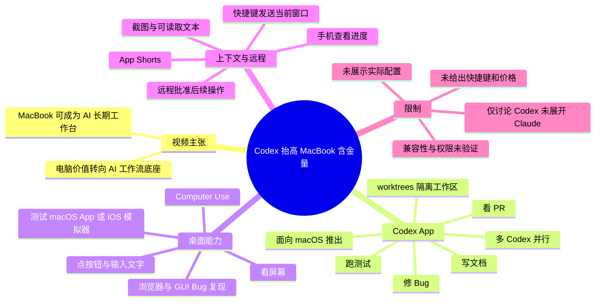
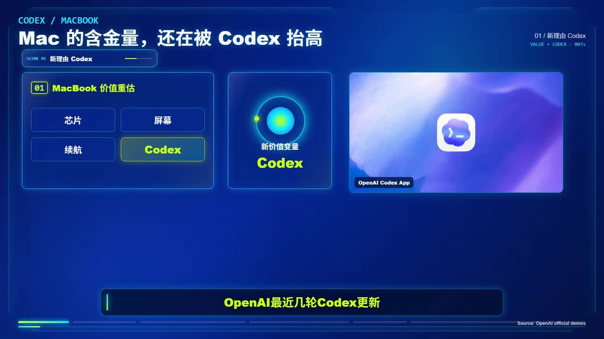
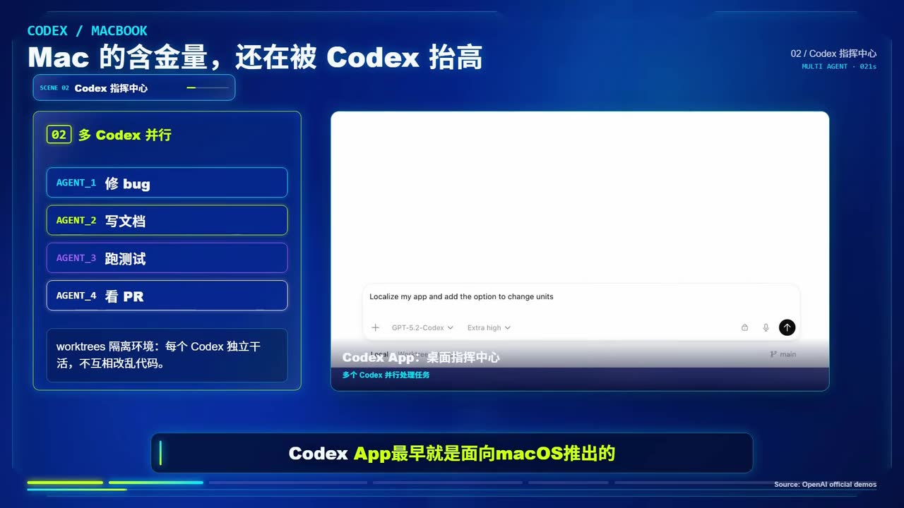
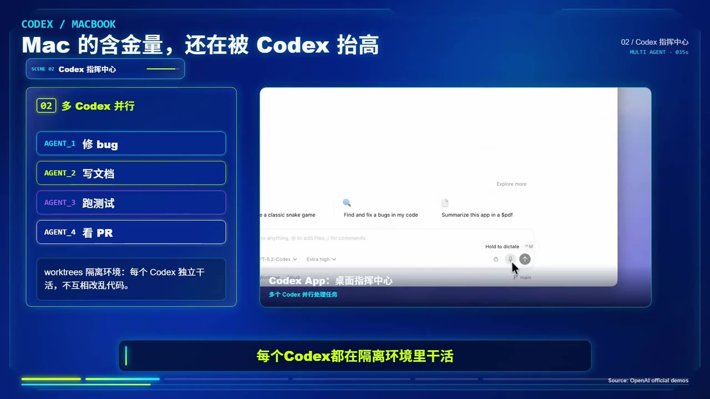
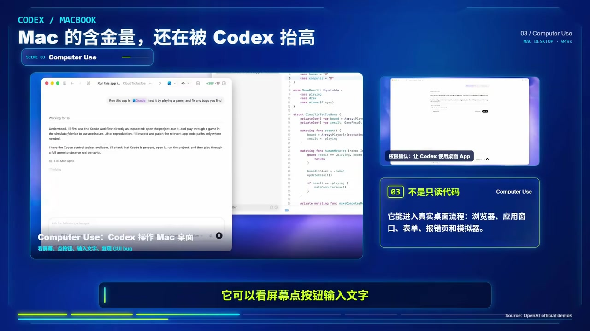

# 需要稳定使用Codex/Claude的可以私信我

> 来源：[Bilibili 视频](https://www.bilibili.com/video/BV1N6VN6tEya) 
> UP 主：Coco科技Ai日记｜时长：3 分 05 秒｜分区/标签：科技、AI、增效  
> 注：视频标题提到 Claude，但正文讲解内容实际聚焦于 Codex 与 macOS 工作流，未提供 Claude 的具体功能、使用方法或稳定服务方案。

## 小结

视频的核心判断是：随着 Codex 面向 macOS 的桌面化、并行任务、桌面操作和远程查看等能力出现，MacBook 的价值可能不再仅由芯片、屏幕和续航决定，也会体现在其作为 AI 工作流本地底座的能力上。

视频将 Codex App 描述为“指挥中心”而非单一聊天窗口：可将修 Bug、写文档、跑测试、审阅 PR 等工作分给多个 Codex 并行处理。画面和站内字幕均强调各任务处于隔离环境；关键帧中的术语为 `worktrees`，对应通过隔离工作区避免多个任务相互改乱代码的思路。

随后视频重点介绍 `Computer Use`：Codex 不只读取代码，还可在 Mac 上查看屏幕、点击按钮、输入文字，并在浏览器、macOS App 或 iOS 模拟器中复现和测试图形界面问题。另一个被称为 `App Shorts` 的能力，是通过快捷键将当前窗口及其中可读取文本交给 Codex，以减少人工描述上下文的成本。

适合关注 AI 编程代理、macOS 开发环境、产品/设计协作与远程任务跟进的读者。视频给出的案例偏概念性说明，没有展示实际安装步骤、快捷键组合、权限配置、订阅要求、模型版本、任务成功率或资源占用数据，因此不能据此推导所有 Mac、所有地区或所有账号都具备这些功能。

信息具有时效性：视频口述将 Codex App 的发布时间定位为“2026 年 2 月”，并以“最近几轮更新”为背景；软件功能、平台支持范围、远程控制能力及权限策略都可能在后续版本中调整。本文将这些内容标为“视频陈述”，不将其自动等同于独立验证过的产品公告。

## 思维导图

## 目录

- [背景：为什么视频认为 MacBook 的价值在变化](#背景为什么视频认为-macbook-的价值在变化)
- [Codex App：多任务指挥与隔离工作区](#codex-app多任务指挥与隔离工作区)
- [Computer Use：从读代码到操作桌面](#computer-use从读代码到操作桌面)
- [App Shorts：将当前窗口变成任务上下文](#app-shorts将当前窗口变成任务上下文)
- [手机远程跟进与 AI 工作台判断](#手机远程跟进与-ai-工作台判断)
- [可执行的工作流整理](#可执行的工作流整理)
- [限制、风险与时效性](#限制风险与时效性)
- [关键帧索引](#关键帧索引)
- [字幕比对](#字幕比对)
- [评论分析](#评论分析)
- [处理记录](#处理记录)

## 背景：为什么视频认为 MacBook 的价值在变化 [00:00](https://www.bilibili.com/video/BV1N6VN6tEya?t=0)

视频开头提出一个观点：传统上人们会从芯片、屏幕、续航等硬件指标评价 MacBook；而 Codex 的近期更新，可能让“能否承载 AI 深度参与本地工作流”成为新的价值维度。

视频的论证路径不是“MacBook 的硬件参数突然领先”，而是：

1. AI 从网页聊天框进入本地电脑与桌面 App；
2. AI 可以取得屏幕、窗口和代码仓库等工作上下文；
3. AI 能并行承担多个任务，并持续运行；
4. 因而一台稳定承载代码、终端、浏览器、IDE、设计工具、文档及权限系统的本地机器，会成为 AI 工作流的底座。

> 图：该帧直接列出“芯片、屏幕、续航、Codex”，并以“Mac 的含金量，还在被 Codex 抬高”为主标题。它清晰呈现视频的中心论点：作者讨论的是工作流价值，而非单纯硬件跑分。

### 视频中的时间背景与范围

- [00:16](https://www.bilibili.com/video/BV1N6VN6tEya?t=16)：视频称 OpenAI 在 **2026 年 2 月**发布 Codex App，且最早面向 macOS 推出。
- [00:05](https://www.bilibili.com/video/BV1N6VN6tEya?t=5)：视频将后续能力归入“最近几轮 Codex 更新”。
- 视频未给出具体版本号、发布日期链接、系统最低版本、支持地区、账号类型或定价信息。
- 标题中的“稳定使用 Codex/Claude 可以私信我”属于标题信息；视频正文并未交代私信服务的内容、价格、账号来源或合规边界，也没有展开 Claude，不能据此形成购买或配置建议。

## Codex App：多任务指挥与隔离工作区 [00:20](https://www.bilibili.com/video/BV1N6VN6tEya?t=20)

视频将 Codex App 定义为“Codex 指挥中心”，区别于传统单轮聊天窗口。其叙述中的主要能力是同时管理多个 Codex 任务：

| 并行任务示例 | 视频描述的目标 |
| --- | --- |
| 修 Bug | 定位并处理代码问题 |
| 写文档 | 生成或完善项目文档 |
| 跑测试 | 执行测试流程并查看结果 |
| 看 PR | 审阅 Pull Request |

> 图：该帧列出 `AGENT_1 修 bug`、`AGENT_2 写文档`、`AGENT_3 跑测试`、`AGENT_4 看 PR`，右侧展示 Codex App 界面。它是视频“一个人协同多个 AI 任务”叙述的核心视觉证据。

### 隔离工作区：避免并行改动互相冲突 [00:33](https://www.bilibili.com/video/BV1N6VN6tEya?t=33)

站内字幕将此处写作“work trace”，但画面明确写为 **`worktrees`**；结合“每个 Codex 独立干活、互相不改乱代码”的上下文，本文保留画面中的 `worktrees` 拼写，不扩展为视频未展示的具体 Git 命令或实现机制。

视频陈述的逻辑为：

- 每个 Codex 在隔离环境中工作；
- 多个任务可并行推进；
- 隔离的目的在于减少代码相互覆盖、改乱的风险。

> 图：该帧底部说明为“worktrees 隔离环境：每个 Codex 独立干活，不互相改乱代码”。相比纯口述，它为术语拼写与隔离目的提供了画面依据。

### 实践含义

若按视频的工作分工理解，一个较稳妥的协作方式是：

1. 将不同目标拆成边界清晰的任务，例如“修复指定 Bug”“补充指定文档”“运行测试”“审阅变更”；
2. 为每项任务保留独立工作区，避免多个代理同时修改同一批文件；
3. 人工检查每个任务的变更、测试结果和合并影响；
4. 再决定是否采纳、合并或继续授权下一步。

视频没有展示任务创建界面、并行上限、冲突解决过程、代码审查规则或自动合并策略。因此，上述整理是对视频所述流程的操作化归纳，而非官方配置教程。

## Computer Use：从读代码到操作桌面 [00:42](https://www.bilibili.com/video/BV1N6VN6tEya?t=42)

视频认为真正进一步提高 MacBook 价值的，是 Codex 可通过 `Computer Use` 在 Mac 上操作桌面应用。其口述列出的行为包括：

- 看屏幕；
- 点击按钮；
- 输入文字；
- 操作浏览器；
- 在图形界面中复现 Bug；
- 测试 macOS App；
- 测试 iOS 模拟器中的流程。

> 图：该帧以“Computer Use”为标题，左侧展示 Codex 与 Xcode/代码界面，右侧文字写明“不是只读代码”，并列出浏览器、应用窗口、表单、报错页和模拟器等桌面流程。这张图最能说明视频所说的能力边界已从代码文本扩展到 GUI。

### 视频强调的工作方式 [00:54](https://www.bilibili.com/video/BV1N6VN6tEya?t=54)

视频称多个 Codex 可在 Mac 上并行工作，同时不干扰用户继续使用其他 App。作者据此将设备定位从“一个人用来干活的电脑”转向“一个人与 Codex 一起干活的工作站”。

这一说法需要注意两个层次：

- **视频陈述**：多个 Codex 可并行，且不影响继续使用其他 App。
- **实际使用中仍需验证的部分**：并行运行对 CPU、内存、电量、网络、系统权限、当前前台应用和任务稳定性的影响，视频没有演示或量化。

特别是涉及桌面点击、输入、文件修改或网页操作的代理任务，应在任务边界、权限和最终提交环节保留人工确认。视频虽提到可“远程批准下一步操作”，但未展示具体审批页面与授权粒度。

## App Shorts：将当前窗口变成任务上下文 [01:13](https://www.bilibili.com/video/BV1N6VN6tEya?t=73)

视频把一个适合 Mac 用户的功能称为 `App Shorts`。根据站内字幕，用户面对下列内容时，不必先长篇描述问题：

- 报错窗口；
- 设计稿；
- 网页；
- 设置面板；
- 表格文档；
- 后台页面。

操作思路是：通过快捷键将当前窗口发送给 Codex；Codex 获得截图与可读取文本，再结合当前上下文处理任务。

### 视频给出的示例 [01:35](https://www.bilibili.com/video/BV1N6VN6tEya?t=95)

| 当前内容 | 希望 Codex 完成的事情 |
| --- | --- |
| 网页设计稿 | 查看设计稿后修改前端 |
| 报错页面 | 分析问题并修复 |
| 表格文档、后台页面 | 根据当前内容继续工作 |

这部分的关键经验不是“让 AI 自动处理一切”，而是利用**当前窗口作为上下文入口**：用户少重复描述，代理少猜测对象和状态。

但需要明确：视频未提供 `App Shorts` 的实际快捷键、支持的 App 范围、截图是否会上传、文本读取权限、敏感信息遮蔽规则或失败处理方式。处理含账号、客户资料、源代码、密钥或生产后台的窗口前，应先确认产品实际的数据处理与权限提示；这些信息不能从本视频直接得出。

## 手机远程跟进与 AI 工作台判断 [01:48](https://www.bilibili.com/video/BV1N6VN6tEya?t=108)

视频称 ChatGPT 手机端可以连接正在 Mac 上运行的 Codex，用户即使离开电脑，也能：

- 查看 Codex 的任务进度；
- 查看终端输出与测试结果；
- 远程批准下一步操作。

视频中“代码 DF”的字幕/ASR文字均不清晰，无法可靠判断其具体指代，本文不将其扩写为某种确定功能。

### 作者的结论 [02:07](https://www.bilibili.com/video/BV1N6VN6tEya?t=127)

作者认为 AI 时代的电脑价值正从“性能设备”转为“AI 工作流底座”。视频列出的底座构成包括：

- 稳定的本地环境；
- 代码仓库；
- 终端；
- 浏览器；
- IDE；
- 设计工具；
- 文档与权限系统；
- 桌面 App。

在此基础上，作者把 MacBook 描述为 Codex 可以长期驻扎、持续工作的 AI 工作台，并将未来更有价值的电脑概括为：更能让 AI 看见工作、理解上下文、操作工具和持续完成任务的电脑。

这是作者的产品趋势判断，而不是通过性能测试得出的普适结论。视频没有把 Windows、Linux 或其他设备纳入同一条件下的比较测试。

## 可执行的工作流整理 [02:16](https://www.bilibili.com/video/BV1N6VN6tEya?t=136)

以下流程仅依据视频提到的能力与案例整理，适合将 AI 代理任务纳入日常开发/创作工作；并非视频展示过的完整操作界面。

### 1. 先明确任务边界

将“帮我做项目”拆为可检查的子任务，例如：

- 复现某个图形界面 Bug；
- 修改某个页面的前端实现；
- 运行已有测试并汇报失败项；
- 基于既有内容补写文档；
- 审阅一组 PR 变更。

任务越具体，越方便将结果与预期对照，也更适合并行分配。

### 2. 对并行任务采用隔离工作区

视频强调 `worktrees` 隔离环境。对应的流程原则是：

1. 一个任务对应一个独立工作区；
2. 避免多个任务同时修改同一目标文件；
3. 每个任务单独检查 diff、日志和测试结果；
4. 由人工决定哪些改动可合并。

视频未给出工作区数量、磁盘要求或 Git 配置参数，无法提供可靠的数值建议。

### 3. 用当前窗口补充上下文

对于设计稿、网页、报错页、后台表格等任务，可按视频思路：

1. 打开需要处理的页面或应用窗口；
2. 通过视频所称的快捷键入口发送当前窗口；
3. 让 Codex 基于截图和可读取文本理解当前状态；
4. 明确指出希望它“分析”“修复”“改前端”还是“继续处理”；
5. 审核其操作结果。

注意：快捷键具体按键在视频中没有给出，不能补造。

### 4. 对 GUI 操作保留验证环节

当任务需要点击界面、输入内容、操作浏览器或模拟器时：

1. 先限定目标页面、测试账号与允许操作范围；
2. 对涉及提交、删除、付费、权限变更或生产环境的动作保持人工审批；
3. 查看任务执行产生的终端输出、测试结果和代码变更；
4. 发现偏离目标时停止后续授权并回滚或修正。

### 5. 离开电脑时只做进度跟进与审批

视频描述可通过手机查看进度并批准下一步。较谨慎的使用方式是：

- 把手机端作为状态查看与授权入口；
- 对不可逆或高风险动作不因“可远程操作”而降低审核标准；
- 确认远程连接、设备锁屏、网络中断后的实际行为，以产品当前版本为准。

## 限制、风险与时效性 [02:40](https://www.bilibili.com/video/BV1N6VN6tEya?t=160)

### 视频未覆盖的关键信息

| 项目 | 视频是否提供 | 说明 |
| --- | --- | --- |
| Codex App 具体版本 | 未提供 | 无法确认功能对应哪一版客户端 |
| macOS 最低系统要求 | 未提供 | 不可据视频判断旧设备兼容性 |
| 硬件配置与性能参数 | 未提供 | 未涉及内存、芯片、续航、并行负载测试 |
| `App Shorts` 快捷键 | 未提供 | 仅说明“直接用快捷键” |
| 定价、订阅与地区可用性 | 未提供 | 不能推导“稳定使用”的成本或资格 |
| 权限、隐私与数据上传策略 | 未提供 | 涉及截图、文本、代码时尤其重要 |
| Windows/Linux 对照测试 | 未提供 | “MacBook 含金量上升”是单平台视角 |
| Claude 的功能和使用方式 | 未提供 | 与标题不一致，正文未展开 |

### 使用上的边界

1. **平台优势并非绝对。** 视频侧重 macOS 与 Codex 的适配，未证明其他平台不能完成同类工作流。
2. **代理操作不等于结果正确。** 能看屏幕、点按钮和运行测试，并不保证理解需求、修复正确或不会引入回归。
3. **并行会扩大管理需求。** 并行任务若边界不清，仍可能造成重复工作、冲突变更或难以追踪的错误。
4. **上下文便利伴随隐私风险。** 发送窗口截图与可读取文本前，需要确认是否包含敏感代码、个人信息、客户数据、密钥或后台权限。
5. **功能会变化。** 视频使用“最近更新”“现在可以”等表述，属于强时效产品信息；实际可用能力应以使用时的官方界面、公告和权限提示为准。

## 关键帧索引

| 时间 | 关键帧 | 画面信息与正文价值 |
| --- | --- | --- |
| [00:00](https://www.bilibili.com/video/BV1N6VN6tEya?t=0) |  | 用“芯片、屏幕、续航、Codex”说明视频为何提出 MacBook 价值变化。 |
| [00:20](https://www.bilibili.com/video/BV1N6VN6tEya?t=20) |  | 展示修 Bug、写文档、跑测试、看 PR 的多代理分工。 |
| [00:33](https://www.bilibili.com/video/BV1N6VN6tEya?t=33) |  | 画面明确写出 `worktrees`，用于校正站内字幕的“work trace”转写。 |
| [00:42](https://www.bilibili.com/video/BV1N6VN6tEya?t=42) |  | 呈现 Codex 操作 Mac 桌面、浏览器、应用窗口与模拟器的能力范围。 |

## 字幕比对

| 字幕来源 | 完整性 | 专有名词 | 时间轴 | 主要问题 |
| --- | --- | --- | --- | --- |
| Bilibili 站内字幕 `p01-ai-zh.srt` | 高，覆盖约 00:00–03:03，分段细 | 整体较好，但将画面中的 `worktrees` 写为“work trace”；`App Shorts`、Codex 等存在大小写/空格不统一 | 可靠，提供 99 个细粒度真实时间段 | 个别词语不清，如“代码DF”；部分中英文混写 |
| 本次 ASR（medium） | 文本内容大体覆盖主要口述，但仅 8 个超长段 | 多处错词：如“读代砂”“操做”“浮现”“摄制面板”“代码DIF”；`Codex` 拼写不稳定 | 不适合做正文定位：首段错误从 00:26.320 才开始，实际口述在 00:00 已开始；每段包含过多内容 | 首段时间偏移严重，段落过长，专有名词和中文词汇误识别较多 |

### 最终字幕选择

本文以**站内字幕**作为事实转录和时间轴链接的主要依据，原因是它从 00:00:00,040 起连续覆盖至 00:03:03,760，且提供可直接定位的细分时间段。

本次 ASR 已检查：诊断显示音频语言为中文、置信度约 `0.9995`，音频时长约 `184.04` 秒，`speechCoverage` 为 `0.853`，且**没有** `noAudioStream=true` 标记。这说明源视频存在音轨；问题不是无音轨，而是本次 ASR 的首段起点与分段质量不适合作为定位依据。

通过关键帧与上下文做出的重要校正如下：

- 站内字幕“work trace” → 画面明确为 **`worktrees`**；
- ASR 的“读代砂”“操做浏览器浮现” → 对应站内字幕“读代码”“操作浏览器复现”；
- ASR 的“摄制面板” → 结合站内字幕与上下文，采用“设置面板”；
- “代码DF / 代码DIF”无法由现有素材可靠判定，正文不扩写其含义。

## 评论分析

以下仅处理可获取的热评前三条；评论反映用户观点，不作为已验证事实。

1. **老牛131｜173 赞**  
   评论认为，以后 Mac 宣传不必只强调剪辑能力。其价值在于呼应视频试图扩展的叙事：Mac 不只是内容剪辑设备，也可能是 AI 辅助开发和创作的工作平台。该评论是对传播话术的调侃，不提供性能或兼容性证据。

2. **威慑利剑｜133 赞**  
   评论提出较完整的反向补充：设备选择主要取决于 AI 生态和具体需求；macOS 的类 Unix 命令行对服务端开发具有吸引力，但 Windows 对不少 C 端软件及 NVIDIA 相关生态更友好，游戏、深度学习、CUDA 高性能计算等场景未必适合用 Mac 推进。  
   这与视频“MacBook 含金量上升”的单向判断形成有价值的边界提醒。不过，评论中关于市场占比、平台能力和替代关系的描述没有附来源，仍应视为经验性观点，而非本片已证明的结论。

3. **麻仓叶王｜42 赞**  
   评论称 Codex“让我的 Mac 永不关机”，表达的是长时间运行 AI 任务后设备持续开机的使用感受。它侧面呼应视频“长期驻扎、持续工作的 AI 工作台”说法，但也提示了潜在现实问题：持续运行可能涉及电源管理、发热、资源占用和任务中断恢复。视频与评论均未提供量化数据。

## 处理记录

- Worker ID：`worker-mrj0www4-e8d79408`
- 模型：`gpt-5.6-terra`
- 调用工具与素材：视频元数据、站内字幕 `p01-ai-zh.srt`、本次 ASR 结果 `asr/asr-result.json` 与 `asr/transcript.srt`、关键帧目录 `frames/`、热评数据 `comments/comments.json`。
- 字幕选择：以站内 SRT 为主，用其真实起止时间生成时间轴链接；本次 ASR 已完整检查，但其首段从 26.320 秒开始且分段过粗、错词较多，仅用于交叉核对。
- 关键帧选择依据：选用 `frame-001` 呈现“Codex 是新增价值变量”的总论点；`frame-002` 呈现多任务分工；`frame-003` 校正 `worktrees` 专有名词；`frame-004` 说明 Computer Use 的桌面操作范围。
- 多模态校正：依据 `frame-003` 中可见文字，将站内字幕“work trace”校正为 `worktrees`；对“代码DF/DIF”等无法可靠校正的内容不作推断。
- 评论处理范围：仅分析可获取热评前三条，未扩展到其他评论或楼中楼。
- 缓存清理：未提供可执行的缓存清理记录或结果；本文不声称已执行清理。
- 未解决问题：缺少 Codex App 的实际版本、可用地区、订阅方案、快捷键、权限机制、隐私策略、性能数据及 Claude 相关实质内容；这些均不能由当前素材补全。
