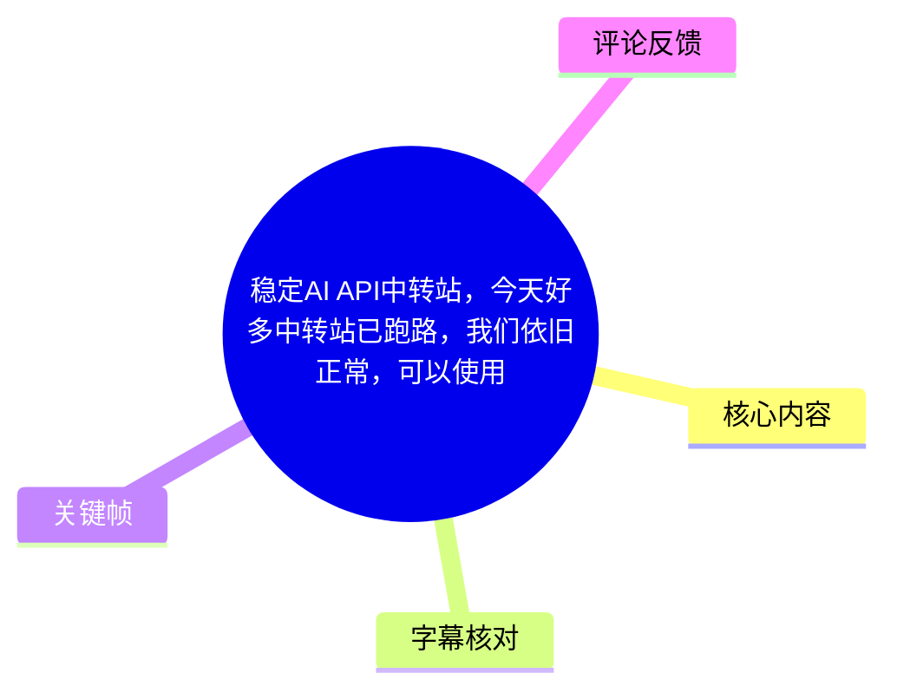
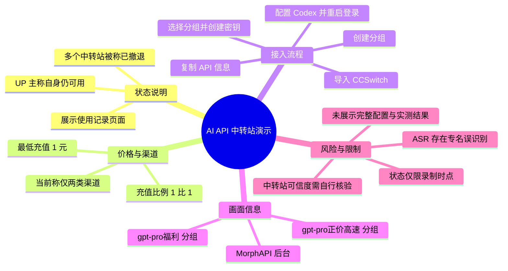
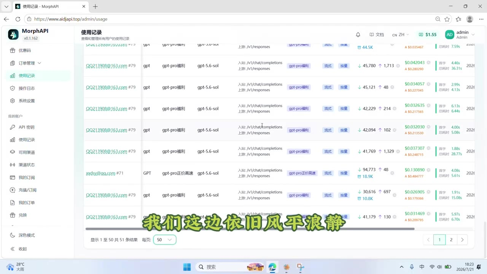
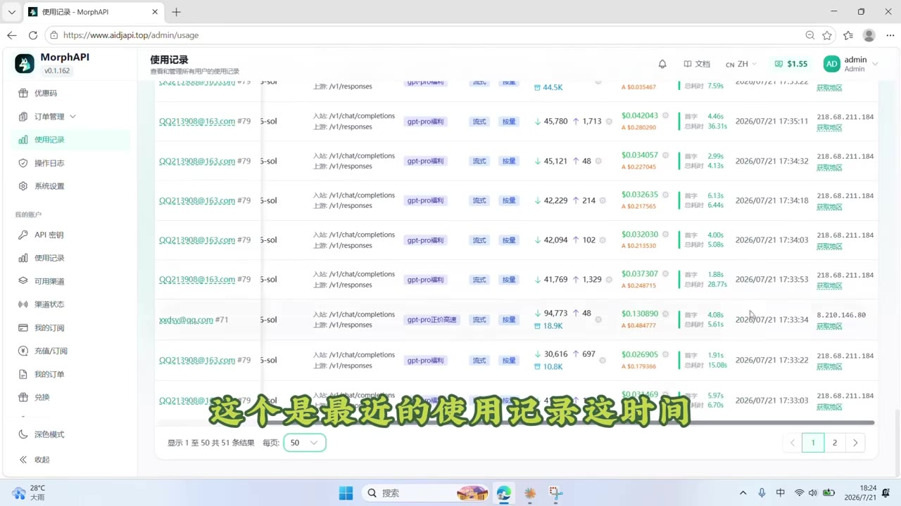
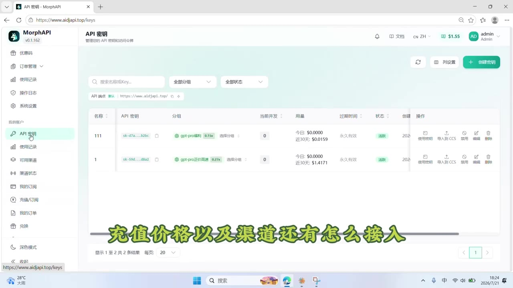

# 稳定AI API中转站，今天好多中转站已跑路，我们依旧正常，可以使用

> 来源：[Bilibili 视频](https://www.bilibili.com/video/BV11TKa6JEfE) 
> UP 主：尝试走向美好的未来｜发布时间：2026-07-21｜视频时长：76 秒｜合集：AIcode

## 小结

视频是一则关于 AI API 中转服务的状态与接入演示。UP 主称，在其录制时点，已有不少中转站“拉闸撤退”，而其展示的 MorphAPI 后台仍可正常调用，并以“使用记录”页面作为运行中的界面证据。

视频给出的充值规则是：**最低充值 1 元，充值比例为 1:1**。UP 主还称当前可用渠道只有两类；不过本次 ASR 对其中一个渠道名称识别不清，无法仅凭语音可靠确认其准确名称。画面可辨识到的分组包括 `gpt-pro福利` 与 `gpt-pro正价高速`。

接入流程面向已拥有该服务账户、并使用 CCSwitch 与 Codex 的用户：在 API 密钥页面创建分组、选择目标分组创建密钥、复制 API 信息并导入 CCSwitch，切换到对应分组后，再将复制的信息用于 Codex，重启并登录即可。视频没有展示完整字段、CCSwitch 的具体导入表单，也没有展示 Codex 的实际请求结果。

“稳定”“速度较快”“依旧正常”等均是 UP 主在录制当时的陈述，画面仅能说明后台曾展示使用记录和两条 API 密钥/分组记录，**不能据此证明服务的长期可用性、模型来源、资金安全性、隐私处理方式或 SLA**。中转服务状态、价格、渠道和域名均可能快速变化，实际使用前应自行小额测试并核验服务主体。

## 思维导图

## 目录

- [背景：服务仍可用的录制时点声明](#背景服务仍可用的录制时点声明)
- [使用记录与“稳定”主张](#使用记录与稳定主张)
- [充值价格、渠道与可见分组](#充值价格渠道与可见分组)
- [接入步骤：创建密钥并导入 CCSwitch](#接入步骤创建密钥并导入-ccswitch)
- [Codex 配置与视频结论](#codex-配置与视频结论)
- [关键帧索引](#关键帧索引)
- [结论与限制](#结论与限制)
- [字幕比对](#字幕比对)
- [评论分析](#评论分析)
- [处理记录](#处理记录)

## 背景：服务仍可用的录制时点声明 [00:00](https://www.bilibili.com/video/BV11TKa6JEfE?t=0)

视频开头，UP 主称“很多中转站目前已经拉闸撤退”，并表示自己一侧“依旧风平浪静”。这是对当时 API 中转服务市场状态的个人描述，而不是附有第三方统计、服务公告或故障数据的新闻报道。

这里需要区分两层信息：

1. **可由画面支持的部分**：后台存在“使用记录”列表，列表中能看到多条调用条目、模型/分组标签、请求量或耗时等界面字段。
2. **不能由短视频直接验证的部分**：其他中转站是否大规模停运、该站是否长期稳定、所有用户是否都可获得相同速度与可用性。

> 图：关键帧展示 MorphAPI 的“使用记录”页面，左侧含“API 密钥”“使用记录”“可用渠道”“渠道状态”等导航项，主区域列出多条调用记录。这是视频中“仍有使用记录”的主要画面依据，但它不等同于长期稳定性的独立证明。

## 使用记录与“稳定”主张 [00:14](https://www.bilibili.com/video/BV11TKa6JEfE?t=14)

在约 14.56 秒处，UP 主明确表示“现在也是可以正常使用的”。前段画面显示的是使用记录列表，其中可以看到：

- 后台产品标识为 **MorphAPI**，画面左上角可见版本号 `v0.1.162`；
- 调用记录中出现 `/v1/chat/completions` 与 `/v1/responses` 等接口路径；
- 部分行可见模型或分组标签，例如 `gpt-pro福利`、`gpt-pro正价高速`；
- 列表中显示了请求相关数值、耗时和时间信息，但视频未解释每一列的完整含义，也未给出统计口径。

> 图：关键帧继续展示使用记录中的多条调用行，可见请求时间、耗时及请求量相关字段。它的价值在于说明视频并非只展示静态首页，而是展示了后台调用历史；但无法从单帧确认这些请求是否全部成功、是否来自不同用户，或服务在录制后是否持续可用。

## 充值价格、渠道与可见分组 [00:17](https://www.bilibili.com/video/BV11TKa6JEfE?t=17)

UP 主从约 17.70 秒起说明充值价格、渠道和接入方式，语音中可可靠整理出的参数为：

| 项目 | 视频陈述 | 证据与备注 |
| --- | --- | --- |
| 最低充值金额 | 1 元 | ASR 识别为“最低是充……一块钱”；语义明确为最低充值 1 元。 |
| 充值比例 | 1:1 | UP 主直接说明“比例是一比一”。 |
| 可用渠道数量 | 当前只有两类 | UP 主称“目前是只有……和 GPT”；第一个渠道词 ASR 识别不清。 |
| 定价展示 | 模型整体定价“大家都可以看到” | 本次给出的关键帧未清晰呈现具体价格表，不能补写模型单价。 |
| 可见分组 | `gpt-pro福利`、`gpt-pro正价高速` | 可从 API 密钥页的分组标签识别。 |

需要特别注意：ASR 将渠道名称转写为“可录的”，但该词不能与画面或其他可靠文字互相印证。因此本文不把它擅自扩写为某个特定厂商、模型或渠道名称。

> 图：关键帧展示 MorphAPI 的“API 密钥”页面。列表中可见两个分组标签 `gpt-pro福利` 与 `gpt-pro正价高速`，状态显示为“活跃”，页面还提供“创建密钥”入口。这为视频后续的分组创建与密钥导入步骤提供了界面上下文。

## 接入步骤：创建密钥并导入 CCSwitch [00:31](https://www.bilibili.com/video/BV11TKa6JEfE?t=31)

视频中可整理出的实际操作顺序如下。由于视频未展示全部弹窗和字段名称，以下仅保留已出现的流程，不补造 URL、密钥内容或配置参数。

1. **进入 API 密钥页面**  
   UP 主在后台的“API 密钥”区域进行操作。画面顶部可见“创建密钥”按钮。

2. **创建一个分组**  
   在约 31 秒处，UP 主说“在这边创建一个分组，名字随便填一个”。  
   - 视频明确允许分组名称自行填写；
   - 未说明名称是否影响计费、限流、模型路由或权限。

3. **选择要使用的分组并创建**  
   约 47.08 秒处，UP 主说“然后选择你要用的分组，创建”。  
   - 这表示 API 密钥需要与目标分组关联；
   - 从画面可见的示例分组为 `gpt-pro福利` 和 `gpt-pro正价高速`；
   - 视频没有说明这两个分组的模型覆盖、价格差异、限速规则或适用场景。

4. **复制创建后的 API 信息**  
   约 52.23 秒处，UP 主说创建完成后复制“这个 API……”。本次 ASR 将后续词误识别为“APM 一样”，结合页面语境只能稳妥表述为：**复制创建后的 API 连接/密钥相关信息**。  
   不应在公开场景展示或传播真实 API Key。

5. **导入 CCSwitch**  
   UP 主明确提到将复制的信息“导入到 CCSwitch”。  
   视频没有展示 CCSwitch 的版本、具体导入入口、字段映射、服务地址格式、模型名称或请求测试，因此这些配置项须以 CCSwitch 与服务方最新文档为准。

### 安全操作建议

视频本身没有展开安全实践，但其步骤涉及 API 密钥，执行时至少应遵守以下边界：

- API Key 应仅保存在本地受信任的配置或密钥管理环境，避免放入截图、评论区、代码仓库或聊天记录；
- 为不同用途创建不同密钥/分组，便于停用、轮换与核查；
- 若导入工具支持自定义 Base URL、模型映射或请求日志，应先确认这些配置是否会把提示词或响应发送至第三方；
- 首次充值和调用宜采用小额、低敏感测试，记录实际计费、延迟、错误率与模型响应。

## Codex 配置与视频结论 [01:02](https://www.bilibili.com/video/BV11TKa6JEfE?t=62)

约 62.66 秒处，UP 主说明：使用此前复制的 API 信息“可以去 Codex”，随后“重启一下登录就行”。这给出了最后一段操作链路：

1. 在 CCSwitch 中完成导入后，切换到相应分组；
2. 将复制的 API 相关信息用于 Codex；
3. 重启 Codex；
4. 登录后使用。

约 68.88 秒处，UP 主总结称“目前的话这两个分组都是稳定且速度比较快的”。这是一项针对录制当时、两个分组的体验判断。视频没有提供：

- 连续运行时长；
- 成功率、P50/P95 延迟或并发能力；
- 高峰期表现；
- 模型可用清单；
- 计费明细或退款规则；
- 数据保留、隐私政策与服务等级协议；
- Codex 端实际成功对话或代码生成结果。

因此，合适的理解是：视频演示了一个可见的后台和一条声称可工作的接入路径，而非对服务质量或安全性的完整测评。

## 关键帧索引

| 关键帧 | 正文位置 | 画面价值 |
| --- | --- | --- |
|  | 开场状态说明 | 展示使用记录页和后台导航，支撑“UP 主以调用记录说明仍在使用”的描述。 |
|  | 使用记录与稳定主张 | 显示多行调用记录、接口路径、数值与耗时等信息，帮助读者理解视频所依据的“运行中”画面。 |
|  | 充值、分组与接入步骤 | 显示 API 密钥页、可见分组和创建入口，是理解“创建分组—创建密钥”流程的关键。 |

## 结论与限制 [01:08](https://www.bilibili.com/video/BV11TKa6JEfE?t=68)

这条视频的可迁移经验是：当 API 中转服务状态不确定时，至少应从后台使用记录、密钥/分组状态、实际请求测试三方面交叉检查；在工具侧，可通过分组化密钥管理将不同模型路线或使用场景分开配置。

但视频的信息边界也十分明确：

- **时效性强**：视频发布于 2026-07-21，服务可用状态、页面域名、渠道与价格会变化；
- **主观判断多**：“稳定”“快”“其他站已撤退”均为 UP 主说法，未提供独立验证材料；
- **参数不完整**：仅明确最低充值 1 元、比例 1:1；没有可核验的完整价格表；
- **专有名词存在转写不确定性**：第一个渠道名称无法可靠识别；
- **未见端到端验收**：视频未展示 CCSwitch 导入细节、Codex 实测输出或报错排查；
- **第三方中转风险未覆盖**：密钥、提示词、响应、支付和上游模型访问均可能涉及额外的安全、合规与连续性风险。

如果要采用类似方案，应把视频当作一个短时操作线索，而不是服务可靠性的保证；建议核验官方网站/公告、隐私与计费规则，并用不含敏感信息的小额请求完成独立测试。

## 字幕比对

| 字幕来源 | 完整性 | 专有名词 | 时间轴 | 主要问题 |
| --- | --- | --- | --- | --- |
| Bilibili 站内字幕 `p01-ai-zh.srt` | 与本视频内容严重不符 | 出现“同学聚会”“输入法”“算命”等无关内容 | 有真实 SRT 时间轴，但对应的显然是错误内容 | 不能用于本视频知识整理。 |
| 本次 ASR 字幕 | 覆盖 0.08–74.67 秒，诊断语音覆盖率 80.91% | `CCSwitch`、`Codex` 可由上下文确认；“可录的”“APM”“分绲”等存在误识别 | 有 9 段真实时间轴，可与视频时长 75.42 秒对应 | 长句未充分断句，部分渠道名、API 相关词和“分组”发生误转写。 |

### 最终字幕选择与校正原则

本文以**本次 ASR 的真实时间轴**作为章节链接依据，未采用站内字幕的内容。原因是站内 SRT 虽有时间戳，但文本与视频主题完全无关，属于不可用字幕。

本次 ASR 已实际检查，且诊断中**没有** `noAudioStream=true` 标记；音频时长为 75.418 秒，识别语言为中文，语言置信度为 0.9976。因此本视频并非无音轨素材。

依据关键帧、界面上下文和语音，对 ASR 仅作以下保守校正：

- `CCSwitch`：ASR 识别为 `CCSwitch`，与 UP 主所述工具名称一致；
- `Codex`：ASR 识别为 `Codex`，用于最后的配置步骤；
- `分绲`：按上下文统一表述为“分组”，不视为一个独立术语；
- `APM 一样`：无法得到可靠文字证据，不扩写为具体字段；正文仅称“API 连接/密钥相关信息”；
- `可录的`：无法从现有画面确认具体渠道名，保留为“一个名称未能可靠辨识的渠道”，不作猜测。

## 评论分析

以下仅处理可获取热评前三条。评论代表个人意见，不能视作对视频服务的已验证结论。

1. **故里你好（4 赞）**  
   评论认为，评论区若出现使用免费域名或二级域名的网站，可能缺乏可信度，并猜测其接入的是免费模型。  
   - 补充价值：提醒读者注意服务域名、部署方式与模型来源之间可能存在的信息不透明问题。  
   - 可信度边界：评论未提供具体网站、技术证据或模型调用记录；“接免费模型”只是猜测，不能据此认定。

2. **幻落余（1 赞）**  
   评论称“都是中转站广告”，将评论区内容理解为推广行为。  
   - 补充价值：指出视频及评论区可能存在商业推广动机，应避免把宣传语直接当成产品测评。  
   - 可信度边界：该评论是态度表达，没有指向本视频或某个服务的具体违规、收费或性能证据。

3. **墨浸方舟（1 赞）**  
   评论警告“低价广告都是骗子/灌水，没有人会给你送钱”。  
   - 补充价值：强调面对低价 API 服务时应防范欺诈、虚假宣传和异常优惠。  
   - 可信度边界：这是一条泛化风险提示，不足以证明视频中的服务存在欺诈。合理做法是小额验证、检查主体与条款、避免预存大额余额。

## 处理记录

- Worker ID：`worker-mrj0wbly-5dc4e50c`
- 整理模型：`gpt-5.6-terra`
- 素材与工具：视频元数据、关键帧提取结果、Bilibili 站内字幕 `p01-ai-zh.srt`、本次 ASR 的 `large-v3-turbo` 识别结果、热评抓取结果。
- ASR 检查结果：ASR 识别语言为中文，语言置信度 `0.99755859375`；音频时长 `75.4184375` 秒；共 9 段；语音覆盖率 `0.8091`；未标记 `noAudioStream=true`。
- 字幕选择：站内字幕内容与 AI API 中转主题完全不符，予以排除；采用本次 ASR 的起止时间作为时间轴依据，并结合关键帧对“分组”、`CCSwitch`、`Codex` 等上下文进行保守整理。无法确认的渠道名称和 API 字段未作臆测。
- 关键帧选择依据：选用 `frame-001.jpg` 与 `frame-002.jpg` 说明使用记录证据，选用 `frame-004.jpg` 说明 API 密钥、分组与创建入口；均直接服务于正文的状态主张和接入步骤。
- 评论处理范围：仅分析素材中可获取的热评前三条，未延伸至其他评论。
- 缓存清理：提供的素材未包含缓存清理命令或执行回执，无法确认是否已执行清理；本文不将其虚构为已完成。
- 未解决问题：视频未给出完整价格表、渠道准确名称、服务条款、模型来源、CCSwitch 配置字段及 Codex 实测结果；这些内容不能仅依据本素材确认。
