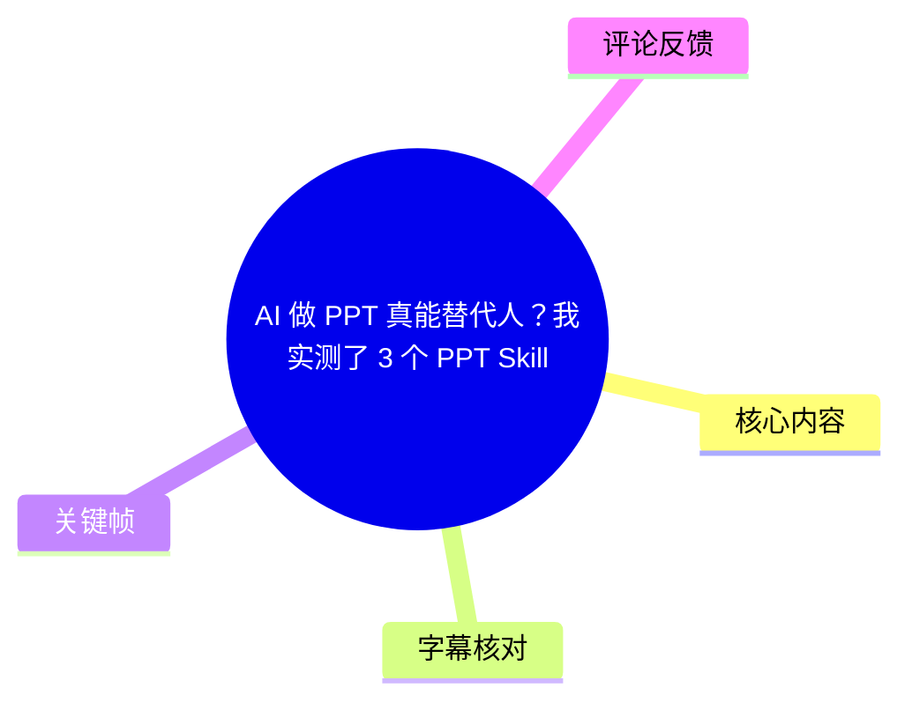
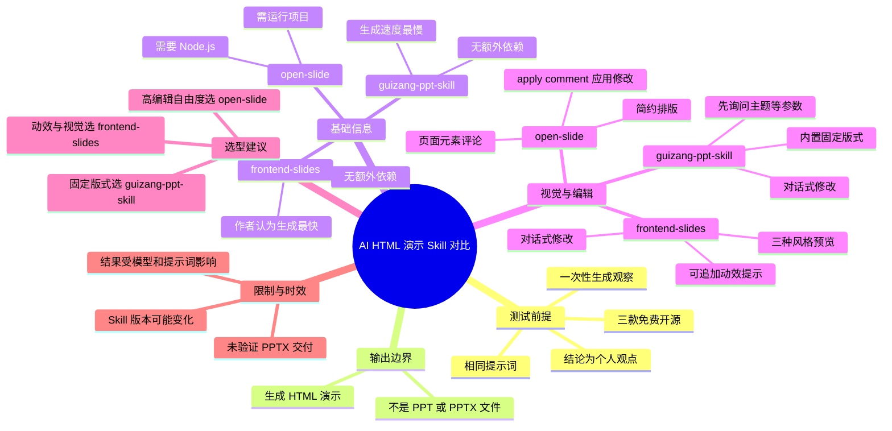
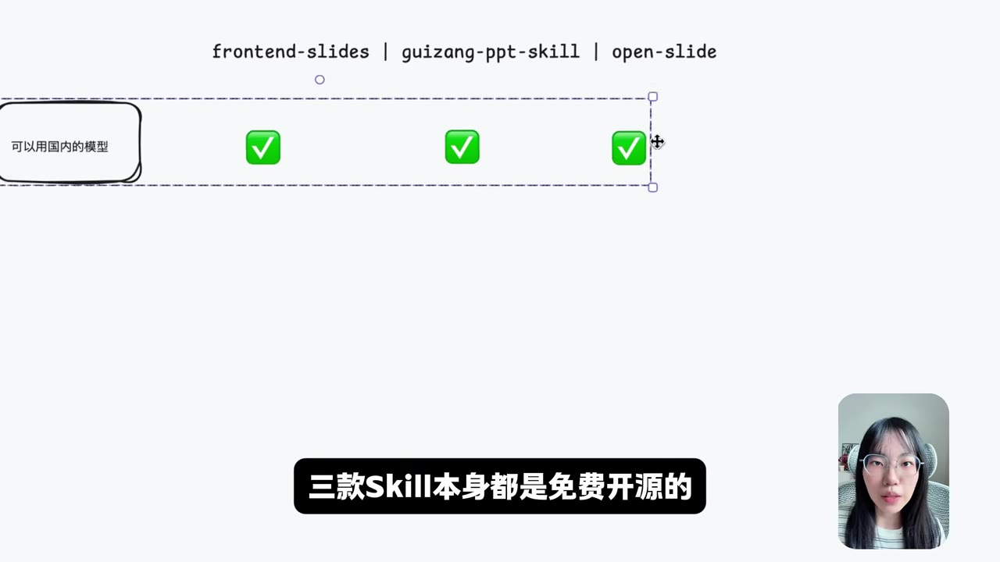
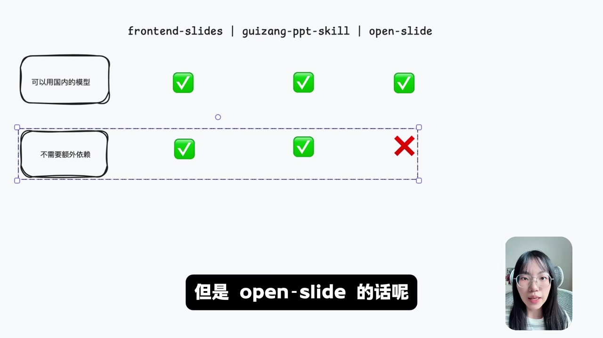
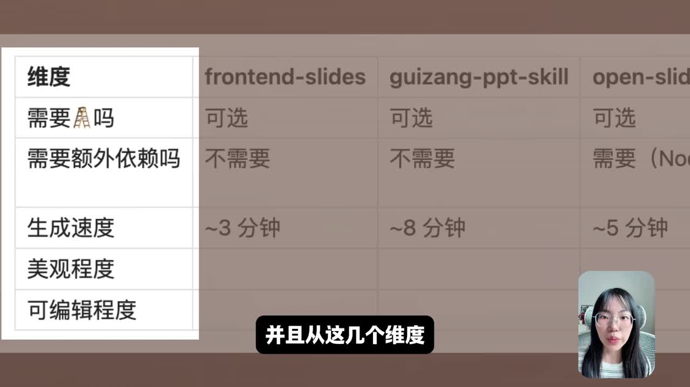

## 小结

这支视频以相同提示词，对比了 `frontend-slides`、`guizang-ppt-skill` 与 `open-slide` 三个免费开源的 AI 演示文稿 Skill，考察维度包括运行依赖、生成速度、美观度与可编辑性。作者明确说明：视频语境中的“PPT”实际是 **HTML 演示页面**，不是 PowerPoint 的 `.ppt`／`.pptx` 文件。

作者采用“一次性输入完全相同的提示词”的方式观察各工具结果，因此结论主要反映该次测试、所选模型和提示词条件下的体验，不是专业机构测评，也不能推出所有题材、所有模型或所有版本下的稳定排名。

基础条件方面，三款 Skill 均可接入国内模型；`frontend-slides` 与 `guizang-ppt-skill` 不需要额外依赖，`open-slide` 需要安装 Node.js 并将项目运行起来。视频给出的生成速度排序是：`frontend-slides` 最快，其次 `open-slide`，最后是归藏 PPT Skill；关键帧中展示的估计时间分别约为 3 分钟、5 分钟、8 分钟。

选型上，作者的建议很明确：需要在生成后进行较灵活的编辑，优先考虑 `open-slide`；看重酷炫动效和视觉呈现，选择 `frontend-slides`；接受固定版式并认可归藏 PPT Skill 的模板风格，则可选择 `guizang-ppt-skill`。

这并不意味着 AI 已能无条件“替代人”。视频没有验证 `.pptx` 导出、PowerPoint 原生编辑、跨浏览器兼容性、离线交付、事实准确性、复杂内容结构、长期维护成本等能力；对必须交付 Office 文件的场景，三者不能直接视作传统 PPT 制作的等价替代品。

## 思维导图

## 目录

- [视频信息与测试边界](#视频信息与测试边界)
- [基础信息：依赖、模型与速度](#基础信息依赖模型与速度)
- [frontend-slides：风格预览与动效](#frontend-slides风格预览与动效)
- [guizang-ppt-skill：参数询问与固定版式](#guizang-ppt-skill参数询问与固定版式)
- [open-slide：浏览器评论式修改](#open-slide浏览器评论式修改)
- [选型结论、限制与时效性](#选型结论限制与时效性)
- [字幕比对](#字幕比对)
- [评论分析](#评论分析)
- [处理记录](#处理记录)

# AI 做 PPT 真能替代人？我实测了 3 个 PPT Skill

> 来源：[Bilibili 视频](https://www.bilibili.com/video/BV1nv5x6LEtr)  
> UP 主：柚子柚子L12138  
> 视频时长：02:18（138 秒）｜分辨率：2560 × 1440｜合集：AIcode  
> 发布时间：2026-05-11（按提供的 `pubdate` Unix 时间戳换算）  
> 本文中的工具名以站内字幕、ASR 与画面中的英文拼写交叉校正为准。

## 视频信息与测试边界 [00:00](https://www.bilibili.com/video/BV1nv5x6LEtr?t=0)

视频开头提出的问题是：AI 制作“PPT”能否替代人工。作者选择以下三个 Skill 进行横向比较：

1. `frontend-slides`
2. `guizang-ppt-skill`
3. `open-slide`

作者称将从多个维度拆解对比，并在开场先给出一个决定理解全片的重要前提：**这三个 Skill 都不生成 PPT 文件，展示结果为 HTML。**

> 图：画面以红色叉号标记 “PPT”、以勾选标记 “HTML”。该关键帧直接界定了评测对象：作者在比较的是 HTML 演示页生成能力，而不是 `.pptx` 文件生成或 PowerPoint 原生编辑能力。

### 测试方法与结论适用范围 [00:15](https://www.bilibili.com/video/BV1nv5x6LEtr?t=15)

作者采用的测试方法是：

1. 对三个 Skill 输入**完全一模一样的提示词**。
2. 观察每个 Skill 一次性生成的结果。
3. 从依赖、速度、视觉表现和编辑方式等维度进行比较。

这种方法控制了提示词变量，便于观察同一任务在不同 Skill 下的即时输出差异。但视频同时说明，测评仅代表作者个人观点，且并非专业测评机构的结论。

因此，以下因素均未在视频中获得系统验证：

- 多轮修改后的质量是否稳定；
- 不同模型、不同上下文长度下的表现；
- 不同主题、专业领域或长篇内容的适应性；
- 生成内容的事实正确性与引用可靠性；
- 是否能导出或转换为 `.pptx`；
- 团队协作、版本管理、离线展示和交付兼容性。

## 基础信息：依赖、模型与速度 [00:26](https://www.bilibili.com/video/BV1nv5x6LEtr?t=26)

作者介绍，三款 Skill 本身均为免费开源工具；若接入国内模型，可以直接使用，不需要“梯子”。画面中的对比表还以勾选形式呈现三款工具均可使用国内模型。

> 图：比较表顶部列出 `frontend-slides`、`guizang-ppt-skill`、`open-slide`，在“可以用国内的模型”一行均显示勾选。这为视频关于三者模型接入条件的陈述提供了画面佐证。

### 依赖与启动成本 [00:32](https://www.bilibili.com/video/BV1nv5x6LEtr?t=32)

| 工具 | 视频中的依赖结论 | 使用含义 |
| --- | --- | --- |
| `frontend-slides` | 不需要额外依赖 | 作者认为可直接使用。 |
| `guizang-ppt-skill` | 不需要额外依赖 | 作者认为可直接使用。 |
| `open-slide` | 需要 Node.js | 需要先安装 Node.js，并将项目运行起来，因此有额外使用成本。 |

> 图：对比表的“需要额外依赖吗”一行中，前两项为勾选，`open-slide` 为红叉；结合同期口播，红叉对应“不能不依赖”，即需安装 Node.js。这张图有助于区分“工具能力”与“上手门槛”。

视频没有提供 Node.js 的具体版本、安装命令、部署系统要求、端口配置或项目仓库地址，因此不能据此补全实际安装步骤。

### 生成速度 [00:42](https://www.bilibili.com/video/BV1nv5x6LEtr?t=42)

作者给出的主观速度排序如下：

| 排名 | 工具 | 画面展示的约计生成时间 | 作者判断 |
| --- | --- | ---: | --- |
| 1 | `frontend-slides` | 约 3 分钟 | 最快 |
| 2 | `open-slide` | 约 5 分钟 | 次之 |
| 3 | `guizang-ppt-skill` | 约 8 分钟 | 最后 |

> 图：画面表格列出了约 3 分钟、约 8 分钟、约 5 分钟三个时长，对应 `frontend-slides`、`guizang-ppt-skill`、`open-slide`。它是视频内唯一明确展示速度参数的关键画面。

这些时间是作者该次测试中的近似值，而不是工具承诺的 SLA 或基准测试数据。实际耗时仍可能受到模型响应、网络、提示词复杂度、生成页数、图像资源请求与本地运行环境影响。

## frontend-slides：风格预览与动效 [00:53](https://www.bilibili.com/video/BV1nv5x6LEtr?t=53)

作者首先展示 `frontend-slides`。其体验特点是：生成前会先给出 **3 个视觉风格预览页**，让用户从中挑选。作者认为，这让用户能在正式生成前大致看到整体风格，体验较好。

作者选定一种风格后，第一版输出**没有动画**。随后，作者额外补充提示词，要求工具加入一些动效；最终得到的效果包括：

- 粒子背景；
- 由滚动触发的入场动画；
- 作者主观认为较好的配色与字体表现。

### 编辑方式与边界 [01:14](https://www.bilibili.com/video/BV1nv5x6LEtr?t=74)

对于已生成页面的调整，`frontend-slides` 仍需通过与 AI 对话来提出修改需求。视频没有展示直接拖拽元素、可视化属性面板、逐页时间轴动画编辑或源代码编辑等功能，因此不能将“可通过对话修改”等同于传统 PPT 软件中的自由对象编辑。

适合的需求画像是：

- 希望先比较数种视觉方向；
- 更重视视觉氛围、字体和配色；
- 可接受通过自然语言持续迭代；
- 有 HTML 演示页而非 `.pptx` 的交付条件。

## guizang-ppt-skill：参数询问与固定版式 [01:21](https://www.bilibili.com/video/BV1nv5x6LEtr?t=81)

作者介绍，`guizang-ppt-skill` 会先询问一组内容与设计参数，包括：

1. 主题；
2. 风格；
3. 受众；
4. 使用场景；
5. 页数；
6. 主题色。

这种流程的特点是，在生成前先补齐演示文稿的基本约束，而不是只直接输出页面。作者展示的结果颜色搭配偏跳脱，但也明确指出，这可能与其自身的选择有关，不能完全归因于工具本身。

### 固定版式与修改路径 [01:33](https://www.bilibili.com/video/BV1nv5x6LEtr?t=93)

作者认为该工具会内置好固定的版式设计。对于后续编辑，仍然需要用户通过与 AI 对话提出修改。

这意味着它更适合以下情况：

- 先明确主题、目标受众、场景、页数和主色；
- 希望借助预设版式快速形成结构；
- 接受一定模板化或固定版式约束；
- 认可工具已有的视觉设计风格。

视频未展示其版式库的数量、模板可自定义程度、页面元素是否可直接选中编辑，以及能否导出原生 Office 文件。

## open-slide：浏览器评论式修改 [01:39](https://www.bilibili.com/video/BV1nv5x6LEtr?t=99)

作者对 `open-slide` 的总体评价是“简约大气”，并认为其排版相对不错。与前两者的主要区别在于其修改工作流。

### 可编辑性工作流 [01:45](https://www.bilibili.com/video/BV1nv5x6LEtr?t=105)

视频展示的编辑步骤为：

1. 在浏览器中选中需要调整的对应元素。
2. 对该元素添加评论。
3. 回到 AI 对话框。
4. 输入 `apply comment` 指令。
5. 等待一段时间。
6. 刷新页面。
7. 查看评论对应的修改是否已应用。

作者表示，刷新后可以看到修改应用成功，并认为该工作流十分顺畅；在三款工具中，`open-slide` 的可编辑性比另外两个更高。

这里的“评论”是对浏览器页面元素的批注式修改入口，不应误写为“做评论内容”。`apply comment` 是视频中出现的英文指令，建议按原样输入。

### 为什么作者认为其编辑自由度更高

相较于单纯在对话框中描述“请修改某处”，页面内先选中元素再添加评论，能够把修改对象与修改意图关联起来。视频中的结论是：这使 `open-slide` 的编辑工作流更顺畅、可编辑性相对更高。

但视频没有测试下列能力，故不能延伸为已证实结论：

- 对多个元素批量修改的成功率；
- 评论冲突或重复应用的处理；
- 修改失败时的回滚机制；
- 编辑后布局、动画与响应式样式是否稳定；
- 以多人协作方式处理评论的能力。

## 选型结论、限制与时效性 [02:01](https://www.bilibili.com/video/BV1nv5x6LEtr?t=121)

作者在结尾给出的选择建议可整理为：

| 主要诉求 | 作者建议 | 视频依据 |
| --- | --- | --- |
| 生成后仍要编辑，且希望自由度高 | `open-slide` | 可在浏览器选择元素、评论，再通过 `apply comment` 应用修改。 |
| 希望有酷炫动效和视觉效果 | `frontend-slides` | 有三种风格预览；补充动效提示词后，出现粒子背景和滚动入场动画。 |
| 希望采用固定版式设计，且认可其版式风格 | `guizang-ppt-skill` | 生成前询问主题、场景、页数、主题色等；内置固定版式。 |

### 对“替代人”的审慎回答

按照视频可确认的信息，AI Skill 可以替代一部分**初稿生成、风格探索、网页演示排版和对话式迭代**工作，但不能据此得出“完全替代人工 PPT 制作”的结论。原因包括：

- 输出是 HTML，而非 PowerPoint 文件；
- 页面内容、结论与数据仍需人工核对；
- 视觉审美、品牌规范和复杂叙事结构仍受提示词与工具能力限制；
- `open-slide` 的本地依赖会带来启动与维护成本；
- 作者仅做了同提示词下的一次性比较；
- 视频未评测企业交付常见的 `.pptx`、模板兼容和 Office 编辑流程。

### 时效性说明

本视频发布于 2026-05-11，素材抓取于 2026-07-16。AI Skill、模型接入方式、依赖版本、默认模板和生成速度可能在后续版本中发生变化。尤其是“免费开源”“无需额外依赖”“速度约为几分钟”等信息，应理解为视频发布与测试时的陈述；实际使用前应以各项目当前文档、许可证与安装说明为准。

## 字幕比对

| 字幕来源 | 完整性 | 专有名词 | 时间轴 | 主要问题 |
| --- | --- | --- | --- | --- |
| Bilibili 站内字幕 | 覆盖 00:00.080 至 02:17.240，分段细，基本完整 | 较可靠，出现 `open slide`、`apply comment` 等；`frontend-slides` 在字幕中有音译或拼写混杂 | 逐句时间轴，可直接作为正文链接依据 | 个别词错写，如“动向”应结合语境理解为“动效”；“评论”实际是对页面元素添加 comment。 |
| 本次 ASR 字幕 | 诊断显示覆盖 24.52 至 137.22 秒，语音覆盖率 82.11% | 多处误识别较明显，如 `封Nslice`、`PhoneSlide`、`规钻PPT`、`Note.js` | 虽有时间戳，但首段把大量内容压缩进 24.52—25.30 秒，不能可靠支撑细粒度定位 | 首段时间异常，且专有名词、断句和“动效／评论／可编辑”等词存在误识别。 |

### 最终字幕选择

正文以**站内 SRT**作为时间轴的主要依据：其从 00:00 开始，逐句分段，时间定位符合视频总时长。与此同时，已检查本次 ASR 结果；ASR 诊断中**没有** `noAudioStream=true` 标记，且识别到中文语音，因此不能将 ASR 的问题归因于视频无音轨。

术语校正采用“站内字幕 + ASR 上下文 + 关键帧英文拼写”交叉判断：

- `frontend-slides`：关键帧表头显示该拼写；ASR 的“封Nslice”“封Sline”“PhoneSlide”等为误识别。
- `guizang-ppt-skill`：关键帧表头显示该拼写；ASR 的“归葬”“规钻”等为误识别。
- `open-slide`：关键帧表头显示该拼写；字幕中的 “open slide” 统一为带连字符的项目写法。
- `Node.js`：站内字幕为 “node js”，ASR 出现 “Note.js”；正文按通用技术名称写作 `Node.js`。
- `apply comment`：站内字幕明确给出该英文指令，正文保留原文。
- “动向”：站内字幕与 ASR 均有近音误识别；结合同句“粒子背景以及滚动触发的入场动画”，正文统一表述为“动效”。

## 评论分析

仅处理可获取的热评前三条，以下均为观众观点，不作为已经核验的工具事实。

1. **petergorww（6 赞）**：  
   评论建议作者尝试较热门的 `ppt-master`。这说明观众认为本次三工具范围不够全面，并提出了可扩展的对比对象。但评论未提供 `ppt-master` 的版本、功能证据或测试数据，不能据此认定其优劣。

2. **Wievondii（2 赞）**：  
   评论质疑“HTML 是否应被称作 PPT”，并称 `ppt-master` 生成 `.pptx` 才属于 PPT。该观点与视频中“输出为 HTML，而非 PPT 文件”的边界高度相关，提醒读者区分“演示页面”与“PowerPoint 原生文件”。不过“只有 `.pptx` 才是 PPT”属于评论者的术语立场，不是视频已验证的行业标准。

3. **MeloNLin（0 赞）**：  
   评论为对 UP 主的鼓励，没有提供关于工具功能、性能、技术限制或对比方法的新增信息。

## 处理记录

- Worker ID：`worker-mrj0wbly-5dc4e50c`
- 模型：`gpt-5.6-terra`
- 使用素材与工具结果：视频元数据、站内字幕 `p01-ai-zh.srt`、本次 ASR 输出 `asr/transcript.srt` 与 `asr/asr-result.json`、关键帧目录 `frames/`、热评数据 `comments/comments.json`。
- ASR 检查结果：识别语言为中文，语言置信度 `0.9990234375`；时长诊断为 `137.2531875` 秒；未提供 `noAudioStream=true` 标记，说明本源视频存在可识别音轨。
- 字幕选择：以站内 SRT 的逐句真实时间段作为正文时间轴依据；ASR 用于复核语音存在与语义，但因首段时间压缩、专有名词误识别较多，未作为细粒度时间轴主来源。
- 关键帧选择依据：`frame-002.jpg` 用于验证 HTML 而非 PPT 的输出边界；`frame-003.jpg` 用于验证三工具均可使用国内模型；`frame-004.jpg` 用于验证 `open-slide` 的额外依赖差异；`frame-001.jpg` 用于记录画面展示的生成时间参数。
- 缓存清理：提供的素材中没有缓存清理命令、执行日志或清理结果；本文未将缓存清理表述为已执行。
- 未解决问题：素材未提供三个 Skill 的仓库地址、版本号、完整提示词、模型名称、实际运行环境、导出能力及完整关键帧时间戳；因此未对这些内容作出推断。
