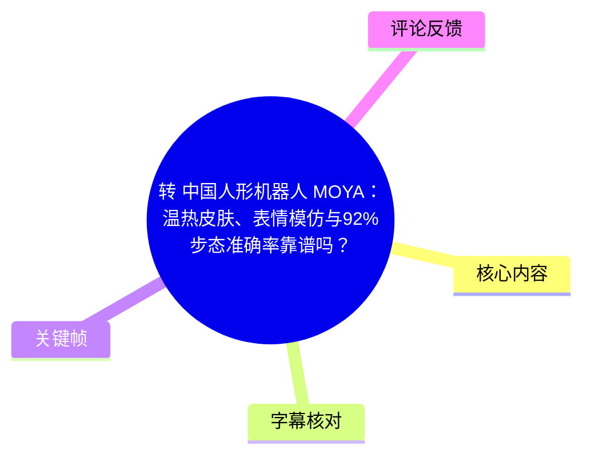
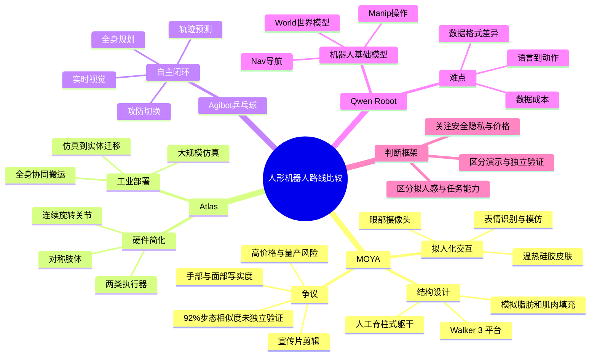
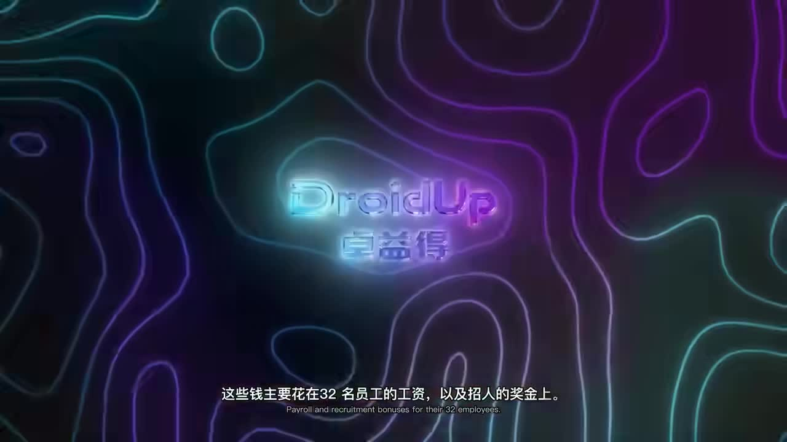
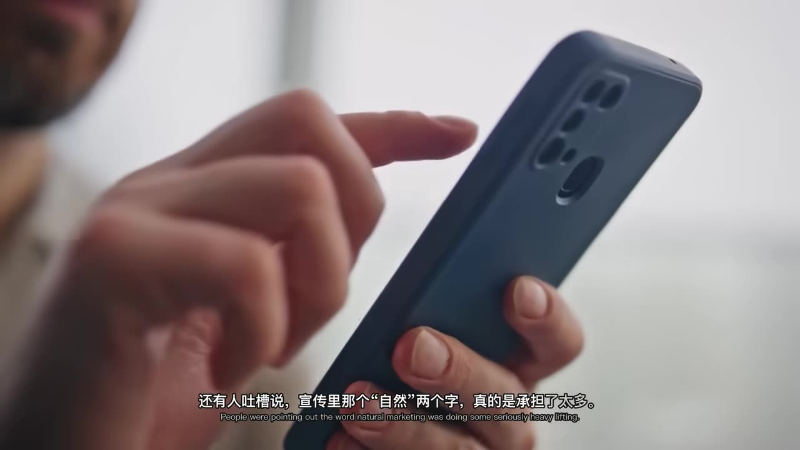
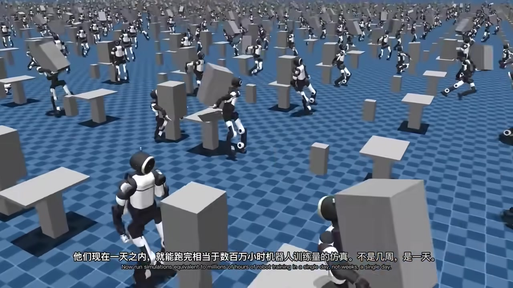
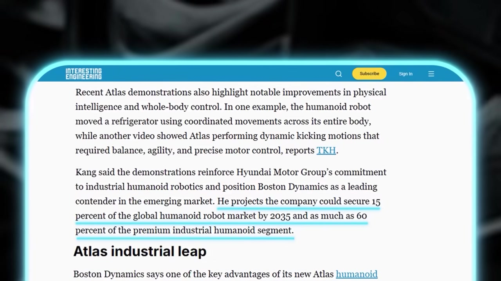

# [中国人形机器人 MOYA：温热皮肤、表情模仿与92%步态准确率靠谱吗？](https://www.bilibili.com/video/BV13r7K6nEaS?t=0)

> 来源：[Bilibili 视频](https://www.bilibili.com/video/BV13r7K6nEaS) 
> UP 主：AI_Express｜视频总时长：27:30（含“中配版”“原声版”两个各约 13:45 的分 P） 
> 本文时间轴对应本次 ASR 覆盖的约 13:45 音轨版本。

## 小结

视频以 MOYA 为切入点，梳理近期人形机器人从“拟人化展示”走向“任务执行、运动控制与机器人基础模型”的几条路线。MOYA 的核心卖点不在速度或续航，而是通过温热硅胶皮肤、模拟脂肪与肌肉的填充层、人工脊柱式躯干、眼部摄像头和表情模仿，制造更接近真人的互动感。

对“92% 人类自然步态相似度”，视频给出的关键判断很明确：这是 DroidUp 自行宣称的数据，**尚未经过独立验证**。宣传片存在剪辑、手部与面部写实度有限、价格高达 17.3 万美元等问题，因此不能仅凭演示视频推断其真实操作能力、可靠性或商业可行性。

作为对照，视频把 Boston Dynamics Atlas 放在工业能力维度考察：重点是大规模仿真、仿真到实体迁移、简化执行器类型、全身协同搬运和跌倒恢复等能力。该路线的衡量标准更偏向任务成功、控制稳定性和可维护性，而非外观拟人。

视频还提到 Agibot 的全自主乒乓球、面向公共场所的儿童友好机器人 Cody，以及阿里巴巴 Qwen Robot 对导航、操作和世界模型的拆分。它们共同说明：具身智能的关键难题是把语言与视觉理解可靠地接到行动控制上，且需要高质量、低成本、格式一致的机器人数据。

适合希望区分“拟人外观”“运动控制”“自主任务执行”“机器人基础模型”四类能力的读者。本文只整理视频与所给素材中的陈述；涉及融资、市场份额、性能指标、量产计划与公司宣传的内容均具有新闻时效性，应以原始公司公告、独立测试和后续产品资料复核。

## 思维导图

## 目录

- [视频范围、时效性与判断方法](#视频范围时效性与判断方法)
- [MOYA：拟人化交互设计与公开参数](#moya拟人化交互设计与公开参数)
- [92% 步态准确率与商业化争议](#92-步态准确率与商业化争议)
- [Atlas：面向工业任务的仿真与全身控制](#atlas面向工业任务的仿真与全身控制)
- [Agibot：自主乒乓球作为闭环控制测试](#agibot自主乒乓球作为闭环控制测试)
- [Cody：公共服务型机器人的另一条路线](#cody公共服务型机器人的另一条路线)
- [Qwen Robot：连接理解、导航与操作](#qwen-robot连接理解导航与操作)
- [可迁移的观察步骤与结论](#可迁移的观察步骤与结论)
- [字幕比对](#字幕比对)
- [评论分析](#评论分析)
- [处理记录](#处理记录)

## [视频范围、时效性与判断方法](https://www.bilibili.com/video/BV13r7K6nEaS?t=0)

视频在开头快速列出四条不同方向：MOYA 的拟人交互、Atlas 的工业搬运、Agibot 的自主乒乓球，以及阿里巴巴的机器人模型。其叙事重点不是发布单一产品评测，而是比较人形机器人如何从外观展示延伸到导航、交互和现实任务执行。

需要注意以下范围限制：

1. **视频是新闻解读与演示汇编，不是独立实验报告。**其中不少指标来自厂商、分析师、媒体报道或评论区观点。
2. **“今年晚些时候”“近期”“到 2035 年”等表述以视频发布时点为准。**视频元数据发布时间为 2026 年 6 月，后续融资、量产、产品版本、模型开放情况都可能变化。
3. 视频总时长为 1650 秒，但素材中的本次 ASR 音频时长为约 824.7 秒，内容与第二个分 P“原声版”时长相符；故正文时间轴均按这段有效 ASR 的真实起止时间定位。
4. 站内提供的 `p02-ai-zh.srt` 内容却是京都旅行与怀石料理，与本视频主题完全不符，不能作为事实来源或时间定位依据。

## [MOYA：拟人化交互设计与公开参数](https://www.bilibili.com/video/BV13r7K6nEaS?t=25)

### [公司背景、平台与基础规格](https://www.bilibili.com/video/BV13r7K6nEaS?t=49)

视频称，DroidUp（ASR 对公司英文名存在识别波动；视频描述中称其为上海初创公司 Droid Up）成立约两年，累计融资约 2850 万美元；其中相当一部分已用于约 32 名员工的工资与招聘奖金。视频进一步转述，有分析认为其可自由投入研发的资金可能低于 1500 万美元。上述均为视频转述，未在素材中附独立财务文件，不应视作审计结论。

MOYA 的公开视频参数包括：

| 项目 | 视频陈述 |
| --- | --- |
| 身高 | 约 5.5 英尺 |
| 重量 | 约 70 磅 |
| 底层平台 | Walker 3 平台 |
| 产品定位 | 优先增强面对面互动中的“真人感”，非速度或续航 |
| 价格 | 17.3 万美元 |
| 首批量产目标 | 约 50 台 |
| 拟定应用 | 医院、养老机构、银行、博物馆、火车站等接待、指引、陪伴场景 |
| 可定制性 | 可按需求调整外观 |

视频称，同一骨架曾帮助 DroidUp 的早期机器人在某项人形比赛中取得第三名；但 ASR 对赛事名称识别不清，给定素材中没有可用于核验的赛事原文，因此不扩展解释。

> 图：画面显示 DroidUp 标识与“32 名员工薪酬及招聘奖金”的字幕信息。它有助于理解视频并未只讨论机器人外观，也将团队规模、现金消耗与研发资源作为判断商业化可信度的背景变量。

### [眼部感知、表情模仿与温热触感](https://www.bilibili.com/video/BV13r7K6nEaS?t=92)

视频对 MOYA 的技术描述可以拆成四层：

1. **视觉输入**：每只眼睛后设有摄像头。视频称它不只追踪动作，还会识别人脸和表情。
2. **社交输出**：根据识别结果，MOYA 可做微笑、点头、眯眼等表情与动作回应，意图是营造“正在倾听”的互动反馈。
3. **软组织模拟**：硅胶皮肤下加入模拟人体脂肪和肌肉的填充层，内部还有类似肋骨的结构。
4. **触觉与结构**：皮肤被描述为温热，温度约 **90–97°F**；躯干围绕人工脊柱设计，以便在受力时产生类似人的扭转与弯曲。

其中，90–97°F 约合 32.2–36.1°C。视频的判断是：这种温度与软组织填充让触碰体验不再接近冰冷塑料，从而显著强化“拟人感”，也可能引发部分观众的不适感或“恐怖谷”反应。

这里必须区分两件事：**具备表情识别与模仿，不等于理解人的情绪、意图或能够可靠完成照护决策；皮肤温度接近人体，也不等于具备医疗或护理安全能力。**视频未给出识别准确率、响应延迟、触觉安全阈值、续航、自由度、载荷或故障处理数据。

### [线下互动与场景承诺](https://www.bilibili.com/video/BV13r7K6nEaS?t=239)

视频提到数月前存在 MOYA 的线下活动视频：真实观众可走近、触碰并直接互动。作者认为，这类非固定剧本下的现场反应，比精修宣传片更有参考价值。

在养老护理演示中，MOYA 曾向一位老人倒橙汁。视频将其与养老机构场景关联，但这一片段只能说明演示中出现过该动作，**不能证明其已经具备无人值守照护、液体操作长期稳定性、跌倒安全、卫生管理或医疗合规能力**。

## [92% 步态准确率与商业化争议](https://www.bilibili.com/video/BV13r7K6nEaS?t=162)

### [“92% 相似度”具体意味着什么](https://www.bilibili.com/video/BV13r7K6nEaS?t=162)

DroidUp 宣称 MOYA 与人类自然步态的相似度达到 **92%**。视频同时强调：这是厂商自己的数据，**尚未有独立验证**。

这项表述存在素材内无法解决的关键空白：

- 没有说明“相似度”的数学定义：是关节轨迹、步频、足底压力、姿态、视觉观感，还是主观评分；
- 没有说明样本量、人类参照人群、行走速度、地面材质和测试距离；
- 没有对照基线，例如与其他人形机器人或不同控制器相比的差异；
- 没有披露误差范围、失败率、转弯/起停/受扰动表现与重复测试结果。

因此，视频只能支持“公开视频中其走路的机械感较弱、动作较谨慎”这一观察；无法支持“92% 已被科学验证”或“其步态已达到人类水平”的结论。

### [舆论质疑：剪辑、写实度与资金](https://www.bilibili.com/video/BV13r7K6nEaS?t=186)

视频转述 Reddit 社区对“自然步态”说法的调侃，有高赞评论将其称为“自然老年步态”；也有人认为宣传中“自然”一词被过度使用。这些是网友主观评价，不构成性能测试。

视频还归纳了几类实质性疑问：

- **宣传片剪辑**：倒茶片段疑似经过剪辑，可能遮蔽动作是否连续完成、是否依赖人工介入等信息。
- **手部能力**：有人认为手看起来像“木棍”，意味着精细操作能力与外观呈现仍可能受限。
- **面部写实度**：部分评测评论认为脸部仅具有限度的写实感，五官和表情仍显僵硬。
- **资金与经营风险**：团队小、资金有限、投资方估值不高等因素，可能影响长期研发和量产兑现。
- **价格与价值匹配**：17.3 万美元的高价要求产品在可靠性、部署、维护、功能与安全上提供足够价值，但视频没有给出完整 TCO（总拥有成本）或客户复购数据。

> 图：画面字幕为“宣传里那个‘自然’两个字，真的是承担了太多”。它对应视频对步态营销话术的质疑，提醒读者将视觉观感与可重复、可量化的运动能力分开评估。

## [Atlas：面向工业任务的仿真与全身控制](https://www.bilibili.com/video/BV13r7K6nEaS?t=288)

### [仿真、迁移与外部合作](https://www.bilibili.com/video/BV13r7K6nEaS?t=312)

视频将 Boston Dynamics 的 Atlas 归为“可信度完全不同”的路线：强调可部署的工业自主能力，而非人类外观。视频转述称，Boston Dynamics 可在一天内运行相当于数百万小时机器人训练量的仿真，并可在约一小时内把仿真中获得的技能迁移到实体 Atlas。

其开发模式可概括为：

1. 在大规模虚拟环境中并行生成不同任务、载荷、姿态和扰动；
2. 在仿真中学习或筛选控制策略；
3. 将策略迁移到实体机器人；
4. 通过实体演示检验搬运、平衡、恢复等综合能力；
5. 再将结果反馈至仿真与硬件设计。

视频称，Google DeepMind 提供 AI 与学习系统方向的合作，英伟达提供高性能计算与大规模仿真能力。该表述说明 Atlas 的进展并非只依赖单一机器人本体，而是算力、仿真、学习算法和机械设计共同作用的结果。

> 图：画面中大量机器人在仿真环境内并行执行不同搬运和移动动作，字幕强调“一天内”可完成相当于数百万小时机器人训练量的仿真。该图直观说明工业路线的重点在于高吞吐训练与策略覆盖，而非单次演示的拟人程度。

### [硬件简化与搬运任务](https://www.bilibili.com/video/BV13r7K6nEaS?t=359)

视频强调 Atlas 的硬件设计会直接影响仿真与控制难度：

- 全身使用两类执行器，降低包含大量不同执行器时的建模复杂度；
- 手臂与腿部采用对称设计，有利于简化控制与仿真；
- 取消跨关节走线，使关节可连续旋转；
- 预期效果是降低维护成本、提高运动灵活性。

在搬运演示中，Atlas 搬动超过 **100 磅** 的冰箱；视频称其训练时接触的负载只有 **50–70 磅**。这被用来说明任务不只是“看见物体后抓取”，还要求：

- 预判物体重量；
- 根据重量变化调节发力；
- 在移动中维持全身平衡；
- 让视觉、姿态、关节控制和接触力协调工作。

视频还将 Atlas 的倒立、后空翻与工业能力联系起来：高难动作可以训练平衡、敏捷性、打滑后的恢复能力和耐力。但“能后空翻”本身不自动推出“能够稳定投入工厂”；工厂部署仍需看作业节拍、失败恢复、安全隔离、维护周期和成本等指标。

### [市场预测的边界](https://www.bilibili.com/video/BV13r7K6nEaS?t=437)

视频转述 KB Securities 分析师预测：到 **2035 年**，Boston Dynamics 或可获得全球人形机器人市场 **15%** 份额，并在高端工业人形机器人细分市场达到 **60%**。关键帧展示的是相关英文报道页面与高亮段落。

> 图：画面高亮“2035 年全球人形机器人市场 15%”及“高端工业细分市场 60%”的预测。这是分析师预测而不是已实现数据，图片的价值在于标示该数字的来源类型，避免误读为公司已获得的实际份额。

## [Agibot：自主乒乓球作为闭环控制测试](https://www.bilibili.com/video/BV13r7K6nEaS?t=461)

视频称，Agibot 的全尺寸双足人形机器人 **A3** 完成了一场全自主乒乓球比赛：没有遥控、没有预设脚本、过程中没有人类介入。ASR 对产品名存在明显误识别，本文按视频描述和元数据中的“Agibot”保留公司名称；未经额外原始资料核验，不补充型号全称。

乒乓球对机器人难在实时闭环：

1. 球速可超过 **5 m/s**；
2. 旋转、轨迹和落点可迅速变化；
3. 机器人必须实时看球、预测轨迹；
4. 需要规划全身动作，而不是仅摆动单臂；
5. 要精确击球，并在进攻和防守之间连续切换。

视频称该成果来自 Agibot 与北京大学张申刚团队合作；核心算法名为 **SPIKE PING PONG**，被描述为面向人形机器人的乒乓球运动控制算法。系统还配合黄大中教授开发的 **20 kHz 高频脉冲相机**，视频称视觉响应速度可达传统相机方案的十倍，并能以毫米级精度预测球拍应在哪里击球。

这些信息展示的是“感知—预测—规划—控制”的闭环能力。相较 MOYA，乒乓球路线对实时性和运动控制要求更高；但乒乓球单项成功也不能直接外推到通用家务、工业装配或开放环境安全。

## [Cody：公共服务型机器人的另一条路线](https://www.bilibili.com/video/BV13r7K6nEaS?t=558)

视频介绍来自西雅图的 Mine Children 公司及其机器人 Cody。其设计不追求成年人的写实外观，而是强调儿童更愿意接近的公共服务形象：

| 项目 | 视频陈述 |
| --- | --- |
| 身高 | 3 英尺 |
| 外观 | 发光彩色眼睛、丰富的面部动画 |
| 场景 | 博物馆、酒店、美术馆 |
| 功能 | 访客查询、信息获取、陪伴、辅助学习活动 |
| 运行方式 | 可自主运行，亦保留远程人类操作员介入 |
| 远期物理任务 | 例如按按钮 |
| 第二代计划 | 计划于 2027 年推出 |
| 长期方向 | 医疗健康与教育 |

视频称，其 AI 基础是 Hyperon，即 SingularityNET 的去中心化通用人工智能框架，并提到“受人类启发的动机系统”：让机器人判断任务优先级、朝目标行动、随环境变化调整行为。该部分是公司路线介绍，素材没有给出实际任务成功率或第三方测试。

融资方面，视频称其众筹目标为 100 万美元，已筹得超过 60 万美元。众筹金额只能反映支持者或预订者的兴趣，不能单独证明产品已实现大规模部署。

## [Qwen Robot：连接理解、导航与操作](https://www.bilibili.com/video/BV13r7K6nEaS?t=633)

### [为何要拆分为多个模型](https://www.bilibili.com/video/BV13r7K6nEaS?t=657)

视频称阿里巴巴发布了其首套具身 AI 模型家族。ASR 将名称多次识别为“Q1/QN Robot”，但视频元数据描述和相关链接明确写作 **Qwen Robot**；本文采用 **Qwen Robot**，并保留“具体子模型命名需以官方发布为准”的限定。

视频指出，视觉语言模型可以理解“去厨房、找到红色杯子、拿起后放到架子上”这类指令，但“听懂”与“完成”之间仍有明显鸿沟。主要原因包括：

- 语言与视觉理解必须连接到低层运动控制；
- 机器人训练数据的格式与互联网数据不同；
- 真实机器人数据采集成本高；
- 多源数据随意混合可能产生冲突，未必提升模型。

因此，视频将该模型家族拆为三个专门方向：

| 模块 | 视频中的职责 |
| --- | --- |
| Qwen Robot Nav | 移动导航 |
| Qwen Robot Manip | 物理交互，如抓取、移动、操作物体 |
| Qwen Robot World | 世界模型，在行动前预测环境中可能的结果 |

### [导航、操作与智能体调用](https://www.bilibili.com/video/BV13r7K6nEaS?t=701)

视频列出的具体参数与演示如下：

- **导航**：Qwen Robot Nav 在宇树 Go 系列机器人上演示，硬件为 NVIDIA Jetson Thor；仅使用一个低分辨率摄像头，能依语音指令在陌生公寓中跨多个房间导航，不要求预加载地图；视频给出的推理延迟为 **196 ms**。
- **操作**：Qwen Robot Manip 使用超过 **3.8 万小时**开源数据训练；在 Robot Challenge Real World Robotics 通用类别取得第一，过程得分 **59.83**，任务成功率 **45%**。
- **世界模型**：Qwen Robot World 用于预判环境结果，帮助机器人在行动前推理。
- **智能体框架与平台**：视频称还发布了 Qwen Robot Law 智能体框架，以及浏览器端测试平台 Chat2Robot。演示中，智能体先找到洗手间，识别门上“停用”告示后，在没有人工追加输入的情况下改去另一位置。

这里最值得保留的经验是：**任务成功率 45% 仍意味着失败是系统设计中必须被正视的常态。**真实部署不能只展示成功片段，还必须具备失败检测、降级、求助、暂停与安全恢复机制。

视频最后将阿里巴巴的位置概括为：美国侧有 DeepMind、英伟达、Figure、Physical Intelligence 等推动“机器人脑”，中国侧有宇树、Agibot、优必选、智元、XPeng、Galbot 等硬件参与者；Qwen Robot 的目标是在模型层连接多种实体硬件，形成更大规模的机器人生态。这是视频的产业判断，而非已证实的生态结果。

## [可迁移的观察步骤与结论](https://www.bilibili.com/video/BV13r7K6nEaS?t=794)

面对任何人形机器人宣传，可按以下顺序判断，而不是先被拟人外观或单次炫技吸引：

1. **先识别目标问题**  
   是服务接待、情感陪伴、养老辅助、运动控制、工业搬运、导航还是通用操作？不同目标不能共用一套评价标准。

2. **把主张分为四类**  
   - 可从演示直接观察到的动作；  
   - 厂商自报指标，如 MOYA 的 92% 步态相似度；  
   - 分析师预测，如 Atlas 的 2035 年份额；  
   - 网友评论或主观体验。  
   后三类都不能替代可复现的独立测评。

3. **要求完整任务证据**  
   对倒液体、抓取、行走等演示，应看任务前后衔接、是否剪辑、是否有人工介入、失败案例、重复次数及环境变化下的表现。

4. **看闭环而非单点能力**  
   一台机器人能看见、会说话或能走路，并不代表能完成任务。实际能力取决于感知、状态估计、预测、规划、控制、恢复与安全机制能否同时工作。

5. **检查部署约束**  
   包括价格、维护、续航、远程操作依赖、数据与隐私、场地改造、安全认证、客户支持和总拥有成本。视频中 MOYA 的高价与 Cody 的远程介入机制，正说明能力展示之外仍有部署问题。

6. **将“拟人感”与“可信赖性”分开**  
   温热皮肤、表情模仿会提升亲近感，却也可能放大隐私、安全和心理依赖风险；工业搬运与自主导航则需以任务成功率、稳定性与故障恢复衡量。

总体而言，视频支持的结论不是“哪台机器人已经胜出”，而是：人形机器人正沿不同技术路径快速推进。MOYA 展示了具身交互的情感与外观维度，Atlas 展示工业全身控制，Agibot 展示高速闭环反应，Qwen Robot 则试图解决从多模态理解到实体行动的模型连接问题。它们都仍需要用独立测试、长期运行数据和实际部署结果回答“是否可靠”。

## [字幕比对](https://www.bilibili.com/video/BV13r7K6nEaS?t=0)

| 字幕来源 | 完整性 | 专有名词 | 时间轴 | 主要问题 |
| --- | --- | --- | --- | --- |
| Bilibili 站内字幕 `p02-ai-zh.srt` | 与视频主题完全不匹配 | 为京都旅行、怀石料理内容，与机器人主题无关 | 有真实 SRT 时间段，但对应错误内容 | 疑似串片/错配字幕，不能采用 |
| 本次 ASR 字幕 | 覆盖约 774.59 秒语音，覆盖率 93.92%，覆盖至 13:28 | 存在明显音译和识别误差，如 Atlas、Agibot、Qwen Robot、DroidUp 等 | 具有可直接使用的真实分段起止时间 | 单段较长；部分公司名、型号、技术名及个别单位识别不稳定 |

### 最终字幕选择

正文以**本次 ASR 的时间轴**为准，因为其内容与视频标题、描述、关键帧和热评主题一致。素材诊断显示：

- `language: zh`，语言置信度 `0.99609375`；
- ASR 使用 `medium` 模型、CUDA、`float16`；
- 音频时长约 `824.726375` 秒；
- 未标记 `noAudioStream=true`，且存在连续语音，因此源视频并非无音轨视频；
- 语音覆盖率为 `0.9392`，没有大间隔警告。

结合视频标题、描述、关键帧字幕及上下文，对以下明显误识别作了保守规范化：

| ASR 识别形式 | 正文采用 | 依据与说明 |
| --- | --- | --- |
| Moya | MOYA | 视频标题明确 |
| DroidUp / Joydub | DroidUp / Droid Up | 视频描述明确为上海初创公司 Droid Up；不将 ASR 的“Joydub”视为独立公司名 |
| Adlis | Atlas | 视频标题标签含 BostonDynamics、Atlas，且上下文为 Boston Dynamics 工业机器人 |
| Edgebot / IGBOT | Agibot | 视频描述与标签明确含 Agibot |
| Q1 Robot / QN Robot | Qwen Robot | 视频描述及所列 Reuters、SCMP 来源均写作 Qwen Robot |
| 温干皮肤 | 温热皮肤 | 视频标题写“温热皮肤” |
| 90–97 度 | 90–97°F | ASR 使用英语“degrees”语境且视频称接近人体体温；正文同时换算摄氏范围并保留不确定性 |
| Walker 三 | Walker 3 | ASR 中英文数字语境与产品平台表述一致 |

未能从现有素材确定的专有名词或型号，不做超出素材的补写。

## [评论分析](https://www.bilibili.com/video/BV13r7K6nEaS?t=162)

仅处理可获取的热评前三条；评论反映用户态度，不作为已验证事实。

1. **`zb而飞起来了的喵喵`（41 赞）**  
   观点是陪伴型人形机器人对男女都可能“利大于弊”，因为它可提供情绪价值、身体需求和生活依赖，尤其能在疲惫、家庭不和或独居时成为倾诉对象。  
   这补充了视频中“陪伴”场景的真实用户想象，但也隐含较强的情感依赖预设。视频没有提供有关长期心理影响、伦理规范、故障处置或人机关系边界的研究证据，因此这属于价值判断，而非可验证的产品收益。

2. **`萧尖`（17 赞）**  
   评论担忧非开源机器人如同“身边潜伏一个摸不透的卧底”，认为机器人相较手机拥有更高的隐私与实体安全风险。  
   该担忧与视频提到的眼部摄像头、公共场所部署和养老场景高度相关：机器人确实可能同时采集视觉、语音、空间和行为数据，并具备移动与操作能力。但评论中的“谋财害命”是夸张表达；素材未提供 MOYA 或其他机器人在权限管理、云端传输、数据留存、远程接管、物理安全限制方面的具体方案，不能据此判定实际安全水平。

3. **`卷子和大淏`（7 赞）**  
   评论认为产品“贵得一逼”。  
   这一点可与视频中的 MOYA 标价 **17.3 万美元**对应。价格高低还应结合部署周期、维护、功能、人工替代程度、场地适配和服务合同判断；视频没有给出这些成本结构，因此只能确认用户对标价的直观反应，不能计算其投资回报率。

## [处理记录](https://www.bilibili.com/video/BV13r7K6nEaS?t=0)

- Worker ID：`worker-mrj0www4-e8d79408`
- 模型：`gpt-5.6-terra`
- 使用素材与工具产物：视频元数据、`asr/asr-result.json`、`asr/transcript.srt`、站内字幕 `p02-ai-zh.srt`、关键帧目录 `frames/`、热评 `comments/comments.json`。
- 本次 ASR：`medium` 模型，语言识别为中文，CUDA / `float16`；已检查 ASR 结果，未出现 `noAudioStream=true` 标记。
- 字幕选择：弃用内容明显错配的站内字幕；以本次 ASR 的真实 SRT 起止时间作为章节时间轴，并以标题、描述和关键帧对专有名词进行保守校正。
- 关键帧选择依据：
  - `frames/frame-001.jpg`：DroidUp 与团队薪酬字幕，对应 MOYA 的资金与团队背景；
  - `frames/frame-002.jpg`：对“自然”营销词的质疑，对应 92% 步态争议；
  - `frames/frame-003.jpg`：Atlas 的大规模仿真画面，对应仿真训练路线；
  - `frames/frame-004.jpg`：Atlas 市场预测报道，对应预测与事实的区分。
- 缓存清理：给定素材未提供缓存清理执行日志，无法确认是否已执行清理；本文未将其表述为已完成。
- 未解决问题：
  - MOYA 的 92% 步态指标缺少测量定义、测试协议与独立验证；
  - MOYA、Atlas、Agibot、Cody、Qwen Robot 的部分参数来自视频转述，未逐项检索原始发布资料；
  - 站内字幕与视频严重错配，无法用于内容校验；
  - 未提供完整逐帧视频或所有关键帧的时间戳，图片仅用于支撑其可见字幕和场景，不据此扩展未出现的事实。

## 评论分析

- 热评 1：无论对男对女都是利大于弊，至少在你有限的生命里，真挚不渝的爱情存在了。你有了一个可以在情绪价值上，身体需求上，乃至生活需求上可以让你有一个依赖依靠，让你可以在这个，上班疲惫，家庭不和，或遇到不公平时，或者家庭只有你自己时，你能有一个倾诉的对象。一个永远心是只有你的，拥抱！
- 热评 2：这玩意除非完全开源，不然不是相当于身边随时潜伏一个摸不透的卧底吗，手机也就出卖点个人信息，这东西可是随时能谋财害命的[doge]
- 热评 3：贵得一逼[藏狐]

以上内容是观众反馈摘录，只用于补充理解视频反响，不作为正文事实依据。
