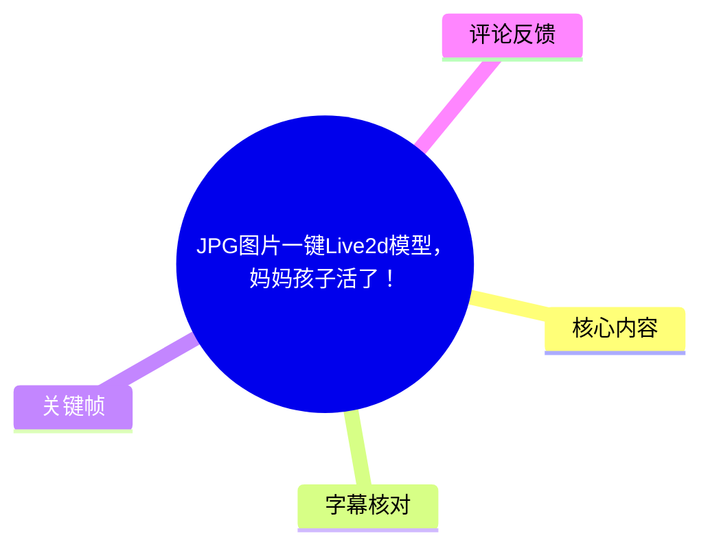
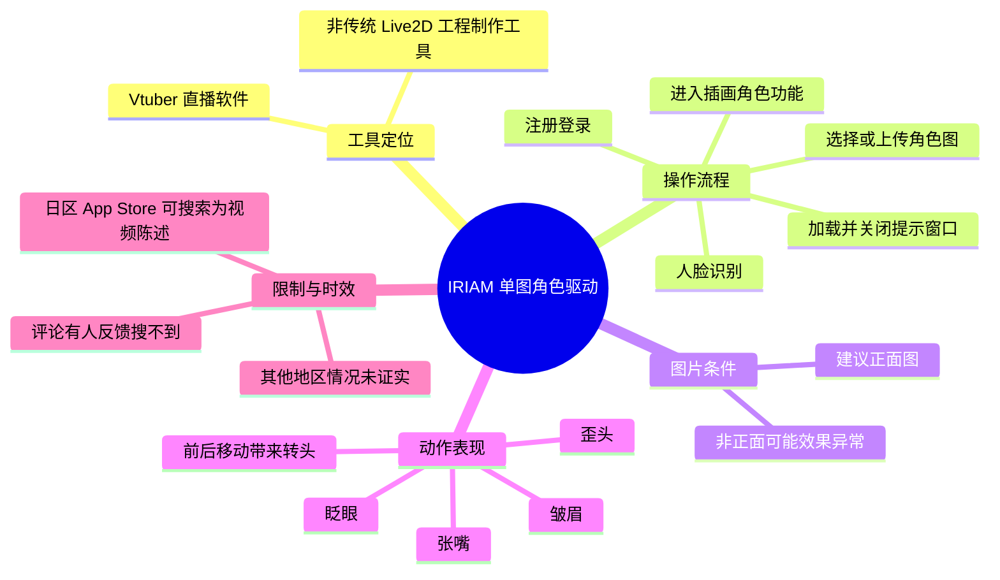
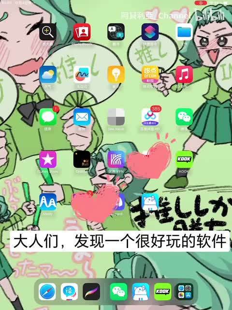
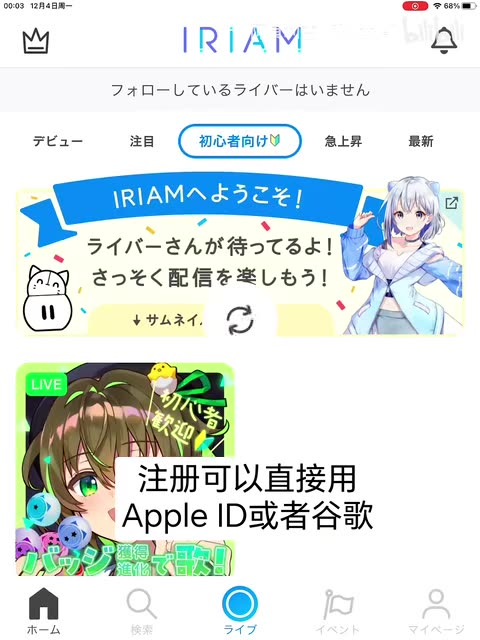
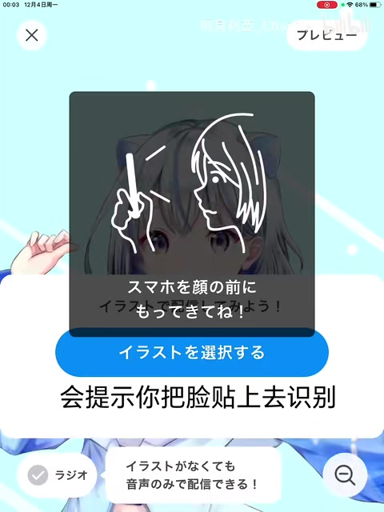

# JPG图片一键Live2d模型，妈妈孩子活了！

> 来源：[Bilibili 视频](https://www.bilibili.com/video/BV1u64y1j7c7)  
> UP 主：阿貝利亞_Channel｜发布时间：2023-12-03｜视频时长：74 秒  
> 视频画面：1080 × 1440 竖屏｜标签：模型、OC、Live2D

## 小结

视频演示的是日本区 App Store 可搜索到的 **IRIAM**：它本质上是一个 Vtuber 直播软件，而非传统意义上可导出、可编辑参数的 Live2D 建模工具。视频展示了用一张 JPG/插画作为角色图，经软件的人脸识别后，让角色随真人面部动作产生基础动态效果的流程。

核心方法是：进入 IRIAM 后完成注册，进入其插画角色功能，选择或上传角色图片；建议使用**正面头像/正面角色图**，否则识别生成的动态效果可能异常。上传、加载完成后，关闭左上角窗口，即可进入角色驱动界面。

视频明确展示或口述的可驱动动作包括：眨眼、歪头、张嘴、皱眉，以及借助前后移动实现较明显的转头效果。这些能力应理解为手机摄像头对使用者面部的实时追踪与角色图的动画化，不等同于完成了可在 Live2D Cubism 中继续编辑的模型工程。

软件获取存在区域限制和时效性：UP 主称其 App Store 为日区，可直接搜索到 IRIAM；视频简介也说明其他地区（包括国区）“不常用所以不太熟悉”。热评中有用户反馈“搜不到”，说明不同地区的商店上架状态、搜索结果、账号地区与软件规则都可能已经变化。

本视频没有报道独立新闻事件，也未给出软件版本号、支持的图片分辨率、文件大小、导出格式、隐私条款或免费额度等参数。因此，它适合用于快速了解“单张角色图实时动起来”的入口流程，不足以作为完整的模型制作或跨地区下载指南。

## 思维导图

## 目录

- [工具定位与时效背景](#工具定位与时效背景)
- [注册与进入角色功能](#注册与进入角色功能)
- [上传图片与生成人物角色](#上传图片与生成人物角色)
- [动作驱动效果](#动作驱动效果)
- [获取方式与区域限制](#获取方式与区域限制)
- [完整操作清单](#完整操作清单)
- [参数、限制与风险](#参数限制与风险)
- [关键帧索引](#关键帧索引)
- [字幕比对](#字幕比对)
- [评论分析](#评论分析)
- [处理记录](#处理记录)

## 工具定位与时效背景 [00:00:00](https://www.bilibili.com/video/BV1u64y1j7c7?t=0)

视频开头将 IRIAM 介绍为“很好玩的软件”。结合视频简介，UP 主进一步说明：这“其实是一个 Vtuber 直播软件”。因此，标题中的“JPG 图片一键 Live2D 模型”更适合被理解为通俗描述：软件可把一张角色插画用于实时虚拟形象驱动；视频没有证明其生成的是可下载、可拆分图层、可在专业 Live2D 软件中二次编辑的模型文件。

视频的实际目标是让一张角色图在手机前的人脸动作带动下“动起来”。流程依赖两类输入：

1. **角色图片**：上传或选择要使用的插画角色。
2. **真人脸部**：软件会提示用户将脸置于手机摄像头前进行识别。

> 图：开场关键帧呈现手机端使用场景及“大人们，发现一个很好玩的软件”的字幕。它说明视频讨论的是移动端应用工作流，而不是桌面端建模软件操作。

## 注册与进入角色功能 [00:00:04](https://www.bilibili.com/video/BV1u64y1j7c7?t=4)

站内字幕在 00:00:04—00:00:10 说明软件名为“艾瑞欧”，结合画面中的英文标识，应校正为 **IRIAM**。打开后需稍作等待并完成注册。

视频在 00:00:10—00:00:16 展示的登录信息为：

- 可使用 **Apple ID** 登录；
- 可使用 **Google** 登录；
- 加载完成后点击底部的相应入口，进入后续功能。

画面中的 IRIAM 首页为日文界面，可见底部导航栏和中央的直播入口。视频并未解释每个导航项的完整功能，也没有展示注册失败、验证码、年龄限制、付费订阅或权限授权页面。

> 图：关键帧中可见 IRIAM 标识、日文首页界面，以及“注册可以直接用 Apple ID 或者谷歌”的中文说明。它为软件名称和视频所述登录方式提供了画面依据。

## 上传图片与生成人物角色 [00:00:19](https://www.bilibili.com/video/BV1u64y1j7c7?t=19)

在进入插画角色相关页面后，视频按以下顺序演示：

1. 软件提示用户把脸对准手机前方，进行脸部识别。
2. 点击蓝色按钮进入图片选择。
3. 选择要使用的角色。
4. 按界面提示持续点击 **OK** 与上传选项。
5. 等待加载完成。

视频特别强调，上传图像最好是**正面图**；若不是正面，最终识别或驱动效果“可能会很怪”。这是本视频给出的最关键图片条件，但没有量化“正面”的角度范围，也未展示半侧脸、多人图、真人照片、复杂背景或低清图的失败案例。

画面显示的日文按钮为“イラストを選択する”，可理解为“选择插画”。同时，屏幕提示用户将脸部置于手机前方，表明软件会在使用过程中调用前置摄像头进行面部追踪。

> 图：关键帧显示 IRIAM 的人脸识别引导画面、脸部轮廓示意和蓝色“选择插画”按钮。它直接对应“先识别脸部、再选择角色图”的操作关系。

### 加载后的界面处理 [00:00:36](https://www.bilibili.com/video/BV1u64y1j7c7?t=36)

字幕在 00:00:36—00:00:44 说明：加载完成后角色会出现；点击左上角后，遮挡操作的窗口会消失。这里的“左上角窗口”应理解为视频当时界面中的关闭/收起操作，而不是可泛化到所有版本的固定按钮名称。

由于视频未展示完整的加载时长、上传进度、失败提示或重试方案，实际操作中若图片未出现，不能仅依据本视频推断问题一定来自图片角度；网络、账户、区域、应用版本或权限也都可能影响结果。

## 动作驱动效果 [00:00:44](https://www.bilibili.com/video/BV1u64y1j7c7?t=44)

进入角色驱动状态后，视频称“现在就可以让你的孩子动起来了”。这里的“孩子”是对上传角色形象的拟人化称呼，并非指软件专门面向儿童或仅适用于儿童照片。

视频列举的动作能力包括：

| 动作/表现 | 视频时间 | 视频陈述 |
| --- | ---: | --- |
| 眨眼 | 00:00:48—00:00:51 | 可以实现简单眨眼 |
| 歪头 | 00:00:51—00:00:53 | 可随头部姿态变化 |
| 张嘴 | 00:00:51—00:00:53 | 可表现嘴部开合 |
| 皱眉 | 00:00:51—00:00:53 | 可反映基础表情变化 |
| 明显扭头 | 00:00:53—00:00:57 | 通过前后移动产生较明显效果 |

其中，“利用前后……明显的扭头”在站内字幕中存在“发布”的识别错误；结合语义，应记录为**利用前后移动实现较明显的扭头**。不过，视频没有展示该动作背后的算法、可支持的最大角度，也未说明画面是实时渲染、预处理动画还是两者结合。

## 获取方式与区域限制 [00:01:02](https://www.bilibili.com/video/BV1u64y1j7c7?t=62)

视频末尾再次指向“左上角那个软件”，即 IRIAM。UP 主说明其商店账号为**日区**，搜索即可找到该应用，并邀请观众尝试。

这是一条发布于 2023 年 12 月的视频内经验，不应视为 2026 年仍然有效的商店可用性结论。视频简介对地域问题的原话要点是：

- 日区 App Store 可直接搜索 IRIAM；
- 其他区域，包括国区，UP 主表示不常用、不熟悉；
- 软件内部另有详细图片要求教程。

因此，若在所在地商店无法找到应用，视频没有提供跨区账号配置、替代下载渠道或官方网页下载方式；不应据此尝试来源不明的安装包。

## 完整操作清单 [00:00:06](https://www.bilibili.com/video/BV1u64y1j7c7?t=6)

以下步骤按视频已展示的顺序整理，未补充视频外的操作：

1. 在可搜索到 IRIAM 的应用商店中找到并打开应用。
2. 等待应用进入可用状态并进行注册。
3. 使用视频展示的 **Apple ID** 或 **Google** 方式登录。
4. 在应用内点击视频所指向的底部功能入口。
5. 根据提示把脸放到手机摄像头前进行识别。
6. 点击蓝色的插画选择按钮。
7. 选择准备好的角色图片。
8. 按界面提示点击 **OK** 并上传。
9. 等待图片和角色状态加载完成。
10. 使用左上角的关闭/收起操作移除遮挡窗口。
11. 面对摄像头，通过眨眼、头部倾斜、张嘴、皱眉及前后移动观察角色变化。

### 图片准备建议

视频明确给出的建议只有一项：**优先使用正面图**。在不扩展为官方规则的前提下，可将其落实为：

- 让角色脸部朝向画面正前方；
- 避免明显侧脸或大幅仰俯角；
- 上传前检查面部没有被大面积物体遮挡；
- 若效果异常，优先更换更正面的角色图进行对照。

后三项是对“正面图更稳定”这一视频经验的实践化表达，不是视频或软件官方公布的技术规格。

## 参数、限制与风险

### 已知参数与事实

| 项目 | 内容 | 来源与确定性 |
| --- | --- | --- |
| 视频时长 | 74 秒；ASR 音频时长检测为 73.2125 秒 | 元数据、ASR 诊断 |
| 视频画面 | 1080 × 1440，竖屏 | 元数据 |
| 应用名称 | IRIAM | 画面英文标识、视频简介 |
| 工具定位 | Vtuber 直播软件 | 视频简介 |
| 登录方式 | Apple ID、Google | 视频画面与站内字幕 |
| 图片要求 | 建议上传正面图 | 视频口述 |
| 交互动作 | 眨眼、歪头、张嘴、皱眉、前后移动带来扭头 | 视频口述 |
| 商店区域 | UP 主日区可搜索；其他区未确认 | 视频口述、简介 |

### 未在视频中证实的事项

以下内容均未在素材中给出，不能补写为确定事实：

- 是否支持 Android、网页版或桌面端；
- 图片支持的格式范围、像素尺寸、文件大小和透明背景要求；
- 是否支持真人照片、多人角色图、男性角色或非二次元图像；
- 是否生成可导出的 Live2D 文件、模型参数或动作数据；
- 角色图、摄像头画面与账号数据的存储、训练、删除和隐私处理方式；
- 是否免费、是否有付费功能、地区年龄限制与直播权限；
- 2026 年各地区 App Store 的实际可下载状态。

### 使用边界

- **“一键 Live2D”是标题化表述。** 视频证明的是单图角色的动态驱动体验，不足以证明获得专业 Live2D 制作流程中的完整模型资产。
- **需注意肖像与版权。** 若上传他人的肖像、角色立绘或受版权保护的作品，应先确认拥有上传、直播展示及二次使用的权利。
- **需注意摄像头权限。** 视频中的人脸识别意味着应用需要使用面部画面；在正式使用前应自行查看当前版本的权限请求和隐私政策。
- **区域信息已过时。** 视频发布于 2023 年，素材抓取于 2026 年；商店上架、登录服务和界面入口均可能变化。

## 关键帧索引

| 关键帧 | 对应内容 | 正文使用价值 |
| --- | --- | --- |
|  | 视频开场、移动端应用场景 | 确认教程以手机操作为中心。 |
|  | 打开应用后等待 | 对应“点开之后稍微等待一会儿”的时间段，补充流程中的等待环节。 |
|  | IRIAM 标识、主页和 Apple ID/Google 登录说明 | 校正 ASR 对应用名和登录方式的误识别。 |
|  | 脸部识别提示与插画选择按钮 | 说明人脸追踪与图片上传在同一工作流中的关系。 |

## 字幕比对

本次素材**存在音轨**：ASR 诊断显示音频时长 73.2125 秒、语音覆盖约 85.44%、首段语音从 00:00:00.050 开始，且未标记 `noAudioStream=true`。因此，不属于“源视频无音轨”的情况。

| 字幕来源 | 完整性 | 专有名词 | 时间轴 | 主要问题 |
| --- | --- | --- | --- | --- |
| Bilibili 站内字幕 | 覆盖从 00:00:00.040 至 00:01:11.720 的主要口述内容，分段较细 | “艾瑞欧”为音译，需结合画面校正为 IRIAM；Apple ID、Google、OK 可辨识 | 19 段，适合定位具体步骤 | 个别语义错误，如“利用前后发布明显的扭头”中的“发布”不合语境 |
| 本次 ASR 字幕 | 覆盖 00:00:00.050 至 00:01:11.480，诊断无大间隔警告 | 应用名被识别为“I write on”；“Apple ID”“Google”等多处误识别 | 仅 4 个长段，时间范围可用但不适合细粒度步骤定位 | 汉字同音和断词错误较多，如“链贴上去”“蓝色的表纸”“商传”“扎眼” |

最终正文以**站内字幕作为主时间轴文本**，并检查本次 ASR 的时间覆盖与内容一致性；再用关键帧中的 IRIAM 英文标识、日文界面和中文画面字幕校正专有名词及明显错字。

重点校正如下：

| 原始表述 | 校正记录 | 校正依据 |
| --- | --- | --- |
| 艾瑞欧 / I write on | IRIAM | 视频画面中的 IRIAM 标识、视频简介 |
| 垫开、垫这个 | 点击/点开 | ASR 同音误识别，站内字幕语义完整 |
| 链贴上去 | 脸贴上去 | 站内字幕语义及人脸识别画面 |
| 蓝色的表纸 | 蓝色的标志/按钮 | 站内字幕与关键帧蓝色按钮 |
| 商传 | 上传 | 站内字幕“上传” |
| 扎眼、掌嘴、周门 | 眨眼、张嘴、皱眉 | 站内字幕和动作语境 |
| 前后发布 | 前后移动 | 结合“扭头”的上下文进行语义校正；原视频未给出更具体技术名称 |

## 评论分析

以下仅分析本次可获取的热评前三条。评论反映的是用户体验或个人观点，不作为已经验证的软件事实。

1. **麻将时光（35 赞）**：称“这个可以看直播”，并表示自己在其中学习日语。  
   - 补充信息：与视频简介“Vtuber 直播软件”的定位一致，说明用户可将其作为观看直播的场景之一。  
   - 可信度边界：这属于个人使用体验；未说明直播内容、地区可用性或语言学习效果。

2. **無風喵（23 赞）**：反馈“搜不到”。  
   - 补充信息：印证软件搜索和下载可能存在地区、账号或上架状态差异。  
   - 可信度边界：评论没有提供所在地区、设备系统、商店账号区域或搜索关键词，无法定位具体原因，也不能据此断言应用已下架。

3. **林梦回（10 赞）**：称手机端“直播姬”也有类似功能，但效果可能差一些。  
   - 补充信息：提出可能存在同类移动端角色驱动功能。  
   - 可信度边界：“效果差一点”没有测试条件、版本或样例，属于主观比较；视频本身没有演示该替代工具，不能视为已验证替代方案。

## 处理记录

- Worker ID：`worker-mrj0www4-e8d79408`
- 整理模型：`gpt-5.6-terra`
- 使用素材与工具结果：视频元数据、站内 SRT 字幕、ASR 结果（`medium`，CUDA，`float16`）、ASR 时间轴字幕、关键帧、热评数据。
- 字幕选择：以站内字幕为正文主文本和步骤时间轴；完成对本次 ASR 的逐项检查，并以关键帧和上下文校正 IRIAM、Apple ID、Google、上传及动作名称。
- ASR 状态：检测到正常音轨；语言为中文，置信度 `0.97900390625`；未出现 `noAudioStream=true` 标记。
- 关键帧选择依据：选取开场移动端场景、IRIAM 首页/登录信息、人脸识别与插画选择画面，分别支撑工具定位、软件名称、登录方式与核心操作步骤。
- 评论范围：仅使用可获取热评前三条，未扩展至更多评论或回复。
- 缓存清理：提供的素材清单未包含缓存清理执行记录，无法确认是否已清理；本整理不将其表述为已完成。
- 未解决问题：无法从视频确认当前 App Store 各地区的实际可用性、应用最新版本、收费规则、图片技术规格、导出能力及隐私政策。
