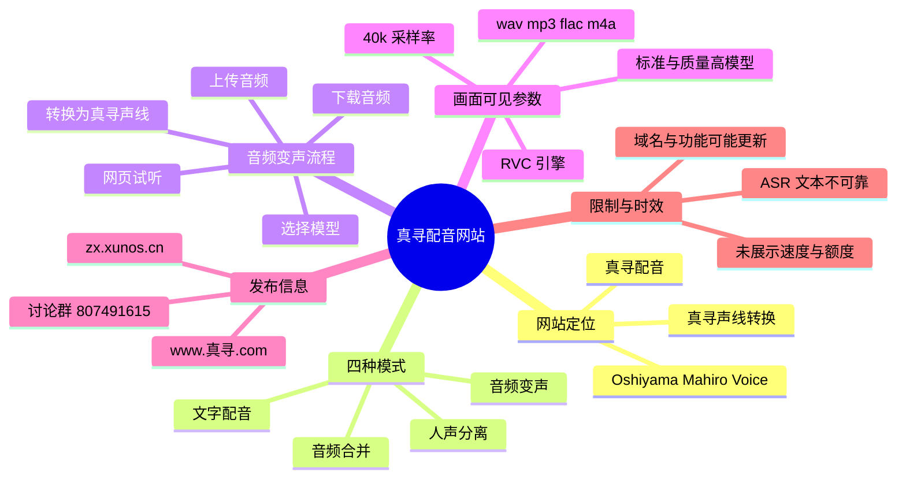

# 我做了一个真寻配音网站！

> 来源：[Bilibili 视频](https://www.bilibili.com/video/BV1nsVm6BEPp)<br>
> UP 主：XXLL吖｜发布时间：2026-06-03｜视频时长：64 秒｜分区合集：AIcode

## 小结

视频展示了一个名为“真寻配音（Oshiyama Mahiro Voice）”的网站界面及一次音频变声操作的完成状态。根据画面，网站将功能分为**文字配音、音频变声、人声分离、音频合并**四种模式；视频重点演示的是“音频变声”。

音频变声界面支持上传音频文件，画面明确列出支持的格式为 `wav / mp3 / flac / m4a`。用户可选择语音模型，视频中可见“绪山真寻·标准”与“绪山真寻·质量高”等模型选项；其中“标准”模型的卡片标注了 **RVC** 引擎与 **40k** 采样率。

演示流程从选择音频、点击“转换为真寻声线”，到弹窗显示“生成完成”，并提供网页内试听与“下载音频”按钮。完成弹窗中的音频播放器时长显示为 **2:34**，这表明演示任务已生成一份可播放、可下载的结果；但素材未提供实际导出的音频内容、转换耗时、队列机制、文件大小上限或收费信息，不能据此推断服务性能与可用额度。

视频没有提供可用的站内字幕。本次 ASR 虽检测到音轨且带时间戳，但识别文本主要是低可信的、疑似歌曲/背景音转写，无法作为网站功能说明的可靠依据。因此，本文以视频画面、视频标题、简介及关键帧可见文字为主，ASR 仅用于建立可追溯的时间轴。

网站简介中给出了 `zx.xunos.cn` 与 `www.真寻.com` 两个访问入口，以及讨论群号 `807491615`；这些均属于发布时信息，可能因后续域名升级、服务维护或权限调整而变化。热评还提及 `真寻.com` 拟加入 QQ 快捷登录、论坛与 AI 聊天完善等升级计划，但这属于评论者陈述，不能视为已经上线的功能。

## 思维导图




## 目录

- [项目与信息入口](#项目与信息入口-000000)
- [四种功能模式与界面结构](#四种功能模式与界面结构-000004)
- [音频变声：上传、模型与转换](#音频变声上传模型与转换-000028)
- [生成结果与下载](#生成结果与下载-000040)
- [使用步骤、参数与限制](#使用步骤参数与限制-000055)
- [结论与时效性](#结论与时效性)
- [字幕比对](#字幕比对)
- [评论分析](#评论分析)
- [处理记录](#处理记录)

## 项目与信息入口 [00:00:00](https://www.bilibili.com/video/BV1nsVm6BEPp?t=0)

> 对应本次 ASR 的首段时间：`00:00:00,080 --> 00:00:03,360`。该段识别文本为“懶懶的瞄准挂着汤匠”，与网站主题缺乏语义对应，不能据其解释功能。

视频标题直接说明项目为“真寻配音网站”。界面左上角同时出现英文标识 **“Oshiyama Mahiro Voice”** 和中文名称“真寻配音”，可确认这是围绕“绪山真寻”声线命名的配音/变声网页工具。

视频简介提供了以下发布信息：

| 类别 | 内容 | 说明 |
| --- | --- | --- |
| 网站入口 | `zx.xunos.cn` | UP 主简介列出的访问地址 |
| 网站入口 | `www.真寻.com` | UP 主简介列出的另一入口 |
| 社群 | 真寻群讨论：`807491615` | 简介中给出的讨论群号 |
| 致谢 | 坤寻提供技术支持与研发投入 | 简介原文陈述 |
| 致谢 | 寻枫椛提供模型和真寻声线 | 简介原文陈述 |
| 相关链接 | 坤寻的博客、真寻.com、寻枫椛的 MiniMax Al Creative Studio | 简介列为友链；其中一项可见地址为 `http://81.70.228.51:3001` |

上述地址和社群信息属于视频发布时的资料记录，不保证在阅读本文时仍可访问。

## 四种功能模式与界面结构 [00:00:04](https://www.bilibili.com/video/BV1nsVm6BEPp?t=4)

> 对应本次 ASR 分段：`00:00:04,600 --> 00:00:28,900`。ASR 文本呈现为连续歌词式内容，未出现能够可靠对应界面功能的术语。

画面顶部导航显示网站支持四种模式：

1. **文字配音**
2. **音频变声**
3. **人声分离**
4. **音频合并**

这意味着网站并非只提供文本转语音：从标签命名看，还覆盖已有音频的声线转换、音轨中人声提取，以及音频文件合并。视频实际展示的操作区域为“音频变声”，因此其余三项只能确认存在入口，不能进一步确认输入限制、操作流程或输出格式。


> 图：该关键帧清楚显示“文字配音、音频变声、人声分离、音频合并”四个导航标签，以及“绪山真寻·质量高”模型选择区域。它是确认产品功能范围与模型存在的直接画面证据。

界面采用模型选择栏与操作区并列的结构。关键帧中，模型卡片可见“Voice Model”标签，以及“绪山真寻·质量高”的名称；因此可确认页面至少提供不止一种模型/质量档位，而不能进一步断言不同档位之间的音质、速度或费用差异。

## 音频变声：上传、模型与转换 [00:00:28](https://www.bilibili.com/video/BV1nsVm6BEPp?t=28)

> 对应本次 ASR 分段：`00:00:28,900 --> 00:00:38,770`。该段 ASR 文本无法稳定辨识为产品讲解，正文以关键帧中的界面文字为准。

音频变声页面的可见操作流程如下：

1. 切换到“**音频变声**”标签。
2. 在“当前模型”区域选择目标模型。
3. 通过“**选择音频**”上传源文件。
4. 如有需要，展开“**高级参数**”区域；但视频未展开该区域，具体参数未展示。
5. 点击“**转换为真寻声线**”提交转换。
6. 等待生成结果，在右侧或弹窗中试听并下载音频。

上传区明确标注支持格式：

```text
wav / mp3 / flac / m4a
```

界面还显示“我的历史”区域，说明系统至少设计了历史任务记录入口；不过视频仅可见一条历史条目，未展示历史保存期限、删除功能、任务状态说明或跨设备同步能力。


> 图：该关键帧展示了“音频变声”页的上传框、格式提示、折叠状态的“高级参数”、转换按钮及右侧历史区域。它说明“转换为真寻声线”是页面中明确的提交动作。

模型信息在另一关键帧中可读为：

| 字段 | 画面可见内容 | 可确认的含义 |
| --- | --- | --- |
| 当前模型 | 绪山真寻·标准 | 演示中选择的是“标准”档模型 |
| 质量 | 标准 | 模型卡片显示的质量标识 |
| 引擎 | RVC | 该模型卡片标注采用 RVC |
| 采样率 | 40k | 该模型卡片标注的采样率 |
| 制作 | 坤寻x小… | 字段内容被界面截断，不能补全或推断完整制作方名称 |


> 图：该关键帧显示已上传的音频文件、被选中的“绪山真寻·标准”模型及其可见参数“RVC”“40k”。相较于空上传状态，它证明了提交转换前需要完成文件选择。

需要特别区分：**“40k”是画面显示的模型采样率标签，不等同于所有上传文件都必须为 40 kHz，也不构成输出文件采样率的保证。** 视频未展示高级参数内容和音频编码设置，无法确认用户能否改变这些参数。

## 生成结果与下载 [00:00:40](https://www.bilibili.com/video/BV1nsVm6BEPp?t=40)

> 对应本次 ASR 分段：`00:00:40,460 --> 00:00:49,460`。ASR 文本未可靠地说明生成状态或下载动作，相关事实来自画面中“生成完成”弹窗。

转换完成后，界面弹出结果窗口，窗口内可读到：

- 状态：**生成完成**
- 结果名称：**绪山真寻模型已生成**
- 播放器时长：**2:34**
- 操作按钮：**下载音频**

这说明系统在完成任务后至少提供两种处理结果的方式：先在浏览器中播放预览，或直接下载音频文件。视频没有展示点击下载后得到的文件名、格式、比特率、保存位置及授权提示，因此这些细节均无法确认。


> 图：该关键帧是输出结果存在的最直接证据。弹窗显示“生成完成”“绪山真寻模型已生成”、内嵌播放器及“下载音频”按钮，表明演示已走通从上传到结果下载的闭环。

画面背景仍可辨认出音频变声页面，意味着结果以弹窗形式覆盖原操作界面。播放器显示的 `0:00 / 2:34` 表示当前尚未播放、总时长为 2 分 34 秒；它不代表视频时长，也不能用于计算网站处理耗时。

## 使用步骤、参数与限制 [00:00:55](https://www.bilibili.com/video/BV1nsVm6BEPp?t=55)

> 对应本次 ASR 末段：`00:00:55,860 --> 00:00:56,440`。这一段仅识别出“的朋友”，不具备可用的操作信息。

### 可复现的界面操作清单

```text
进入真寻配音网站
  → 选择“音频变声”
  → 选择目标真寻模型
  → 上传 wav / mp3 / flac / m4a 音频
  → （可选）查看高级参数
  → 点击“转换为真寻声线”
  → 等待“生成完成”
  → 网页试听或点击“下载音频”
```

### 已展示的参数与能力

| 项目 | 视频证据 | 结论 |
| --- | --- | --- |
| 功能模式 | 顶部四个标签 | 可确认存在文字配音、音频变声、人声分离、音频合并入口 |
| 音频上传格式 | 上传框文字 | 可见支持 `wav / mp3 / flac / m4a` |
| 模型档位 | “绪山真寻·标准”“绪山真寻·质量高” | 至少存在两个可见命名的模型/档位 |
| 模型引擎 | 标准模型卡片的“RVC” | 可确认该展示模型标注为 RVC |
| 采样率标签 | 标准模型卡片的“40k” | 可确认该展示模型标注为 40k |
| 输出动作 | 播放器、下载音频 | 可在线试听并下载已生成结果 |
| 历史记录 | “我的历史”区域 | 页面存在历史任务展示设计 |

### 未展示、不可补充的关键限制

以下信息在素材中没有给出，使用者需要以网站当前页面、服务条款或管理员说明为准：

- 单次上传时长、文件大小和并发任务上限；
- 免费额度、收费方案、登录要求及排队规则；
- 处理耗时、失败重试、任务保留期限；
- 高级参数的字段、默认值及适用建议；
- 输出音频的格式、码率、采样率和声道数；
- RVC 模型的训练来源、授权状态、可商用范围；
- 对输入音频语言、唱歌/说话类型、噪声水平的适配能力；
- 生成的拟真程度、音色稳定性及情绪控制能力。

同时，声线转换涉及角色形象、模型权利与原始音频权利。视频未展示授权说明，因此不应从“可下载”推断其可自由商用或可用于任何公开发布场景。处理他人声音、音乐或受版权保护素材时，应自行确认素材与模型的使用许可。

## 结论与时效性

这段 64 秒的演示最清晰地证明了一个端到端网页流程：选择“绪山真寻”模型、上传音频、执行“转换为真寻声线”、在生成完成后试听并下载。对于希望快速了解该网站有何入口、支持哪些上传格式、以及变声功能大致如何操作的用户，视频提供了足够的界面级证据。

不过，它不是完整教程或技术白皮书。视频并未给出模型训练方法、部署架构、性能指标、限额、价格、输出编码或授权规则；“人声分离”和“音频合并”等功能也仅显示标签，尚未演示实际效果。对工具能力的判断应限制在已见界面范围内。

发布信息具有明显时效性。元数据记录的视频发布时间为 **2026-06-03**，页面中显示的历史记录日期也为 `2026-06-03`。域名解析、模型列表、登录机制、功能按钮和服务政策都可能在后续更新中变化。尤其是热评中提到的 QQ 快捷登录、论坛和 AI 聊天，属于规划性信息，不应当作视频时已经具备的功能。

## 字幕比对

| 字幕来源 | 完整性 | 专有名词 | 时间轴 | 主要问题 |
| --- | --- | --- | --- | --- |
| Bilibili 站内字幕 | 未提供可用字幕 | 无法核验 | 无法使用 | 素材明确标注未提供可用站内字幕 |
| 本次 ASR 字幕 | 共 5 段，覆盖约 47.03 秒语音、覆盖率 74.55% | 不可靠，未正确识别“真寻”“RVC”等界面术语 | 可用，带精确起止时间 | 文本呈疑似音乐/歌词的失真识别，与网站画面主题不匹配 |

### ASR 检查结论

本次 ASR 使用 `medium` 模型，识别语言为中文（语言概率 `0.98583984375`），音频时长约为 `63.08` 秒。诊断数据**未标记 `noAudioStream=true`**，因此可确认源视频存在音轨；问题不是无音轨，而是音轨内容不适合被可靠地转写为网站功能说明。

ASR 可用时间段如下：

| 时间段 | ASR 输出 | 采用情况 |
| --- | --- | --- |
| 00:00:00.080–00:00:03.360 | “懶懶的瞄准挂着汤匠” | 不采用为语义事实 |
| 00:00:04.600–00:00:28.900 | 连续歌词式文本 | 不采用为语义事实 |
| 00:00:28.900–00:00:38.770 | 连续歌词式文本 | 不采用为语义事实 |
| 00:00:40.460–00:00:49.460 | 连续歌词式文本 | 不采用为语义事实 |
| 00:00:55.860–00:00:56.440 | “的朋友” | 不采用为语义事实 |

最终字幕策略为：**不以任何一份字幕重构网站功能；以 ASR 原始时间戳建立章节链接，以关键帧中的可读界面文字、视频标题与简介交叉整理事实。**

通过关键帧校正并采用的关键术语包括：

- 真寻配音／Oshiyama Mahiro Voice；
- 文字配音、音频变声、人声分离、音频合并；
- 绪山真寻·标准、绪山真寻·质量高；
- RVC、40k；
- `wav / mp3 / flac / m4a`；
- 转换为真寻声线、生成完成、下载音频。

## 评论分析

以下仅处理本次可获取的热评前三条；评论内容不等同于已验证事实。

| 排名 | 评论与点赞 | 观点及补充信息 | 可信度与注意事项 |
| --- | --- | --- | --- |
| 1 | 坤寻，99 赞 | 评论称 `真寻.com`“打算要升级”，拟新增 QQ 快捷登录、完善论坛系统与 AI 聊天。 | 该账号名与视频简介中被致谢的“坤寻”一致，但评论仍属于个人发布的计划说明；“打算”表明功能未必已上线。 |
| 2 | 雪韵歌，48 赞 | 询问“API没，我有个项目想调用一下。” | 反映部分用户存在程序化调用需求；这只是提问，不能说明网站目前提供或不提供 API。 |
| 3 | 甚么東曦，15 赞 | “我这什么情况” | 评论没有描述具体页面、报错或操作环境，无法据此定位问题，也不能据此判断服务稳定性。 |

整体而言，热评补充了潜在产品路线和 API 需求，但没有提供可复现的接口文档、故障截图或正式公告。若需要集成能力，应以网站当前文档或运营方正式说明为准。

## 处理记录

- Worker ID：`worker-mrj0wjed-b0c290ad`
- 生成模型：`gpt-5.6-terra`
- 素材工具产物：视频元数据、`audio/audio.wav`、本次 ASR 结果与 SRT、关键帧目录、热评 JSON。
- ASR 模型与配置：`medium`／CUDA／`float16`／自动识别中文；检测到真实音轨，未出现 `noAudioStream=true` 标记。
- 字幕选择：站内字幕未提供可用文件；已检查本次 ASR。因 ASR 内容与画面功能无可靠对应，未将其作为正文语义依据，仅使用其真实分段时间建立时间轴。
- 关键帧选择依据：选用 `frame-001.jpg` 证明四种模式与质量高模型入口；`frame-002.jpg` 证明上传格式、转换按钮与历史区域；`frame-003.jpg` 证明已上传文件及标准模型的 RVC/40k 标签；`frame-004.jpg` 证明生成完成、2:34 播放器与下载入口。
- 缓存清理：素材未提供缓存清理执行记录，无法确认是否已清理；不将其表述为已完成。
- 未解决问题：未提供关键帧的精确提取时间；未展示高级参数、服务限额、收费、接口、输出编码、模型授权及实际生成音频内容，因此未作推断。
