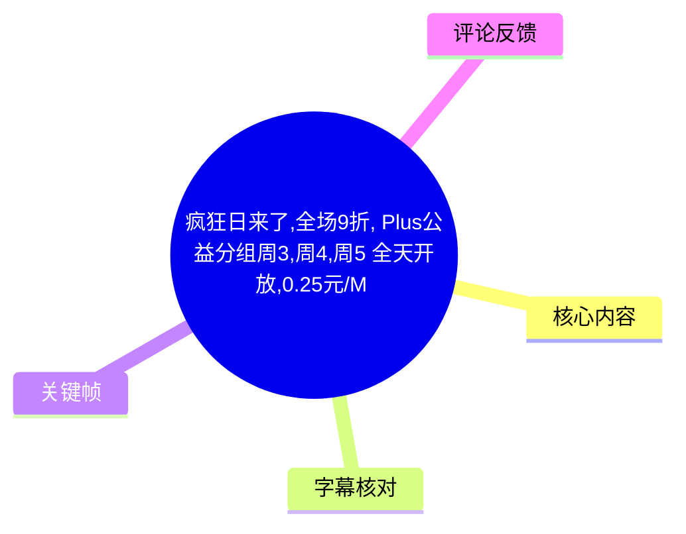
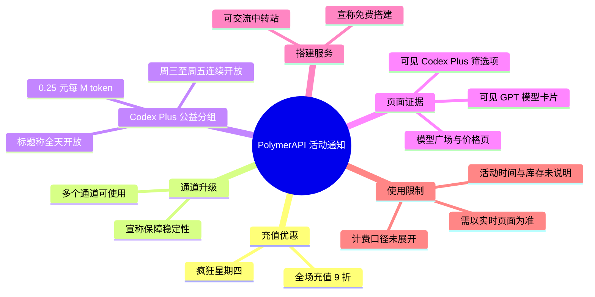
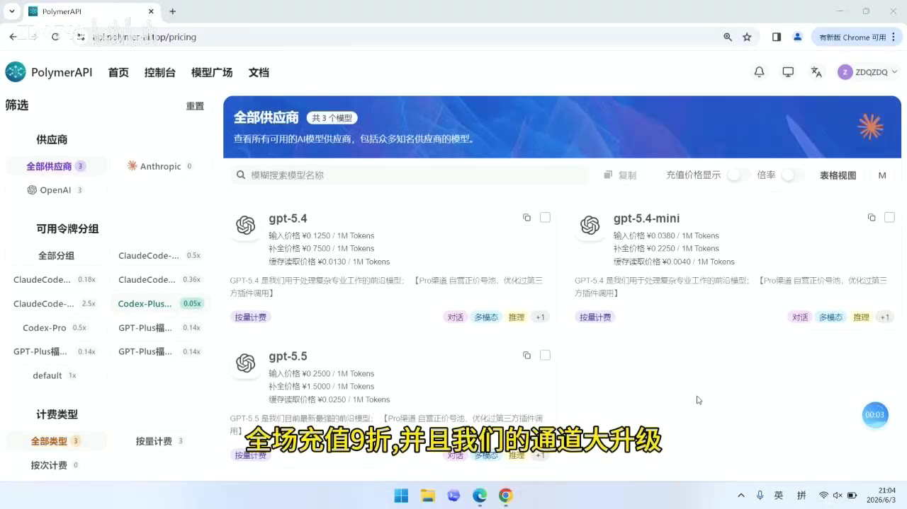
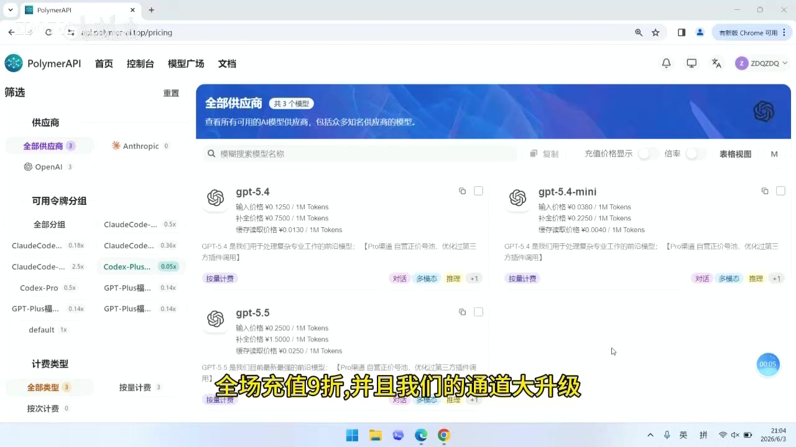
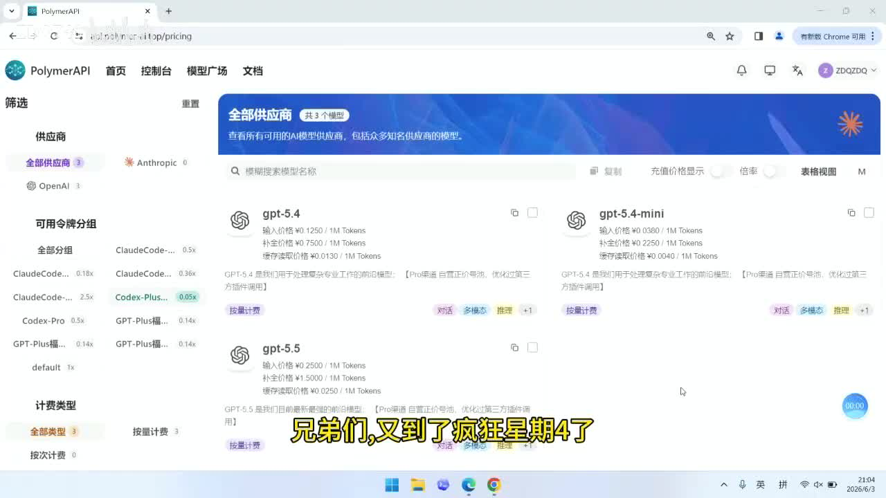
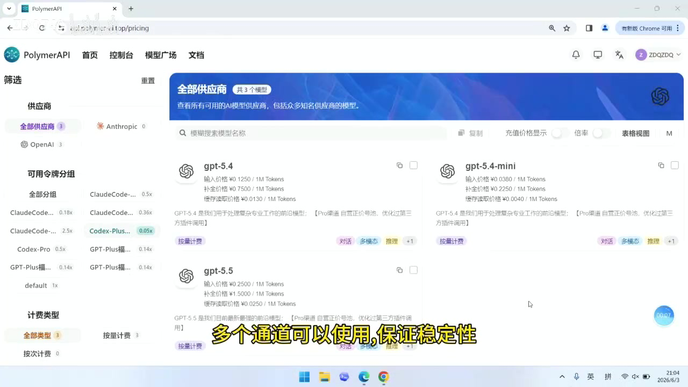

# 疯狂日来了：9 折充值、Codex Plus 公益分组与免费中转站搭建

> 来源：[Bilibili 视频](https://www.bilibili.com/video/BV1Nf7Q6iEih)  
> UP 主：ZDQ740｜时长：21 秒｜合集：AIcode  
> 视频主题：PolymerAPI 页面上的限时充值优惠、通道升级与 Codex Plus 公益分组开放通知。

## 小结

视频是一则时长约 21 秒的服务活动通知。UP 主宣布“疯狂星期四”活动：**全场充值 9 折**，同时称平台已完成“通道大升级”，提供多个通道以提升或保障稳定性。

活动中的核心价格信息是：**Codex Plus 公益分组价格为 0.25 元 / M token**，其中 `M token` 按行业通常写法表示一百万 token；该定义是术语解释，视频并未额外说明输入、输出、缓存 token 是否采用同一计价口径。

开放时间为**周三、周四、周五连续开放**。标题将其描述为“全天开放”，但 ASR 语音只明确说“连续开放”；“全天”来自标题，二者可互相补充，但具体起止日期、每日开关时间、额度和库存均未展示，使用前应以平台实时页面为准。

视频画面展示的是 PolymerAPI 的模型/价格页面：左侧可筛选供应商、可用令牌分组和计费类型，其中可见 `Codex-Plus...` 分组及 `0.05x` 标识；主区域可见 `gpt-5.4`、`gpt-5.4-mini`、`gpt-5.5` 等模型卡片。这只能证明录制时页面存在相应界面与筛选项，**不能据此推导所有模型的实际可用性、最终折后单价或服务质量**。

UP 主还表示，如有搭建中转站的需求，可交流并“免费搭建”。这是一项服务承诺而非教程：视频未给出部署架构、服务器规格、域名、密钥管理、模型路由规则或交付边界。适合希望了解该次活动信息、计划短期调用 Codex Plus 分组，或拟咨询中转站部署的用户阅读。

## 思维导图





## 目录

- [活动背景与时效性](#活动背景与时效性-0000)
- [全场 9 折与通道升级](#全场-9-折与通道升级-0000)
- [Codex Plus 公益分组：开放时间与价格](#codex-plus-公益分组开放时间与价格-0000)
- [画面中的平台页面与可验证信息](#画面中的平台页面与可验证信息-0000)
- [中转站咨询与使用步骤](#中转站咨询与使用步骤-0000)
- [参数、限制与风险提示](#参数限制与风险提示-0000)
- [字幕比对](#字幕比对)
- [评论分析](#评论分析)
- [处理记录](#处理记录)

## 活动背景与时效性 [00:00](https://www.bilibili.com/video/BV1Nf7Q6iEih?t=0)

这条视频属于平台运营活动与服务能力更新通知，而非模型功能演示或完整部署教学。唯一可直接使用的 ASR/SRT 分段覆盖 **00:00:00,000—00:00:20,220**，因此下文所有视频内容均定位到该真实时间段；素材没有提供更细粒度的站内字幕，不能将口播顺序人为拆分为精确秒点。

视频中可确认的活动口播包括：

1. 到了“疯狂星期四”；
2. 全场充值 9 折；
3. 通道“大升级”，多个通道可以使用；
4. 周三、周四、周五连续开放 Codex Plus 公益分组；
5. 价格为 0.25 元 / M token；
6. 有中转站搭建需求可交流，称可免费搭建。

活动信息具有明显时效性。元数据的发布时间可换算至 2026 年 6 月 3 日，但原始素材未提供时区标记；视频截图中的系统日期显示为 `2026/6/3`，与该日期一致。优惠是否仍有效、折扣是否可叠加、分组是否仍开放以及单价是否变化，均不能仅凭该视频确认。

## 全场 9 折与通道升级 [00:00](https://www.bilibili.com/video/BV1Nf7Q6iEih?t=0)

### 视频陈述

UP 主在同一段连续口播中称：

- “全场充值 9 折”；
- “我们的通道大升级”；
- “多个通道可以使用，保证稳定性”。

“全场充值 9 折”通常意味着充值金额按原价的 90% 支付，等价于减免 10%；但视频未展示充值页、折扣码、订单结算页或适用条件。因此，不能进一步断言：

- 是否所有支付渠道都支持；
- 是否有最低充值金额；
- 是否能与其他优惠叠加；
- 折扣是自动生效还是需要领取；
- 已充值余额、赠送余额或特定分组是否适用。

“多个通道”及“保证稳定性”是服务能力声明。视频没有给出通道数量、供应商名单、故障转移逻辑、可用性 SLA、限速、并发上限或延迟测试数据，因此不应将其等同于已被独立验证的稳定性指标。



> 图：画面展示 PolymerAPI 的模型广场/价格页，同时字幕写有“全场充值9折，并且我们的通道大升级”。它将活动口播与实际平台界面关联起来，但并未展示充值结算页，故只能作为活动宣介画面，不构成折扣规则的完整证据。

## Codex Plus 公益分组：开放时间与价格 [00:00](https://www.bilibili.com/video/BV1Nf7Q6iEih?t=0)

### 已明确的参数

| 项目 | 视频/标题提供的信息 | 说明 |
| --- | --- | --- |
| 分组名称 | Codex Plus 公益分组 | ASR 识别为 `Codex Plus`；画面左侧也可见截断的 `Codex-Plus...` 标签。 |
| 开放日 | 周三、周四、周五 | 口播为“连续开放”。 |
| 全天开放 | 标题明确写“周3、周4、周5 全天开放” | 口播本身未说“全天”；此处以标题为补充来源。 |
| 标价 | 0.25 元 / M token | `M` 在计费场景通常指 million（一百万），但视频未定义。 |
| 价格口径 | 未说明 | 未区分输入、输出、缓存、思考 token，也未说明是否为折前/折后价。 |
| 配额与限制 | 未说明 | 无每日额度、并发、RPM/TPM、排队策略等信息。 |

### 对价格的谨慎解读

视频说的是“0.25 元 M token”，标题规范为“0.25 元/M token”。可将其整理为：

```text
宣传价格：0.25 元 / 1,000,000 token
```

但这只是对单位缩写的常规展开，而非对平台计费规则的补充。实际调用前至少需要在平台官网确认：

1. 该价格对应的具体模型或路由；
2. 输入与输出 token 是否分开计费；
3. 是否存在缓存读写、推理/思考 token 的单独价格；
4. 该分组是否需要特定 API Key、账号等级或白名单；
5. 价格是否已含或另计充值优惠；
6. 分组开放期间是否存在限流、排队或动态调整。



> 图：左侧“可用令牌分组”区域可见高亮的 `Codex-Plus...` 项及 `0.05x` 标识，右侧为模型卡片列表。该帧可辅助确认视频确实在平台的分组/模型页面中操作；但 `0.05x` 的业务含义未被口播解释，不能擅自解释为价格倍率、速度倍率或优惠比例。

## 画面中的平台页面与可验证信息 [00:00](https://www.bilibili.com/video/BV1Nf7Q6iEih?t=0)

画面为浏览器打开的 `api.polymer-ai.top/pricing` 页面（地址栏可见该路径）。从关键帧可读到以下界面信息：

- 顶部品牌为 **PolymerAPI**，导航包含“首页、控制台、模型广场、文档”；
- 页面横幅标题为“全部供应商”，并标注“共 3 个模型”（画面文字的具体统计范围不明）；
- 左侧“供应商”筛选中可见“全部供应商 3”、`Anthropic 0`、`OpenAI 3`；
- 左侧“可用令牌分组”中可见 `Codex-Plus...`、`Codex-Pro`、`GPT-Plus...`、`default` 等截断或完整标签；
- 主区域可见 `gpt-5.4`、`gpt-5.4-mini`、`gpt-5.5` 模型卡片及若干小字价格；
- 画面中可见“按量计费”等标签。

这些是**录屏瞬间的可视信息**，不等于所有条目的完整、长期状态。尤其是模型卡片上的细小单价文字并非本视频口播重点，且与所宣传的 Codex Plus 分组价格不必然对应，不能将其抄录后作为活动计价依据。



> 图：该帧完整保留了 PolymerAPI 的供应商筛选、令牌分组和模型卡片布局，并在底部显示“兄弟们，又到了疯狂星期4了”的字幕。它的价值在于交代视频并非空口播报，而是在价格/模型列表页面上进行说明。



> 图：该帧下方字幕为“全场充值9折，并且我们的通道大升级”，页面仍维持模型与分组浏览状态。它说明视频没有演示通道配置或切换过程，因而“通道升级”的具体技术实现仍属未披露信息。

## 中转站咨询与使用步骤 [00:00](https://www.bilibili.com/video/BV1Nf7Q6iEih?t=0)

视频没有展示注册、充值、创建密钥、调用 API 或部署中转站的实际操作。因此以下内容仅整理为依据视频与简介可执行的**核验/咨询流程**，不把未展示的部署细节伪装成教程。

### 1. 核验活动与入口

视频简介提供注册地址：

<https://api.polymer-ai.top/>

建议进入后先检查活动公告、充值页面和目标分组的实时状态，重点确认“9 折”和“0.25 元 / M token”是否仍显示、适用条件是什么。

### 2. 查找 Codex Plus 公益分组

在视频展示的模型页面中，可从左侧“可用令牌分组”查找 `Codex-Plus...`。应以页面完整标签和该分组对应的模型列表为准，避免把相邻的 `Codex-Pro` 或其他 `GPT-Plus` 类分组误认为同一活动对象。

### 3. 在开放日内确认可用性

根据视频，开放窗口是周三至周五；标题补充称为全天。实际使用时仍应查看页面状态或官方公告，确认分组没有临时关闭、售罄、维护或调整规则。

### 4. 如需中转站搭建，先明确交付范围

UP 主仅表示“有想要搭建中转站的兄弟可以来交流一下，免费搭建”。在联系前，建议明确以下需求，以免将“免费搭建”误解为无限期运维服务：

- 部署位置：自有服务器、云服务器或其他环境；
- 目标用途：个人开发、团队共享、应用后端等；
- 上游接口与模型范围；
- 域名、HTTPS、访问认证和日志保留需求；
- API Key 的存储、轮换和权限隔离方式；
- 后续故障处理、升级、费用和运维责任。

视频简介还提供反馈群信息：“1群反馈群已满，添加2群QQ号：1107621381”。这是 UP 主发布的联络信息，不代表平台官方支持渠道，也不应在未核验身份的情况下发送账号密码、支付凭证或 API Key。

## 参数、限制与风险提示 [00:00](https://www.bilibili.com/video/BV1Nf7Q6iEih?t=0)

### 已知与未知边界

| 类别 | 可从素材确认 | 素材未提供，需另行确认 |
| --- | --- | --- |
| 优惠 | 全场充值 9 折的宣传 | 适用范围、领取方式、最低金额、叠加规则、截止时间 |
| 分组 | Codex Plus 公益分组 | 完整模型清单、账号门槛、库存、限流规则 |
| 时间 | 周三至周五连续开放；标题称全天 | 具体日期、时区、每日开始/结束时刻、临时调整机制 |
| 单价 | 0.25 元 / M token | 输入/输出/缓存/推理 token 的计价拆分，是否为折前或折后 |
| 通道 | 称多个通道可使用、稳定性升级 | 通道数量、供应商、故障切换、性能数据与 SLA |
| 搭建 | 可交流、免费搭建的口播承诺 | 技术栈、部署成本、数据安全、维护责任和服务期限 |

### 简介中的补充信息

视频简介另称“上新了 claude-opus-4-8 和 claude-opus-4-8-thinking，福利分组低至 0.9 元/100万 token”。这段信息**未在本次 20 秒口播 ASR 中出现**，应视为视频简介的补充宣传，而不是视频画面或语音已经演示的内容。它与视频正文所说的 Codex Plus `0.25 元/M token` 属于不同名称/价格描述，不能混为同一个计费项目。

### 安全与合规提醒

- 不要将 API Key、账户密码、支付截图中的敏感信息发送给第三方咨询者。
- 若部署中转站，应默认 API Key 需要最小权限、环境变量或密钥管理、访问鉴权、日志脱敏和定期轮换。
- “公益分组”“免费搭建”“稳定性保证”均是发布者/服务方的宣传或承诺；在没有服务条款、隐私政策、运维边界和性能数据的情况下，应按可变服务而非确定 SLA 规划生产用途。
- 对于成本敏感任务，先以小额充值或低风险调用验证计价和路由，再决定是否扩大使用量。

## 字幕比对

| 字幕来源 | 完整性 | 专有名词 | 时间轴 | 主要问题 |
| --- | --- | --- | --- | --- |
| Bilibili 站内字幕 | 无可用字幕 | 无从核验 | 无 | 字幕工具返回 `Invalid URL`，素材清单明确标注“未提供可用站内字幕”。 |
| 本次 ASR 字幕 | 高：1 段覆盖 20.22 秒，约占 20.46 秒音频的 98.84% | 可识别 `Codex Plus`、`M token`，但大小写、繁简体和断词不统一 | 有：`00:00:00,000 → 00:00:20,220` | 全片仅一个长句，无法据此建立更细的事实级时间点；“免费搭件”需校正。 |

本次 ASR 使用 `medium` 模型，识别语言为中文，语言置信度为 `0.98095703125`，使用 CUDA / float16 推理。诊断显示有音频，未标记 `noAudioStream=true`；语音从 00:00 开始至 00:20.22 结束，中间未检出大间隔。因此，本文以**本次 ASR 的时间轴**为主。

校正原则如下：

- 将 ASR 的“瘋狂星期四”“兄弟們”等繁体字统一为简体表述，不改变含义；
- `Codex Plus` 依据 ASR 英文识别与画面中的 `Codex-Plus...` 分组标签保留为该名称；
- `Mtoken` 统一排版为 `M token`，不额外改写计费规则；
- ASR 末尾的“免费搭件”结合视频标题“并且免费搭建”校正为“免费搭建”；
- 标题中的“全天开放”作为标题元数据补充，明确区别于 ASR 中只说的“连续开放”。

## 评论分析

未获取到可分析的热评。素材中的评论结果为 `items: []`，且视频元数据显示回复数为 `0`；因此不存在可获取的热评前三条，不能据此推断观众对价格、稳定性或免费搭建服务的评价。

## 处理记录

- **Worker ID**：`worker-mrj0www4-e8d79408`
- **整理模型**：`gpt-5.6-terra`
- **ASR 模型**：`medium`（中文自动识别，CUDA / float16）
- **使用的工具与产物**：视频元数据读取、音频提取（`audio/audio.wav`）、ASR（`asr/transcript.srt`、`asr/asr-result.json`）、关键帧提取（`frames/`）、评论读取（`comments/comments.json`）、站内字幕获取尝试。
- **字幕选择**：站内字幕获取失败，记录为 `Invalid URL`，且未提供可用站内字幕；已检查本次 ASR，因其带真实时间戳并覆盖约 98.84% 的音频，故采用 ASR 为正文时间轴依据，并以标题和关键帧校正术语。
- **关键帧选择依据**：选用 `frame-001.jpg` 展示平台全页与活动开场字幕，`frame-003.jpg` 对应“充值 9 折/通道升级”口播，`frame-004.jpg` 显示 Codex Plus 分组标签，`frame-005.jpg` 说明视频未展示通道配置细节；未将画面中无法辨清的小字价格作为事实参数。
- **缓存清理**：素材未提供缓存清理执行日志；本记录不声称已执行清理。
- **未解决问题**：无法从视频确认优惠截止时间、折扣适用条件、各 token 类型的计价方式、公益分组限额与限流、通道升级的技术方案，以及免费搭建服务的交付与运维边界。
