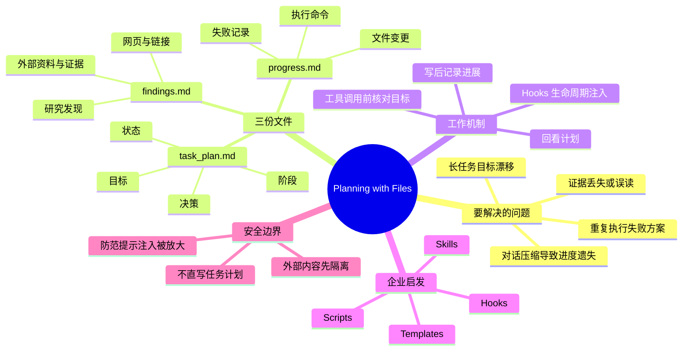

# Planning with Files 为什么爆火：把 AI Agent 的工作记忆写进三个 Markdown 文件

> 来源：[Bilibili 视频](https://www.bilibili.com/video/BV164VV6uE5E)  
> UP 主：产品总监看AI｜合集：AIcode｜时长：4 分 42 秒  
> 标签：AIAgent、ClaudeCode、开源项目、AI 编程、Planning with Files  
> 项目地址（视频简介提供）：<https://github.com/OthmanAdi/planning-with-files>

## 小结

视频介绍了一个名为 **Planning with Files** 的 Agent 工作流：不依赖新模型或复杂平台，而是在项目目录中让 Agent 持续维护三个 Markdown 文件，把原本易随对话压缩、任务延长而丢失的“工作记忆”落到可读、可查、可交接的文件中。

三个文件分别承担不同职责：`task_plan.md` 保存目标、阶段、状态与决策；`findings.md` 保存网页、链接、研究结论等外部资料和证据；`progress.md` 记录执行过的命令、改动过的文件、失败步骤与进展。视频的核心观点不是“Markdown 本身神奇”，而是**计划、证据、执行日志三者必须分工隔离**。

该方法针对长任务中 Agent 常见的工作流问题：目标漂移、证据丢失或误读、重复尝试已失败的方案，以及执行过程仅留在短暂对话上下文中。视频特别以“修一个接口却重构半个模块”“失败命令换一种写法又执行一遍”说明这种失控。

工作流还依赖 Hooks：在用户发言、工具调用前后、停止前及上下文压缩前等生命周期节点，让 Agent 回看当前计划、核对目标并补记进展。视频将其视为可安装、可迁移、可检查的 `skills`、hooks、模板和脚本组合，而不仅是更长的一段 Prompt。

安全边界是视频最重要的限制之一：外部网页和搜索结果不应直接写入会被 Hook 高频自动读取的 `task_plan.md`，而应先进入 `findings.md` 这类证据区。否则恶意外部内容可能借由反复注入上下文而被放大。该思路尤其适用于需读取大量外部材料的客服、投标、研发等企业 Agent。

视频简介声称该项目拥有“两万 Star”，并提及“Meta 收购 Manus 之后这个项目突然火了”；但本次提供的 ASR 正文未展开这些新闻性说法，且素材中没有 GitHub 实时数据、收购公告或日期证据。因此，它们只能作为**视频简介中的发布时观点**，不能据此确认当前 Star 数、项目热度或事件因果关系。

## 思维导图

## 目录

- [背景：Agent 跑得快，也忘得快](#背景agent-跑得快也忘得快)
- [三份文件：把工作记忆分开存放](#三份文件把工作记忆分开存放)
- [Hooks：在生命周期中把 Agent 拉回计划](#hooks在生命周期中把-agent-拉回计划)
- [从 Prompt 到可迁移工作规程](#从-prompt-到可迁移工作规程)
- [安全边界：外部资料不能直接成为指令](#安全边界外部资料不能直接成为指令)
- [落地检查清单与适用范围](#落地检查清单与适用范围)
- [结论、限制与时效性](#结论限制与时效性)
- [字幕比对](#字幕比对)
- [评论分析](#评论分析)
- [处理记录](#处理记录)

## 背景：Agent 跑得快，也忘得快 [00:00:01](https://www.bilibili.com/video/BV164VV6uE5E?t=1)

视频开场将 Planning with Files 定义为一种“看起来很土、但很有效”的 Agent 工作流。其关键并非产生了新的模型能力，而是为 Agent 建立了可以落盘的工作记忆：在项目目录中持续维护计划、发现和进展。

在较长的任务链条里，模型可以持续执行，但跑过几十步后可能偏离最初目标。视频将这类失败归因于流程组织随意，而不完全是模型“不够会做”。具体表现包括：

1. **目标漂移**：原本只需要修复接口，后续却可能开始重构半个模块。
2. **证据丢失或错读**：研究到的资料、网页内容、链接及其结论没有被单独保留，后续难以追溯。
3. **错误重复**：已经失败的命令或不可行 API 路径若未记录，下一轮可能被再次尝试。
4. **进度留在对话中**：当会话过长、发生上下文压缩或任务转交时，执行历史可能不再可见。

> 图：画面直接写出“Agent 跑得快，也忘得快”及“长任务不是只考智力，也考记忆和自我校准”。它概括了视频的问题定义：长任务的瓶颈不仅是推理能力，也是目标维持与过程校正。

> 图：画面列出“目标漂移、证据丢失、错误重复”，并将问题归因为工作方式。这对应视频对失败来源的判断，而非单纯归咎于模型能力。

## 三份文件：把工作记忆分开存放 [00:00:25](https://www.bilibili.com/video/BV164VV6uE5E?t=25)

视频提出的最小结构是“三份文件、三种责任”。文件名与职责如下：

| 文件 | 视频中的职责 | 应记录的内容 | 不应混入的内容 |
| --- | --- | --- | --- |
| `task_plan.md` | 管目标和决策 | 当前目标、任务阶段、状态、关键决策 | 原始网页内容、零散执行日志 |
| `findings.md` | 管资料和证据 | 网页、链接、研究发现、外部资料 | 直接可执行的任务指令、进度流水账 |
| `progress.md` | 管命令、变更和错误 | 已运行命令、已修改文件、成功/失败步骤、错误痕迹 | 未经验证的资料堆积、目标定义 |

视频强调，Markdown 只是承载形式，真正有效的是职责分离：

- 计划不能和资料混在一起；
- 资料不能和进度混在一起；
- 进度不能只留在对话里。

可以把这套结构理解为 Agent 的“工作台账”：人类在复杂项目中不会只依赖脑中记忆，Agent 执行长任务也需要可外部化、可回看的工作记录。

> 图：关键帧以“Markdown 不神奇，分工才关键”为标题，并明确写出“计划、资料和进度，不能混成一团”。这张图最直观地呈现了三文件方法的设计原则。

### 三份文件的实际阅读顺序 [00:01:13](https://www.bilibili.com/video/BV164VV6uE5E?t=73)

视频分别补充了三份文件在工作中的作用：

- **先看 `task_plan.md`**：让 Agent 知道当前要去哪里；目标、阶段、状态、决策都应放入其中。
- **外部信息先写 `findings.md`**：网页、链接、研究发现及外部资料先进入证据区，不能直接转化为任务指令。
- **执行后写 `progress.md`**：实际跑过哪些命令、改过哪些文件、哪一步失败，都需要留痕。

据此可以整理出一个与视频一致的循环：

1. 读取 `task_plan.md`，确认任务目标与当前阶段；
2. 收集到的新资料先写入 `findings.md`，保留来源和证据属性；
3. 根据计划和已验证证据执行工具调用或代码修改；
4. 将命令、变更、结果与失败原因写入 `progress.md`；
5. 如有决策变化，再更新 `task_plan.md`，进入下一轮。

> 注意：视频说明了文件责任与工作循环，但没有提供仓库中的具体安装命令、Hook 配置文件、字段格式或模板全文。上述顺序是根据视频明确描述整理的流程，不应视作项目官方配置语法。

## Hooks：在生命周期中把 Agent 拉回计划 [00:02:02](https://www.bilibili.com/video/BV164VV6uE5E?t=122)

视频认为爆火点不止是三份 Markdown，更关键的是 Hooks 对工作流的介入。Hooks 在多个生命周期节点将 Agent 拉回计划与记录：

| 生命周期节点 | 视频描述的作用 |
| --- | --- |
| 用户发来新消息时 | 先回看计划 |
| 工具调用前 | 确认当前目标 |
| 工具调用后 / 写完文件后 | 提醒自己记录进展 |
| 停止前 | 回顾是否已更新相关记录 |
| 上下文压缩前 | 将当前计划与近期进展重新带入工作上下文 |

视频的比喻是：Agent 正要伸手做事前，有人拍一下肩膀提醒“先别急，看看任务”。这种机制不是替 Agent 执行，而是反复提供目标约束和过程提示，降低它在连续行动中的偏航概率。

从结构上看：

- 三份文件承接三类记忆：目标/决策、证据、执行痕迹；
- Hooks 在生命周期中反复注入当前计划和近期进展；
- 二者结合，使工作记忆不完全依赖单次上下文窗口。

### 需要注意的参数与边界

本视频素材没有给出 Hook 的具体触发名称、配置参数、代码片段、上下文注入长度、token 预算或自动更新频率。因此，无法据此复现某个特定客户端的 Hooks 配置。

实践时应额外确认所使用 Agent 客户端是否支持：

- 用户消息前后的 Hook；
- 工具调用前后的 Hook；
- 停止前 Hook；
- 上下文压缩前 Hook；
- 文件读写权限、路径范围与人工审查机制。

## 从 Prompt 到可迁移工作规程 [00:02:26](https://www.bilibili.com/video/BV164VV6uE5E?t=146)

视频进一步将 Planning with Files 关联到 Agent Skills 的另一层含义：Skills 不只是更长的提示词，而是一组可以**安装、迁移、检查**的工作规程。

它提出的组织层面问题包括：

- 这套做法能否交给新人？
- 换一个项目后能否继续使用？
- 换一个 Agent 客户端后能否复用？
- 能否以一致方式检查其执行过程和结果？

视频的判断是，未来企业中的 Agent 能力未必都以完整、单体的 Agent 应用形式出现，也可能拆分为以下构件：

- `skills`：可复用的工作能力或规程；
- hooks：在特定生命周期触发的约束或检查；
- templates：统一的计划、资料、进展记录模板；
- scripts：将部分重复流程自动化的脚本。

这意味着团队不应只依赖某个人“会写 Prompt”。更可迁移的资产，是将目标管理、资料隔离、执行记录与检查动作固化为团队可复用的工作方式。

## 安全边界：外部资料不能直接成为指令 [00:02:51](https://www.bilibili.com/video/BV164VV6uE5E?t=171)

视频明确提示：记忆增强会引入新的风险。

如果某一个文件会被高频注入 Agent 上下文，恶意外部内容也可能被反复带入，进而被放大。视频给出的边界原则是：

> 网页和搜索结果应进入 `findings.md`，而不是直接进入会被 Hooks 自动读取的 `task_plan.md`。

其中的安全逻辑是：

1. 网页、搜索结果、客户材料、报错信息都属于外部或半可信输入；
2. 这些材料可能包含不准确、误导性或试图改变 Agent 行为的内容；
3. 如果它们直接混入计划文件，就可能被反复视作高优先级任务上下文；
4. 先放入证据区，可以保留可追溯性，同时避免未经审查的内容直接成为行动指令。

视频特别指出，企业 Agent——包括客服 Agent、投标 Agent、研发 Agent——都可能持续读取外部材料；读取越多，越需要隔离层。

### 可迁移的安全实践 [00:03:15](https://www.bilibili.com/video/BV164VV6uE5E?t=195)

基于视频提出的边界，可以形成以下操作原则：

- **计划文件只写可信的任务状态与决策**：由用户、负责人或经过审查的流程更新。
- **证据文件容纳外部材料**：记录网页、论文、客户资料和报错信息，但保留其来源属性，不默认其为指令。
- **执行日志可审计**：将失败命令、失败原因及不可行路径写入 `progress.md`。
- **将“资料”与“指令”区分开**：资料支持决策，但不自动改变目标。
- **对高频注入文件设置更严格的写入规则**：视频没有给出具体权限方案，但风险提示表明这些文件需要更谨慎的来源控制。

## 落地检查清单与适用范围 [00:03:39](https://www.bilibili.com/video/BV164VV6uE5E?t=219)

视频建议，在讨论“该换哪个模型”之前，先检查三个更具体的问题：

1. **Agent 有没有任务计划文件？**  
   是否存在独立文件保存当前目标、阶段、状态与决策，而不是仅存在于对话提示词中？

2. **外部资料有没有单独存放？**  
   网页、论文、客户材料、报错信息是否可追溯？是否与任务指令混在一起？

3. **错误有没有被记录？**  
   一个命令失败、一个 API 路径走不通后，是否留下可供后续 Agent 或成员读取的记录？如果没有，下一轮可能重复尝试。

### 适合的场景

视频末尾点名了适用流程：

- 研发；
- 运营；
- 投标；
- 交付；
- 以及需要读取外部材料、执行多步骤任务的企业 Agent 场景。

其共同特点是：任务时间较长、步骤较多、可用工具较多、信息来源复杂，且需要交接、复查或审计。

### 不应过度解读的地方

- 三个文件不是自动提升模型推理能力的“魔法”；
- 文件多不等于工作流更好，视频强调的是朴素、可保存、可复查、可交接、可审计；
- 该方法不能替代权限管理、来源验证、人工审批或安全治理；
- 视频没有展示端到端的真实项目案例、量化成功率或与其他框架的对照实验，因此不能从本片推导具体效率增幅。

## 结论、限制与时效性 [00:04:03](https://www.bilibili.com/video/BV164VV6uE5E?t=243)

视频的最终结论是：可靠的 Agent 工作流不应只让模型“一口气跑到底”，而应让模型负责向前执行，让文件不断提醒它不要跑偏。对于希望把 Agent 用于研发、运营、投标或交付的团队，可以从三个最基础的问题开始：是否记住了目标、证据和进展。

> 图：封面将 `task_plan.md`、`findings.md`、`progress.md` 与 Agent 工作流程并列展示，适合作为全文方法框架的总览。画面文字强调“把 AI Agent 的工作记忆写进三个 Markdown 文件”。

### 视频中可确认的价值

- 以文本文件保存工作状态，便于阅读、版本管理、复查、交接与审计；
- 通过职责分离降低目标、资料和进度混杂；
- 通过 Hooks 增加长任务过程中的目标回看与记录动作；
- 通过资料隔离降低外部内容直接污染高优先级工作记忆的风险。

### 时效性说明

- 视频时长为 282 秒，元数据抓取时间为 2026-07-16。
- 视频简介中的 GitHub Star 数、“爆火”状态和 Meta/Manus 相关说法均可能随时间变化。
- 本素材未提供 GitHub 当前页面、项目版本、提交记录、Meta 或 Manus 的一手公告，不能确认截至本文生成时的实时状态。
- 视频将方法表述为可用于 Agent 的工作流原则；具体支持程度仍取决于实际客户端、Hook 机制、文件权限、上下文策略和团队流程。

## 字幕比对

| 字幕来源 | 完整性 | 专有名词 | 时间轴 | 主要问题 |
| --- | --- | --- | --- | --- |
| Bilibili 站内字幕 `p01-ai-zh.srt` | 不完整，仅覆盖约 00:00:00–00:00:42 | 无有效正文，均为“♪ 音乐 ♪” | 有真实时间段，但无法表达语义 | 只有音乐标注，不能用于内容整理 |
| 本次 ASR 字幕 | 高，语音覆盖约 280.24 秒，占全片约 99.3% | 存在多处英文名词和文件名误识别 | 有完整分段时间轴，首段 00:00:01.140，末段 00:04:41.940 | 如 `Planing with File`、`Task plan Amp`、`Findings Amp`、`fighting m` 等识别不准 |

### 最终字幕选择

正文以**本次 ASR 的时间轴**为主，因为其覆盖 12 个连续语音段，诊断结果显示语言为中文、置信概率约 `0.9976`、无大间隔，且未标记 `noAudioStream=true`；说明源视频存在音轨，本次 ASR 可用。

站内字幕已检查，但只提供音乐标记，无法承担语义转写任务。因此未采用站内字幕正文，仅保留其“时间轴存在但内容无效”的比对结论。

### 结合上下文与关键帧校正的重点词语

| ASR 原文或近似识别 | 正文采用的校正 | 校正依据 |
| --- | --- | --- |
| `Planing with File` / `twinning with files` | Planning with Files | 视频标题、简介及封面画面 |
| `Task plan Amp` | `task_plan.md` | 视频标题图片、简介明确列出文件名 |
| `Findings Amp` / `fighting m` | `findings.md` | 视频标题图片、简介明确列出文件名 |
| `Progress` / `Progress Amp` | `progress.md` | 视频标题图片、简介明确列出文件名 |
| `hooks` | Hooks | ASR 上下文连续提及生命周期触发点 |
| `as defined` | 此处未作为确定术语引用 | ASR 英文片段不清晰，素材不足以确认原词 |
| `scripters` | scripts | ASR 语境为 skills、hooks、templates 与脚本组成的规程，采用审慎规范化表述 |

## 评论分析

以下仅分析当前可获取的热评前三条；评论代表用户观点，不构成已验证事实。

### 1. 丢钱钱（3 赞）

评论将三份文件类比为“认知脚手架”：

- `task_plan.md` 类似前额叶皮层，负责目标维持与规划；
- `findings.md` 类似海马体/长期记忆，负责知识存储与模式提取；
- `progress.md` 类似小脑/运动皮层，负责执行控制与错误修正。

这一类比有助于理解三文件的功能分工，与视频“工作台账”“目标、证据、进展分离”的主旨一致。需要注意的是，这是一种帮助理解的比喻，并不是神经科学意义上的严格一一对应，也不是视频所提供的实验结论。

### 2. HuangYc492（1 赞）

评论请求进一步总结“每个文件负责什么事、如何配置和使用”。这反映出观众最实际的需求是落地细节，而本视频重点在方法框架、职责与安全边界，未展示具体配置命令或客户端操作。

对该需求，视频能够直接回答的是三个文件的责任边界与 Hooks 的触发思路；至于“如何配置”，仍需查看项目仓库、目标 Agent 客户端文档及实际权限设置，不能仅凭视频转写补全。

### 3. 本昵称已被使用（1 赞）

评论提出疑问：“这不是 opensepc 在做的事吗？”该评论试图把 Planning with Files 与另一个名称相近或功能相似的方案比较。

但素材未提供“opensepc”的准确拼写、项目链接、功能说明或比较证据，因此无法判断二者是否为同一项目、实现相似，还是仅共享“计划与执行管理”的理念。这一问题可视为待核验的生态对比，而不能据此下结论。

## 处理记录

- Worker ID：`worker-mrj0www4-e8d79408`
- 模型：`gpt-5.6-terra`
- 可用素材与工具产物：视频元数据、站内字幕 `p01-ai-zh.srt`、本次 ASR 结果 `asr/asr-result.json`、ASR SRT `asr/transcript.srt`、关键帧目录 `frames/`、热评数据 `comments/comments.json`。
- 字幕检查与选择：已检查站内字幕与本次 ASR。站内字幕仅有 00:00:00.160–00:00:42.080 的音乐标注；本次 ASR 覆盖 00:00:01.140–00:04:41.940，语音覆盖率 `0.993`，故以 ASR 时间轴为准，并结合标题、简介和关键帧校正文件名及术语。
- 音轨判断：ASR 诊断未标记 `noAudioStream=true`，且提供了约 280.24 秒语音内容；因此源视频并非无音轨，未将站内字幕缺失正文误判为工具失败。
- 关键帧选择依据：
  - `frames/frame-001.jpg`：封面呈现 Planning with Files 与三文件框架，适合总览；
  - `frames/frame-002.jpg`：呈现“Agent 跑得快，也忘得快”，对应问题定义；
  - `frames/frame-003.jpg`：呈现目标漂移、证据丢失、错误重复，对应失败机制；
  - `frames/frame-004.jpg`：呈现“Markdown 不神奇，分工才关键”，直接支持核心原则。
- 缓存清理：素材清单未提供缓存清理执行记录；本文不虚构清理结果。
- 未解决问题：
  - 未提供项目仓库快照、安装命令、Hooks 配置文本或版本号，无法复现具体部署；
  - 视频简介中的 Star 数、项目热度与 Meta/Manus 事件未获一手材料验证；
  - ASR 若干英文术语存在误识别，已仅对有标题、简介、画面和上下文共同支持的部分进行校正。
