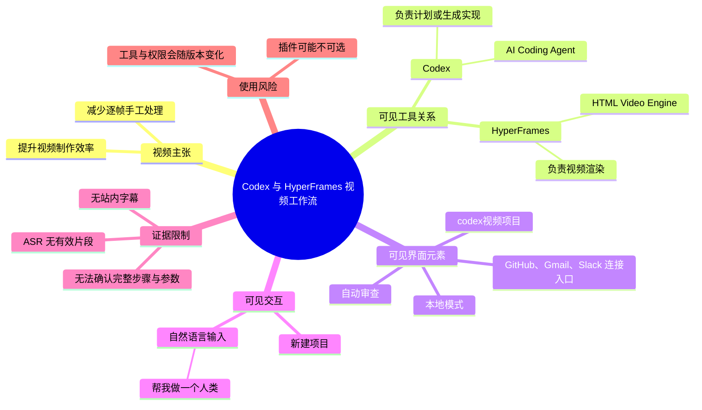
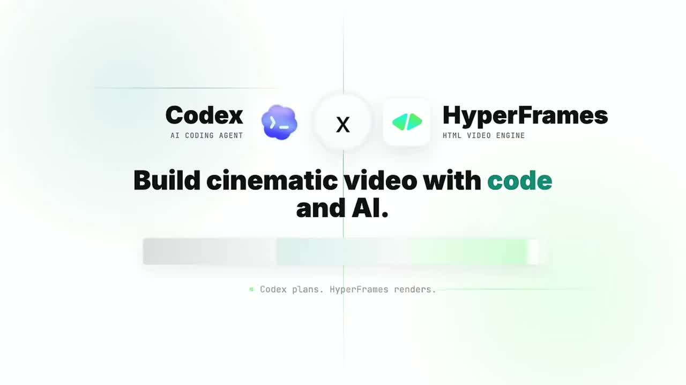
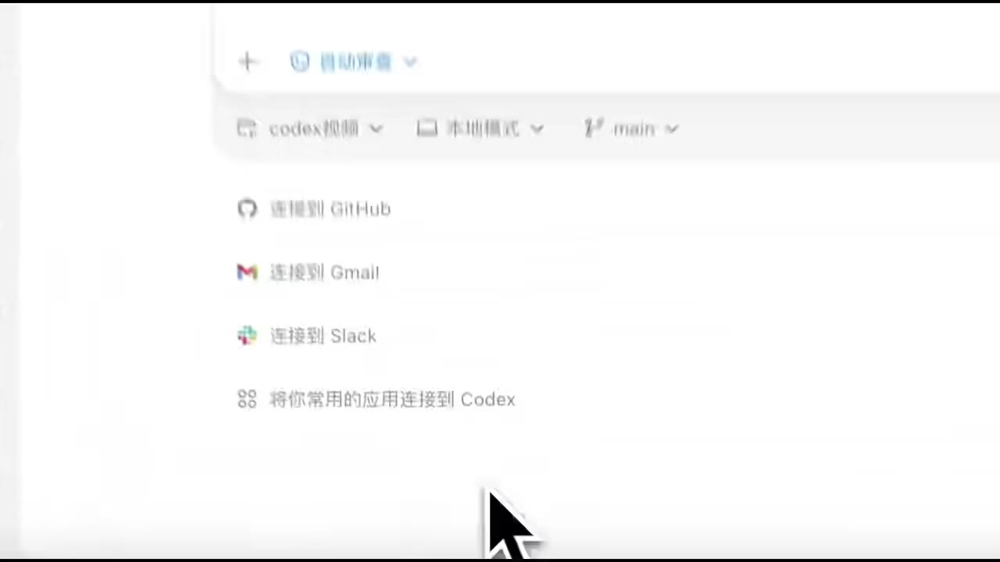

# Codex 真的牛！还在剪映里一帧一帧手动抠视频？醒醒，AI已经把剪辑效率卷疯了

> 来源：[Bilibili 视频](https://www.bilibili.com/video/BV176dcBgERR)  
> UP 主：vippp_ai｜合集：AIcode｜视频时长：48 秒｜画面规格：1920×1080  
> 标签：AI、视频、效率

## 小结

视频以“逐帧手动处理视频”的传统剪辑工作流为对照，展示了一个将 **Codex** 与 **HyperFrames** 组合用于代码化视频生成/渲染的方向。开场画面直接写出“Codex plans. HyperFrames renders.”，即由 Codex 负责规划或生成实现思路，由 HyperFrames 作为 HTML 视频引擎执行渲染。

从提供的画面可以确认，演示过程涉及一个名为“codex视频”的项目或工作区、项目创建输入框、本地模式（“本地模式”）以及 GitHub、Gmail、Slack 等连接入口。画面中还出现“自动审查”选项，说明该工作界面至少提供了审查模式配置；但素材未展示其具体逻辑、权限范围或实际执行结果，不能将其延伸解释为自动发布、自动剪辑或完全无人值守。

视频中可见的输入示例为“帮我做一个人类”，说明演示意图是通过自然语言发起创作请求。不过，ASR 未识别出任何有效语音片段，站内字幕也不可用，因此无法可靠还原完整提示词、生成步骤、代码内容、渲染参数、输出文件或作者口播观点。

该内容适合关注 AI 编程代理、网页/HTML 动画、程序化视频生成与剪辑自动化的人作为工具方向参考。它不是一份可直接复现的完整教程：工具安装方式、HyperFrames 的项目配置、Codex 的版本与授权、插件启用条件、导出配置及成片质量均未在可用文本素材中得到确认。

信息具有时效性。视频元数据发布时间为 2026 年 5 月，抓取时间为 2026 年 7 月；Codex、插件市场、连接器权限以及 HyperFrames 的可用性和界面都可能在之后发生变化。尤其是评论中出现“插件”处于灰色不可选状态的反馈，实际使用前应以当时产品界面、账户权限与官方文档为准。

## 思维导图

## 目录

- [视频定位与可确认信息](#视频定位与可确认信息)
- [Codex 与 HyperFrames 的画面主张](#codex-与-hyperframes-的画面主张)
- [可见工作区与连接能力](#可见工作区与连接能力)
- [自然语言创建项目的演示](#自然语言创建项目的演示)
- [可迁移的实践思路与限制](#可迁移的实践思路与限制)
- [关键帧索引](#关键帧索引)
- [字幕比对](#字幕比对)
- [评论分析](#评论分析)
- [处理记录](#处理记录)

## 视频定位与可确认信息 [00:00](https://www.bilibili.com/video/BV176dcBgERR?t=0)

视频标题将其定位为：借助 AI 改变视频编辑效率，减少在剪映等传统工具中“一帧一帧手动抠视频”的工作。可用画面进一步表明，视频实际展示的不是剪映操作界面，而是 Codex 与 HyperFrames 的组合概念及相关工作区界面。

需要区分以下三层信息：

1. **视频标题的表达**：强调 AI 可以把视频剪辑效率“卷疯了”，这是一种宣传性、主观性措辞，不等于对效率提升倍数或成片质量的可验证承诺。
2. **画面可确认的事实**：Codex 被标为 “AI CODING AGENT”，HyperFrames 被标为 “HTML VIDEO ENGINE”；二者之间以乘号连接，并配有“Build cinematic video with code and AI.”文案。
3. **无法由素材确认的内容**：没有可用字幕或有效 ASR，因而无法确认作者是否讲解了安装、账号要求、实际代码、插件来源、模板地址、运行命令、渲染时长、费用或导出参数。

该视频全长 48 秒；本次 ASR 诊断没有产生任何带时间戳的语音分段。因此，除视频起点 `00:00` 外，不能基于文字顺序臆造各画面的精确出现秒数。下文涉及的画面按关键帧内容组织，不将其误标为已验证的精确时间点。

## Codex 与 HyperFrames 的画面主张 [00:00](https://www.bilibili.com/video/BV176dcBgERR?t=0)

开场关键帧同时呈现 Codex、HyperFrames 及其职责分工：

- **Codex**：画面英文副标题为 `AI CODING AGENT`，可确定其在视频中被定位为 AI 编程代理。
- **HyperFrames**：画面英文副标题为 `HTML VIDEO ENGINE`，可确定其在视频中被定位为 HTML 视频引擎。
- **组合表达**：画面写有 `Codex plans. HyperFrames renders.`，可按字面理解为“Codex 负责规划，HyperFrames 负责渲染”。
- **目标**：`Build cinematic video with code and AI.` 表示以代码和 AI 构建具有电影感的视频。

> 图：开场标题画面明确给出 Codex（AI Coding Agent）与 HyperFrames（HTML Video Engine）的名称、角色标签和“规划—渲染”关系。这是正文中工具关系最直接的视觉证据，但它不展示具体代码或渲染结果，因此不能据此推断完整技术栈。

从方法论角度，这种表述指向“程序化视频”而非纯时间线剪辑：创作者把部分视觉设计、动画逻辑或素材编排转交给代码与生成式代理，再通过渲染引擎输出视频。相较逐帧手工操作，其潜在优势通常在于可重复生成、便于批量改稿和可复用模板；但这些属于一般工作流层面的分析，并非本视频已展示的量化结果。

### 视频未提供的关键技术证据

以下信息对实际复现至关重要，但在提供素材中均未出现：

| 项目 | 素材状态 | 不能据此推断的内容 |
| --- | --- | --- |
| Codex 版本与入口 | 仅可见 Codex 名称及界面 | 具体产品版本、是否需要订阅、支持的平台 |
| HyperFrames 获取方式 | 仅可见工具名称与定位 | 官网地址、安装命令、开源许可、依赖版本 |
| 代码 | 未提供 | 项目结构、语言、组件、动画实现、API 调用 |
| 视频输入/输出 | 未提供 | 素材格式、分辨率、帧率、编码器、导出路径 |
| 性能数据 | 未提供 | 渲染时长、GPU/CPU 占用、成本、效率倍数 |
| 成片演示 | 所给关键帧未展示成片对比 | 实际画质、稳定性、可控性与修改成本 |

## 可见工作区与连接能力 [00:00](https://www.bilibili.com/video/BV176dcBgERR?t=0)

一张工作区画面中，可见项目/下拉菜单与若干连接选项：

- 项目或工作区名称可见为“codex视频”；
- 界面中可见“本地模式”；
- 分支位置可见 `main`；
- 连接选项包括“连接到 GitHub”“连接到 Gmail”“连接到 Slack”；
- 另有“将你常用的应用连接到 Codex”的入口文案。

> 图：该帧的价值在于证明视频演示的工作界面提供本地模式及第三方应用连接入口，并显示 GitHub、Gmail、Slack 三类连接目标。它没有显示已连接成功的状态，也没有显示任何授权范围或调用记录。

这些界面元素可以作如下谨慎解读：

1. **本地模式**：画面确实出现“本地模式”文字，但没有展示它对应的文件系统权限、命令执行权限、沙箱机制或网络访问策略。因此不能把它等同于“可直接控制本机全部文件”。
2. **GitHub、Gmail、Slack**：它们以“连接到”的选项出现，说明界面提供或宣传相关连接能力；但未见连接后的实际数据读取、写入、消息发送或仓库提交。
3. **`main` 分支**：画面显示 `main`，可作为该项目可能与 Git 分支概念关联的可见线索；不能确认是否已初始化仓库、是否已推送远端、是否存在提交记录。
4. **权限与隐私**：一旦连接代码仓库、邮件或团队聊天工具，授权令牌、数据范围和操作审查就成为实际使用中不可跳过的环节。本视频可见“自动审查”字样，但未说明其审查对象和边界，不能把它视为安全保障结论。

## 自然语言创建项目的演示 [00:00](https://www.bilibili.com/video/BV176dcBgERR?t=0)

画面显示一个新建项目提问界面，标题为“要在 New project 9 中构建什么？”。输入框中可见文本为：

> 帮我做一个人类

同一界面还可见：

- `codex视频` 下拉项；
- “本地模式”；
- `main`；
- “自动审查”下拉选项；
- “连接到 GitHub”入口。

> 图：该帧展示了自然语言输入作为项目创建起点，以及项目、模式、分支、审查和 GitHub 连接等周边控件。它能够支持“通过提示词发起任务”的描述，但未显示提交后响应，不能证明该提示词已成功生成“人类”动画或视频。

### 可从该界面提炼的操作骨架

以下是**基于画面可见控件整理的最小操作骨架**，并不代表视频展示了每一步的实际完成结果：

1. 创建或进入一个项目，界面示例名称为 `New project 9`。
2. 在输入框中用自然语言描述想构建的内容；视频示例文本为“帮我做一个人类”。
3. 留意当前项目/工作区指向，画面中可见“codex视频”。
4. 确认运行或操作模式，画面可见“本地模式”。
5. 若项目涉及版本控制，确认当前分支；画面显示为 `main`。
6. 根据需求查看“自动审查”相关选项及 GitHub 连接入口。
7. 对生成的代码、素材引用、权限请求和输出结果进行人工复核。

其中第 7 步是为安全与质量控制提出的实践建议，而非对视频已展示功能的陈述。因为有效字幕缺失，无法确认视频中是否演示了提交提示词、生成文件、启动渲染或导出结果。

### 插件检索失败画面 [00:00](https://www.bilibili.com/video/BV176dcBgERR?t=0)

另一张关键帧显示搜索框输入了 `hy`，候选词中出现“还有”“还要”“会有”“好友”等中文输入法候选，画面右下角明确显示“未找到插件”。

> 图：该帧表明演示中至少出现过“未找到插件”的状态。它对理解实际落地风险很重要：工具、插件或搜索条件未必在每个环境中可用。画面未显示完整搜索关键词，不能断言被搜索的插件就是 HyperFrames。

这个状态与热评中“插件这一栏灰色不可选中”的反馈相互呼应：用户实际操作时可能会遇到功能入口不可用、插件未安装、账户权限不足、区域/版本差异或搜索词不匹配等问题。但两者都不足以确定根因，排查仍应以产品提示和官方支持文档为准。

## 可迁移的实践思路与限制 [00:00](https://www.bilibili.com/video/BV176dcBgERR?t=0)

### 可迁移经验

在不超出素材证据范围的前提下，本视频可提炼出以下工作流思路：

1. **先把视频任务描述为可执行目标**  
   以自然语言定义创作对象或效果，例如画面中的“帮我做一个人类”。实践中应进一步补足主体、场景、时长、镜头、风格、文字、音乐、输出尺寸等约束，避免需求过于抽象。

2. **把“规划”和“渲染”拆开看待**  
   视频开场明确使用了“Codex plans. HyperFrames renders.”的表述。无论具体工具实现如何，先由代理辅助组织逻辑或生成代码、再由专门引擎渲染，是一种可理解的职责拆分方式。

3. **将项目与版本控制纳入创作流程**  
   画面中的 GitHub 连接入口与 `main` 分支提示，说明视频所展示的环境与软件项目式管理有关。对于可复用动画或批量视频，版本管理有助于追踪修改，但本视频未演示具体 Git 操作。

4. **连接外部服务前先确认权限**  
   GitHub、Gmail、Slack 都可能承载敏感数据。即使界面提供连接入口，也应坚持最小权限原则，并在启用自动化前确认操作是否需要人工审查。

### 复现前应补齐的需求清单

视频没有提供以下参数；若要将其转化为实际项目，需要自行确定：

| 类别 | 应明确的问题 |
| --- | --- |
| 创作目标 | 生成的是角色动画、信息图、剪辑包装还是完整短片？ |
| 视觉规格 | 横/竖屏、分辨率、帧率、时长、色彩风格、字体与素材来源是什么？ |
| 技术环境 | Codex 与 HyperFrames 的具体版本、操作系统、Node.js/浏览器等依赖是什么？ |
| 代码组织 | 是否采用组件化场景、时间轴配置、数据驱动模板？ |
| 渲染资源 | 使用本地还是云端渲染，是否需要 GPU，渲染失败如何重试？ |
| 输出要求 | 编码格式、码率、音频轨、字幕、封面与交付平台要求是什么？ |
| 安全控制 | 外部连接器的权限范围、密钥保存方式、自动审查内容及人工确认点是什么？ |

### 重要限制

- **没有可用的语音文本证据**：本次 ASR 输出为空，无法记录作者的口播教程、技术解释或主观评价。
- **没有站内字幕可交叉验证**：无法用官方/上传者字幕修正工具名、步骤顺序和术语。
- **关键帧不等于完整录像证据**：所提供关键帧只覆盖部分界面状态，不能证明完整工作流已跑通。
- **未展示最终成片**：无法评价“电影感”或“剪辑效率”是否达到标题暗示的程度。
- **插件可用性存在不确定性**：画面有“未找到插件”，热评也存在插件不可选反馈；实际可用性需要逐账户、逐版本验证。
- **时间轴精度受限**：ASR 没有任何时间分段，无法为关键帧内容建立可靠的秒级定位；本文不伪造中段时间点。

## 关键帧索引 [00:00](https://www.bilibili.com/video/BV176dcBgERR?t=0)

> 以下索引按所提供关键帧的可见内容整理。由于没有与关键帧绑定的原始时间戳，均不标注未经证实的出现秒数。

| 关键帧 | 可见内容 | 正文使用价值 |
| --- | --- | --- |
| `frames/frame-001.jpg` | Codex × HyperFrames；“Build cinematic video with code and AI.”；“Codex plans. HyperFrames renders.” | 直接确立视频的核心工具组合与角色分工。 |
| `frames/frame-002.jpg` | 搜索框输入 `hy`，右下角提示“未找到插件” | 呈现插件检索/可用性不确定这一实际限制。 |
| `frames/frame-003.jpg` | `codex视频`、本地模式、`main`、GitHub/Gmail/Slack 连接项 | 证明工作区存在本地模式、分支与外部应用连接入口。 |
| `frames/frame-004.jpg` | “要在 New project 9 中构建什么？”；输入“帮我做一个人类”；自动审查、本地模式、GitHub 入口 | 证明演示使用自然语言发起项目需求，并呈现相关配置控件。 |

其余提供的关键帧文件 `frame-005.jpg` 至 `frame-012.jpg` 未附对应画面内容或时间戳说明；为避免把未核实内容写入知识库，本文不对其进行推断性描述。

## 字幕比对 [00:00](https://www.bilibili.com/video/BV176dcBgERR?t=0)

| 字幕来源 | 完整性 | 专有名词 | 时间轴 | 主要问题 |
| --- | --- | --- | --- | --- |
| Bilibili 站内字幕 | 不可用：素材明确说明未提供可用站内字幕 | 无法核验 | 无可用分段 | 无法用站内字幕还原口播、步骤或术语。 |
| 本次 ASR 字幕 | 空：`segments` 为空，句子数为 0，语音覆盖率为 0 | 无法识别 | 无可用分段 | ASR 语言自动判断为英语，置信度约 0.541；诊断提示未识别到语音片段。 |

### ASR 检查结论

本次 ASR 已执行，模型为 `medium`，使用 CUDA 与 `float16` 推理，音频时长约为 **47.647 秒**。诊断结果为：

- `sentenceCount: 0`
- `speechSeconds: 0`
- `speechCoverage: 0`
- `segments: []`
- 警告：未识别到语音片段，建议检查源视频是否包含可听语音并确认正确音轨。

诊断信息**没有**标记 `noAudioStream=true`。因此，不能表述为“源视频没有音轨”；准确说法是：素材中确实生成了 `audio/audio.wav`，但 ASR 未能从该音频中识别出任何语音分段。造成结果为空的可能原因包括无口播、语音过弱、背景音乐/音效占主导、音轨内容不适合当前识别配置等；这些原因均未被当前素材进一步验证。

### 最终字幕选择与术语校正

最终未采用站内字幕或 ASR 文本作为正文事实来源，而是采用：

1. 视频标题与元数据；
2. 关键帧中可清晰辨认的中英文界面文字；
3. 热评原文。

通过关键帧确认、并在正文中保留原拼写的词语包括：

- `Codex`
- `HyperFrames`
- `AI CODING AGENT`
- `HTML VIDEO ENGINE`
- `Codex plans. HyperFrames renders.`
- `Build cinematic video with code and AI.`
- `codex视频`
- `本地模式`
- `main`
- `自动审查`
- `New project 9`
- `GitHub`、`Gmail`、`Slack`
- `未找到插件`

## 评论分析 [00:00](https://www.bilibili.com/video/BV176dcBgERR?t=0)

仅处理可获取热评前三条。评论反映的是个人使用感受或即时判断，不可替代工具功能验证。

### 1. “插件这一栏为啥是灰色的不可选中状态”

- **评论者**：似风起又落
- **获赞**：24
- **原文**：“第一次用，我插件这一栏为啥是灰色的不可选中状态”
- **可提供的信息**：评论者在首次使用时遇到了“插件”栏目灰色、无法选中的问题。
- **与视频的关联**：视频关键帧中也出现“未找到插件”，两者共同提示插件能力可能是实际操作的摩擦点。
- **可信度与边界**：该评论未给出系统版本、账户类型、网络环境、插件安装状态、权限策略或报错截图，无法据此判断是普遍问题，还是该用户环境的个例。不能据此得出“插件功能不可用”的结论。

### 2. “我也试试”

- **评论者**：闷油瓶wx
- **获赞**：9
- **原文**：“我也试试”
- **可提供的信息**：反映该内容对观众具有尝试吸引力。
- **可信度与边界**：没有提供操作结果、成功条件或技术补充，对工具能力没有实质验证价值。

### 3. “这不就跟ppt动画做视频差不多嘛”

- **评论者**：農積勇大佬
- **获赞**：6
- **原文**：“这不就跟ppt动画做视频差不多嘛”
- **可提供的信息**：评论者将视频所展示的效果/思路类比为使用 PPT 动画制作视频，反映其对程序化动画或演示型视频的一种理解。
- **可信度与边界**：这是一种主观类比。当前素材未展示最终视频成片、动画细节或代码实现，无法验证其与 PPT 动画在能力、效率、可编程性和渲染方式上是否相当。

## 评论分析

- 热评 1：第一次用，我插件这一栏为啥是灰色的不可选中状态
- 热评 2：我也试试
- 热评 3：这不就跟ppt动画做视频差不多嘛

以上内容是观众反馈摘录，只用于补充理解视频反响，不作为正文事实依据。

## 处理记录

- **Worker ID**：`worker-mrj0www4-e8d79408`
- **模型**：`gpt-5.6-terra`
- **调用工具与模型信息**：素材侧已提供 ASR 结果；ASR 模型为 `medium`，自动语言检测为 `en`，语言置信度 `0.541015625`，使用 `cuda` / `float16`。
- **使用的素材工具产物**：`merged.mp4`、`audio/audio.wav`、`frames/`、`asr/transcript.srt`、`asr/asr-transcript.txt`、`asr/asr-result.json`、`comments/comments.json`、`info.json`。
- **字幕检查与选择**：已检查站内字幕与本次 ASR。站内字幕未提供可用内容；本次 ASR 没有产生语音分段，未采用任何 ASR 文本。正文以视频元数据、标题、关键帧可读文字和热评为证据来源。
- **时间轴依据**：没有可用站内 SRT，也没有 ASR 时间分段；仅使用视频真实起点 `00:00`（`t=0`）作为章节链接，未按文本顺序猜测中段秒数。
- **关键帧选择依据**：选用 `frame-001` 证明 Codex 与 HyperFrames 的工具定位；`frame-002` 记录“未找到插件”的限制；`frame-003` 证明本地模式、分支与外部连接入口；`frame-004` 证明自然语言建项与可见配置项。其余关键帧未提供可核验的画面说明或时间信息，未作推断性引用。
- **缓存清理**：未提供缓存清理执行日志，无法确认是否已清理；不虚构清理结果。
- **未解决问题**：
  - 视频是否包含可听口播，以及 ASR 未识别语音的具体原因；
  - HyperFrames 的安装来源、版本、许可证与实际配置；
  - Codex 的具体运行环境、账户要求与插件启用条件；
  - “自动审查”的具体审查范围和行为；
  - 输入“帮我做一个人类”后的实际生成结果；
  - 视频最终成片、渲染性能、导出参数与效率对比数据。
