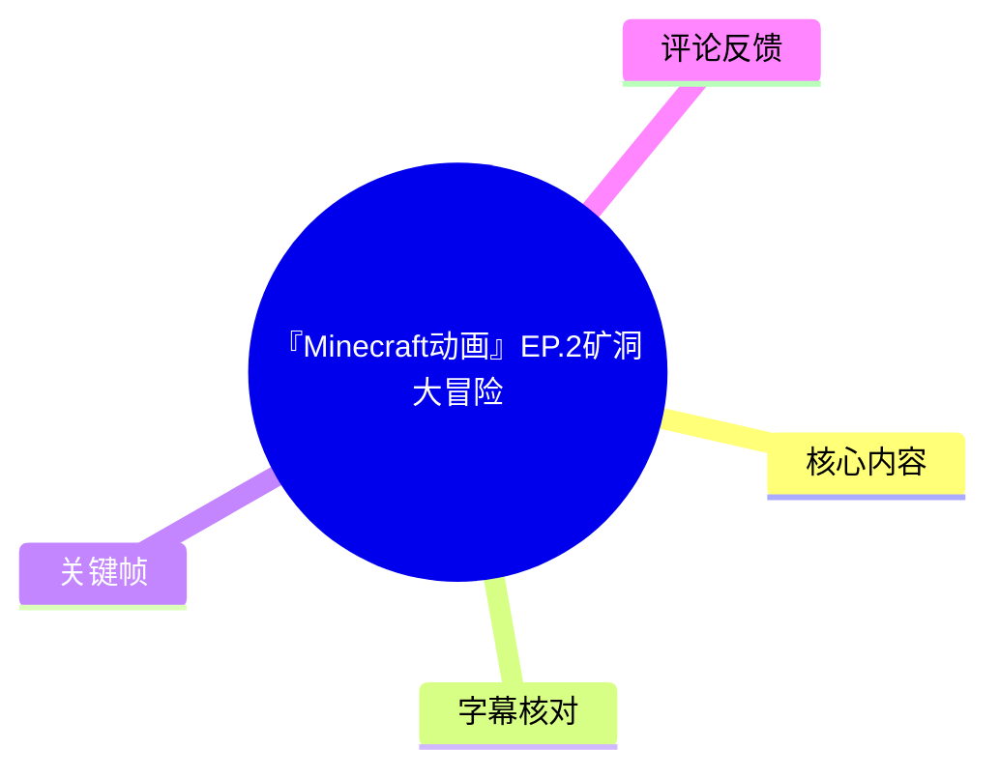
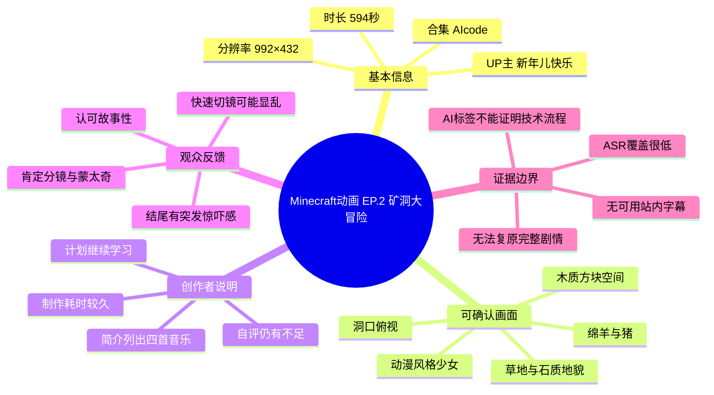
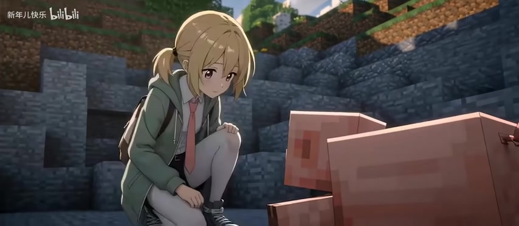

## 小结

《『Minecraft动画』EP.2矿洞大冒险》是 UP 主「新年儿快乐」发布的一支 Minecraft 题材动画，时长 594 秒（09:54），画面规格为 992×432，收录于合集「AIcode」。作品将动漫风格的金发双马尾少女置于 Minecraft 式方块地形、生物和洞口环境中，形成角色高细节造型与像素化世界并置的视觉风格。

从提供的关键帧可直接确认：角色处于木质方块空间、草地与石质地貌附近；画面出现洞口俯视构图、绵羊和猪等 Minecraft 标志性生物。标题中的“矿洞大冒险”与洞口画面相互呼应，但现有素材不能可靠复原完整剧情，不能确认角色是否实际进入矿洞、遭遇何种危险，或进行了采矿等具体玩法行为。

视频简介显示，创作者称本期“做了挺久的”，并表示已尽力完成但仍对部分处理不满意，希望继续学习、在下一次做得更好。简介还列出了使用音乐：*Dinner Is Not Over*、*Good Mouse*、*Stal*、*Haggstrom*；但未公开制作软件、AI 模型、动画管线、渲染器或具体参数。因此，「AI」标签与合集名称不能直接证明该作品使用了某种特定 AI 技术。

本次没有可用的 Bilibili 站内字幕；本次 ASR 已执行，但仅识别到少量语气词、短句、署名及拟声词，无法作为完整剧情转写依据。本文据此严格区分元数据、关键帧可见事实、创作者自述与观众评论，避免将评论或标签扩写成未经验证的制作与剧情结论。

该视频适合关注 Minecraft 二创动画、角色与方块世界混搭美术、洞口空间构图和观众剪辑反馈的读者。互动统计、热评排序和字幕状态均为本次抓取时快照，后续可能变化。

## 思维导图

## 目录

- [基本资料与时效性](#基本资料与时效性)
- [画面内容与叙事线索](#画面内容与叙事线索)
  - [角色与方块化空间](#角色与方块化空间)
  - [洞口构图与矿洞主题](#洞口构图与矿洞主题)
  - [Minecraft 生物与地貌](#minecraft-生物与地貌)
- [创作信息、音乐与可迁移经验](#创作信息音乐与可迁移经验)
- [参数、分析步骤与素材限制](#参数分析步骤与素材限制)
- [结论与限制](#结论与限制)
- [字幕比对](#字幕比对)
- [评论分析](#评论分析)
- [处理记录](#处理记录)

## 基本资料与时效性 [00:00](https://www.bilibili.com/video/BV1qALR69Ezi?t=0)

| 项目 | 内容 |
| --- | --- |
| BV 号 | BV1qALR69Ezi |
| AID | 116765900279972 |
| 页面标题 | 『Minecraft动画』EP.2矿洞大冒险 |
| UP 主 | 新年儿快乐 |
| 时长 | 594 秒，即 09:54 |
| 画面尺寸 | 992×432 |
| 分 P 数量 | 1 |
| 所属合集 | AIcode |
| 标签 | 可爱、少女、AI、沙盒游戏、我的世界、MC动画、Minecraft、像素风 |
| 发布时间 | 2026-06-17 14:01:40 UTC，由元数据时间戳 `1781706500` 换算 |
| 数据抓取时间 | 2026-07-13 11:31:51 UTC |
| 抓取时播放量 | 221,444 |
| 抓取时点赞 / 投币 / 收藏 | 15,909 / 7,235 / 8,702 |
| 抓取时弹幕 / 评论 / 分享 | 690 / 665 / 959 |

唯一分 P 的名称为：

> 『Minecraft动画』EP.1矿洞大冒险 \| 苦力怕:小时候我还爆过你呢

这与页面主标题中的“EP.2”存在编号差异。该差异属于源元数据原样呈现：本文以页面主标题作为作品名称，同时保留分 P 信息，不擅自判断是否为笔误、重编号或系列命名差异。

互动数据、评论热度及字幕可用状态具有时效性。表中统计仅反映 2026-07-13 的抓取结果；视频后续播放、互动和评论排序均可能变动。

## 画面内容与叙事线索 [00:00](https://www.bilibili.com/video/BV1qALR69Ezi?t=0)

关键帧文件仅提供了 `frame-001.jpg` 至 `frame-012.jpg` 的路径及部分可审阅画面，没有对应的精确采样秒数。因此，本节以视频开头链接作为主题入口，不将关键帧伪标为某个精确时刻，也不根据帧图顺序推导未经证实的完整因果关系。

### 角色与方块化空间 [00:00](https://www.bilibili.com/video/BV1qALR69Ezi?t=0)

画面可见一名金发双马尾少女，服装包括绿色外套、白色长袜和蓝灰色高帮鞋。角色造型具有动漫人物的脸部、发丝和服装细节，而场景则使用 Minecraft 式方块化木材、草地、土壤与石块纹理，构成二次元角色与方块世界的混搭美术方向。

> 图：该帧展示白色长袜、蓝灰色高帮鞋和带有暖色光照的木质方块地面。其价值在于直接证明角色并非 Minecraft 原生玩家模型，而是以细节更丰富的动漫人物形象进入方块化环境。

> 图：该帧突出少女闭眼微笑、托脸的表情与发丝光影，背景仍保留方块化地表特征。它有助于识别作品“少女”“可爱”等标签对应的视觉表达；但仅凭表情不能确认角色的剧情动机或所处事件。

这类风格的直接效果是通过材质、比例和细节密度差异建立辨识度：人物的服装与头发相对平滑、细致，环境保留 Minecraft 方块边界和像素化纹理。该观察来自画面，而非对具体建模或渲染技术的推断。

### 洞口构图与矿洞主题 [00:00](https://www.bilibili.com/video/BV1qALR69Ezi?t=0)

一张关键帧采用从洞内向地表仰视的构图：少女双手扶住草方块边缘，低头望向洞内；画面中同时可见草方块、土石结构、蓝天、块状白云与绵羊。

> 图：洞内—地表之间形成明确的垂直空间关系，少女位于洞口上方，绵羊与 Minecraft 风格云层位于背景。该帧是解释“矿洞”主题最有价值的视觉证据之一，也展示了用低机位仰视建立空间深度的方式。

这一构图可确认角色至少位于一个坑洞或洞口上方，并向下观察；它不能单独证实角色已下矿、正在采矿、洞内存在敌对生物，或发生了具体冒险事件。标题中的“矿洞大冒险”可用于说明作品主题，但不应替代逐镜头剧情证据。

### Minecraft 生物与地貌 [00:00](https://www.bilibili.com/video/BV1qALR69Ezi?t=0)

画面还可见两只方块化猪，少女蹲在石质坡面附近与其相对；背景由草方块、泥土层和石质台地构成。猪、绵羊、草方块及石块是 Minecraft 世界观中辨识度较高的环境元素。

> 图：该帧同时呈现角色、猪、草地方块与石质地貌，是判断视频使用 Minecraft 生物和自然环境元素的重要依据。它只能说明角色与猪在同一画面空间中，不能进一步证明喂养、驯服、攻击或其他游戏机制行为。

从可见帧图可归纳的画面信息包括：

1. **空间层级明确**：木质室内、洞口、草地和石质地貌构成不同环境层次。
2. **世界观符号集中**：方块猪、绵羊、草方块和块状云层强化 Minecraft 识别度。
3. **角色承担情绪表达**：近景中的笑容、洞口观察时的神情与蹲下接近猪的姿态，为场景提供角色化视角。
4. **无法复原完整情节**：没有完整逐镜头时间码、可靠字幕和所有关键帧内容，不能将上述画面扩展为连续故事。

## 创作信息、音乐与可迁移经验 [00:00](https://www.bilibili.com/video/BV1qALR69Ezi?t=0)

### 创作者公开说明

UP 主在视频简介中表示：

> 感谢大伙收看，这期做了挺久的；已经尽量在自己的能力上限尽可能完成这一集，但个人感觉成品仍不理想，有很多地方的处理不满意；将继续学习，下次做得更好。

该说明可以确认：

- 创作者主观上认为本期制作周期较长；
- 创作者对成品进行了自我反思；
- 创作者计划继续提升后续作品质量。

但简介没有给出工时、参与人数、制作分工、具体软件、模型、素材来源、动作设计、镜头表、渲染参数或 AI 使用流程。因此，不能把“做了挺久”量化为制作工时，也不能依据标签「AI」推断本片必然使用了某一生成模型、图像工具或动画软件。

### 简介列出的音乐

| 曲目 | 简介中的来源或作者标注 | 证据边界 |
| --- | --- | --- |
| *Dinner Is Not Over* | Jack Stauber's Micropop | 由简介列出，未核验实际使用片段或授权状态 |
| *Good Mouse* | From the *MOUSE: P.I. FOR HIRE Soundtrack*；Caravan Palace | 由简介列出，未核验版本及使用位置 |
| *Stal* | 简介未补充作者信息 | 仅按原始曲名记录 |
| *Haggstrom* | 简介未补充作者信息 | 仅按原始曲名记录 |

音乐表只能说明创作者在简介中列出了这些曲目；不代表本文对版权、授权、剪辑版本、音量混音或各曲目的具体时间段进行了独立确认。

### 可迁移的视觉叙事经验

以下为基于关键帧和热评的创作观察，不是视频公开的制作教程：

1. **利用美术反差快速建立作品辨识度。**  
   将高细节动漫角色放入低多边形感、方块化的 Minecraft 场景，人物与环境的质感差异能够快速传达“二次元角色进入 Minecraft 世界”的设定。

2. **用洞口内外视角建立探索感。**  
   从洞内向上拍摄人物，可以在单一镜头中交代地下、地表、角色位置和天空背景，减少依赖旁白解释的需求。

3. **使用高识别度生物作为世界观锚点。**  
   猪、绵羊等方块生物不必承担复杂剧情，也能帮助观众迅速识别 Minecraft 世界特征。

4. **快速切换互动镜头时应维持空间锚点。**  
   热评中有观众认为双方频繁互动时多次快速切视角会显得混乱。对于类似场景，可考虑保持角色站位方向、镜头轴线、背景标志物或动作延续性。该项是由观众反馈引申出的可参考经验，不是对视频技术质量的客观判定。

## 参数、分析步骤与素材限制 [00:00](https://www.bilibili.com/video/BV1qALR69Ezi?t=0)

### 已知参数与素材范围

| 类别 | 可确认信息 |
| --- | --- |
| 视频时长 | 594 秒，09:54 |
| 画面尺寸 | 992×432 |
| 分 P | 1 个分 P |
| 视频文件 | `merged.mp4` |
| 音频文件 | `audio/audio.wav` |
| 关键帧目录 | `frames/` |
| 关键帧路径数量 | 12 个：`frame-001.jpg` 至 `frame-012.jpg` |
| 站内字幕 | 未提供可用字幕 |
| ASR | 已执行，但仅输出少量文本 |
| 评论素材 | 可获取热评前三条 |
| 明确制作技术栈 | 未提供 |

### 基于素材的分析步骤

本视频没有提供可复现的制作工程或技术教学内容，以下步骤是整理证据时可采用的分析流程，而非动画制作流程：

1. **确认视频元数据。**  
   以标题、BV 号、时长、分辨率、合集、标签和简介作为基础信息，避免将标题外的信息误当作视频内容。

2. **检查字幕可用性。**  
   先检查站内字幕；本次未提供可用站内字幕。随后使用已执行的 ASR 作为辅助材料，但不将低覆盖率 ASR 视为完整台词本。

3. **以关键帧核实可见元素。**  
   选用能直接支撑正文描述的帧图：木质方块空间、少女表情、洞口俯视、猪与石质地貌。对无时间戳帧图，只描述画面可见事实。

4. **从简介提取创作者自述和音乐。**  
   把“制作耗时较久”“对成品仍不满意”标注为创作者个人表述；曲目仅按简介列出，不扩展至授权或播放位置判断。

5. **将热评限定为观众反馈。**  
   热评可补充观众对分镜、蒙太奇、快速切镜和结尾冲击感的体验，但不替代画面、字幕或创作者说明的直接证据。

### 明确限制

- 关键帧没有精确采样时间码，不能将帧图可靠定位到视频的具体秒数。
- 没有完整人工字幕，ASR 的文本量不足以还原连续剧情。
- 未提供角色名、角色关系、地点名、怪物出场表或镜头列表。
- 标签中的「AI」及合集名称「AIcode」不构成具体 AI 工具或流程的证明。
- 唯一分 P 名称含有“苦力怕”，但已提供且可审阅的关键帧中未直接展示苦力怕，故不能写作已确认出场事实。
- 热评提及结尾“被弓箭爆头”，但缺少对应精确时间码与画面素材，不能据此确定事件对象、过程或镜头位置。

## 结论与限制 [09:54](https://www.bilibili.com/video/BV1qALR69Ezi?t=594)

这支约十分钟的 Minecraft 题材动画，可靠可确认的核心在于其视觉风格与创作者公开说明：动漫风格的金发双马尾少女被置于 Minecraft 式木质空间、洞口、草地、石质地貌和方块生物环境中；洞口仰视画面有效建立了地下与地表的垂直关系；猪与绵羊等生物强化了世界观识别度。

对创作观察而言，角色细节与方块环境之间的反差、洞口构图的空间调度、利用标志性生物建立场景语义，均具有可迁移价值。结合有限热评，快速切换多方互动镜头时还应注意空间关系和观众视线锚点，以降低理解成本。

但本资料不能确认完整故事、角色名称与关系、矿洞内具体事件、苦力怕是否实际出现、结尾弓箭事件的精确内容，以及具体制作软件、AI 模型或动画渲染流程。上述问题需回看原视频、取得完整人工字幕或获取镜头时间码后才能进一步核验。

## 字幕比对 [00:00](https://www.bilibili.com/video/BV1qALR69Ezi?t=0)

| 字幕来源 | 完整性 | 专有名词 | 时间轴 | 主要问题 |
| --- | --- | --- | --- | --- |
| Bilibili 站内字幕 | 无可用内容 | 无法评估 | 无 | 本次素材未提供可用站内字幕 |
| 本次 ASR 字幕 | 极低，仅有少量短句、语气词、署名及拟声词 | 未识别出可稳定用于剧情复原的角色名、地点名或怪物名 | 未提供逐句时间戳 | 文本量少，中英文混杂，存在重复署名和短促拟声内容，无法覆盖主要叙事 |

本次 ASR 已执行，提供的识别结果为：

> 嗯  
> 哼  
> 別動別動我快搞定了  
> by bwd6  
> 嗯  
> by bwd6  
> 字幕 by 沛隊  
> 拜拜  
> 咳咳  
> Boooooo  
> 好

### 最终字幕选择

本次不采用站内字幕，因为没有可用站内字幕；也不将 ASR 作为完整字幕使用，因为识别覆盖率明显不足。正文只将 ASR 用于确认其确实输出过上述短句，不据此重建完整对话、角色关系或剧情流程。

### 校正与核验边界

- “別動別動我快搞定了”是 ASR 中相对完整的一句，但没有说话者、对象和时间戳，不能据此判断角色在完成何种动作。
- “by bwd6”与“字幕 by 沛隊”更可能是画面中出现的署名或字幕相关文字；缺少位置和上下文，无法确认具体功能。
- 关键帧可帮助确认少女、洞口、绵羊和猪等画面元素，但不能校正出角色姓名、地点名称、敌对生物名称或具体台词。
- 标题与分 P 中的“矿洞大冒险”“苦力怕”属于元数据文本，不能误写为 ASR 已识别内容或关键帧已直接验证的对白、事件。

## 评论分析 [00:00](https://www.bilibili.com/video/BV1qALR69Ezi?t=0)

以下仅处理本次可获取的热评前三条，按素材返回顺序整理。评论是观众个人表达，不作为视频事实的独立证据。

| 评论者 | 点赞数 | 评论观点 | 可参考性与边界 |
| --- | ---: | --- | --- |
| 冉静淳 | 22 | 对金发双马尾女性角色发表带有性化、越界意味的玩笑式表达。 | 不包含剧情、制作或技术信息，不能作为作品内容分析依据。 |
| 糊兔不屠胡 | 33 | 认为分镜和剧情写得较好；同时指出双方频繁互动、需要多次快速切换视角时容易显乱，并建议不要以熟悉游戏机制的预设来观看。 | 提供了具体的剪辑与观看反馈，适合用作创作讨论线索；“好”“乱”等判断仍属主观意见，且未标注具体片段。 |
| 红豆vector | 16 | 认为一段蒙太奇处理得好、故事性更强；称结尾“被弓箭爆头”带来了突发惊吓。 | 可说明该观众感受到蒙太奇效果和结尾冲击感；但缺少对应时间码与画面，不能据此确认弓箭事件的对象、过程或精确位置。 |

从这三条热评中，可有限归纳出两类反馈：

1. **正面评价集中于叙事与剪辑表现。**  
   有评论肯定分镜、剧情、蒙太奇和故事性。

2. **争议点集中于快速视角切换的清晰度。**  
   一条评论认为频繁互动中的快速切镜可能造成混乱。这是具体观众体验，不应扩大为全体观众共识或客观技术结论。

## 处理记录 [00:00](https://www.bilibili.com/video/BV1qALR69Ezi?t=0)

- Worker ID：`worker-mrj0wjed-b0c290ad`
- 模型：`gpt-5.6-terra`
- 调用工具与素材：基于任务提供的元数据、视频素材清单、关键帧图像、ASR 文本、站内字幕状态及热评 JSON 进行整理。可用素材目录包括 `merged.mp4`、`audio/audio.wav`、`frames/`、`comments/comments.json`、`subtitles/`、`asr/`。
- 字幕选择：站内字幕未提供可用内容；本次 ASR 已执行，但覆盖度极低。最终不采用任一字幕来源来复原完整剧情，仅保留 ASR 可直接识别的短句作为低置信度辅助信息。
- 关键帧选择依据：正文选用 `frames/frame-001.jpg`、`frames/frame-002.jpg`、`frames/frame-003.jpg`、`frames/frame-004.jpg`。它们分别能直接支撑“木质方块空间中的角色”“角色表情”“洞口内外空间关系与绵羊”“角色与方块猪、石质地貌”的描述。其余帧仅列为素材路径，未在缺少可审阅内容与时间码的情况下作推测性引用。
- 时间轴依据：视频总时长为 594 秒；关键帧与 ASR 均没有逐项精确时间码。因此章节链接使用 `00:00` 作为主题入口、`09:54` 作为视频结束边界，不把未标时的关键帧伪装为精确秒点。
- 缓存清理：任务素材没有提供缓存清理的执行日志或结果，无法确认缓存是否已清理；本文不宣称已执行删除。
- 未解决问题：完整剧情与台词、角色名称和关系、苦力怕是否实际出场、结尾弓箭事件的精确时间与对象、制作软件、AI 技术栈、动画流程、渲染参数及音乐实际使用位置，均需要原视频复核或更完整的字幕与镜头时间码。

## 评论分析

本次流程未获取到可用热评，因此不推断观众态度或额外结论。
