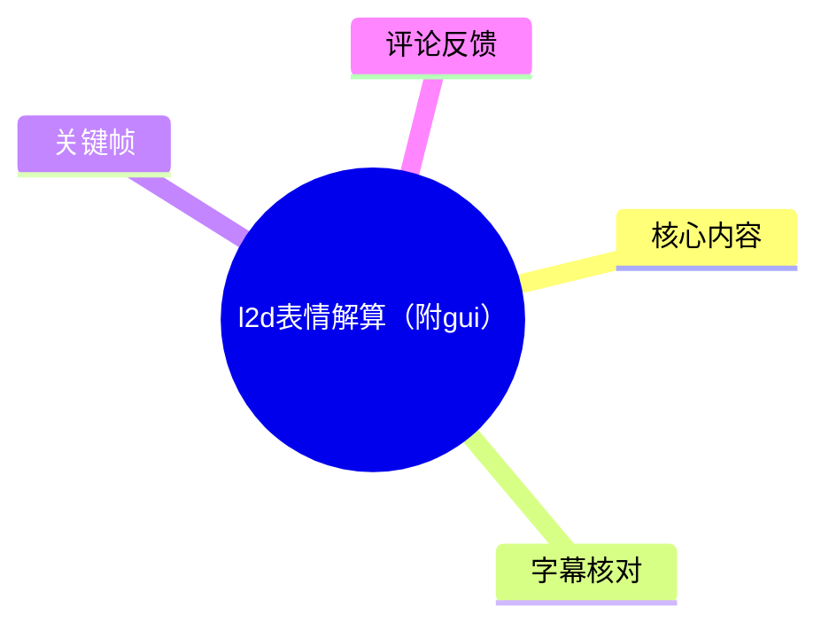
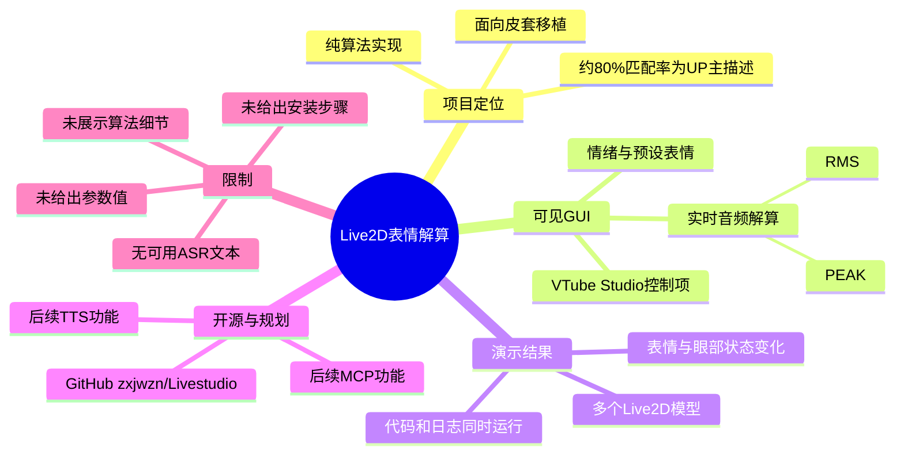
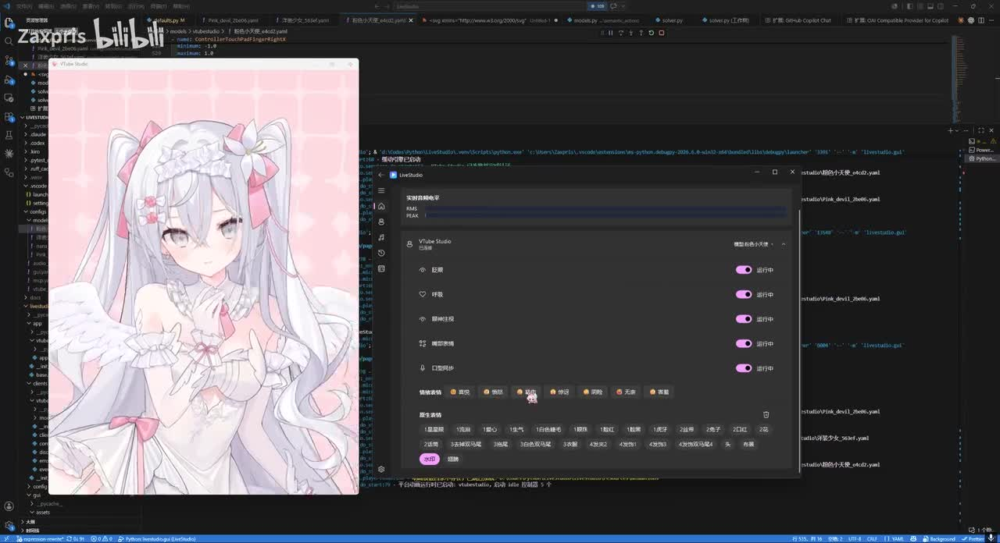
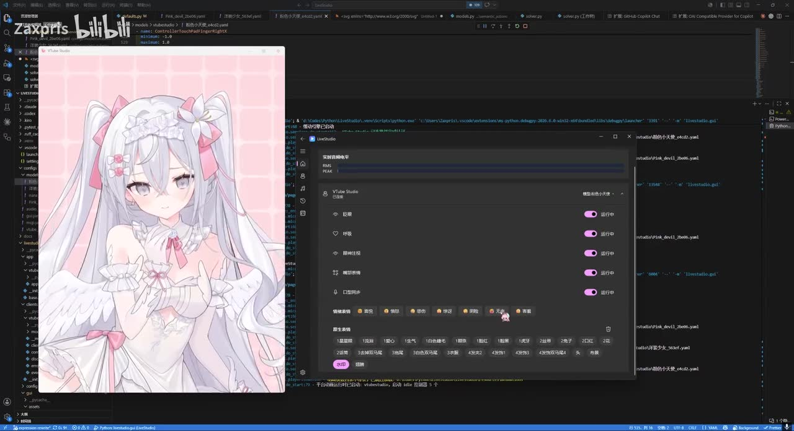
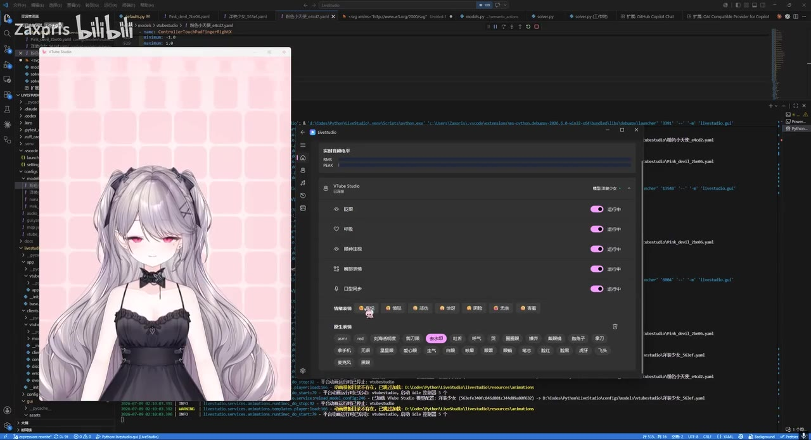
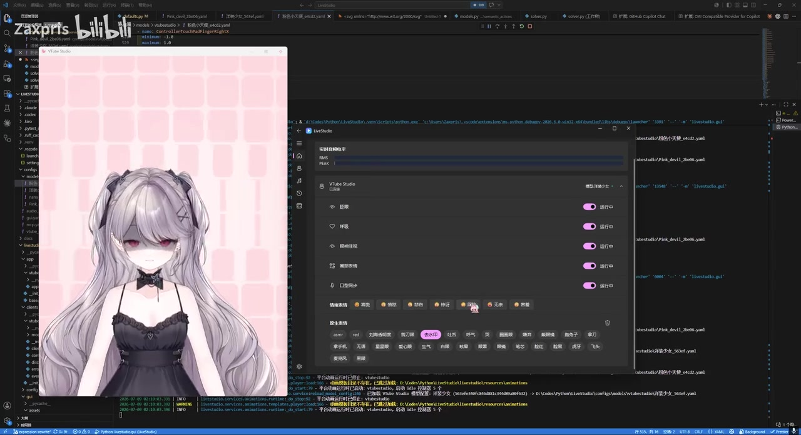
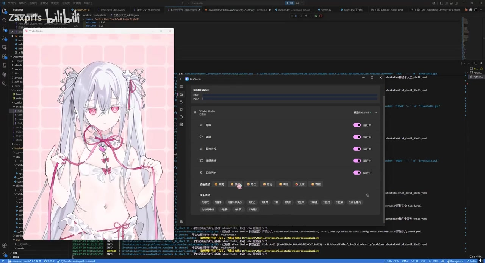

# l2d表情解算（附gui）

> 来源：[Bilibili 视频](https://www.bilibili.com/video/BV1x5M56BEiK)<br>
> UP 主：Zaxpris｜视频时长：2 分 56 秒｜分区标签：原创、虚拟偶像、表情、Live2D、L2D  
> 视频简介称：项目采用“纯算法实现”，通过简单调整参数可移植至自己的 Live2D 皮套；UP 主估计表情解算匹配率约为 **80%**，并称已在 GitHub 开源 `zxjwzn/Livestudio`，下一步计划细化 TTS 与 MCP 功能。

## 小结

本视频展示的是一个面向 Live2D 虚拟形象的表情解算程序及其图形界面（GUI）。画面中同时出现 Live2D 模型预览窗口、名为 **VTube Studio** 的控制面板、代码编辑器和运行日志，重点在于展示程序能够把音频/解算结果映射为角色表情，而非讲解完整安装过程或源代码实现。

从可见 GUI 来看，系统顶部提供“实时音频解算”区域，并显示 `RMS`、`PEAK` 两项音频相关指标；中部的 VTube Studio 模块以开关形式管理多个能力；下部则提供情绪/表情选择与预设表情按钮。不同关键帧中的角色形象、眼部与面部状态发生变化，构成了该解算效果的演示证据。

视频简介给出了最重要的技术定位：这是“纯算法实现”，并非视频中明示依赖某一云端情绪识别服务；移植方式被描述为“简单调整参数”。但视频没有展示参数名、参数取值、模型输入格式、算法流程、硬件要求、延迟、CPU/GPU 占用或可复现命令。因此，“80% 左右”的匹配率应视为 UP 主的经验性描述，不能据此推导统一测试标准下的准确率。

该内容适合已经拥有 Live2D 皮套、希望接入 VTube Studio 并探索音频/表情驱动的开发者参考。若需要实际部署，应以视频简介所指向的 GitHub 仓库 `zxjwzn/Livestudio` 的 README、源码和后续版本为准；本视频本身主要承担效果展示与 GUI 预览功能。

时效性方面，元数据抓取时间为 2026-07-13，视频所述“已开源”和“下一步准备细化 TTS、MCP”的状态只反映抓取时可见的视频简介。仓库可用性、接口兼容性、功能完成度及 VTube Studio 兼容情况均可能在后续更新中变化。

## 思维导图





## 目录

- [项目背景与素材边界](#项目背景与素材边界)
- [GUI 与运行画面](#gui-与运行画面)
- [表情解算效果展示](#表情解算效果展示)
- [可据视频整理的使用流程](#可据视频整理的使用流程)
- [参数、性能与限制](#参数性能与限制)
- [开源状态与时效性](#开源状态与时效性)
- [字幕比对](#字幕比对)
- [评论分析](#评论分析)
- [处理记录](#处理记录)

## 项目背景与素材边界 [00:00](https://www.bilibili.com/video/BV1x5M56BEiK?t=0)

视频标题直接指向“l2d 表情解算”与“附 GUI”。结合视频简介和画面，可确认其展示对象是一个用于驱动 Live2D 虚拟形象表情的桌面端程序界面。

可从真实素材中确认的信息如下：

| 项目 | 可确认内容 |
| --- | --- |
| 实现定位 | 视频简介称为“纯算法实现”。 |
| 迁移方式 | 简介称可通过“简单调整参数”移植至自己的皮套。 |
| 匹配率 | 简介称表情解算匹配率“在 80% 左右”；未提供测试集、样本数或判定方法。 |
| 开源地址 | 简介提及 GitHub 仓库：`zxjwzn/Livestudio`。 |
| 后续规划 | 简介称准备细化 TTS 和 MCP 功能。 |
| 演示环境 | 画面可见 Windows 桌面、代码编辑器、运行日志、模型预览和控制 GUI。 |
| 视频长度 | 176 秒。 |
| 互动数据 | 抓取时为 393 播放、59 点赞、40 收藏、12 投币、3 分享、13 回复；数据会动态变化。 |

视频没有出现可供可靠转写的口述讲解。给定的站内字幕内容实际上围绕“帕尼尼减肥法”，与视频标题、画面、技术主题完全无关，因此不能作为本视频的知识依据。

## GUI 与运行画面 [00:00](https://www.bilibili.com/video/BV1x5M56BEiK?t=0)

画面主要由三个部分组成：

1. **左侧模型预览窗口**：显示 Live2D 虚拟角色，便于直观看到解算输出是否映射到了模型表情。
2. **中间控制 GUI**：窗口中可见“实时音频解算”标题及 `RMS`、`PEAK` 字段；下方是名为 **VTube Studio** 的控制区，带有多行开关和表情控制项。
3. **背景开发环境**：可见代码编辑器、配置/脚本文件与控制台日志，说明演示并非单纯播放器效果，而是在开发或调试环境下运行。



> 图：该帧同时呈现白色系 Live2D 模型、GUI 与背景代码环境。其价值在于建立系统结构：模型预览用于验收效果，GUI 用于控制/观察状态，后台代码与日志则提示程序正在运行或调试。

从 GUI 中可辨认出，音频解算区域至少包含：

- `RMS`：常见于音频信号的均方根幅度指标，通常可用于反映一段时间内的整体音量强度；
- `PEAK`：常见于峰值音量指标，通常用于捕捉瞬时较高的音量。

需要注意：视频仅展示了这两个字段及其所在区域，**没有说明 RMS、PEAK 在该项目中各自如何计算、窗口长度为何、是否用于口型、表情阈值还是平滑处理**。因此不能把常见音频概念直接当作项目已验证的具体实现细节。



> 图：该帧更清楚地显示 GUI 上方的“实时音频解算”、`RMS`、`PEAK` 字段，以及下方 VTube Studio 控制模块。其价值在于证明本视频展示了可视化控制入口，而不是只有后台算法输出。

## 表情解算效果展示 [00:44](https://www.bilibili.com/video/BV1x5M56BEiK?t=44)

视频中后续画面切换为另一名灰发、黑色服饰的 Live2D 角色。角色眼部状态、面部阴影/神情与前一角色不同；同时 GUI 下方仍保留多种情绪和预设表情的交互区域。这说明该演示至少覆盖了不同皮套或模型外观下的效果预览。



> 图：该帧显示另一套灰发 Live2D 模型，并可看到 GUI 下方包含情绪选择和较多预设表情按钮。其价值在于说明视频并非只演示单一角色静态画面，而是在不同模型/表情状态中观察解算或控制效果。

在 GUI 中，能从画面辨认出一组情绪类入口，其中包括“喜悦”“愤怒”“悲伤”“惊讶”等可读标签；下方另有多个预设表情按钮。由此可做的谨慎判断是：

- 系统界面将**情绪类别**与**具体表情预设**分层呈现；
- 模型侧需要存在能够被触发或映射的对应表情参数/动作；
- “简单调整参数即可移植”的说法，至少意味着不同皮套之间可能需要配置适配。

但视频未展示“情绪标签 → Live2D 参数名/动画文件”的映射表，也未显示每一个按钮的精确名称和执行逻辑。不能据此断言其支持全部表情类别，或认为任意 Live2D 模型均可免配置直接兼容。



> 图：该帧中灰发模型呈现更明显的低落/阴影化面部状态，与上一帧的角色状态构成对照。其价值在于提供了表情输出发生变化的视觉证据，但无法仅凭单帧确认触发源是音频、手动点击，还是程序预设切换。

## 可据视频整理的使用流程 [01:28](https://www.bilibili.com/video/BV1x5M56BEiK?t=88)

视频没有给出从下载到运行的完整教程，以下流程仅根据画面和简介整理为**最低限度的操作链路**，其中未展示的环节明确标注为“需查阅仓库”。

### 1. 准备可驱动的 Live2D 皮套

视频简介称项目可通过调整参数迁移到自己的皮套；因此使用者应先具备可在目标环境中加载的 Live2D 模型，并确认模型中存在可表达目标效果的参数、动作或表情资源。

视频未给出支持的 Live2D SDK/Cubism 版本、模型文件格式、参数命名要求，不能据此列出兼容清单。

### 2. 获取项目并以仓库文档为准配置

简介给出 GitHub 仓库名：

```text
zxjwzn/Livestudio
```

视频中背景可见开发目录与脚本/配置文件，但由于未展示仓库安装说明、依赖清单、启动命令或配置文件内容，实际操作应以仓库当前 README 为准。不能根据视频画面虚构 `pip install`、Node.js 命令、端口号或环境变量。

### 3. 在 GUI 中观察实时音频指标

启动后，界面顶部的“实时音频解算”区域会呈现 `RMS` 与 `PEAK` 字段。实际使用时可先观察音频输入是否有响应，再进一步检查口型或表情是否随输入变化。

这一步是从 GUI 布局推导出的合理操作顺序；视频没有展示音频设备选择、输入权限、采样率、增益、阈值或静音判定方式。

### 4. 启用或检查 VTube Studio 相关控制项

中部模块标有 **VTube Studio**，并以开关管理多个能力项。该界面表明程序与 VTube Studio 的使用场景有关，但视频未说明其连接方式，例如是否采用 API、插件、WebSocket、热键或其他机制。

因此，部署时应重点核实：

- 是否要求 VTube Studio 正在运行；
- 是否要求先加载目标模型；
- 是否需要在 VTube Studio 中授权外部 API；
- 每个开关实际影响哪一项能力；
- 连接失败时应查看哪些日志。

以上核实项是实践检查清单，不是视频已经提供的具体配置步骤。

### 5. 适配情绪和表情预设

GUI 下方出现情绪类别和预设表情按钮。若换用自己的皮套，应围绕实际模型可用的表情资源进行映射、命名或参数调整；这也是最符合视频简介“简单调整参数即可快速移植”这一表述的适配方向。



> 图：该帧保留灰发模型、实时音频区域、VTube Studio 开关区和下方情绪/预设表情区。其价值在于将“监测输入—启用服务—选择或映射表情”的工作流集中呈现，适合用作部署时的界面参照。

## 参数、性能与限制 [02:12](https://www.bilibili.com/video/BV1x5M56BEiK?t=132)

### 视频中明确出现或由简介明确说明的参数/指标

| 名称 | 来源 | 可确认含义 | 未知项 |
| --- | --- | --- | --- |
| RMS | GUI | 实时音频解算区的字段名。 | 计算公式、时间窗、归一化范围、用途、可否调整。 |
| PEAK | GUI | 实时音频解算区的字段名。 | 峰值检测策略、阈值、平滑方式、用途、可否调整。 |
| 约 80% 匹配率 | 视频简介 | UP 主对表情解算效果的自述。 | 数据集、评价指标、模型数量、测试条件、误差分布。 |
| “简单调整参数” | 视频简介 | UP 主称可用于快速移植。 | 参数列表、默认值、调参顺序、不同皮套适配规则。 |

### 应避免过度解读的事项

1. **“纯算法”不等于无需依赖。**  
   简介只说明其实现定位，未列明运行依赖、第三方库、模型文件、系统权限或 VTube Studio 接口要求。

2. **“80% 左右”不是可复现实验结论。**  
   缺少评测对象和标准时，该数值只能作为开发者对当前效果的概括性评价。

3. **视觉变化不等于已证明自动识别准确。**  
   关键帧可证明模型出现了不同表情状态，但单帧不能判断表情由何种输入触发，也无法测量触发延迟、漏检率或误触发率。

4. **本视频没有提供完整教学所需的核心细节。**  
   未见明确的安装命令、文件目录、配置示例、参数表、故障排除、授权流程、系统版本及性能测试数据。

5. **不同皮套的适配成本未量化。**  
   即使能通过调整参数迁移，仍取决于目标模型的表情资源、参数结构与 VTube Studio 中的可调用能力。

## 开源状态与时效性 [02:40](https://www.bilibili.com/video/BV1x5M56BEiK?t=160)

视频简介中声明项目已在 GitHub 开源，并写明仓库标识为 `zxjwzn/Livestudio`。在本素材内，没有提供仓库链接、提交版本号、开源许可证、发行包、安装文档内容或 Issue 状态，因此不能进一步确认：

- 仓库在当前时间是否仍公开可访问；
- 视频中的 GUI 是否对应仓库默认分支；
- 演示功能是否已经完整发布；
- TTS、MCP 是否已经在后续版本中实现；
- 项目对 VTube Studio 或系统环境的版本兼容性。

对于希望跟进项目的人，最稳妥的策略是把视频视为功能演示，把仓库当前文档和源码视为部署依据，并在实际使用前验证版本、许可证、依赖与模型适配情况。

## 字幕比对

本次任务中，站内字幕和 ASR 均已获取/执行，但两者均不能直接形成可靠的视频语义转写：站内字幕内容与本视频主题严重错配；本次 ASR 产物为空。

| 字幕来源 | 完整性 | 专有名词 | 时间轴 | 主要问题 |
| --- | --- | --- | --- | --- |
| Bilibili 站内字幕 | 表面上有较长文本，但对本视频实际内容无效。 | 出现“帕尼尼减肥法”等与 Live2D 无关词汇，未覆盖 `VTube Studio`、`RMS`、`PEAK` 或项目名。 | 未提供可用时间戳。 | 内容为饮食挑战叙述，与本视频画面、标题、简介完全不一致，判断为错配字幕。 |
| 本次 ASR 字幕 | 已执行，但结果为空。 | 无。 | 无。 | 无可用文本，可能与视频无有效语音、音轨条件或识别结果为空有关；素材未提供进一步原因。 |

**最终字幕选择：不采用任何一份字幕作为内容依据。**

正文依据改为以下可验证材料：

- 视频标题、简介、标签与结构化元数据；
- 可见关键帧中的 GUI 文本、模型状态、代码编辑器和日志环境；
- 热评前三条；
- 明确标注为来自视频简介的“纯算法”“约 80%”“GitHub 仓库”“TTS/MCP 规划”等说法。

关键校正包括：

| 错配/缺失项 | 校正依据 | 处理结果 |
| --- | --- | --- |
| “帕尼尼减肥法”等饮食内容 | 标题为“l2d表情解算（附gui）”，关键帧为 Live2D 与开发 GUI。 | 全部排除，不纳入正文。 |
| `VTube Studio` | 关键帧中 GUI 模块标题可见。 | 作为画面可见事实记录。 |
| `RMS`、`PEAK` | 关键帧顶部实时音频解算区可见。 | 仅记录字段存在，不扩展为未证实的具体算法。 |
| 表情类别与预设按钮 | 关键帧下方控制区可见。 | 仅记录界面存在情绪/表情控制，不虚构完整映射表。 |

## 评论分析

以下仅处理素材中可获取的热评前三条。三条评论点赞数均为 1，互动样本很小，不能据此推断整体用户评价或项目实际可用性。

1. **摸鱼的古今闲者**：「有机会用用大佬的东西」  
   - 观点：表达了尝试使用该工具的意愿，并对作者持正面态度。  
   - 补充信息：没有提供安装经验、功能验证或技术细节。  
   - 可信度判断：只能反映单个观众的初步兴趣，不能证明工具已被成功部署。

2. **是西格玛吖**：「那我要学习如何使用了」  
   - 观点：评论者关注点是使用方法，表明视频可能激发了学习或部署需求。  
   - 补充信息：侧面说明观众可能仍缺少操作教程，而这与视频未展示完整安装步骤的素材情况一致。  
   - 可信度判断：这是需求表达，不是对功能、兼容性或效果准确率的验证。

3. **Alan-Jackin**：「这么晚[doge]」  
   - 观点：对发布时间作轻松调侃。  
   - 补充信息：不涉及项目功能、算法或使用反馈。  
   - 可信度判断：与技术结论无关，不应作为项目评价证据。

## 处理记录

- Worker ID：`worker-mrj0www4-e8d79408`
- 模型：`gpt-5.6-terra`
- 调用工具与素材：任务提供的结构化元数据、视频素材清单、站内字幕、已执行的 ASR 结果、关键帧、热评数据。
- 使用的应用工具：素材读取与整理；未调用外部网页检索、GitHub 访问或额外推理工具验证仓库内容。
- 字幕选择：本次 ASR 已执行但结果为空；站内字幕与视频主题严重错配，故两者均不作为正文事实来源。正文采用元数据、视频简介及关键帧可见信息。
- 关键帧选择依据：选用 `frame-001`、`frame-002` 展示整体运行环境和实时音频解算区；选用 `frame-003`、`frame-004` 对比不同模型/面部状态；选用 `frame-005` 展示情绪与预设表情控制区。未使用未提供画面内容说明的其他帧，避免作无依据解读。
- 缓存清理：素材清单未提供缓存目录、清理命令或清理结果；未报告可确认的缓存清理操作。
- 未解决问题：
  - 无有效语音转写，无法建立逐句时间轴；
  - 无法从现有素材确认算法、参数、依赖、启动命令及 API 连接方式；
  - 未访问 GitHub 仓库，无法确认其当前可用性、许可证、版本与文档；
  - 关键帧没有原始精确时间戳，正文时间轴仅以视频起点、内容段落和总时长范围作导航，不应视为帧级精确定位。
