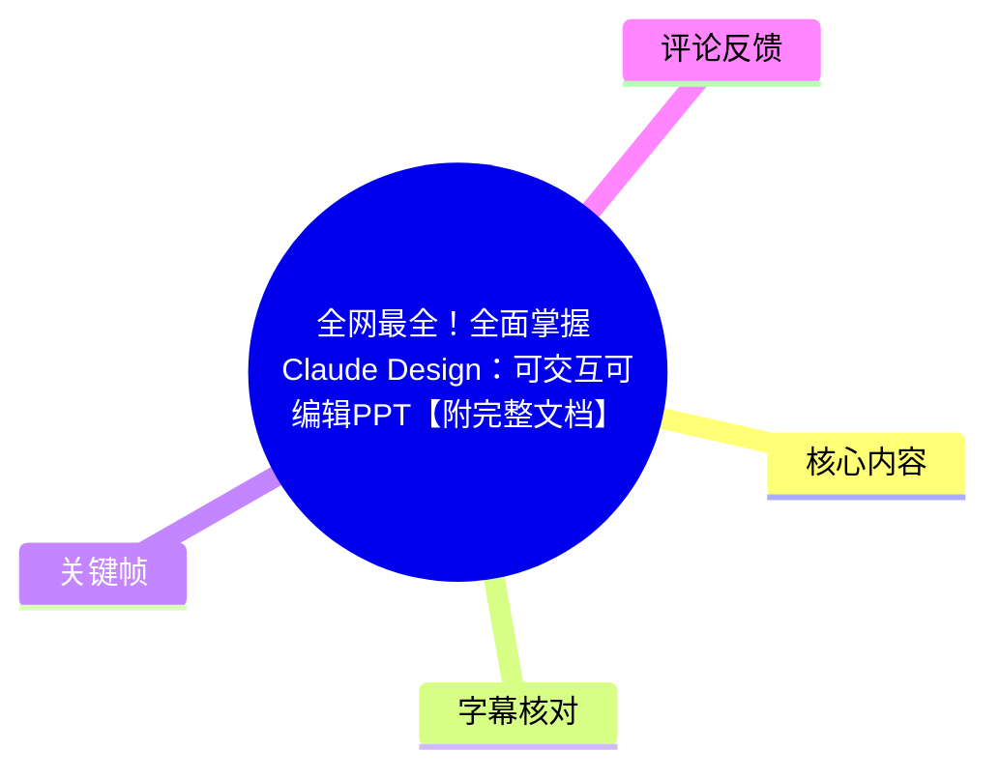
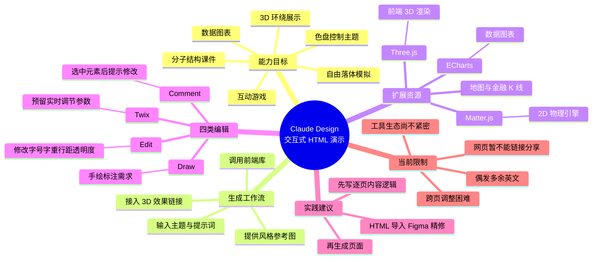
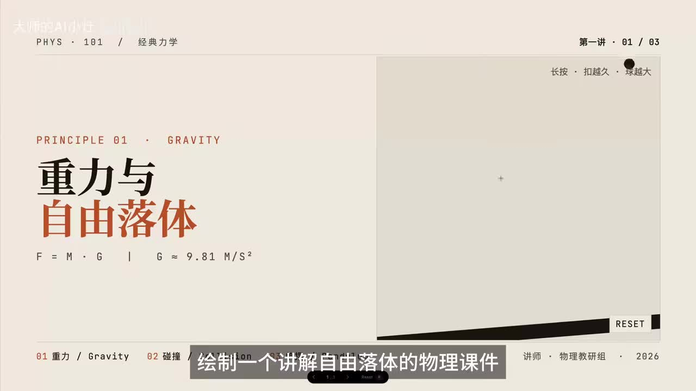
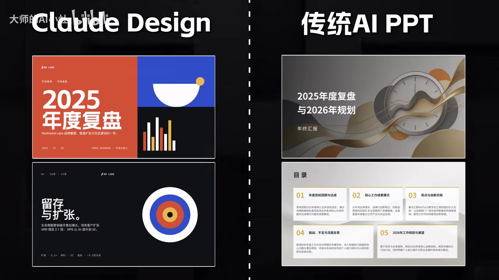
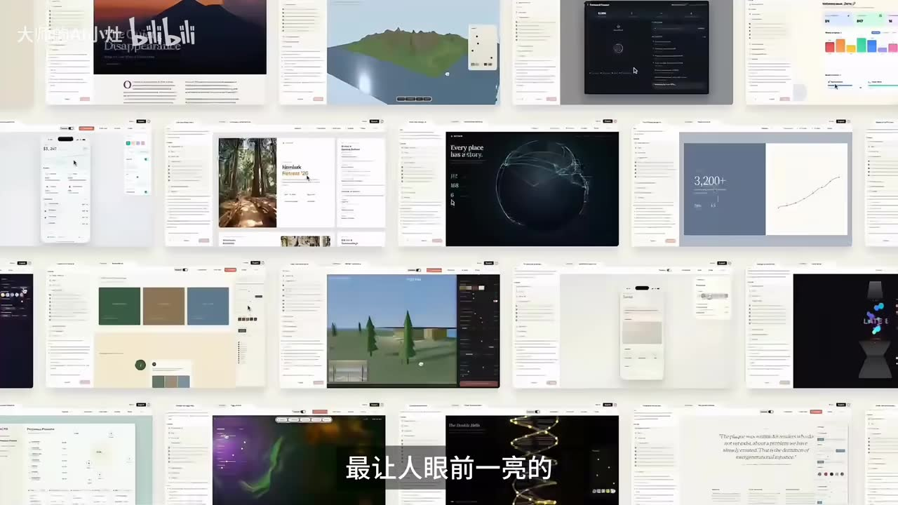
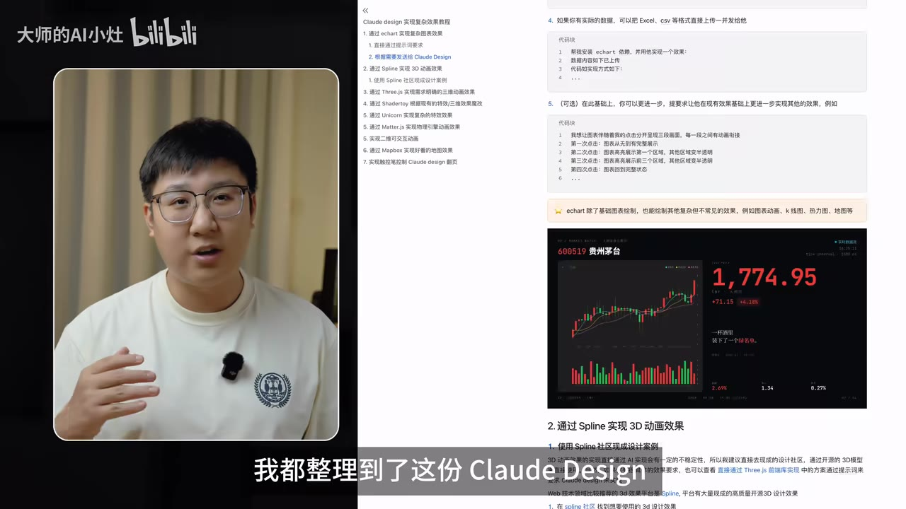

## 小结

视频介绍了一套以 **Claude Design** 为核心的 AI 演示内容生成思路：它不局限于传统静态 `.pptx`，而是以 HTML 页面承载 3D 模型、物理模拟、交互图表、小游戏和主题色盘等效果。视频作者将其定位为“可交互、可编辑”的 AI 演示方案。

基础工作流是：在 Claude Design 中输入主题、提示词并提供参考图；如需 3D 内容，可从 Spline 等平台复制嵌入链接；如需图表或物理效果，则在需求中明确调用 Three.js、Matter.js、ECharts 等前端能力。作者特别强调，**参考图是控制视觉风格的重要输入**；缺少参考图时，生成结果可能趋于同质化。

针对 HTML 演示页面不易编辑的问题，视频归纳了四种页面内编辑方式：`Edit` 参数修改、`Comment` 选中元素后自然语言修改、`Twix` 预留实时可调参数、`Draw` 手绘标注修改位置。它们主要适合单页局部调整，跨页移动、合并内容仍是未解决的难点。

视频还给出两项实践建议：一是在生成前用文档梳理每页内容逻辑，避免生成后再进行大规模跨页重构；二是若只需要其视觉方案，可将生成的 HTML 借助 `HTML to Design` 导入 Figma，进行可缩放、细粒度的后续精修。

时效上，视频发布于 **2026 年 6 月**。作者称该产品仍处于早期阶段，存在偶发多余英文元素、与 Claude Code 等工具生态结合不紧密、网页版本暂不能通过链接分享等问题。这些功能状态可能已随产品更新变化，应以当前产品界面及官方文档为准。

## 思维导图





## 目录

- [视频信息与能力演示](#视频信息与能力演示)
- [Claude-Design 的定位与参考图策略](#claude-design-的定位与参考图策略)
- [Spline 3D 链接接入流程](#spline-3d-链接接入流程)
- [HTML 演示与前端库能力](#html-演示与前端库能力)
- [四种单页编辑方式](#四种单页编辑方式)
- [跨页限制与 Figma 精修方案](#跨页限制与-figma-精修方案)
- [限制、适用边界与时效性](#限制适用边界与时效性)
- [关键帧索引](#关键帧索引)
- [字幕比对](#字幕比对)
- [评论分析](#评论分析)
- [处理记录](#处理记录)

# 全网最全！全面掌握 Claude Design：可交互可编辑PPT【附完整文档】

> 来源：[Bilibili 视频](https://www.bilibili.com/video/BV12HEz6KE4m)  
> UP 主：大师的AI小灶  
> 合集：AIcode  
> 时长：06:26  
> 发布时间：2026-06-11 14:33:11（按元数据 Unix 时间戳换算；素材未标明时区）

## 视频信息与能力演示 [00:00](https://www.bilibili.com/video/BV12HEz6KE4m?t=0)

视频以“2026 年 AI 做 PPT 的终极形态是什么”为开场，展示的并非传统意义上的静态幻灯片，而是具备网页交互能力的演示页面。作者先后列出以下可通过自然语言需求描述实现的案例：

1. 将模型嵌入 PPT，进行 **3D 环绕展示**。
2. 制作能够展示**分子结构模型**的课件。
3. 制作讲解**自由落体**的物理课件。
4. 在 PPT 中嵌入一个小游戏。
5. 插入三个图表，展示世界各国 GDP。
6. 加入色盘，用于控制页面主色调。

视频强调，完成这些效果“不需要懂一行代码”。但结合后续内容，这更准确地说是：用户可通过对话提出需求；若想稳定复现复杂效果，仍需要理解需求类别、准备参考图、选择合适的库或资源，并在生成前规划好内容结构。



> 图：画面是“重力与自由落体”教学课件，左侧为知识标题和公式，右侧为带球体、提示文字与 `RESET` 按钮的互动区域。它说明视频所说的“PPT”可以承载规则、状态和交互，而不只是文字与图片排版。

## Claude Design 的定位与参考图策略 [01:19](https://www.bilibili.com/video/BV12HEz6KE4m?t=79)

### 对话生成设计稿

视频将 Claude Design 描述为一款通过对话生成设计稿的 AI 设计产品。作者给出的基础操作顺序为：

1. 打开 Claude Design。
2. 在左下角对话框提供若干张参考图。
3. 输入一段简单提示词。
4. 等待工具生成一套演示内容。

视频列出的应用场景包括：

- 工作汇报；
- 技术分享；
- 面向儿童的教学课件。

作者认为这些结果可达到接近专业设计师的视觉效果。这是视频作者基于演示案例作出的体验性判断，不应视为所有主题、所有提示词和所有版本下均可保证的结果。

### 同一提示词并不保证同一输出

视频在约 01:34 起将 Claude Design 的输出与“传统 AI PPT”进行对比，认为前者在视觉效果上更突出。画面中，左侧 Claude Design 案例采用了高对比色块、模块化排版和图表元素；右侧传统 AI PPT 案例则使用较常见的商务风封面与目录页。



> 图：该画面是视频“视觉差异”论点的核心示例。左侧 Claude Design 案例突出色彩、层级和版式设计；右侧为传统 AI PPT 样式。其价值在于展示作者实际用于比较的样本，但不能由单一案例推导出普遍性能结论。

站内字幕与 ASR 都提到某个“4.7”视觉模型能力及“比上一代提升 13 个百分点”，但相关专有名词在不同字幕中识别不一致，素材也未提供测试方法、测试集或官方出处。因此，本文只保留以下可靠层面的结论：

- 视频作者认为 Claude Design 的视觉表现较强；
- 作者认为即使接入相同模型、使用相同提示词，不同产品的输出也可能明显不同；
- 关于“13 个百分点”的具体归因，无法仅凭本视频素材独立验证。

### 参考图是风格控制的关键

作者明确指出：若不给 Claude Design 提供合适的参考图，结果可能形成“千篇一律”的默认画风。其应对方式是给工具提供具有明确视觉风格的参考图。

视频称作者整理了**超过 50 种**强视觉风格参考图，并汇入配套文档，获取方式为评论区。素材没有提供文档原文、下载地址、分类目录或授权信息，因此无法验证这些参考图的具体内容和可用范围。



> 图：画面呈现了多种网页、图表、3D 页面和编辑界面案例。它有助于理解作者为何强调参考图：生成系统可被引导到多种视觉方向，而不是只输出单一模板风格。

## Spline 3D 链接接入流程 [02:27](https://www.bilibili.com/video/BV12HEz6KE4m?t=147)

视频介绍了把 3D 动态内容引入 Claude Design 的操作流程。站内中文 SRT 将平台识别为“splay”，本次 ASR 识别为 `Spline`；结合视频中 `Remix`、`Export`、`Copy Embed` 等界面操作，本文采用 **Spline** 作为校正名称。

### 操作步骤

1. 打开 Spline 3D 设计平台。
2. 找到需要复用的 3D 效果。
3. 点击 `Remix`。
4. 在右上角找到 `Export`。
5. 点击 `Copy Embed`，复制效果链接。
6. 返回 Claude Design。
7. 输入演示主题，并粘贴效果链接。
8. 让 Claude Design 基于主题和链接生成动态演示页面。

作者表示，画面中的“深邃地球”等效果也可按类似方式生成。

### 企业产品展示场景

视频还给出一个产品介绍思路：

1. 将公司产品的三维模型上传至 Spline。
2. 获取模型链接。
3. 将链接提供给 Claude Design。
4. 生成用于详细介绍产品的演示页面。

作者认为动态视觉是吸引观众注意力的“敲门砖”。这一判断适用于需要展示空间结构、产品细节或数据变化的演讲场景；但视频没有说明模型上传限制、嵌入权限、加载性能、离线播放、版权归属或商业使用条款，实际使用前需要自行确认。

## HTML 演示与前端库能力 [03:12](https://www.bilibili.com/video/BV12HEz6KE4m?t=192)

视频认为，用 HTML 绘制演示页面的优势在于：可以把互联网长期积累的动态效果与开源内容用于演示，从而突破传统 PPT 的静态排版限制。

### 视频点名的库与用途

| 库 / 资源 | 视频中的定位 | 视频举例 |
| --- | --- | --- |
| `Three.js` | 前端 3D 渲染库 | 分子结构模型展示 |
| `Matter.js` | 2D 物理引擎库 | 自由落体物理课件 |
| `ECharts` | 数据可视化图表库 | 带可交互图表的分析演示 |
| 地图库 | 地理信息展示资源 | 视频仅提及类别，未展示具体库名 |
| 金融 K 线代码 | 金融数据图表能力 | 视频仅提及类别 |
| 复杂公式展示 | 数学或技术内容呈现 | 视频仅提及能力方向 |

视频还表示，具体有哪些库、如何调用的教程已整理在配套文档中。由于素材未提供文档正文，不能补充具体安装命令、API 参数、版本号或完整库清单。

### 需求描述的组成方式

视频没有展示可直接复制的完整提示词，但从案例可以抽取出一套需求表达结构：

```text
演示主题 + 目标能力或库 + 展示对象 + 交互行为 + 演示控制方式
```

以下是依据视频案例整理的需求表达方向，并非原视频逐字提示词：

- 使用 Three.js，制作展示分子结构模型的教学演示。
- 使用 Matter.js，制作讲解自由落体的物理课件。
- 使用 ECharts，制作包含可交互图表的数据分析演示。
- 将演讲流程与翻页设备按键关联，使页面自动停留在预设的高光观察位置。

作者将“每多了解一个库”比作“解锁一项新技能”。可迁移的经验是：AI 可以帮助生成和组织前端效果，但用户仍需知道自己需要的是 3D 渲染、物理仿真、图表、地图还是公式展示。



> 图：画面右侧为作者展示的配套文档，可见 “通过 Spline 实现 3D 动画效果” 等说明及金融 K 线图案例。该关键帧的价值在于佐证视频确实将资源调用和案例写入文档；但文档全文与可访问地址不在素材内。

## 四种单页编辑方式 [04:08](https://www.bilibili.com/video/BV12HEz6KE4m?t=248)

视频指出，HTML 生成演示的一大问题是“可编辑性差”，并称 Claude Design 提供了四类解决方案。以下名称以本次中文 ASR、站内中文字幕及多语种字幕互相校对为基础；站内中文 SRT 对部分名称有误识别。

### 1. Edit：直接修改属性参数 [04:16](https://www.bilibili.com/video/BV12HEz6KE4m?t=256)

`Edit` 是最接近传统 PPT 编辑器的方式。用户点击元素后，可手动调整相应属性。

视频明确列出的可调参数包括：

- 字号；
- 字重；
- 行间距；
- 不透明度。

适用场景是页面结构已经合理、只需要细调局部样式时，例如增大标题、压缩正文行距、降低装饰元素透明度等。

素材未说明：

- 是否支持批量选择；
- 是否支持多对象统一修改；
- 是否存在撤销、历史版本或参数继承；
- 支持的全部属性范围。

### 2. Comment：选中元素后自然语言精改 [04:28](https://www.bilibili.com/video/BV12HEz6KE4m?t=268)

`Comment` 的思路是先选中目标元素，再通过提示词提出修改要求，从而进行更精确的局部控制。

视频给出的操作逻辑为：

1. 选中页面中的元素；
2. 输入修改要求；
3. 让系统只针对所选元素调整。

视频示例是：选中一张卡片，然后要求“把宽度调整为现在的两倍”。

这种方式适用于用户知道“改什么”，但不想手动查找具体参数的情况。其结果仍依赖于元素选中是否准确、提示词是否明确，以及系统是否正确理解当前布局约束。

### 3. Twix：预留实时调节参数 [04:40](https://www.bilibili.com/video/BV12HEz6KE4m?t=280)

视频称，用户可以在生成 PPT 时告诉 Claude 哪些细节希望在生成后继续调整，Claude 会提供一套独立的调节文件。

作者特别提到，适合实时观察效果的参数包括：

- 圆角弧度；
- 主题配色。

可将 `Twix` 理解为：在生成阶段就把可能反复修改的设计变量暴露出来，避免每次都通过自然语言重新改写整页。

视频没有提供调节文件的格式、文件位置、导出方式、是否支持多人协作或是否可跨项目复用，因此这些实现细节无法确认。

### 4. Draw：手绘标注提出修改要求 [04:55](https://www.bilibili.com/video/BV12HEz6KE4m?t=295)

`Draw` 是通过手绘方式表达需求的编辑路径。视频给出的示例流程为：

1. 在页面目标区域画圈；
2. 告诉系统“这里要补充一个装饰性元素”；
3. 由 Claude 根据标记位置执行修改。

作者将其形容为“懒人必备”。它适合能够指出目标位置、但不愿用精确设计术语描述布局的使用者。

需要注意的是，这是一种视频中的产品体验描述，不代表任意手绘标记都能稳定得到预期结果。

## 跨页限制与 Figma 精修方案 [05:05](https://www.bilibili.com/video/BV12HEz6KE4m?t=305)

### 未解决问题：跨页结构编辑

视频明确区分了“单页面无级调节”与“跨页面调整”。

单页内部元素已经可以通过前述四种方式进行一定程度的调整；但跨页移动、合并和重组内容仍是难点。视频给出的例子包括：

- 将第 2 页内容移动到第 5 页；
- 将第 3、4、2 页内容合并；
- 为了改一个跨页细节而进行大规模重构。

作者认为，HTML 生成 PPT 的产品目前都没有合适的方法应对这一问题。这是作者在视频发布时作出的行业观察，不应理解为对所有同类产品的永久性、可验证结论。

### 规避策略：生成前梳理逐页逻辑

作者建议在让 AI 生成前，先在文档中把每一页的内容逻辑梳理清楚。可落实为以下准备步骤：

1. 明确演示对象、目标和受众。
2. 列出每页标题、关键结论和支撑材料。
3. 明确哪些内容必须保持在同一页面。
4. 标记需要图表、3D 模型、物理互动或特殊动画的页面。
5. 再将逐页结构交给 Claude Design 生成。

这样做的目的，是降低“AI 已经生成后，因一个跨页小改动导致大量返工”的风险。

### HTML 导入 Figma 的精修路径 [05:40](https://www.bilibili.com/video/BV12HEz6KE4m?t=340)

如果只想借用 Claude Design 的视觉方案，视频建议在得到初步方案后安装 `HTML to Design` 插件，将生成的 HTML 文件导入 Figma。

站内字幕将插件和软件名称识别为“HTML 数据带”“菲格玛”等；本次 ASR 识别到 `HTML to Design` 和 `Figma`，且与上下文吻合，因此本文采用这些名称。

视频所描述的流程是：

1. Claude Design 先生成一个“大差不差”的方案。
2. 安装 `HTML to Design` 插件。
3. 将生成的 HTML 文件导入 Figma。
4. 将其转化为可缩放、可细粒度精修的设计稿。
5. 在 Figma 中按需要调整具体元素。

视频称导入后可得到可无限缩放、甚至能像素级精修的矢量稿。这里需要保留边界：

- 视频展示的是工作流思路，并未证明所有复杂 HTML 都能无损转化为完整可编辑的矢量元素；
- 动画、外部链接、3D 资源和交互逻辑导入后的保留程度，素材未说明；
- 插件兼容性与产品版本会随时间变化。

## 限制、适用边界与时效性 [05:58](https://www.bilibili.com/video/BV12HEz6KE4m?t=358)

### 视频明确提到的限制

| 限制 | 视频中的表述 | 实践影响 |
| --- | --- | --- |
| 跨页编辑 | 跨页面调整仍未解决 | 应尽量在生成前固定页面逻辑和顺序 |
| 语言元素 | 偶尔会出现多余英文元素 | 交付前需逐页审校文字 |
| 生态集成 | 与 Claude Code 等工具结合尚不紧密 | 不宜默认复杂工具链可无缝协作 |
| 链接分享 | 生成网页版本暂不能通过链接分享 | 需提前准备替代交付或展示方式 |
| 风格控制 | 缺少参考图时易出现同质化风格 | 需准备参考图与视觉规范 |
| 格式兼容 | 视频未说明 `.pptx` 导出能力 | 需先确认组织的交付格式要求 |

### 适合的任务

结合视频展示内容，该工作流较适合：

- 教学演示和互动课件；
- 产品展示，尤其是需要展示 3D 模型的内容；
- 技术分享和数据可视化讲解；
- 需要动态图表、地图、物理效果或互动机制的演示；
- 对视觉创新要求高，且允许网页或 HTML 形式播放的场景。

### 需要谨慎的任务

以下场景需要在使用前进一步验证：

- 必须提交 `.pptx` 文件的正式汇报；
- 需要频繁进行跨页调序和内容合并的项目；
- 必须离线播放或对加载稳定性有刚性要求的场景；
- 需要链接分享、多人在线协作的交付流程；
- 对文案准确性、合规审查和数据来源要求严格的行业报告。

视频并未说明 Claude Design 是否支持 `.pptx` 导出、离线运行、商业授权、价格、地区可用性或协作能力，因此不能将这些能力视为已知事实。

### 时效性说明

视频元数据所示发布时间为 2026 年 6 月。视频中关于“刚发布”“处于初期阶段”“暂不能链接分享”“生态集成不紧密”等说法，均应视为该时间点的产品状态。

工具可能在后续版本中改变：

- 编辑能力；
- 分享能力；
- 模型接入方式；
- Figma 或插件兼容性；
- 导出与协作能力。

实际应用前应以当前官方产品说明和实际测试结果为准。

## 关键帧索引 [00:00](https://www.bilibili.com/video/BV12HEz6KE4m?t=0)

| 对应主题 | 关键帧 | 画面价值 |
| --- | --- | --- |
| 自由落体互动课件 |  | 呈现物理课件、公式、球体交互区域和重置按钮，直接说明视频强调的互动教学方向。 |
| 多样化视觉案例 |  | 展示多类界面和视觉效果，支撑“参考图与视觉风格控制”的讨论。 |
| 配套文档与图表资源 |  | 画面可见 Spline、图表和金融 K 线案例，说明作者确实展示了配套资料。 |
| Claude Design 对比传统 AI PPT |  | 记录视频中用于证明视觉差异的对比画面，但仅代表该演示样本。 |

## 字幕比对 [00:00](https://www.bilibili.com/video/BV12HEz6KE4m?t=0)

| 字幕来源 | 完整性 | 专有名词表现 | 时间轴 | 主要问题 |
| --- | --- | --- | --- | --- |
| Bilibili 站内中文字幕 `p01-ai-zh.srt` | 覆盖完整，至 06:25 | 多处音译或识别混乱，如“ATHROY”“CIZ”“splay”“cloud sign”“ATML”“1HS”“4DW” | 分段细，适合定位 | 部分技术名词明显不可靠；`Copy Embed`、Spline、HTML to Design、Figma 等名称需要校正 |
| 本次 ASR `medium` 中文识别 | 共 22 段，语音覆盖约 351.5 秒，占视频约 91.2% | 对 Spline、Copy Embed、Twix、Draw、HTML to Design、Figma 的识别更接近上下文，但仍有错词 | 有时间戳；首段 00:00，末段 06:25 | 长句合并较多；把 GDP 识别为“技术”；把 HTML 识别为 HDMI、HDML 等；模型名称不稳定 |

### 字幕选择与校正结论

- 本次 ASR 检查结果显示：源视频**存在音轨**。`asr-result.json` 提供 22 个带时间戳的中文语音段，总时长约 385.4 秒，且未标记 `noAudioStream=true`。
- 时间轴链接优先依据站内中文 SRT 的逐段真实起止时间换算秒数。
- 正文语义以站内中文字幕为主要依据，并由本次 ASR 复核。
- 对专有名词的校正采用站内字幕、本次 ASR、其他语言站内字幕和关键帧上下文交叉判断。
- 本文采用或保留的技术名称包括：`Spline`、`Copy Embed`、`Three.js`、`Matter.js`、`ECharts`、`Edit`、`Comment`、`Twix`、`Draw`、`HTML to Design`、`Figma`。
- 对视频中“4.7”模型及“提升 13 个百分点”的表述，字幕来源均不稳定且缺少独立资料支撑，因此只将其记录为视频作者的说法，不作为可验证的性能结论。

## 评论分析 [00:00](https://www.bilibili.com/video/BV12HEz6KE4m?t=0)

> 以下仅分析素材中可获取的热评前三条。评论属于用户观点，不应作为已经验证的产品事实。

### 1. 不凡饺子｜69 赞

评论认为，视频展示的方案在“观感和思路”上比 `ppt master` 更可靠；该用户称即使已将每页 key message 写得很细，仍没有得到满意结果，并请求获取资料。

**可提取的观点：**

- 用户对 AI PPT 的不满不只来自内容提纲，而是视觉控制和成品质量。
- 这与视频强调“参考图”和“风格控制”的观点相呼应。

**边界：**

- 这是单一用户的主观体验；
- 评论未提供 `ppt master` 的版本、提示词、样本或对比条件；
- 不能据此推导出两个产品的普遍性能排名。

### 2. SneakyMercury｜85 赞

评论认为 HTML 是演示内容的发展趋势，预测未来用户会直接播放 HTML，传统 PPT 可能被专用 HTML 放映工具取代。其理由是：当 AI 已可轻松生成视觉效果良好的 HTML 时，将其转成 PPT 反而会成为主要阻碍。

**可提取的观点：**

- 评论抓住了视频工作流的核心张力：HTML 的表现力更强，而传统办公环境的交付格式仍以 PPT 为主。
- 该观点与视频中 HTML 可承载动态效果、3D、图表和交互的论述一致。

**边界：**

- 这是对未来的预测；
- 未提供市场数据、组织采购趋势、标准变化或行业调研；
- 不能视为“PPT 将被淘汰”的既成事实。

### 3. oragman｜46 赞

评论指出，无论展示效果多好，只要内容不是 `.pptx` 格式，许多上级单位或组织都不会给用户足够的自由发挥空间。

**可提取的观点：**

- 交付格式是 AI 演示工具落地的重要现实约束；
- 在组织场景中，格式兼容性可能比视觉效果更优先。

**边界：**

- 评论未提供具体单位、政策或格式要求；
- 但它确实补充了视频未展开的风险：在选择 HTML 演示工作流前，应先确认最终交付物是否必须为 `.pptx`。

## 处理记录 [00:00](https://www.bilibili.com/video/BV12HEz6KE4m?t=0)

- Worker ID：`worker-mrj0wjed-b0c290ad`
- 模型：`gpt-5.6-terra`
- 使用素材：视频元数据、站内多语种 SRT、本次 ASR 结果 `asr/asr-result.json`、ASR SRT、关键帧目录、热评 JSON。
- 本次 ASR：`medium` 模型；识别语言为 `zh`；运行设备为 CUDA，计算类型为 `float16`；识别结果含有效时间戳。
- 音轨检查：`asr-result.json` 未标记 `noAudioStream=true`；ASR 检测到有效中文语音，故按“有音轨视频”处理。
- 字幕选择：站内中文 SRT 用作时间轴主依据；本次 ASR 用于核对文本与技术名词；必要时参考其他语言站内字幕及关键帧上下文。
- 关键帧选择依据：
  - `frames/frame-001.jpg`：自由落体互动课件，说明交互教学能力；
  - `frames/frame-002.jpg`：多样视觉案例，说明参考图和风格控制价值；
  - `frames/frame-003.jpg`：配套文档与图表案例，说明资源整理方向；
  - `frames/frame-004.jpg`：Claude Design 与传统 AI PPT 对比，说明作者的视觉比较样本。
- 缓存清理：素材中未提供缓存清理执行日志，无法确认是否执行；不虚构清理结果。
- 未解决问题：
  - 配套文档和评论区资料链接未包含在素材中，无法验证内容与可访问性；
  - 视频中“4.7”模型名称及“提升 13 个百分点”的具体来源无法可靠确认；
  - 未提供 Claude Design 当前版本、价格、地区可用性、商业授权、导出能力和 `.pptx` 支持信息；
  - 关键帧只能说明视频中展示过相应画面，不能独立证明所有用户均可稳定复现相同效果。

## 评论分析

- 热评 1：三连，观感和思路上就比ppt master靠谱很多，我用ppt master还是做出了一堆屎，即便我的每页key message已经给到了很细。求资料呀
- 热评 2：html是个趋势，再过几年ppt可能会被淘汰。当你很容易就能让AI做出视觉效果良好的HTML，而你遇到的主要困难是把它转成PPT时，后者自然就会被逐渐放弃。说到底，现在的PPT作为一种放映工具，它所占有的优势仅仅在于“人们习惯了用PPT”，而它本身并没有任何技术上的先进性和优越性。估计再过几年，大家就都开始直接放映HTML了，或者专用于放映HTML的工具会被开发，取代ppt
- 热评 3：你就吹破天去它也不是.pptx格式，大部分时候上级单位根本不给你自由发挥空间

以上内容是观众反馈摘录，只用于补充理解视频反响，不作为正文事实依据。
