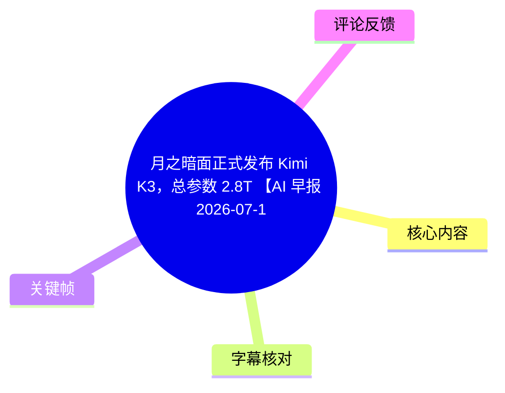
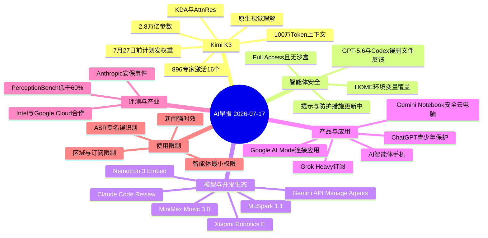
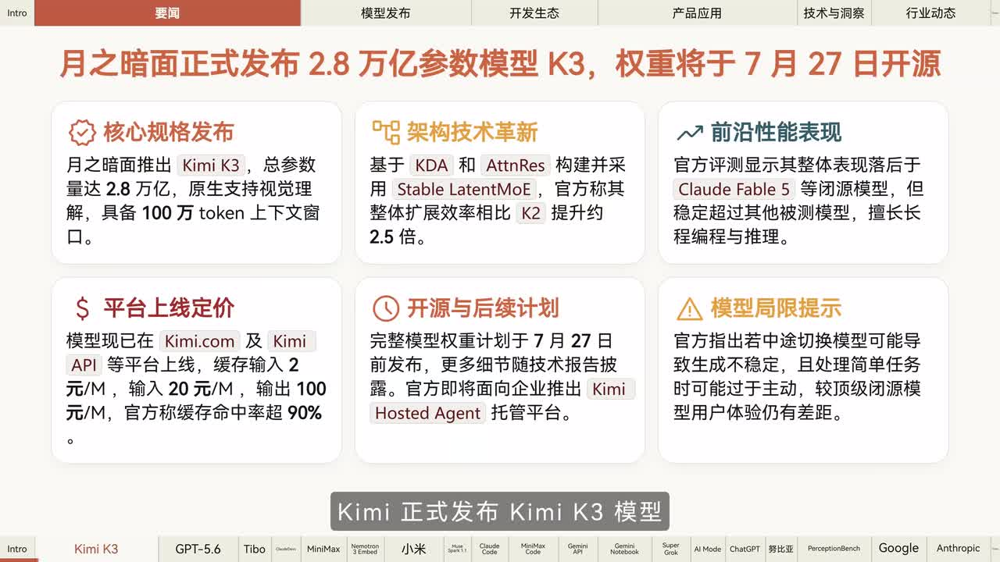
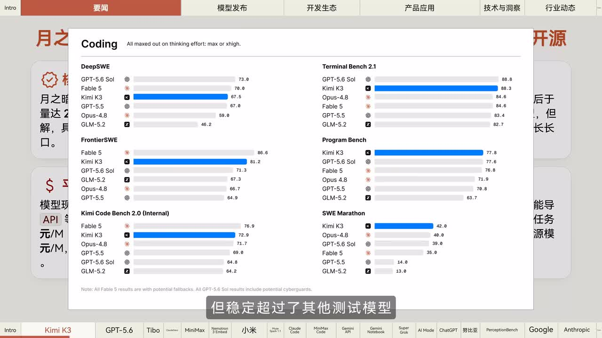
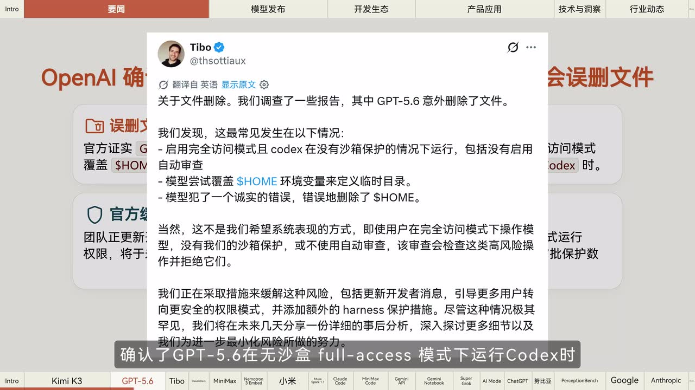
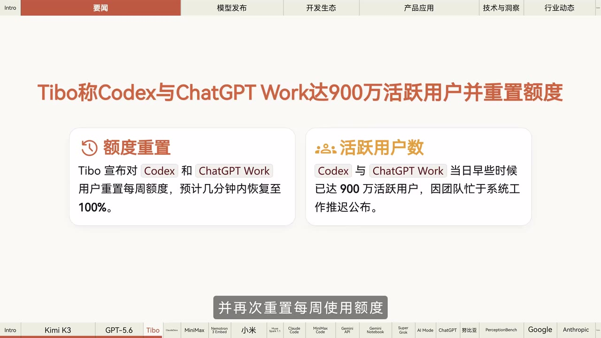

# 月之暗面正式发布 Kimi K3，总参数 2.8T 【AI 早报 2026-07-17】

> 来源：[Bilibili 视频](https://www.bilibili.com/video/BV1nSKj6vE6N) 
> UP 主：橘鸦Juya｜发布时间：2026-07-17｜视频时长：04:32 
> 视频说明提供的文字版链接：[微信公众号文章](https://mp.weixin.qq.com/s/Lwuyf-na_Ef-ipXrvGi8CQ)

## 小结

本期为 2026 年 7 月 17 日的 AI 新闻快报，核心新闻是月之暗面正式发布 **Kimi K3**。视频称其总参数量为 **2.8 万亿**，原生支持视觉理解、支持 **100 万 Token** 上下文窗口，并采用由视频画面标注为 **KDA、AttnRes 与 Stable Latent MoE** 的技术路线：在 **896 个专家**中激活 **16 个**。该模型已上线 Kimi 应用、Kimi Work、Kimi Code 与 API，默认思考强度为 Max；完整权重计划在 **7 月 27 日前**发布。

Kimi K3 的定位并非“全面领先”：视频援引官方评测称，其整体表现落后于画面中标示的 Claude Fable 5、GPT-5.6 等模型，但稳定超过其他被测模型；画面还强调其编程与推理能力。首帧信息卡进一步给出缓存输入、输入、输出的 API 价格，以及模型切换可能造成生成不稳定、简单任务可能过度主动等限制。这些均是视频转述或画面信息，未在本整理中独立核验。

开发者侧最值得关注的风险新闻是：Codex 负责人 Tibo 表示，GPT-5.6 在**无沙盒、Full Access** 环境下运行 Codex 时，可能因错误覆盖 `$HOME` 环境变量而误删目录。团队正更新开发者提示、引导用户使用更安全权限，并拟加入额外保护措施；详细事后分析尚待发布。因此，使用具备文件操作能力的智能体时，隔离环境、最小权限与可恢复备份仍是直接可迁移的实践原则。

其余新闻覆盖模型、开发者工具和产品能力：MiniMax Music 3.0、NVIDIA Nemotron 3 Embed、Xiaomi Robotics E、Meta MuSpark 1.1、Claude Code Review、MiniMax Code 2.0、Gemini API Manage Agents、Gemini Notebook、Grok Heavy、Google AI Mode、ChatGPT 青少年保护、AI 智能体手机、PerceptionBench、Google Cloud 与 Intel 合作，以及 Anthropic 总部安保事件。大量名称来自 ASR，存在专有名词识别误差，正文会明确保留不确定性。

本视频适合需要快速掌握当日 AI 产品动态的开发者、模型应用者和行业观察者。它是新闻播报而非产品测评或操作教程：性能、价格、地区开放范围、额度与发布日期均具有强时效性，应以各厂商后续公告和实际控制台为准。

## 思维导图

## 目录

- [Kimi K3 发布：规格、架构、上线与限制](#kimi-k3-发布规格架构上线与限制)
- [Codex 文件误删反馈与智能体安全实践](#codex-文件误删反馈与智能体安全实践)
- [模型、音乐、嵌入与机器人动态](#模型音乐嵌入与机器人动态)
- [开发者工具与 Agent 生态](#开发者工具与-agent-生态)
- [产品功能、订阅与用户保护](#产品功能订阅与用户保护)
- [多模态评测、云计算合作与行业事件](#多模态评测云计算合作与行业事件)
- [可执行经验：以文件型智能体为例](#可执行经验以文件型智能体为例)
- [结论、限制与时效性](#结论限制与时效性)
- [字幕比对](#字幕比对)
- [评论分析](#评论分析)
- [处理记录](#处理记录)

## [Kimi K3 发布：规格、架构、上线与限制](https://www.bilibili.com/video/BV1nSKj6vE6N?t=0)

视频开场即播报月之暗面正式发布 Kimi K3。ASR 覆盖时间为 00:00:00.300—00:00:48.540，画面信息卡补充了部分 ASR 未完整识别的数据。

### 规格与架构

视频陈述的 Kimi K3 关键信息如下：

| 项目 | 视频中的信息 | 说明 |
| --- | --- | --- |
| 总参数量 | 2.8 万亿 | 即 2.8T；这是总规模，不等于每次推理激活参数量。 |
| 多模态能力 | 原生支持视觉理解 | 视频未展示具体视觉任务或测试过程。 |
| 上下文窗口 | 100 万 Token | 视频未说明在何种产品形态、价格或性能条件下可用。 |
| 架构标注 | KDA、AttnRes、Stable Latent MoE | ASR 将 `AttnRes` 误识别为“Etherus”；此处以画面文字为准。 |
| MoE 路由 | 896 个专家中激活 16 个 | 表示采用稀疏激活；视频没有解释专家容量、路由策略或每层结构。 |
| 扩展效率 | 相比 K2 提升约 2.5 倍 | 来自首帧“架构技术革新”卡片，未给出测量口径。 |

> 图：画面将 Kimi K3 的核心规格、架构、性能定位、价格、权重计划及限制集中在一页中。它可用于校正 ASR 中的架构专有名词，并补足“896 专家激活 16 个”以外的上下文。

### 性能位置：视频展示的是官方评测，不应外推为通用结论

视频称官方评测显示 Kimi K3 的整体表现仍落后于“Claude Fable 5”和 GPT-5.6，但稳定超过其他测试模型。画面特别展示了编程类成绩；其中模型名、分数和排名应理解为视频呈示的官方对比，而非本整理独立复测结果。

画面可见的部分编程基准包括：

| 基准 | 画面中的 Kimi K3 分数 | 画面中的相对情况 |
| --- | ---: | --- |
| DeepSWE | 67.5 | 低于 GPT-5.6 Sol 的 73.0、Fable 5 的 70.0；高于 GPT-5.5 的 67.0。 |
| FrontierSWE | 81.2 | 低于 Fable 5 的 86.6；高于 GPT-5.6 Sol 的 71.3。 |
| Kimi Code Bench 2.0（Internal） | 72.9 | 低于 Fable 5 的 76.9；高于 Opus-4.8 的 71.7。 |
| Terminal Bench 2.1 | 88.3 | 略低于 GPT-5.6 Sol 的 88.8。 |
| Program Bench | 77.8 | 略高于 GPT-5.6 Sol 的 77.6。 |
| SWE Marathon | 42.0 | 高于画面列出的 Opus-4.8、GPT-5.6 Sol、Fable 5、GPT-5.5 与 GLM-5.2。 |

> 图：该图直接展示视频援引的多个编程评测及条形分数，价值在于说明“Kimi K3 并非所有榜单第一”，且不同基准结论不同。画面脚注还提示 Fable 5 与 GPT-5.6 Sol 的结果可能包含特定回退或防护条件，横向比较应谨慎。

### 上线、价格与后续计划

视频口播称 Kimi K3 已上线 **Kimi 应用、Kimi Work、Kimi Code 与 API**，默认思考强度为 **Max**；完整模型权重计划于 **7 月 27 日前**发布。

首帧画面另列出以下信息：

- 平台：Kimi.com 与 Kimi API 等。
- API 价格：缓存输入 **2 元/M**、输入 **20 元/M**、输出 **100 元/M**。
- 缓存命中率：画面声称“超 90%”。
- 后续：完整权重计划于 7 月 27 日前发布；更多细节将随技术报告披露；并计划面向企业推出 **Kimi Hosted Agent** 托管平台。

这些价格与计划属于当日报道时点的页面信息。实际可用模型、计费单位、缓存条件、免费额度和权重发布时间均可能变动，使用前应以官方产品页为准。

### 已明确提示的产品限制

首帧“模型局限提示”写明两项风险：

1. 中途切换模型可能导致生成不稳定。
2. 处理简单任务时可能过于主动，较顶级闭源模型的用户体验仍有差距。

这属于视频对产品限制的转述，不代表全部已知边界。实际选型时，应针对目标任务分别测试长上下文、视觉输入、代码执行、模型切换和简单指令遵从，而不能只根据总参数量或单一榜单判断。

## [Codex 文件误删反馈与智能体安全实践](https://www.bilibili.com/video/BV1nSKj6vE6N?t=48)

时间范围：00:00:48.540—00:01:12.550。

Codex 负责人 Tibo 就少数 GPT-5.6 意外删除文件的反馈作出说明。视频及截图的关键因果链为：

1. Codex 运行于 **Full Access（完全访问）** 模式。
2. 同时缺少沙盒保护，画面还提及包括未启用自动审查的情形。
3. 模型尝试通过覆盖 `$HOME` 环境变量定义临时目录。
4. 该操作出现错误，导致 `$HOME` 被错误删除，从而可能误删用户目录。

视频称团队正在采取的措施包括：更新开发者消息或提示，引导更多用户转向安全权限模式，并增加额外的 harness（运行时约束/防护）保护措施；详细事后分析预计数日内发布。该分析在视频发布时尚未公开，因此不能将具体触发率、受影响范围或最终修复效果视为已证实结论。

> 图：截图列出了触发条件和 `$HOME` 误删这一关键技术细节，并明确提出无沙盒、完全访问模式会放大风险。它是纠正 ASR 将产品名、模式名和环境变量断句混乱的重要依据。

同一时段还有一则使用量动态：Tibo 于北京时间 7 月 16 日中午表示，Codex 与 ChatGPT Work 已达 **900 万活跃用户**，并再次重置每周使用额度；画面称额度预计可在几分钟内恢复至 100%。这里的“活跃用户”统计定义、统计周期和地域口径未说明。

> 图：画面将“每周额度重置”和“900 万活跃用户”分开呈现，有助于避免将使用额度恢复误读为新增用户数，或将活跃用户统计误解为订阅用户数。

## [模型、音乐、嵌入与机器人动态](https://www.bilibili.com/video/BV1nSKj6vE6N?t=72)

时间范围：00:01:12.550—00:02:01.480。

### Anthropic 账户限额

视频称 Anthropic 于北京时间 7 月 16 日中午重置了开发者账号的 **5 小时**和**每周**速率限制。ASR 将相关产品名称识别为“CloudF”，无法从提供素材中可靠确认其精确拼写，因此仅保留“Anthropic 开发者账号”的表述。限额属于高度动态的服务策略，不能据此推断当前仍有效。

### MiniMax Music 3.0

MiniMax 正式上线 **Music 3.0** 音乐生成模型。视频称该版本升级了：

- 语义理解；
- 音质；
- 人声合成能力。

视频还称其已开放免费模型调用；ASR 中版本号被识别为“Music 3.3”，与前文的 Music 3.0 存在冲突，无法仅凭现有素材确认免费调用对应的具体版本、额度和入口。

### NVIDIA Nemotron 3 Embed

NVIDIA 发布 **Nemotron 3 Embed** 开源嵌入模型系列：

- 参数规格：**8B** 与 **1B**；
- 上下文：支持 **32K**；
- 许可：视频称支持商业使用。

嵌入模型通常用于检索、语义相似度、向量数据库和 RAG，但视频没有提供检索基准、向量维度、语种覆盖或部署方式；这些均不能自行补充。

### Xiaomi Robotics E

Xiaomi Robotics 发布 **Xiaomi Robotics E** 模型。视频称其采用：

- **10 万小时**“仿真/免实体域训练”（ASR 对此短语识别不稳，无法确认原始技术表述）；
- 结合真实机器人后训练；
- 目标是突破数据瓶颈。

官方称，学习新任务平均仅需不到 **10 小时**演示数据，即可达到 **75%** 成功率。该数字缺少任务类型、测试集、机器人硬件、成功定义与方差等条件，应仅作为厂商口径记录。

### Meta MuSpark 1.1

视频称 Meta 的 **MuSpark 1.1** 系列模型已上线 OpenRouter，但**仅面向美国开发者开放**。产品名和地区限制来自 ASR；实际可访问范围还可能受账户地区、平台政策与模型供应状态影响。

## [开发者工具与 Agent 生态](https://www.bilibili.com/video/BV1nSKj6vE6N?t=121)

时间范围：00:02:01.480—00:02:49.660。

### Claude Code Review

Anthropic 为 Claude Code Code Review 增加：

- 多个 **Effort** 级别；
- 专属审查策略。

视频称其“D 级别”即可在“D Token 成本下优于同类工具”，但 ASR 对这两个“D”的原始英文或具体等级识别不清，不能据此确认准确的性能/成本倍数。可确定的是：视频强调其提供了可调节的审查力度与策略配置。

### MiniMax Code 2.0 与 MCP 接入

MiniMax 更新 **MiniMax Code 2.0** 桌面端并开放下载。视频称新版基于“派 Agent”（名称可能为 ASR 音译，精确名称待确认）重构底层架构，并称其显著提升长程任务稳定性。

此外，视频称其接入：

- 恒生金融数据库；
- 企查查 MCP。

这里的重点不是任何模型能力得到普遍保证，而是 Agent 可通过 MCP 类接口连接外部数据源。涉及金融或企业数据时，仍需确认数据授权、调用权限、更新频率及输出可追溯性。

### Gemini API：Manage Agents

Google 为 Gemini API 的 **Manage Agents** 推出：

- 免费层级；
- 预算控制；
- 定时触发器。

视频称开发者可用**未启用计费的密钥**免费调用该功能。该表述不等于“无任何限制”：免费层通常仍可能有调用次数、地区、功能、并发或项目配额约束；视频未给出具体数值。

### Gemini Notebook 与安全云电脑

视频称 NotebookLM 更名为 **Gemini Notebook**，并新增安全云电脑功能，供用户直接运行代码、分析上传数据：

- 当前面向 Google AI Ultra 用户开放；
- 计划在未来数周推送至所有付费用户。

其中产品更名和功能范围属于视频播报时的状态；权限、数据处理位置、可运行的代码类型及支持地区均未在视频中展开。

## [产品功能、订阅与用户保护](https://www.bilibili.com/video/BV1nSKj6vE6N?t=169)

时间范围：00:02:49.660—00:03:37.740。

### Grok Heavy 与 X Premium Plus

视频称 X 宣布 **SuperGrok Heavy** 订阅包含 **X Premium Plus**，无需额外付费；用户可在 Grok 应用中连接 X 账户以立即激活。这里需区分“订阅权益整合”和“所有区域、所有账户立即可用”：视频未提供地区、存量订阅、资格判断或套餐价格的细则。

### Google AI Mode 连接应用

Google 宣布 AI Mode 上线“连接应用”功能，本周起在美国推出。视频称用户可在搜索中联动第三方应用并执行操作。这意味着搜索入口从信息检索延伸至跨应用执行，但视频没有说明：

- 支持哪些第三方应用；
- 每项操作是否需要再次授权或确认；
- 可访问的数据范围；
- 操作失败和撤销机制。

因此，涉及日程、文件、消费或账户操作时，应在实际产品中逐项检查授权界面。

### ChatGPT 青少年保护

OpenAI 更新 ChatGPT 青少年保护功能：

- 家长可将“学习模式”设为新对话默认选项；
- 青少年长时间使用时将收到更频繁的休息提醒。

这是产品层面的保护设置，而不是对内容质量、年龄识别准确性或监护效果的全面保证。视频未说明支持国家、账户关系验证方式或具体提醒阈值。

### AI 智能体手机

视频称“**LubianEvics Ultra**”正式亮相，官方称其为全球首款 AI 智能体手机，搭载豆包手机助手并提供四款配色。该品牌/产品名由 ASR 给出且无法由现有关键帧校正，拼写存在不确定性；“全球首款”是官方宣传性质表述，不应视为经过独立比较后成立的事实。

## [多模态评测、云计算合作与行业事件](https://www.bilibili.com/video/BV1nSKj6vE6N?t=217)

时间范围：00:03:37.740—00:04:31.400。

### PerceptionBench：原子视觉感知的可复现性问题

视频称 Kimi 发布 **PerceptionBench**，用于评估多模态大模型的**原子视觉感知能力**。官方评测结果显示：

- 当前所有参评前沿模型的准确率均未超过 **60%**；
- 大量正确答案在重复提问时无法复现；
- 视频据此概括，现有模型多数是在猜测而非真正感知视觉信息。

其中“未超过 60%”和“重复提问不稳定”是视频转述的评测结论。“大多是在猜测”是视频对现象的解释性判断，而非单凭准确率可以完全证明的机制结论。若要用于模型选型，应查看基准任务设计、样本分布、重复次数、提示词控制和统计方法。

### Intel 与 Google Cloud 合作

Intel 与 Google Cloud 宣布扩大战略合作，视频称将全面部署 **Gemini Enterprise** 以加速企业 AI 转型；并借助 Google Cloud 的 **C4、N4** 实例扩展计算能力、运行复杂模拟，以加快半导体芯片开发周期。

视频没有给出合作规模、部署阶段、实际性能收益或客户案例，因此“加速”应理解为合作目标或预期。

### Anthropic 总部安保事件

视频援引《华尔街日报》查阅的事件记录称，一名男子此前进入 Anthropic 旧金山总部大厅，向安保人员警告某高管将被杀害。视频称事件未引发暴力冲突、无人被捕；Anthropic 未确认该事件，但称自 2024 年起已实施全天候安保。

这是一则涉及安全威胁的媒体报道。现有素材不足以确认事件完整经过、动机、调查结果或后续处置，不宜据此延伸推断企业内部情况。

## [可执行经验：以文件型智能体为例](https://www.bilibili.com/video/BV1nSKj6vE6N?t=48)

视频没有提供命令行教程；以下是依据其明确指出的 Codex 事故条件整理的**风险控制顺序**，不是视频中声称已经完成的产品功能。

1. **默认不授予完全访问权限**  
   对代码智能体优先使用项目目录级权限，而不是整个用户目录或系统级写权限。视频中风险发生的前提正是 Full Access 与无沙盒。

2. **在隔离环境中运行有写入能力的任务**  
   使用沙盒、容器、虚拟机或受限工作区，使智能体即使误操作也不应触及宿主机的 `$HOME`、凭据目录和其他项目。

3. **避免让模型自行改写关键环境变量**  
   `$HOME`、`PATH`、工作目录及临时目录应由运行时固定配置；若任务必须创建临时目录，应由受控脚本生成并校验路径，而非让模型凭文本指令决定。

4. **将破坏性操作改为“先预览、后确认”**  
   删除、覆盖、批量移动、依赖升级等行为先输出拟执行清单；只有在用户确认或规则引擎审核通过后再执行。视频截图也提到“自动审查”可作为高风险操作的额外关口。

5. **保证可恢复性**  
   在任务前提交版本控制变更、备份工作区或采用快照。即便防护失效，仍能以可验证的方式恢复。

6. **记录执行轨迹并监控异常**  
   保存工具调用、命令、路径、环境变量变化和文件差异。当出现越权路径、`$HOME` 相关操作、递归删除或异常大量改动时，应立即中止并审查。

以上做法只能降低风险，不能证明智能体不会出错。尤其在“长程任务稳定性提升”“可执行第三方应用操作”等能力逐渐普及后，权限边界与人工确认的重要性会高于单纯比较模型基准分数。

## [结论、限制与时效性](https://www.bilibili.com/video/BV1nSKj6vE6N?t=266)

Kimi K3 是本期最主要的模型发布信息：视频给出的关键标签是 2.8T、视觉理解、100 万 Token、稀疏 MoE、Kimi 多端/API 上线以及计划发布完整权重。性能叙事应保持克制：视频展示其在若干编程基准中具备竞争力，但同时明确称其整体仍落后于部分头部模型。

对于实际使用者，最具普遍价值的信息来自 Codex 文件误删反馈：拥有文件系统或外部应用操作权限的 Agent，风险不只来自模型回答错误，更来自其实际执行权限。隔离、最小权限、路径约束、审查和备份应作为默认配置。

本期信息的主要限制如下：

- **强时效性**：模型价格、权重发布日期、免费层、使用额度、订阅权益和地区开放状态都可能在视频发布后变化。
- **厂商口径限制**：性能分数、成功率、效率提升、用户规模及“全球首款”等说法多数为视频转述的官方信息，未在本整理中独立验证。
- **评测外推限制**：编程榜单、PerceptionBench 的分数不能直接推出模型在所有业务场景中的可靠性。
- **专有名词不确定性**：无站内字幕，ASR 对若干英文产品名和技术名识别不稳定；已由关键帧校正的内容在下节说明，其余保留原始不确定性。
- **素材范围限制**：提供的关键帧主要覆盖 Kimi K3 与 Codex 新闻，其他新闻未获得对应画面佐证，只能依据带时间戳的 ASR 记录。

## 字幕比对

| 字幕来源 | 完整性 | 专有名词 | 时间轴 | 主要问题 |
| --- | --- | --- | --- | --- |
| Bilibili 站内字幕 | 未提供可用字幕，无法比较正文 | 无 | 无 | 素材明确标注“未提供可用站内字幕”。 |
| 本次 ASR 字幕 | 高：12 段，语音覆盖约 271.1 秒，覆盖率 99.78% | 中等：英文模型、产品和架构名称存在较多音译或错识别 | 高：提供真实 SRT 起止时间 | 断句较长；如 AttnRes、Codex、Claude Code、产品型号等存在识别不稳定。 |

### 最终字幕选择与校正原则

本次没有站内字幕可用，最终以**本次 ASR 的 SRT 时间轴**作为章节定位依据。ASR 诊断显示：

- 识别语言：中文，置信度约 **0.998**；
- 音频时长：约 **271.70 秒**；
- 首段语音：00:00:00.300；
- 末段语音：00:04:31.400；
- 无大间隔警告；
- 未标记 `noAudioStream=true`，说明源视频存在音轨，本次 ASR 不是因无音轨而替代字幕。

结合关键帧与上下文进行的主要校正或保留包括：

| ASR 表达 | 正文处理 | 依据 |
| --- | --- | --- |
| “Etherus” | 校正为 **AttnRes** | `frame-001.jpg` 的架构卡片写作 AttnRes。 |
| “CloudFable5” | 保留为画面标示的 **Claude Fable 5**，不擅自对应某个现实产品 | `frame-001.jpg`、`frame-002.jpg` 中可见该拼写。 |
| “Codec” | 在文件误删与用户量语境中校正为 **Codex** | `frame-003.jpg`、`frame-004.jpg`。 |
| “ChatGPT Work” | 保留该画面写法 | `frame-004.jpg`。 |
| “Music 3.3 共调用” | 仅记录“视频称开放免费调用”，不确认具体版本号 | ASR 与前文 Music 3.0 存在冲突，且无对应画面。 |
| “LubianEvics Ultra” | 保留 ASR 音译并标为名称待确认 | 无站内字幕及对应关键帧，无法可靠校正。 |
| “派 Agent” | 保留为可能的音译，标为待确认 | 无额外素材可核验。 |

## 评论分析

以下仅处理可获取的热评前三条。评论反映社区观点，不作为已经验证的新闻事实。

1. **郝某人BH｜217 赞**  
   评论以调侃方式预测 DeepSeek V4 正式版可能很快与 Kimi K3 竞争，并质疑 Kimi 的“15 美刀每百万输出”定价和先在 X 发布宣传视频的策略。  
   - 补充价值：体现用户对国内模型竞争、价格及海外优先传播的敏感度。  
   - 局限与争议：视频素材并未给出“15 美刀每百万输出”这一美元定价，也未提供 DeepSeek V4 的发布时间；该评论属于预测和立场表达，不能据此确认。

2. **ai-cheems｜41 赞**  
   评论称“梁圣帝君真憋得住”，并以“原子弹”比喻尚未公开的强模型可能对同类产品造成冲击。  
   - 补充价值：反映观众对潜在后续模型发布的期待。  
   - 局限与争议：没有提供可核验的产品、版本、时间或证据；纯属戏谑性推测。

3. **自闭梦魇魇｜56 赞**  
   评论认为 Kimi 是好模型，但对月之暗面的营销风格持负面评价。  
   - 补充价值：提示产品讨论中，技术能力与品牌沟通可能被用户分开评价。  
   - 局限与争议：这是主观体验，没有举出本视频内具体营销材料或可度量标准，不能代替产品品质判断。

## 处理记录

- Worker ID：`worker-mrj0wjed-b0c290ad`
- 模型：`gpt-5.6-terra`
- 调用工具与素材：视频元数据、`asr/asr-result.json`、`asr/transcript.srt`、关键帧目录、热评数据；未使用外部检索补充事实。
- 本次 ASR 检查：已检查。ASR 模型为 `medium`，设备为 CUDA，计算类型为 float16；检测到有效音轨与高语音覆盖，不存在 `noAudioStream=true` 情形。
- 字幕选择：站内字幕未提供可用版本；采用本次 ASR 的真实 SRT 分段作为时间轴，并以关键帧校正可见的专有名词与关键参数。
- 关键帧选择依据：
  - `frames/frame-001.jpg`：Kimi K3 的参数、架构、价格、计划和限制汇总；
  - `frames/frame-002.jpg`：Kimi K3 编程评测的分项成绩与比较边界；
  - `frames/frame-003.jpg`：GPT-5.6/Codex 误删文件的具体条件和拟定防护；
  - `frames/frame-004.jpg`：Codex 与 ChatGPT Work 的活跃用户、额度重置信息。
- 缓存清理：素材清单未提供缓存清理执行日志；本整理未声明或虚构已完成清理。
- 未解决问题：
  - 部分 ASR 专有名词无法由站内字幕或关键帧确认，包括 AI 智能体手机名称、“派 Agent”、部分 Anthropic 产品名等。
  - Kimi K3 的性能、价格、权重发布日期、地区与产品可用性均未进行外部独立验证。
  - PerceptionBench 的任务构成、重复测试方法和完整结果未包含在给定素材中。
