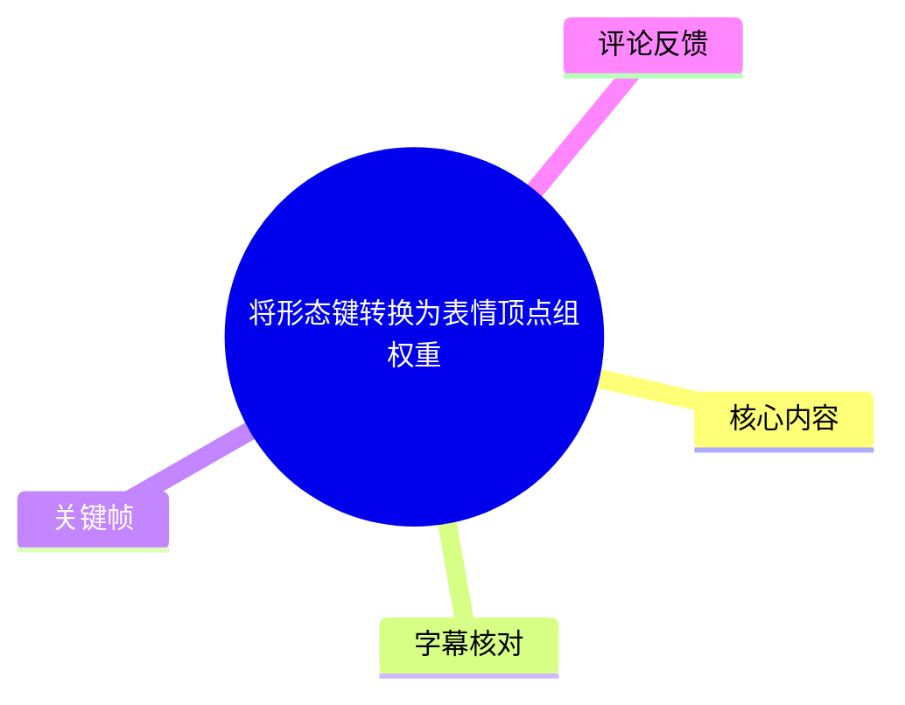
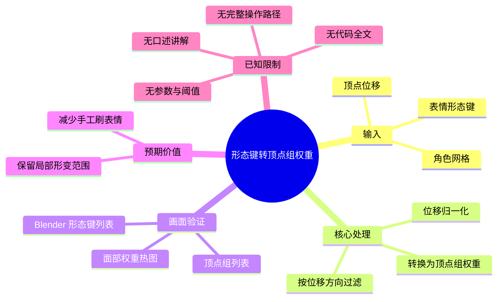
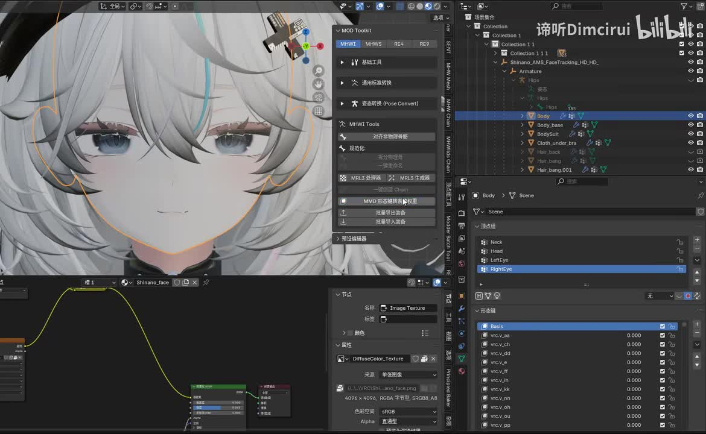
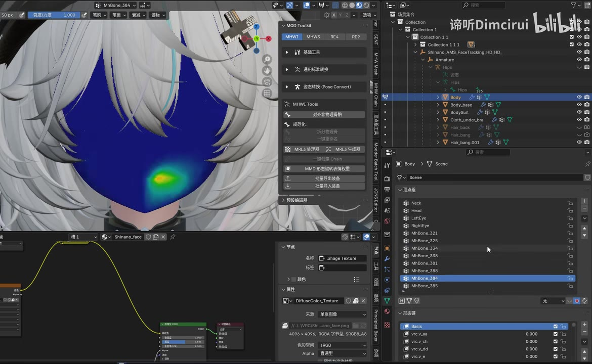
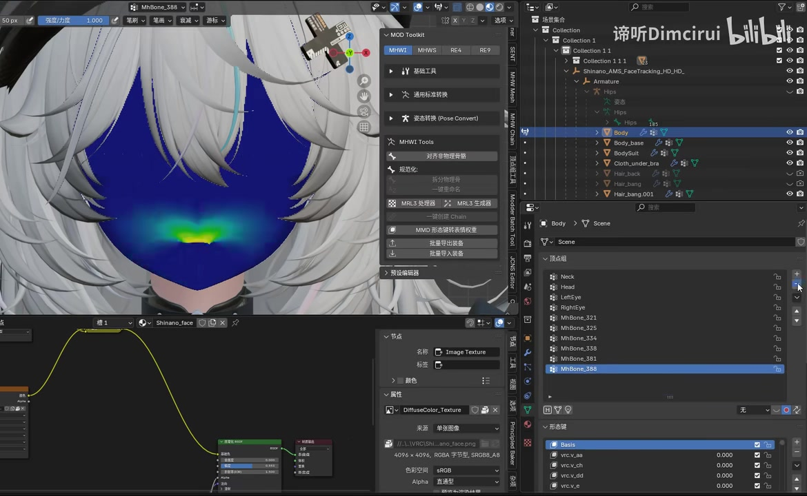

# 将形态键转换为表情顶点组权重

> 来源：[Bilibili 视频](https://www.bilibili.com/video/BV1ajVW6dEZt) 
> UP 主：谛听Dimcirui｜发布时间：2026-05-28｜视频标称时长：39 秒｜分辨率：1574 × 968

## 小结

本视频展示的是一项 Blender 模型处理思路：将**形态键（Shape Key）造成的顶点位移**归一化后，转换为对应的**顶点组（Vertex Group）权重**，再按顶点位移方向进行过滤，从而得到与特定表情形变区域相对应的权重分布。

UP 主在简介中明确说明，该方法参考了 `@光之影V` 和 `@幽玲乃昕` 的点子与代码。视频画面以 Blender 操作为主：可见角色面部模型、形态键列表、顶点组列表与权重绘制视图；权重热图在嘴部附近呈现局部高权重区域，直观说明形态键的局部形变可以被转写为可编辑的顶点组数据。

该思路的主要价值在于减少手工“刷表情”权重的工作量：若已有用于表情的形态键，可从其实际顶点位移中提取权重基础，而非完全依赖人工选择面部顶点并逐笔涂抹。它尤其适合拥有现成面部 Shape Key、且后续流程需要顶点组权重的角色模型整理场景。

需要注意的是，视频未提供可转录的口述讲解、代码全文、具体按钮路径、归一化公式、阈值、方向筛选算法或 Blender/Python 版本。因此，本文只能确认其公开说明的总体方法和画面中可见的操作结果，不能把未展示的实现细节补写成确定步骤。

时效性方面，本条内容发布于 2026-05-28；Blender 的界面、插件面板和模型工具链会随版本、插件及目标模组规范变化。视频中出现的 `MOD Toolkit`、`MHWI Tools` 等面板名称仅作为画面事实记录，不代表本方法必须依赖这些工具。

## 思维导图

## 目录

- [背景、目标与素材边界](#背景目标与素材边界)
- [可确认的方法原理](#可确认的方法原理)
- [画面中的 Blender 操作与结果](#画面中的-blender-操作与结果)
- [可复用的实践流程](#可复用的实践流程)
- [参数、限制与时效性](#参数限制与时效性)
- [字幕比对](#字幕比对)
- [评论分析](#评论分析)
- [处理记录](#处理记录)

## [背景、目标与素材边界](https://www.bilibili.com/video/BV1ajVW6dEZt?t=0)

视频标题直接给出目标：**“将形态键转换为表情顶点组权重”**。结合视频简介，UP 主描述的处理链路为：

1. 读取形态键对各顶点产生的位移；
2. 将位移归一化；
3. 将归一化结果写入顶点组权重；
4. 过滤位移方向；
5. 达到视频中展示的表情局部权重效果。

这里需要区分三个概念：

- **形态键**：保存网格在某个表情或形变状态下的顶点位置变化。
- **顶点位移**：相对于 Basis（基准形态）而言，每个顶点位置改变的向量；它同时包含位移大小与方向。
- **顶点组权重**：通常是每个顶点的标量权重，范围常见为 0 到 1，用于后续选择、绑定、遮罩或其他依赖权重的流程。

视频所要解决的问题不是重新制作一个表情形态键，而是把既有的形态键形变信息转成另一种可操作的数据表示——顶点组权重。由于顶点组通常只存储标量，不能直接完整表达三维位移方向，因此简介中特别指出还需要进行“过滤位移方向”。

站内字幕从 `00:00:00.160` 起仅标为“♪ 音乐 ♪”；本次 ASR 也没有识别出任何语音文本。因此，关于方法原理的可靠文字依据主要来自视频标题和简介，画面用于佐证其在 Blender 内进行模型、形态键、顶点组与权重绘制相关操作。

## [可确认的方法原理](https://www.bilibili.com/video/BV1ajVW6dEZt?t=11)

### 从形态键位移取得权重基础

视频简介明确使用了“将形态键对顶点产生的位移归一化后转换成顶点组权重”的表述。可据此确认，权重来源是形态键的顶点位移，而非手动绘制的随机区域。

从数据关系上看，若基准形态的顶点位置为 \(P_{basis}\)，某个形态键下的顶点位置为 \(P_{shape}\)，则该顶点的位移可表示为：

\[
\Delta P = P_{shape} - P_{basis}
\]

其中：

- \(\Delta P\) 是三维向量；
- 位移长度 \(\lVert \Delta P \rVert\) 可描述该顶点受该形态键影响的强弱；
- 位移方向可用于区分不同方向上的形变。

视频没有公开归一化函数，因此不能确认它采用最大值归一化、范围映射、曲线映射、阈值截断或其他处理。唯一可确认的是：归一化后的结果被用于生成顶点组权重。

### 为什么需要方向过滤

如果仅使用位移长度作为权重，任何发生移动的顶点都会获得权重；但在面部表情中，相近区域可能存在不同甚至相反方向的顶点运动。UP 主的简介说明“然后过滤位移方向即可达成视频中的效果”，表明方向是区分目标权重范围的附加条件。

因此，这一方法至少包含两层判断：

1. **位移强度**：顶点是否被该形态键明显影响；
2. **位移方向**：该顶点是否沿预期方向发生移动。

视频没有展示方向过滤的数值条件，也没有说明是基于 X/Y/Z 轴分量、向量点积、法线方向、局部坐标系，还是其他判定逻辑；这些均应视为未公开实现细节。

> 图：关键帧展示了 Blender 内的角色面部模型，右下区域可见形态键列表，右侧中部可见顶点组条目，如 `Neck`、`Head`、`LeftEye`、`RightEye`。该画面证明视频的工作对象同时涉及形态键和顶点组，是理解“转换”目标的基础。

## [画面中的 Blender 操作与结果](https://www.bilibili.com/video/BV1ajVW6dEZt?t=20)

### 画面中可见的对象与界面

画面显示一名白发角色的面部模型处于 Blender 工作区中。右上 Outliner 中可见与模型层级有关的条目，包括 `body`、`Body_base`、`Body_suit`、`cloth_under_bra`、`hair_back` 等。当前操作聚焦于 `body` 对象及其面部区域。

右下方面板可见形态键列表：

- `Basis` 位于列表顶部；
- 其下存在多个以 `vrc.v_` 开头的条目；
- 可辨识的部分条目包括 `vrc.v_aa`、`vrc.v_ch`、`vrc.v_dd`、`vrc.v_e`、`vrc.v_ih`、`vrc.v_k`、`vrc.v_kk`、`vrc.v_ll`、`vrc.v_oh`、`vrc.v_ou`、`vrc.v_pp` 等。

画面并未解释这些形态键的具体语义，因此不能仅凭命名断言其对应的精确音素或表情用途；但其命名形式表明视频处理的是一组可分别控制的形态键，而非单一静态模型。

左侧还可见插件或工具面板，其中包括 `MOD Toolkit`、`MHWI Tools` 与“MMD 形态键转骨骼权重”等中文按钮文字。需要谨慎的是：虽然画面确实显示了这些控件，但素材没有提供点击过程、插件来源、功能定义或其与本方法的直接因果关系，不能据此认定转换功能由某个可见按钮执行。

### 权重热图所展示的结果

后续关键帧中，角色面部进入 Blender 的权重绘制显示。面部大部分区域为深蓝色，嘴部附近出现由蓝、青、绿到黄的局部渐变区域：

- 深蓝区域表示相对低的可视化权重；
- 黄绿区域表示相对更高的可视化权重；
- 高权重范围集中在嘴部附近，而非扩散至整个面部。

这与简介中“把形态键位移转换成顶点组权重”的结果相符：一个局部表情形变可被映射为局部顶点权重范围。不同关键帧中，局部高权重区域的覆盖形状发生变化，说明视频至少展示了不同选择状态或不同权重结果的对照。

> 图：关键帧中，面部大部分区域呈深蓝色，嘴部下方附近出现黄绿高权重核心。它的价值在于把抽象的“形态键位移转权重”转化为可见的顶点权重空间分布。

> 图：该关键帧同样显示权重绘制模式，但黄绿色的高权重区域在嘴部附近横向展开。与前一帧对照可见，生成的权重范围会随被处理的形态键或筛选结果而变化，而不是固定的手绘蒙版。

### 骨骼/顶点组列表切换的可见现象

部分画面中，右侧列表从 `LeftEye`、`RightEye` 等名称切换为 `MhBone_...` 编号条目，例如画面可见 `MhBone_384`、`MhBone_388` 等。该现象表明操作者在不同顶点组或关联对象之间进行选择。

不过，视频缺乏语音和文本注释，无法确定这些 `MhBone_...` 条目在最终流程中的职责，也无法确认它们是否为转换的输入、输出，或仅是模型已有的其他顶点组。能够确认的仅是：视频画面中存在顶点组选择与面部权重可视化。

## [可复用的实践流程](https://www.bilibili.com/video/BV1ajVW6dEZt?t=29)

以下流程是对视频简介已公开方法的**结构化整理**，而非对视频未展示的按钮、脚本或参数的复原。应将其作为实施检查清单，而非直接可执行教程。

### 1. 确认输入模型与基准形态

准备需要处理的网格对象，并确认：

- 模型具有 `Basis` 基准形态；
- 需要处理的表情形态键已经存在；
- 目标网格的拓扑在形态键之间一致；
- 处理对象是实际需要写入顶点组的面部网格。

视频画面中能够看到 `Basis` 及一组 `vrc.v_` 形态键，这证明该操作至少以“基准形态 + 多个形态键”为前提。

### 2. 计算目标形态键相对 Basis 的顶点位移

针对一个目标形态键，逐顶点比较该形态键坐标与 Basis 坐标，获得三维位移信息。此阶段应保留：

- 位移长度：作为权重强度候选；
- 位移方向：作为后续筛选条件；
- 顶点索引：确保结果能对应写回同一网格的顶点组。

视频简介只说明“形态键对顶点产生的位移”，未说明是否处理所有顶点、是否跳过零位移顶点、是否使用局部坐标或世界坐标。

### 3. 对位移结果归一化并写入顶点组

将用于表达影响程度的数据归一化后，写入新的或已有的顶点组。视频的公开描述明确确认了“归一化后转换成顶点组权重”这一阶段。

实施时应特别记录归一化规则，因为不同规则会显著改变权重热图的边缘过渡。例如，最大位移归一化、阈值后归一化和曲线压缩会产生不同的低权重扩散范围。**这些规则均未在素材中公开，不能把任何一种视为原视频的确定参数。**

### 4. 按位移方向过滤

根据形态键位移的方向，删除、减弱或不写入不符合目标方向的顶点权重。该步骤是 UP 主简介中明确提到的必要处理。

方向过滤的实际策略未提供，实施者需要结合自身目标确定：

- 目标是保留某轴正向、负向，还是特定空间方向；
- 使用对象局部坐标还是世界坐标；
- 对接近零位移或方向不稳定的顶点如何处理；
- 是否需要保留边缘的渐变权重以避免权重区域断裂。

这些是工程实现中必须明确、但原视频未给出答案的事项。

### 5. 在权重绘制视图检查结果

在 Blender 的 Weight Paint 或等效可视化中检查：

- 高权重是否聚焦在预期表情区域；
- 非目标区域是否意外获得权重；
- 左右侧、上下唇、眼睑等相邻区域是否被错误纳入；
- 权重过渡是否满足后续使用要求。

视频画面中嘴部附近的局部黄绿区域即为这一步验证的视觉例子。若结果不理想，应优先回查位移归一化和方向过滤条件，而非盲目对所有区域进行手工涂抹。

## [参数、限制与时效性](https://www.bilibili.com/video/BV1ajVW6dEZt?t=37)

### 已公开与未公开的参数

| 项目 | 素材是否公开 | 可确认内容 |
| --- | --- | --- |
| 视频标称时长 | 是 | 39 秒 |
| ASR 音频时长 | 是 | 38.336 秒 |
| 站内字幕最后结束时间 | 是 | 42.080 秒 |
| 处理对象 | 是 | Blender 网格、形态键、顶点组权重 |
| 基础处理逻辑 | 是 | 位移归一化 → 顶点组权重 → 位移方向过滤 |
| 归一化公式 | 否 | 未提供 |
| 权重阈值 | 否 | 未提供 |
| 方向筛选条件 | 否 | 未提供 |
| 脚本代码 | 否 | 未提供 |
| Blender 版本 | 否 | 未提供 |
| 插件版本与来源 | 否 | 未提供 |
| 批量处理方式 | 否 | 未提供 |

### 方法适用范围

该方法更适合以下条件：

- 目标模型已经有足以表达表情的形态键；
- 需要从形态键影响范围派生出顶点权重；
- 能接受“形态键位移”作为权重来源；
- 后续流程确实需要顶点组，而不是只需保留 Shape Key 本身。

不应据此推断它能自动解决所有面部绑定问题。尤其是当形态键的顶点移动范围很广、多个表情共用区域、模型存在不对称形变或需要复杂语义控制时，仅基于位移大小与方向的权重映射可能仍需要人工检查和修正。

### 证据边界

- 视频无可用口述转录，不能确认作者在每个时间点的具体意图。
- 站内字幕仅为音乐标记，没有技术文字。
- 关键帧能够确认 Blender 中的模型、形态键、顶点组和权重热图，但不能反推出隐藏脚本逻辑。
- 视频简介为本条知识整理中关于算法链路的最直接文字证据。
- 本视频不是新闻或版本发布说明，未包含可独立核验的软件更新公告、性能数据或兼容性承诺。

## 字幕比对

| 字幕来源 | 完整性 | 专有名词 | 时间轴 | 主要问题 |
| --- | --- | --- | --- | --- |
| Bilibili 站内字幕 `p01-ai-zh.srt` | 不包含技术语句，仅包含 9 段“♪ 音乐 ♪” | 无法覆盖“形态键”“顶点组”等术语 | 有真实起止时间，覆盖 `00:00:00.160—00:00:42.080` | 比视频标称时长 39 秒更长；无技术内容 |
| 本次 ASR | 空 | 未识别出专有名词 | ASR 结果没有语音分段时间轴 | 自动语言识别为韩语，置信度 0.4443359375；`segments` 为空，语音覆盖率为 0 |

本次 ASR 使用 `medium` 模型、CUDA 和 `float16`，音频分析时长为 38.336 秒；诊断结果显示：

- `sentenceCount: 0`
- `speechSeconds: 0`
- `speechCoverage: 0`
- 未识别出语音分段

ASR 诊断仅提示“未识别到语音，请核实是否存在可听语音并检查音轨”，**没有**标记 `noAudioStream=true`。因此不能说源视频没有音轨，也不能将其描述为工具失败；更准确的结论是：素材已提取音频，但本次识别没有得到可用的语音文本。结合站内字幕持续标注“♪ 音乐 ♪”，该视频很可能以音乐和屏幕操作展示为主，至少没有被本次 ASR 识别出可转录的人声。

最终字幕策略如下：

1. 时间轴链接优先采用站内 SRT 的真实时间段起点：0、11、20、29、37 秒；
2. 不采用空 ASR 作为正文内容来源；
3. 技术方法的文字依据采用标题与视频简介；
4. 对 Blender 内部对象、形态键列表、顶点组和权重热图的描述采用关键帧画面核对；
5. 不对无字幕支撑的按钮点击、代码实现和数值参数作推断。

## 评论分析

以下仅覆盖可获取热评前三条；评论是用户观点或提问，不作为已验证技术事实。

1. **幽玲乃昕**（6 赞）  
   评论：“小时候看这集全投机械队了”。  
   这是一条偏玩笑式、语境化的互动，没有补充形态键、顶点组或 Blender 工作流信息。评论者与视频简介中被致谢的 `@幽玲乃昕` 名称相同，但仅凭用户名不能确认其身份、参与程度或评论与代码贡献的关系。

2. **小忍小**（5 赞）  
   评论指出：形态键原本可以处理复杂变形、减少骨骼需求，且通常集中于面部；并询问把权重分离出来的用途。  
   该评论提出了视频之外但很关键的应用问题：既然形态键本身能够表达面部形变，为何还要转换成顶点组？视频简介能够确认“减少自己刷表情”的效率诉求，但没有说明顶点组最终将用于骨骼、遮罩、模组导出、驱动或其他流程。因此，这个问题在现有素材内没有被正式回答。

3. **聊赠一枝春____**（4 赞）  
   评论询问：“主播我只剩格调了 还可以做高质量mod吗”。  
   该评论涉及“高质量 mod”的泛化能力与创作条件，但未给出可验证的技术标准、模型质量指标或与本视频算法的直接关系。它反映出观众对模组制作能力和质量门槛的关注，不能用于推出本方法能够保证高质量模组。

## 处理记录

- Worker ID：`worker-mrj0wbly-5dc4e50c`
- 模型：`gpt-5.6-terra`
- 调用工具与素材：视频元数据、视频文件产物、音频提取结果、站内 SRT、ASR 诊断与结果、关键帧、热评 JSON。
- ASR 检查：已检查 `asr/asr-result.json`；识别模型为 `medium`，语言自动识别结果为 `ko`，置信度 `0.4443359375`，但没有识别出任何语音分段。
- 字幕选择：站内字幕仅用于真实时间轴定位；正文技术内容不使用其“♪ 音乐 ♪”文本。ASR 为空，不作为正文转录来源。标题、简介与关键帧共同构成内容依据。
- 时间轴依据：采用站内 SRT 已给出的真实起止时间；章节链接分别使用 0、11、20、29、37 秒。注意站内字幕结束于 42.080 秒，与元数据标称 39 秒、ASR 音频 38.336 秒存在时长不一致，未擅自校正。
- 关键帧选择依据：选择展示 Blender 面部网格、形态键列表、顶点组列表及面部权重热图的帧，用于验证视频确实呈现“形态键—顶点组—权重绘制”工作场景；未依据关键帧推测未显示的脚本参数。
- 缓存清理：提供的素材中未包含缓存清理执行记录；无法确认是否已清理，未编造清理结果。
- 未解决问题：未提供完整脚本、归一化公式、方向过滤规则、阈值、插件版本、Blender 版本、目标顶点组的最终用途及逐步操作录屏说明。
