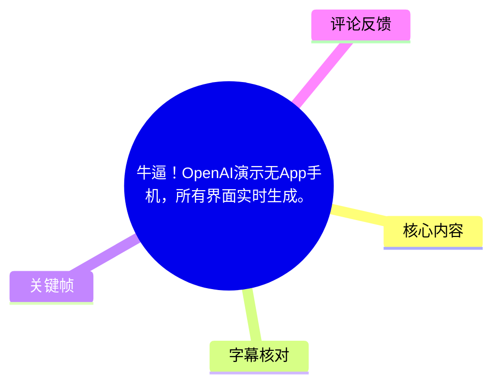
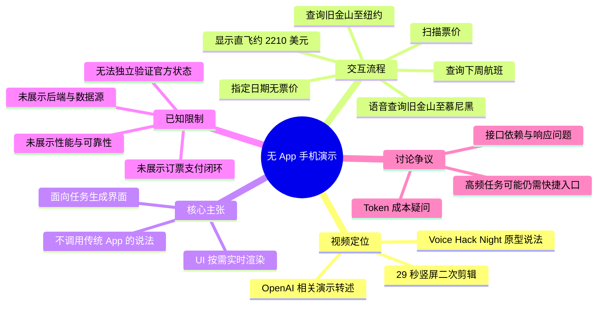

# 牛逼！OpenAI演示无App手机，所有界面实时生成。

> 来源：[Bilibili 视频](https://www.bilibili.com/video/BV17XEs6UEBa) 
> UP 主：轻声育儿｜视频时长：29 秒｜画面规格：1080 × 1920（竖屏）  
> 注：视频标题与画面文案将其描述为“OpenAI 演示无 App 手机”；本整理仅据所给视频、ASR 与关键帧记录，不将其进一步等同于 OpenAI 已正式发布的产品或可验证的官方能力。

## 小结

视频是一段约 29 秒的二次剪辑短片，展示了一个以语音提出航班查询需求、随后在手机上出现航班相关界面的演示。画面顶部文案称其为“无 App 手机”、所有界面“实时生成”，底部说明则将其归入 OpenAI Voice Hack Night 上展示的“Agentic 操作系统”原型。

可直接从本次英文 ASR 确认的交互包括：查询“下周初从旧金山到慕尼黑”的航班、查询慕尼黑航班、提出“界面应当即时渲染”的目标，以及显示一条“直飞约 $2,210”的结果；最后又查询从旧金山到纽约的航班，系统回复该日期没有可用票价。视频展示的是查询流程，而不是已完成订票。

关键思想不是“没有界面”，而是**不预先固定为传统 App 页面，而是让面向当前任务的 UI 按需生成**。不过，视频本身没有展示后端接口、数据来源、生成延迟、失败恢复、支付闭环、权限控制或跨任务持久化，因此无法仅凭此片段判断其性能、可靠性或可商用性。

画面中的中文说明写有“无需调用任何传统 App”，但这属于视频叙事/转述，不能由该短片独立验证。尤其航班搜索仍需要实时或准实时的库存、价格与规则数据；动态生成界面不等于不依赖服务、接口或业务系统。

适合关注 AI Agent、动态 UI、语音交互与移动端产品形态的人阅读。该内容具有强时效性：视频元数据对应 2026 年 6 月发布，演示所属活动、原型状态及相关产品能力均可能随时间变化。

## 思维导图

## 目录

- [背景与证据边界](#背景与证据边界)
- [演示流程：慕尼黑航班查询](#演示流程慕尼黑航班查询)
- [动态 UI 的视频主张与可见结果](#动态-ui-的视频主张与可见结果)
- [第二次查询与失败结果](#第二次查询与失败结果)
- [可复用的产品流程与实施条件](#可复用的产品流程与实施条件)
- [结论、限制与时效性](#结论限制与时效性)
- [字幕比对](#字幕比对)
- [评论分析](#评论分析)
- [处理记录](#处理记录)

## 背景与证据边界 [00:00](https://www.bilibili.com/video/BV17XEs6UEBa?t=0)

视频封面式画面反复显示标题“OpenAI 演示无 App 手机：所有界面实时生成”。底部中文说明称：据“钛媒体 AGI”，在 OpenAI Voice Hack Night 活动上，有一支团队现场展示了基于 AI 打造的“Agentic 操作系统”原型；演示中所有界面均为“即时生成”，且“不调用任何传统 App”。

> 图：该关键帧同时保留了视频的标题性主张、手机演示画面和底部来源说明。它的价值在于区分“视频转述的主张”与“ASR 能直接确认的语音内容”：前者并非本整理可独立核验的官方公告。

这里的“无 App”应谨慎理解。根据视频可见文本，它指向一种任务驱动、按需呈现的交互方式；它**不自动证明**手机操作系统、服务端、航班数据、身份认证或交易系统不再存在。短片没有提供系统架构图、代码、接口调用记录或官方原始出处链接。

## 演示流程：慕尼黑航班查询 [00:00](https://www.bilibili.com/video/BV17XEs6UEBa?t=0)

### 1. 提出自然语言任务 [00:00](https://www.bilibili.com/video/BV17XEs6UEBa?t=0)

本次 ASR 在 `00:00.000–00:04.200` 识别为：

> “Checking a flight early next week to Munich from San Francisco.”

可译为：查询下周初从旧金山前往慕尼黑的航班。

该句包含的任务参数如下：

| 参数 | 视频/ASR 中可确认的内容 | 未提供的信息 |
| --- | --- | --- |
| 出发地 | San Francisco（旧金山） | 具体机场代码、出发机场 |
| 目的地 | Munich（慕尼黑） | 具体机场代码、到达机场 |
| 时间 | early next week（下周初） | 具体日期、时区 |
| 任务类型 | checking a flight（查询航班） | 订票、支付、出票等后续动作 |
| 舱位/人数 | 未提及 | 舱位、乘客人数、行李、预算等 |

画面内的中文字幕写作“帮我订下周从旧金山到慕尼黑的航班”，其中“订”比 ASR 的 “Checking” 更强，容易将“查询”误读为“完成购买”。在缺少站内字幕来源且英文音频 ASR 明确使用 “Checking” 的情况下，本文以“查询”为准。

> 图：画面显示用户手持手机、界面中央有发光的语音/助手式视觉元素，配合中文字幕呈现语音发起任务的情境。它有助于理解演示的输入方式是自然语言交互，而非从传统应用图标进入固定流程。

### 2. 系统确认查询对象 [00:06](https://www.bilibili.com/video/BV17XEs6UEBa?t=6)

`00:06.360–00:08.280` 的 ASR 为：

> “Checking Munich flights for next week.”

即“正在查询下周前往慕尼黑的航班”。这一步表现为系统对任务的简短确认，但短片未展示它如何补全“下周初”的具体日期，也没有展示是否询问用户日期、人数、舱位等关键约束。

## 动态 UI 的视频主张与可见结果 [00:10](https://www.bilibili.com/video/BV17XEs6UEBa?t=10)

### 1. “即时渲染 UI”是演示目标 [00:10](https://www.bilibili.com/video/BV17XEs6UEBa?t=10)

`00:10.740–00:18.520` 的 ASR 先说：

> “UIs should be rendered on the fly, that's the goal.”

可译为：“界面应该按需即时渲染，这就是目标。”

这句话是本视频最直接的技术主张。它描述的是 UI 生成策略：系统不必预先让用户在一组固定 App/固定页面中导航，而是围绕当前意图临时呈现相应的信息界面。画面底部中文文案的“所有界面均为即时生成”与这句英文方向一致。

不过，视频没有说明“生成”具体发生在哪一层：

- 是模型直接生成前端代码，还是从既有组件库拼装；
- 是在设备本地渲染，还是由云端返回 UI 描述；
- 是否受模板、设计系统、权限策略与安全规则约束；
- 航班结果是否来自真实供应商接口、测试数据或预录演示。

因此，“UI 即时渲染”可作为视频中的目标/理念记录，但不能延伸为已证实的工程实现细节。

### 2. 票价扫描与结果 [00:10](https://www.bilibili.com/video/BV17XEs6UEBa?t=10)

同一 ASR 段继续给出：

> “Non-stop from about $2,210.”

即“直飞航班约从 2,210 美元起”。

画面中可见一个蓝色卡片式状态面板，文字为 “Scanning fares”（正在扫描票价），与航班价格搜索的过程相匹配。

> 图：该关键帧展示了名为“Scanning fares”的浮层卡片及飞机图标。它的价值在于表明演示不只给出一句语音反馈，还试图用任务相关的中间状态 UI 呈现“正在查价”。

关于价格信息，应保留以下边界：

- 视频仅给出“约 $2,210”的直飞起始价格，未给出航空公司、日期、币种换算、税费、舱位、退改规则或数据更新时间。
- 美元符号 `$` 出现在 ASR 文本中，故可记录为美元计价；但不能据此判断票价真实性或可购买性。
- “from”（起）表明这不是对某一具体行程的最终总价承诺。
- 视频没有展示从查价进入选择航班、乘客信息填写、支付确认和出票的闭环。

## 第二次查询与失败结果 [00:21](https://www.bilibili.com/video/BV17XEs6UEBa?t=21)

`00:21.610–00:28.200` 的 ASR 为：

> “Checking New York flights. Fares weren't available for that date.”

即“正在查询纽约航班。该日期没有可用票价。”

这一段展示了系统返回负向结果，而非始终输出成功答案。它至少说明演示中包含“票价不可用”的反馈文案；但仍无法据此判断其失败原因究竟是无库存、无报价、日期解析问题、接口异常，还是演示数据设定。

第二次查询也有一个转写层面的不完整之处：前一段 ASR 尾部出现了 “A flight from San Fransisco to New York.”，而最后一段才说“Checking New York flights”。两段合起来可以理解为新增了“旧金山到纽约”的航班查询，但 ASR 没有完整保留用户发起该任务的单独句子。故本文仅记录已识别到的地点与返回结果，不补造日期、价格或操作细节。

## 可复用的产品流程与实施条件 [00:00](https://www.bilibili.com/video/BV17XEs6UEBa?t=0)

视频展示的是一个极简流程。若将其抽象为可复用的 Agent 产品链路，实际至少需要以下环节；其中仅“自然语言输入—查找—显示结果/不可用反馈”的表层流程为视频直接呈现，其余是要让此类系统落地时不可回避的实施条件，并非视频披露的实现细节。

1. **接收任务描述**  
   用户以语音表达目的地与大致时间，如“下周初从旧金山到慕尼黑”。系统需要进行语音识别、语言理解和实体提取。

2. **补齐或确认约束**  
   航班任务通常需要明确出发/到达机场、日期、人数、单程或往返、舱位及预算。视频只展示了模糊时间范围，未展示澄清机制。

3. **调用受控的数据与行动能力**  
   若结果是真实航班信息，系统需要接入航班搜索、聚合商或航空公司数据。模型生成 UI 并不能替代对数据源、授权、限流与合规性的处理。

4. **按任务呈现 UI**  
   视频所强调的差异在此：系统可根据“查票”任务显示扫描状态、价格卡片或筛选项。实际设计仍应限制可生成组件范围，避免模型任意生成不安全、不可访问或误导性的控件。

5. **处理成功、无结果与异常**  
   “该日期没有可用票价”是视频唯一明确的负向反馈。成熟流程还应区分无库存、查询超时、权限不足、日期不明确与服务不可用，并提供修改日期或筛选条件的下一步。

6. **涉及交易时转入高保障确认**  
   本片没有订票支付。若从“查询”升级到“下单”，应增加价格复核、用户确认、身份验证、支付授权、可撤销性提示和订单凭证；这些不能仅靠一句自然语言或生成式界面省略。

## 结论、限制与时效性 [00:21](https://www.bilibili.com/video/BV17XEs6UEBa?t=21)

视频最有价值的部分，是以航班查询这个高频而结构化的任务，说明“意图驱动界面”可以如何替代部分传统的“打开 App—逐层寻找入口—填写表单”的流程。可迁移的经验是：当用户目标清晰、数据接口明确、动作风险可控时，系统可以围绕当前任务即时组织信息与操作入口。

但短片提供的证据规模很小：只有约 29 秒，未展示真实数据源、端到端延迟、多个连续任务的上下文保持、错误恢复、隐私权限、无障碍设计、离线能力或交易完成率。故不能据此得出“传统 App 已被替代”“不依赖后端”或“可直接用于生产”的结论。

视频称其为 OpenAI Voice Hack Night 中的团队原型，标题又使用“OpenAI 演示”表述。基于当前素材，较稳妥的表述是：**这是一段被归因于相关活动原型的二次传播演示，而非已由本素材验证的 OpenAI 正式产品发布。**

时效性方面，视频发布信息指向 2026 年 6 月；航班价格、活动背景、模型和产品能力都可能变化。文中 `$2,210` 仅代表视频中某次展示的说法，不应作为当前票价参考。

## 字幕比对

| 字幕来源 | 完整性 | 专有名词 | 时间轴 | 主要问题 |
| --- | --- | --- | --- | --- |
| Bilibili 站内字幕 | 未提供可用字幕 | 无法核验 | 无法核验 | 素材处理警告显示字幕工具因 `Invalid URL` 退出，故没有可比较的站内 SRT。 |
| 本次 ASR 字幕 | 共 4 段，覆盖约 20.49 秒语音；诊断覆盖率 72.21% | 识别出 Munich、San Francisco、New York、$2,210；其中 `San Fransisco` 拼写有误 | 有真实 SRT 起止时间，覆盖 00:00.000–00:28.200 | 将部分相邻语义合并；未完整保留第二次查询的完整发起句；未转写画面中的中文说明。 |

最终采用**本次 ASR 的带时间轴英文语音**作为时间定位依据，并结合关键帧中的中文字幕与界面文字补充画面信息。站内字幕没有可用结果，无法进行逐句一致性比较。

本次 ASR 诊断显示存在音频流，`noAudioStream` 并未标记为 `true`；因此不能将视频理解为“无音轨”。ASR 使用 `medium` 模型、自动语言识别为英语，置信概率为 `0.8212890625`，音频时长为 `28.3748125` 秒。

经关键帧和上下文校正/保留的要点：

- ASR 的 `San Fransisco` 应规范写作 **San Francisco**；这是地名拼写校正，不改变语义。
- 中文画面写“帮我订……航班”，而英语 ASR 是 “Checking a flight”，正文采用较保守的“查询航班”。
- 中文画面提到 OpenAI Voice Hack Night、Agentic 操作系统及“不调用传统 App”；这些内容来自画面文本，而不是本次 ASR 的英文语音，已在正文中明确标注为视频转述。
- “Scanning fares”来自关键帧可见 UI 文本，辅助解释查价过程，但不能证明其数据为实时真实票价。

## 评论分析

以下仅处理所提供的热评前三条。评论是观众观点，不构成对视频技术实现或商业可行性的验证。

1. **即逝未來（851 赞）**  
   评论以反讽方式提出：高频任务若每次都让 AI 重新生成会很麻烦，不如固定为可点击的快捷指令图标，并将其称为 “Application”。  
   - **补充价值**：指出生成式交互与传统 App 并非非此即彼。对于发邮件、打电话等重复任务，稳定入口、可发现性和肌肉记忆依然重要。  
   - **争议/边界**：该评论没有否定动态 UI 在低频、复杂或长尾任务中的价值；其核心是对“所有操作都临时生成”的用户体验提出质疑。

2. **EmptyLava（322 赞）**  
   评论认为演示仍依赖后端接口，需要在提示词中定义接口返回值，再由模型生成代码渲染 UI；并质疑性能、可靠性和响应速度。  
   - **补充价值**：强调“无传统 App”不等于“无后端/无接口”，与视频证据边界相吻合。航班查询确实需要数据服务或等价的数据提供机制。  
   - **争议/边界**：其“前端倒退 20 年”等结论属于立场化评价。视频未提供架构、延迟或稳定性测量数据，无法据此验证该评论对性能的断言。

3. **极高伤害（147 赞）**  
   评论质疑高频生成 UI 的 Token 成本，戏称“一天一万块钱 token 够吗”。  
   - **补充价值**：提醒需要评估模型推理、上下文、生成与工具调用的单位任务成本，尤其是在高频移动端交互中。  
   - **争议/边界**：视频没有披露所用模型、输入输出长度、缓存、调用频次、端侧/云端部署或价格，因此无法计算实际成本，“一天一万块”仅为夸张式疑问。

## 处理记录

- **Worker ID**：`worker-mrj0wjed-b0c290ad`
- **模型**：`gpt-5.6-terra`；音频 ASR 模型为 `medium`，设备为 CUDA，计算类型为 `float16`。
- **调用/使用的素材工具结果**：使用任务提供的元数据、音频 ASR 结果与 SRT 时间轴、关键帧清单及热评 JSON；未提供可用站内字幕文本。
- **字幕选择**：站内字幕获取失败，处理警告为 `subtitles: Tool process exited with code 1` / `Invalid URL`；最终以本次 ASR 的 4 个带时间戳分段作为时间轴依据，以关键帧中的画面文字作补充，并对“订票/查询”差异采取保守表述。
- **关键帧选择依据**：选用 `frames/frame-001.jpg` 展示标题和来源性中文说明，`frames/frame-002.jpg` 展示语音任务发起状态，`frames/frame-004.jpg` 展示 “Scanning fares” 的任务相关 UI。选择标准是画面与对应 ASR 分段存在直接语义关联，且能支撑正文中的可见事实。
- **缓存清理**：未提供缓存清理命令、执行日志或结果，无法确认是否已清理；不将其表述为已完成。
- **未解决问题**：缺少站内字幕和原始演示出处；无法核验“OpenAI 演示/Voice Hack Night 原型”的官方归属，无法确认航班数据真实性、系统架构、模型、接口、延迟、成本、权限与交易能力。
