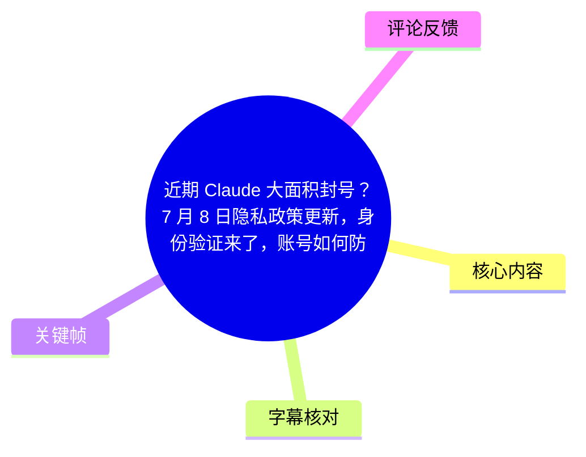
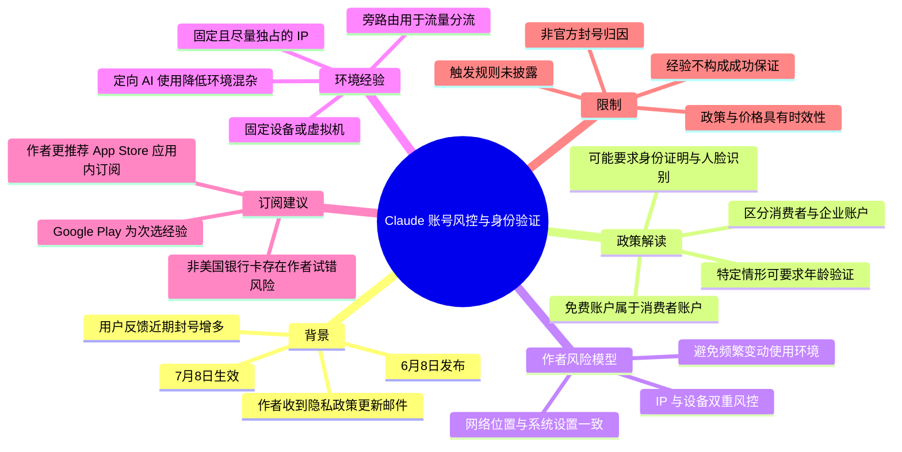
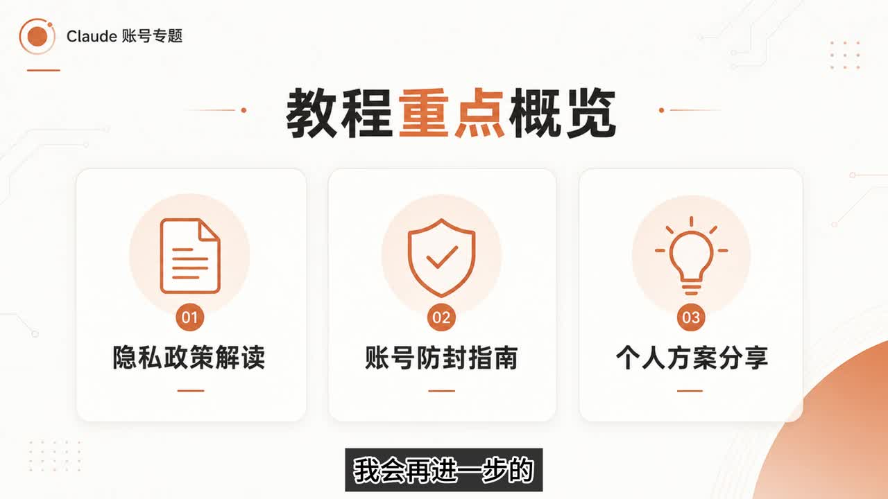
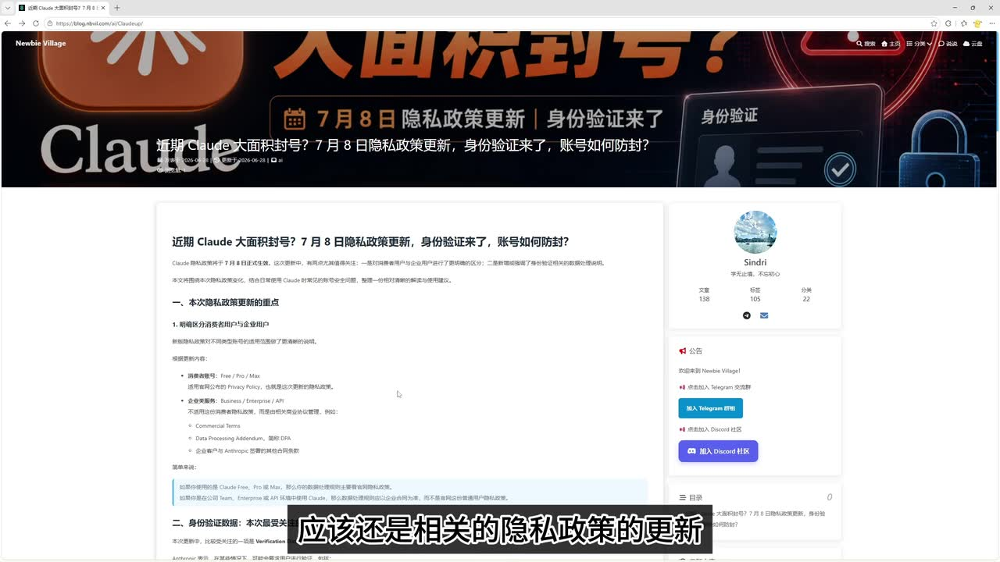
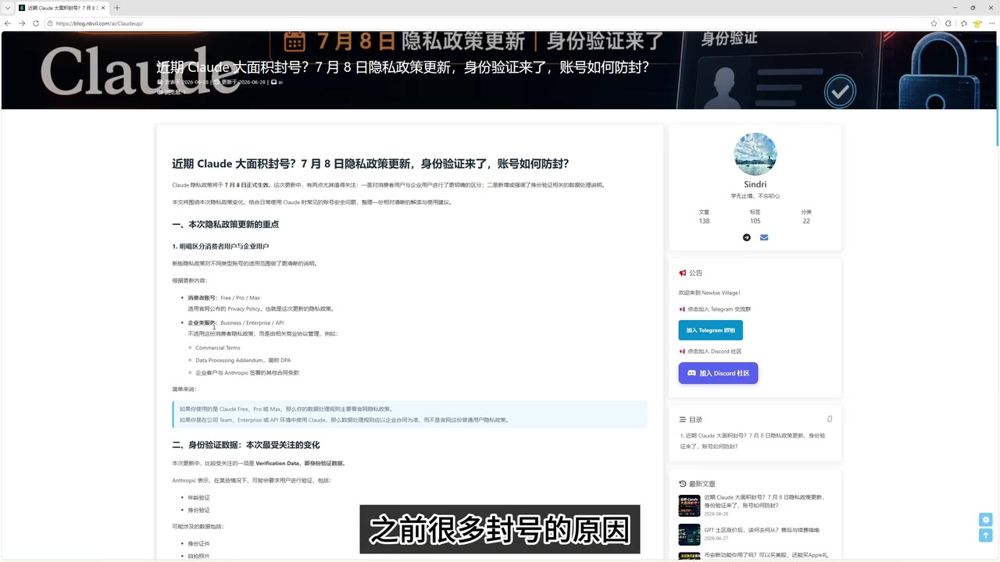

# 近期 Claude 大面积封号？7 月 8 日隐私政策更新，身份验证来了，账号如何防封？

> 来源：[Bilibili 视频](https://www.bilibili.com/video/BV1YfTT6hEpp) 
> UP 主：专心做教程｜时长：16 分 47 秒｜分辨率：2560×1440 
> 数据抓取时间：2026-07-13；视频所讨论的政策节点为 7 月 8 日，属于强时效信息。

## 小结

视频围绕近期 Claude 账号被大量封禁的反馈展开。UP 主称，粉丝群中有不少用户报告账号受限，且临近视频发布时封号情况有所增多；其个人判断认为，这与 Claude 隐私政策更新及其配套风控机制有关。该判断是作者结合邮件、政策页面和用户反馈作出的解释，并非视频内提供的官方“封号原因”确认。

视频将重点放在一项据称于 **6 月 8 日发布、7 月 8 日生效**的隐私政策变化：政策区分消费者账户与企业类账户，免费账户也被纳入消费者账户范围；在某些情况下，平台可能要求用户完成年龄及身份验证，并可能涉及身份证明和人脸识别。作者将生效前的现象理解为新机制的试运行或内测阶段，但具体触发规则、验证范围及封禁判定标准，视频均未给出官方细则。

在操作经验层面，UP 主的核心观点不是追逐所谓“住宅 IP”或第三方“IP 纯净度检测”，而是维持长期稳定、独占使用的网络出口，并尽量让网络位置、设备、系统地区与时区等环境信号保持一致。他将其概括为“IP + 设备”的双重风控环境；这是个人经验性方案，不应理解为 Claude 官方公布的防封标准或成功保证。

订阅部分，作者根据自己的试错经历，认为通过 App Store 应用内订阅相对更稳，并称 Google Play 应用内订阅“目前反馈还可以”；他不推荐使用非美国银行卡直接订阅，也提醒官网 Google Pay 虽被支持，但据其收集的反馈仍可能存在账号风险。上述支付建议均为个人经验和社区反馈，支付可用性、地区限制与平台规则可能随时变化。

作者展示的自用方案是：使用已近一年、用于定向 AI 操作的固定 VPS IP；为 AI 操作单独配置固定虚拟机；并通过旁路由将该虚拟机的流量分流出去，尽量避免日常高频、杂乱流量影响该网络环境。适合需要理解视频所述风险模型、并希望整理自身账号使用环境的读者；不适合将其视为规避平台规则、绕过身份验证或保证不封号的操作指南。

## 思维导图

## 目录

- [背景：封号反馈与视频结构](#背景封号反馈与视频结构)
- [政策变化：消费者账户、身份与年龄验证](#政策变化消费者账户身份与年龄验证)
- [防封经验：稳定网络与固定设备](#防封经验稳定网络与固定设备)
- [设备定位、地区与时间设置](#设备定位地区与时间设置)
- [订阅与支付方式的经验判断](#订阅与支付方式的经验判断)
- [个人方案：VPS、虚拟机与旁路由](#个人方案vps虚拟机与旁路由)
- [结论、限制与时效性](#结论限制与时效性)
- [字幕比对](#字幕比对)
- [评论分析](#评论分析)
- [处理记录](#处理记录)

## 背景：封号反馈与视频结构 [00:00](https://www.bilibili.com/video/BV1YfTT6hEpp?t=0)

视频开头，UP 主称近期出现了“大批量”Claude 账号被封的情况，粉丝群内也有人反馈问题，且“这两天”被封账号尤其多。他提到自己此前曾制作过防封指南，并已提示近期风控升级；随后表示收到 Claude 官方发出的隐私政策更新邮件，因此将本期内容组织为三个部分：

1. 最新隐私政策中值得关注的内容；
2. 对账号使用环境与防封经验的进一步说明；
3. 个人当前使用方案分享。

这里的“封号增多”来源于作者的观察与社群反馈。视频没有展示封禁邮件、官方封号统计、具体账号样本或平台公开数据，因此不能据此量化封号规模，也不能确定所有封禁都由同一种规则触发。

> 图：开场画面突出“如何避免封号”的主题，并列出“降低风险、稳定使用、长期养号、性价比高”等宣传性关键词。它有助于明确本片定位为作者的风险管理经验分享，而不是官方政策公告。

> 图：画面明确列出“隐私政策解读、账号防封指南、个人方案分享”三部分，和视频实际叙述结构对应，可作为阅读全文的导航依据。

## 政策变化：消费者账户、身份与年龄验证 [01:05](https://www.bilibili.com/video/BV1YfTT6hEpp?t=65)

### 1. 作者对大面积封禁原因的判断

[01:05](https://www.bilibili.com/video/BV1YfTT6hEpp?t=65) 起，作者表示，Claude 的整体风控“高于 GPT 和 Gemini”（ASR 在此处出现了模型名称识别错误，结合画面主题与语境整理为 GPT、Gemini）。对于此次大面积封禁，他认为“主要原因应该还是”隐私政策更新。

需要区分：

- **视频可确认的陈述**：作者收到了与隐私政策更新相关的邮件，并展示了一篇整理政策内容的博客页面。
- **作者推断**：近期封号主要由政策更新及风控升级导致。
- **视频未证明的内容**：具体封禁是否由身份、付款、IP、设备、地区、滥用行为或其他平台规则分别触发。

### 2. 消费者账户与企业类账户的区分

[01:38](https://www.bilibili.com/video/BV1YfTT6hEpp?t=98) 起，作者指出，更新内容区分了两类账户：

- **消费者账户**：视频说明免费账户亦属于这一范围；
- **企业类账户**：作者在画面中概括为 Business / Enterprise / API 等相关类型。

作者借此提醒：免费账户不应被视为不受风控影响的账户类型。此前部分用户可能将封号主要归因为订阅或付款问题，但作者认为，经正规渠道订阅时，一般不应仅因付款原因被封；同时，他强调免费账户同样需要注意环境和使用风险。

> 图：画面显示题为 Claude 账号专题的博客整理页面，并可见“本次隐私政策更新的重点”“明确区分消费者用户与企业用户”等小节。该帧的价值在于保留了作者解读所依托的页面语境；但页面本身是作者整理内容，不能替代官方原文核验。

### 3. 身份验证与生效时间

[02:20](https://www.bilibili.com/video/BV1YfTT6hEpp?t=140) 起，作者强调政策中的身份验证变化：

- 政策据称于 **6 月 8 日发布**；
- 据称于 **7 月 8 日生效**；
- 在某些情况下，可能要求用户进行年龄与身份认证；
- 认证可能涉及身份证明及人脸识别。

作者认为，在正式生效前已有部分用户触发身份验证，当前可被看作相关机制的试运行阶段；他将 7 月 8 日之后称为“真正的审判”，即预期风控机制会更完整地实施。

这一表述存在重要边界：视频没有展示官方关于“哪些用户必须验证”“接受哪些证件”“人脸信息处理方式”“验证失败后果”“是否按地区或功能分层”的完整条款。因此，身份验证的实际适用范围应以当时的官方隐私政策、产品提示和账户通知为准。

> 图：画面继续停留在政策整理页面，可见“身份验证数据：本次最受关注的变化”等标题。其价值在于对应视频重点转向身份验证；但具体规则仍需回到官方原始条款与账户内提示确认。

## 防封经验：稳定网络与固定设备 [04:20](https://www.bilibili.com/video/BV1YfTT6hEpp?t=260)

### 1. IP：作者反对将“住宅 IP”作为默认解法

[04:20](https://www.bilibili.com/video/BV1YfTT6hEpp?t=260) 起，作者首先强调 IP 的稳定性，但明确表示自己不普遍推荐住宅 IP。他称，除此前申请德国 Vodafone 服务时曾因特定风控变化建议领取免费住宅 IP 外，自己在绝大多数场景中不认为住宅 IP 必不可少。

其理由包括：

- 真实、独占的住宅 IP 不易取得；
- 市面上被宣传为住宅 IP 的资源未必具备其声称属性；
- 与其追求标签，不如确保固定 IP 长期由单一使用者持有和使用；
- IP 跳变，即短时间内频繁出现在不同地点或不同网络环境中，可能带来风险。

视频中的“99% 场景用不到住宅 IP”是作者经验判断，不是平台规则，也没有给出统计样本或验证方法。

### 2. “独占 IP”的服务器类比

[05:15](https://www.bilibili.com/video/BV1YfTT6hEpp?t=315) 起，作者以“邮箱地址”类比 IP 和服务器的关系：

- 仅租用一个 IP 地址时，作者认为难以确认该地址是否也被其他人使用；
- 租用完整服务器并绑定公网 IP 时，作者认为该 IP 使用环境更容易保持独占；
- 因而，若目标是减少共享环境的不确定性，应关注“长期、固定、单独使用”，而不只是购买某种被营销的 IP 类别。

该类比用于说明作者的理解框架，并不等价于所有云服务商的网络分配机制。公网 IP、NAT、共享出口、云主机网络设计与服务商实际策略各不相同；更重要的是，平台是否将某一网络信号判定为风险，以及权重如何，视频未能验证。

### 3. 对“IP 纯净度检测站”的质疑

[07:00](https://www.bilibili.com/video/BV1YfTT6hEpp?t=420) 起，作者不建议过度信赖网络上的 IP “纯净度”检测工具。其观点是：此类服务通常只能检查公开可见的滥用标记、黑名单或历史公开信息，无法可靠判断一个 IP 实际被多少人使用，也无法得知未被公开标记的全部行为。

这一点适合作为工具使用边界的提醒：公开信誉库可用于发现已知滥用记录，却不能证明某个 IP 在某平台上必然安全，更不能替代平台自身的风控判断。

## 设备定位、地区与时间设置 [08:10](https://www.bilibili.com/video/BV1YfTT6hEpp?t=490)

### 1. 作者提出的“IP + 设备”风险模型

[08:10](https://www.bilibili.com/video/BV1YfTT6hEpp?t=490) 起，作者称，固定 IP 只能让网络环境相对稳定，设备环境同样重要。他援引自己在此前教程中遇到的提示：系统地区与时间不匹配时可能出现警告。因此他推断，风控可能综合观察以下因素：

| 环境因素 | 视频中的说明 | 性质 |
| --- | --- | --- |
| IP 或网络位置 | 需要稳定，避免频繁跳变 | 作者经验 |
| 设备 | 使用固定设备或固定虚拟机 | 作者经验 |
| 系统地区 | 应与使用网络的地区相协调 | 基于作者遇到的提示与推断 |
| 时区/系统时间 | 与网络位置不匹配可能引发警告 | 作者陈述 |
| 系统语言与使用语言 | 可能需要关注，但作者称中文暂未影响其使用 | 作者经验，未证实为规则 |

作者也说明，自己的虚拟机系统语言为中文，目前仍能稳定使用，因此他不认为系统语言一定要完全改变；但这并不说明所有账户、地区和时间点都不会受语言信号影响。

### 2. 视频展示的检查顺序

[09:05](https://www.bilibili.com/video/BV1YfTT6hEpp?t=545) 起，作者演示了自己的虚拟机与浏览器操作，并按以下顺序检查：

1. 打开 Google 页面并滚动到页面底部；
2. 查看页面显示的位置；
3. 点击更新位置，并在浏览器请求时同意定位；
4. 确认所显示的位置是否与当前网络 IP 的预期位置一致；
5. 在确认网络位置无误后，再检查或同步系统日期和时间；
6. 将系统的国家/地区及时区调整为与预期使用地区相匹配的状态。

作者特别提醒，不要在未确认网络位置前随意点击立即同步时间；他描述，曾因某次定位被更新到国内而认为 IP “被污染”，之后重新更新 IP 并等待约一周才恢复使用。这里的“污染”“养一周后切换”等说法是个人解释，视频没有给出可重复的因果验证，也未说明是哪项服务、哪种缓存或哪条规则导致位置变化。

### 使用边界

这些检查适合用于排查系统设置与实际网络环境明显不一致的问题；但不应据此伪造身份、规避地区限制或绕过平台要求的身份验证。平台可能依据多种内部信号作出限制决定，用户应遵循服务条款和所在地区法律，并优先使用受支持的地区、支付方式及身份信息。

## 订阅与支付方式的经验判断 [11:15](https://www.bilibili.com/video/BV1YfTT6hEpp?t=675)

[11:15](https://www.bilibili.com/video/BV1YfTT6hEpp?t=675) 起，作者转向付款问题，并区分了自己的实际经验与建议：

| 方式 | 视频中的反馈或建议 | 需要注意的限制 |
| --- | --- | --- |
| App Store 应用内订阅 | 作者称自己此前正常订阅后使用稳定；在本片中最推荐 | 属于个人经验；需符合 Apple、Claude 的地区与支付规则 |
| Google Play 应用内订阅 | 作者称“目前反馈应该还可以” | 仍是经验性反馈，未给出样本与成功率 |
| 官网 Google Pay | 作者称官网已支持，但“部分”情况下仍可能发生封号 | 未说明具体适用地区、卡种或触发条件 |
| 美国银行卡 | 作者称若使用美国银行卡，可作为直接订阅的考虑对象 | 不构成适用于所有用户的建议 |
| 非美国银行卡 | 作者不推荐用于尝试直接订阅，称自己曾次日遭封 | 单个试错经历不能证明必然因果 |
| 第三方自动充值/CDK 店铺 | 作者提到不想折腾可参考其过去教程 | 视频未展开供应商可靠性、售后、合规与账户安全风险 |

作者的核心排序为：账号本身比冒险尝试支付手段更重要，因此不建议反复试错。与此同时，任何非官方代充、礼品卡或跨地区支付操作都可能涉及平台条款、退款争议、资金安全及账号关联风险；视频没有提供这些方案的独立安全审查，读者不应将其视为官方认可的订阅路径。

## 个人方案：VPS、虚拟机与旁路由 [12:45](https://www.bilibili.com/video/BV1YfTT6hEpp?t=765)

### 1. 网络与主机方案

[12:45](https://www.bilibili.com/video/BV1YfTT6hEpp?t=765) 起，作者分享其正在使用的组合：

- 使用固定 IP；
- 使用 RN 的 VPS，配合其口述的 “GIP IP”（ASR 对该缩写识别不稳定，未在素材中提供完整释义，故保留原称）；
- 该 IP 已使用接近一年，作者称当前没有问题；
- 核心需求是一个固定、稳定的 IP，因此可选择价格较低的方案；
- 若对中国大陆连接线路有较高要求，可考虑带优化线路的产品，但作者认为普通使用不一定有必要。

作者同时提到，受其所称的“全球硬件短缺”、供应变化等影响，VPS 出现缺货及涨价；他举例称最低年付方案上涨至 **21 美元/年，约合人民币 140 元/年**，此前约为 **10 美元/年**。这是视频中的当期价格描述，不是实时价格承诺，也不能外推至所有商家、地区和配置。

### 2. 定向用途与流量隔离

[13:50](https://www.bilibili.com/video/BV1YfTT6hEpp?t=830) 起，作者强调其固定 IP 只用于“固定定向的 AI 操作”，不建议把日常浏览等流量混合到该 IP。他认为日常流量类型更杂，可能使环境变得复杂；个人普通上网则更多使用其他网络服务。

这是一种“用途隔离”的环境管理思路，其目标是降低变量，而非保证平台一定接受账户。视频没有量化“流量杂”与封禁之间的关系，也没有给出平台官方确认。

### 3. 固定虚拟机与旁路由

[14:35](https://www.bilibili.com/video/BV1YfTT6hEpp?t=875) 起，作者说明自己使用固定虚拟机，并仅将其用于 AI 操作。在网络连接上，他使用软路由，且具体为旁路由模式：

- 已有一个主路由处理整体网络配置；
- 旁路由主要承担流量分流；
- 主要将虚拟机流量导向该网络环境；
- 视频称已附上相关软路由教程，但本片不展开具体安装、路由规则、固件版本或命令配置。

因此，不能从本视频复现完整的旁路由配置。若要实施网络设置，应依据所用路由器、操作系统和网络服务的官方文档操作，并谨慎保护账号、设备与网络安全。

## 结论、限制与时效性 [15:50](https://www.bilibili.com/video/BV1YfTT6hEpp?t=950)

视频的可迁移结论是：面对账号风控，不应把单一 IP 类型、第三方检测分数或某一种付款方式当作万能解法；作者更重视长期一致的网络与设备环境、减少频繁变动，以及谨慎试错。

但必须保留以下限制：

1. **封号归因未获官方证实**：作者将封号与隐私政策更新联系起来，是合理但未被视频证据完整证明的推断。
2. **身份验证规则不完整**：视频只指出“某些情况下”可能要求年龄、身份证明与人脸识别，未提供完整触发条件与后果。
3. **“防封”不是保证**：固定 IP、设备隔离、时区设置和支付方式只能构成作者的环境管理经验，不能保证账户不会被限制，也不应被用于规避平台的验证或地区规则。
4. **支付建议强依赖时效**：App Store、Google Play、Google Pay、银行卡和礼品卡等可用性会受地区、银行、商店账户、平台政策和风控调整影响。
5. **价格已过时风险高**：视频中的 VPS 年付 21 美元、约 140 元等价格仅是作者录制时的报价描述；不可作为购买决策的实时依据。
6. **应优先看官方通知**：涉及身份验证、隐私数据处理、账户状态或付款失败时，应以 Claude/Anthropic 的官方账户提示、支持文档和隐私政策为准。

## 字幕比对 [16:15](https://www.bilibili.com/video/BV1YfTT6hEpp?t=975)

本次任务中**未提供可用的 Bilibili 站内字幕**；本次 ASR 已执行，正文以 ASR 为主要文字来源，并结合标题、关键帧画面和上下文做了有限校正。

| 字幕来源 | 完整性 | 专有名词 | 时间轴 | 主要问题 |
| --- | --- | --- | --- | --- |
| Bilibili 站内字幕 | 未提供，无法比较实际文本 | 无法评估 | 无可用时间轴 | 素材明确标注“未提供可用站内字幕” |
| 本次 ASR 字幕 | 覆盖了从开场到结尾的主要口播内容 | 存在多处误识别，如“Cloud”应结合标题校正为 Claude；“防风/防昏”应为防封；“讯息机”应为虚拟机；模型及 IP 缩写部分不稳定 | 提供的是连续文本，未附逐句时间码；本文按语义段落与全片时长估算章节定位 | 中英文混读、同音词、产品名、缩写和网络术语识别误差较明显 |

### 最终字幕选择与校正原则

- **最终采用**：本次 ASR 字幕为主。
- **校正依据**：视频标题、关键帧中可见的“Claude”文字、上下文语义。
- **已明确校正的高置信词**：
  - `Cloud` → `Claude`
  - `防风`、`防昏` → `防封`
  - `讯息机` → `虚拟机`
  - `App Store`、`Google Play`、`Google Pay` → 按 ASR 上下文规范化拼写
- **未强行扩展的低置信词**：ASR 中的“GIF IP / GIP IP”等缩写在素材中无法确认完整写法，正文保留为“作者口述的 GIP IP”，不编造其具体网络类型或服务定义。
- **时间轴说明**：素材未提供带时间码的字幕，文中秒数为依据口播段落顺序和视频总时长整理的定位链接，用于快速回看，不应视作逐字字幕时间码。

## 评论分析 [16:30](https://www.bilibili.com/video/BV1YfTT6hEpp?t=990)

以下仅处理可获取的热评前三条。评论代表个体观点或情绪，不能作为 Claude、Anthropic、阿里或任何相关主体的已验证事实。

| 热评 | 点赞 | 观点概括 | 可提供的补充与可信度判断 |
| --- | ---: | --- | --- |
| 乐乐马卡龙：“md千问chovy了……要么别被发现，要么蒸的超越克劳德啊……” | 9 | 评论将普通用户账号受影响，与其所称的“蒸馏”事件联系起来，并表达对能力未提升却波及用户的批评。 | 属于情绪化评论，未提供新闻链接、官方说明或证据链。“千问”“蒸馏”“封号”之间是否存在因果关系，不能由该评论确认。 |
| 小黑哥527：“阿里这波伤到太多普通人了” | 27 | 认为某一事件伤害了大量普通用户。 | 点赞数为三条中最高，说明存在一定共鸣，但评论未说明“这波”具体指什么、影响范围或数据来源，不能据此认定受影响主体与规模。 |
| 神楽みお：“不要打开邮件！！会获取你的IP地址！！” | 4 | 提醒用户不要打开邮件，声称邮件会获取 IP 地址。 | 该说法缺少上下文和证据。一般网页或邮件中的远程资源可能产生访问记录，但是否收集、如何使用 IP、是否与账号风控有关，取决于邮件内容、客户端加载策略和服务端规则。不能据此断言“不要打开邮件”是有效或必要的账号保护措施。 |

## 评论分析

本次流程未获取到可用热评，因此不推断观众态度或额外结论。

## 处理记录

- **Worker ID**：worker-mrj0www4-e8d79408
- **模型**：gpt-5.6-terra
- **调用工具与素材**：基于任务提供的视频元数据、ASR 字幕、12 张关键帧路径、热评 JSON、封面及素材清单进行整理；未提供可调用的外部网页检索、官方政策原文或逐帧视频播放工具。
- **字幕选择**：站内字幕不可用；已执行本次 ASR，并以 ASR 为主。针对 Claude、虚拟机、防封等高置信误识别，使用标题、关键帧和上下文校正；对无法核实的缩写未擅自补全。
- **关键帧选择依据**：
  - `frames/frame-001.jpg`：适合说明视频主题及其“风险降低”定位；
  - `frames/frame-002.jpg`：清楚呈现三段式教程结构；
  - `frames/frame-003.jpg`：对应作者展示的政策整理页面与账户类型区分；
  - `frames/frame-004.jpg`：对应身份验证成为政策解读重点。
  
  其余关键帧虽已在素材目录中列出，但未提供可辨识画面内容描述，未将不可确认的画面用途编入正文。
- **时间轴依据**：素材未提供逐句时间码；依据 1007 秒总时长、ASR 叙述顺序和章节转换估算时间点，并生成 Bilibili 秒数链接。
- **缓存清理**：未在本次对话中生成或保留可清理的本地缓存文件；素材路径按任务要求保留为相对路径引用。
- **未解决问题**：
  1. 未提供 Claude 官方隐私政策原文，无法独立核验作者关于 6 月 8 日发布、7 月 8 日生效及验证范围的全部表述；
  2. 未提供具体封号通知、账号样本或统计数据，无法验证“近期大面积封号”的规模和单一原因；
  3. 未提供带时间码站内字幕，所有时间轴均为段落级定位；
  4. VPS 服务、价格、支付方式与平台风控规则均可能已变化，需以实时官方信息为准。
