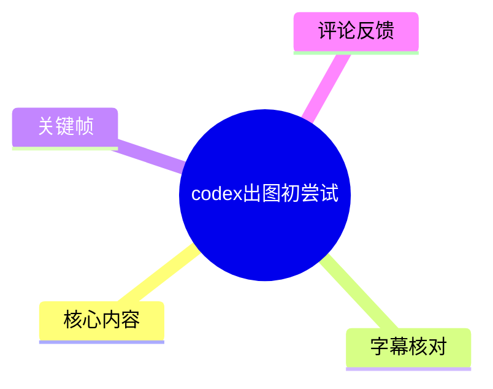
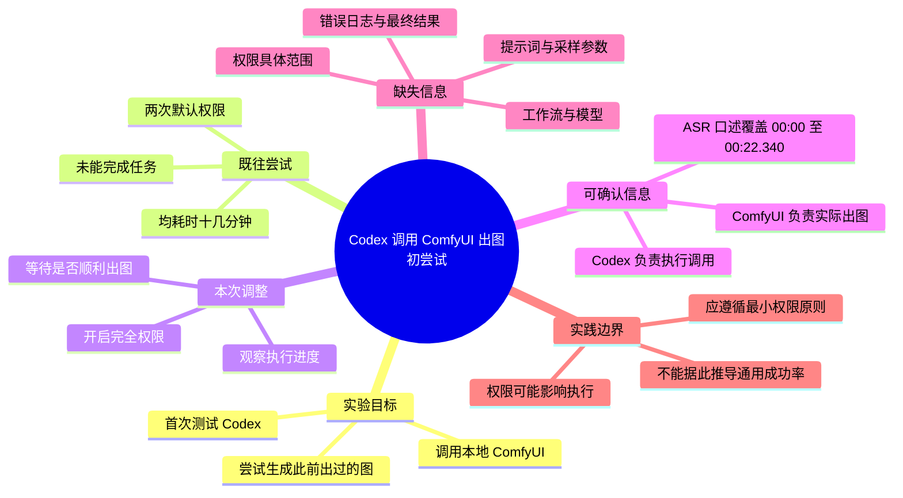
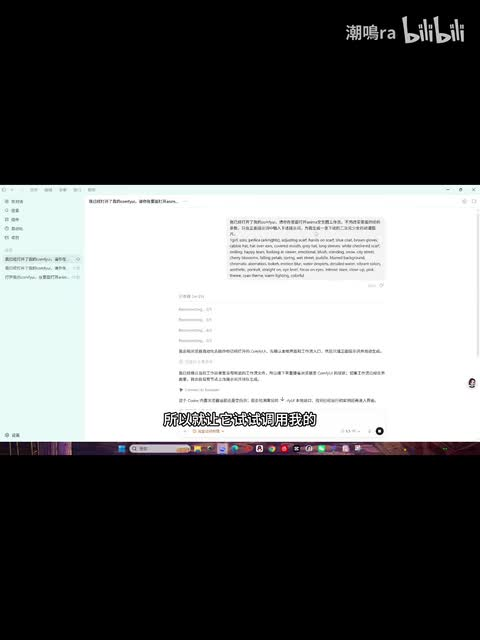
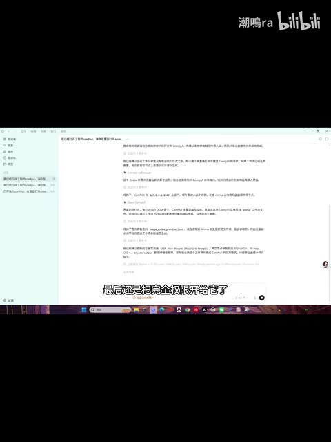
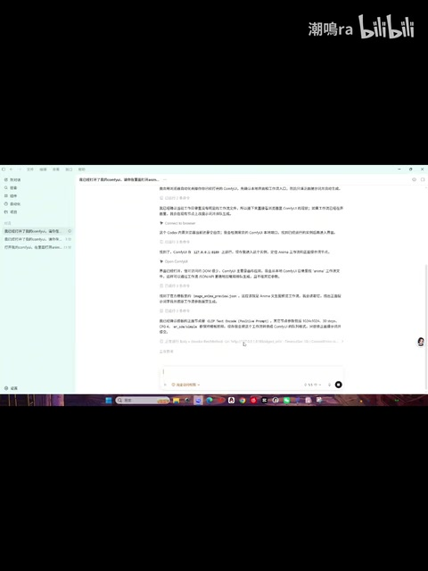
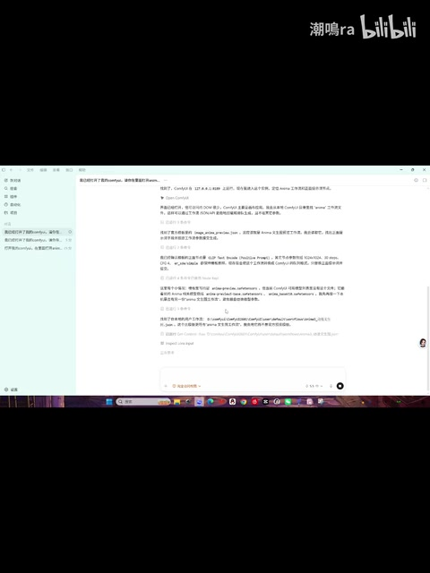

## 小结

这是一段关于 **首次使用 Codex 调用本地 ComfyUI 出图** 的实验记录。UP 主「潮鳴ra」并非让 Codex 自身直接生成图片，而是让它操作已有的 ComfyUI 环境，尝试生成一张此前已经出过的图；视频简介也明确写道：“其实是调用comfyui出图啦”。

视频中最重要的实验变量是 **权限级别**。UP 主称，前两次以默认权限让 Codex 执行同类任务时，均“折腾了十几分钟都没搞定”；本次则开启了“完全权限”，并等待、观察 Codex 是否能顺利调用 ComfyUI 完成出图。素材能够确认权限调整发生了，但没有给出具体授权范围、报错日志或失败根因。

可迁移的经验是：编码/执行代理接入本地生成式工作流时，任务成败不仅取决于提示词，也取决于代理是否有权访问所需的文件、终端、服务、工作流或目录。不过，视频没有展示 ComfyUI 工作流 JSON、模型与节点、提示词、API 地址、端口、生成参数或完整日志，因此不能将其视为可直接复现的操作教程。

本视频总时长为 117 秒；本次 ASR 仅识别到 **00:00—00:22.340** 的一段口述，语音覆盖约 19.18%。后续画面虽持续展示聊天/执行界面，但缺乏可核验的后续语音或站内字幕。因此，无法从现有素材确认本次最终是否成功出图、实际耗时及图片质量。

该经验具有时效性。Codex 的能力与权限策略、ComfyUI 的版本及节点兼容性、本地操作系统权限和部署方式均可能变化。本文仅整理视频所记录的个人环境实验，不将其扩展为通用结论。

## 思维导图

## 目录

- [视频定位与技术关系](#视频定位与技术关系)
- [实验目标、前置条件与权限变量](#实验目标前置条件与权限变量)
- [视频中的操作顺序](#视频中的操作顺序)
- [关键帧与画面信息](#关键帧与画面信息)
- [参数、限制与可复用经验](#参数限制与可复用经验)
- [时效性与未证实事项](#时效性与未证实事项)
- [字幕比对](#字幕比对)
- [评论分析](#评论分析)
- [处理记录](#处理记录)

# 视频定位与技术关系 [00:00](https://www.bilibili.com/video/BV1s2Gd6aEVL?t=0)

- **视频标题**：codex出图初尝试
- **UP 主**：潮鳴ra
- **合集**：AIcode
- **视频时长**：117 秒
- **画面规格**：1080 × 1440，竖屏
- **视频简介**：`其实是调用comfyui出图啦，up主第一次用codex，真是非常惊讶`
- **标签**：ChatGPT、comfyui、anima、codex、AIGC
- **发布信息**：素材工作区记录的发布日期为 2026-05-26。
- **数据快照**：抓取时记录播放 8,860、点赞 201、收藏 326、评论 67。该数据为抓取时快照，不代表当前实时数据。

这不是 Codex 或 ComfyUI 的官方产品发布内容，而是一位创作者在个人本地环境中的试用记录。根据视频简介与开场口述，可确认两者分工如下：

| 工具 | 在视频中的角色 | 可确认程度 |
| --- | --- | --- |
| Codex | 负责理解任务、执行操作并尝试调度本地环境 | 视频口述明确说明正在测试其“办事能力” |
| ComfyUI | 实际承担图像工作流与出图任务 | 视频简介明确说明“调用comfyui出图” |

因此，“Codex 出图”更准确的理解是：**由 Codex 协助调用本地 ComfyUI 完成出图**，而不是该视频证明 Codex 自身提供了独立图像生成模型。

# 实验目标、前置条件与权限变量 [00:00](https://www.bilibili.com/video/BV1s2Gd6aEVL?t=0)

## 实验目标

根据唯一可用的 ASR 时间轴字幕，UP 主在开场说明：

> “今天第一次玩 Codex，想测试下他的办事能力，所以就让他试试调用我的 ComfyUI 生成之前出过的一张图。”

可将该任务整理为三个目标：

1. 测试首次使用的 Codex 是否能处理本地工具协作任务；
2. 让 Codex 调用 UP 主已有的 ComfyUI 环境；
3. 尝试生成一张此前已经出过的图片。

“生成之前出过的一张图”说明 UP 主已有目标图或已有出图经验，但素材未展示原图、工作流文件或复现标准。无法确认任务是严格复现，还是以相近需求重新生成。

## 可确认的前置条件

视频和简介能够支持以下判断：

- UP 主已经部署或拥有可使用的 ComfyUI 环境；
- 目标图片此前曾经通过某种方式生成过；
- Codex 被用于处理与本地 ComfyUI 有关的操作；
- 画面主体为桌面上的聊天/执行界面，而非 ComfyUI 节点工作流画布的完整展示。

以下技术条件没有公开，不能补写：

| 项目 | 是否公开 | 备注 |
| --- | --- | --- |
| 操作系统及版本 | 未公开 | 画面中虽可见桌面任务栏，但不足以严谨确认系统及版本。 |
| Codex 的具体版本或客户端 | 未公开 | 无法判断使用的是何种产品形态、模型或接入方式。 |
| ComfyUI 版本 | 未公开 | 未见版本号。 |
| API 地址与端口 | 未公开 | 未见可可靠辨认的调用地址。 |
| 工作流 JSON | 未公开 | 视频未展示可导入或下载的工作流文件。 |
| 模型、VAE、LoRA、自定义节点 | 未公开 | 无可核验的配置清单。 |
| 提示词与负面提示词 | 未公开 | 无完整可引用文本。 |
| 分辨率、采样器、步数、CFG、种子 | 未公开 | 无参数面板或口述说明。 |
| 错误日志 | 未公开 | 无法定位前两次失败原因。 |

## 权限是本次明确调整的变量

UP 主在开场对比了此前与本次尝试：

| 尝试阶段 | 权限状态 | 视频陈述结果 |
| --- | --- | --- |
| 前两次尝试 | 默认权限 | “折腾了十几分钟都没搞定” |
| 本次尝试 | 完全权限 | 正在观察能否顺利调用 ComfyUI 出图 |

视频能支持的结论是：**在该 UP 主的个人环境中，默认权限下的前两次尝试没有完成任务，因此 UP 主改为开启完全权限。**

但以下推论不成立：

- 不能确认前两次失败唯一由权限不足引起；
- 不能确认“完全权限”包含文件读写、终端执行、网络访问或服务管理中的哪些能力；
- 不能推导所有 Codex 调用 ComfyUI 的场景都必须开放完全权限；
- 不能据此判断本次最终一定成功。

# 视频中的操作顺序 [00:00](https://www.bilibili.com/video/BV1s2Gd6aEVL?t=0)

## 开场说明与任务设定 [00:00—00:22](https://www.bilibili.com/video/BV1s2Gd6aEVL?t=0)

本节依据真实 SRT 时间轴 `00:00:00,000 --> 00:00:22,340` 整理，不根据文字顺序猜测时间位置。

1. **首次试用 Codex**  
   UP 主表示这是自己第一次使用 Codex，目的是测试其“办事能力”。

2. **指定本地出图任务**  
   UP 主让 Codex 尝试调用自己的 ComfyUI，生成此前已经生成过的一张图。

3. **回顾两次默认权限尝试**  
   UP 主称，此前两次采用默认权限时，Codex 均折腾了十几分钟而没有完成任务。

4. **改为完全权限**  
   在此前失败后，UP 主将权限切换为“完全权限”。

5. **观察执行过程**  
   UP 主表示正盯着进度、等待加速，并观察此次能否顺利调用 ComfyUI 把图生成出来。

ASR 原始文本将 ComfyUI 识别为“Config UI / Config Ui”。由于视频简介明确写有“调用comfyui出图”，且标签包含 `comfyui`，本文将该专有名词校正为 **ComfyUI**。这只是术语校正，不代表视频提供了更多调用细节。

# 关键帧与画面信息 [00:00](https://www.bilibili.com/video/BV1s2Gd6aEVL?t=0)

## 聊天与执行界面 [00:00](https://www.bilibili.com/video/BV1s2Gd6aEVL?t=0)

> 图：画面展示竖屏桌面录制中的聊天/执行界面，下方带有视频同步字幕。该帧的价值在于确认视频记录的是代理与本地环境相关的交互过程，而不是纯口头讲解。界面主体文字较小，不适合逐字提取为命令、路径或配置。

从画面结构可见左侧导航区域与中部较长文本区，说明任务涉及持续的交互或执行反馈。但由于截图中文字分辨率有限，不能将其作为可靠的配置、代码或日志来源。

## “完全权限”调整的交叉验证 [00:00](https://www.bilibili.com/video/BV1s2Gd6aEVL?t=0)

> 图：该关键帧下方同步字幕可辨识出“最后还是把完全权限开给了”的表述，与 ASR 内容相互印证。它是正文将“权限调整”识别为实验关键变量的主要画面依据。

该帧能够证实 UP 主确实提到了开启“完全权限”，但不能进一步说明具体授权内容，也无法仅凭画面判断权限修改发生在哪个产品界面或系统层级。

## 持续交互状态 [00:00](https://www.bilibili.com/video/BV1s2Gd6aEVL?t=0)

> 图：该帧保留聊天窗口和底部输入区域，表明视频仍在呈现任务交互过程。其价值在于补足开场 ASR 片段之后的画面连续性；但画面本身不足以证明任务已经完成或图片已经生成。

## 后续文本推进画面 [00:00](https://www.bilibili.com/video/BV1s2Gd6aEVL?t=0)

> 图：该帧中的中部文本内容继续延展，说明开场说明之后仍有持续的执行或沟通过程。由于没有对应的可用字幕、清晰日志或最终结果画面，不应据此推断“已成功出图”。

# 参数、限制与可复用经验 [00:00](https://www.bilibili.com/video/BV1s2Gd6aEVL?t=0)

## 已出现与未出现的技术信息

| 类别 | 素材可确认内容 | 素材未提供内容 |
| --- | --- | --- |
| 代理工具 | 使用 Codex 进行本地任务尝试 | 模型、版本、客户端、调用模式 |
| 图像工具 | 使用 ComfyUI 出图 | ComfyUI 版本、节点版本、部署方式 |
| 任务目标 | 生成此前出过的一张图 | 原图、工作流、复现判据 |
| 权限对比 | 默认权限与完全权限 | 两种权限的能力差异 |
| 既往问题 | 前两次折腾十几分钟未搞定 | 错误日志、失败节点、准确耗时 |
| 本次过程 | 等待并观察任务进度 | 最终耗时、实际进度值、输出位置 |
| 图像参数 | 无 | 提示词、采样器、步数、CFG、种子、尺寸 |

## 可迁移的实践框架

虽然视频没有提供可直接复制的命令或工作流，但其过程可整理为以下实践框架。

### 1. 先定义可验证任务

本例任务并不是抽象地要求“帮我画一张图”，而是要求代理调用已有的 ComfyUI 环境执行出图。对于代理协作任务，更适合定义可检查的结果，例如：

- 服务是否成功接收到任务；
- 工作流是否能够开始运行；
- 是否生成输出文件；
- 输出文件是否落盘到预期位置；
- 生成结果是否满足既定要求。

视频只明确了任务目标和等待过程，未给出这些验证结果。

### 2. 区分代理职责与图像生成职责

在该案例中：

- **Codex**：承担理解、操作、调用或协调本地资源的角色；
- **ComfyUI**：承担工作流执行与实际图像生成的角色。

因此，排查时应拆分问题：

1. Codex 是否能够访问必要的本地资源；
2. ComfyUI 本身是否正常启动并能接受任务；
3. 工作流所需模型和节点是否齐全；
4. 生成过程是否报错；
5. 输出结果是否符合预期。

视频没有公开这些检查结果，不能将前两次失败单独归因于权限。

### 3. 将权限作为独立变量排查

UP 主将权限从默认级别调整为完全权限，说明权限可能影响代理的执行范围。对类似任务而言，权限可能涉及：

- 读取工作流、模型目录或配置文件；
- 启动或检查本地服务；
- 访问命令行或脚本；
- 写入输出目录；
- 操作浏览器或本地客户端。

以上仅是一般性排查方向，**不是视频证明实际开放的权限项目**。

### 4. 应优先保存失败证据

视频只描述了“折腾十几分钟都没搞定”，未展示失败日志。更稳妥的实践是，在提升权限前保留：

- 终端输出；
- 工具调用记录；
- API 响应；
- 文件权限错误；
- 缺失模型或节点提示；
- 服务未启动、端口占用或路径错误信息。

这样才能区分“权限不足”与“环境配置错误”“工作流依赖缺失”“服务异常”等不同问题。

### 5. 权限提升应遵循最小权限原则

“完全权限”可能提高代理完成任务的机会，但也扩大了其可访问和可修改的范围。视频没有说明实际安全边界，以下为通用风险提示，不是对视频行为的事实指控：

- 代理可能读取任务无关目录；
- 代理可能执行影响环境的命令；
- 文件写入可能覆盖原有配置或输出；
- 自定义节点、脚本或联网下载流程可能增加审计难度；
- 本地服务若暴露网络接口，还可能涉及额外的访问控制问题。

较稳妥的方案是在独立项目目录、测试环境或沙箱中运行，并只开放完成任务所需的最小权限。

# 时效性与未证实事项 [00:00](https://www.bilibili.com/video/BV1s2Gd6aEVL?t=0)

## 时效性

该视频记录的是 UP 主在 2026 年 5 月前后进行的一次个人环境试验。其观察结果可能受到以下变化影响：

- Codex 的模型能力、工具调用方式和授权机制会更新；
- ComfyUI 的版本、节点、工作流格式和 API 行为可能变化；
- 本地系统权限策略、目录结构和终端环境各不相同；
- 显卡性能、显存容量、模型文件完整性和服务状态都会影响实际执行效果。

因此，“完全权限是否能解决问题”只能被视作该案例中的一次调整，不能视为跨版本、跨设备的稳定结论。

## 无法由素材确认的事项

1. **本次最终是否成功出图**  
   ASR 只记录到“看看这次它能不能顺利调用 ComfyUI 把图生成出来”，没有后续可验证的口述结论。

2. **生成图是否与原图一致**  
   未展示原图、最终生成图、工作流或固定种子，无法判断复现程度。

3. **本次准确耗时**  
   视频仅说明前两次“十几分钟”没有完成；本次没有精确耗时数据。

4. **默认权限失败的根因**  
   权限可能相关，但缺乏日志，不能排除服务、路径、依赖、工作流和任务描述等问题。

5. **具体权限范围**  
   “完全权限”是视频中的原始表述，但其对应的系统能力未公开。

6. **后续文本界面的具体内容**  
   关键帧能确认存在连续聊天/执行画面，但界面小字不具备可靠逐字识别条件，不能据此编造命令、代码或结果。

# 字幕比对 [00:00](https://www.bilibili.com/video/BV1s2Gd6aEVL?t=0)

| 字幕来源 | 完整性 | 专有名词 | 时间轴 | 主要问题 |
| --- | --- | --- | --- | --- |
| Bilibili 站内字幕 | 未提供可用字幕 | 无法评估 | 无法评估 | 素材明确标注“未提供可用站内字幕”。 |
| 本次 ASR 字幕 | 仅覆盖 22.340 秒，约占 116.471 秒音频的 19.18% | 将 ComfyUI 识别为“Config UI / Config Ui” | 有真实 SRT 时间轴：00:00:00,000—00:00:22,340 | 仅有一条长语句，后续约 94 秒缺少有效语音转写。 |

## ASR 检查结果

本次 ASR 已被检查，识别信息如下：

- **识别语言**：中文；
- **语言置信度**：0.9560546875；
- **ASR 模型**：medium；
- **运行设备**：CUDA；
- **计算类型**：float16；
- **音频时长**：116.4713125 秒；
- **识别片段数**：1 段；
- **语音片段**：00:00:00,000—00:00:22,340；
- **语音覆盖率**：19.18%。

ASR 诊断中**未标记** `noAudioStream=true`。这意味着素材存在音轨；ASR 覆盖率不足不能解释为“源视频没有音轨”，而应如实理解为本次识别仅获得开场一段有效口述。

## 最终字幕选择与术语校正

由于没有可用的 Bilibili 站内字幕，本文采用 **本次 ASR 的带时间戳文本** 作为唯一可直接引用的口述来源。

术语处理如下：

- **“Config UI / Config Ui”校正为“ComfyUI”**：依据视频简介“其实是调用comfyui出图啦”和标签 `comfyui`。
- **“完全权限”保留原意**：ASR 与关键帧下方同步字幕可相互印证。
- **ASR 未覆盖部分**：仅通过关键帧确认画面存在持续的聊天/执行界面；不将不可辨识的画面文字扩写为具体操作、命令、参数或成功结论。

# 评论分析 [00:00](https://www.bilibili.com/video/BV1s2Gd6aEVL?t=0)

按要求仅处理可获取热评前三条。素材实际仅获取到 **2 条热评**，因此不补造第三条。

| 评论者与内容 | 点赞 | 观点概括 | 可信度与边界 |
| --- | ---: | --- | --- |
| 蝴蝶灭亡：`直接用我的工作流就行了` | 61 | 评论者建议直接使用其工作流，隐含观点是现成工作流可能降低搭建或复现成本。 | 评论未提供工作流文件、链接、模型依赖、版本要求或授权信息；不能据此确认该工作流能解决视频中的权限或调用问题。 |
| 兰赛尔：`好久没玩生图了，上次玩还是stable diffusion时代，后面主要是配置跟不上了还比不上免费ai生成的[笑哭]` | 8 | 评论者表达了对本地生图配置门槛、硬件或环境跟进压力的感受，并将其与免费 AI 服务的便利性对比。 | 属于个人体验，不构成 ComfyUI、Codex 或免费 AI 服务的性能评测；但可作为观众对本地工作流配置复杂度的主观反馈。 |

两条评论都没有提供可验证的 Codex 授权设置、ComfyUI API 调用方式、工作流参数或本次任务最终是否成功的信息，因此不作为正文事实依据。

# 处理记录 [00:00](https://www.bilibili.com/video/BV1s2Gd6aEVL?t=0)

- **Worker ID**：worker-mrj0wbly-5dc4e50c
- **整理模型**：gpt-5.6-terra
- **视频标识**：BV1s2Gd6aEVL
- **使用素材与工具产物**：视频元数据、视频简介与标签、音频文件、ASR 结果、ASR SRT、关键帧目录、评论 JSON。
- **ASR 工具与模型**：本次 ASR 使用 `medium` 模型，中文自动识别，运行于 CUDA，计算类型为 float16。
- **字幕选择**：站内字幕未提供可用版本；采用本次 ASR 中唯一具真实起止时间的字幕段落 `00:00:00,000—00:00:22,340`。
- **术语校正依据**：ASR 中的“Config UI / Config Ui”依据视频简介和标签校正为“ComfyUI”。
- **关键帧选择依据**：选用 `frames/frame-001.jpg` 至 `frames/frame-004.jpg`。这些帧共同展示聊天/执行界面的连续状态；其中 `frame-002.jpg` 中的同步字幕可与“完全权限”表述交叉验证。未将低清界面小字当作可逐字引用的技术文本。
- **评论处理范围**：最多分析热评前三条；实际仅获取两条，均已列出，并明确其为观众观点而非已验证事实。
- **缓存清理**：提供的素材清单未包含缓存清理执行记录，无法确认是否完成清理；不虚构清理结果。
- **未解决问题**：缺少后续约 94 秒的有效字幕、完整执行日志、ComfyUI 工作流、模型与参数清单、具体授权范围，以及可验证的最终出图结果。

## 评论分析

- 热评 1：直接用我的工作流就行了
- 热评 2：好久没玩生图了，上次玩还是stable diffusion时代，后面主要是配置跟不上了还比不上免费ai生成的[笑哭]

以上内容是观众反馈摘录，只用于补充理解视频反响，不作为正文事实依据。
