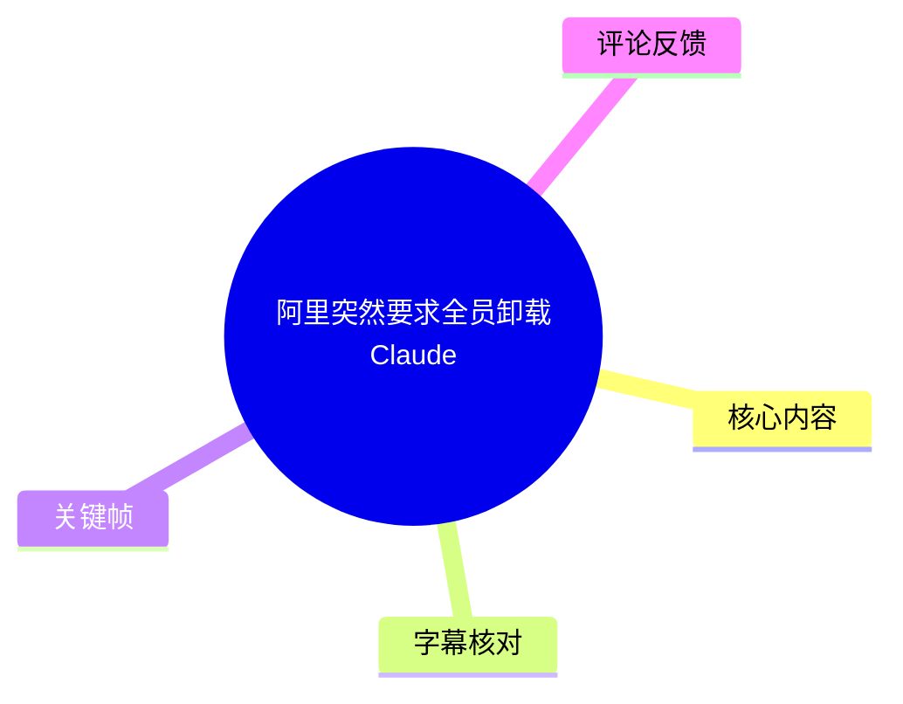
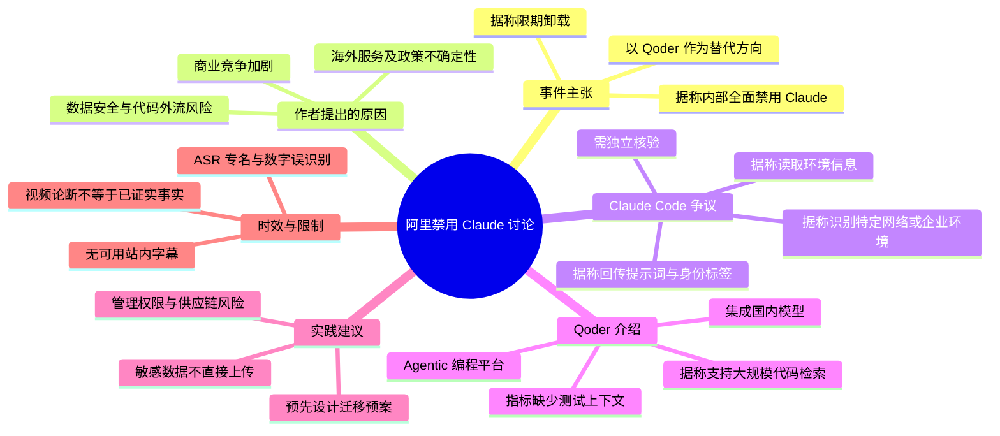
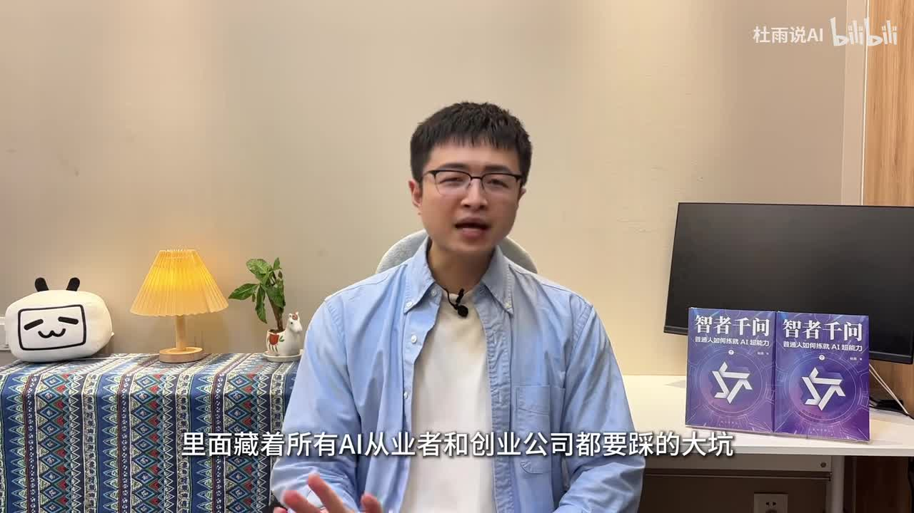
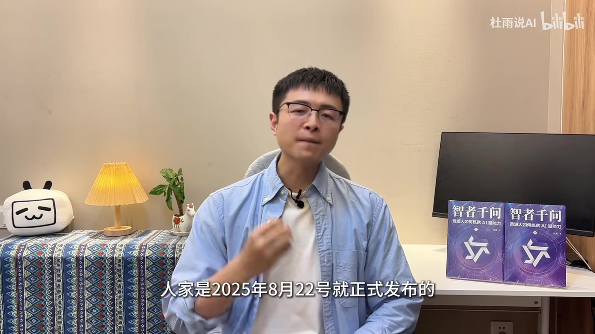
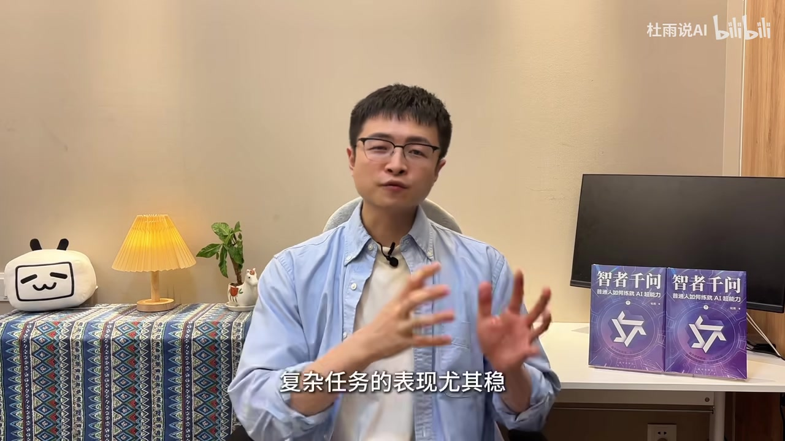

# 阿里突然要求全员卸载Claude

> 来源：[Bilibili 视频](https://www.bilibili.com/video/BV1pXT46TEQq)  
> UP 主：杜雨说AI｜时长：7 分 44 秒｜合集：AIcode  
> **信息性质说明：**本视频是对“阿里内部禁用 Claude”及相关安全争议的评论与解读。除视频元数据、可见关键帧及明确提供的评论外，文中涉及内部通知、软件行为、产品指标、封禁情况和企业决策等内容，均应视为**视频转述或作者观点**，不能自动等同于已被独立证实的事实。

## 小结

视频围绕一项被作者称为“阿里内部通知”的事件展开：阿里集团据称要求员工在指定期限前卸载 Claude 全系列产品，并以自研/国产编程工具 Qoder 作为替代方向。作者将其解释为海外 AI 工具、企业代码安全、服务可用性与商业竞争多重矛盾叠加后的结果。

作者重点转述了一项针对 Claude Code 的逆向发现：某些版本据称存在经加密混淆的检测逻辑，会读取设备时区、代理或 API 相关地址，并通过特殊 Unicode 符号、日期格式等方式区分特定用户类别；作者进一步推断，这可能使代码请求及企业环境标识被回传。该段是视频最具争议也最需要外部证据核验的部分。

在替代方案上，视频介绍 Qoder 为较早发布的 Agentic 智能体编程平台，称其支持检索大量代码文件、理解项目上下文，并整合通义、DeepSeek 等国内模型。视频还列出“10 万代码文件”“10 分钟完成电商前后端”“效率提升 10 倍以上”“代码生成准确率高约 13%”等参数或效果说法，但未提供测试环境、统计口径、官方链接或第三方评测，不能据此直接做采购或技术选型判断。

对开发者和创业团队，视频给出的可迁移经验是：不要将核心源码、内部业务逻辑及敏感数据“裸连”上传至海外工具；应预先准备模型、IDE 插件、工作流和代码仓库权限的迁移方案。这里的“国产替代”是作者的策略倾向，不代表所有场景下唯一或最优的技术路径。

内容具有强时效性。视频中的“7 月 10 日前”“7 月 2 日版本删除”“2024 年 OpenAI 限制国内 API 流量”等时间说法均应结合原始公告、软件版本记录、企业制度与实际可用状态复核。尤其 ASR 对产品名、版本号和若干数字识别误差明显，本文对其采用保守转写。

## 思维导图

## 目录

- [事件背景与信息边界](#事件背景与信息边界)
- [据称的阿里禁用通知与 Qoder 替代](#据称的阿里禁用通知与-qoder-替代)
- [视频转述的 Claude Code 检测机制](#视频转述的-claude-code-检测机制)
- [作者归纳的三层原因](#作者归纳的三层原因)
- [对开发者、团队与行业的影响](#对开发者团队与行业的影响)
- [可执行的安全与迁移步骤](#可执行的安全与迁移步骤)
- [关键参数与主张核验表](#关键参数与主张核验表)
- [结论、限制与时效性](#结论限制与时效性)
- [字幕比对](#字幕比对)
- [评论分析](#评论分析)
- [处理记录](#处理记录)

## 事件背景与信息边界 [00:00](https://www.bilibili.com/video/BV1pXT46TEQq?t=0)

视频开场将事件定性为海外 AI 与国内大厂之间触及“企业安全底线”的冲突，面向 AI 从业者、创业公司和程序员强调代码与企业数据外流风险。

作者随后称，阿里与 Claude/Anthropic 之间此前已有商业层面的矛盾；但素材未给出具体纠纷名称、立案文书、当事方声明或来源链接。因此，“双方商业矛盾”“征流诉讼”等 ASR 中识别出的表述无法精确还原，也不宜作为确定事实引用。

> 图：画面字幕为“里面藏着所有 AI 从业者和创业公司都要踩的大坑”。它展示了视频的叙事定位：这不是一个具体配置教程，而是以企业安全风险为中心的行业评论内容。

### 阅读本节需要区分的三类信息

1. **视频可直接表达的内容**：作者确实在视频中提出禁用、检测机制、封号、替代工具和安全建议等观点。
2. **元数据可确认的信息**：视频标题、UP 主、时长、互动数据、标签及抓取时间来自所给元数据。
3. **仍待核验的信息**：阿里内部通知正文、截止日期、软件版本的检测逻辑、数据回传内容、Anthropic 的回应和封号政策，以及 Qoder 的性能指标。

## 据称的阿里禁用通知与 Qoder 替代 [00:29](https://www.bilibili.com/video/BV1pXT46TEQq?t=29)

作者称，阿里内部已“正式下发通知”，要求集团范围禁用 Claude 系列产品，涵盖 Claude Sonnet、Opus 以及程序员常用的 Claude Code；并称员工需在 **7 月 10 日前**从电脑中卸载，Claude 被归入“高风险软件”名单。

> 图：画面字幕直接出现“阿里内部正式下发通知”，对应视频核心新闻主张。该画面只能证明作者作出了这一表述，不能证明通知本身真实、完整或适用于所有阿里实体与员工。

### 视频所称替代工具：Qoder

约 00:55 起，作者介绍 Qoder，并将其描述为非临时应急产品，而是一个已持续打磨的 Agentic 智能体编程平台。依据 ASR 与视频标签，可较有把握地识别工具名为 **Qoder**；但 ASR 在此处将其识别为“字眼的 Coder”等，存在明显同音误识别。

作者对 Qoder 的主要介绍包括：

- 称其于 **2025 年 8 月 22 日**正式发布；
- 称其可一次检索 **10 万个代码文件**，并具备项目上下文理解能力；
- 称官方案例中，开发电商网站前后端的工作可由“数天”缩短至约 **10 分钟**；
- 称效率可提升 **10 倍以上**；
- 称代码生成准确率较“行业标杆产品”高约 **13%**；
- 称其已深度集成通义、DeepSeek 等国内模型，数据在国内运行。

> 图：画面字幕为“人家是2025年8月22号就正式发布的”，有助于定位视频对 Qoder 产品成熟度的论证。发布日期及平台能力仍应以产品官网、版本说明和实际部署文档复核。

### 对工具能力说法的正确使用方式

视频给出的能力与效率数字没有披露以下关键信息：

- “10 万文件”是索引上限、单仓库上限、上下文可见范围，还是检索候选范围；
- 代码库语言、文件大小、硬件配置、模型版本和索引时间；
- “10 分钟”的任务起点、人工参与程度、验收标准与是否包含测试部署；
- “准确率高 13%”所依据的数据集、指标定义、比较对象及置信区间；
- “数据全在国内跑”是否适用于全部模型、全部版本、所有云端调用和遥测链路。

因此，上述数字适合作为**待验证的产品宣传或作者转述线索**，不应直接转换为实际生产 SLA、安全保证或成本预测。

## 视频转述的 Claude Code 检测机制 [02:02](https://www.bilibili.com/video/BV1pXT46TEQq?t=122)

视频最关键的技术性主张出现在约 02:02 后。作者称，开发者社区有人对 Claude Code 进行逆向拆解，发现某版本开始加入了经加密混淆的“隐蔽检测机制”。ASR 对版本信息识别混乱，出现“2016 年 4 月上线的 2.1”“今年 91 版本开始”等不连贯内容；在缺乏原始仓库、二进制哈希、提交记录或逆向报告的条件下，**无法可靠确认具体产品版本与上线时间**。

### 作者描述的三步逻辑

按视频表述，相关逻辑可归纳为以下三类行为：

| 环节 | 视频转述 | 风险含义 | 当前证据边界 |
| --- | --- | --- | --- |
| 环境扫描 | 读取设备时区；作者举例称上海、乌鲁木齐等时区会被标记 | 可用于区域或环境推断 | 未提供代码、字段、调用栈或抓包证据 |
| 网络/域名匹配 | 检索代理地址或 API 链接，并与内置国内云厂商、AI 公司域名匹配 | 可能识别企业网络、代理配置或服务依赖 | “147 个”及覆盖名单仅为视频说法 |
| 用户分类与回传 | 借助特殊 Unicode 符号、日期格式区分用户类别；作者称提示词会回传 Anthropic 服务器 | 若属实，可能形成代码、业务内容与环境标签的关联 | 未给出请求样本、服务端响应或隐私政策对应条款 |

视频将该机制比喻为“隐形监控木马”，这是作者的强烈评价而非技术结论。要判断是否为安全漏洞、遥测、功能灰度、合规地域识别或恶意数据收集，至少需要以下材料：

1. 可复现的特定版本安装包或源代码；
2. 对应文件路径、函数名称、反混淆后的逻辑和哈希；
3. 受控环境下的网络抓包，确认请求域名、载荷、传输条件与用户同意状态；
4. 与隐私政策、遥测开关、版本公告及厂商声明的逐项对照；
5. 由独立安全研究者重复验证。

### 视频所述的后续回应

作者称，Claude 负责人事后表示这是“实验功能”，且 **7 月 2 日**的新版本已删除相关机制。该回应的原文、发言人身份、平台与对应版本均未在素材中提供，不能确认其准确性或完整语境。

不论视频所述机制最终是否成立，其提出的风险模型仍值得企业参考：**具备本地文件读取、写入或命令执行能力的 AI 编程 Agent，必须放在最小权限、最小数据暴露和可审计网络环境中运行。**

## 作者归纳的三层原因 [03:39](https://www.bilibili.com/video/BV1pXT46TEQq?t=219)

作者认为阿里若采取“一刀切禁用”，并非单一情绪驱动，而是由数据安全、服务控制权及商业对抗三层因素共同导致。

### 1. 数据安全红线

视频称 Claude Code 具有本地文件读写与执行权限；若用户向模型提交核心代码或业务数据，相关内容可能随请求离开企业控制边界。

这部分的普遍性经验是成立的：任何 AI 编程工具一旦获得仓库访问、终端执行、文件读写或网络访问权限，风险不止取决于模型本身，还取决于：

- IDE 插件和 Agent 的权限范围；
- 是否会自动读取整个工作区；
- 工具调用（Tool Use）是否能执行 shell、Git、数据库或部署命令；
- 日志、遥测、缓存和错误报告是否含有敏感片段；
- 企业是否拥有出口代理、DLP、审计和权限隔离。

### 2. 海外服务与政策不确定性

作者认为，海外 AI 厂商可能受所在地法律、出口政策与平台规则影响，存在服务中断、账号限制或数据调取等不确定性；将核心业务建立在单一海外服务上，相当于把关键能力交由外部平台控制。

这一判断可转化为供应链韧性问题，而不只限于“国内/海外”二分：

- 是否存在单一模型或单一账号依赖；
- 是否可以在 API、模型、IDE Agent 和向量检索层快速替换；
- 是否有本地部署、私有化部署或多云容灾方案；
- 合同是否明确数据处理、训练使用、保留期限、事件通知和退出机制。

### 3. 商业对抗与信任损失

作者将此前未明示细节的商业纠纷与本次监控争议相连，认为双方信任已无缓和空间。这是作者的因果推断。现有素材没有提供阿里和 Anthropic 的正式冲突时间线，不能确认“商业对抗”是否直接导致了所谓禁用决定。

## 对开发者、团队与行业的影响 [05:05](https://www.bilibili.com/video/BV1pXT46TEQq?t=305)

作者区分了大厂与中小团队的处境。

### 大型企业：有替代与管控能力，但迁移仍非零成本

视频称阿里已准备 Qoder 这一完整替代方案，并向内部开放免费额度，因此技术迁移成本较低。即便如此，企业级迁移通常仍涉及：

- 仓库、知识库、代码索引与权限系统的接入；
- 现有提示词、规则文件、MCP/工具调用的兼容；
- 模型能力差异导致的测试集重建；
- 输出代码的安全审查、许可证检查与 CI/CD 策略；
- 开发者培训、使用规范及异常事件响应。

### 中小企业与独立开发者：短期适配压力更大

作者指出，已将大量代码工作建立在 Claude 或类似工具上的中小团队，需要切换国产代码工具、调整开发逻辑，并承担模型调试和学习成本。

可拆解的实际迁移成本包括：

| 成本类别 | 具体内容 |
| --- | --- |
| 使用习惯迁移 | 提示词方式、上下文管理、代码审查习惯与 IDE 工作流变化 |
| 技术兼容迁移 | 模型 API、SDK、鉴权方式、工具调用格式、Agent 配置文件变化 |
| 质量保障成本 | 重跑单元测试、集成测试、安全扫描和人工 Code Review |
| 数据治理成本 | 清点已上传的仓库、文档、日志、密钥与业务数据 |
| 连续性成本 | 订阅退款、账号可用性、限流、模型降级和备份方案 |

### 作者对行业趋势的判断

视频以 2024 年 OpenAI 对国内 API 流量的限制为类比，称当时部分创业公司因服务中断而被迫迁移，并认为本次事件将促使国内头部科技企业出台更严格的海外 AI 使用规范，推动自研模型与开源本地部署方案发展。

这是预测，不是已发生事实。其成立与否取决于企业实际政策、模型能力与价格、合规要求、开发者生态、算力供应和海外厂商后续政策等多重变量。

> 图：字幕为“复杂任务的表现尤其稳”，对应作者对替代工具稳定性的评价。该帧适合提示读者：视频在这里提供的是效果主张，缺少任务定义、对照组及评测证据，不应超出原始证据强度解读。

## 可执行的安全与迁移步骤 [05:54](https://www.bilibili.com/video/BV1pXT46TEQq?t=354)

视频给出的直接建议是：个人和小公司不要“裸连”海外工具，不要上传核心业务代码、内部问题和底层数据，并优先选择合规的国内模型。将这一原则落地时，可采用以下不依赖特定厂商的步骤。

### 步骤一：给代码与数据分级

先区分哪些内容可以进入外部模型，哪些必须留在受控环境：

| 数据类别 | 建议处理 |
| --- | --- |
| 公开文档、开源代码、脱敏示例 | 可在完成审查后用于外部工具 |
| 通用技术问题、无业务标识的伪代码 | 优先使用最小化片段，不附带真实密钥、域名和客户信息 |
| 私有仓库、生产配置、架构图、故障日志 | 默认不得直接上传，需走审批与脱敏流程 |
| 密钥、令牌、证书、客户数据、财务或医疗等受监管数据 | 禁止输入普通外部 AI 对话或编程工具 |

### 步骤二：收紧 Agent 权限

对有代码读写和命令执行能力的 Agent，建议按最小权限配置：

1. 使用专用、低权限账号，而非个人或生产管理员账号；
2. 将开发、测试、生产环境隔离；
3. 对敏感目录、`.env`、密钥管理目录、生产配置和客户数据目录设置拒绝访问；
4. 默认关闭自动执行命令、自动提交 Git、自动发布和自动修改基础设施配置；
5. 对网络出口实施域名白名单、代理审计与数据泄露检测；
6. 在沙箱或临时工作区运行高权限 Agent 任务。

### 步骤三：建立可切换的模型接入层

为降低单一供应商风险，应避免业务代码深度绑定某个专有模型接口：

- 用统一网关封装模型调用；
- 将模型名称、端点、密钥、重试策略和速率限制配置化；
- 为核心任务建立至少一个备选模型与降级路径；
- 保留独立于模型供应商的提示词、评测集、测试用例和业务规则；
- 定期做“断供演练”：停用主模型后，验证替代服务能否承接关键流程。

### 步骤四：验证“遥测/回传”类安全传闻

若团队担忧某开发工具存在异常环境采集，不能仅凭网络文章或短视频结论卸载或信任，应按可审计流程验证：

1. 固定待测软件版本，保存安装包哈希；
2. 在隔离虚拟机中安装，避免接触真实代码；
3. 记录进程行为、文件访问、DNS 查询及 HTTPS 出站连接；
4. 使用虚拟但具有辨识度的测试文件、域名和代理配置，检查是否出现在出站请求中；
5. 对照软件隐私政策、遥测设置、更新日志与厂商响应；
6. 将结论提交安全、法务和采购共同评审，再决定限制、替换或豁免。

> 注意：网络请求加密、存在遥测或检测逻辑，并不能单独证明“恶意后门”。结论必须建立在数据字段、传输条件、用户授权、业务必要性与可复现证据之上。

## 关键参数与主张核验表 [01:00](https://www.bilibili.com/video/BV1pXT46TEQq?t=60)

| 项目 | 视频/ASR 中的说法 | 可直接确认程度 | 使用时的限制 |
| --- | --- | --- | --- |
| 阿里禁用 Claude | 据称集团全面禁用，并限期卸载 | 未获独立确认 | 未提供通知原文、适用范围或官方回应 |
| 卸载期限 | 7 月 10 日前 | 未获独立确认 | 缺少年份、通知截图和执行细则 |
| 替代工具 | Qoder | 视频标签可佐证名称 | 不代表已确认阿里内部唯一替代方案 |
| Qoder 发布日期 | 2025 年 8 月 22 日 | 视频说法 | 应查官网公告及产品版本历史 |
| 代码检索规模 | 10 万个代码文件 | 视频说法 | 未知是索引、检索、上下文还是仓库容量上限 |
| 电商网站开发速度 | 数天工作约 10 分钟 | 视频转述“官方案例” | 未知任务范围、人工投入和验收标准 |
| 效率提升 | 10 倍以上 | 视频说法 | 未给出对照基线及测量方法 |
| 准确率优势 | 高约 13% | 视频说法 | 未说明行业标杆、数据集和准确率定义 |
| 检测机制覆盖 | 匹配 147 个国内云/AI 厂商域名 | 未获独立确认 | ASR 数字和专名可能错误，需原始逆向报告 |
| 机制删除时间 | 7 月 2 日新版本删除 | 未获独立确认 | 未知版本号、更新日志和回应来源 |
| OpenAI 事件 | 2024 年限制国内 API 流量 | 作为视频类比出现 | 需区分地区、账号、服务条款与具体生效时间 |

## 结论、限制与时效性 [07:06](https://www.bilibili.com/video/BV1pXT46TEQq?t=426)

视频的核心价值不在于能够单独证明“阿里已全面禁用 Claude”或“Claude Code 存在后门”，而在于提出了一个值得企业严肃处理的问题：AI 编程 Agent 同时连接本地代码、命令行、网络与模型服务时，代码保密、权限控制、供应商连续性和审计能力必须同步设计。

从实践角度，最稳妥的结论是：

- 对核心仓库和敏感业务，优先使用受控网络、最小权限、可审计日志和明确数据条款；
- 不把单一海外或单一国内模型当作不可替代的基础设施；
- 采购或引入 AI 编程工具前，应评估其本地权限、数据保留、训练使用、遥测、模型调用路径及退出机制；
- 对“监控”“后门”“封号”等高风险指控，应要求可复现技术证据和官方原始回应，避免将情绪化标签替代安全分析。

**时效性提醒：**视频元数据发布时间为 2026 年 7 月 3 日，素材抓取时间为 2026 年 7 月 13 日。视频中的软件版本、企业通知、服务策略和产品能力均可能在之后发生变化。特别是作者提及的“7 月 2 日”“7 月 10 日”等日期没有显示年份和原始文件，后续阅读或决策时必须查阅最新公告。

## 字幕比对 [00:00](https://www.bilibili.com/video/BV1pXT46TEQq?t=0)

| 字幕来源 | 完整性 | 专有名词 | 时间轴 | 主要问题 |
| --- | --- | --- | --- | --- |
| Bilibili 站内字幕 | 无可用字幕 | 无法评估 | 无法提供 | 字幕工具报错：`Missing JSON resource URL`；素材明确说明未提供可用站内字幕 |
| 本次 ASR 字幕 | 覆盖全片主要口述内容 | 较多误识别 | 仅提供连续文本，未附逐句时间戳 | 中英混杂词、人名、产品名、版本号、日期与数字识别不稳定，存在“Claude/Claude Code”“Qoder”“Anthropic”“OpenAI”“GPT”等错听或错写 |

### 最终字幕选择

本次任务已执行 ASR，且没有可用站内字幕，因此正文以**本次 ASR 为唯一字幕基础**，再结合视频标题、标签、元数据和给出的关键帧进行保守校正。

已进行或明确保留的校正原则如下：

- 根据标题、标签 `claude`、`anthropic`、`ClaudeCode`，将 ASR 中的“CloD”“可乐”“Glodcode”等统一按语境标为 **Claude / Claude Code**；但不据此补造具体版本。
- 根据标签 `Qoder`，将 ASR 中近似“字眼的 Coder”的工具名标为 **Qoder**。
- 根据标签 `DeepSeek` 及 ASR 语境，将“DeepSec”等表述标为 **DeepSeek**。
- ASR 中涉及“2016 年 4 月上线的 2.1”“今年 91 版本”等版本串前后矛盾，未强行修复，正文只保留“某版本开始”的保守描述。
- 关键帧能确认作者口述“阿里内部正式下发通知”“2025 年 8 月 22 日正式发布”“复杂任务表现尤其稳”等画面字幕；但这些字幕同样属于视频自身主张，并非外部验证材料。

## 评论分析 [07:20](https://www.bilibili.com/video/BV1pXT46TEQq?t=440)

以下仅处理可获取的热评前三条，评论代表的是用户观点，不作为事件事实或技术证据。

### 1. ☆飄逸の風→（157 赞）

> “claude今天敢传你电脑时区、网络设置，明天就敢传你所在公司，后天就敢传你项目方向和研发进度”

- **观点概括：**认同视频对于设备环境信息采集的担忧，并将风险推演至企业身份、项目方向和研发进度暴露。
- **补充价值：**指出元数据并非完全无害；时区、网络设置等弱标识若与其他信息关联，确实可能增强用户或组织识别能力。
- **可信度与争议：**评论是风险推演，不提供 Claude 实际上传上述数据的证据。是否“敢传”、传输了什么、是否能映射到公司和项目，仍取决于具体实现与抓包证据。

### 2. 星塔旅人高玩-专家（21 赞）

> “评论区怎么这么多非人类啊，各种名词概念还没搞清就想着公式化阿里全责”

- **观点概括：**批评评论区在概念不清的情况下，过早将责任归于阿里。
- **补充价值：**提醒讨论应区分企业安全策略、产品技术行为、跨境服务政策和商业竞争，避免“单方全责”的情绪化归因。
- **可信度与争议：**该评论没有提供事件事实补充，但其方法论提醒合理：视频本身未展示完整通知或双方材料，无法据此判定各方责任。

### 3. 智子宜然科技（13 赞）

> “不敢回评论，就是广告……这期又在给国产模型铺路，等着接国产模型广告……”

- **观点概括：**质疑视频有为国产模型或相关厂商营销铺垫的倾向。
- **补充价值：**该评论提示读者审视内容激励结构：视频确实在较大篇幅中介绍 Qoder 及国产模型替代路线。
- **可信度与争议：**评论未提供广告合作、商业委托或收益关系的证据，不能据此断定视频为广告。更恰当的做法是将视频中所有产品性能、优惠和替代优势主张与独立资料交叉验证。

## 处理记录 [07:40](https://www.bilibili.com/video/BV1pXT46TEQq?t=460)

- **Worker ID：**worker-mrj0wjed-b0c290ad
- **模型：**gpt-5.6-terra
- **调用工具与素材：**视频元数据、素材清单、ASR 输出、热评 JSON、已提供关键帧及封面信息。
- **字幕选择：**站内字幕不可用；字幕抓取过程报错 `Missing JSON resource URL`。本次 ASR 已执行，正文以 ASR 为基础，并用标题、标签与关键帧进行有限的专名校正。
- **关键帧选择依据：**
  - `frames/frame-001.jpg`：开场明确定位受众及风险主题；
  - `frames/frame-002.jpg`：对应“阿里内部正式下发通知”的中心主张；
  - `frames/frame-003.jpg`：对应 Qoder 发布日期说法；
  - `frames/frame-004.jpg`：对应复杂任务稳定性评价，适合提示性能说法的证据边界。
- **未采用其余关键帧：**素材仅展示了前四张关键帧的实际画面内容；为避免对未展示图片内容作出编造性描述，未在正文引用 `frame-005.jpg` 至 `frame-012.jpg`。
- **缓存清理：**未提供缓存目录、清理命令或执行回执；无法确认是否已完成缓存清理，故不虚构清理结果。
- **未解决问题：**
  1. 未获得阿里内部通知原文、适用组织范围或官方确认；
  2. 未获得 Claude Code 逆向报告、版本号、样本、网络抓包与厂商原始回应；
  3. 未获得 Qoder 性能指标的测试方法、基准和官方案例链接；
  4. ASR 对若干版本号、公司名、日期和技术词汇存在显著误识别，无法仅凭当前素材精确复原。

## 评论分析

本次流程未获取到可用热评，因此不推断观众态度或额外结论。
