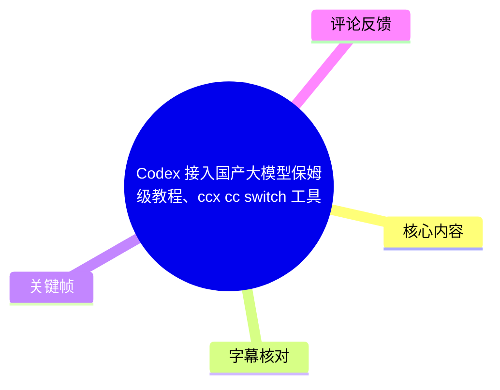
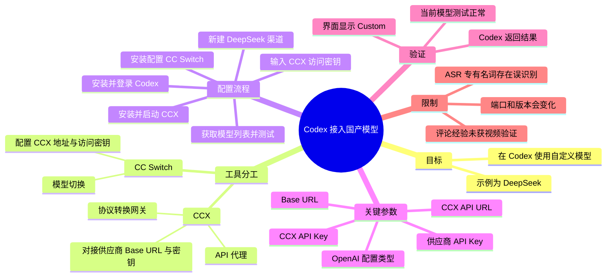
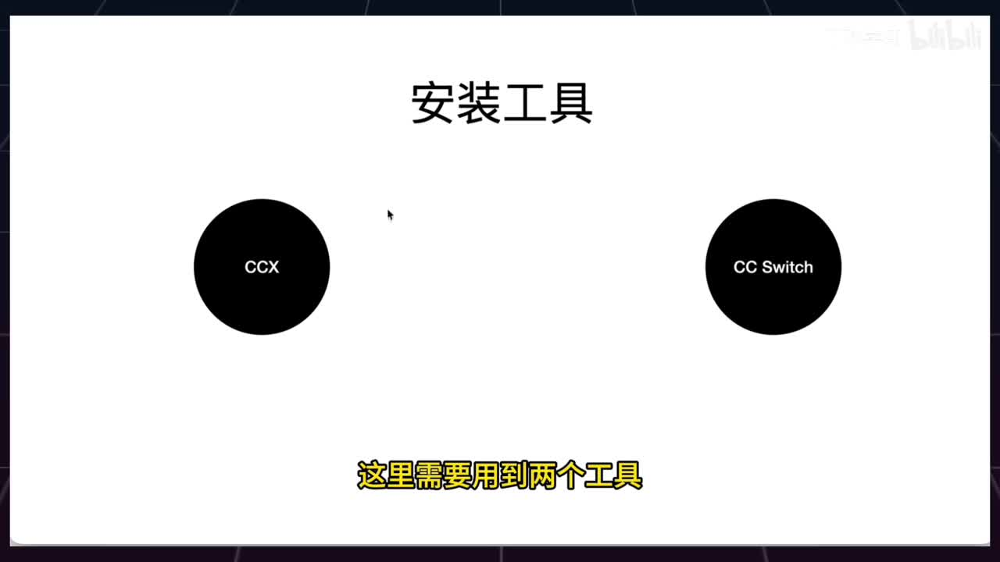
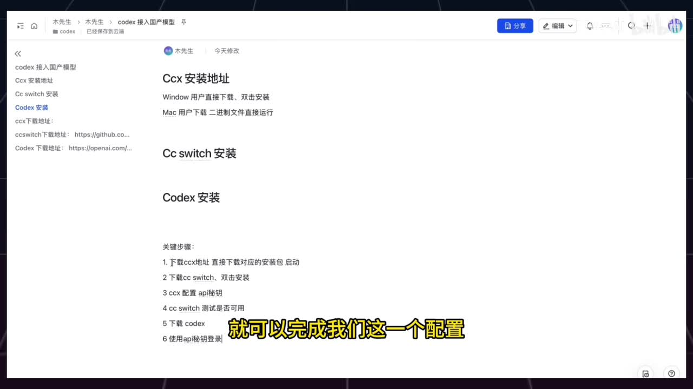
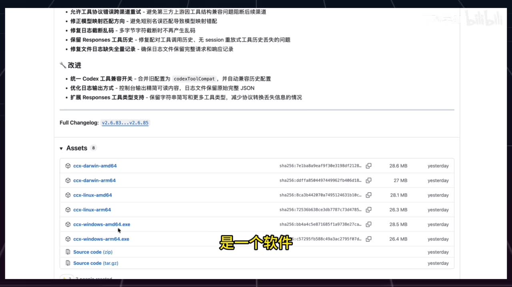
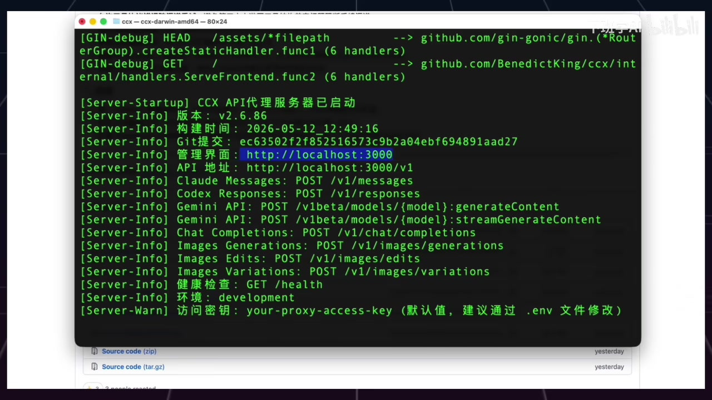

# Codex 接入国产大模型保姆级教程、ccx cc switch 工具

> 来源：[Bilibili 视频](https://www.bilibili.com/video/BV1sJ596cEVc)<br>
> UP 主：下班学AI｜时长：2 分 45 秒｜合集：AIcode  
> 本文仅整理视频、关键帧、ASR 字幕和可获取评论中出现的信息；API 地址、软件版本与模型可用性均可能随软件迭代而变化。

## 小结

视频演示了一条让 Codex 使用国产模型 API 的中转配置路径，并以 DeepSeek 为例：先用 **CCX** 接收并转换 Codex 请求、对接模型供应商 API，再用 **CC Switch（视频/ASR 中亦写作 CCSwitch）** 将 Codex 的后端切换到 CCX 所提供的接口。

核心链路可概括为：**Codex → CC Switch → CCX → DeepSeek API**。视频将 CCX 定义为“API 代理请求和协议转换网关”，将 CC Switch 定义为“模型切换”工具；实际操作包括安装 CCX、在 CCX 新建渠道并填入模型供应商的 Base URL 与 API 密钥、安装并配置 CC Switch、测试模型，最后在 Codex 中通过“其他方式登录”输入 CCX 的访问密钥。

视频画面显示，CCX 启动后会在终端输出管理界面和 API 地址。示例画面中的管理界面是 `http://localhost:3000`，API 地址是 `http://localhost:3000/v1`，并显示默认访问密钥 `your-proxy-access-key`，同时建议通过 `.env` 文件修改。该参数来自关键帧中的终端输出；视频简介中的 `http://127.0.0.1:8080` 仅是“本地或远程 URL”的示例，不能与画面中的 `3000` 端口混为固定值。

适合已经具备模型供应商 API Key、希望在 Codex 客户端使用自定义模型的用户。视频并未展示 DeepSeek 官网的完整注册/计费过程，也没有给出 CC Switch 的精确下载链接、具体版本、完整字段名或跨平台启动命令；实际配置须以各工具当时界面、版本和供应商文档为准。

视频最后以 Codex 界面显示 **Custom**、而非 GPT-5.5/5.4 作为接入成功的界面证据，并完成一次返回测试。但这只能证明演示环境当时请求可返回，不能推导为所有模型、网络环境、账户权限或第三方中转都可直接复现。

## 思维导图





## 目录

- [背景、工具定位与链路](#背景工具定位与链路)
- [步骤一：安装并启动 CCX](#步骤一安装并启动-ccx)
- [步骤二：在 CCX 配置 DeepSeek 渠道](#步骤二在-ccx-配置-deepseek-渠道)
- [步骤三：安装和配置 CC Switch](#步骤三安装和配置-cc-switch)
- [步骤四：安装 Codex 并通过 API Key 登录](#步骤四安装-codex-并通过-api-key-登录)
- [步骤五：测试与成功标志](#步骤五测试与成功标志)
- [参数、边界与时效性](#参数边界与时效性)
- [字幕比对](#字幕比对)
- [评论分析](#评论分析)
- [处理记录](#处理记录)

## 背景、工具定位与链路 [00:00:00](https://www.bilibili.com/video/BV1sJ596cEVc?t=0)

视频开场说明主题是“Codex 接入国产模型”，示例模型为 DeepSeek。UP 主提到还可涉及其他国产模型，但本段实际演示仅围绕 DeepSeek 展开；视频简介列举了 DeepSeek、MiniMax、GLM、Qwen，不能据此认定它们均已在本视频中逐一配置验证。

两项工具的职责在视频中被明确区分：

| 工具 | 视频中的定位 | 在链路中的作用 |
| --- | --- | --- |
| CCX | API 代理请求和协议转换网关 | 接收上游请求，按配置转发至模型供应商 API |
| CC Switch | 模型切换工具 | 为 Codex 选择/切换后端服务配置 |
| Codex | 最终使用端 | 使用配置后的 API Key 登录并进行请求测试 |
| DeepSeek | 本次示例的模型服务商 | 提供 Base URL 和供应商 API Key |

视频称可“按照六步”完成配置，实际叙述可整理为：下载/启动 CCX、在 CCX 配置 API、下载/配置 CC Switch、测试模型、下载 Codex、用 API 密钥登录并验证。



> 图：画面以“安装工具”为标题，同时列出 CCX 与 CC Switch，直观说明本教程不是直接把供应商 Key 填入 Codex，而是采用两个中间工具组成的配置路径。



> 图：关键帧展示 UP 主准备的文档页面，左侧列有“CCX 安装地址”“CC switch 安装”“Codex 安装”等条目，正文还列出六项关键步骤。这是视频声称提供下载资料与按步骤配置的画面依据；图片中的链接未完整清晰呈现，因此本文不补写具体 URL。

## 步骤一：安装并启动 CCX [00:00:24](https://www.bilibili.com/video/BV1sJ596cEVc?t=24)

1. 打开 CCX 下载页面，选择与系统相匹配的版本。
2. 视频口述：Windows 下载后是可双击安装的软件；Mac 版本是二进制文件，需要通过命令启动。
3. 启动 CCX。
4. 打开 CCX 管理界面，并在界面中选择 **Codex**。

视频未展示完整的下载地址和 macOS 具体启动命令，因此不能从素材中还原出可靠命令。关键帧所示下载列表包含 `ccx-windows-amd64.exe`、`ccx-windows-arm64.exe`、macOS 与 Linux 对应架构文件，说明需注意操作系统及 CPU 架构匹配。



> 图：画面展示 CCX 发布页 Assets 列表，包括 macOS、Linux、Windows 的 amd64/arm64 构建文件。这为“按系统版本下载”的操作提供了视觉依据，也提示 Windows ARM 与 x64 不应混选。

启动后的终端画面给出了本次演示环境的实际服务信息：

```text
管理界面：http://localhost:3000
API 地址：http://localhost:3000/v1
健康检查：GET /health
Chat Completions：POST /v1/chat/completions
Codex Responses：POST /v1/responses
访问密钥：your-proxy-access-key（默认值，建议通过 .env 文件修改）
```

上述内容来自画面中的 CCX 日志，画面还显示版本为 `v2.6.86`、构建时间为 `2026-05-12_12:49:16`。这些是录制环境的快照，不应视为所有版本的固定默认值。



> 图：终端日志明确显示“CCX API 代理服务器已启动”、`localhost:3000` 管理界面、`localhost:3000/v1` API 地址以及默认访问密钥提示。这是全文涉及端口、路径、健康检查和密钥修改建议的主要画面证据。

## 步骤二：在 CCX 配置 DeepSeek 渠道 [00:00:48](https://www.bilibili.com/video/BV1sJ596cEVc?t=48)

在 CCX 管理界面选择 Codex 后，视频的操作顺序为：

1. 点击“添加渠道”。
2. 输入模型服务商的 **Base URL**。
3. 到 DeepSeek 官网复制 Base URL，并创建一个 API 密钥。
4. 将供应商 API 密钥粘贴进 CCX。
5. 打开“详细配置”。
6. 将配置类型选择为 **OpenAI**。
7. 开启视频所指的开关。
8. 点击“创建渠道”。

视频在 01:08 左右说“开启这个开关”，但现有 ASR 未识别该开关的准确文字，提供的关键帧也未覆盖该设置页。因此，只能确认“需要开启一个开关后创建渠道”，不能把评论中的某一项设置直接当成视频已展示的字段。

这里存在两类不同密钥，配置时不可混淆：

| 名称 | 来源 | 用途 |
| --- | --- | --- |
| DeepSeek API Key | DeepSeek 官网创建 | 由 CCX 用于请求 DeepSeek 服务 |
| CCX API Key / 访问密钥 | CCX 启动时生成或采用默认值 | 由 CC Switch 与 Codex 用于访问 CCX |

视频把第一类称为在 DeepSeek 官网创建的密钥；随后在 CC Switch 和 Codex 中填入的，则是 CCX 启动时创建/显示的访问密钥。

## 步骤三：安装和配置 CC Switch [00:01:08](https://www.bilibili.com/video/BV1sJ596cEVc?t=68)

CCX 渠道创建完成后，视频进入 CC Switch 配置：

1. 下载与操作系统对应的 CC Switch 版本并启动。
2. 打开 CC Switch，切换到 **OpenAI**。
3. 点击加号新增供应商。
4. 填写供应商名称；视频称名称“随便写”。
5. 填入 **API Key**：视频说明它是 CCX 启动时创建的默认值/访问密钥，而不是 DeepSeek 的供应商 Key。
6. 填入 **API 请求地址**：即 CCX 启动时给出的 API 地址。
7. 点击“获取模型列表”。
8. 视频称获取到两个模型，并选择“Deepseek v4”（ASR 转写；大小写与模型正式名称未获画面核实）。
9. 可开启“依照上下文”（ASR 原文，具体功能与界面字段未核实）。
10. 点击“添加”，再点击“启用”。

按关键帧中 CCX 的地址示例，CC Switch 的 API 请求地址可形成为：

```text
http://localhost:3000/v1
```

这不是视频简介中所举 `http://127.0.0.1:8080`，也不是普适固定地址；应以自己启动的 CCX 控制台输出为准。若 CCX 部署在其他机器，视频简介允许填写“本地或远程 URL”，但未讲解远程部署认证、HTTPS、端口暴露或防火墙设置。

## 步骤四：安装 Codex 并通过 API Key 登录 [00:01:56](https://www.bilibili.com/video/BV1sJ596cEVc?t=116)

视频接着下载和启动 Codex：

1. 打开 Codex 官网，下载匹配系统的版本。
2. 安装后启动 Codex。
3. 在登录界面选择“其他方式登录”。
4. 选择输入 API 密钥。
5. 粘贴此前 CCX 启动时创建或显示的 **CCX 访问密钥**。
6. 点击继续。

视频并未要求在 Codex 里直接填写 DeepSeek 的 Base URL 或 DeepSeek API Key；根据其演示链路，Codex 使用的是由 CC Switch/CCX 提供的自定义后端。也因此，CCX 服务需要在 Codex 实际发起请求时保持可访问。

## 步骤五：测试与成功标志 [00:02:20](https://www.bilibili.com/video/BV1sJ596cEVc?t=140)

完成登录后，视频先表示“实现了 Codex 接入 DeepSeek 模型”，再发起测试。约 02:30，UP 主根据返回结果判断模型接入成功。

视频给出的两个验证信号是：

- 在 CC Switch 中点击测试当前模型后，界面/口述显示“模型运行正常”。
- Codex 请求已有返回，并且模型位置显示为 **Custom**，而不再是视频口述中的 GPT-5.5/5.4。

需要区分的是：

- **已展示的事实**：录制时的测试获得返回，UP 主将其视为成功；界面标签被描述为 Custom。
- **尚未展示的内容**：未展示具体提示词、响应质量、耗时、token 消耗、异常重试、代码生成对比，也未演示多个国产模型间切换。
- **不能据此保证的结论**：不同地区网络、账户余额、API 权限、CCX/CC Switch/Codex 版本不同，均可能导致实际体验不同。

## 参数、边界与时效性 [00:02:29](https://www.bilibili.com/video/BV1sJ596cEVc?t=149)

### 配置参数清单

| 参数/动作 | 视频中的来源或取值 | 注意事项 |
| --- | --- | ---|
| 模型供应商 | DeepSeek（演示案例） | 简介虽列举其他模型，但未逐一演示 |
| CCX 渠道类型 | OpenAI | 视频在“详细配置”中选择 |
| 供应商 Base URL | 从 DeepSeek 官网复制 | 未在素材中展示完整字符串 |
| 供应商 API Key | 在 DeepSeek 官网创建 | 用于 CCX 对接供应商 |
| CCX 管理界面 | `http://localhost:3000` | 来自演示帧；端口可能因版本/环境变化 |
| CCX API 地址 | `http://localhost:3000/v1` | 用于 CC Switch；实际应以启动日志为准 |
| CCX 访问密钥 | 画面显示默认 `your-proxy-access-key` | 画面明确建议通过 `.env` 修改，不宜长期使用默认值 |
| 健康检查 | `GET /health` | 画面展示的可用检查端点 |
| CC Switch 模式 | OpenAI | 视频要求切换至该项 |
| Codex 登录方式 | 其他方式登录 → 输入 API 密钥 | 输入的是 CCX 访问密钥，非供应商 Key |
| 成功标志 | 测试返回、显示 Custom | 属于演示环境的验证，不等于稳定性测试 |

### 安全与运行限制

1. **不要保留默认访问密钥。** 关键帧明确显示默认值 `your-proxy-access-key`，并提示通过 `.env` 修改；如果服务暴露到局域网或公网，默认值会显著增加未授权访问风险。
2. **本地服务必须可达。** 若使用 `localhost`/`127.0.0.1`，Codex、CC Switch 和 CCX 要在能访问同一回环地址的运行环境中；远程 URL 的部署条件不在视频覆盖范围内。
3. **不要混淆两种 Key。** 供应商 Key 配给 CCX；CCX 的访问密钥配给 CC Switch 和 Codex。
4. **不要硬编码端口。** 简介举例 `8080`，启动日志画面显示 `3000`；两者差异表明端口取决于实际部署。
5. **版本具时效性。** 画面中的 CCX `v2.6.86` 仅对应录制时版本。工具 UI、模型名、协议兼容性和 Codex 登录入口都可能变更。
6. **模型名称待现场确认。** ASR 转写出“Deepseq v4”，其中“Deepseq”很可能是对 DeepSeek 的识别误差；视频提供的文字素材不足以确认界面内模型的官方全名，实际应以 CC Switch 获取的模型列表为准。

## 字幕比对

| 字幕来源 | 完整性 | 专有名词 | 时间轴 | 主要问题 |
| --- | --- | --- | --- | --- |
| Bilibili 站内字幕 | 未提供可用字幕，无法使用 | 无法评估 | 无法评估 | 素材明确标注“未提供可用站内字幕” |
| 本次 ASR 字幕 | 较完整：9 段，覆盖约 159.5 秒，语音覆盖率 96.95% | 存在多处误识别 | 有真实 SRT 起止时间，可用于时间轴 | “Deepseq”“CCSwich/CCS”“BaseUR”“密钦”等词有识别偏差；个别 UI 字段未识别 |

本次 ASR 使用 `medium` 模型识别为中文，语言置信度为 `0.99853515625`；音频时长约 164.51 秒，首段语音始于 00:00:00.340，末段止于 00:02:44.480。诊断未标记 `noAudioStream=true`，因此可确认源视频存在可供识别的音轨，而非无音轨视频。

由于没有可用站内字幕，正文时间轴以本次 ASR 的 SRT 起止时间为依据。结合标题、简介和关键帧，对部分专有名词作了谨慎规范化：

| ASR 原文/疑似误识别 | 正文采用 | 校正依据 |
| --- | --- | --- |
| Codex 加入国产模型 | Codex 接入国产模型 | 视频标题与简介 |
| Deepseq / DeepSeq | DeepSeek | 视频标题、简介和标签 |
| CCSwich / CCS / CCSwitch | CC Switch | 视频标题、简介、关键帧与工具名称 |
| BaseUR | Base URL | 视频简介的字段表述 |
| CodeX / Codext | Codex | 视频标题与简介 |
| “Deepseq v4” | 保留为 ASR 所述“Deepseek v4”，不确认正式型号 | 缺少清晰的模型列表画面佐证 |

## 评论分析

以下仅处理可获取热评前三条。评论属于用户或 UP 主的补充陈述，未在视频操作画面中逐项验证，不应直接等同于视频已证实的配置规范。

1. **UP 主“下班学AI”（7 赞）**  
   - 观点：已准备资料，用户可在后台发送“codex 接入国产模型”获取。  
   - 价值：说明视频可能配套下载资料或文档，和开场“下载地址放在文档中”的口述相互呼应。  
   - 限制：评论未提供公开链接，本文无法验证资料版本、内容完整性和是否仍可获取。

2. **用户“sejsnsnwi”（5 赞）**  
   - 观点：总结若干“失败原因/排查经验”，包括 CCX 与 CC Switch 名称必须一致、添加模型前需要按特定顺序切到 OpenAI official 并重启软件、勾选“规范化非常见 Chat role”、VPN 使用 TUN 模式、保持 CCX 黑色窗口运行，以及 `Reconnecting... 1/5` 可能与网络或供应商 API 有关。  
   - 价值：补充了视频未展开的故障排查方向，尤其提醒 CCX 运行状态与网络连通性可能影响结果。  
   - 可信度与边界：评论作者明确标注“仅供参考”；其中“名称必须一样”“必须先切换并彻底关闭”等强制性说法未获视频或官方文档验证，应作为排障尝试而非通用定律。视频只明确要求 CC Switch 切换到 OpenAI，并未口述这些额外步骤。

3. **用户“Etern1t7_”（4 赞）**  
   - 观点：询问能否用同一方法配置 GPT 第三方中转站，并称在 CCX 中找不到访问密钥。  
   - 价值：反映实际使用中，访问密钥位置是可能的操作障碍，也提出将方案扩展到第三方 GPT 中转的需求。  
   - 可信度与边界：这是提问，不包含已验证结论。针对“找不到访问密钥”，关键帧中的 CCX 终端确实显示默认访问密钥以及通过 `.env` 修改的提示，但不同版本界面位置可能不同；对于第三方中转是否兼容，视频没有实测，不能据此确认。

## 处理记录

- Worker ID：`worker-mrj0wbly-5dc4e50c`
- 整理模型：`gpt-5.6-terra`
- 可用素材与工具结果：视频元数据、ASR（`medium`，CUDA、float16）、ASR SRT 时间轴、12 张关键帧路径清单及其中提供的画面、热评前三条。
- 字幕选择：站内字幕未提供可用版本；已检查本次 ASR，且诊断未标记 `noAudioStream=true`。正文采用 ASR SRT 的真实时间段制作时间轴，并以标题、简介及关键帧谨慎校正明显专名误识别。
- 关键帧选择依据：`frame-001` 用于说明 CCX/CC Switch 双工具结构；`frame-002` 佐证资料页与六步流程；`frame-003` 佐证多平台下载与架构选择；`frame-004` 佐证 CCX 实际启动日志、端口、API 路径、健康检查与默认访问密钥。
- 缓存清理：提供的素材未包含缓存清理执行记录，无法确认是否已清理；本文未据此编造清理结果。
- 未解决问题：CC Switch 的精确版本、下载地址、完整界面字段、视频中“开启的开关”名称、模型列表中“Deepseek v4”的官方写法，以及远程部署与第三方中转兼容性，均未被现有素材充分证实。
