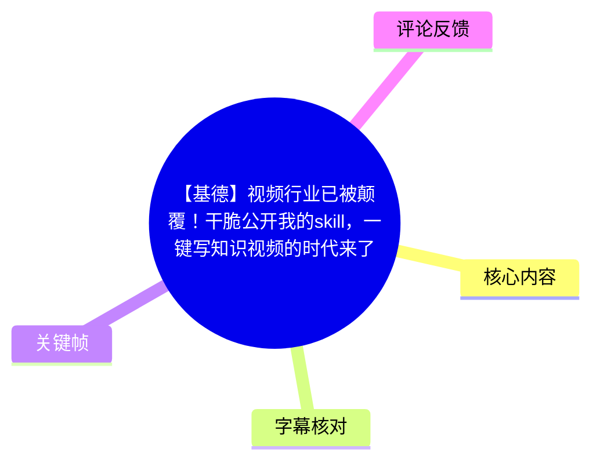
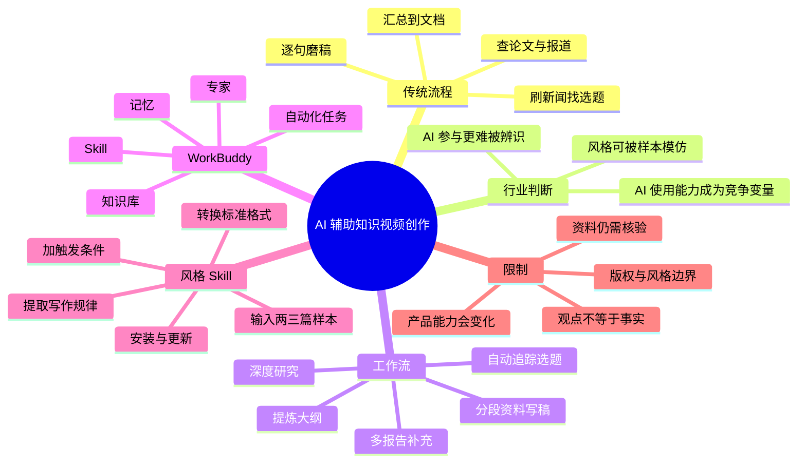
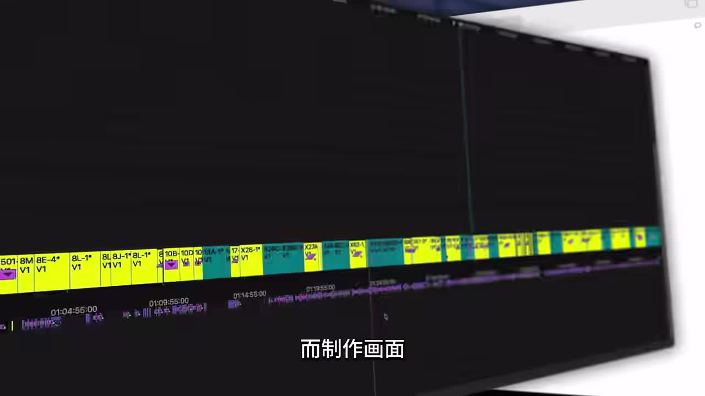
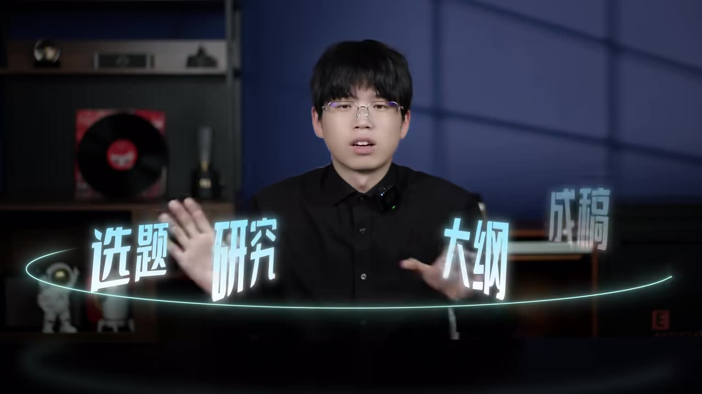

# 【基德】视频行业已被颠覆！干脆公开我的skill，一键写知识视频的时代来了

> 来源：[Bilibili 视频](https://www.bilibili.com/video/BV12hE16WEw9) 
> UP 主：吟游诗人基德｜时长：12 分 19 秒｜分辨率：3840 × 2160 
> 视频简介称：UP 主公开其 AI 辅助创作工作流及可直接使用的“基德创作专家”，并提示视频中的提示词可截图后让 AI 识别并保存。

## 小结

本视频是一套面向知识类视频、文章与职场文案的 AI 辅助写作工作流分享。UP 主以自己过去“刷新闻找选题、检索论文与报道、手工汇总资料、逐句打磨脚本”的方式为对照，主张创作中选题、研究、大纲、成稿和风格复用等环节均可借助 AI 工具提速。

核心流程是：在 WorkBuddy 中设置定期热点追踪任务；围绕确定选题先生成深度研究报告；让模型依据报告提取亮点、角度与视频大纲；对较复杂的视频再补充多份独立研究报告；最后将大纲与分段资料输入模型，推动脚本生成。UP 主特别强调，深度报告主要是给后续模型阅读的“上下文材料”，不应直接当成面向观众的成稿。

视频的另一重点是将个人文风封装为 Skill：先向模型提供两三篇样本文本，要求其把叙事节奏、修辞、知识偏好与论证方式整理为 Markdown 文档；再让 WorkBuddy 转为 Skill 标准格式、补充触发条件并安装。此后可在写视频文案时自动调用，并能通过持续加入新样本迭代版本。

需要注意，视频对“视频行业已被 AI 全面占领”“写作风格不再稀缺”“AI 原生视频将吞没绝大多数知识类视频”等说法，主要属于 UP 主的行业观察与预测，并未在素材中给出可独立核验的数据或研究。工具名称、模型版本、界面能力和产品入口均可能随时间变化；实践时还需自行核查资料来源、版权、事实准确性和平台规则。

本视频适合已有表达欲、领域积累或内容生产需求，但缺少时间进行资料整理与脚本撰写的学生、知识区创作者及职场写作者。它提供的是“以模型协作缩短流程”的方法，而不是跳过选题判断、资料核验与人工编辑的万能方案。

## 思维导图

## 目录

- [背景：从手工创作到 AI 协作](#背景从手工创作到-ai-协作)
- [行业判断：AI 改变的是稀缺性而非内容责任](#行业判断ai-改变的是稀缺性而非内容责任)
- [第一步：用自动化任务持续发现选题](#第一步用自动化任务持续发现选题)
- [第二步：深度研究、大纲与多资料控制](#第二步深度研究大纲与多资料控制)
- [第三步：用 Markdown 与知识库组织上下文](#第三步用-markdown-与知识库组织上下文)
- [第四步：把个人文风封装为 Skill](#第四步把个人文风封装为-skill)
- [专家团与“一键化”的适用边界](#专家团与一键化的适用边界)
- [结论、限制与时效性](#结论限制与时效性)
- [关键帧索引](#关键帧索引)
- [字幕比对](#字幕比对)
- [评论分析](#评论分析)
- [处理记录](#处理记录)

## 背景：从手工创作到 AI 协作 [00:00](https://www.bilibili.com/video/BV12hE16WEw9?t=0)

UP 主开场列举过往制作过的科普选题，包括“神秘的白洞”“太阳系的超级恶魔木星”“花了 100 亿美金的韦布望远镜”“五大新冠变异体解读”等，并提出这些过去获得好评的科普视频，在今天“人人都可以轻松写出文”；画面制作方面，他认为学习 Adobe Premiere 一类后期软件约一周即可入门。此处是创作者的经验性表达，不表示所有人可在相同时间达到同等制作质量。

他决定公开从选题、研究、大纲到成稿的 AI 工作流，并面向两类受众：

1. 有很多表达欲、但时间有限的大学生；
2. 在某个领域有知识积累、希望将积累表达为内容的人。

其核心承诺不是“完全无需人”，而是减少苦思冥想、资料搬运和初稿撰写的时间，使创意能更快被表达出来。

> 图：关键帧展示视频剪辑软件的多轨时间线。它直观对应 UP 主所说的传统视频制作环节：即使文案生产被 AI 加速，画面剪辑、素材组织与后期仍是内容交付中的实际工作。

### 原有的“手搓”工作流 [00:42](https://www.bilibili.com/video/BV12hE16WEw9?t=42)

UP 主回顾其自 2020 年开始运营账号后的传统流程：

- 刷新闻与社交平台，等待灵感或记录选题；
- 带着选题到论文平台检索资料；
- 用传统搜索引擎逐篇阅读新闻报道；
- 将有用内容复制、集中到文档；
- 一句一句打磨出完整文案；
- 对较深的选题，撰写阶段至少可能持续半个月。

这套流程的瓶颈是：选题依赖个人信息摄入和判断；资料搜集依赖大量人工浏览；文案成型依赖反复手工推敲。视频后续的工具化方案，分别对应这些瓶颈。

> 图：画面中的角色在电脑前疲惫伏案，字幕为“起码要写半个月吧”。这张图帮助理解视频提出 AI 工作流的现实动机：压缩深度选题的资料与写作周期。

## 行业判断：AI 改变的是稀缺性而非内容责任 [01:23](https://www.bilibili.com/video/BV12hE16WEw9?t=83)

UP 主称自己早期对 AI 写作有抵触，认为其容易呈现“营销号风格”与流水线文风；后来因观察到三类现象而转变看法。

### 1. 观众越来越难仅凭成品判断 AI 是否参与 [01:37](https://www.bilibili.com/video/BV12hE16WEw9?t=97)

他举出常见的 AI 写作痕迹：重复的固定句式，例如“这不是什么，而是什么”；突然出现的夸张或生硬比喻；以及将行业竞争比作“拳击竞技场”一类表达。他认为熟悉写作的人可能一眼看出，但普通评论区未必在乎文稿是人写还是 AI 参与。

视频还提到有人利用 AI 制作三四十分钟的深度历史解析，观众不一定能辨识；AI 美女跳舞从刚出现时被嘲笑，到数月后评论区接受度变化。这些都是 UP 主观察或举例，素材未提供具体案例链接、样本规模或统计验证。

### 2. AI 使用能力成为职场竞争变量 [02:20](https://www.bilibili.com/video/BV12hE16WEw9?t=140)

UP 主转述朋友的职场经历：一位朋友被领导要求用“vibe coding（氛围编程）”写程序，即用自然语言描述需求、由 AI 完成代码；另一位从事招聘的朋友称，其所在场景会关注候选人在最近工作经历中是否使用 AI。

这些转述不能外推为普遍招聘标准，但体现了视频的主张：即使个人选择不用 AI，同业中的高效使用者仍可能形成效率差异。UP 主还提及“学历越高，AI 用得越好”的说法，但视频未给出对应调查来源，应视为个人听闻，不宜作为事实结论引用。

### 3. 写作风格从长期专利变为可调用工具 [03:17](https://www.bilibili.com/video/BV12hE16WEw9?t=197)

UP 主的综合判断是：只要提供样本，AI 可以较快模仿写作风格，因此“写作风格好”不再完全是长期训练形成的个人专利，而会成为一种可调用工具。

这一判断解释了后文 Skill 的设计逻辑，但也存在重要边界：

- 样本模仿不等于准确复刻作者的知识、价值判断和创作决策；
- 生成文本仍可能出现事实错误、推理跳跃、陈词滥调或风格漂移；
- 使用他人作品训练或仿写时，应审慎处理版权、署名、商业使用许可及误导性冒充问题；
- 风格可复制不代表选题判断、叙事取舍和可信度审核不再重要。

> 图：蓝红双方在拳击台对峙，画面对应视频中对“神奇比喻”及竞争叙事的讨论。它有助于识别 UP 主所批评的、可能显得模板化的 AI 表达方式。

## 第一步：用自动化任务持续发现选题 [04:00](https://www.bilibili.com/video/BV12hE16WEw9?t=240)

UP 主推荐使用 WorkBuddy 作为工作流入口，并将其与 OpenClaw 对比：他认为 WorkBuddy 更易上手。这里是产品推荐而非横向评测，视频没有给出价格、性能测试、隐私政策或功能差异的完整证据。

### 操作路径与设置

根据视频演示，选题自动化的操作顺序为：

1. 打开 WorkBuddy；
2. 在左侧进入“自动化”；
3. 点击“添加”；
4. 创建类似“每日热点追踪任务”的任务；
5. 在任务内容中明确告诉 AI：
   - 要找什么目标；
   - 判断选题是否值得关注的标准；
   - 所属领域或主题范围；
6. 将执行频率设置为每 12 小时一次；
7. 分别在早上起床后、晚上睡前查看候选选题。

视频强调，目标可以是热点，也可以限定为物理、宇宙、生物等任意领域。任务提示词的关键不是照抄名称，而是清楚描述“要找什么”和“什么算好”。

### 参数与效果边界

| 项目 | 视频中的做法 | 含义与限制 |
| --- | --- | --- |
| 任务类型 | 每日热点追踪任务 | 名称可自定义，关键是检索目标与筛选标准。 |
| 执行频率 | 每 12 小时一次 | 是 UP 主的个人节奏，不是平台或算法的固定最佳值。 |
| 关注时间 | 上午起床、晚上睡前 | 旨在降低人工刷信息流的频率。 |
| 选题范围 | 热点、物理、宇宙、生物等 | 领域越明确，输出通常越便于筛选；但热点任务仍可能漏报、误报或重复。 |
| 前置条件 | WorkBuddy 及其自动化功能可用 | 实际入口、权限、付费状态与执行配额可能变化。 |

视频还建议手动安装 Python、Node.js 等编程环境或库，以发挥工具更大潜力；同时明确表示不安装也“可以直接用”。由于 ASR 对技术名词存在识别误差，能确认的核心是 Python 与 Node.js，具体依赖清单、版本号和安装命令均未在素材中提供，不能补写。

## 第二步：深度研究、大纲与多资料控制 [05:08](https://www.bilibili.com/video/BV12hE16WEw9?t=308)

确定选题后，UP 主的习惯不是立即写大纲，而是先生成一份深度研究报告。其理由是，研究报告承担“给 AI 提供可用上下文”的角色，后续的大纲与成稿可以基于此展开。

### 生成研究报告

视频展示的路径为：

1. 在左侧进入“专家”；
2. 在右上角搜索“深度”；
3. 召唤或选择“深度研究专家”；
4. 在对话框输入研究主题，例如与马斯克相关的主题；
5. 按任务与资料语言选择模型；
6. 生成深度研究报告。

UP 主给出如下模型选择经验：

| 使用情境 | 视频提及的模型/方式 | 备注 |
| --- | --- | --- |
| 简单任务 | 腾讯混元 3 | 为 UP 主个人偏好，未提供测试基准。 |
| 撰写长文 | Kimi 2.6 | 版本与实际可用性会变化。 |
| 以海外英文资料为主 | Gemini（ASR 此处名称不稳定，按上下文校正） | 选择依据是英文信息检索场景。 |

UP 主举例称，自己的一份研究报告有 7,000 多字，并提醒这份报告“不是给你看的，而是给 AI 看的”。换言之，研究报告应被看作中间层资料，而不是无需编辑即可发布的内容。

### 从报告到视频大纲

得到报告后，可向模型提供创作者角色、账号定位与风格，例如“我是视频 UP 主吟游诗人基德，风格是有趣的科普”，再要求模型：

- 找出报告中的亮点；
- 找出有趣、适合视频化的角度；
- 生成视频大纲。

UP 主称，模型在未被严格限定视频时长等细节时，可能输出较详细的大纲，包括备选标题、开场钩子、画面视觉建议和阶段性比喻。若希望大纲更可执行，建议在提示中自行补充目标时长、受众、论点、禁用表述、证据标准与画面资源限制；这些补充属于基于视频流程的实践建议，非视频逐字给出的固定提示词。

> 图：UP 主出镜，画面文字为“选题、研究、大纲”。这张关键帧准确概括视频提出的核心生产链路，适合作为研究阶段的视觉锚点。

### 复杂选题：至少五份以上深度报告 [07:11](https://www.bilibili.com/video/BV12hE16WEw9?t=431)

视频将后续路径区分为两种：

- **路径一：直接交付。** 若只是给领导交差，或只需要一个基础成品，可直接利用已有大纲和研究材料生成。
- **路径二：强化个性与知识纵深。** 若不想直接把 AI 生成内容原样交给观众，或希望账号更有个性，应再增加步骤。

UP 主对第二种路径的具体建议是：围绕同一个视频主题，单独再生成多份深度研究报告；一篇视频文案至少准备 **5 份以上** 深度报告，使知识点覆盖更广、纵深更深，并为 AI 写作提供更多参考资料。

随后，把大纲与多份资料分段上传到 WorkBuddy 对话框，例如：

1. 告诉模型“这是我的大纲”，上传大纲；
2. 告诉模型“第一部分参考资料是这个”，上传第一份研究报告；
3. 以同样方式上传第二部分及后续部分的资料；
4. 发送请求，让模型依据对应资料撰写。

这套“分段资料—分段成稿”的做法，意在控制脚本走向与知识点质量。它不能自动保证正确性：报告之间可能冲突，资料本身可能过时或有误，模型也可能忽略上传内容。因此发布前仍应回查原始信源，尤其是数字、时间、因果关系、医学金融法律等高风险表述。

## 第三步：用 Markdown 与知识库组织上下文 [08:12](https://www.bilibili.com/video/BV12hE16WEw9?t=492)

UP 主提到，WorkBuddy 默认输出的文档是 Markdown（`.md`）格式，并认为 Markdown 是大模型最直接、最通用的可读格式。因此，他会将资料尽量转换成 Markdown 再与模型交流。

视频给出的转换思路是：给 WorkBuddy 安装文档转 Markdown 的 Skill。具体 Skill 名称、安装地址、支持的原始文件格式、表格/图片/OCR 保真度在素材中未展示，使用者需以实际工具文档为准。

### 为什么强调 Markdown

从工作流角度，Markdown 的价值在于：

- 标题层级清晰，模型较容易理解文档结构；
- 列表、引用、代码块和表格有统一标记；
- 便于将大纲、研究笔记、风格说明和提示词放在同一文本体系中；
- 更方便版本对比、复制与跨工具迁移。

但 Markdown 并不等同于资料质量。扫描版 PDF、图片中的文字、图表含义、复杂排版、脚注和链接来源，经过转换后仍可能丢失或被误读。

### 知识库作为资料入口

视频还提到 WorkBuddy 左侧有“腾讯文档”和代码支持库等入口，并将其类比为免费网盘。UP 主习惯把微信公众号文章与深度报告存入其知识库，之后可直接在对话框调用，避免逐个打开本地文件夹寻找资料。

可迁移的经验是：让研究资料具备可检索的目录、命名与主题结构，而非只堆在聊天记录里。应同时注意：

- 存入第三方知识库前，要确认内容是否含有隐私、公司机密或受版权限制的材料；
- 外部文章应保留原始链接、发布日期、作者和引用位置，便于复核；
- “能被模型访问”不代表“模型必然正确引用”。

## 第四步：把个人文风封装为 Skill [09:00](https://www.bilibili.com/video/BV12hE16WEw9?t=540)

视频的“重头戏”是将写作风格从临时提示词变为可重复调用的 Skill。此前的正文生成阶段，模型已经拿到大纲与资料；这个阶段要解决的是“用什么文风写”。

### 制作 Skill 的实际步骤

1. **准备样本**：将自己的文章，或希望模仿的文档，先提供给 AI 学习；UP 主建议至少放入两三篇。
2. **要求结构化分析**：在上传文章的同时，要求 AI 分析并整理：
   - 叙事节奏；
   - 修辞手法；
   - 知识偏好；
   - 论证方法；
   - 其他可归纳的写作规律。
3. **输出 Markdown 风格说明**：让模型用其可理解的语言整理成 `.md` 文档。UP 主将其比作可随身携带的“神笔”。
4. **转为 Skill 标准格式**：把该 Markdown 文档交给 WorkBuddy，要求改成 Skill 标准格式。
5. **加入触发条件并安装**：视频明确提到需要“加上触发条件”，安装后即可在匹配任务中调用。
6. **通过自然语言触发**：例如用户说“帮我写一个视频文案”，Skill 可自动使用已定义的风格。
7. **持续更新**：有新的样本文风时，要求工具“分析这篇文章的写作风格，融合进我的 Skill，更新 2.0 版本”。

### 风格说明文档应关注什么

视频没有展示完整提示词文本，因此不能还原其逐字内容；但依据 UP 主明确列出的分析维度，一份可维护的风格说明应至少记录：

| 维度 | 应描述的内容 |
| --- | --- |
| 叙事节奏 | 如何开场、何时抛问题、何时转折、何时收束。 |
| 修辞手法 | 常用类比、句式密度、幽默方式与应避免的套路。 |
| 知识偏好 | 偏好史实、数据、生活化观察、案例或理论解释。 |
| 论证方式 | 先结论后证据、层层递进、正反对照或故事切入。 |
| 受众称呼 | 对观众的称呼、互动语气与表达边界。 |
| 触发条件 | 哪些类型任务自动调用，哪些任务不应调用。 |
| 输出约束 | 文本时长、结构、引用要求、禁用词与事实核验要求。 |

UP 主称自己的“基德创作 Skill”由过去文案训练而来，已上传到 WorkBuddy 的“专家”入口，用户可搜索“基德”尝试使用。该入口是否持续存在、Skill 是否仍公开、实际输出质量如何，均取决于发布后的平台状态，需自行验证。

### 风格复用的边界 [10:14](https://www.bilibili.com/video/BV12hE16WEw9?t=614)

视频认为，可以借助 Skill 模仿任意人的风格并不断优化，这也是其“写作风格不再是个人专利”的论据。实际执行时，应避免将“可模仿”误解为“可无边界复制”：

- 不应把 AI 输出冒充为某位作者本人亲自创作；
- 不应复制受版权保护作品的大段独特表达；
- 商业发布前宜检查平台规则、授权要求与受众误认风险；
- 对个人原创内容，更应保留人工复写与独立判断，避免变成只替换主题的模板化文本。

## 专家团与“一键化”的适用边界 [10:41](https://www.bilibili.com/video/BV12hE16WEw9?t=641)

UP 主进一步解释“专家团”的理念：将一件完整任务拆成多个环节，为每个环节配置预设好的专家。视频以股票研究为例，将其拆分为产业研究、市场信号、估值分析、财报研究等环节；每一环都有自己的资料检索方式与输出格式。

其本质是延长 AI 的工作链路，通过多轮、不同角度的提问，得到更细化的最终报告。视频还提及内容创作专家团、深度研究专家、法律资讯专家等类别。

这里必须区分“流程更细”与“结论更可信”：

- 多角色、多轮次可以改善结构完整性、减少遗漏，并促进交叉检查；
- 但如果专家共用错误资料、缺少可追溯来源，或模型在关键问题上产生幻觉，细化流程不能自动提高真实性；
- 股票、法律、医疗等领域的输出不能作为专业意见或决策依据；
- 若工作流稳定、产品高度标准化、无需中途干预，才较适合追求“一键化”；涉及高风险判断、强个人风格或新颖创意时，人工介入仍不可省略。

## 结论、限制与时效性 [11:18](https://www.bilibili.com/video/BV12hE16WEw9?t=678)

视频最后结合 Meta 裁员 8,000 人并转型“AI 原生公司”的新闻，谈到“AI 原生视频”的概念。UP 主将其理解为：新账号从脚本到画面均以 AI 输出为主，而不是传统创作者先有固定内容风格、再把 AI 作为局部工具。其预期是，这类内容将以高效率与高内容密度影响知识类视频生态，手工创作则可能变成更强调知识储备与个人魅力的小众形式。

“Meta 裁员 8,000 人”及其转型表述在本素材中没有对应新闻链接、日期和官方公告，不能据此确认其准确性；应将其视为 UP 主用来表达趋势感受的新闻引述。更重要的是，视频关于未来一两年创作默认使用 AI、AI 原生内容将吞没“99% 知识类视频”的判断均属预测，不是已经发生的可验证结论。

### 可直接迁移的工作原则

1. **先定义筛选标准，再自动化找选题。** 自动化只能扩大信息摄入，是否值得做仍需人判断。
2. **先研究、后大纲、再成稿。** 用研究报告建立上下文，可减少模型凭空补全。
3. **复杂内容采用多资料分段控制。** UP 主建议至少五份以上研究报告，但数量不应替代信源质量。
4. **将稳定偏好写进可维护文档。** Markdown 风格说明与 Skill 能减少重复提示。
5. **每次输出都保留人工责任。** 特别是事实、引用、版权、隐私、价值判断与最终措辞。

### 时效性与未验证事项

- 视频发布于 2026 年 6 月，工具界面、模型名称、模型版本、Skill 市场入口与可用额度均可能已改变。
- WorkBuddy、OpenClaw、腾讯混元 3、Kimi 2.6、Gemini 等工具或模型的能力比较，仅代表 UP 主在录制期的个人使用体验。
- 视频未提供自动化任务提示词全文、Skill 格式规范、安装命令、费用、隐私条款或可复现实验。
- 视频将 AI 写作能力与行业竞争联系起来，但未提供市场统计、内容质量测评或岗位数据；不应据此作职业或投资决策。
- 深度研究报告、知识库资料和最终脚本都应回到原始信源做核验，尤其是新闻、科学、财务、法律与医疗内容。

## 关键帧索引

| 关键帧 | 正文位置 | 画面内容 | 选择价值 |
| --- | --- | --- | --- |
|  | 背景与传统流程 | 多轨视频剪辑时间线 | 说明文案之外，视频生产仍包含剪辑与素材管理。 |
|  | 研究与大纲 | UP 主出镜，文字为“选题、研究、大纲” | 精准覆盖本视频的主流程结构。 |
|  | 传统工作流 | 角色伏案，字幕“起码要写半个月吧” | 直观呈现手工深度写作的时间成本。 |
|  | AI 文风讨论 | 蓝红双方拳击台对峙 | 对应视频对模板化类比和行业竞争叙事的讨论。 |

## 字幕比对

| 字幕来源 | 完整性 | 专有名词 | 时间轴 | 主要问题 |
| --- | --- | --- | --- | --- |
| Bilibili 站内字幕 | 与视频主题严重不符，基本不可用 | 几乎没有本视频涉及的工具、模型与流程术语 | 未提供可对应本视频内容的有效分段 | 内容是聚会、输入法测试、歌曲歌词等，与本视频 AI 创作主题无关，疑似错误关联字幕。 |
| 本次 ASR 字幕 | 基本覆盖完整叙事及流程顺序 | 可识别多数术语，但存在大量同音、断句和译名误差 | 素材未提供逐条时间戳；本文按内容顺序建立近似章节时间轴 | 如“Premium”应为 Premiere、“Payson”应为 Python、“NoteJS”应为 Node.js、“Wogbody”等应为 WorkBuddy；部分模型与产品入口名称存在不确定识别。 |

### 最终字幕选择与校正原则

本次 ASR 已执行。由于站内字幕与本视频内容完全不匹配，本文**以本次 ASR 为主体**，结合视频标题、简介、标签、上下文语义和关键帧进行有限校正；不采用站内字幕的正文内容。

重点校正如下：

| ASR 识别结果 | 本文采用写法 | 校正依据 |
| --- | --- | --- |
| WalkBuddy / Wogbody / Wokbody / Work | WorkBuddy | 视频标签明确包含 `WorkBuddy`，且全文多次在工具操作语境中出现。 |
| Premium | Adobe Premiere（仅作上下文校正） | 原句讨论“学一个后期软件”，结合常见产品名判断；视频未给出版本。 |
| Payson | Python | 与“编程环境库”并列，属于明显同音误识别。 |
| NoteJS | Node.js | 与 Python 同列，属于明显术语误识别。 |
| 腾讯魂元 3 | 腾讯混元 3 | 依据中文模型名称的常见写法进行规范化。 |
| Gimlite | Gemini | 出现在“海外英文资料为主”的模型选择语境；属上下文推定，保留不确定性。 |
| G 的 Skill / G2S 等 | 基德创作 Skill / Skill | 视频标题和简介均明确提及 Skill；ASR 对具体命名有较多误识别。 |

未能通过现有素材确认的内容，包括：WorkBuddy 中“专家”入口的精确名称、Skill 标准格式字段、视频展示提示词全文，以及个别模型版本与产品名的准确拼写。对此均未作补造。

## 评论分析

> 仅处理素材中可获取的热评前三条；评论反映的是评论者观点，不构成已验证事实。

### 1. Cydia-_-：对公司 AI 使用现状的调侃

- **点赞数：993**
- **评论原文：**“给大家看看我司现状[doge]”
- **观点概括：** 评论者以调侃方式将视频所描述的 AI 工作流、职场压力或效率要求，映射到自己公司的现实状态。
- **补充价值：** 该评论说明部分观众能从视频的“AI 已进入工作流程”论述中产生职场共鸣。
- **可信度与限制：** 没有说明公司、岗位、具体制度或事实细节，不能据此推断普遍职场情况。

### 2. ASIARR：将内容识别为 WorkBuddy 推广

- **点赞数：499**
- **评论原文：**“这是一期workbuddy广告，鉴定完毕”
- **观点概括：** 评论者认为视频具有明显的 WorkBuddy 产品推广性质。
- **补充价值：** 视频确实多次演示并推荐 WorkBuddy，也引导观众下载、搜索相关专家与使用 Skill；该评论提醒观众在吸收方法论时注意产品推广立场。
- **可信度与限制：** 视频素材中未提供商业合作标识、合同或报酬信息，因此不能仅凭内容密度断言其为付费广告。更稳妥的结论是：WorkBuddy 是本视频工作流的主要工具与明确推荐对象。

### 3. ITUKISY：技术进步不必然改善劳动者处境

- **点赞数：721**
- **评论原文：**评论以工业革命、电力、计算机为例，认为新技术会淘汰旧劳动形式，但未必为劳动者争取利益。
- **观点概括：** 该评论对视频的“必须使用 AI、提高效率”叙事提出劳动关系层面的反思：技术提高生产率，也可能提高工作强度或重塑考核标准。
- **补充价值：** 它补足了视频较少展开的社会影响维度，即 AI 工具普及后的工时、绩效、岗位替代与分配问题。
- **可信度与限制：** 评论中的历史叙述是概括性表达，没有给出史料或统计来源；其中“工作时长从 12 小时拉长到 16 小时”等具体表述不应直接当成已核验历史事实。其价值主要在于提出值得讨论的问题，而非提供完备证据。

## 处理记录

- **Worker ID：** worker-mrj0wbly-5dc4e50c
- **模型：** gpt-5.6-terra
- **素材与工具结果：** 使用任务提供的视频元数据、视频素材清单、站内字幕、已执行的 ASR 字幕、12 张关键帧路径及可获取热评前三条进行整理；素材输出目录包含合并视频、音频、帧图、信息、评论、字幕与 ASR。
- **字幕选择：** 本次 ASR 已执行。站内字幕内容与视频主题不符，未用于正文；以 ASR 为主，并根据标题、标签、上下文与关键帧对明显工具术语进行审慎校正。
- **关键帧依据：** 选用 `frame-001` 至 `frame-004`，分别对应传统剪辑、选题—研究—大纲、长周期手工写作、AI 文风与竞争类比四个正文主题；其余关键帧未在提供的可视信息中呈现明确且不可替代的流程细节，故未强行引用。
- **评论范围：** 严格限定为可获取热评前三条，未扩展至其他评论或弹幕。
- **缓存清理：** 未提供缓存清理执行回执，无法确认是否已清理；本文不虚构清理结果。
- **未解决问题：** 缺少逐句 ASR 时间戳、完整提示词截图文本、Skill 文件内容与实际安装规范；个别模型/产品名称受 ASR 误识别影响，已在正文中标注不确定性。
