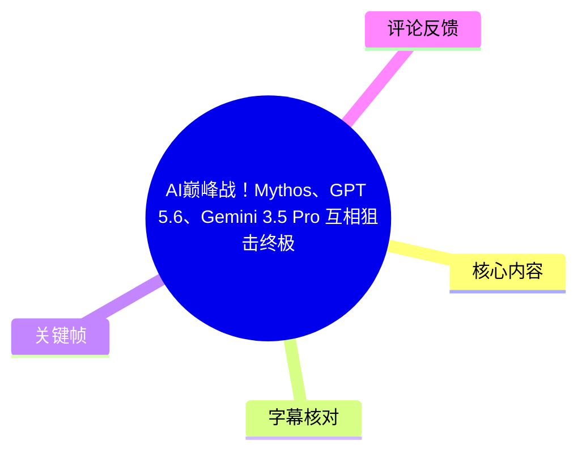
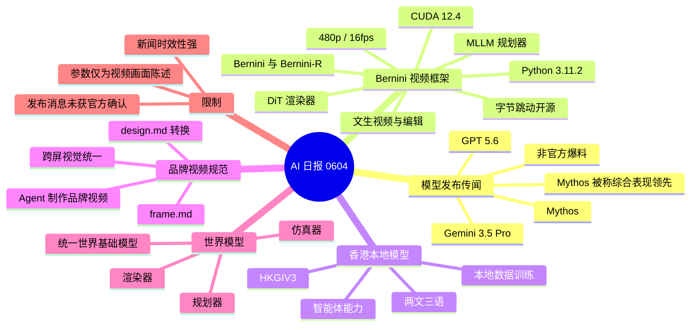
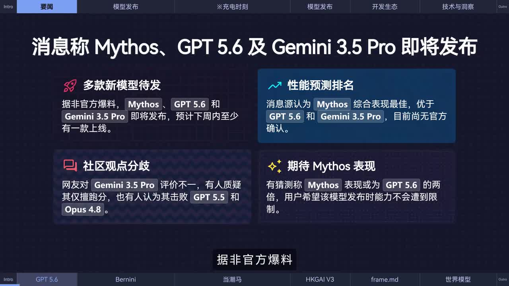
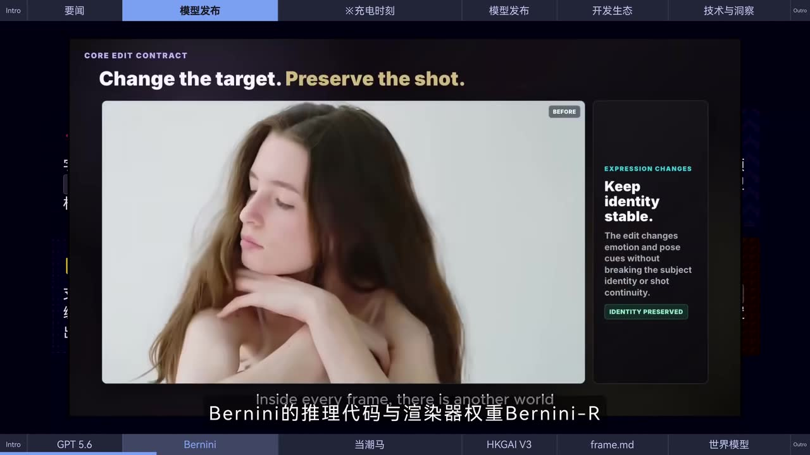
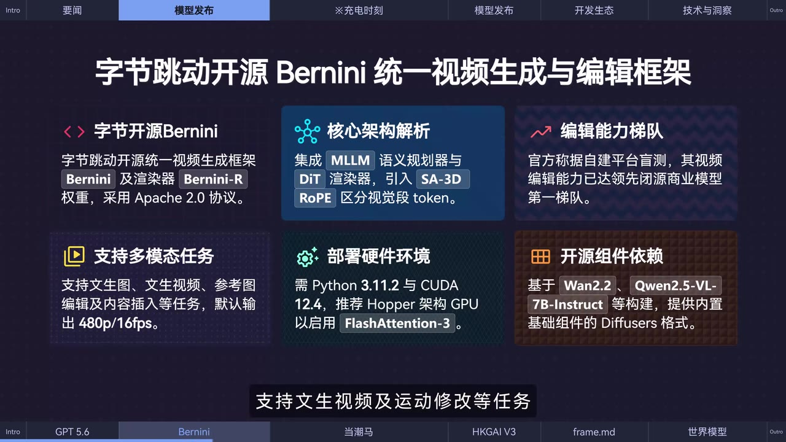

> 来源：[Bilibili 视频](https://www.bilibili.com/video/BV15eEc6yEHy)  
> UP 主：黑鸦Heya｜视频时长：106 秒｜分辨率：3840×2160  
> 视频定位：一则约 1 分 45 秒的 AI 新闻速报，包含模型传闻、开源视频生成编辑框架、香港本地化大模型、品牌视频设计规范与世界模型观点，片中另插入约 23 秒服装广告。

## 小结

视频首先转述**未经官方确认的爆料**：Mythos、GPT 5.6 与 Gemini 3.5 Pro 或将近期发布，且至少一款预计在“下周内”上线。画面明确写出消息源认为 Mythos 综合表现最好，但这不是官方发布、更不是实测基准结论；标题中的“人类命运大转折”属于强烈的传播性表达，不能据此推导技术已发生确定性跃迁。

技术信息的主体是字节跳动开源的统一视频生成与编辑框架 **Bernini**，以及其渲染器 **Bernini-R**。视频称其组合了 MLLM 语义规划器与 DiT 渲染器，支持文生图、文生视频、参考图编辑、纹身/内容插入和运动修改等任务；画面还给出默认输出为 **480p、16 fps**，部署要求包括 **Python 3.11.2、CUDA 12.4**，并推荐 Hopper 架构 GPU 与 FlashAttention-3。模型推理代码和渲染器权重已发布至 Hugging Face，画面标注为 Apache 2.0 协议。

后半段涉及香港生成式人工智能研发中心发布的 **HKGIV3**：视频称该模型基于本地数据训练、已具备智能体能力，并面向香港“两文三语”和本地化场景。由于视频未提供版本号、评测结果、访问方式或许可条款，不能进一步判断其实际能力和可用范围。

视频还提到“黑JEN”（站内字幕转写如此，名称待外部核验）推出了面向视频与动态图形设计的规范文件 **frame.md**。其用途是指导 Agent 制作品牌视频，并允许把既有 `design.md` 转换为该规范，以维持多屏幕中的品牌视觉一致性。片中没有演示具体文件格式、字段或转换命令。

最后，视频概述李飞飞关于“世界模型”的阐释：可将其理解为由**渲染器、仿真器、规划器**构成的体系，其中仿真器输出物理状态，三者底层知识被认为同源，并可能走向统一的世界基础模型。这是视频转述的概念性观点，不应等同于已经落地的统一模型架构。

适合关注大模型发布传闻、开源视频生成编辑、智能体创作流程和世界模型概念的人快速浏览。实际采用任何模型或框架前，仍应以官方仓库、许可证、模型卡、硬件要求和最新发布公告为准。

## 思维导图

## 目录

- [模型发布传闻：Mythos、GPT 5.6 与 Gemini 3.5 Pro](#模型发布传闻mythosgpt-56-与-gemini-35-pro)
- [Bernini：统一视频生成与编辑框架](#bernini统一视频生成与编辑框架)
- [片中广告内容与边界](#片中广告内容与边界)
- [HKGIV3：香港本地化生成式 AI 模型](#hkgiv3香港本地化生成式-ai-模型)
- [frame.md：品牌视频与动态图形设计规范](#framemd品牌视频与动态图形设计规范)
- [李飞飞对世界模型的三层划分](#李飞飞对世界模型的三层划分)
- [可执行的关注与验证步骤](#可执行的关注与验证步骤)
- [参数、限制与时效性](#参数限制与时效性)
- [关键帧索引](#关键帧索引)
- [字幕比对](#字幕比对)
- [评论分析](#评论分析)
- [处理记录](#处理记录)

## [模型发布传闻：Mythos、GPT 5.6 与 Gemini 3.5 Pro](https://www.bilibili.com/video/BV15eEc6yEHy?t=4)

对应站内中文字幕时间段：00:00:04,120–00:00:17,120。

视频称，依据“非官方爆料”，**Mythos、GPT 5.6、Gemini 3.5 Pro**即将发布，预计至少有一款会在下周内上线。站内中文字幕将“上线”误写为“面试”，但结合语义以及英文字幕的 “released within the next week”，应理解为模型发布/上线，而不是招聘面试。

画面中的信息卡进一步给出以下内容：

- 多款新模型待发布：Mythos、GPT 5.6、Gemini 3.5 Pro 被描述为即将发布。
- 性能预测：消息源认为 **Mythos 综合表现最佳，优于 GPT 5.6 和 Gemini 3.5 Pro**。
- 社区观点存在分歧：画面称部分网友质疑 Gemini 3.5 Pro 只是“刷分”，也有人认为其可挑战 GPT 5.5 和 Opus 4.8。
- 对 Mythos 的预期：画面转述“有猜测称 Mythos 表现或为 GPT 5.6 的两倍”，同时提及用户希望其发布时能力不受限。

这些内容均属于**爆料、猜测、社区评价或画面转述**。视频没有提供泄露来源、发布日期、模型卡、跑分条件、价格、上下文窗口、API 规格或官方公告链接，因此不能将其作为已证实事实。

> 图：该关键帧集中呈现“即将发布”“Mythos 综合表现最好”“社区观点分歧”等四项画面信息。它说明视频对模型竞争的叙述建立在非官方消息与社区讨论上，而非正式产品发布材料。

## [Bernini：统一视频生成与编辑框架](https://www.bilibili.com/video/BV15eEc6yEHy?t=17)

对应站内中文字幕时间段：00:00:17,120–00:00:35,970。

视频称字节跳动近期开放了视频生成与编辑框架 **Bernini** 的相关内容，包括：

- **Bernini 的推理代码**；
- **渲染器 Bernini-R 的权重**；
- 模型权重已发布至 **Hugging Face**。

### 架构与任务能力

视频字幕称，框架结合了：

1. **MLLM 规划器**：负责语义层面的规划；
2. **DiT 渲染器**：负责生成或渲染环节。

关键帧给出的更完整画面信息还包括：

- 核心架构集成 **MLLM 语义规划器** 与 **DiT 渲染器**；
- 使用 **SA-3D RoPE** 区分视频段 token；
- 基于 **Wan2.2**、**Qwen2.5-VL-7B-Instruct** 等构建；
- 为内容基础组件提供 Diffusers 格式；
- 采用 **Apache 2.0** 协议。

视频所列支持任务包括：

- 文生图；
- 文生视频；
- 参考图编辑；
- 内容插入；
- 纹身视频编辑；
- 运动修改。

其中，“纹身视频”是站内中文字幕和 ASR 的直接转写，英文字幕则写成“text-to-video generation and motion modification”。由于画面未展示完整任务定义或官方文档，本文保留“纹身/内容插入类编辑”这一较谨慎表述，不对具体编辑机制做超出素材的推断。

> 图：关键帧展示 “Change the target. Preserve the shot.”，并标注“Keep identity stable”。它直观说明视频所说的视频编辑并非单纯重新生成，而是强调在编辑表情、姿态等内容时尽量维持主体身份和镜头连续性。

### 视频画面披露的部署参数

关键帧中给出的参数如下，均应理解为**视频画面所陈述的部署信息**，实际使用前应回到官方仓库核验：

| 项目 | 视频画面信息 |
| --- | --- |
| 默认输出 | 480p / 16 fps |
| Python | Python 3.11.2 |
| CUDA | CUDA 12.4 |
| 推荐 GPU | Hopper 架构 GPU |
| 注意力实现 | FlashAttention-3 |
| 许可证 | Apache 2.0 |
| 相关基础组件 | Wan2.2、Qwen2.5-VL-7B-Instruct、Diffusers 格式 |
| 发布渠道 | Hugging Face（字幕明确提及） |

> 图：该关键帧是正文中参数密度最高的画面，明确列出架构、任务类型、默认输出、Python/CUDA 版本、推荐硬件、依赖组件和协议，因此可用于区分“视频实际披露的参数”与未披露的性能结论。

### 视频对编辑能力的表述

视频称其视频编辑能力“已达闭源商业模型第一梯队”。需要注意：

- 这是视频转述的**官方主张**，不是本视频自行完成的盲测；
- 视频没有展示测试集、指标、对照模型、采样设置或失败案例；
- 不能据此严格认定其在所有任务中等同或超过任一闭源产品；
- 480p/16 fps 只是画面所列默认输出，不能据此推断最大分辨率、最长时长或真实推理速度。

## [片中广告内容与边界](https://www.bilibili.com/video/BV15eEc6yEHy?t=36)

对应站内中文字幕时间段：00:00:36,970–00:01:00,200。

视频在 Bernini 新闻后插入服装广告，内容为一件“230 级/克”新疆精梳棉 T 恤。广告口播称：

- 面料“软糯厚实”、不透；
- 穿洗后更贴身舒适；
- 源头工厂直售价 **19.9 元**、包邮；
- 尺码不合适可无忧退换；
- 通过评论区链接复制到微信下单。

该段不是 AI 技术新闻，也未给出品牌资质、产品成分检测、退换规则细则、适用地区或链接有效期。有关价格、材质、耐用性及售后均是广告口播，应以实际商品页面为准。

## [HKGIV3：香港本地化生成式 AI 模型](https://www.bilibili.com/video/BV15eEc6yEHy?t=60)

对应站内中文字幕时间段：00:01:00,200–00:01:12,690。

视频称，香港生成式人工智能研发中心正式发布 **HKGIV3 大模型**。视频提供的要点为：

- 模型已升级，具备**智能体（Agent）能力**；
- 基于**本地数据**训练；
- 支持“两文三语”；
- 面向香港本地化应用场景。

“两文三语”在香港语境中通常指中文、英文两种书写系统，以及粤语、普通话、英语三种口语使用环境；但视频没有展示该模型对具体语言、方言、书写体或任务的逐项评测，故不能延伸为准确率或覆盖率承诺。

视频也未说明 HKGIV3 的参数规模、上下文长度、模型结构、开放程度、访问入口、收费方式、安全机制或部署条件。因此这则消息可作为后续追踪线索，而不是可立即复现的产品说明。

## [frame.md：品牌视频与动态图形设计规范](https://www.bilibili.com/video/BV15eEc6yEHy?t=72)

对应站内中文字幕时间段：00:01:12,690–00:01:27,070。

视频称“黑JEN”宣布推出面向视频与动态图形设计的规范文件，站内中文字幕写作 **frame.md**。它的工作流定位是：

1. 使用面向视频/动态图形的结构化规范；
2. 以该规范指导 Agent 制作品牌视频；
3. 将已有的 `design.md` 转换为新规范；
4. 在不同屏幕或终端上维持统一的品牌视觉识别。

这一信息可提炼出一个可迁移经验：当创作任务从单次文案或静态视觉扩展到多段视频、多设备展示和多 Agent 协作时，品牌风格不宜只依赖自然语言提示词；应考虑把视觉规则、动效规则、资产引用和版式约束沉淀为可版本化的设计规范。

但视频没有披露 `frame.md` 的文件样例、字段定义、校验器、兼容工具、转换脚本或实际产出案例，不能据此编造具体语法或命令。

## [李飞飞对世界模型的三层划分](https://www.bilibili.com/video/BV15eEc6yEHy?t=87)

对应站内中文字幕时间段：00:01:27,350–00:01:42,770。

视频转述李飞飞发文厘清“世界模型”概念，并将其划分为三个核心组成部分：

| 组成部分 | 视频中的定位 |
| --- | --- |
| 渲染器 | 世界模型的组成部分之一 |
| 仿真器 | 能够输出物理状态 |
| 规划器 | 与渲染器、仿真器共同构成核心桥梁 |

视频的进一步判断是：三者的底层知识同源，未来将走向“大一统的世界基础模型”。

可将这一表述理解为一种研究路线图：模型既要表示或生成可观察结果（渲染），也要对状态及其演化进行模拟（仿真），还要服务于目标导向决策（规划）。不过，视频没有展开论文名称、实验方法、数学定义或实现架构，因此不应把这段内容解读为某个已发布系统的技术规格。

## [可执行的关注与验证步骤](https://www.bilibili.com/video/BV15eEc6yEHy?t=29)

视频本身没有演示完整安装流程、命令行或代码。基于它给出的公开线索，若要将新闻转化为实际调研，可按以下顺序进行：

1. **先区分消息等级**  
   将 Mythos、GPT 5.6、Gemini 3.5 Pro 归为“非官方发布传闻”，不要把预测排名写入选型结论。

2. **定位 Bernini 的官方发布页**  
   视频明确提及 Hugging Face；应进一步核对模型卡、权重范围、使用许可、仓库提交记录及官方说明。

3. **核验环境约束**  
   视频画面列出 Python 3.11.2、CUDA 12.4、Hopper GPU 和 FlashAttention-3。部署前需检查自身环境是否匹配，并确认这些是最低要求、推荐要求还是演示环境要求。

4. **从默认输出开始验证**  
   以画面提供的 **480p / 16 fps** 作为初始验证基线，观察文生视频、参考图编辑、主体一致性和运动修改的实际输出，而不是直接假定可稳定高分辨率运行。

5. **分别测试生成和编辑能力**  
   不要只测文生视频。若业务需要人物、商品或镜头连续性，应专门设计参考图编辑、内容插入、姿态/运动变化等测试用例。

6. **为品牌创作建立可审查规范**  
   若采用 frame.md 一类思路，应先明确品牌色、字体、Logo 安全区、动效节奏、禁止元素、素材许可和跨端适配规则；由于视频未提供格式定义，不能直接假设其字段结构。

7. **持续追踪 HKGIV3 与世界模型的一手材料**  
   对 HKGIV3 关注开放入口、测试报告和语言覆盖；对世界模型观点则应回到原文或论文，避免只从新闻摘要判断技术成熟度。

## [参数、限制与时效性](https://www.bilibili.com/video/BV15eEc6yEHy?t=4)

### 视频明确给出的参数与事实

- 全片时长：106 秒；
- Bernini 默认输出：480p / 16 fps；
- Bernini 画面列出的环境：Python 3.11.2、CUDA 12.4；
- 推荐硬件：Hopper 架构 GPU；
- 推荐组件：FlashAttention-3；
- 协议：Apache 2.0；
- 权重发布渠道：Hugging Face；
- HKGIV3 特征：本地数据训练、智能体能力、两文三语及香港本地场景；
- 广告价格口播：19.9 元包邮。

### 不能从素材确认的内容

以下内容没有得到视频中的一手材料或演示支持：

- Mythos、GPT 5.6、Gemini 3.5 Pro 的准确发布日期；
- 三者的真实性能排名、跑分、价格与模型规格；
- Bernini 的最大分辨率、最长生成时长、吞吐、显存占用和商用服务 SLA；
- Bernini 对“闭源商业模型第一梯队”的对比依据；
- HKGIV3 的参数量、开放范围、API、可下载性与安全能力；
- frame.md 的实际语法、生态兼容性和转换方式；
- 世界基础模型何时或是否会以统一形态落地。

### 时效性说明

本视频为“AI日报0604”，其中“下周内”“即将发布”等表述是**录制时点的相对时间**，具有很强时效性。元数据记录的发布时间为 2026 年 6 月 4 日，因此相关发布传闻、权重链接、价格广告和产品状态都可能已经变化。使用本笔记时，应将其视为该时点的视频新闻整理，而不是当前状态的保证。

## 关键帧索引

| 关键帧 | 对应主题 | 正文价值 |
| --- | --- | --- |
|  | Mythos、GPT 5.6、Gemini 3.5 Pro | 直接展示“非官方爆料”、预测排名、社区分歧与预期，支持对传闻性质的判断。 |
|  | Mythos 性能预期 | 与首帧共同确认画面将 Mythos 描述为综合表现领先，但没有官方确认。 |
|  | Bernini-R 视频编辑 | 展示“改变目标、保留镜头”及主体身份稳定性，帮助理解编辑任务不是简单重生成。 |
|  | 架构、任务与环境 | 集中给出 Apache 2.0、480p/16fps、Python 3.11.2、CUDA 12.4、Hopper GPU 等关键参数，是技术部分的主要视觉依据。 |

## 字幕比对

| 字幕来源 | 完整性 | 专有名词 | 时间轴 | 主要问题 |
| --- | --- | --- | --- | --- |
| Bilibili 站内中文字幕 `p01-ai-zh.srt` | 覆盖 00:00:00,480–00:01:45,280，分段细，基本覆盖全片口播 | 存在多处音译或识别误差，如 `MISSLESGPT5.6`、`METHOS`、`BERNI`、`Berni r`、`hugin face`、`黑JEN`、`frame达MD` | 精确到毫秒，适合作为章节时间轴依据 | “下周内面试”应为上线/发布；“纹身视频”含义不够明确；部分技术名词分词不规范 |
| 本次 ASR（Whisper medium，中文） | 诊断显示语音覆盖 104.63 秒、覆盖率 99.21%，首段 00:00:00,270，末段 00:01:45,160 | 将 Mythos 识别为 `Methox/Methos`，Bernini 为 `Bernini/BerninI-R`，DiT 为“DIT 渲感器”，frame.md 为 `RAM.MD`，误差较多 | 有时间戳，但仅 5 个超长分段，不适合精细定位 | 专有名词、标点与分句质量较弱；第 3 段 ASR SRT 的结束时间写为 00:01:13,460，与诊断 JSON 的 73.46 秒一致，但文本块过长 |
| 关键帧画面 | 可补足字幕缺失的图文信息 | 清楚显示 `Mythos`、`Bernini`、`Bernini-R`、`SA-3D RoPE`、`480p/16fps`、`Python 3.11.2`、`CUDA 12.4` 等 | 仅能对应采样时刻，不能替代逐句字幕 | 未提供后半段 HKGIV3、frame.md、世界模型的对应画面细节 |

### 最终字幕选择与校正原则

正文以**站内中文 SRT**作为主时间轴来源：其分段时间精确，且内容与 ASR 的中文口播高度对应；ASR 已按要求完成检查，确认源视频**存在音轨**，并非 `noAudioStream=true` 情况。

对于存在歧义的专有名词，采用“站内字幕 + 本次 ASR + 关键帧画面”交叉校正：

| 原始转写 | 正文采用 | 校正依据 |
| --- | --- | --- |
| `MISSLESGPT5.6` / `Methox GPT5.6` | GPT 5.6 | 标题、关键帧与上下文共同支持；保留“发布传闻”性质 |
| `METHOS` / `Methos` | Mythos | 关键帧大标题明确写作 Mythos |
| `BERNI` / `Bernini` | Bernini | 关键帧标题明确写作 Bernini |
| `Berni r` / `BerninI-R` | Bernini-R | 关键帧明确显示 Bernini-R |
| `di it` / `DIT` | DiT | 关键帧“DiT 渲染器” |
| `hugin face` | Hugging Face | 常见平台名称，且多语言站内字幕一致 |
| `frame达MD` / `RAM.MD` | frame.md | 站内多语字幕和中文上下文均指向该设计规范名称；具体发布方名称仍保留待核验 |
| `防针器` / `防钉器` | 仿真器 | 站内中文与多语字幕语义一致，且与世界模型上下文匹配 |

## 评论分析

以下仅分析当前可获取的热评前三条，评论反映的是观众态度或补充，不构成已验证事实。

1. **至高机器智能（1122 赞）**  
   > “怎么我就想不到人类命运大转折这么炸裂的标题？[大哭]”

   该评论调侃标题使用“人类命运大转折”这类高强度措辞，隐含对标题党或夸张叙事的感受。它与视频中实际呈现的内容形成对照：主体是多条短新闻与传闻，评论没有对任何技术事实提供额外证据。

2. **十丰川祥子十（215 赞）**  
   > “标题怎么越来越大了，再这么下去整个人类都得给黑鸦的标题拖后腿了”

   该评论延续对标题尺度不断升级的幽默批评，关注的是传播表达而非模型或框架细节。它可以提示读者：应将标题中的戏剧化修辞与视频内“非官方爆料”“官方称”等不同证据等级分开阅读。

3. **詩原（210 赞）**  
   > “应该是‘三日凌空’，是‘凌’不是‘临’，打错字啦”

   该评论指出视频某处文字可能存在“凌/临”的错别字。提供的字幕与关键帧素材中未出现可供定位的该短语，因此无法进一步核验具体出现位置、原文上下文或其是否影响技术信息。该条仅作为观众发现潜在文字校对问题的反馈记录。

## 处理记录

- Worker ID：`worker-mrj0wbly-5dc4e50c`
- 模型：`gpt-5.6-terra`
- ASR 模型：`medium`，运行设备 `cuda`，计算类型 `float16`，识别语言为中文，语言置信度 `0.99853515625`
- 使用素材与工具结果：
  - 视频元数据：Bilibili 元数据；
  - 站内字幕：`p01-ai-zh.srt`，并交叉参考英、日、西、阿、葡语版本；
  - 本次 ASR：`asr/asr-result.json`、`asr/transcript.srt`；
  - 关键帧：`frames/frame-001.jpg` 至 `frames/frame-004.jpg`；
  - 评论：`comments/comments.json`，仅使用已获取的热评前三条。
- 字幕选择：采用站内中文 SRT 作为精确时间轴主来源；本次 ASR 用于确认音轨存在、口播覆盖完整性及交叉比对。ASR 诊断未标记 `noAudioStream=true`，其语音覆盖率为 99.21%。
- 关键帧选择依据：
  - `frame-001.jpg`、`frame-002.jpg`：画面明确展示 Mythos、GPT 5.6、Gemini 3.5 Pro 的发布传闻及预测表述；
  - `frame-003.jpg`：展示主体一致性视频编辑案例；
  - `frame-004.jpg`：展示 Bernini 的架构、任务、默认输出、部署环境、依赖和协议，是技术参数的直接画面依据。
- 缓存清理：本任务提供的素材清单未包含可执行的缓存清理日志；未对原始素材、音频、ASR 文件或关键帧执行额外删除操作。
- 未解决问题：
  - Mythos、GPT 5.6、Gemini 3.5 Pro 的消息均未由视频提供官方来源；
  - “黑JEN”及 frame.md 的正式发布主体、文档地址和语法未能由给定素材确认；
  - Bernini 的实际仓库地址、模型卡、性能评测、显存与推理时延未在素材中提供；
  - “纹身视频”对应的具体任务定义存在字幕表述歧义。
