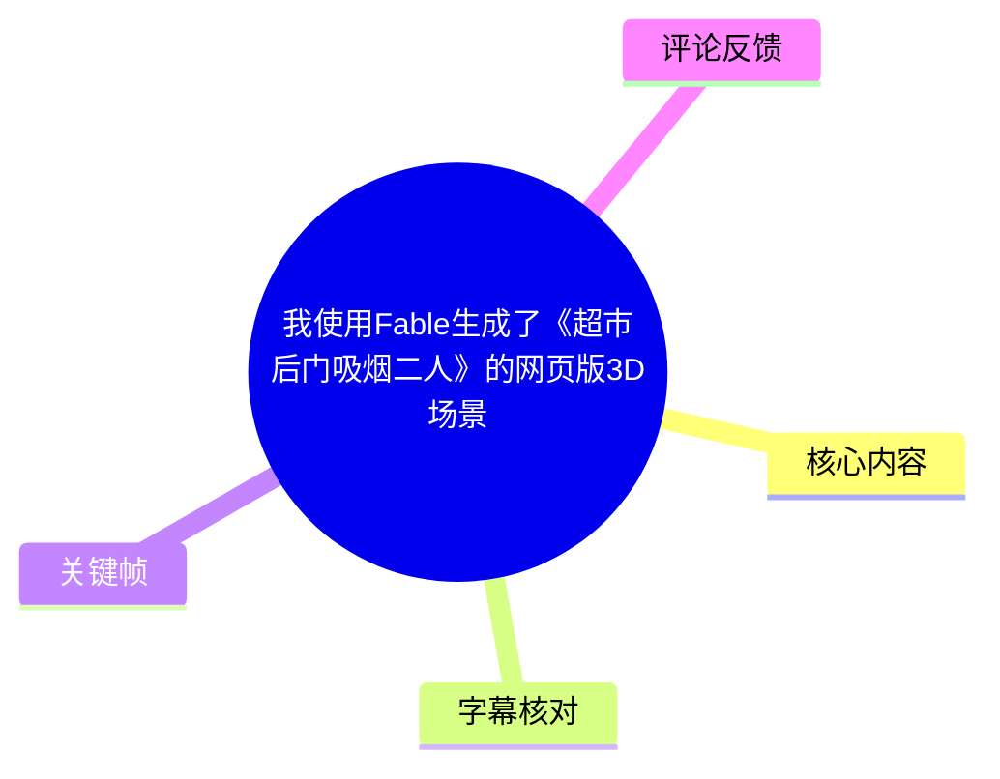
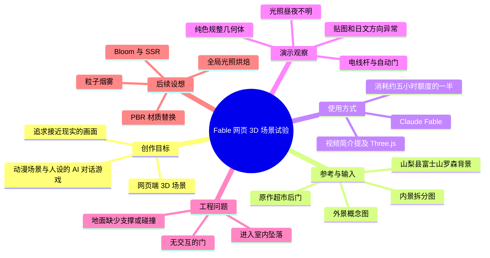
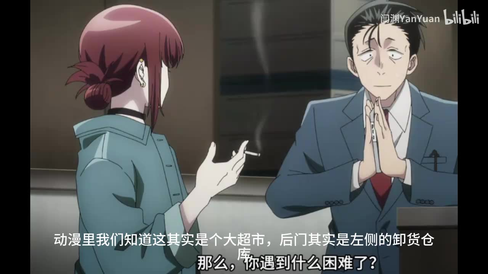
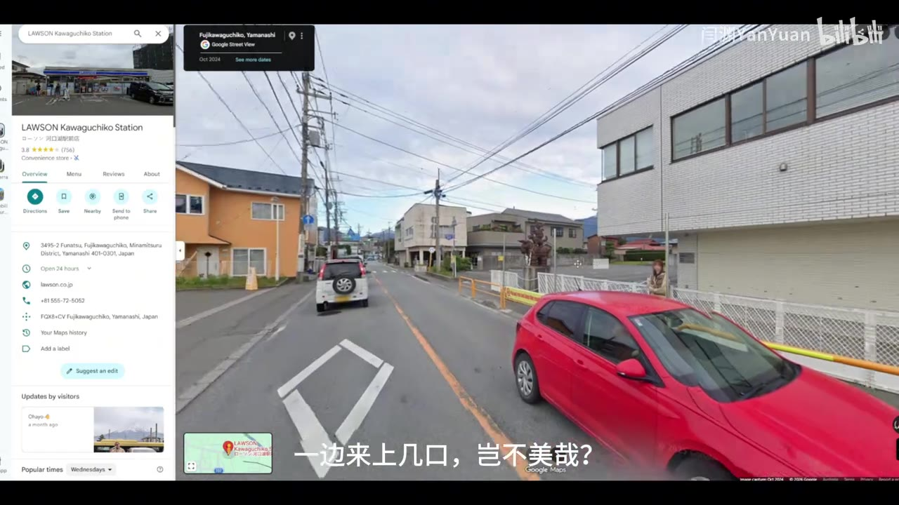
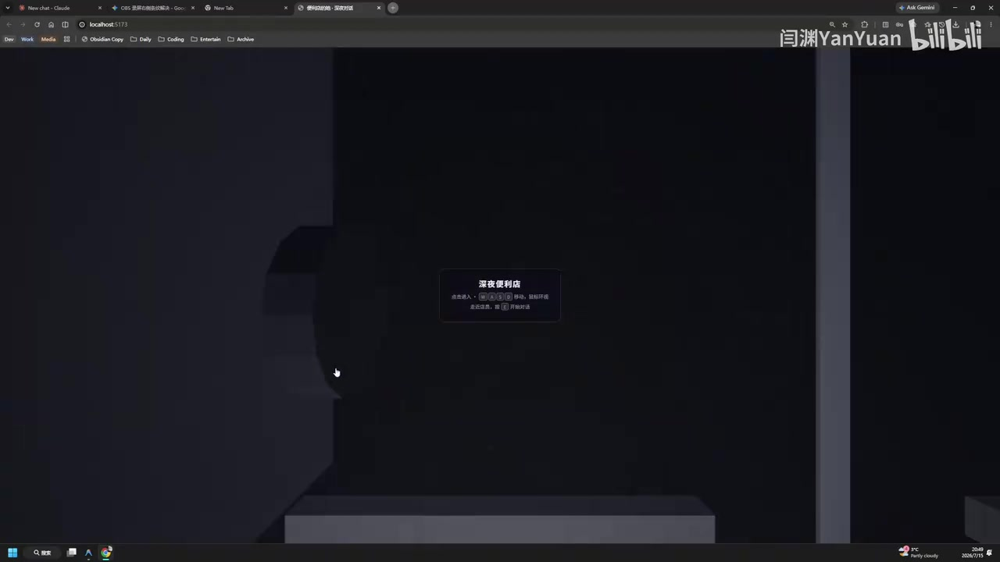

# 我使用Fable生成了《超市后门吸烟二人》的网页版3D场景

> 来源：[Bilibili 视频](https://www.bilibili.com/video/BV13FNz65EQM) 
> UP 主：闫渊YanYuan｜时长：04:22｜合集：AIcode  
> 注：本文将视频中的评价、演示结果与评论建议分别记录；未把评论内容视为已验证事实。

## 小结

视频记录了一次面向网页端 3D 场景生成的实际试验：UP 主希望借助 Claude 的 Fable 模型，并在网页技术栈中还原《躲在超市后门抽烟的二人》的场景，最终目标是做成可承载动漫场景与人物设定的 AI 对话游戏。视频简介还明确提到使用 Three.js；但演示重点不是代码教程，而是对一次 Fable 生成结果的现场验收。

创作方向上，UP 主没有机械复刻原作中压抑的超市卸货区后门，而是把背景改为山梨县富士山罗森便利店附近，并准备了一张便利店内景拆分图和一张外景概念图，希望模型据此产出接近现实质感的场景。Fable 完成网页消耗了约 **5 小时额度的 50%**；这是一轮实际使用成本信息，但没有提供更细的 token、计费金额、模型版本号或提示词全文。

演示结果与预期差距显著。UP 主认为场景大量采用纯色、规整的方块/圆柱式几何体，缺少细节和写实材质；外部光照难以辨认昼夜；自动售货机、垃圾桶、旗帜文字等局部存在错误或异常。尽管模型生成了电线杆、自动门等可辨认对象，整体仍未达到“基本可用的写实网页 3D 场景”的标准。

功能稳定性同样是问题：有一扇门没有交互，进入建筑时出现突然坠落，重生后发现地面并无碰撞/实体支撑。视频中还提到某处异常“可能是没有填 Key 的原因”，但没有说明是哪一个服务、Key 的类型、报错信息或验证过程，因此不能将该推测扩展为确定故障原因。

这份记录适合希望用生成式 AI 快速搭建 Three.js/Web 3D 原型的创作者阅读。可迁移的经验是：概念图可以帮助确立氛围和对象类别，却不能自动保证资产贴图、比例、文字方向、碰撞体、交互、光照与后处理达到可交付水平；需要把“场景生成”与“工程验收、材质替换、碰撞和交互调试”拆开处理。

信息具有时效性。视频发布于元数据所示的 2026 年 7 月，针对的是 UP 主当时可用的 Fable 能力、额度与一次具体生成结果，不能直接代表后续模型版本、同类提示词或所有网页 3D 工具的稳定性。视频简介提出 PBR 材质替换、全局光照烘焙、Bloom/SSR 后期管线、粒子烟雾系统等可能的补救方向，但均为待实施设想，不是视频已完成的方案。

## 思维导图

## 目录

- [项目动机、原作参考与改景方案](#项目动机原作参考与改景方案-0037)
- [输入素材、工具与额度](#输入素材工具与额度-0102)
- [外部场景验收：对象存在，但写实感不足](#外部场景验收对象存在但写实感不足-0122)
- [便利店室内：资产语义与交互问题](#便利店室内资产语义与交互问题-0154)
- [富士山、光照与环境几何问题](#富士山光照与环境几何问题-0236)
- [碰撞、坠落与重生：网页场景的可玩性缺口](#碰撞坠落与重生网页场景的可玩性缺口-0313)
- [结论、改进方向与适用边界](#结论改进方向与适用边界-0352)
- [字幕比对](#字幕比对)
- [评论分析](#评论分析)
- [处理记录](#处理记录)

## 项目动机、原作参考与改景方案 [00:37](https://www.bilibili.com/video/BV13FNz65EQM?t=37)

UP 主介绍，自己看完《躲在超市后门抽烟的二人》后，希望尝试制作一个基于动漫场景和人物设定的 AI 对话游戏，并借此验证 Fable 的 3D 场景搭建能力。视频标题聚焦“网页版 3D 场景”，简介补充使用了 Claude 的 Fable 模型与 Three.js；不过视频没有展示工程目录、代码或模型调用界面，因而无法据素材确认具体实现架构、Fable 与 Three.js 各自承担的工作边界。

原作场景在 UP 主口述中是大超市后门左侧的卸货仓库，面对封闭铁网与靠板，气氛较为压抑。UP 主主动偏离原始空间关系，改为使用山梨县知名的富士山罗森便利店作为背景设定：让男女主坐在便利店后方抽烟。这是一次**美术与叙事层面的重设**，而非以原作场景为唯一基准的精确复原。

> 图：画面显示原作中两位人物在后门区域的构图，并带有“超市”“后门”“卸货仓库”等字幕信息。它有助于区分“原作压抑的卸货区”与视频后来采用的富士山罗森外景方案。

> 图：画面为地图/街景界面中的 Lawson Kawaguchiko Station 周边道路与店铺环境。其价值在于说明 UP 主取景并非抽象的“便利店”，而是尝试借用具有富士山观景辨识度的现实地点氛围；图片本身不证明最终 3D 场景实现了该地点的准确测绘。

## 输入素材、工具与额度 [01:02](https://www.bilibili.com/video/BV13FNz65EQM?t=62)

UP 主称，自己先准备或生成了两类视觉输入：

1. **便利店内景拆分图**：用于提供室内构成与物件参考；
2. **外景概念图**：用于提供便利店外部与富士山背景的整体氛围参考。

其意图是让后续生成具有“完全模拟现实”的质感。这里需要明确：视频只证实输入中包含一内一外两张图，没有展示图片的完整内容、分辨率、是否标注、提示词文本、图像上传方式、生成轮次，亦没有说明是否使用了真实摄影测量数据或可授权 3D 资产。

Fable 生成该网页约使用了 **5 小时可用额度的 50%**。这可理解为本次任务消耗了约一半额度，但素材没有给出 Fable 计量单位、额度重置规则、模型规格或总耗时，不能换算为通用的性能基准。

> 图：画面是浏览器中的深色 3D 场景启动/提示界面，中央可见操作提示框。它说明成果以网页运行形态展示，而不是离线渲染图；但因提示文字在关键帧中无法完整辨识，本文不据此臆测具体按键、移动方式或交互规则。

## 外部场景验收：对象存在，但写实感不足 [01:22](https://www.bilibili.com/video/BV13FNz65EQM?t=82)

UP 主进入场景后首先对外部画面表示意外，认为建模与材质“很板正”，阳光效果诡异，难以判断是在白天还是夜晚。这里“板正”是 UP 主对审美和几何风格的主观评价；从其后续总结可知，主要指对象呈现为缺少细节的规整基础几何体，而非写实资产。

较正面的观察是，场景内确实出现了**电线杆**，说明生成结果至少覆盖了富士山罗森街景语境下的一部分环境对象。然而，单个物体出现不等于场景完成了真实尺度、材质或整体布局还原。

在约 01:35 起，UP 主依次检查了便利店门前元素，并指出多项问题：

- 自动售货机若要达到预期还原度，可能仍需自行绘制贴图；这是提问式判断，并非视频内已执行的工作。
- 垃圾桶与自动售货机发生穿插，体现物体位置或碰撞边界未被妥善处理。
- 旗帜上的日语文字方向反了，属于可读文字/贴图方向错误。
- 场景中有“支持人体感应的电动门”这一对象或表现，但视频没有实际验证其感应触发逻辑、开门动画是否可靠，不能等同于完整交互已实现。

这些现象共同说明，图像或语义驱动的场景生成可以快速给出“便利店组件集合”，但要成为可信的现实场景，至少还需单独验收：物体穿插、贴图 UV/朝向、文字本地化、尺度关系、材质粗糙度与光照。

## 便利店室内：资产语义与交互问题 [01:54](https://www.bilibili.com/video/BV13FNz65EQM?t=114)

UP 主继续检查室内及门店附属物件，对若干资产的用途和形态提出疑问：

- 一处区域“应该是卖小报纸的地方”，表明物体类别可被勉强辨认，但其布局与细节并不明确；
- 冰柜被形容为“像棺材”；
- 货架形态异常；
- 有一扇门被保留，但**没有交互**；
- 柜台上出现来源不明的“披萨盒”。

这些问题并不只是视觉不美观，也涉及场景语义是否自洽：生成模型可能识别出了零售空间中的常见品类，却没有正确约束其结构、摆放位置或区域功能。对于需要玩家探索的场景，门的状态、柜台陈设和货架用途还会直接影响可玩性与叙事可信度。

约 02:23，UP 主对某一处显示/功能异常表示“应该是我没有填上 Key 的原因”。视频未明确所指界面或服务，因此只能记录为作者猜测。若这是一个依赖 API 或外部服务的功能，正确的工程排查至少应包括：确认 Key 是否配置、浏览器控制台和网络请求是否报错、后端/前端环境变量是否生效、在缺少 Key 时是否应提供降级提示；这些是本文基于一般网页工程流程的补充，不是视频展示过的操作步骤。

## 富士山、光照与环境几何问题 [02:36](https://www.bilibili.com/video/BV13FNz65EQM?t=156)

UP 主随后把视线转向远处富士山。其评价是，山体看起来像“两个圆锥落在一起”，并且有两个黑色凸起物无法辨认用途。这个观察与视频结尾“方方圆圆的立方体”式总结一致：场景虽具备富士山这一目标对象的粗略轮廓，却没有达到地形细节、剪影准确度和环境辨识度要求。

约 03:06，UP 主再次指出光照问题：无法分辨是月光还是日光。结合前面的“阳光有点诡异”，可将问题归纳为**时间氛围与主光源缺乏一致性**。但视频没有展示灯光参数、HDRI、色温、曝光、阴影贴图、全局光照或后处理设置，无法对根因作技术定论。

视频简介提出的可能补救方向包括：

- 替换为 **PBR 材质**；
- 对全局光照进行**烘焙**；
- 加入 **Bloom**、**SSR** 后期管线；
- 加入**粒子烟雾系统**。

以上是 UP 主发布时的后续计划，而非本次成果已经使用的技术。尤其是 SSR 通常依赖屏幕空间信息，可能出现屏幕边缘缺失、遮挡信息不足等固有限制；PBR、光照烘焙与后处理也无法自动修正错误几何、文字反向、碰撞缺失或资产摆放问题。

## 碰撞、坠落与重生：网页场景的可玩性缺口 [03:13](https://www.bilibili.com/video/BV13FNz65EQM?t=193)

UP 主尝试进入屋内时，画面出现“突然的坠落感”；约 03:27 则表示“我又复活了”。此后他确认“这个地面原来是空的”，并在约 03:48 暂停以防角色继续掉下去。

这组演示是本视频最明确的运行时功能问题：

1. 角色/相机可以进入本不应通过的区域，或区域切换缺少边界约束；
2. 地面没有有效的实体表面或碰撞体，导致角色持续下落；
3. 系统存在某种重生/复位结果，但视频没有说明触发阈值、重生点、物理引擎、碰撞检测方案或是否为脚本兜底。

因此，当前成果不能仅以“看起来像便利店”判断可用性。作为可探索的网页 3D 场景，最低限度还需逐项验证：地面、建筑、门槛和可攀爬区域的碰撞体；角色移动边界；进入室内的加载与坐标切换；跌落检测；重生点；以及交互门的射线检测或触发器。视频展示了问题现象，但并未提供修复步骤。

## 结论、改进方向与适用边界 [03:52](https://www.bilibili.com/video/BV13FNz65EQM?t=232)

UP 主在结尾回顾：自己向 Fable 提供了一张内景图和一张外景概念图，原本期望像其看过的 Fable 宣传案例那样，直接获得一个贴近现实风格、基本可用的网页 3D 场景；最终却得到大量纯色、缺乏细节的基础几何体，离目标“十万八千里”。其结论是怀疑自己的使用方式是否有误。

基于视频事实，可以整理出以下边界：

| 项目 | 视频中已观察到 | 视频中未证实或未完成 |
| --- | --- | --- |
| 场景雏形 | 网页可运行；出现便利店、自动门、电线杆、远山等对象 | 真实比例、准确布局与写实还原 |
| 视觉质量 | 有环境光和对象形状 | PBR 级材质、稳定昼夜氛围、细节贴图、正确文字 |
| 资产质量 | 可识别部分零售/街景对象 | 自动售货机贴图、冰柜/货架的合理造型、无穿插摆放 |
| 交互与物理 | 有进入场景和重生现象 | 可交互门、完整碰撞、可靠地面、室内探索流程 |
| 生产流程 | 两张图作为主要视觉输入；消耗约半数五小时额度 | 提示词、代码、配置、资产授权与完整调试流程 |

对实践者而言，更稳妥的工作拆分方式是：先将生成工具视为**灰盒阶段的布局和氛围原型器**，再由人工或专门流程处理资产、材质、物理和互动。视频并未证明“只要更换 PBR 材质或添加后处理就能修好场景”；它反而说明生成结果的几何、语义、交互和工程问题可能需要分层修复。

## 字幕比对

| 字幕来源 | 完整性 | 专有名词 | 时间轴 | 主要问题 |
| --- | --- | --- | --- | --- |
| Bilibili 站内字幕 | 未提供可用字幕，无法比对正文 | 无法评估 | 无法使用 | 素材明确标注“未提供可用站内字幕” |
| 本次 ASR 字幕 | 覆盖 24 段语音，语音时长约 131.1 秒，占视频 50.22%；前 37.88 秒及多段演示过程无语音文本 | 存在较多误识别或音译不稳定 | 可用；提供毫秒级 SRT 起止时间 | “cloud/非波/菲博”“jam 奈”“Zi”等词不稳定；首段文本被合并过长，部分技术名词不可靠 |

最终采用**本次 ASR 的 SRT 时间轴**作为章节定位依据：各正文时间链接均按其真实分段起点换算为整数秒。站内字幕不可用，故不存在可直接合并的站内文本。

本次 ASR 已实际检查：识别语言为中文，置信概率为 0.99853515625，使用 `medium` 模型、CUDA 与 `float16`；诊断未标记 `noAudioStream=true`，且素材中提供了 `audio/audio.wav`，因此不能把字幕缺口归因于“源视频没有音轨”。ASR 的大间隔主要位于 02:25—02:36、02:55—03:06、03:18—03:27、03:36—03:48，符合演示操作画面中的少语音段落。

以下词语依据标题、简介、可见画面及上下文进行了谨慎规范，但不把 ASR 原文错误改写为新事实：

- ASR 中反复出现的“非波/菲博”按标题、简介规范为 **Fable**；
- ASR 的“cloud”无法单独证明具体产品名；视频简介明确写有 **Claude 最新的 Fable 模型**，本文仅在引用简介处采用 Claude/Fable 表述；
- “jam 奈”所指工具在 ASR 中不可靠，视频未展示足以确认的完整名称，本文统一表述为“先准备或生成视觉输入”，不据此断言具体图像模型；
- 末段“Zi”语义不清，未纳入事实性结论；
- “山梨县富士山罗森”的地点语境得到地图街景关键帧支持；但关键帧只能证明视频引用了该地图/街景，不证明最终场景是精确地理复刻。

## 评论分析

本次仅获取到 **2 条**热评，少于“热评前三条”的上限，因此只分析可获取的两条，不补造第三条。

1. **metalvest（1 赞）**  
   评论建议：在任务开始前，先让模型尽可能多地在网上寻找免费摄影测量游戏资产素材来源。  
   这条建议针对视频中“纯色几何体、材质缺少细节”的痛点，核心是以现成摄影测量资产补足纯生成场景的材质与几何质量。它可作为工作流思路参考，但评论没有提供具体资源站、授权条件、资产质量或与 Fable/Three.js 的兼容性验证。实际使用时还需自行核对商用许可、署名要求、文件格式、面数与网页性能预算。

2. **Tobele光（1 赞）**  
   评论以“可吸烟发泄的好地方”为切入点，围绕山田小姐、田山小姐及作品同好讨论进行角色扮演式宣传，并附带社群/应援信息。  
   这条评论补充的是作品粉丝的兴趣方向，说明受众可能重视原作角色与“超市后门”叙事氛围；但它没有提出可验证的 Fable、Three.js、场景建模或交互修复建议。评论中关于角色是否会出现等表述属于互动文案，不应视为视频项目已实现的功能。

## 处理记录

- Worker ID：`worker-mrj0wbly-5dc4e50c`
- 整理模型：`gpt-5.6-terra`
- 调用工具与模型：素材处理链已提供合并视频、音频提取、关键帧提取、ASR、SRT 导出及评论抓取结果；ASR 模型为 `medium`，运行设备为 CUDA，计算类型为 `float16`。
- 使用的素材：`merged.mp4`、`audio/audio.wav`、`asr/transcript.srt`、`asr/asr-result.json`、`comments/comments.json` 与 `frames/`。
- 字幕选择：站内字幕未提供可用版本；已检查本次 ASR，采用其带毫秒时间戳的 SRT 作为时间轴来源，并用标题、简介和关键帧对明显术语误识别进行保守校正。
- 关键帧选择依据：`frames/frame-002.jpg` 用于确认原作后门参考构图；`frames/frame-003.jpg` 用于说明富士山罗森街景取景语境；`frames/frame-004.jpg` 用于确认成果以网页 3D 运行界面展示。图片仅用于支撑可见画面，不用于推断未展示的代码、参数或功能。
- 缓存清理：提供的素材未包含缓存清理执行日志或结果，无法确认是否已清理；本文不将其虚构为已完成。
- 未解决问题：Fable 的精确版本、提示词、图像输入原文件、Three.js 工程实现、Key 所属服务、物理与碰撞方案、模型生成日志，以及各异常的实际修复过程均未在素材中提供。
