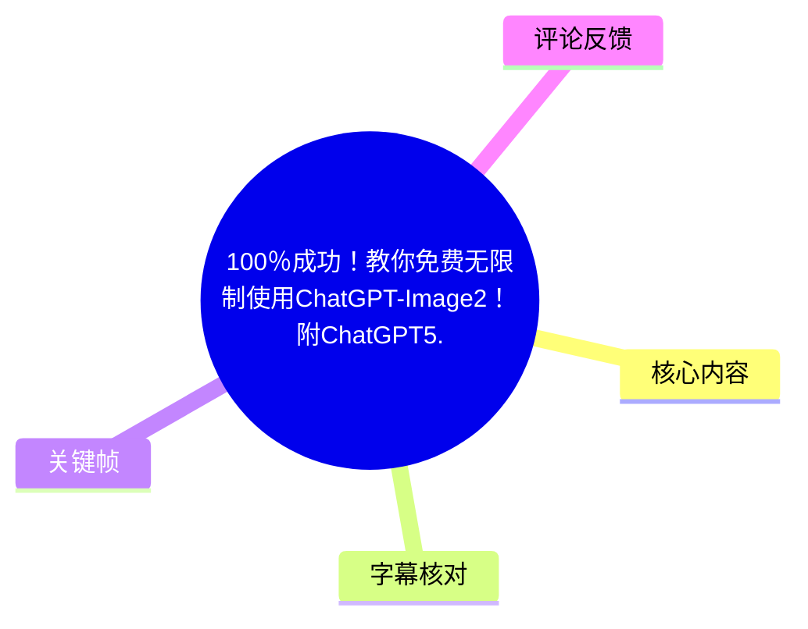
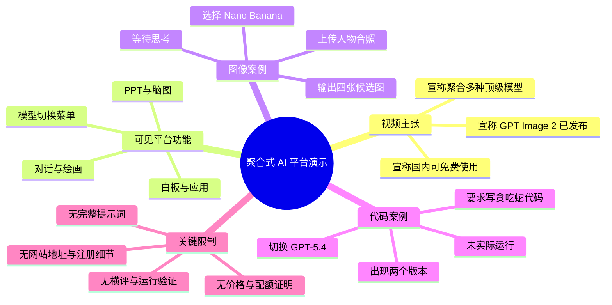
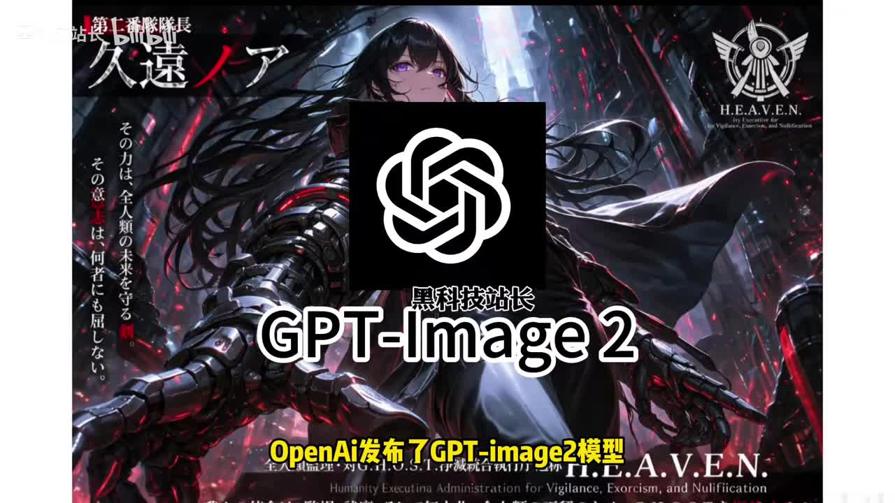
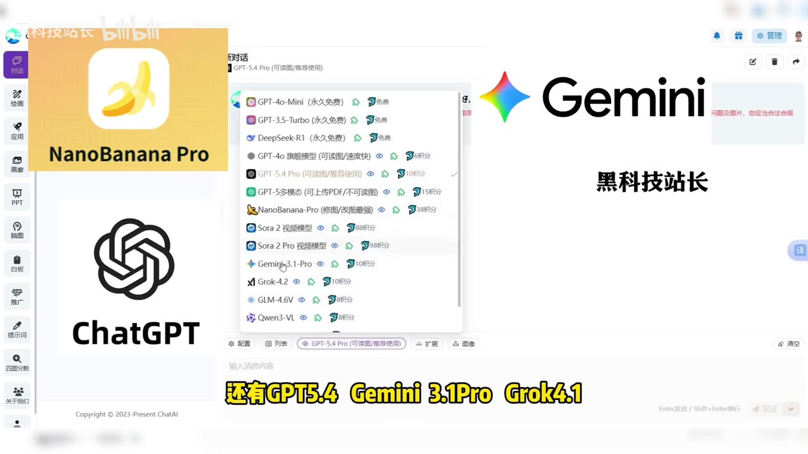

# 100％成功！教你免费无限制使用ChatGPT-Image2！(附ChatGPT5.6)

> 来源：[Bilibili 视频](https://www.bilibili.com/video/BV1cXobBfETp) 
> UP 主：黑科技站长｜视频时长：01:30｜分辨率：1920×1080｜合集：AIcode

## 小结

视频以一款名为 **ChatAI** 的聚合式 AI 服务界面为例，宣传其可在国内使用多种模型，并用两个简短案例展示图像生成/编辑与代码生成。视频标题中的“ChatGPT-Image2”“100% 成功”“免费无限制”属于作者和页面的宣传表述；视频本身未提供网站地址、注册流程、价格规则、调用配额、模型服务条款或可复现的完整提示词，因此不能据此验证这些承诺。

作者在 [00:22](https://www.bilibili.com/video/BV1cXobBfETp?t=22) 起称 OpenAI 发布了“GPT Image 2”，并评价其图像编辑、细节处理能力很强，且在人像、海报、UI 设计等美学任务上“远超 Nano Banana”。这是视频内的主观判断，未展示横向对比测试、评价指标或官方发布材料，不应视为已证实的能力排序。

演示中的平台界面显示“对话、绘画、应用、画廊、PPT、脑图、白板、推广词、四图分割”等入口；模型下拉菜单可见 GPT-5.4 Pro、GPT-5 多模态、NanoBanana-Pro、Sora 2、Gemini 3.1-Pro、Grok-4.2、GLM-4.6V、Qwen3-VL 等名称。界面存在不等的“积分”标记，说明至少从画面可见信息看，并非所有模型都是无条件、零成本使用。

操作层面，视频只完整呈现了“选择 Nano Banana、上传图片、等待生成结果”以及“切换 GPT-5.4、要求编写贪吃蛇游戏代码”的大致流程。图像案例最终出现四个候选结果，代码案例出现两个版本及运行方式说明，但作者明确没有运行代码，因此功能可运行性、生成代码质量与稳定性均未在视频内验证。

该内容适合想快速了解“多模型聚合平台演示形式”的读者。若准备实际使用，应优先核验平台主体、隐私政策、图片与聊天记录的保存方式、积分扣费规则、模型名称与实际底层 API 的对应关系，以及是否符合各官方模型的服务条款。

## 思维导图

## 目录

- [开场主张与信息边界](#开场主张与信息边界)
- [聚合平台界面与模型清单](#聚合平台界面与模型清单)
- [图像生成案例：Nano Banana](#图像生成案例nano-banana)
- [代码生成案例：GPT-5-4 与贪吃蛇](#代码生成案例gpt-5-4-与贪吃蛇)
- [可复用操作步骤与参数](#可复用操作步骤与参数)
- [结论、限制与时效性](#结论限制与时效性)
- [字幕比对](#字幕比对)
- [评论分析](#评论分析)
- [处理记录](#处理记录)

## 开场主张与信息边界

### 作者对 “GPT Image 2” 的评价 [00:22](https://www.bilibili.com/video/BV1cXobBfETp?t=22)

视频在有语音内容前先以“GPT-Image 2”标题和 OpenAI 标志进行视觉开场，随后作者称“就在昨天，OpenAI 发布了 GPT Image 2 模型”，并将其描述为图像编辑、细节处理达到很高水平的模型。作者特别点到人像、海报、UI 设计等任务，并声称其美学表现优于 Nano Banana。

这里需要区分三层信息：

1. **视频可确认内容**：作者确实作出了上述发布与能力评价；开场画面写有“OpenAI发布了GPT-Image2模型”。
2. **视频未提供的证据**：没有 OpenAI 官方公告链接、模型卡、发布时间、版本号、API 文档、样张参数或同提示词对比。
3. **整理结论**：该段适合作为“作者推荐理由”，不构成对模型发布事实或“远超”结论的独立验证。

> 图：画面以 OpenAI 标志、“GPT-Image 2”及“OpenAI发布了GPT-Image2模型”字幕呈现视频的核心宣传主题。它有助于辨别：这是视频的开场主张，而不是平台实际操作界面或官方公告页面。

### 宣传口径与实际可见信息 [00:22](https://www.bilibili.com/video/BV1cXobBfETp?t=22)

作者称将分享“官方原版、国内免费使用”的“宝藏站点”，并在视频描述中进一步写有“无须魔法”“永不封号”“会话隔离”“个性化尊享换车功能”等卖点。需要注意：

- 视频画面没有展示可访问的网址、域名、账户套餐页或支付/积分规则页；
- “官方原版”没有展示与各模型官方服务的授权关系或 API 来源；
- “免费无限制”与画面中多个模型旁的“积分”数字存在待澄清之处；
- “永不封号”是绝对化承诺，视频没有提供可验证的保障机制；
- “会话隔离”涉及数据安全与隐私，应以实际隐私政策、数据处理协议和账户权限设计为准。

因此，视频能说明“作者正在演示一个自称聚合多模型的平台”，但不能单凭该短片确认服务的长期可用性、免费范围或数据处理方式。

## 聚合平台界面与模型清单

### ChatAI 工作区及功能入口 [00:25](https://www.bilibili.com/video/BV1cXobBfETp?t=25)

画面显示的服务名称为 **ChatAI**。左侧栏可辨识的入口包括：

| 可见入口 | 画面含义 | 视频是否实际演示 |
| --- | --- | --- |
| 对话 | 创建/进行聊天会话 | 是，后续用于模型切换与代码请求 |
| 绘画 | 图像相关功能入口 | 间接涉及，作者用图像案例演示 |
| 应用 | 应用工具入口 | 否 |
| 画廊 | 图像作品/素材相关入口 | 否 |
| PPT | 演示文稿制作 | 否，仅被作者口述提及 |
| 脑图 | 思维导图功能 | 否，仅被作者口述提及 |
| 白板 | 白板工具 | 否 |
| 推广词 | 文案/推广词工具 | 否 |
| 四图分割 | 图像处理类工具 | 否 |
| 关于我们 | 平台说明入口 | 否 |

作者口述平台还可用于 PPT 制作、思维导图、写作，以及科研、工作和学习。上述功能在视频中只作为介绍，没有呈现输入、输出或质量验证。

> 图：此帧展示视频实际使用的 ChatAI 对话工作区、左侧功能菜单及模型选择区域；画面中央的“官方原版、国内免费使用”为后期叠加宣传文案。图片价值在于区分“界面中真实可见的功能入口”与“尚未由界面证实的营销承诺”。

### 可见模型菜单与积分提示 [00:25](https://www.bilibili.com/video/BV1cXobBfETp?t=25)

作者称主页不只有 Nano Banana，还包括“GPT 5.4、Gemini 3.1 Pro、Grok 4.1 绘画版、Midjourney”等。ASR 对若干英文模型名识别不稳定，画面下拉菜单可帮助校正其中一部分名称。菜单中可见：

- GPT-4o-Mini（标记“永久免费”）；
- GPT-3.5-Turbo（标记“永久免费”）；
- DeepSeek-R1（标记“永久免费”）；
- GPT-4o 旗舰模型；
- GPT-5.4 Pro；
- GPT-5 多模态（可上传 PDF/不可绘图）；
- NanoBanana-Pro（修图/改图最强）；
- Sora 2 视频模型；
- Sora 2 Pro 视频模型；
- Gemini 3.1-Pro；
- Grok-4.2；
- GLM-4.6V；
- Qwen3-VL。

其中，除前三项“永久免费”文字外，多个项目右侧可见“6积分、10积分、15积分、38积分、88积分、98积分”等标示。由于视频未解释“积分”的获取方式、每次请求实际消耗、免费额度或充值价格，不能把“有积分数字”等同于明确收费，也不能把标题中的“免费无限制”视为已经被演示证实。

此外，作者口述的“Midjourney”和“Grok 4.1 绘画版”与该帧可见的“Grok-4.2”等名称并不完全一致；菜单是截屏瞬间可见状态，不能代表平台的完整或长期模型列表。

> 图：下拉菜单是本视频中核对模型名称最有价值的画面依据。除模型名外，它还显示大量项目带有积分数字，提醒使用者对“免费”“无限制”等宣传语保持审慎，并在实际使用前查看规则。

## 图像生成案例：Nano Banana

### 从上传人物合照到等待结果 [00:25](https://www.bilibili.com/video/BV1cXobBfETp?t=25)

作者说明其操作是：切换到 Nano Banana，上传“沈腾和马斯克的合照”，随后平台进入“思考模式”，并让观众稍等。此处可复原的操作仅包括模型选择、上传图片和等待；视频没有清晰展示：

- 上传文件的格式、尺寸或大小限制；
- 是否附加了文字提示词；
- 所谓“沈腾和马斯克的合照”的原始图片；
- 生成模式、比例、分辨率、迭代次数或种子；
- 等待时长的完整计时与网络条件。

因此，不能将该案例写成可精确复现的提示词教程，也不能据此得出固定的响应速度结论。

### 四张候选图及作者的效果判断 [00:50](https://www.bilibili.com/video/BV1cXobBfETp?t=50)

在作者说“好，出来了”之后，画面展示九宫格样式的结果预览：其中部分格子带有约 1.08s、1.95s、2.83s、3.71s、4.58s、5.46s 等时长标注，内容为一位人物在钢琴前演奏的连续画面。作者在 [00:53](https://www.bilibili.com/video/BV1cXobBfETp?t=53) 称“直接出了四张图出来供我们选择”，并补充下面三张仍在加载，主观评价效果“非常自然细腻”。

画面中出现的时间标记与连续画面形态，可能意味着此处输出含有动态或分镜式素材；但视频没有解释结果类型、生成模式及“图”和“视频帧/分镜”的关系，故不宜据此断言 Nano Banana 生成了何种格式文件。能够确定的是：作者展示了多张候选视觉结果，并认为其适合有画图、改图需求的人群。

> 图：该帧对应作者所说的结果输出阶段，能直观看到多格候选内容以及部分格子的秒数标记。它的价值在于保留作者评价“自然细腻”所对应的视觉上下文，同时也显示结果并非单一静态图片的简单展示。

## 代码生成案例：GPT-5.4 与贪吃蛇

### 提出代码任务 [01:08](https://www.bilibili.com/video/BV1cXobBfETp?t=68)

完成图像案例介绍后，作者称切换至“GPT5.4”，让模型“写一个贪吃蛇的游戏代码”。这构成视频第二个案例，但没有展示完整自然语言需求，例如：

- 目标语言、框架和运行环境；
- 是否要求 GUI、网页或终端版本；
- 操作方式、计分规则、边界碰撞规则；
- 依赖安装要求；
- 输出代码全文。

因此，本段只足以说明作者向平台提交了“贪吃蛇游戏代码”这一类任务，不足以复现或审核代码实现。

### 输出版本与未执行的关键限制 [01:13](https://www.bilibili.com/video/BV1cXobBfETp?t=73)

作者在 [01:13](https://www.bilibili.com/video/BV1cXobBfETp?t=73) 表示结果很快出现，并在 [01:20](https://www.bilibili.com/video/BV1cXobBfETp?t=80) 说系统提供了两个版本可选、运行方式也写了出来。作者随后明确表示“不浪费时间运行”。

由此可得：

- **已演示**：模型对代码任务作出了输出，作者声称输出包含两种版本及运行说明。
- **未演示**：代码是否完整、能否安装依赖、能否运行、是否包含逻辑错误、性能如何，以及两个版本的具体差异。
- **实践建议**：面对生成代码，应在隔离环境中阅读依赖与权限说明，再运行并进行功能测试；不能因“有运行方式”就跳过验证。

## 可复用操作步骤与参数

### 图像任务的最小流程 [00:25](https://www.bilibili.com/video/BV1cXobBfETp?t=25)

依据视频顺序，可整理为以下最小操作链路：

1. 在 ChatAI 的对话/模型界面打开模型选择菜单。
2. 选择作者称为 **Nano Banana** 的图像模型；画面菜单中相近名称显示为 **NanoBanana-Pro**，两者是否为同一具体版本未获视频解释。
3. 上传一张图片。作者口述案例为“沈腾和马斯克的合照”。
4. 等待平台处理；作者称界面会进入“思考模式”。
5. 查看输出候选结果，等待尚未加载完成的内容。
6. 根据需求选择候选结果；视频未继续展示下载、再次编辑或导出操作。

**视频没有给出的关键参数**：提示词、负面提示词、比例、输出尺寸、清晰度、参考图权重、生成数量设置、文件格式与下载权限。实际操作时应以平台实时界面为准，并注意人物肖像、版权图片的使用授权。

### 代码任务的最小流程 [01:08](https://www.bilibili.com/video/BV1cXobBfETp?t=68)

1. 切换至作者称为 **GPT-5.4** 的模型；画面菜单可见名称为 **GPT-5.4 Pro**。
2. 输入“写一个贪吃蛇的游戏代码”这一类需求。
3. 等待模型生成内容。
4. 若界面提供多个版本，逐项比较技术栈、依赖、文件结构与运行说明。
5. 在本地或隔离环境中执行、调试与测试。

视频在第 5 步之前结束，未运行程序。因此，运行环境、命令、依赖版本与测试结果均不可从素材中补全。

## 结论、限制与时效性

### 可迁移经验 [01:20](https://www.bilibili.com/video/BV1cXobBfETp?t=80)

本视频最有实际参考价值的不是“某平台免费无限制”的结论，而是一个通用工作流：在聚合平台中按任务切换模型，用图像模型处理图片任务，用通用/代码模型生成程序草案，再由人工筛选候选结果和验证最终输出。对于图像生成，应检查角色、文字、手部、细节一致性以及版权/肖像授权；对于代码生成，应检查依赖、错误处理、边界条件和实际运行结果。

### 核心限制

- **宣传无法独立验证**：视频未给出站点 URL、账号资格、免费额度、价格、积分规则或官方授权证明。
- **模型标识存在不确定性**：口述名、视频标题与画面菜单名有差异，例如“GPT5.4”与“GPT-5.4 Pro”、“Nano Banana”与“NanoBanana-Pro”。
- **测试样本过少**：图像与代码各仅一个简短案例，且没有公开完整输入与标准化对比。
- **代码未运行**：不能从视频判断贪吃蛇代码是否可执行。
- **结果类型未解释**：图像案例中多格结果含秒数标记，具体是图片、动态内容还是分镜展示未得到说明。
- **隐私与合规未验证**：上传的图片、聊天记录、代码及个人数据是否保存、如何处理，视频未展示。

### 时效性说明

视频时长仅 90 秒，所显示的模型清单、积分提示、功能入口和营销文案均可能随平台运营策略、上游模型可用性、地区政策或版本更新而变化。元数据发布时间按 Unix 时间戳换算为 **2026-04-23 01:24:36 UTC**；本文仅记录该视频及本次抓取素材中的状态，不将其外推为当前服务承诺。使用前应以平台实时页面、服务协议和模型官方文档为准。

## 字幕比对

| 字幕来源 | 完整性 | 专有名词 | 时间轴 | 主要问题 |
| --- | --- | --- | --- | --- |
| Bilibili 站内字幕 | 未提供可用字幕，无法比对文本 | 无法评价 | 无可用分段 | 素材明确标注“未提供可用站内字幕” |
| 本次 ASR 字幕 | 覆盖 22.80–89.34 秒，共 6 段；诊断语音覆盖率 56.53% | 部分模型名误识别或断词 | 可用，带毫秒级 SRT 时间段 | 每段过长、句读缺失；“GemNet”“ProGraph”“Mit Journey”等识别不稳定；开场无语音段未被文本覆盖 |

本次 ASR 使用 `medium` 模型，语言识别为中文（置信度 `0.99658203125`），音频时长约 `89.51` 秒，ASR 具备时间戳；诊断中**没有** `noAudioStream=true` 标记，说明源视频存在音轨，未发生“无音轨”情形。

由于站内字幕不可用，正文以本次 ASR 的真实 SRT 起止时间制作时间轴，并以关键帧中的模型下拉菜单与开场文字做有限校正。重要校正如下：

| ASR 原文 | 画面/上下文校正 | 说明 |
| --- | --- | --- |
| “GemNet 3.1” | Gemini 3.1-Pro | 模型菜单可见 “Gemini 3.1-Pro” |
| “ProGraph 4.1绘画版” | 口述疑为 Grok 4.1 绘画版 | 仅能根据语境推断；画面实际可见的是 Grok-4.2，不能强行等同 |
| “Mit Journey” | Midjourney | 作者语境中列举的绘图模型名 |
| “GPT5.4” | GPT-5.4 / 菜单显示 GPT-5.4 Pro | 口述与界面名称不完全一致，正文保留差异 |
| “Nano banana” | Nano Banana / 菜单显示 NanoBanana-Pro | 口述名称与菜单名称存在版本级差异 |
| “下面的三张囿还在加载中” | “下面的三张……还在加载中” | “囿”为 ASR 误识别，不影响核心语义 |

## 评论分析

以下仅处理可获取的热评前三条；评论是用户体验表达，不构成对平台、模型或收费规则的验证。

| 排名 | 用户 | 获赞 | 评论概括 | 可提供的信息与可信度 |
| --- | --- | ---: | --- | --- |
| 1 | 泉琦 | 307 | “好用”并附表情 | 表达正向使用感受，但没有说明所用功能、账号条件、使用时间、价格或结果，无法验证“免费无限制”等主张。 |
| 2 | 鸡枞山伯爵 | 186 | “好用”并附支持表情 | 同样是正面态度，缺乏具体案例、截图或可复现路径，信息增量有限。 |
| 3 | 红楼一梦万般愁 | 167 | 仅发送“笑哭”表情 | 未表达明确观点，不能据此推断赞同、质疑或实际使用情况。 |

三条热评均未讨论模型真实性、积分扣费、隐私保护、运行成功率或平台稳定性，因此没有形成可用于验证视频宣传的实质性补充证据。

## 处理记录

- **Worker ID**：`worker-mrj0wjed-b0c290ad`
- **模型**：`gpt-5.6-terra`
- **工具与素材**：视频元数据、`asr/asr-result.json`、`asr/transcript.srt`、关键帧目录 `frames/`、热评文件 `comments/comments.json`。
- **ASR 检查结果**：已检查本次 ASR；识别语言为中文，存在可用音轨和带时间戳的 6 个语音段，未标记 `noAudioStream=true`。
- **字幕选择**：站内字幕未提供可用文本，故采用本次 ASR 的 SRT 时间轴；对模型专名仅依据关键帧可见菜单和上下文进行标注式校正，不将不确定项写成确定事实。
- **关键帧选择依据**：
  - `frames/frame-001.jpg`：保留“GPT-Image 2 / OpenAI 发布”开场主张；
  - `frames/frame-002.jpg`：对应图像案例的多格候选输出；
  - `frames/frame-003.jpg`：展示 ChatAI 工作区及左侧功能入口；
  - `frames/frame-004.jpg`：展示模型清单和积分标识，用于核对 ASR 专名及识别限制。
- **缓存清理**：素材清单未提供可核验的缓存清理执行记录；本文未宣称已完成缓存删除。
- **未解决问题**：网站实际地址与运营主体、模型的官方授权/底层调用关系、免费与积分规则、完整提示词、图像输出格式、代码全文及运行结果，均未在给定素材中披露。
