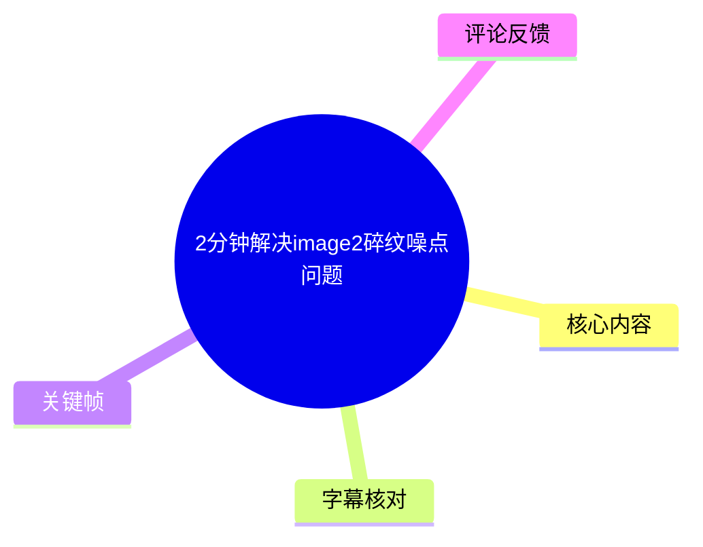
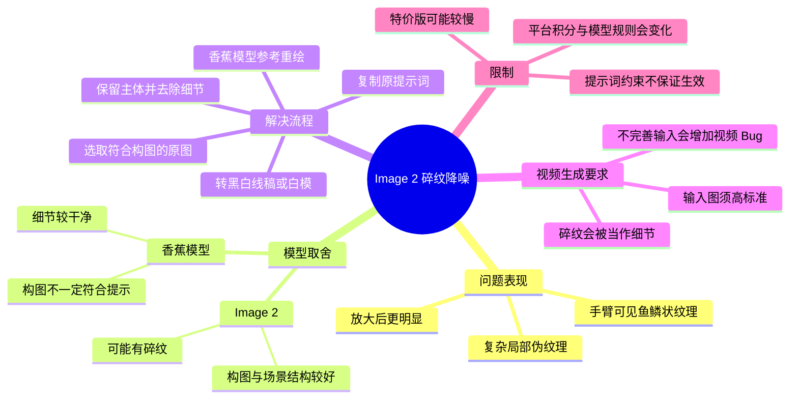
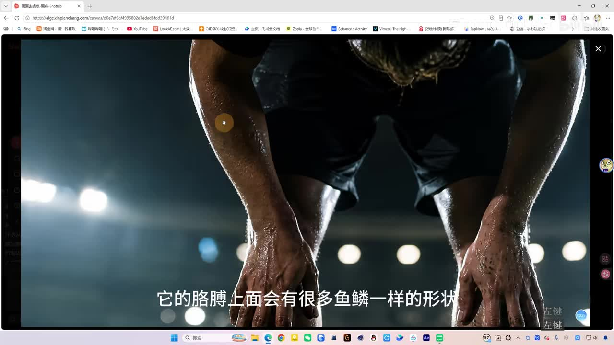
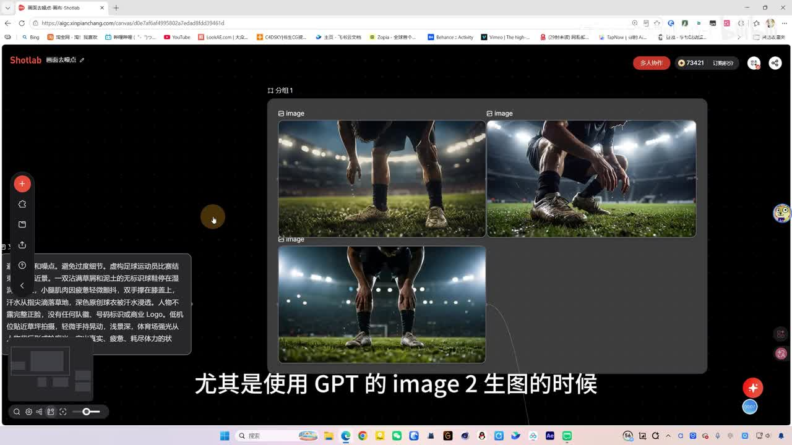
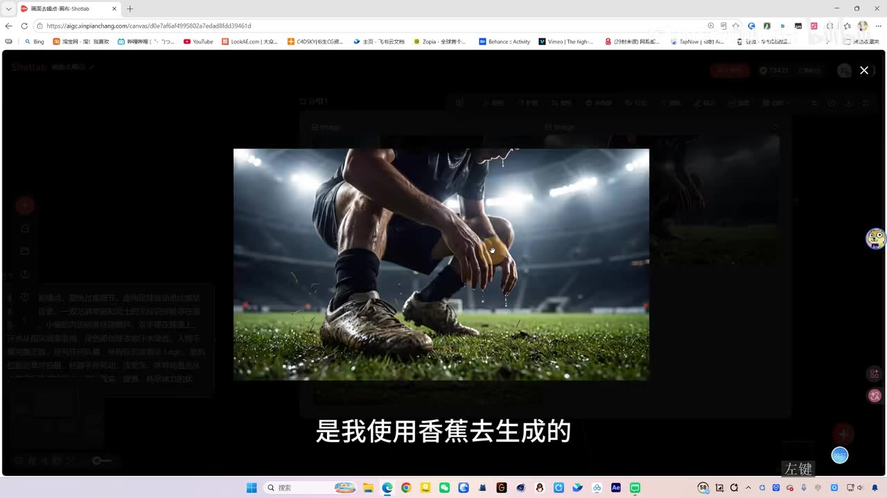
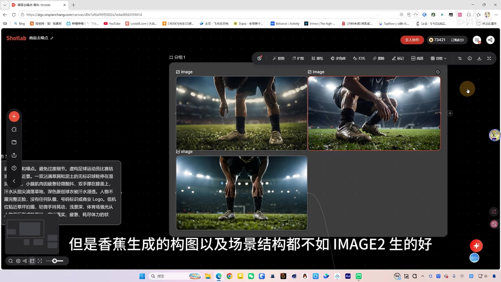

# 2分钟解决image2碎纹噪点问题

> 来源：[Bilibili 视频](https://www.bilibili.com/video/BV1wLKn6LEnu)<br>
> UP 主：东阳AIMG动画｜发布时间：2026-07-17｜视频时长：02:51｜平台：新片场 Shotlab  
> 数据抓取时可见：5,316 播放、477 收藏、125 点赞、13 回复。该互动数据具有抓取时效性。

## 小结

视频讨论 GPT 的 Image 2 在生图时可能出现的“碎纹/噪点”问题：画面局部会呈现不自然、类似鱼鳞的密集纹理。UP 主以足球运动员图像为例，指出人物手臂等区域在放大后尤其容易暴露这类伪细节。

核心经验不是单纯换模型，而是让不同模型分工：Image 2 用于取得相对符合提示词的构图、人物姿势和场景结构；“香蕉”模型则用于在后续重绘中改善细节纹理。视频中的具体做法是，先把存在碎纹的 Image 2 图转为保留主体、去掉复杂细节的黑白线稿；也可以改为灰模、白模或三维白模；再把原提示词复制回来，用香蕉模型参考该简化图重新生成。

UP 主展示的提示词中虽已加入“避免碎纹和噪点”“避免过度细节”等约束，但仍出现碎纹。因此，视频的实际结论是：负面或限制性描述未必能稳定解决问题，结果还受图像内容和模型本身影响，不能仅靠提示词保证。

该流程尤其适合需要把静态图继续作为视频生成参考图的场景。UP 主认为，如果将碎纹很多的图直接送入后续视频模型，模型可能把伪纹理当成需要保留的细节，导致视频画面难以观看、Bug 更多；因此要把输入图的质量标准提高到尽可能完善。

视频使用的平台为 Shotlab，UP 主称其中有“香蕉模型特价版”，非特价版消耗为 **220 积分**；特价版价格更低但有时较慢。价格、积分规则、模型名称和可用性都可能随平台更新而变化，本文不将其视为长期固定参数。

## 思维导图





## 目录

- [问题背景：碎纹是什么](#问题背景碎纹是什么)
- [模型取舍：Image 2 与香蕉模型](#模型取舍image-2-与香蕉模型)
- [提示词约束的作用与局限](#提示词约束的作用与局限)
- [操作流程：线稿中转后重绘](#操作流程线稿中转后重绘)
- [平台、积分与结果检查](#平台积分与结果检查)
- [用于视频生成时的质量标准](#用于视频生成时的质量标准)
- [结论与限制](#结论与限制)
- [字幕比对](#字幕比对)
- [评论分析](#评论分析)
- [处理记录](#处理记录)

## 问题背景：碎纹是什么 [00:00:37](https://www.bilibili.com/video/BV1wLKn6LEnu?t=37)

UP 主将生成图中“非常复杂的细节纹理”称为“碎纹”。视频并未给出严格的技术定义，而是通过视觉现象说明：足球运动员图像放大后，手臂表面出现了类似鱼鳞的重复颗粒/纹理形状。这类纹理看似有细节，实际并不符合人体皮肤应有的结构，因此被视为需要处理的噪点或伪细节。

视频把问题归因于模型本身的生成表现，而不是某个已被验证的单一参数错误。这里应理解为 UP 主基于实际出图的经验判断，不等同于对 Image 2 底层机制的技术定论。



> 图：该关键帧直接呈现 UP 主所说的“鱼鳞一样的形状”所在区域。它的价值在于把“碎纹”从抽象描述落实为应在局部放大时检查的视觉问题：人体皮肤、四肢边缘和高频细节区域是重点检查位置。

## 模型取舍：Image 2 与香蕉模型 [00:00:37](https://www.bilibili.com/video/BV1wLKn6LEnu?t=37)

视频并未把某一模型描述为全面优于另一模型，而是提出了明确的取舍关系：

| 项目 | Image 2 | 香蕉模型 |
| --- | --- | --- |
| UP 主观察到的优势 | 构图、场景结构相对更好，更可能满足画面要求 | 细节保留较干净，不易出现画面中所示的鱼鳞状碎纹 |
| UP 主观察到的不足 | 可能产生复杂、异常的碎纹 | 构图和场景结构不如 Image 2；前两张示例也没有完全按提示词生成 |
| 建议角色 | 先获得符合动作、构图、场景的原始方案 | 以简化后的结构图为参考进行重绘、清理纹理 |

画面中展示了多张足球运动员图。UP 主表示，其中由香蕉模型生成的图在局部细节方面较好，但构图和场景结构不如 Image 2；而符合“人物双手撑在膝盖上”这一动作要求的，是一张 Image 2 图，故后续需要处理该图的碎纹，而不是直接放弃它。



> 图：该关键帧展示同一任务下多张图的并列比较，以及左侧提示词区域。它说明工作流的起点是从候选图中选择“结构与动作更符合需求”的图，而非仅凭局部纹理决定取舍。



> 图：该帧展示 UP 主认为细节较好的香蕉模型结果。它的价值在于与前述局部碎纹图形成对照：本流程追求的不是增加锐化，而是得到更自然、可作为后续视频参考的纹理。

## 提示词约束的作用与局限 [00:01:01](https://www.bilibili.com/video/BV1wLKn6LEnu?t=61)

UP 主提到，自己的提示词通常会加入以下约束：

- 避免碎纹和噪点；
- 避免过度细节。

但他同时指出，加入这些文字后，图片“照样还是有碎纹”，并明确表示不确定这类措辞“加还是不加有没有关系”，认为最终仍主要取决于内容及实际生成结果。

因此，视频提供的可执行经验是：

1. 可以保留“避免碎纹和噪点”“避免过度细节”作为首轮约束；
2. 不应把它们视为稳定的修复手段；
3. 对于姿势、构图等硬性要求，应逐张检查结果是否符合；
4. 一旦只有带碎纹的候选图满足构图要求，应进入后续的结构简化与重绘步骤。

画面里可辨识的提示词还包含足球运动员、泥泞草地、雨水、冷色氛围等内容；但视频没有完整、可复制的文本提示词清单，因此不能据此还原完整 prompt。



> 图：该帧显示多张候选结果及左侧提示词文本框，画面字幕强调“香蕉生成的构图以及场景结构都不如 Image2 生得好”。其价值在于说明选择原图时需要同时核对提示词要求与画面结构，而非只看清晰度。

## 操作流程：线稿中转后重绘 [00:01:25](https://www.bilibili.com/video/BV1wLKn6LEnu?t=85)

视频给出的修复方法可按以下顺序执行：

1. **确定原图**  
   从 Image 2 的生成结果中选择主体、构图与目标动作最符合要求的一张，即使它带有碎纹也可作为结构来源。

2. **让 Image 2 处理成简化结构图**  
   向 Image 2 提出要求：**保留主体、去掉细节、转变成黑白线稿**。  
   UP 主表示也可采用以下替代形式：
   - 灰模；
   - 白模；
   - 三维白模。  
   这些形式的共同点是保留主体轮廓、动作与构图关系，同时压低原图中容易被继承的复杂纹理。

3. **将简化后的图作为新的参考图**  
   视频特别强调“**一定是使用这张图再去生图**”：后续重绘所参考的应是黑白线稿/白模等简化版本，而不是原来满是碎纹的彩图。

4. **复制原提示词重新生成**  
   将此前的提示词重新复制到生成区域，使重绘结果继承原来的主题、动作及场景要求。

5. **切换香蕉模型，并让其参考结构图生成**  
   用香蕉模型参考黑白线稿，按原提示词重绘。该步骤的目标是保留简化图提供的主体与构图约束，同时由香蕉模型重新生成更干净的视觉细节。

可以把这个方法概括为：

```text
Image 2 原始出图（结构较符合，但存在碎纹）
  → 保留主体、去细节
  → 黑白线稿 / 灰模 / 白模 / 三维白模
  → 复制原提示词
  → 香蕉模型参考重绘
  → 检查局部纹理后作为视频参考图
```

需要注意，视频没有展示每一步的完整界面参数、参考图权重、分辨率、生成次数或随机种子。因此，上述内容是视频明确呈现的流程，而不是可保证复现同一画面的完整配置方案。

## 平台、积分与结果检查 [00:01:49](https://www.bilibili.com/video/BV1wLKn6LEnu?t=109)

UP 主在视频中使用 **Shotlab（新片场 Shotlab）**，并称其中有“香蕉模型特价版”。他提供的成本与速度信息如下：

| 项目 | 视频中的说法 |
| --- | --- |
| 非特价版积分 | 220 积分 |
| 特价版 | “非常便宜”，但未给出具体积分数 |
| 特价版速度 | 有时会较慢 |
| UP 主日常选择 | 基本使用特价版 |
| 判断依据 | 认为整体仍“非常划算” |

这些是 UP 主在录制时的界面与使用经验。由于平台套餐、积分、模型入口、特价活动和排队速度可能改变，实际使用前应以 Shotlab 当下页面为准。

重绘完成后，UP 主建议再次放大检查细节。其示例结果中，原本类似鱼鳞的质感已不明显，UP 主认为该质量已足以作为生成视频时的参考图片。这里的“满意”是创作者的主观质量阈值，实际项目仍应按人物一致性、材质真实感、边缘完整性、肢体结构和目标视频模型的表现分别验收。

## 用于视频生成时的质量标准 [00:02:14](https://www.bilibili.com/video/BV1wLKn6LEnu?t=134)

UP 主将静态图质量与后续视频质量直接关联：如果把碎纹特别多的图用于生成视频，后续模型会将这些异常纹理当作有意义的“细节”进行延续，最终视频可能“没法看”。

视频中提到的后续视频模型名称，ASR 识别为“cdance”，由于没有站内字幕且画面未提供足够清晰的模型名称证据，本文保留 ASR 的不确定写法，不将其扩写或等同于特定产品。

UP 主的经验结论是“高标准要求”：先把图做得尽可能完美；如果输入图本身并不完美，生成视频时的 Bug 会更多。可将其转化为提交视频生成前的检查清单：

- 主体动作、姿势是否符合目标；
- 人体皮肤、手臂、面部等区域是否有重复碎纹；
- 草地、衣物、雨滴等高频纹理是否出现不自然的颗粒或鳞片感；
- 肢体、手指、鞋子和边缘轮廓是否完整；
- 是否已用放大视图检查，而非仅在缩略图尺度判断；
- 若图像仍有异常，是否先用线稿/白模中转重绘，而非直接投入视频生成。

## 结论与限制 [00:02:38](https://www.bilibili.com/video/BV1wLKn6LEnu?t=158)

这是一套“结构优先、纹理后处理”的多模型工作流。其可迁移之处在于：当模型 A 更擅长构图、模型 B 更擅长干净纹理时，可以先从 A 获取可用结构，再通过线稿、白模等低细节中间表示隔离伪纹理，最后让 B 在结构约束下重绘。

不过，以下限制需要保留：

- 视频仅以足球运动员案例说明效果，未提供多题材、多轮次的对照统计，不能据此推导所有题材都同样有效。
- “碎纹”是基于视觉表现的工作描述，不是视频中被严格定义或量化的指标。
- 提示词中加入“避免碎纹和噪点”“避免过度细节”并不能保证消除碎纹，UP 主本人也不确定其实际影响。
- 黑白线稿、灰模、白模、三维白模都被列为可选中间形式，但视频未比较它们的适用条件与效果差异。
- 香蕉模型虽被认为更适合清理示例中的纹理，但也可能牺牲构图、场景结构或其他未在视频中展示的特征。
- Shotlab 的积分成本、特价版入口与生成速度均具时效性；“220 积分”仅是视频中的非特价版描述。
- 本次 ASR 的时间分段存在明显异常，正文时间轴严格取自 ASR/SRT 的真实起始时间，但建议读者播放时以画面内容为准进行复核。

## 字幕比对

| 字幕来源 | 完整性 | 专有名词 | 时间轴 | 主要问题 |
| --- | --- | --- | --- | --- |
| Bilibili 站内字幕 | 未提供可用站内字幕，无法比较正文覆盖度 | 无法核验 | 无可用时间轴 | 本任务素材中没有可用站内字幕文件 |
| 本次 ASR 字幕 | 覆盖 7 段，诊断语音覆盖约 77.04%，首段始于 00:00:36.760 | `image2`、`Shotlab`、`香蕉`等存在错听或同音字；“cdance”无法确认 | 有时间戳，但分段长度明显异常：第 1 段仅 0.44 秒却含长句；SRT 最后结束于 00:02:47.760，略超音频诊断时长 170.04 秒 | 存在“生囿/碎文/香蚝/shortlab/黑白限告”等识别错误，且时间定位精度有限 |

本次素材的 `asr-result.json` **未标记** `noAudioStream=true`，且提供了中文 ASR 诊断：识别语言为 `zh`、语言置信度约 `0.9980`、CUDA `float16` 推理。因此可确认源视频存在可识别音轨，不能将字幕缺失归因为无音轨。

最终正文采用 **本次 ASR 的时间戳** 作为章节链接依据，并结合标题、视频描述、关键帧画面和上下文对术语作保守校正：

- ASR 的“image2”统一写为 **Image 2**，与标题标签 `image2` 一致；
- ASR 的“shortlab”校正为 **Shotlab**，与视频描述“新片场shotlab”一致；
- ASR 多处“香蚝、香蟹、香蠢”等统一写为视频所称的 **香蕉模型**；
- ASR 的“碎文”按上下文写为 **碎纹**；
- ASR 的“黑白限告”按上下文写为 **黑白线稿**；
- 对无法经素材明确校验的“cdance”，不擅自改写为具体模型名称。

## 评论分析

以下仅分析本次可获取的热评前三条，均属于用户经验或观点，不作为已验证事实。

1. **爱收藏的小朋友（9 赞）**  
   该评论补充称，树枝、树叶、草地、积雪等本身纹理繁杂的场景，Image 2 的碎纹率可能较高。评论给出两步替代思路：先通过提示词约束细节表达，再将相对清楚、没有严重崩坏的图送入“即梦画布”的“智能超清”，使用默认配置改善清晰度。  
   其价值在于补充了“超清”路线，与视频的“线稿中转 + 香蕉重绘”路线不同；但评论未提供前后样图、参数、成功率或适用边界，且“提高像素即可解决”的效果不能视为普遍成立。

2. **宗式讲义（1 赞）**  
   评论认为复杂、层次丰富的画面不适合 Image 2，简单或单一元素则效果较好，并将其归因于训练集和注意力机制有限。  
   这与视频中“复杂细节易出现问题、模型没有全能表现”的实践观察方向一致；但“训练集和注意力机制”属于评论者的机制解释，视频没有提供技术证据，不能据此做因果定论。

3. **火星最强指挥官（5 赞）**  
   评论认可“转白模或线稿再用香蕉”的路线，同时提出例外：若生成人脸，香蕉可能不如 Image 2，并以“香蕉脸的识别度太高”表达其人脸风格/一致性担忧。  
   该评论为流程补充了重要的适用边界：人物肖像尤其是人脸任务，可能需要额外评估身份感、脸部特征与风格偏移。但这只是单条使用反馈，视频本身没有做人脸案例，尚无法确认其普遍性。

## 处理记录

- Worker ID：`worker-mrj0www4-e8d79408`
- 模型：`gpt-5.6-terra`
- 调用工具与素材：Bilibili 元数据、视频时长与页面信息、音频 ASR 结果（`medium` 模型，CUDA / `float16`）、ASR SRT、12 张关键帧路径清单、热评 JSON。
- 使用的应用工具：素材提取工作流已输出 `merged.mp4`、`audio/audio.wav`、`asr/transcript.srt`、`asr/asr-result.json`、`frames/` 与 `comments/comments.json`；本文仅依据所给产物整理。
- 字幕选择：站内字幕未提供可用文件；已检查本次 ASR，确认存在音频流且 ASR 带时间戳。正文以 ASR 时间戳建立链接，并用元数据、关键帧和语境谨慎修正可明确识别的专有名词。
- 关键帧选择依据：选用 `frames/frame-001.jpg` 至 `frames/frame-004.jpg`，因为所提供画面分别能支撑候选图比较、手臂碎纹局部、香蕉模型示例和 Shotlab 提示词/选图界面；其余关键帧仅提供路径、未提供可核验画面内容，故未强行引用。
- 缓存清理：本次仅获得整理任务的静态素材清单，未执行本地文件写入、下载或缓存清理操作；无可报告的缓存清理结果。
- 未解决问题：ASR 分段时长与文本量不匹配，且 SRT 结束时间略超音频诊断时长；后续视频模型名称被识别为“cdance”但无法由现有素材确认；Shotlab 当前积分与模型规则未进行实时网页核验。
