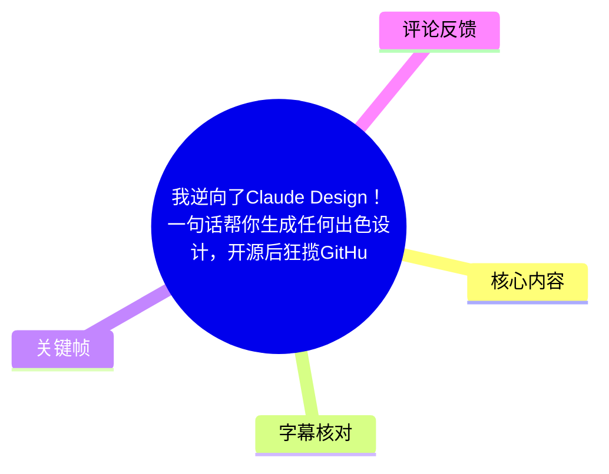
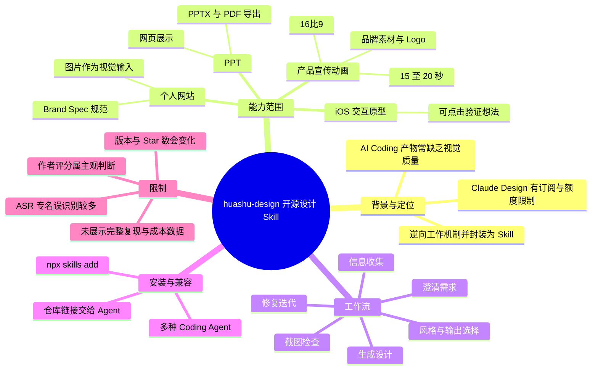
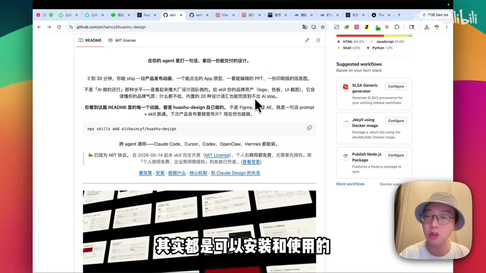
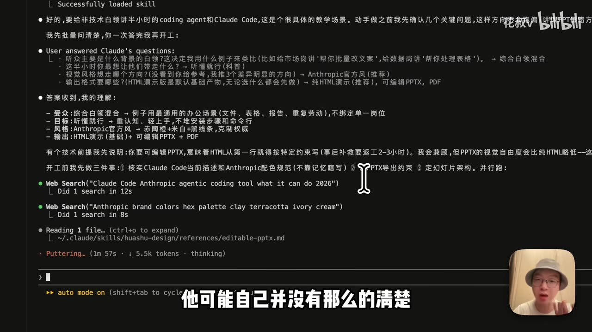
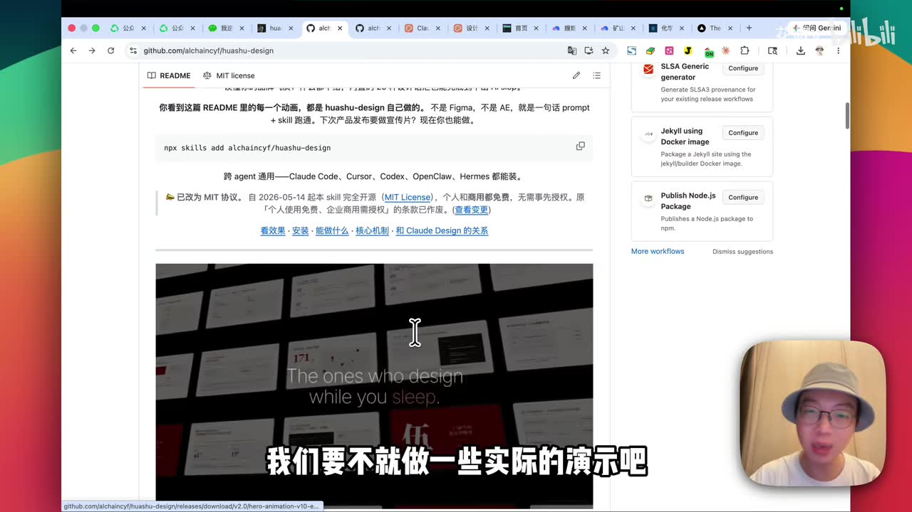

# 我逆向了 Claude Design：开源设计 Skill 的四项实测

> 来源：[Bilibili 视频](https://www.bilibili.com/video/BV1QQEN6mEgH)<br>
> UP 主：花叔v｜视频时长：16:14｜素材抓取时间：2026-07-15  
> 项目仓库（视频简介提供）：<https://github.com/alchaincyf/huashu-design>

## 小结

视频介绍了开源 Skill **huashu-design**。UP 主称其通过逆向 Anthropic 的 Claude Design 工作机制而来，目标是把“较稳定的视觉设计工作流”装入各类 Coding Agent：用户提出需求、补充受众和风格等信息后，Agent 可生成演示文稿、网页、交互原型或宣传动画，并在部分任务中执行检索、品牌分析、预览和自检修复。

核心方法不是直接让模型“画一个设计”，而是把设计任务拆成需求澄清、风格选择、外部信息/视觉素材理解、设计规范固化、生成、截图验证和修复等环节。尤其在网站案例中，视频展示了由参考照片提取颜色与视觉语言，再写入 `brand spec`（品牌规范文档）后执行页面设计的流程。

视频现场测试四类任务：面向非技术白领的 PPT、由照片驱动的个人主页、基于《高效能人士的七个习惯》的可点击 iOS 原型，以及面向“花生 AI”的 15–20 秒、16:9 宣传动画。UP 主对 PPT 的主观评分约为 80 分，对动画先估计约 70 分、观看结果后认为达到了自己约 85 分的预期；这些是作者个人评价，不构成通用质量保证。

安装层面，视频称该 Skill 可用于 Claude Code、Cursor、Codex、OpenClaw、Hermes、Trae、WorkBuddy 等 Coding Agent。关键帧中的仓库 README 展示安装命令 `npx skills add alchaincyf/huashu-design`；视频最后还演示将仓库链接交给 Agent，并说“帮我安装这个 skill”。实际兼容性、依赖、权限与安装结果仍会随 Agent、运行环境和仓库版本变化，应以仓库当前文档为准。

时效性方面，视频和简介中“GitHub 1.6 万+ Star”“MIT 协议”“自 2026-05-14 起完全开源”等描述均是视频制作或抓取时的陈述/画面信息，Star 数、许可证文本、支持的 Agent 列表及安装方式都可能变化。视频没有展示完整源码审计、可复现实验配置、运行成本或不同模型下的成功率，因此不能据此推断所有需求都能“一句话”稳定高质量交付。

## 思维导图





## 目录

- [背景：为何需要把设计能力封装为 Skill](#背景为何需要把设计能力封装为-skill)
- [项目定位、能力与兼容范围](#项目定位能力与兼容范围)
- [实测一：生成可演讲、可编辑的 PPT](#实测一生成可演讲可编辑的-ppt)
- [实测二：以照片为视觉输入生成个人网站](#实测二以照片为视觉输入生成个人网站)
- [实测三：生成可点击的 iOS 原型](#实测三生成可点击的-ios-原型)
- [实测四：生成产品宣传动画](#实测四生成产品宣传动画)
- [安装步骤与实践建议](#安装步骤与实践建议)
- [限制、适用边界与时效性](#限制适用边界与时效性)
- [字幕比对](#字幕比对)
- [评论分析](#评论分析)
- [处理记录](#处理记录)

## [背景：为何需要把设计能力封装为 Skill](https://www.bilibili.com/video/BV1QQEN6mEgH?t=29)

视频开场指出，AI Coding 生成的网站或 App 往往“能用但难看”，问题集中在色彩、色调和整体视觉一致性。UP 主将其作为 huashu-design 要解决的对象：不是只生成可运行页面，而是让 Coding Agent 在设计输出上具备更稳定的工作过程。

作者提到 Anthropic 的 Claude Design 可做出相对更好的设计，但其使用前提包括订阅 Claude 产品，且此前存在消耗量较大的问题。视频中的解决思路是：逆向其“工作机制/工作原理”，再将这套方式做成可安装的 Skill，以降低对单一产品入口的依赖。

需注意，视频没有给出 Claude Design 的完整实现细节、逆向技术路线、与原产品在能力上的可验证等价性，因而“逆向”在本文中仅指作者的自述，不延伸为源码级或功能等价的结论。


> 图：画面直接给出视频实测任务及起始时间，是理解后续案例结构的目录性关键帧；它也与视频简介中的四个时间戳相互印证。

## [项目定位、能力与兼容范围](https://www.bilibili.com/video/BV1QQEN6mEgH?t=103)

作者将 huashu-design 描述为：用户描述需求后，Skill 会给出若干选项；在选定风格后，产出视觉较稳定的 PPT、网页或其他设计物。视频还称，网页中的动画、演示动画乃至配音都可由该 Skill 完成，但没有逐项展示这些产物的完整制作日志，因此应理解为作者的能力主张。

视频明确提及的产物类型包括：

| 类型 | 视频中展示或声称的交付形式 | 关键特征 |
| --- | --- | --- |
| PPT | 浏览器内展示、PDF、PPTX | PPTX 内容可编辑；可用于演讲或材料分发 |
| 网页/个人主页 | 网页成品 | 可由照片、Logo、品牌物料或艺术作品驱动风格 |
| App/iOS 原型 | 可操作原型 | 用于快速讨论产品想法和任务流程 |
| 宣传动画 | 产品/概念的短动画 | 可抓取官方 Logo、品牌色等真实素材 |
| 视频补充动画 | 与讲解内容相配的动画 | 作者建议可用于缺少 B-roll 素材的视频场景 |

兼容性方面，口播提及 Claude Code、Codex、龙虾、Hermes、Trae、WorkBuddy 等；视频简介还列出了 Cursor。关键帧中的 README 则展示“跨 agent 通用——Claude Code、Cursor、Codex、OpenClaw、Hermes 都能装”的文字。不同口播、简介和 README 的名单并不完全相同，因此更严谨的理解是：作者主张其面向多 Agent 使用；具体可用 Agent 应以安装时的仓库文档及当前环境验证为准。



> 图：该帧提供了视频之外的可见仓库页面上下文：README 显示“在你的 agent 里打一 句话，拿回一份能交付的设计”、安装命令以及 MIT License 标签。它是记录项目定位与安装入口的重要画面证据。

## [实测一：生成可演讲、可编辑的 PPT](https://www.bilibili.com/video/BV1QQEN6mEgH?t=197)

### 任务设定

第一个演示面向公司里的非技术白领：在约半小时内讲解什么是 Coding Agent，尤其是 Claude Code，要求生成辅助演讲的 PPT。作者将这定义为常见办公场景。

### 视频展示的流程

1. **不立即生成**：Skill 先追问需求，而不是直接制图。
2. **进行选择**：作者选择/确认听众背景、讲解目标、视觉风格及所需输出物。
3. **补充信息**：Agent 发现自己对部分知识并不清楚，先检索相关信息。
4. **获取产品视觉信息**：检索后理解产品介绍与相关配色。
5. **先做两页试样**：因为要生成多页讲解内容，先制作两页供用户确认风格。
6. **继续批量生成**：作者认可试样后，按该风格继续。
7. **自动检查与修复**：视频称其发现部分页面有问题并自动修复。
8. **交付多种格式**：浏览器演示版本、PDF、PPTX。

关键帧中的终端界面还可见，任务过程包含 Web Search，以及读取 `~/.claude/skills/huashu-design/references/editable-pptx.md`。这支持了视频所述“先收集信息、再做设计”的流程，但无法仅凭该帧确认所有页面均经同样步骤完成。



> 图：该帧直观显示 Skill 没有直接生成成品，而是先收集约束、搜索资料、读取参考文档。这是视频中最具可迁移性的流程证据之一。

### 交付评价与编辑性

作者认为成品约有“80 分左右”水平，并认为其采用 Claude Code 日常风格。演示显示：

- 网页版可直接用于呈现；
- 可导出 PDF，作者认为版式保持较好，便于转发查看；
- 可导出 PPTX，作者称格式基本保持，且所有内容仍可编辑；
- 编辑性意味着生成后可继续调整，而不是一次性不可修改的图像。

这里的“80 分”“格式维持得很好”均来自作者主观体验。视频没有展示导出文件在不同 Office/WPS 版本中的兼容性，也没有展示字体替换、图表编辑、动画保留等细节；实际使用时应打开 PPTX 做验收。

## [实测二：以照片为视觉输入生成个人网站](https://www.bilibili.com/video/BV1QQEN6mEgH?t=412)

### 任务与输入

第二个任务是制作个人主页，用于在加微信或公开活动后让他人了解“我是谁、在做什么、如何关注”。初始时 Agent 给出三张风格选择图，作者拒绝这些推荐，改用一张自己在饮料店前拍摄的照片作为视觉投喂材料。

作者将此方法泛化为：若有品牌 Logo、既有品牌物料、喜欢的视觉风格、海报或艺术作品，都可交给 Agent 理解，再按其视觉语言进行设计。这里的重点是**参考图不是单纯插图，而是设计规范的来源**。

### 从参考图到 Brand Spec

视频口述的执行链路如下：

1. 理解图片的整体视觉语言；
2. 编写脚本，提取图片里的具体色值；
3. 将核心色系、色值固化为 `brand spec`；
4. 在品牌规范中写入配色、字体、细节、禁区和内容核心数据；
5. 基于该文档设计个人主页；
6. 完成后通过代码截图检查网页效果，发现问题再修改；
7. 对主视觉做二次决策：Agent 建议把印章式视觉换为真人照片，作者同意后更新。

作者在最终效果中强调，网站使用了参考照片中一种特殊蓝色和抹茶绿色，并充分使用其视觉元素。页面内容包括姓名、个人信息、核心元素、正在做的事、可找到自己的渠道、个性签名和联系方式；视频还提到页面中有“最近被央视报道”的信息，但本文不对该事实进行独立核验。

### 可迁移经验

- 不满足于 Agent 默认审美时，应直接提供可授权使用的品牌资产或参考图；
- 将“颜色、字体、禁区、内容重点”显式写成规范，比只说“参考这张图”更可控；
- 截图检查是网页设计生成的重要验收环节：代码可运行不等于视觉正确；
- Agent 的二次建议（如建议替换主视觉）可以作为备选方案，但是否采纳仍需用户判断。

## [实测三：生成可点击的 iOS 原型](https://www.bilibili.com/video/BV1QQEN6mEgH?t=649)

第三个任务是依据《高效能人士的七个习惯》的理念制作个人任务管理 iOS App，并要求为**可交互原型**。视频展示的交互逻辑包含：处理任务时，系统提示任务属于什么类型、是否在“影响圈”或“关注圈”，再将不同任务安排至不同矩阵。

流程上，Agent 先让作者选择视觉气质和功能深度，再理解具体功能及设计方案。作者称中间出现过 Bug，但 Agent 自行修复并完成运行；视频未展示 Bug 的具体报错、修复代码及回归测试范围。

作者认为，可操作原型的价值主要不在于直接替代产品开发，而在于：

1. **快速判断价值**：亲手操作后，可能发现想法不值得继续做；
2. **明确改造方向**：也可能发现方向不错，但具体流程与预期不同；
3. **缩短沟通距离**：运营或产品人员可用原型向研发说明自己想要什么；
4. **降低表达门槛**：将抽象想法快速变成可讨论的界面和行为。

这个案例说明，设计 Skill 的可迁移用途是“前期探索与沟通”。它不能替代对真实业务规则、可用性、数据安全、性能和工程架构的验证。

## [实测四：生成产品宣传动画](https://www.bilibili.com/video/BV1QQEN6mEgH?t=770)

### 任务参数

最后一个任务是为 B 站的 AI 视频产品“花生”制作宣传动画。作者明确说明该动画为自己制作的**非官方作品**，不是与官方合作。视频中给出的需求参数为：

| 参数 | 视频中的选择 |
| --- | --- |
| 动画时长 | 15–20 秒 |
| 画面比例 | 16:9，适配 B 站横版格式 |
| 内容重点 | “全流程的一键成片” |
| 视觉基调 | 使用产品的渐变色 |
| 素材策略 | 抓取官网 Logo 与品牌色 |
| 授权/合作属性 | 非官方、非合作作品 |

### 设计逻辑

作者特别强调，Agent 在创作前先确认该产品是否存在、是什么产品，再获取相关信息；随后抓取官网的 Logo 与品牌色，以获得该产品的“品牌 DNA”。这反映出一个重要原则：做产品宣传物时，视觉应尽可能与品牌已有资产一致，而不应只用模型的通用审美。

作者先判断动画约为 70 分水平；看到结果后又说达到自己约 85 分的预期。两者都是个人的主观质量尺度。视频没有展示官网素材的使用授权、商标许可或动画音频的版权情况，因此不能将“能抓取”直接等同于“可自由商用”。



> 图：画面展示 README 内嵌演示区域与 `npx skills add alchaincyf/huashu-design` 命令，说明作者用仓库中的动效示例作为能力展示。它有助于理解视频所说“演示动画也是 Skill 制作”的证据来源。

### 作者建议的延伸用途

作者建议，有产品需要社交媒体宣传时，可以用该 Skill 制作短宣传内容；若录制 B 站视频后缺少 B-roll 素材，也可让 Agent 按讲解内容生成补充动画。这是可行的创作思路，但发布前仍需人工核对：

- 是否准确表达产品能力，避免夸大；
- 画面、Logo、字体、音乐、配音和素材是否拥有相应使用权；
- 品牌方是否允许非官方宣传内容使用其视觉资产；
- AI 生成画面是否存在文字错误、事实错误、闪烁或不一致。

## [安装步骤与实践建议](https://www.bilibili.com/video/BV1QQEN6mEgH?t=939)

视频最后给出最简安装思路：复制 GitHub 仓库链接，发给所使用的 Agent，并说“帮我安装这个 skill”。作者称 Agent 可自行完成安装。

关键帧中仓库 README 可见的命令为：

```bash
npx skills add alchaincyf/huashu-design
```

### 建议的实际操作顺序

1. 打开视频简介提供的仓库，先阅读当前 README、License、安装说明、依赖要求和更新记录。
2. 确认本地 Agent 是否支持 Skill 安装机制，以及是否有 Node.js / `npx` 等运行条件。
3. 优先在测试目录或隔离项目中安装，避免 Agent 在工作项目中未经确认修改配置或文件。
4. 可使用 README 中的命令，或把仓库地址和安装需求交给 Agent；执行前查看 Agent 将要运行的命令。
5. 安装后先做低风险测试，例如生成单页静态网页或简短原型。
6. 对设计成果做双层验收：
   - **内容验收**：数据、文案、产品事实、品牌名称是否准确；
   - **视觉/工程验收**：截图、响应式布局、导出文件、交互按钮、资源加载是否正常。
7. 若使用品牌资产、真人照片或第三方艺术作品，确认拥有输入素材及最终输出的使用权。


> 图：作为安装章节的证据帧，该图能核对命令文本及 README 中的 MIT 信息；它并不能替代对仓库当前版本、依赖和许可证全文的阅读。

## [限制、适用边界与时效性](https://www.bilibili.com/video/BV1QQEN6mEgH?t=915)

### 视频已展示的限制

- 作者提到原 Claude Design 存在订阅门槛和额度消耗问题，但视频未量化 huashu-design 自身的模型调用成本、Token 消耗或运行时间。
- Skill 会检索信息、抓取品牌素材、写脚本、截图检测并修复；这意味着网络访问、工具权限、Agent 能力和环境配置都会影响结果。
- 原型案例中的 Bug 被称已自动修复，但未给出具体失败原因和测试覆盖范围。
- 动画案例被明确标注为非官方创作；使用品牌 Logo 与品牌色仍需考虑商标、素材授权和传播风险。
- PPTX 虽被称可编辑，但未验证不同软件、字体环境和复杂版式下的兼容性。

### 不应过度外推的结论

视频能够支持“该项目尝试把多步设计工作流装入 Agent，并展示了四种输出类型”，但不足以证明：

- 任何一句提示都能得到高质量设计；
- 所有 Agent 都可无差别安装、调用或稳定运行；
- 所有生成内容可直接商用；
- 设计审美、事实准确性、无障碍性和工程质量可无需人工审核；
- 视频中的 GitHub Star 数、支持列表和安装方式在当前仍保持不变。

### 时效性记录

视频元数据显示发布时间为 2026-06-08，素材抓取于 2026-07-15。视频简介称项目“GitHub 已 16000 多 Star”、采用 MIT 协议、个人和商用免费；关键帧 README 还显示“自 2026-05-14 起 skill 完全开源”的字样。上述均应视为相应时间点的信息快照。使用前请以仓库当前 README、`LICENSE` 文件和发行版本为准。

## [字幕比对](https://www.bilibili.com/video/BV1QQEN6mEgH?t=29)

| 字幕来源 | 完整性 | 专有名词 | 时间轴 | 主要问题 |
| --- | --- | --- | --- | --- |
| Bilibili 站内字幕 | 未提供可用站内字幕，无法比对文本 | 无法评估 | 无法评估 | 素材明确标注“未提供可用站内字幕” |
| 本次 ASR 字幕 | 较完整：41 段，语音覆盖约 939.01 秒，覆盖率 96.43% | 较多误识别 | 完整 SRT 时间轴；首段 00:00:29,580，末段 00:16:13,720 | 多个中英文专名、产品名和术语识别错误，部分句子连写、存在乱码字符 |

本次 ASR 检查结果显示：音频语言为中文，置信概率约 0.9985，使用 `medium` 模型、CUDA / float16 处理；诊断未标记 `noAudioStream=true`，并且提供了完整的带时间戳 SRT。因此本文以**本次 ASR 的真实起止时间**生成章节时间轴，同时根据视频标题、简介、关键帧可见文字和上下文，对显著误识别的专名做了谨慎校正。

重要校正包括：

| ASR 误识别或不稳定写法 | 本文采用写法 | 校正依据 |
| --- | --- | --- |
| Ensorpeak、Cloated Design、Cloud Design | Anthropic、Claude Design | 视频标题、简介及上下文 |
| Cloud Code、Code Code | Claude Code | 视频标题、简介、终端界面语境 |
| 花束底线、滑鼠 Design | huashu-design / 花叔 Design | 视频标题、简介 GitHub 链接、README 画面 |
| Tray、Kill Cloud Workbody | Trae、WorkBuddy | 视频简介中的支持列表 |
| 花生 AI 的“品牌 DNA”相关名称 | 花生 AI | 视频口播上下文；不对产品细节做额外外部核验 |
| 色质、投为、品牙 | 色值/视觉素材、投喂、品牌 | 中文语义和相邻句上下文 |

校正原则是：只修正能由标题、简介、关键帧或明显语境确认的词；无法确认的细节不擅自补充。比如 ASR 中出现的个别产品名、术语和口语断句存在歧义，本文没有据此扩写未展示的功能或参数。

## [评论分析](https://www.bilibili.com/video/BV1QQEN6mEgH?t=939)

本次仅获取到 2 条热评，少于要求的前三条，因此只分析可获取内容，不补造第三条。

1. **losecontrol｜152 赞**  
   评论认为“GitHub 的 Star 和短视频点赞量的含金量没区别”，并担忧高 Star 项目分流了真正高技术项目的关注度。  
   - **观点价值**：提醒读者不要把 Star 数直接等同于技术深度、稳定性、安全性或生产可用性。  
   - **争议与可信度**：这是对指标价值的主观批评，不包含对 huashu-design 代码、许可证、安装过程或输出质量的具体测试，因此不能作为项目优劣的直接证据。

2. **露天影院-AI实验室｜77 赞**  
   评论称“视频还没看完，装完立马跑了一个”，并设计了苹果手机 App，对作者表示感谢。  
   - **补充信息**：说明至少有一名评论者声称已快速安装并完成一次 App 设计尝试。  
   - **可信度边界**：评论未提供环境、Agent 类型、命令输出、生成结果、耗时或失败情况，属于个人使用反馈，不能据此验证普适安装成功率或成品质量。

## [处理记录](https://www.bilibili.com/video/BV1QQEN6mEgH?t=963)

- **Worker ID**：worker-mrj0www4-e8d79408
- **模型**：gpt-5.6-terra
- **调用工具与素材**：任务提供的元数据、视频简介时间戳、ASR 诊断、ASR SRT、关键帧、热评 JSON；未执行额外联网检索或仓库源码审计。
- **字幕选择**：站内字幕未提供可用版本；已检查本次 ASR，确认存在音频流且 ASR 带真实时间戳。正文时间轴采用 ASR SRT 的起始时间；专有名词仅按标题、简介、关键帧和上下文校正。
- **关键帧选择依据**：
  - `frames/frame-001.jpg`：展示四个实测任务及时间，是视频结构的直接证据；
  - `frames/frame-002.jpg`：展示 GitHub README、安装命令、MIT 信息及跨 Agent 说明；
  - `frames/frame-003.jpg`：展示 README 中的演示动效区域和安装命令；
  - `frames/frame-004.jpg`：展示 PPT 任务的需求澄清、搜索和参考文档读取过程。
- **关键帧使用说明**：仅引用所提供且画面信息可辨识的帧，不将未提供或未能确认内容写入正文。
- **缓存清理**：未执行本地缓存清理操作；任务仅使用已提供的素材清单与文件引用，未产生可报告的额外下载缓存。
- **未解决问题**：
  - 未提供可用站内字幕，无法进行逐句站内字幕对照；
  - 未对 GitHub 仓库当前 Star 数、版本、许可证全文、支持 Agent、安装依赖及安全性做联网复核；
  - 视频未提供完整命令日志、源码审计和可复现测试环境，无法评估成功率、成本及跨环境兼容性。

## 评论分析

- 热评 1：现在github的star和短视频点赞量的含金量没区别了[笑哭][笑哭]，改把真正的高技术项目做分流了
- 热评 2：视频还没看完，装完立马跑了一个，设计的是苹果手机APP，感谢花叔 [支持]

以上内容是观众反馈摘录，只用于补充理解视频反响，不作为正文事实依据。
