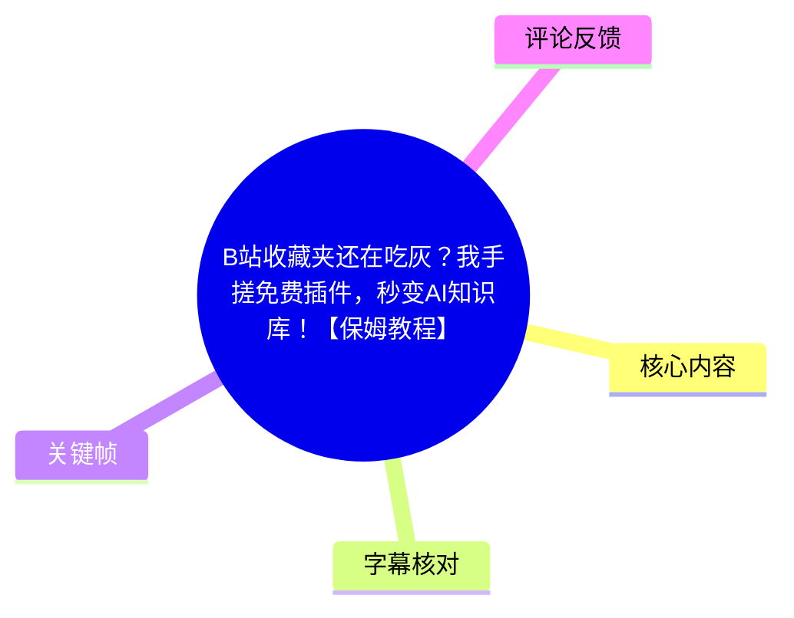
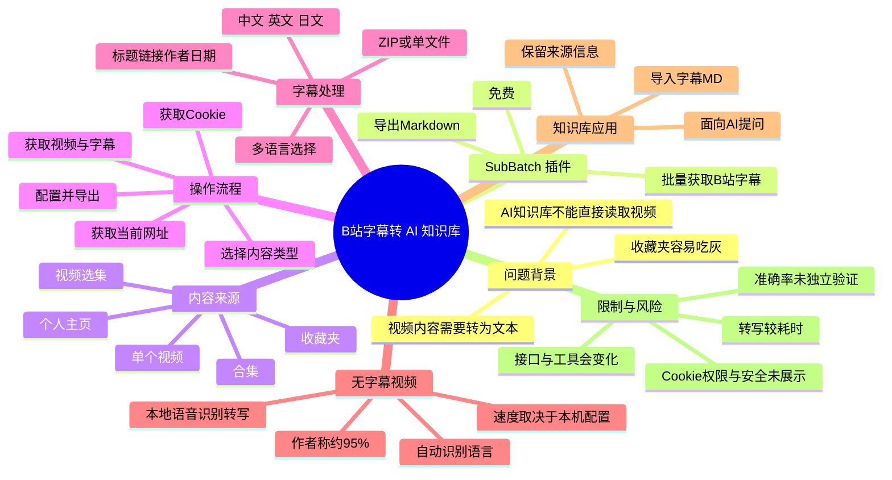
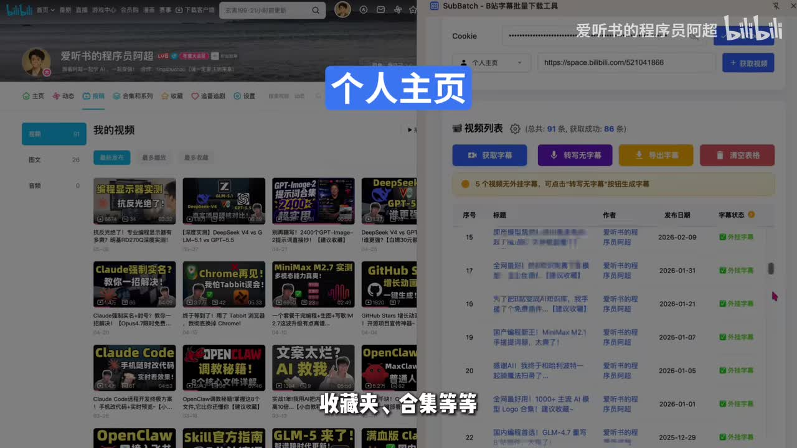

# B站收藏夹还在吃灰？我手搓免费插件，秒变AI知识库！【保姆教程】

> 来源：[Bilibili 视频](https://www.bilibili.com/video/BV1WiLw6nETh)  
> UP 主：爱听书的程序员阿超｜时长：3 分 27 秒｜收藏夹：AIcode  
> 本文仅整理视频及所附素材中可确认的信息；插件的安装包、配套文档链接、置顶评论具体内容均未提供，不作延伸推断。

## 小结

视频介绍了一款名为 **SubBatch / SABATCH** 的免费浏览器插件。作者要解决的问题是：B 站中大量被收藏的视频无法直接被 AI 知识库读取；插件则尝试将视频字幕批量提取、整理为 Markdown（MD）文档，再交给 AI 知识库检索与问答。

视频演示的主要路径是：先获取 B 站账户 Cookie，选择待处理内容类型，再读取当前页面地址并批量获取视频；随后获取字幕、选择多语言字幕与导出方式，最后以 ZIP 或单文件形式导出。作者示范的内容来源包括个人主页、收藏夹、合集和视频选集。

对于没有外挂字幕的视频，插件提供“转写无字幕”功能：调用本地语音识别模型把音频转成字幕。作者声称整体转写率约为 **95%**，但同时明确说明转写耗时更长，且速度依赖本地计算机配置。该数字是作者在视频中的说法，并非本文独立测试结论。

适合需要把 B 站收藏、课程或系列视频转为可检索文本资料的人。核心价值不在“收藏更多”，而在于建立“视频来源 → 字幕文本 → 可追溯 Markdown → AI 问答”的处理链路。

使用时需要特别注意 Cookie 与数据权限：视频明确要求先获取 B 站 Cookie，但没有展示 Cookie 的保存机制、传输范围、权限策略及安全审计情况。因此，不应把 Cookie 安全、数据隐私或插件长期可用性视为已被本视频证明的事实。B 站接口、字幕可得性和 AI 知识库导入规则均可能随时间变化。

## 思维导图





## 目录

- [背景：从“收藏即学会”到文本化学习](#背景从收藏即学会到文本化学习)
- [SubBatch 的定位与能力边界](#subbatch-的定位与能力边界)
- [操作演示：批量获取视频与字幕](#操作演示批量获取视频与字幕)
- [导出 Markdown：格式、压缩与来源追溯](#导出-markdown格式压缩与来源追溯)
- [无外挂字幕视频的本地转写](#无外挂字幕视频的本地转写)
- [导入 AI 知识库与适用经验](#导入-ai-知识库与适用经验)
- [限制、时效性与安全注意事项](#限制时效性与安全注意事项)
- [字幕比对](#字幕比对)
- [评论分析](#评论分析)
- [处理记录](#处理记录)

## [背景：从“收藏即学会”到文本化学习](https://www.bilibili.com/video/BV1WiLw6nETh?t=0)

视频开头提出一个常见学习问题：把视频收藏起来，并不等于已经掌握内容，收藏夹里的内容可能长期“吃灰”。站内中文字幕在 [00:00:00](https://www.bilibili.com/video/BV1WiLw6nETh?t=0) 至 [00:00:12](https://www.bilibili.com/video/BV1WiLw6nETh?t=12) 表达的核心是：AI 知识库无法直接读取这些视频内容。

作者的解决思路不是让知识库直接理解 B 站视频，而是先取得视频字幕，将其转换为文本资料，再导入知识库。视频描述中点名 NotebookLM，并提到其面对 B 站视频时的导入限制；画面也同时出现 NotebookLM 与 Obsidian 等知识库工具名称。


> 图：画面展示 NotebookLM 标识及“NotebookLM、Obsidian 这些 AI 知识库”的表述，帮助理解视频的应用目标：将原始视频转换成可被知识库处理的文本，而不是直接把视频当作可读素材。

### 可迁移的学习链路

视频中的方法可概括为：

1. 从 B 站页面集合中获取视频；
2. 优先提取已有字幕；
3. 对无外挂字幕的视频使用本地模型转写；
4. 导出带元信息的 Markdown 文档；
5. 将文本导入 AI 知识库；
6. 基于整理后的资料提问、检索和回溯来源。

其中，**字幕文本是中间层**：它降低了视频进入文本型知识库的门槛，但也意味着最终知识库回答的质量会受字幕质量、转写错误、元信息完整度及知识库本身能力影响。

## [SubBatch 的定位与能力边界](https://www.bilibili.com/video/BV1WiLw6nETh?t=17)

在 [00:00:17](https://www.bilibili.com/video/BV1WiLw6nETh?t=17) 至 [00:00:35](https://www.bilibili.com/video/BV1WiLw6nETh?t=35)，作者将插件称为 **SABATCH**；结合插件界面与视频标题，本文统一记为 **SubBatch / SABATCH**，不将 ASR 中误识别出的“Savage”“杀背”等写法视为产品名称。

作者陈述的核心能力包括：

| 能力 | 视频中的描述 | 可确认范围 |
| --- | --- | --- |
| 批量获取字幕 | 批量获取 B 站视频字幕 | 作者演示并明确口述 |
| 获取范围 | 个人主页、收藏夹、合集、视频选集等 | 站内字幕与界面画面支持 |
| 文本导出 | 可将字幕导出为 MD 文档 | 视频明确展示 |
| 多语言处理 | 可选中文、英文、日文等字幕类型 | 视频明确口述；不等同于所有视频必有这些语言 |
| 无字幕转写 | 调用本地语音识别模型生成字幕 | 视频明确展示 |
| 知识库使用 | 将字幕资料导入 AI 知识库后提问 | 视频作为推荐工作流演示 |

作者称插件“完全免费”。该结论仅能表述为视频发布时作者的声明；素材未提供插件许可证、源码仓库、安装包、服务端成本说明或未来收费策略，无法进一步验证。



> 图：左侧是 B 站个人主页视频列表，右侧为 SubBatch 界面，画面明确展示“个人主页”场景与视频列表处理结果，说明该工具的定位并非局限于单个视频。

## [操作演示：批量获取视频与字幕](https://www.bilibili.com/video/BV1WiLw6nETh?t=44)

### [1. 获取 Cookie](https://www.bilibili.com/video/BV1WiLw6nETh?t=49)

在 [00:00:49](https://www.bilibili.com/video/BV1WiLw6nETh?t=49) 至 [00:00:52](https://www.bilibili.com/video/BV1WiLw6nETh?t=52)，作者先点击“获取 Cookie”。这说明插件需要使用 B 站账户登录态来完成至少部分页面或内容访问。

**重要限制：**

- 视频没有解释 Cookie 是否仅在本地保存、是否上传、保存多久、是否可撤销。
- 视频没有展示插件权限清单，也没有说明是否需要访问所有网站数据。
- 因 Cookie 通常与登录态相关，实践中应避免将其复制到不可信页面或泄露给他人。
- 若仅需公开视频，是否可以不使用 Cookie，视频未给出答案。

因此，Cookie 步骤是视频流程的一部分，但不能据此推导插件的安全实现细节。

### [2. 选择内容类型并读取当前页面](https://www.bilibili.com/video/BV1WiLw6nETh?t=52)

在 [00:00:52](https://www.bilibili.com/video/BV1WiLw6nETh?t=52) 至 [00:01:09](https://www.bilibili.com/video/BV1WiLw6nETh?t=69)，作者选择待获取的内容类型，以收藏夹为例，随后点击“获取当前网址”和“获取视频”。

画面中的下拉选项可见：

- 单个视频；
- 个人主页；
- 收藏夹；
- 合集；
- 视频选集；
- 搜索页面。

作者演示中称，点击“获取视频”后瞬间获得数十个视频。这里的“数十个”是当次演示结果，不应理解为所有页面、账号或网络环境下均有相同性能。


> 图：画面左侧是 B 站收藏夹页面，右侧 SubBatch 的类型选择菜单显示单个视频、个人主页、收藏夹、合集、视频选集、搜索页面等选项。它直接说明可选入口及收藏夹处理的操作上下文。

### [3. 批量获取已有字幕](https://www.bilibili.com/video/BV1WiLw6nETh?t=69)

在 [00:01:09](https://www.bilibili.com/video/BV1WiLw6nETh?t=69) 至 [00:01:24](https://www.bilibili.com/video/BV1WiLw6nETh?t=84)，作者点击“获取字幕”，并展示列表中的字幕获取成功状态。

对于存在多语言字幕的视频，作者称可在界面中选择需要的语言，示例语言包括：

- 中文；
- 英文；
- 日文。

这里需要区分两件事：

1. **插件可提供语言选择**：这是视频所展示的界面能力；
2. **某一个具体视频具备哪些语言字幕**：取决于该视频在 B 站侧实际存在的字幕，不能由插件单独保证。

## [导出 Markdown：格式、压缩与来源追溯](https://www.bilibili.com/video/BV1WiLw6nETh?t=84)

在 [00:01:24](https://www.bilibili.com/video/BV1WiLw6nETh?t=84) 至 [00:01:58](https://www.bilibili.com/video/BV1WiLw6nETh?t=118)，作者演示字幕导出配置。视频可确认的选项如下：

| 配置项 | 作者展示的选择或能力 | 实际意义 |
| --- | --- | --- |
| 导出模式 | 全部字幕压缩为 ZIP，或每个单独导出 | 决定文件组织方式 |
| 演示选择 | ZIP 压缩格式 | 适合批量下载和整体传输 |
| 文本格式 | MD 格式文件 | 便于导入文本型知识库或笔记系统 |
| 文件命名 | 可选择 MD 文件命名格式 | 具体全部命名规则未在字幕中完整给出 |
| 顶部元信息 | 视频标题、链接、作者、发布日期等 | 保留出处，方便回溯 |
| 导出结果 | 字幕被整理完成 | 画面中为操作结果展示 |

作者特别强调勾选标题、链接、作者、发布日期等字段，理由是方便日后追溯来源。这是此流程中较重要的经验：如果只保存纯字幕正文，知识库虽然可搜索，却容易丢失原始视频的作者、链接、发布时间和引用上下文。

### 建议保留的最小元信息

视频没有规定标准模板；以下仅是根据作者“便于追溯来源”的目标，对其演示字段作的结构化归纳，而非插件的固定输出格式：

```markdown
# 视频标题

- 来源链接：原视频 URL
- 作者：UP 主名称
- 发布日期：视频发布日期
- 字幕语言：中文 / 英文 / 日文
- 获取方式：站内字幕 / 本地转写

## 字幕正文
```

若导入 AI 知识库，建议不要只以文件名保存来源信息。把来源字段写入正文顶部，有利于检索后直接判断内容出处；但是否兼容目标知识库的最佳格式，仍要以具体平台导入规则为准。

## [无外挂字幕视频的本地转写](https://www.bilibili.com/video/BV1WiLw6nETh?t=118)

在 [00:01:58](https://www.bilibili.com/video/BV1WiLw6nETh?t=118) 至 [00:02:41](https://www.bilibili.com/video/BV1WiLw6nETh?t=161)，作者介绍针对“没有外挂字幕”的补救功能。

流程按视频演示为：

1. 对目标视频点击“获取字幕”；
2. 若系统提示没有外挂字幕、无法直接获取；
3. 点击“转写无字幕”；
4. 由本地语音识别模型执行音频转文字；
5. 转写完成后，自动识别与当前视频匹配的语言；
6. 按正常流程导出字幕。

作者以一段中文视频为例，称插件识别出的字幕语言为中文。

### 参数、性能与限制

| 项目 | 视频中的信息 | 解读边界 |
| --- | --- | ---|
| 转写方式 | 调用本地语音识别模型 | 未说明模型名称、版本、量化方式或是否联网 |
| 整体转写率 | “大概在 95% 左右” | 作者口述值，未提供测试集、指标定义或错误样本 |
| 转写耗时 | 会稍长一些 | 无具体分钟数或实时倍率 |
| 速度影响因素 | 与本地电脑配置有关 | 可确认；但没有给出 CPU、GPU、内存最低要求 |
| 语言识别 | 转写完成后自动识别匹配语言 | 视频以中文视频为例展示 |
| 导出 | 识别后可正常导出字幕 | 与已有字幕的导出流程衔接 |

“95%”不应被直接理解成任何素材上的字准确率。口音、多人说话、音乐、术语、外语混杂、录音质量和机器性能，都可能影响实际结果。尤其是要用作知识库资料时，建议抽查专有名词、数字、代码命令、产品名称和结论性表述。

## [导入 AI 知识库与适用经验](https://www.bilibili.com/video/BV1WiLw6nETh?t=162)

在 [00:02:42](https://www.bilibili.com/video/BV1WiLw6nETh?t=162) 至 [00:02:51](https://www.bilibili.com/video/BV1WiLw6nETh?t=171)，作者展示最终用途：将取得的视频字幕直接放入 AI 知识库，然后围绕资料提问。

视频的效率判断是：这种方式比直接刷视频更高效。更严谨地说，这种方法提升的是以下环节的效率：

- 从大量视频中搜索某个观点、步骤或术语；
- 对多个视频的文本资料进行集中提问；
- 保留链接、作者、日期后进行来源回溯；
- 对没有时间完整重看的视频进行复习。

但字幕知识库不能完全替代原视频：

- 演示画面、图表、代码细节和操作鼠标位置可能未被字幕记录；
- 自动转写可能产生词语错误；
- 视频中口语化、断句和上下文指代会降低问答精度；
- AI 的回答仍应回查原字幕和原视频链接，而不是视为无误结论。

## [限制、时效性与安全注意事项](https://www.bilibili.com/video/BV1WiLw6nETh?t=171)

在 [00:02:51](https://www.bilibili.com/video/BV1WiLw6nETh?t=171) 至 [00:03:06](https://www.bilibili.com/video/BV1WiLw6nETh?t=186)，作者总结：如有提取 B 站视频字幕的需求，该插件可满足需求，且插件免费；安装方式和操作步骤已整理在置顶评论所附文档中。

### 视频明确给出的限制

1. 无外挂字幕视频要走本地转写，耗时更长。
2. 转写速度取决于本地电脑配置。
3. 转写率约 95% 是作者估计，仍可能有错误。
4. 多语言字幕的可选范围取决于视频已有字幕。
5. 安装与完整操作细节不在本视频内，而是指向置顶评论中的配套文档。

### 素材未能确认、因此不能下结论的事项

- 插件安装来源、浏览器兼容范围与版本要求；
- 是否开源、是否有代码审计；
- Cookie 的本地保存、传输与删除策略；
- 对私密、会员、地区限制或失效视频的支持程度；
- 批处理数量上限、请求频率控制、失败重试机制；
- NotebookLM、Obsidian 或其他知识库的具体导入限制；
- 插件在视频发布后是否仍可用，以及是否仍然免费。

视频发布时间按元数据为 **2026 年 5 月 18 日**。B 站网页结构、字幕接口、浏览器扩展政策和第三方 AI 知识库能力均具有时效性；使用前应以置顶文档、插件当前版本及平台最新规则为准。

## 字幕比对

本次素材同时提供了 B 站站内多语言字幕和 ASR 结果，已检查两者。ASR 诊断中**未标记 `noAudioStream=true`**：源视频存在音轨，且 ASR 使用 `medium` 模型、CUDA、`float16` 完成中文识别。

| 字幕来源 | 完整性 | 专有名词 | 时间轴 | 主要问题 |
| --- | --- | --- | --- | --- |
| Bilibili 站内中文字幕 `p01-ai-zh.srt` | 覆盖约 00:00:00–03:26，与视频时长基本一致 | 多数操作词可用；但“note扑克”“AIMObside”“SABATCH”等位置有明显机器字幕误写 | 分段细，起止时间与视频结构吻合 | 个别词错字，如“字母”代替“字幕”、“A知识库”等；开头部分语句有混乱 |
| 本次 ASR | 诊断显示语音覆盖约 80.97%，最后至 03:26.49 | 产品名被识别为“Savage / 杀背”，Cookie、收藏夹、MD 等也有误识别 | 首段从 00:31.38 才开始，但文本实际包含视频开头内容，存在明显时间错位；每段过长 | 开头约 31 秒缺失为独立时间段，文本黏连严重，专有名词和部分技术词误识别较多 |
| 站内英文、西语、阿语、葡语 AI 字幕 | 覆盖范围与中文字幕基本一致 | 对 SABATCH、ZIP、Cookie 等部分词有辅助作用 | 时间轴与中文站内字幕一致 | 均为自动翻译字幕，部分开头语义和术语不稳定，不适合作为中文事实表述的主依据 |

### 最终字幕选择与校正原则

正文以 **B 站中文时间轴字幕** 作为时间定位主依据，以站内英文、西语、葡语字幕的交叉表述辅助理解；本次 ASR 用于核验是否有音轨、语种、整体语义和后半段内容，但**不采用其时间轴**，因为其首段时间与文本内容明显不一致。

通过多字幕交叉和关键帧画面校正的关键表述包括：

- 产品名称采用画面及多语字幕稳定出现的 **SubBatch / SABATCH**，不采用 ASR 的“Savage”“杀背”；
- “字幕”不采用中文站内字幕和 ASR 中频繁出现的“字母”；
- “AI 知识库”不采用“AI 字库”“AZSchool”等误识别；
- “NotebookLM、Obsidian”作为画面展示的工具名称记录；视频并未提供其完整兼容性测试；
- “获取当前网址”“获取视频”“获取字幕”“转写无字幕”“导出字幕”等按中文站内字幕及界面语义整理。

## 评论分析

本次可获取热评接口限制为前三条，但实际仅返回 **2 条**，因此只分析这两条，不补造第三条。

| 评论者 | 点赞 | 评论内容概括 | 可得信息与可信度 |
| --- | ---: | --- | --- |
| 江南哈士奇 | 5 | 表示已私信 UP 主，但未收到自动回复。 | 反映该用户希望通过私信获得信息或资源，但未说明私信内容，也不能据此推断插件获取方式、UP 主回复策略或服务状态。 |
| 玄离199 | 3 | “已严肃学习”。 | 表达对视频内容的认可或学习意愿，没有提供可验证的使用反馈、安装经验或功能评价。 |

评论中没有出现对插件安全性、安装成功率、转写准确率、收费情况或兼容性的重要补充证据。

## 处理记录

- **Worker ID**：`worker-mrj0wbly-5dc4e50c`
- **模型**：`gpt-5.6-terra`
- **ASR 模型与运行信息**：`medium`；语言自动识别为中文，置信度 `0.9990234375`；`cuda` + `float16`；音频时长 `206.8665625` 秒。
- **使用的素材工具/产物**：已使用任务提供的元数据、站内 SRT 字幕、ASR `asr-result.json` 与 SRT、关键帧目录、热评 JSON；未对素材以外的网页、置顶评论文档或插件页面作额外访问。
- **字幕选择**：以 `p01-ai-zh.srt` 的真实分段时间作为正文时间轴依据；利用站内多语字幕对专有名词和语义交叉核对；检查了本次 ASR，但因其首段时间明显错位、分段过长且专名误识别较多，不将其作为章节定位依据。
- **关键帧选择依据**：`frame-001.jpg` 用于说明 NotebookLM/Obsidian 的知识库语境；`frame-002.jpg` 展示个人主页批量处理；`frame-004.jpg` 展示收藏夹页面及插件支持的内容类型。所选图片均直接服务于正文的工具定位和操作说明。
- **缓存清理**：提供的任务素材中没有缓存清理执行日志；本文未声明已清理任何缓存，保留为“未提供记录”。
- **未解决问题**：未提供置顶评论中的安装文档和插件下载来源；无法验证安装步骤、权限范围、Cookie 安全、实际免费状态、准确率测试方法、批处理限制及当前版本可用性。
