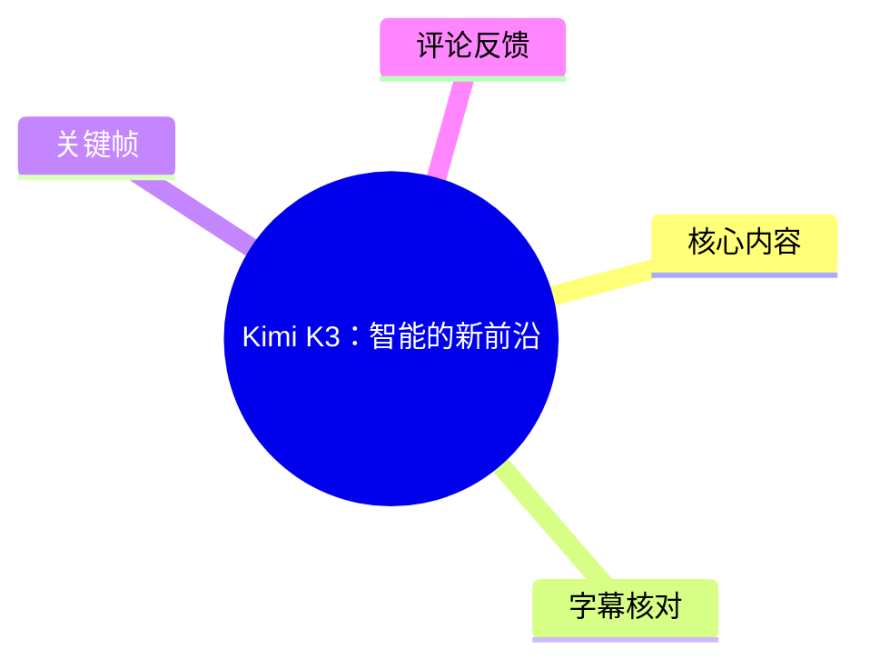
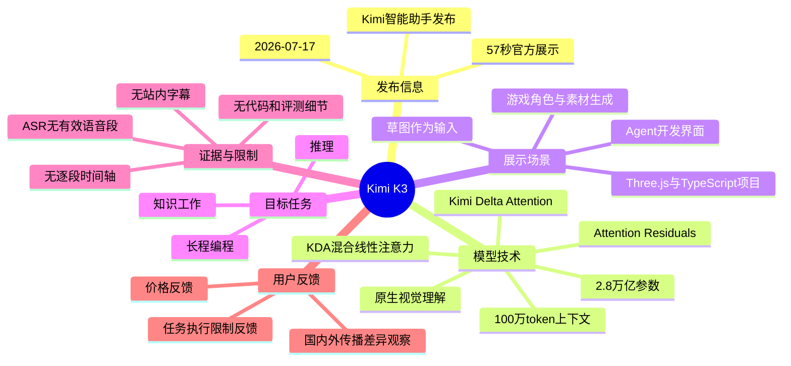
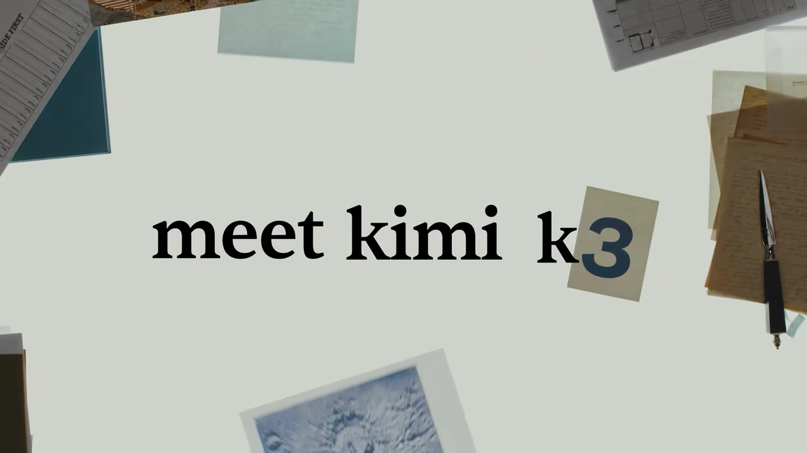
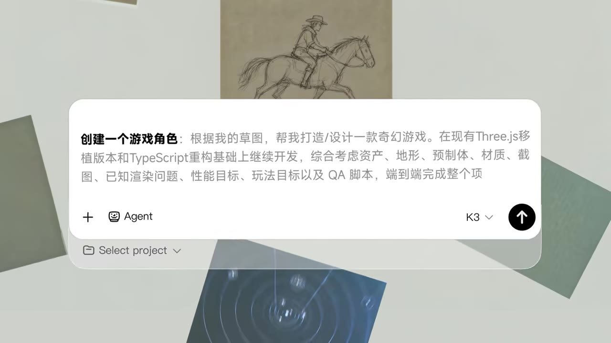
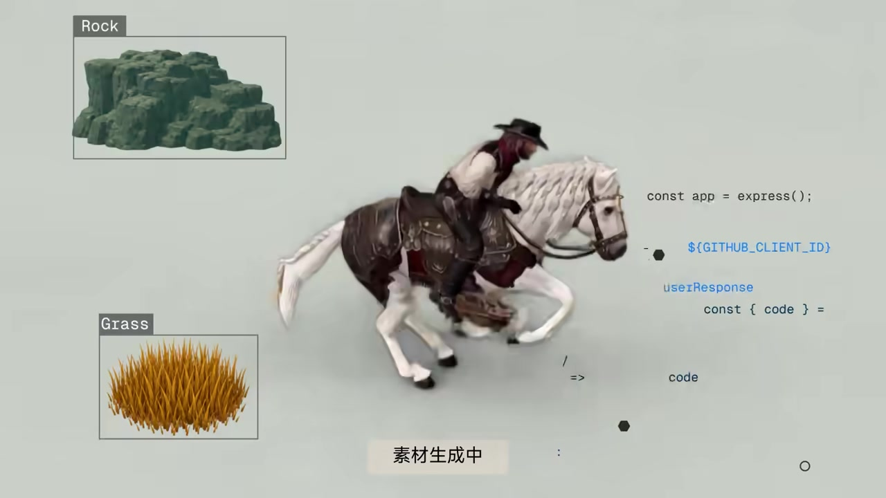

# Kimi K3：智能的新前沿

> 来源：[Bilibili 视频](https://www.bilibili.com/video/BV156KL6XESt)  
> UP 主：Kimi智能助手｜发布时间：2026-07-17｜视频时长：00:57  
> 视频定位：Kimi K3 的官方发布与能力展示短片。

## 小结

视频发布了 Kimi K3。根据 UP 主视频简介，Kimi K3 是其“迄今能力最强的模型”，目标场景包括长程编程、知识工作与推理；视频画面则以“从手绘草图到奇幻游戏角色与素材”的过程，展示其 Agent 化开发与视觉理解导向。

官方给出的关键技术与规模信息包括：模型总参数量为 **2.8 万亿**，采用 **KDA 混合线性注意力机制（Kimi Delta Attention）** 与 **Attention Residuals（注意力残差）**，原生支持视觉理解，并提供 **100 万 token 上下文窗口**。简介同时称其为“全球首个开源的 3 万亿级别模型”；这里存在“2.8 万亿参数”与“3 万亿级别”两种表述，前者应理解为精确参数量，后者是量级描述。

画面中的实际示例是：用户在 Kimi 的 Agent 界面输入一段较长的开发任务，要求基于草图、现有 Three.js 模板和 TypeScript 重构基础，综合处理资产、地形、预制体、材质、截图、已知渲染问题、性能目标、玩法目标及 QA 脚本，完成端到端项目。随后画面展示骑手与白马角色、岩石及草地素材，并标注“素材生成中”。

这不是可复现的完整教程：素材没有给出提示词之外的模型设置、代码仓库、执行日志、耗时、成本、失败案例、最终项目链接或评测分数。因此，视频能够证明的是官方展示了一个多模态 Agent 开发方向和界面流程，**不能仅凭这支短片验证其端到端交付的稳定性、性能、价格或通用效果**。

时效上，本片发布于 2026-07-17，模型能力、开源状态、产品入口、套餐价格、任务配额及可用区域都可能随后调整。热评中出现“付费后不能执行任务”与“价格高”的反馈，但均为个人体验或观点，不能替代官方服务状态与价格页信息。

## 思维导图

## 目录

- [发布背景与信息边界](#发布背景与信息边界-0000)
- [官方公布的模型规格](#官方公布的模型规格-0000)
- [画面展示：由草图驱动的游戏开发任务](#画面展示由草图驱动的游戏开发任务-0000)
- [可提炼的任务拆解经验](#可提炼的任务拆解经验-0000)
- [限制、验证边界与时效性](#限制验证边界与时效性-0000)
- [关键帧索引](#关键帧索引-0000)
- [字幕比对](#字幕比对-0000)
- [评论分析](#评论分析-0000)
- [处理记录](#处理记录-0000)

## [发布背景与信息边界 [00:00]](https://www.bilibili.com/video/BV156KL6XESt?t=0)

这是 Kimi智能助手发布的 Kimi K3 宣传短片，时长 57 秒。由于没有可用的站内字幕，且本次 ASR 未识别出任何有效语音片段，无法依据字幕起止时间把片中多个画面精确划分为独立时间段。故本文所有正文段落均链接到唯一可确认的起点 **00:00**，而不根据画面或文字顺序虚构秒级位置。

视频及简介所传达的主线可以概括为：

1. 发布 Kimi K3；
2. 强调其大参数规模、长上下文与视觉理解能力；
3. 将能力定位在长程编程、知识工作和推理；
4. 用“草图—任务描述—生成游戏资产”的视觉案例呈现 Agent 式开发方向。

> 图：画面中央出现“meet kimi k3”，是识别本片主题与产品名称的直接视觉证据；该图适合用作发布信息的锚点。由于没有逐帧时间戳素材，不将其标注为具体发生秒数。

## [官方公布的模型规格 [00:00]](https://www.bilibili.com/video/BV156KL6XESt?t=0)

以下内容来自视频元数据中的官方简介，而非本次 ASR 转写：

| 项目 | 官方描述 | 解读与边界 |
| --- | --- | --- |
| 模型名称 | Kimi K3 | 本片发布对象。 |
| 参数量 | 2.8 万亿参数 | 这是简介给出的精确数值。参数量不能单独推出实际推理质量、延迟或成本。 |
| 量级定位 | 开源的“3 万亿级别”模型 | 与 2.8 万亿不矛盾：前者是量级表述，后者是精确值。 |
| 注意力技术 | KDA 混合线性注意力机制（Kimi Delta Attention） | 官方将其列为构建技术，但短片素材未解释其具体结构、训练方式或复杂度。 |
| 补充技术 | Attention Residuals（注意力残差） | 简介仅给出名称，未给出公式、消融实验或实现细节。 |
| 多模态能力 | 原生支持视觉理解 | 画面中草图作为任务输入，与该定位一致；但没有提供视觉基准或具体支持的图像格式、分辨率限制。 |
| 上下文窗口 | 100 万 token | 说明长上下文能力上限；素材未说明输入/输出分别受限情况、实际可用窗口、缓存策略与计费口径。 |
| 主要场景 | 长程编程、知识工作、推理 | 属于官方目标定位，实际效果仍需结合公开评测与具体产品版本验证。 |
| 相对能力判断 | 整体仍落后于 Claude Fable 5、GPT-5.6 Sol；但在整套评测中表现前沿并稳定超过其他模型 | 这是官方自述。素材未提供评测集名称、分数、提示词、运行配置及统计方法，无法独立复核。 |

### 技术信息应如何使用

对于技术选型或评估，视频提供的是**模型规模和定位线索**，而不是部署文档。实际使用前至少还需核对：

- 权重或 API 是否实际开放、许可证内容及商业使用限制；
- 支持的输入模态、最大输入与最大输出 token；
- 上下文窗口在不同产品入口是否一致；
- 推理速度、并发限制、配额、价格与区域可用性；
- 代码 Agent 是否能够访问项目文件、运行终端、调用浏览器或执行构建；
- 官方“整套评测”的评测集、版本号、指标和复现实验条件。

## [画面展示：由草图驱动的游戏开发任务 [00:00]](https://www.bilibili.com/video/BV156KL6XESt?t=0)

视频中的案例不是一个简单的“生成一张图”，而是把视觉草图、工程约束和验收要求放进同一段 Agent 任务描述中。

### 1. 输入：手绘骑手与马匹草图

> 图：画面展示一只手正在绘制骑手与马匹。它说明案例的起始输入包含视觉草图，因而与“原生支持视觉理解”的官方定位形成对应；但不能据此推断模型理解草图的精度。

### 2. 任务：面向端到端项目的长提示词

> 图：该关键帧清楚呈现 Kimi 的 Agent 输入界面及任务文本，是本文整理任务范围与约束条件的主要视觉依据。

画面中可辨识的任务文本为：

> **创建一个游戏角色：**根据我的草图，帮我打造/设计一款奇幻游戏。在现有 Three.js 模板版本和 TypeScript 重构基础上继续开发，综合考虑资产、地形、预制体、材质、截图、已知渲染问题、性能目标、玩法目标以及 QA 脚本，端到端完成整个项目。

这段描述体现的任务结构如下：

| 任务层 | 画面中的要求 | 对 Agent 的含义 |
| --- | --- | --- |
| 视觉输入 | 根据我的草图 | 需要理解草图中的主体、姿态与风格线索。 |
| 项目基础 | 现有 Three.js 模板、TypeScript 重构基础 | 不是从零开始，需要在既有代码与技术栈中迭代。 |
| 内容资产 | 资产、地形、预制体、材质 | 同时覆盖角色、环境与可复用游戏对象。 |
| 视觉验证 | 截图、已知渲染问题 | 不仅要求生成内容，还要求处理和验证渲染结果。 |
| 工程约束 | 性能目标 | 需要考虑运行成本与可交互性，不能只追求视觉效果。 |
| 产品要求 | 玩法目标 | 结果应服务游戏机制，而非静态展示。 |
| 质量保障 | QA 脚本 | 要求把测试或验收纳入交付流程。 |
| 交付范围 | 端到端完成整个项目 | 是最强的范围要求，也是最难通过短片验证的部分。 |

### 3. 输出：角色、岩石、草地等游戏素材

> 图：画面显示骑手白马角色、标有“Rock”的岩石和标有“Grass”的草地素材，并出现“素材生成中”。它为“案例涉及角色和环境资产”提供直接证据，但并未展示最终可运行的完整游戏。

画面右侧还出现若干代码片段，例如 `const app = express();`、`${GITHUB_CLIENT_ID}`、`useResponse` 等。这说明视频在视觉上把代码开发与素材生成并置呈现；不过片段并不构成完整代码上下文，无法确定其是否为最终项目代码、示意代码，或与左侧资产生成有直接执行关系。

## [可提炼的任务拆解经验 [00:00]](https://www.bilibili.com/video/BV156KL6XESt?t=0)

本片没有展示可操作的命令、文件树或完整配置，因此以下是基于画面中任务描述整理的**任务组织经验**，并非视频已经证明 Kimi K3 自动执行成功的固定步骤。

### 将“做一个游戏”改写为可验收的任务包

画面中的长提示词值得借鉴的地方，是没有停留在“根据草图生成角色”，而是同时说明了输入、工程基础、产物和验收边界。可以按以下顺序组织类似任务：

1. **提供视觉参考**：上传草图，并明确需要保留的角色特征、动作、色彩或世界观。
2. **限定工程基线**：说明现有项目是 Three.js 模板，且基于 TypeScript 重构；要求 Agent 优先阅读现有结构，避免无端替换技术栈。
3. **拆分资产范围**：单独列出角色、岩石、草地、地形、预制体、材质等，防止“生成角色”掩盖环境与资源依赖。
4. **列出已知问题**：把当前渲染问题写明，要求交付时解释修复内容及剩余风险。
5. **给出性能目标**：将“性能目标”转为可测量指标，例如目标帧率、设备范围、加载时间、资源体积或 Draw Call 上限。视频没有提供任何具体数值，因此这些数值必须由实际项目自行制定。
6. **定义玩法目标**：明确角色是否可控、是否需要碰撞、镜头、交互、关卡规则等。
7. **要求验证证据**：要求输出截图、构建结果、测试记录或 QA 脚本，并说明运行方式。
8. **分阶段验收**：先验收可运行基础工程，再验收角色、场景、性能与 QA；不要只以最终宣传截图判断端到端完成。

### 适用条件与不应省略的信息

若要让长程编程 Agent 接手类似项目，提示词之外至少要准备：

- 现有项目仓库或可访问的文件上下文；
- 依赖版本、构建命令和启动命令；
- 允许修改的目录与禁止改动的接口；
- 素材授权边界及目标资源格式；
- 性能指标的测试设备和采样方式；
- QA 通过标准及失败后的处理策略；
- 每一阶段的人工确认点。

这些内容在视频中未展示，不能假定产品已经自动具备或默认执行。

## [限制、验证边界与时效性 [00:00]](https://www.bilibili.com/video/BV156KL6XESt?t=0)

### 视频材料的直接限制

- 视频时长仅 57 秒，主要是概念与能力展示，不是技术发布会或产品文档。
- 没有可用的站内字幕，无法以原始字幕逐句核对口播。
- 本次 ASR 虽检测到了音频文件，但没有识别到任何语音分段，无法补全旁白内容。
- 未提供模型权重链接、API 文档、许可证、价格、配额、硬件要求、部署方式或版本号。
- 未展示完整项目的文件树、提交记录、构建过程、浏览器运行结果、性能数据、QA 执行结果或失败重试。
- 画面中的代码文字是碎片化的，不能据此复原程序或判断是否可运行。

### 对官方能力陈述的审慎解读

视频简介中“前沿水平”“稳定超过其他所有模型”等措辞，属于发布方的能力判断。由于未附评测表、榜单链接或复现条件，整理时应保留其来源属性，不能改写成独立已证实的结论。

同样，草图到素材的展示证明了产品宣传所选择的应用方向，但不自动证明：

- 每次都能生成可用角色与资产；
- 每个 Three.js / TypeScript 工程都能端到端完成；
- 生成结果满足性能和版权要求；
- Agent 具有稳定的工具调用、代码执行与 QA 能力；
- 任务可执行次数、等待时间和成本对所有用户一致。

### 时效性提示

元数据显示视频发布于 2026-07-17，素材抓取时间为 2026-07-22。模型版本、服务套餐、开放范围、任务额度、开源仓库状态与基准成绩均可能在此后变化。阅读或采用本文时，应把本片视为该发布日期附近的官方发布信息，而不是当前产品状态的替代来源。

## [关键帧索引 [00:00]](https://www.bilibili.com/video/BV156KL6XESt?t=0)

关键帧文件仅提供了路径，未提供每张帧的采样时间；因此以下按画面内容说明用途，不添加未经证实的秒级时间。

| 关键帧 | 画面内容 | 正文使用价值 |
| --- | --- | --- |
| `frames/frame-001.jpg` | 手绘骑手与马匹草图 | 说明案例具有视觉输入，支撑“草图驱动”的描述。 |
| `frames/frame-002.jpg` | Kimi Agent 输入框及完整任务描述 | 直接展示项目要求：Three.js、TypeScript、资产、性能、玩法与 QA。 |
| `frames/frame-003.jpg` | 骑手白马、岩石、草地与“素材生成中” | 说明案例输出涉及角色和场景素材，而非只展示文本或代码。 |
| `frames/frame-004.jpg` | “meet kimi k3”片头 | 用于确认视频产品主体与发布主题。 |

> 注意：素材清单中列出了 `frame-001.jpg` 至 `frame-012.jpg`，但当前提供的可视关键帧内容仅足以明确核对上述四张；未对其余帧的内容和时间作无依据推断。

## [字幕比对 [00:00]](https://www.bilibili.com/video/BV156KL6XESt?t=0)

| 字幕来源 | 完整性 | 专有名词 | 时间轴 | 主要问题 |
| --- | --- | --- | --- | --- |
| Bilibili 站内字幕 | 无可用字幕 | 无法核验 | 无 | 素材明确说明“未提供可用站内字幕”。 |
| 本次 ASR 字幕 | 空 | 无法识别 | 无有效分段 | ASR 模型为 `medium`，自动语言识别为英语、置信度 0.541；`segments` 为空，语音时长为 0 秒，覆盖率为 0。诊断提示未识别到语音片段。 |

### 最终字幕选择

本次**没有可采用的字幕文本**。站内字幕缺失；ASR 输出为空，且没有任何 `HH:MM:SS,mmm --> HH:MM:SS,mmm` 的真实字幕时间段可供使用。

ASR 诊断中**没有** `noAudioStream=true` 标记；同时素材清单包含 `audio/audio.wav`，故不能称源视频“没有音轨”。准确表述应为：已生成音频文件，但 ASR 未从中识别出有效语音，可能与无口播、音乐/环境声占主导、语音清晰度或语言识别偏差有关；基于现有材料不能进一步确定原因。

本文采用的证据优先级为：

1. 视频元数据中的官方标题、简介与参数描述；
2. 已提供关键帧中的可见文字和画面；
3. ASR 覆盖诊断本身，用于说明字幕缺口。

经关键帧校正或确认的重要文字包括：`Kimi K3`、`Agent`、`Three.js`、`TypeScript`、`Rock`、`Grass`、`素材生成中`。其中 KDA、Kimi Delta Attention、Attention Residuals、100 万 token 等技术术语来自官方简介，不来自 ASR。

## [评论分析 [00:00]](https://www.bilibili.com/video/BV156KL6XESt?t=0)

仅处理当前可获取的热评前三条。评论反映用户感受与传播观察，不构成对产品服务状态、价格或播放数据的独立验证。

| 评论者 | 获赞 | 核心观点 | 可提供的补充信息 | 争议与可信度边界 |
| --- | ---: | --- | --- | --- |
| 肥斯001 | 162 | 称充值 200 后“一个任务都不让执行”，表达强烈不满。 | 反映部分用户可能遇到任务执行、额度或服务可用性问题。 | 未给出套餐类型、时间、报错信息、地区、账户状态或官方工单记录，不能推断为普遍故障。 |
| InvldPrm | 57 | 认为该视频在 YouTube 播放量接近两千万，而国内平台热度较低。 | 提出国内外传播热度可能存在差异的观察。 | 未提供 YouTube 视频链接、统计时间或比较口径；播放量会实时变化，无法据此确认。 |
| gth2007 | 64 | 认为产品“死贵”。 | 提示价格可能是潜在用户关注点。 | 没有指出具体价格、套餐或与何种竞品比较，属于主观价值判断。 |

综合来看，热评的主要关切不在模型技术细节，而在于**任务是否真正可执行、服务是否可用、价格是否可接受**。这与官方短片的能力展示形成互补：前者讲潜在能力，评论则提醒实际购买与使用体验还需以当前产品规则、额度和官方支持为准。

## [处理记录 [00:00]](https://www.bilibili.com/video/BV156KL6XESt?t=0)

- Worker ID：`worker-mrj0wjed-b0c290ad`
- 模型：`gpt-5.6-terra`
- 可用素材与工具产物：视频元数据、`merged.mp4`、`audio/audio.wav`、关键帧目录、ASR 诊断与输出、评论 JSON；本次整理依据已提供素材完成，未执行额外外部检索。
- ASR 检查：已检查本次 ASR 结果。ASR 使用 `medium` 模型、CUDA、`float16`，自动识别语言为英语（概率 0.541015625）；结果无分段、无有效转写、无时间轴字幕。
- 字幕选择：站内无可用字幕；ASR 为空，故不采用任何字幕正文。内容以官方简介与关键帧多模态信息整理，并明确保留证据边界。
- 时间轴策略：无站内 SRT、无 ASR 有效时间分段，不能为画面内容编造发生秒数；各章节仅链接视频真实起点 `t=0`。
- 关键帧选择依据：选取可直接证明产品名称、草图输入、Agent 任务文本及“素材生成中”结果的 `frame-001` 至 `frame-004`；其余关键帧未提供可核对画面内容，不作推断性使用。
- 缓存清理：提供的素材中未包含缓存清理日志或结果，无法确认是否执行过缓存清理，故不作“已清理”声明。
- 未解决问题：无口播文本可核对；无法确定每一关键帧的真实采样时间；无法从本片验证 Kimi K3 的实际价格、任务额度、开源仓库、许可证、评测成绩、代码执行能力与端到端项目交付质量。

## 评论分析

- 热评 1：充了200，一个任务都不让执行？你们老板的直肠跟你们的服务器连接了吗？
- 热评 2：Ytb上本条已经快两千万播放量了，反倒是在国内平台不温不火的[tv_无奈]
- 热评 3：我操，死贵死贵的。

以上内容是观众反馈摘录，只用于补充理解视频反响，不作为正文事实依据。
