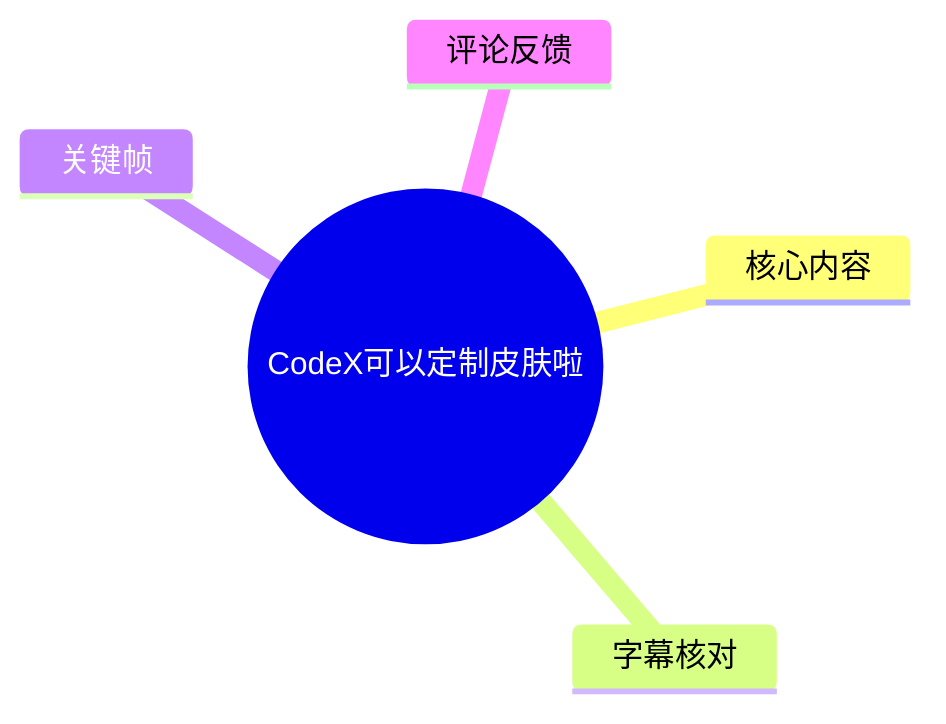
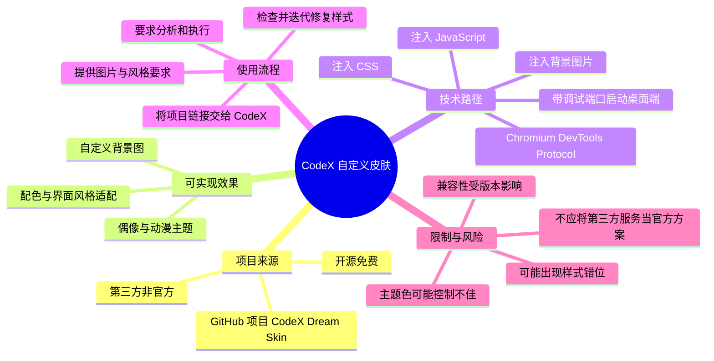
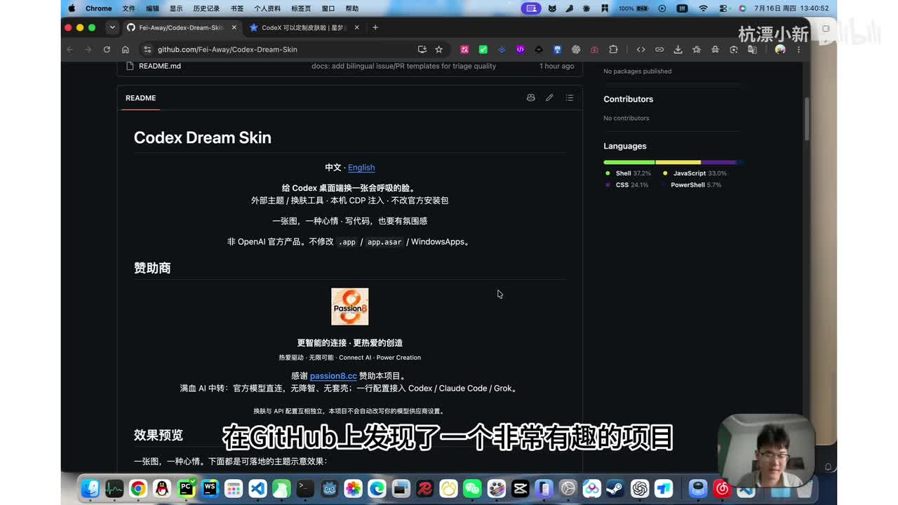
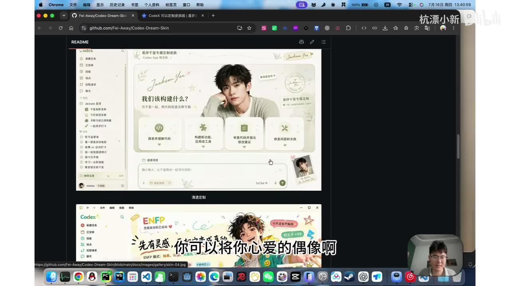
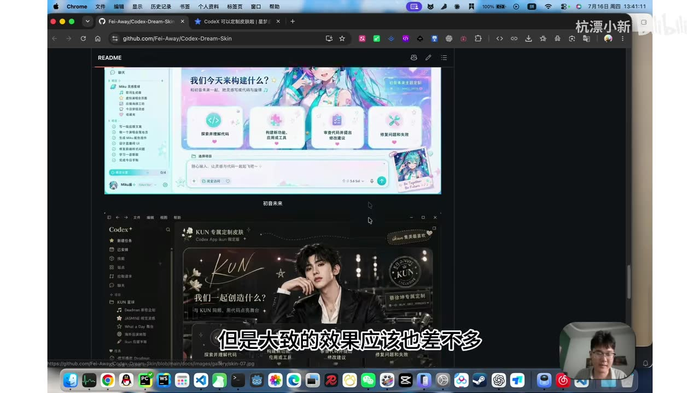
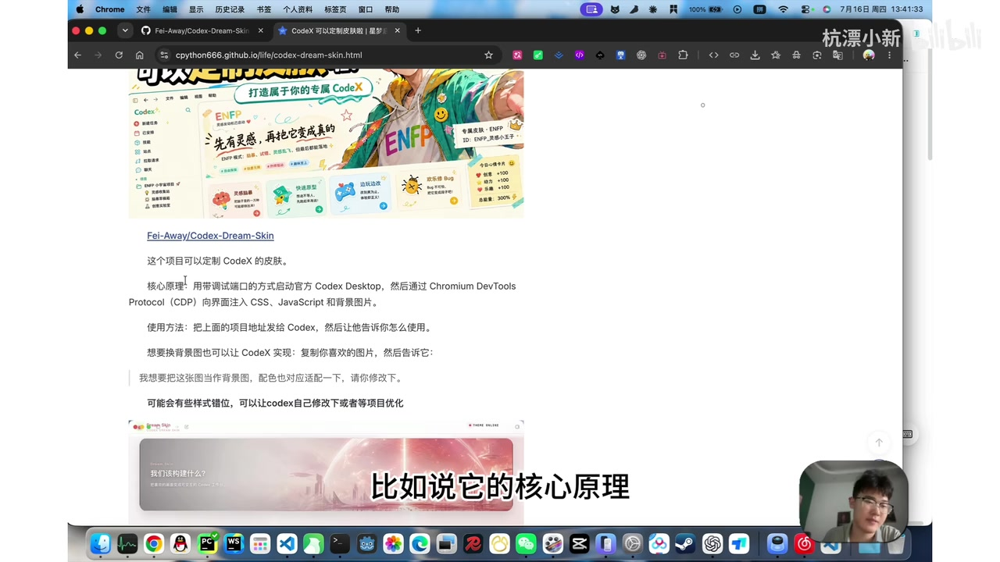

# CodeX可以定制皮肤啦

> 来源：[Bilibili 视频](https://www.bilibili.com/video/BV1oMKg6uEaB)<br>
> UP 主：杭漂小新｜发布时间：2026-07-16｜视频时长：100 秒｜合集：AIcode

## 小结

视频介绍了一个名为 **CodeX Dream Skin** 的 GitHub 开源项目。该项目的目标不是修改 CodeX 的功能逻辑，而是为 CodeX 桌面端注入自定义的视觉样式：包括 CSS、JavaScript 与背景图片，从而把应用界面改造成偶像主题、动漫主题或其他个人化风格。

UP 主说明的核心实现路径是：以**带调试端口**的方式启动 CodeX Desktop，再通过 Chromium DevTools Protocol（CDP）向页面注入样式、脚本和图片资源。视频将 CodeX 桌面端判断为基于 Chromium 内核的应用；这是 UP 主对技术原理的说明，视频未展示底层源码或启动命令，因此不应据此延伸为已完全验证的官方架构结论。

实际操作上，视频提供的是一种“让 CodeX 协助完成配置”的低门槛工作流：将项目链接发给 CodeX，请它分析使用方式并自行执行；随后再提供背景图和期望风格，要求其适配。UP 主演示了下载后的预设皮肤，并将蜘蛛侠图片设为背景进行修改，显示主题替换已生效。

视频也明确提示了效果限制：当同时要求调整主体色等多项视觉参数时，生成或注入后的样式可能出现问题；可继续让 CodeX 修复，或等待/依赖项目本身优化。该方案属于第三方、非官方的外观改造，视频画面中的项目说明也强调其**不修改 `.app`、`app.asar` 或 WindowsApps**，但这不等于没有兼容性、稳定性或安全风险。

信息具有时效性。视频发布于 2026-07-16，项目、CodeX 桌面端版本、CDP 可访问性及注入方式都可能随软件更新变化。视频末尾称该页面“开源免费”，并提到二手交易平台已出现相关服务的“价格战”；后者只是 UP 主的观察，不构成市场规模或服务可靠性的证明。

## 思维导图





## 目录

- [项目与效果预览](#项目与效果预览-000030)
- [实现原理：调试端口与 CDP 注入](#实现原理调试端口与-cdp-注入-000032)
- [实践流程：让 CodeX 协助完成皮肤适配](#实践流程让-codex-协助完成皮肤适配-000056)
- [演示结果、问题与项目定位](#演示结果问题与项目定位-000120)
- [参数、限制与时效性](#参数限制与时效性)
- [字幕比对](#字幕比对)
- [评论分析](#评论分析)
- [处理记录](#处理记录)

## [项目与效果预览](https://www.bilibili.com/video/BV1oMKg6uEaB?t=30) [00:00:30]

视频在有声内容开始时介绍：UP 主在 GitHub 上发现一个“非常有趣的项目”，其用途是为 CodeX 更换皮肤。画面展示的仓库 README 标题为 **Codex Dream Skin**，并写有“给 Codex 桌面端换一张会呼吸的脸”等描述。

从画面可见，项目展示的效果不只是更换纯色主题，而是将完整的视觉设计覆盖到 CodeX 界面中：左侧导航、主工作区、卡片、输入区域以及装饰性图片均可呈现统一主题。示例包括人物偶像风格、二次元角色风格等。UP 主指出，用户可以将喜欢的偶像或有趣图片作为背景图。



> 图：画面显示 GitHub 上的 `Fei-Away/Codex-Dream-Skin` 仓库 README，以及“外部主题/换肤工具、本机 CDP 注入、不改官方安装包”等文字。它直接说明视频讨论的是第三方本机注入方案，而不是 CodeX 官方内置换肤功能。



> 图：README 展示浅色人物主题的 CodeX 界面效果。该图用于理解“背景图 + 配色 + UI 元素”共同组成的皮肤，而非仅替换单张壁纸。



> 图：画面中并列展示初音未来风格和人物偶像风格的 CodeX 界面。这证明视频所说的“将喜欢的图片作为背景”在展示案例中覆盖了整体界面视觉语言。

视频中还提到，这类成品效果看起来像经过额外美化；但 UP 主认为，通过该项目搭配生成式工具或 CodeX 的协助，得到的实际效果应当“差不多”。这是对预期效果的个人判断，并非项目文档承诺的质量标准。

## [实现原理：调试端口与 CDP 注入](https://www.bilibili.com/video/BV1oMKg6uEaB?t=32) [00:00:32]

UP 主概括的技术链路如下：

1. 以带有**调试端口**的方式启动 CodeX 桌面端。
2. 将该桌面端视为可由 Chromium 开发者工具协议连接的页面。
3. 使用 Google/Chromium 的 **CDP（Chromium DevTools Protocol）** 与页面通信。
4. 向页面注入：
   - CSS：用于颜色、布局、字体、透明度、组件外观等；
   - JavaScript：用于执行页面级逻辑或辅助适配；
   - 背景图片：用于构成主题视觉背景。
5. 由注入后的页面呈现定制皮肤。

可将视频中的思路整理为以下关系：

```text
CodeX Desktop
  └─ 以调试端口启动
      └─ 可由 CDP 连接
          └─ 向页面写入 CSS / JavaScript / 图片资源
              └─ 形成运行时的个性化视觉界面
```

视频画面中的项目介绍进一步写明“核心原理：用带调试端口的方式启动官方 Codex Desktop，然后通过 Chromium DevTools Protocol（CDP）向界面注入 CSS、JavaScript 和背景图片”。

需要区分以下事实层次：

- **视频和画面明确陈述**：方案使用调试端口与 CDP，注入 CSS、JavaScript、背景图片。
- **UP 主的技术推断**：CodeX“本质上也是基于 Chromium 项目内核开发的一个应用”，因此可开调试端口。
- **视频未提供的关键细节**：具体启动参数、端口号、CDP WebSocket 地址、注入脚本、权限要求、不同操作系统的启动方式，以及是否需要关闭/重启应用。
- **因此不能确认的事项**：所有 CodeX 版本是否都可用、是否支持 Windows/macOS/Linux、是否会在升级后失效。



> 图：项目页面清晰显示“带调试端口启动官方 Codex Desktop”“通过 CDP 注入 CSS、JavaScript 和背景图片”等说明，并给出把项目地址发给 CodeX 的使用建议。它是视频技术说明的直接画面依据。

## [实践流程：让 CodeX 协助完成皮肤适配](https://www.bilibili.com/video/BV1oMKg6uEaB?t=56) [00:00:56]

视频提供的最简使用策略不是手动逐项配置，而是把项目链接交给 CodeX，让其承担理解说明、执行项目和迭代样式的工作。按照视频中的实际顺序，可整理为：

1. **获取项目链接**  
   找到 GitHub 上的 CodeX Dream Skin 项目地址。视频画面可见仓库地址为 `Fei-Away/Codex-Dream-Skin`；视频未提供固定安装命令或完整 URL 复制文本。

2. **把链接发送给 CodeX**  
   要求 CodeX 分析“这个页面的核心原理如何使用”，或直接询问“该如何使用”。

3. **要求其执行/使用项目**  
   UP 主建议进一步让 CodeX “自己使用”。此步骤依赖 CodeX 实际具备本机操作、读取项目文档和访问相关环境的能力；视频没有展示权限授权、确认窗口或执行日志。

4. **准备个性化输入**  
   提供两类关键内容：
   - 想用作背景的图片；
   - 想呈现的视觉风格，例如人物主题、动漫主题或指定配色。

5. **提出适配要求**  
   让 CodeX 将图片和风格需求适配到皮肤中。视频示例中，UP 主希望以蜘蛛侠作为背景，并要求修改相关风格。

6. **检查成品并进行修复**  
   观察界面中的背景、主体色和组件显示；若出现错位、颜色不协调或对比度问题，继续要求 CodeX 修改，或由项目后续优化。

视频强调的操作经验是：将自然语言需求与素材一并交给 CodeX，能够降低需要手动理解 CSS、CDP 和项目结构的门槛。但这并不意味着可以跳过验证。特别是涉及本机调试端口、脚本执行与图片来源时，应先检查项目代码、网络请求和所需权限。

## [演示结果、问题与项目定位](https://www.bilibili.com/video/BV1oMKg6uEaB?t=80) [00:01:20]

UP 主表示，前两张图是下载项目后的效果；随后展示将蜘蛛侠设为背景图并要求修改风格后的结果，认为修改已经成功。视频后段还展示了基于该项目继续与 CodeX 聊天，以及“新建聊天”页面的使用场景，说明皮肤并非仅存在于静态效果图中，而是被用于实际的 CodeX 界面。

不过，视频也记录了一个具体问题：在要求修改“主体色”等风格参数后，样式可能没有被很好控制。UP 主的判断是，让 CodeX 再修一下可能即可，或者由项目继续优化。

这体现出此类方案的常见边界：

| 项目维度 | 视频展示的情况 | 应注意的限制 |
| --- | --- | --- |
| 背景替换 | 可将指定人物/角色图片融入界面 | 背景可能影响文字与控件可读性 |
| 主题配色 | 可以要求修改相关风格和主体色 | 多颜色规则叠加时可能失控 |
| 页面覆盖 | 展示聊天与新建聊天页面 | 未证明所有页面、弹窗和设置页均适配 |
| 运行稳定性 | 视频中演示可工作 | 未展示长期运行、重启恢复和版本升级后的表现 |
| 项目性质 | 页面被称为开源免费 | 第三方项目，不等同官方支持或官方功能 |

视频末尾给出两项结论性信息：

- 该页面/项目被描述为**开源免费**，鼓励尝试；
- “小黄鱼上已经开始打价格战了”是 UP 主对闲置交易平台相关服务现象的说法。视频没有给出商家、价格、服务范围或交易证据，不能据此判断服务质量、合规性或必要性。

## 参数、限制与时效性

### 视频中明确出现的技术参数/要素

| 要素 | 视频中的信息 | 未提供的信息 |
| --- | --- | --- |
| 目标应用 | CodeX Desktop / Codex Desktop | 准确版本号、发行渠道 |
| 接入方式 | 带调试端口启动 | 启动命令、端口数值、端口绑定地址 |
| 通信协议 | Chromium DevTools Protocol（CDP） | CDP endpoint、认证方式 |
| 注入内容 | CSS、JavaScript、背景图片 | 样式文件格式、脚本内容、资源目录 |
| 操作素材 | 喜爱的图片、指定风格 | 图片分辨率、格式、版权处理方法 |
| 皮肤项目 | `Fei-Away/Codex-Dream-Skin` | 视频录制时对应 commit、release 版本 |

### 已知限制

1. **样式稳定性有限**：视频已出现主体色控制不佳、样式可能有问题的情况。
2. **缺少可复现命令**：视频没有给出终端命令、端口号或完整脚本，不能仅凭该视频完成严格复现。
3. **依赖桌面端与调试能力**：方案的前提是当前 CodeX 桌面端能够以对应方式启用调试，并接受 CDP 连接。
4. **第三方代码风险**：即使项目页面写明不修改官方安装包，仍应审阅脚本行为、依赖、权限、网络访问与本机端口暴露范围。
5. **图片与内容风险**：使用偶像、角色或其他图片前，应自行确认版权、隐私和使用场景；视频未讨论该问题。
6. **可读性与可用性权衡**：复杂背景、低对比度配色可能干扰代码阅读和聊天输入，不能仅以视觉效果判断皮肤质量。

### 时效性说明

- 元数据记录的发布时间为 **2026-07-16**，视频时长 100 秒。
- 视频中的项目状态、CodeX 功能、桌面端技术实现和市场现象均是录制时点的信息。
- 视频未展示官方公告，也未证明换肤能力为 CodeX 内置官方能力；更准确的表述是：**视频展示了一个通过第三方项目实现的 CodeX 桌面端外观定制方案。**
- 尝试前应以项目仓库最新 README、最新 release、问题区反馈及本机 CodeX 版本为准。

## 字幕比对

| 字幕来源 | 完整性 | 专有名词 | 时间轴 | 主要问题 |
| --- | --- | --- | --- | --- |
| Bilibili 站内字幕 | 未提供可用字幕，无法比对文本内容 | 无法评估 | 无法评估 | 素材中没有可用站内字幕文件 |
| 本次 ASR 字幕 | 覆盖约 68.84 秒语音，诊断覆盖率 69.43%；首段语音从 00:00:30.060 开始 | 存在明显识别误差 | 提供 4 个带毫秒的真实 SRT 分段 | 分段过长；将 CodeX/Codex、CSS、JS、Chromium、CDP 等多处识别错误 |

本次 ASR 已检查：识别语言为中文，语言置信度为 `0.99951171875`，使用 `medium` 模型、CUDA 和 `float16` 推理；诊断中**未标记 `noAudioStream=true`**，因此可确认素材存在音轨，且 ASR 结果并非因无音轨而缺失。

最终正文采用 **本次 ASR 的真实时间轴**，并以项目页面关键帧和上下文校正专有名词。关键校正如下：

| ASR 原文/近似识别 | 正文采用 | 校正依据 |
| --- | --- | --- |
| CodeS / Code S | CodeX / Codex | 视频标题、标签、项目页标题与画面 |
| 皮股 | 皮肤 | 语义及视频标题 |
| 科研项目内核 | Chromium 内核（UP 主推断） | UP 主后文提及 Google/Chromium 协议；需保留其推断性质 |
| 谷歌开发者协议 | Chromium DevTools Protocol（CDP） | 项目页画面直接写明 |
| CSS 和 GS | CSS、JavaScript | 项目页画面直接写明 |
| 这个项铺 | 这个项目 | 上下文语义 |
| 修解一下 | 修一下 | 上下文语义 |

需要注意：ASR 的第一条时间段为 `00:00:30,060 --> 00:00:31,860`，但文本实际包含项目介绍、效果预览和原理引入等大量内容；后续分段也明显偏长。因此本文只将其时间戳作为可追溯入口，不把 ASR 的断句精度视为逐句级准确定位。

## 评论分析

未获取到可分析的热评。素材中的评论结果为：

- 获取上限：热评前三条；
- 实际返回：`items: []`；
- 视频元数据中的评论数：`reply: 0`。

因此不存在可供概括、核验或讨论的热评观点；本文不以弹幕、推测性评论或外部平台内容替代评论分析。

## 处理记录

- Worker ID：`worker-mrj0wjed-b0c290ad`
- 模型：`gpt-5.6-terra`
- ASR 模型：`medium`（CUDA / `float16`，自动语言识别为中文）
- 使用素材与工具产物：视频元数据、`asr/transcript.srt`、`asr/asr-result.json`、关键帧目录 `frames/`、评论结果 `comments/comments.json`
- 字幕选择：站内字幕未提供可用文件；已检查本次 ASR，采用其 SRT 的真实起止时间建立时间轴，并用关键帧中的项目 README 校正关键术语。
- 关键帧选择依据：选用 `frame-001` 至 `frame-004`，原因是它们分别展示项目仓库定位、主题效果案例、多个风格预览，以及明确写出 CDP/CSS/JavaScript/背景图片的技术原理页面；未对未展示内容的其他帧作事实性引用。
- 缓存清理：本次任务仅使用提供的素材清单与产物引用，未产生需要额外保留的临时下载缓存；无可报告的额外缓存清理操作。
- 未解决问题：项目的确切启动参数、端口、脚本内容、受支持平台与 CodeX 版本均未在素材中提供；项目后续维护状态及对最新版本 CodeX 的兼容性也未验证。
