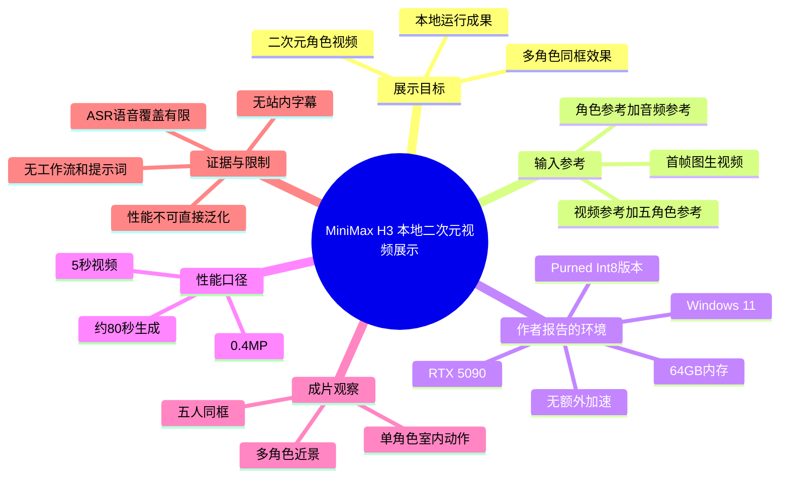
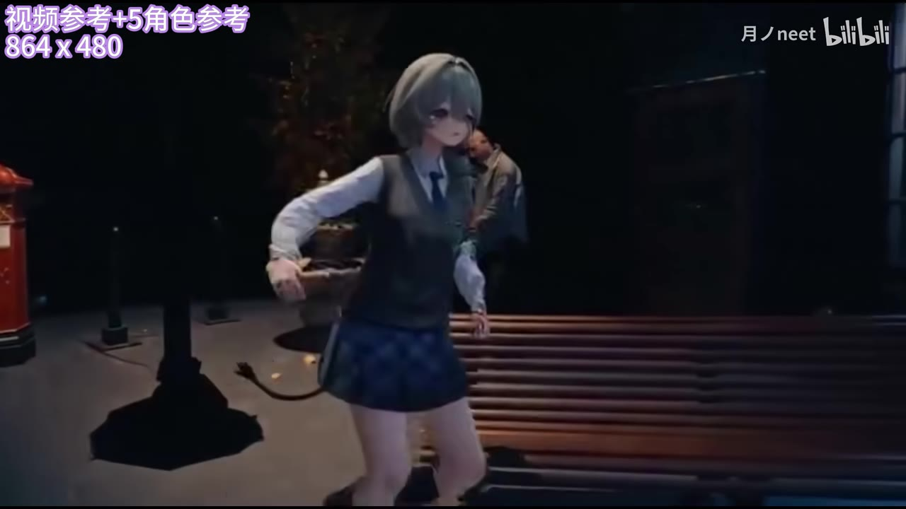

## 小结

这是一段 **42 秒的 MiniMax H3 本地运行成果展示**。UP 主月ノneet以二次元角色视频为例，展示了两种参考条件下的生成画面：一类是“角色参考 + 音频参考”，另一类是“视频参考 + 5 角色参考”。视频重点不在讲解工作流界面或安装步骤，而在于以成片展示模型对角色外观、多人同框和动作场景的生成效果。

视频简介给出了本次运行的核心技术条件：使用的是 **“Purned Int8”版本**（按原文保留拼写），硬件为 **本地 RTX 5090 + 64GB 内存**，系统为 **Windows 11**，且声明未使用额外加速；在“首帧图生视频”条件下，生成 **0.4MP、5 秒视频约需 80 秒**。这是一项作者自行报告的实测结果，不等同于不同设备、分辨率、采样配置下的通用性能承诺。

从画面标注可确认，视频至少展示了两档输入规格：`1344 × 1248` 的“角色参考 + 音频参考”，以及 `864 × 480` 的“视频参考 + 5 角色参考”。后者在关键帧中表现为五名风格不同的二次元角色共同出现在同一场景中，适合关注多角色参考、一致性与视频参考驱动效果的本地生成用户参考。

作者还说明：除“视频 + 五人参考”这一组外，其余内容均为“一次性生成，无需抽卡”。这反映的是该样例的制作经验与作者判断；素材未提供种子、提示词、采样步数、模型下载地址、ComfyUI 工作流或显存占用，因此无法复现到同等程度，也不能据此判断稳定成功率。

视频语音极少，ASR 仅识别出约 5.08 秒语音，占整段时长约 12.14%。因此，本文以**视频简介、带时间轴的 ASR、画面内文字和关键帧**共同整理，不将未展示的模型机制、工作流节点或参数补写为事实。

## 思维导图

## 目录

- [视频定位与时效性](#视频定位与时效性-0000)
- [展示一：角色参考与音频参考](#展示一角色参考与音频参考-0000)
- [展示二：视频参考与五角色参考](#展示二视频参考与五角色参考-0017)
- [本地运行条件与性能口径](#本地运行条件与性能口径-0022)
- [可复用的实践步骤与验证方法](#可复用的实践步骤与验证方法-0022)
- [结论、限制与时效性](#结论限制与时效性-0022)
- [字幕比对](#字幕比对)
- [评论分析](#评论分析)
- [处理记录](#处理记录)

# 【MiniMax H3】怎么那么牛逼！| 全模式本地运行二次元视频展示

> 来源：[Bilibili 视频](https://www.bilibili.com/video/BV1cjMd6EEo4) 
> UP 主：月ノneet｜发布时间：2026-08-03｜视频时长：42 秒｜合集：AIcode  
> 视频分辨率：1920 × 1080｜数据抓取时间：2026-08-03 22:47:57

## 视频定位与时效性 [00:00](https://www.bilibili.com/video/BV1cjMd6EEo4?t=0)

视频标题将内容定位为 **MiniMax H3 的“全模式本地运行”二次元视频展示**。标签中出现了“人工智能、视频生成、MiniMax、comfyui、MiniMaxH3、开源”等词，但视频本体和提供素材中**没有出现 ComfyUI 节点图、命令行、模型链接、许可证信息或开源仓库地址**；因此，“ComfyUI”“开源”只能视为站内标签提供的关联线索，不能据此推定具体部署方式。

开场 ASR 语音为“看什么看”。这句更像成片中的角色台词或音频内容，而不是技术说明。由于视频主要用成片画面传达效果，理解重点应放在输入参考类型、多人场景表现，以及简介中提供的运行条件。

> 图：关键帧左上角直接标注“角色参考 + 音频参考 1344 X 1248”。它是确认第一组展示输入条件与参考图尺寸的直接画面证据；画面主体为空白/浅色区域，未展示具体生成角色动作。

### 信息时效说明

- 本文记录的是抓取时可见的投稿元数据与视频简介，发布时间为 **2026-08-03**。
- 视频生成模型的权重版本、量化版本、运行插件和性能表现会随模型更新、驱动版本、推理框架及工作流变化而变化。
- 简介中的硬件耗时是作者在特定环境中的陈述，具有时效性和机器依赖性，不应视为 MiniMax H3 的固定官方指标。

## 展示一：角色参考与音频参考 [00:00](https://www.bilibili.com/video/BV1cjMd6EEo4?t=0)

画面内的第一组标注为：

| 项目 | 画面可确认的信息 |
| --- | --- |
| 输入形式 | 角色参考 + 音频参考 |
| 参考图尺寸 | 1344 × 1248 |
| 可见用途 | 以角色视觉参考与音频内容驱动/辅助二次元视频展示 |
| 可确认范围 | 能确认画面标注；不能从素材确定音频如何参与条件控制、提示词内容或角色参考数量 |

在后续单人场景关键帧中，可见一名灰发二次元角色站在昏暗室内空间，背景包含座椅、台阶、立柱与装饰物。该画面说明视频展示的结果不是单纯静态肖像，而是包含人物姿态、环境、镜头构图的动态视频片段。

> 图：该关键帧呈现灰发角色位于室内场景、身体处于动作姿势的画面。其价值在于补足“角色参考 + 音频参考”标注之外的成片观感：视频尝试同时维持二次元人物形象与较复杂的室内环境构图。该帧未附原始时间戳，故不为其虚构具体秒数。

需要注意：仅凭单帧不能验证视频中的角色身份锁定、嘴型同步、时序稳定性、长视频漂移或音频语义一致性。ASR 仅在开头、17 秒附近与 22—25 秒附近识别出零星语音，也不足以单独证明音频驱动质量。

## 展示二：视频参考与五角色参考 [00:17](https://www.bilibili.com/video/BV1cjMd6EEo4?t=17)

ASR 在 `00:00:17,350 → 00:00:17,950` 仅识别出“就”，属于孤立词，未提供可用于解释技术设置的完整语句。此处仍以画面内文字为主要证据。

关键帧左上角标注第二组展示条件为：

- **视频参考 + 5 角色参考**
- **864 × 480**

这表示该样例至少包含一个视频参考源，并同时使用五名角色作为参考条件。画面中可见多位二次元人物在同一室内座椅区域活动；素材简介也特别把“视频 + 五人参考”列为例外项。

> 图：画面左上显示“视频参考 + 5角色参考 864 X 480”。前景包含灰发角色、右侧金发黑衣角色，以及边缘可见的另一名角色；这张图适合用于确认该段不是单人参考展示，而是多人角色共同入镜的场景。

> 图：该关键帧可清楚看到五名不同外观、服装和发色的二次元角色同处座椅前后景。它是“5角色参考”在成片中得到视觉呈现的关键证据，也有助于观察视频试图处理的多主体构图问题；但单帧不能证明每一名角色均严格对应某一独立参考图。

### 作者关于生成次数的说明

视频简介原文称：

> “除了视频+五人参考，所有内容为一次性生成，无需抽卡”

可据此作如下谨慎整理：

1. **“一次性生成”**是作者对除“视频 + 五人参考”组以外内容的制作过程描述。
2. **“视频 + 五人参考”**被单独排除，说明该组不应直接套用“一次性生成”的说法；但素材没有说明它实际生成了几次、是否重抽、是否做了挑选或后期。
3. **“无需抽卡”**是生成社区语境中的主观表达，通常指作者认为无需依靠大量重复生成来挑选可用结果；它不是可量化的成功率指标。

## 本地运行条件与性能口径 [00:22](https://www.bilibili.com/video/BV1cjMd6EEo4?t=22)

ASR 在 `00:00:22,180 → 00:00:25,740` 识别为“这么看着啊变态君被发现了”。这是成片中的口语内容，并未补充模型参数。技术条件主要来自视频简介，整理如下：

| 维度 | 作者提供的信息 | 解读边界 |
| --- | --- | --- |
| 模型版本 | “模型全部为 Purned Int8 版本” | 原文写作“Purned”，素材未给出模型文件名、来源或量化方法，不能擅自校正为其他术语。 |
| GPU | 本地 5090 | 未说明显存容量、驱动版本、功耗策略、是否有其他 GPU 参与。 |
| 内存 | 64GB | 未说明内存频率、虚拟内存设置及实际峰值占用。 |
| 系统 | Windows 11 | 未说明系统版本号、CUDA、PyTorch 或 Python 版本。 |
| 额外加速 | 无额外加速 | 不等于未使用 GPU、量化或推理框架自身优化；仅能按作者陈述理解。 |
| 生成模式 | 首帧图生视频 | 表明以首帧图像作为视频生成条件之一；未披露首帧来源和预处理流程。 |
| 输出尺度 | 0.4MP | 约 40 万像素量级；素材没有给出确切宽高组合。 |
| 输出时长 | 5 秒 | 仅针对作者所述测试样例。 |
| 耗时 | 约 80 秒 | 对应上述 0.4MP、5 秒、首帧图生视频及其本机环境的组合口径。 |

若仅按作者披露的时长换算，**5 秒视频约用时 80 秒**，即生成墙钟时间约为成片时长的 **16 倍**，或约 **0.0625 倍实时**。这个计算仅用于理解该条简介中的性能口径，不能外推为其他分辨率、帧率、模型模式或硬件环境的速度。

### 未披露、不可补写的决定性参数

以下参数会显著影响视频生成质量和速度，但本素材均未给出：

- MiniMax H3 的具体权重名称、版本号、发布日期与下载渠道；
- 输入视频长度、帧率、裁切方式及编码格式；
- 输出视频的准确分辨率、帧率、总帧数和编码设置；
- 提示词、负面提示词、随机种子、采样器、采样步数、CFG 等配置；
- 五个角色参考图的独立输入形式、角色绑定机制与参考权重；
- 显存占用、CPU 占用、磁盘空间和加载时间；
- 是否使用补帧、超分、去噪、剪辑、调色或其他后处理。

## 可复用的实践步骤与验证方法 [00:22](https://www.bilibili.com/video/BV1cjMd6EEo4?t=22)

视频没有提供可照抄的部署教程，以下内容是依据已展示的输入类型和作者披露条件整理的**验证流程**，用于避免把未公开设置误认为固定工作流。

### 1. 先明确要复现的展示模式

根据画面可确认，至少应区分两类测试目标：

1. **角色参考 + 音频参考**：观察单角色外观与音频相关表现。
2. **视频参考 + 5 角色参考**：观察视频动作/镜头参考与五名角色共同出现时的构图和角色区分度。

不要把两类结果混为同一难度等级：多角色参考、视频参考与单角色参考可能需要不同的资源、输入组织和调试次数。

### 2. 固定作者已披露的基准口径

若要与视频简介中的速度描述做近似对照，应尽可能使测试口径接近：

- 首帧图生视频；
- 输出约 0.4MP；
- 输出时长 5 秒；
- Int8 版本；
- Windows 11；
- 不额外叠加未说明的加速方案。

这只能构成**对照基线**，而非完整复现条件。尤其是“5090 + 64GB”只是作者机器配置的一部分，驱动、框架和模型实现差异都可能改变结果。

### 3. 分层测试，而非直接挑战五角色场景

建议按难度递增记录：

1. 单角色、单一室内场景；
2. 单角色、含动作变化或镜头变化；
3. 少量角色共同入镜；
4. 视频参考下的五角色同框。

每一层都应保存输入参考、模型版本、随机种子、输出尺寸、时长、耗时和失败样例。这样才能判断问题来自角色一致性、动作迁移、遮挡关系，还是显存与推理速度。

### 4. 对多人结果做针对性检查

对于“视频参考 + 5 角色参考”的结果，建议逐项检查：

- 每个角色的发色、服装轮廓、配饰是否可辨；
- 人物数量是否始终正确；
- 前后遮挡时是否出现肢体交叉、人物融合或身份交换；
- 镜头运动后人物是否保持各自特征；
- 角色是否在不同帧中无故消失、增生或变形；
- 生成视频是否与参考视频的动作、构图或节奏存在可识别关系。

视频提供的关键帧能够证明成片里出现了五人同框，但不足以覆盖完整时序，因此实际评估必须查看连续视频而非只看截图。

### 5. 用统一指标记录性能

不要只记“快”或“80 秒”。至少同时记录：

| 建议记录项 | 用途 |
| --- | --- |
| 输出宽 × 高 | 将“0.4MP”落实为精确像素规模 |
| 成片时长与帧率 | 判断总帧数与生成负荷 |
| 首次加载时间 | 与纯生成耗时分开 |
| 单次生成耗时 | 与作者“80 秒”口径对照 |
| 显存峰值与内存峰值 | 判断本地部署门槛 |
| 成功/失败次数 | 检验“一次性生成、无需抽卡”是否可复现 |
| 输入类型与参考数量 | 区分单人和多人模式的性能差异 |
| 是否后处理 | 避免将补帧、超分结果误计入模型原生输出 |

## 结论、限制与时效性 [00:22](https://www.bilibili.com/video/BV1cjMd6EEo4?t=22)

这条视频的主要价值，是快速给出一个本地二次元视频生成案例：在作者标注的条件下，既有“角色参考 + 音频参考”的单角色展示，也有“视频参考 + 5 角色参考”的多人同框展示。关键帧中的多角色画面是评估其展示目标的重要依据，因为它涉及生成视频中更难的主体数量、角色差异和共同构图问题。

可以迁移的经验是：评价本地视频模型时，应把**输入模式、参考数量、输出像素规模、视频时长、硬件环境和是否额外加速**作为一个整体记录。孤立地谈“80 秒生成”或“支持五角色”没有可比性。

同时，本视频的证据边界明确：

- 它是短成片展示，不是完整教程；
- 性能数值来自作者简介，未见可复核日志；
- 未提供模型来源、权重版本、工作流和全部推理参数；
- 没有披露“视频 + 五人参考”组的具体生成次数；
- 关键帧仅能证明局部视觉效果，无法完整证明长时序稳定性；
- ASR 语音内容很少，不能从语音中补出技术细节。

因此，该视频适合用作“MiniMax H3 本地二次元视频效果与作者测试口径”的案例记录，不适合作为无需补充资料即可复现的操作指南。

## 字幕比对

| 字幕来源 | 完整性 | 专有名词 | 时间轴 | 主要问题 |
| --- | --- | --- | --- | --- |
| Bilibili 站内字幕 | 未提供可用站内字幕 | 无法核验 | 无法使用 | 素材明确说明未提供可用站内字幕。 |
| 本次 ASR 字幕 | 较低：3 段、约 5.08 秒语音，覆盖约 12.14% 视频时长 | 未识别出 MiniMax H3、Purned Int8、5090 等技术词 | 可用：提供毫秒级起止时间 | 内容为零星口语，未转写画面内技术标注和视频简介参数。 |

### ASR 核查结果与最终字幕策略

本次 ASR 使用模型为 `large-v3-turbo`，识别语言为中文，语言置信度约 `0.7808`。音频时长为 `41.842375` 秒，说明该视频**存在音轨**；诊断信息中没有 `noAudioStream=true` 标记，不能将低语音覆盖误判为无音轨或工具失败。

可直接使用的 ASR 分段如下：

| 时间 | ASR 文本 | 采用方式 |
| --- | --- | --- |
| 00:00:00.020–00:00:00.940 | 看什么看 | 作为开场口语记录。 |
| 00:00:17.350–00:00:17.950 | 就 | 保留原样；语义孤立，不扩写。 |
| 00:00:22.180–00:00:25.740 | 这么看着啊变态君被发现了 | 作为成片口语记录，不视为技术讲解。 |

最终未采用“站内字幕优先”的合并方案，原因是站内字幕缺失；正文的技术信息以**视频简介原文和画面内标注**为主，以 ASR 的真实时间轴定位口语片段。经关键帧校正/补足的关键信息包括：

- `角色参考 + 音频参考 1344 × 1248`；
- `视频参考 + 5角色参考 864 × 480`；
- 多角色同框的可视化呈现。

这些内容并非 ASR 识别所得，而是来自关键帧画面文字，已在正文中明确区分。

## 评论分析

以下仅分析可获取的热评前三条；评论反映的是观众态度，不作为模型能力或行业事实的验证依据。

1. **EnlsxTen令羽（30 赞）**  
   评论以“seedance2主管首次体验MiniMax H3，被吓到眩晕瘫坐”及“原子弹爆炸”等夸张表述强调震撼感。该评论没有给出可核验的测试条件、对比视频或人物身份来源，属于玩梗式正面评价，不能证明 MiniMax H3 相对其他模型的客观领先程度。

2. **听鲁迅的话二世（31 赞）**  
   评论称“我还以为视频模型开源已经似完了，还有人在坚持真不错”。其补充的是观众对视频模型开源生态的主观感受，表达对持续开发的肯定。视频标签虽含“开源”，但本素材未提供具体开源地址、许可证或项目状态，故不能据此确认 MiniMax H3 的开源状况或整个领域的发展结论。

3. **道梦タオモン（9 赞）**  
   评论“核弹爆炸了！”直接呼应 UP 主简介中重复出现的情绪化措辞，表达对展示效果的强烈惊讶。该评论没有新增技术信息，可信度层面仅能作为社区情绪反馈。

整体而言，前三条热评均为高度正向、偏玩梗式反应，未形成关于模型版本、可复现性、速度或多角色稳定性的实证讨论。

## 处理记录

- Worker ID：`worker-mrj0www4-e8d79408`
- 模型：`gpt-5.6-terra`
- ASR 模型：`large-v3-turbo`（CUDA，`int8_float16`）
- 使用的素材与工具结果：视频元数据、视频简介、关键帧目录、ASR 时间轴字幕与诊断结果、热评接口返回的前三条评论。
- 字幕选择：站内字幕未提供可用内容；已检查并采用本次 ASR 的 3 个真实时间段用于定位口语。技术部分结合视频简介和画面内文字整理。
- 关键帧选择依据：
  - `frames/frame-001.jpg`：含“角色参考 + 音频参考 1344 × 1248”直接标注；
  - `frames/frame-002.jpg`：展示单角色在室内场景中的动作构图；
  - `frames/frame-003.jpg`：含“视频参考 + 5角色参考 864 × 480”直接标注；
  - `frames/frame-004.jpg`：直观展示五名角色同框，是多人参考效果的核心画面证据。
- 时间轴依据：仅使用 ASR 提供的真实起止时间换算秒数，正文链接使用 `t=0`、`t=17`、`t=22`；未为无时间戳关键帧推测具体秒数。
- 缓存清理：提供的素材中未包含缓存清理日志，无法确认是否执行清理；本文不宣称已清理。
- 未解决问题：缺少完整工作流、权重来源与版本号、提示词、种子、采样参数、显存记录、输出帧率，以及“视频 + 五人参考”组的生成次数和连续时序质量证据。
