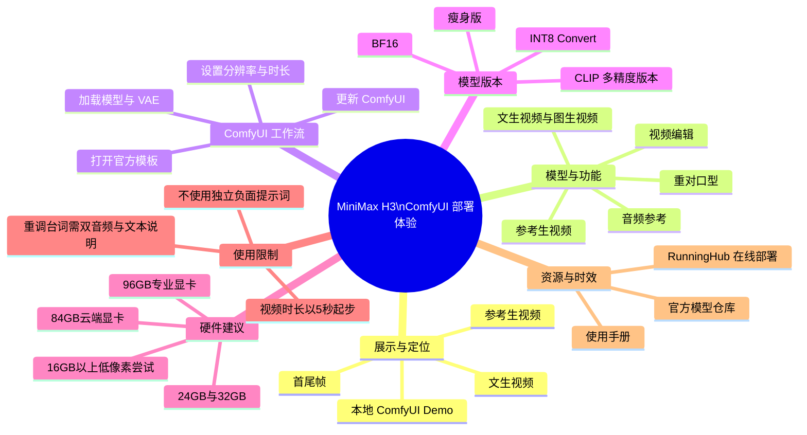

# 当梦想照进开源！目前最强开源视频模型Minimax H3 Comfyui部署体验！

> 来源：[Bilibili 视频](https://www.bilibili.com/video/BV1VmMX68EZL) 
> UP 主：AIwood爱屋研究室｜视频时长：08:01｜合集：AIcode  
> 注：标题中的“目前最强”是视频作者的评价性表述，并非本文独立性能评测结论。

## 小结

本视频展示并讲解了 MiniMax H3（视频中亦称“海螺 3”）在 ComfyUI 中的本地部署与工作流使用。作者先用多段本地 ComfyUI 生成的 Demo 展示文生视频、首尾帧、参考生视频及音频参考等效果，随后强调该模型已经开源，并在发布时获得 ComfyUI 模板支持。

视频的核心实践路径是：先更新 ComfyUI，再从模板中打开 MiniMax H3 的文生视频、参考生视频或图生视频工作流；根据显存选择像素档位和模型精度；加载主模型、CLIP、音频 VAE 与视频 VAE；最后按任务接入文本、图像、视频及音频条件。

与普通文生视频、图生视频相比，作者重点介绍了 `H3 Reference to Video` 节点：它最多可使用 9 张参考图，并可接入参考视频和参考音频。视频称，这套输入组合可用于角色参考、视频编辑、跟音频动作/口型，以及修改原视频台词等任务。

硬件限制是本视频最需要注意的部分：作者将 BF16 版本定位为适合大显存设备，例如 96GB 的专业显卡；对 16GB、24GB、32GB 左右显存，建议从约 0.4～0.7 百万像素的分辨率档位尝试。该建议来自作者经验，不应视为官方最低配置或必然成功的阈值。

信息具有明显时效性。视频发布时，作者称 ComfyUI 已提供相关模板、模型可从 Hugging Face 与魔搭下载，且 RunningHub 已提供线上运行入口和 84GB 显存的 RTX PRO 6000D 选项。模型文件、模板、云端显卡、链接有效性与价格均可能在后续变动，应以对应平台当前页面为准。

## 思维导图

## 目录

- [开场 Demo 与开源定位](#开场-demo-与开源定位)
- [模型能力、版本与 ComfyUI 模板](#模型能力版本与-comfyui-模板)
- [基础工作流：更新、分辨率与显存选择](#基础工作流更新分辨率与显存选择)
- [模型组件加载与提示词规则](#模型组件加载与提示词规则)
- [参考生视频：多图、视频、音频与台词修改](#参考生视频多图视频音频与台词修改)
- [资源入口、线上部署与作者结论](#资源入口线上部署与作者结论)
- [完整操作清单](#完整操作清单)
- [限制、风险与时效性](#限制风险与时效性)
- [字幕比对](#字幕比对)
- [评论分析](#评论分析)
- [处理记录](#处理记录)

## 开场 Demo 与开源定位

### 开场样片与任务类型 [00:00:00](https://www.bilibili.com/video/BV1VmMX68EZL?t=0)

作者开场说明将先展示几个视频样片，并称这些视频由“刚刚出现的最新视频模型”生成。画面中持续标注“所有 DEMO 视频均为本地 COMFYUI 生成”，用于强调演示并非网页端闭源服务的直接输出。

展示片段涉及多种控制形式：文生视频、首尾帧生成、参考生视频，以及以人物/场景素材为条件的视频结果。开头存在较长的纯样片段，因此 ASR 在 00:00:07 后至 00:00:24 前、以及后续若干处没有连续旁白；这些空档不应被误解为字幕漏识别。

> 图：画面右下角标注“文生视频”，左下角标注“所有DEMO视频均为本地COMFYUI生成”。它直接对应作者后文“可在本地运行”的主张，是理解视频演示范围的重要证据。

> 图：画面右下角标注“首尾帧”，且顶部嵌有角色画面参考。这张关键帧说明视频并非只讨论纯文本生成，也覆盖了首尾画面约束的生成方式。

> 图：画面右下角标注“参考生视频”，主体为戏曲人物演出画面与拼贴式参考素材。它帮助区分“参考驱动”与单纯文生、图生任务。

### “开源、本地运行”的作者判断 [00:01:41](https://www.bilibili.com/video/BV1VmMX68EZL?t=101)

作者在样片之后提出：如果这些效果来自“完全开源、可在本地运行”的模型，会如何评价；随后在 [00:02:00](https://www.bilibili.com/video/BV1VmMX68EZL?t=120) 将其称为 MiniMax H3/海螺 3，并使用强烈修辞表达其对开源视频模型竞争格局的看法。

这里应区分三个层次：

1. **视频可确认的陈述**：作者表示该模型开源，并可通过 ComfyUI 在本地运行。
2. **作者的体验判断**：作者认为它代表开源社区中能力很强的视频模型，并将其与闭源产品体验对比。
3. **本文不作外部验证的内容**：“最强”“对标某一闭源产品”等排名或性能结论，视频未给出统一基准、测试提示词、推理时长、显卡环境、失败率或横向评测表，因此不能据此作为严格性能排名。

> 图：画面以一名奔跑儿童为主体，并保留“所有DEMO视频均为本地COMFYUI生成”的标注。它补充展示了视频所强调的真实感人物运动类效果，但单帧无法证明跨帧稳定性、时长一致性或动作可控性。

## 模型能力、版本与 ComfyUI 模板

### 能力范围与精度版本 [00:02:14](https://www.bilibili.com/video/BV1VmMX68EZL?t=134)

作者称 MiniMax H3 在发布时已与 ComfyUI 预先协作，实现“Day 0”模板支持。按视频口述，模型/工作流能力包括：

- 文生视频；
- 图生视频；
- 首尾帧；
- 参考生视频；
- 音频参考；
- 视频编辑；
- 重新对口型。

作者还提到 ComfyUI 侧准备了多个模型版本：

| 视频中提及的版本 | 作者给出的定位 | 适用条件/注意点 |
| --- | --- | --- |
| BF16 | 完整或高规格版本 | 作者举例适合 96GB 显存级别的专业显卡；普通用户可能难以本地运行。 |
| INT8 Convert | 量化/转换版本 | 视频未说明具体质量损失、速度差异或完整显存占用，应自行实测。 |
| 瘦身版 | 面向较低显存 | 视频未给出具体名称、最低显存、分辨率和质量边界。 |
| CLIP：BF16、INT8、NVFP4 | 依硬件配置选择 | 作者特别提醒 CLIP 本身也较大，下载和显存规划不能忽略。 |

视频中 ASR 对模型名与技术词存在明显转写问题，例如“Conf UI”“POR6000”“BFL6”等；结合视频标题、描述链接与上下文，本文统一写作 **ComfyUI、RTX PRO 6000/6000D、BF16**。但这属于基于上下文的术语校正，具体模型文件名仍应以官方仓库为准。

### 更新 ComfyUI 并启用模板 [00:03:03](https://www.bilibili.com/video/BV1VmMX68EZL?t=183)

作者给出的第一步是更新 ComfyUI。更新后，在模板中可见 3 类 MiniMax H3 工作流：

1. 文生视频；
2. 参考生视频；
3. 图生视频。

作者的观察是：三类工作流都相对简洁，文生视频和图生视频与既有视频生成工作流的操作较接近；因此视频将更多篇幅放在参考生视频上。

这一段没有给出 ComfyUI 的具体版本号、更新命令、插件版本、节点包安装方式或操作系统前置条件。因此，实际部署时不能只依据“更新 ComfyUI”一句完成配置；若模板未出现，需回到 ComfyUI 官方发布页或模型仓库核查当前安装说明。

## 基础工作流：更新、分辨率与显存选择

### 分辨率选择器与百万像素档位 [00:03:27](https://www.bilibili.com/video/BV1VmMX68EZL?t=207)

文生视频工作流中，作者首先讲解分辨率选择器：可设置输出宽度和高度，界面同时以“百万像素”提供参考。视频提到，ComfyUI 模板会帮助用户理解类似 `0.6 MP` 的像素档位大致对应何种分辨率。

作者的核心经验是：**按显存能力而非一味按分辨率上限选择像素档位**。视频并未给出每个像素档对应的准确宽高，因此不能在此补写未展示的分辨率数值。

### 显存与分辨率经验建议 [00:03:51](https://www.bilibili.com/video/BV1VmMX68EZL?t=231)

作者针对不同显存给出如下建议：

| 显存/设备条件 | 视频中的建议 |
| --- | --- |
| 16GB 及以上、24GB、约 32GB 显存 | 可尝试约 `0.4～0.5 MP`，或 `0.7 MP` 档位。原话表达为大致区间，未保证全部设备均可稳定运行。 |
| 约 96GB 显存的 RTX PRO 6000 等设备 | 可把分辨率“拉满”，作者称可到 2K。 |
| 显存较低设备 | 使用瘦身版并下调像素档位，但视频未给出具体下限。 |

应注意，显存占用不只由主模型决定，还会受以下因素影响：模型精度、CLIP 精度、音频/视频 VAE、输入图像数量、参考视频与音频、生成长度、后台显存占用及 ComfyUI 内存管理策略。故视频给出的 `0.4～0.7 MP` 应被视为起步经验，不是兼容性承诺。

## 模型组件加载与提示词规则

### 主模型、CLIP 与双 VAE [00:04:15](https://www.bilibili.com/video/BV1VmMX68EZL?t=255)

作者说明需要加载多类模型组件，关键区别如下：

| 组件 | 视频中的说明 | 任务关系 |
| --- | --- | --- |
| 主模型：`FL2V`（ASR 名称，疑似转写） | 适用于文生视频与图生视频 | 在对应的文生/图生工作流中选择。 |
| 主模型：`Reference2V`（ASR 名称，疑似转写） | 适用于参考生视频 | 用于带参考图、参考视频或参考音频的任务。 |
| CLIP | 提供 BF16、INT8、NVFP4 等版本 | 根据本机配置选择；作者提醒其文件体积也较大。 |
| Audio VAE | 音频 VAE | 与音频相关输入/输出链路有关。 |
| Video VAE | 视频 VAE | 与视频编解码/潜空间处理有关。 |

作者表示可从 ComfyUI 官方的 Hugging Face 地址或魔搭地址下载模型。视频描述区确实提供了以下入口：

- [Hugging Face：Comfy-Org/MiniMax-H3](https://huggingface.co/Comfy-Org/MiniMax-H3/tree/main)
- [魔搭：Comfy-Org/MiniMax-H3](https://modelscope.cn/models/Comfy-Org/MiniMax-H3/files)

由于 ASR 无法可靠识别完整英文模型文件名，且视频文本未列出目录结构，实际下载时应以官方仓库内与所选工作流相匹配的文件说明为准，不建议仅按本文中经过转写校正的名称搜索。

### 不使用独立负面提示词与视频长度 [00:05:03](https://www.bilibili.com/video/BV1VmMX68EZL?t=303)

作者强调 MiniMax H3 的提示词操作与许多带“正向/负向提示词”输入框的模型不同：

- **不需要独立的负面提示词框。**
- 希望避免的内容，可直接写在同一个提示词框中，以“不需要……”“不要……”等自然语言表达。
- 工作流中的 `Length`（长度）选项控制生成视频时长。
- 视频给出的起始值为 `5`，对应 **5 秒**，之后可以递增。

这意味着迁移既有工作流时，不应机械复制“负面提示词”节点或把负面词单独投喂到不存在的输入端。至于提示词的最佳句式、长度上限、语言偏好和复杂指令的服从能力，作者建议查阅官方手册，视频本身未给出系统化对比测试。

## 参考生视频：多图、视频、音频与台词修改

### `H3 Reference to Video` 的输入能力 [00:05:28](https://www.bilibili.com/video/BV1VmMX68EZL?t=328)

作者将参考生视频作为本期重点，指出 `H3 Reference to Video` 节点可接入：

- 最多 **9 张参考图片**；
- 参考视频；
- 参考音频。

按作者描述，这些条件可用于把人物、服装、风格或场景等视觉参考带入生成，并可把既有视频作为编辑基础。注意，“最多 9 张”是视频中对该节点能力的直接说明；不同版本模板的端口数量可能随更新变化。

### 视频编辑、动作跟随与口型跟随 [00:05:52](https://www.bilibili.com/video/BV1VmMX68EZL?t=352)

作者给出的视频编辑逻辑是：

1. 将现有视频接入“参考视频”输入；
2. 按需提供参考音频；
3. 让角色跟随新音频跳舞，或让角色按新音频的口型说话；
4. 也可以借由参考音频改造参考视频中的台词。

这是一种“视觉参考 + 音频条件 + 文本说明”协同控制的思路。视频没有展示每种任务的完整节点截图、实际提示词全文和生成前后对照，因此无法据此判断口型同步精度、人物身份保持率、动作转移范围或长视频稳定性。

### 修改原视频台词的必要输入 [00:06:16](https://www.bilibili.com/video/BV1VmMX68EZL?t=376)

对于“调整原视频音频/台词”的具体场景，作者给出了比一般参考生视频更严格的流程：

1. 将**原视频**接入参考视频；
2. 将**原视频的原始音频**接入 `Reference Video Audios`；
3. 再接入一条**新的音频**；
4. 在提示词中同时写明：
   - 原音频中说话的内容；
   - 新音频中说话的内容；
5. 按官方规定的格式设置提示词和输入。

作者认为按此方式可实现原台词调整。这里的关键限制是：视频没有展示“以上格式”的具体模板文本，因此不能凭空补充提示词格式。应以官方手册中的音频参考/视频编辑章节为准。

## 资源入口、线上部署与作者结论

### 手册、模型下载与在线体验 [00:06:40](https://www.bilibili.com/video/BV1VmMX68EZL?t=400)

作者建议查看 MiniMax H3 使用手册，称其中包含功能说明、任务参考与不同任务的提示词写法。视频描述区提供的资源包括：

- [MiniMax H3 提示词手册](https://vrfi1sk8a0.feishu.cn/wiki/FIWjwgL33ipnkekzk30crmKUnIh)
- [作者提供的模型网盘地址](https://pan.quark.cn/s/7441a9d634f1)
- [Hugging Face 模型页](https://huggingface.co/Comfy-Org/MiniMax-H3/tree/main)
- [魔搭模型页](https://modelscope.cn/models/Comfy-Org/MiniMax-H3/files)
- [RunningHub：MiniMax T2V](https://www.runninghub.cn/post/2084151579204214786/?inviteCode=kol01-rh149)
- [RunningHub：MiniMax H3 I2V / 首尾帧](https://www.runninghub.cn/post/2084148989418622977/?inviteCode=kol01-rh149)
- [RunningHub：MiniMax H3 参考生视频](https://www.runninghub.cn/post/2084156059366813698/?inviteCode=kol01-rh149)

作者称因 BF16 模式可能超出大多数用户的本地硬件能力，未额外上传工作流，建议用户直接在官方模板中打开相应工作流。

### RunningHub 与作者的开源评价 [00:07:04](https://www.bilibili.com/video/BV1VmMX68EZL?t=424)

作者称 RunningHub 为配合 MiniMax H3 发布上线了 RTX PRO 6000D 显卡，用户可在 Ultra 模式中选择 **84GB 显存**的该卡运行模型。该内容属于视频发布当时的服务信息；实际可用显卡型号、显存显示、排队情况、计费方式与活动规则需要以 RunningHub 当前页面为准。

在结尾处，作者将本次开源视为本地高质量视频生成的重要节点，认为相比一个月前依赖付费闭源模型的方式，用户获得了更可控的本地选择。这是对开源可得性和成本体验的价值判断。视频未提供本地推理速度、总下载体积、功耗、每秒生成成本或与闭源产品的一致测试，因此这些问题仍需实测补充。

## 完整操作清单

### 最小实践路径 [00:03:03](https://www.bilibili.com/video/BV1VmMX68EZL?t=183)

以下流程严格按视频讲述顺序整理；未出现的版本号、命令行命令与文件路径不作补写。

1. **更新 ComfyUI**
   - 更新后检查模板中是否出现 MiniMax H3 工作流。
   - 视频提到的模板类别为：文生视频、参考生视频、图生视频。

2. **根据任务选择工作流**
   - 仅从文本描述生成：选择文生视频。
   - 以图像作为起始/视觉条件：选择图生视频。
   - 需要多图角色参考、视频编辑、音频驱动或台词改造：选择参考生视频。

3. **设定分辨率**
   - 在分辨率选择器中设置宽高与百万像素档。
   - 16GB～32GB 级显存优先从作者建议的 `0.4～0.5 MP` 或 `0.7 MP` 附近试起。
   - 高显存专业设备再逐步提高分辨率；不要直接把作者的“可到 2K”视为所有工作流的默认安全值。

4. **选择模型精度与加载组件**
   - 依据任务选择文生/图生主模型或参考生视频主模型。
   - 依据显存选择 BF16、INT8 Convert 或更低显存取向版本。
   - 加载与本机资源匹配的 CLIP 版本。
   - 确认音频 VAE 与视频 VAE 均已按工作流要求加载。

5. **填写提示词**
   - 使用单一提示词框。
   - 若有需要排除的内容，直接在该提示词中以自然语言说明“不需要什么”。
   - 不要沿用其他模型中独立负面提示词节点的操作习惯。

6. **设置视频时长**
   - 将 `Length=5` 理解为 5 秒。
   - 需要更长视频时逐步增加，并同步观察显存、耗时与稳定性。

7. **参考生视频的额外输入**
   - 最多可输入 9 张参考图。
   - 可加入参考视频与参考音频。
   - 若修改原视频台词，必须同时准备原音频与新音频，并在提示词中明确原台词、新台词，格式参考官方手册。

8. **验证输出**
   - 检查人物身份、服饰、镜头、动作、音画同步与台词是否符合预期。
   - 视频未给出固定采样参数、随机种子或重试策略；若结果不稳定，应记录本机配置与输入条件后自行迭代，而非将作者样片视为可无条件复现的结果。

## 限制、风险与时效性

### 本地部署限制 [00:04:15](https://www.bilibili.com/video/BV1VmMX68EZL?t=255)

- **显存门槛高**：作者明确表示 BF16 版本可能不适合绝大多数用户，且大显存设备更适合高像素或高规格模型。
- **模型组件不止一个**：主模型之外还有 CLIP、音频 VAE、视频 VAE，完整下载与加载成本不能忽略。
- **视频未提供可复现基准**：没有列出系统、CUDA、PyTorch、ComfyUI 版本、模型文件校验值、生成耗时、种子、采样器或显存峰值。
- **参考工作流输入更复杂**：涉及视频、原音频、新音频与文本台词的组合；缺少任一输入或未按官方格式描述，都可能无法达到作者所述效果。

### 内容与应用风险 [00:05:52](https://www.bilibili.com/video/BV1VmMX68EZL?t=352)

视频提及可根据音频驱动人物动作、口型和台词修改。这类能力适用于创作与编辑，也带来人物肖像、声音授权、虚假内容传播和平台规则合规问题。视频未讨论授权、内容安全或水印策略；实践时应确保对输入视频、人物形象、音频和台词拥有合法使用权，并遵守所用平台与模型的最新许可条款。

### 时效边界 [00:07:04](https://www.bilibili.com/video/BV1VmMX68EZL?t=424)

本视频信息以抓取时可见的发布素材为基础，涉及的模型仓库、ComfyUI 模板、模型精度版本、RunningHub 显卡可用性和在线入口均可能更新。尤其需要注意：

- 视频描述中的链接可能迁移、失效或修改访问要求；
- 模型文件、工作流节点接口和参考图数量上限可能因版本变化而改变；
- 云端显卡规格、Ultra 模式可见设备与价格属于运营信息，不能以视频录制时状态替代当前状态；
- 作者称“一个月以前”的行业对比是发布语境下的主观看法，不是持续有效的市场统计。

## 字幕比对

| 字幕来源 | 完整性 | 专有名词 | 时间轴 | 主要问题 |
| --- | --- | --- | --- | --- |
| Bilibili 站内字幕 | 很低；仅 12 条，集中在 01:35～03:09 | 不可靠；内容为“据点”“友军部队”等，与视频主题无关 | 时间格式真实，但内容与画面/旁白错配 | 明显为错误字幕，不能用于正文事实提取。 |
| 本次 ASR 字幕 | 较高；共 21 段，语音覆盖约 379.12 秒，占视频约 78.92% | 存在音近字和英文术语误识别，但可结合标题、描述与上下文校正 | 完整提供 SRT 起止时间；最后语音至 07:56 | 样片和停顿造成多处大间隔；`ComfyUI`、模型名、显卡名、精度名称的转写不稳定。 |

### 最终字幕选择

正文以**本次 ASR 时间轴字幕**为主，因为它覆盖了从 00:00 至 07:56 的完整讲解段落，并提供可直接换算的真实时间。站内字幕虽有时间码，但其文本内容与本视频主题完全不符，未被用于事实整理。

本次 ASR 的音轨诊断显示：语言为中文，置信度约 `0.9966`，存在音频流，**未标记 `noAudioStream=true`**。因此不存在“源视频无音轨”的情况；ASR 中的空白区主要对应 Demo 展示或无连续旁白片段。

结合标题、视频描述和上下文，本文对以下 ASR 术语作了保守校正：

| ASR 转写 | 本文采用写法 | 校正依据 |
| --- | --- | --- |
| Conf UI / Configure / Configura | ComfyUI | 视频标题、描述中的 `Comfy-Org` 仓库及上下文均指向 ComfyUI。 |
| minimx 海螺 3 | MiniMax H3 / 海螺 3 | 视频标题明确写作 MiniMax H3。 |
| POR6000 / POR 6000D | RTX PRO 6000 / RTX PRO 6000D | 上下文为大显存专业显卡，描述中明确提及 PRO 6000D。 |
| BFL6 | BF16 | 作者所述为模型精度版本，结合常见精度命名校正。 |
| FL2VA、Reference2VA | 保留为 ASR 疑似名称，不作为精确文件名 | 视频未提供可核对的完整英文拼写，不能据此编造官方文件名。 |

## 评论分析

以下仅分析可获取的热评前三条；评论内容代表评论者观点，不构成已验证事实。

1. **Get丶经济计划｜80 赞**
   - 评论观点：认为 MiniMax 此次开源属于“雪中送炭”，表达对产品和开源策略的强烈好感。
   - 可反映的社区信号：用户重视在高质量视频生成能力上获得本地或更低门槛的选择。
   - 可信度边界：这是情绪化支持，并未提供性能、授权、部署成功率或成本数据。

2. **大便排泄物屎｜6 赞**
   - 评论观点：称 C 站已经出现第一个 LoRA。
   - 可能的补充信息：若属实，说明社区可能已开始围绕该模型制作扩展适配资源。
   - 可信度边界：评论未给出链接、模型名称、训练数据、适配版本或测试结果；不能据此确认 LoRA 的存在、质量或安全性。

3. **鲁鲁猫｜5 赞**
   - 评论观点：称模型“自带 NSFW”，并提到 Telegram 群中有人发布成人向内容。
   - 争议与风险：该评论涉及模型内容安全与滥用风险，也与视频所介绍的参考图、音频驱动能力的合规问题相关。
   - 可信度边界：视频正文没有验证这一说法，也没有演示或讨论相关能力；不应将其当作模型官方功能说明。无论评论是否属实，使用者均应遵守模型许可、平台规范及所在地法律。

## 处理记录

- Worker ID：`worker-mrj0www4-e8d79408`
- 整理模型：`gpt-5.6-terra`
- 已检查素材：视频元数据、视频描述链接、20 个关键帧路径清单、站内 SRT、ASR SRT、ASR 诊断、热评前三条。
- ASR 工具与结果：`large-v3-turbo`，语言识别为中文，`cuda` 推理，`int8_float16` 计算类型；ASR 含真实分段时间轴，未出现 `noAudioStream=true`。
- 字幕选择：弃用内容明显错配的站内字幕；以本次 ASR 的时间戳和口述内容为正文时间轴依据；针对英文术语仅做有标题、描述或上下文支持的校正。
- 关键帧选择依据：选用 `frame-001` 至 `frame-004`，分别对应画面中明确可见的“文生视频”“首尾帧”“参考生视频”及本地 ComfyUI Demo 标识，能够直接支撑视频任务类型与本地生成演示，不用单帧推断未展示的参数或性能。
- 缓存清理：未提供实际缓存清理执行日志；本记录未声称已执行文件删除或缓存清理。
- 未解决问题：
  - 未提供 ComfyUI、节点包、驱动和模型仓库的具体版本号；
  - 主模型的完整英文文件名在 ASR 中存在不确定转写；
  - 未提供完整工作流截图、具体提示词格式、速度、显存峰值和失败案例；
  - 评论中关于 LoRA 与 NSFW 的说法未获视频素材验证。
