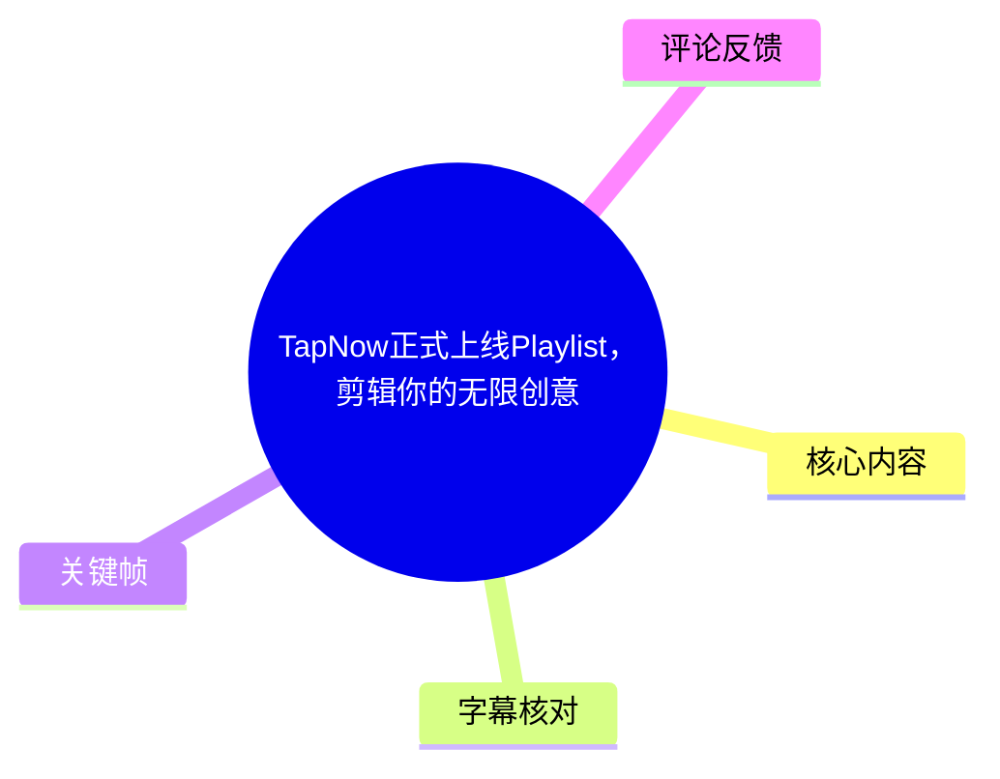
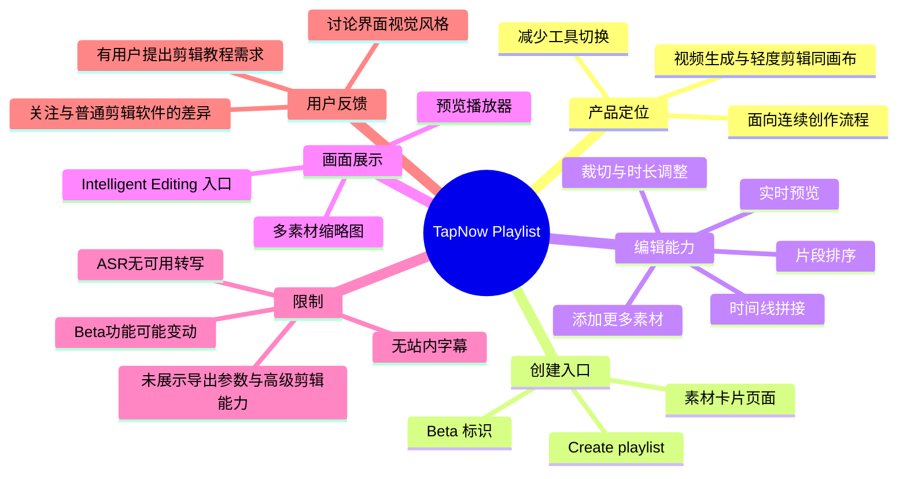
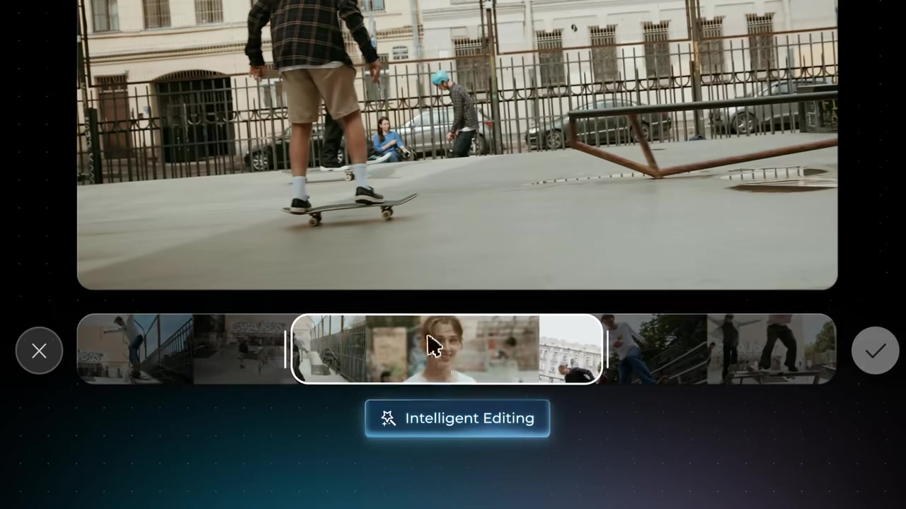

# TapNow正式上线Playlist，剪辑你的无限创意

> 来源：[Bilibili 视频](https://www.bilibili.com/video/BV1pMG26qEog) 
> UP 主：TapNow｜发布时间：2026-05-27｜视频时长：00:43｜分辨率：1920 × 1080  
> 标签：`ai剪辑`、`tapnow`、`#TapTV`、`AI工具`、`aigc`

## 小结

这是一支 TapNow 对新功能 **Playlist** 的产品演示短片。核心信息是：TapNow 宣称将“视频生成”与“轻度剪辑/拼剪”放在同一画布中完成，减少在生成工具、素材库和剪辑器之间反复跳转造成的创作中断。

从视频画面与投稿简介可确认，Playlist 的主要操作围绕素材集合与时间线展开：用户可从素材卡片页面点击 **Create playlist（Beta）** 创建播放列表；随后把多个视频片段放入时间线，进行排序、裁切、调整片段时长，并通过预览区检查结果；时间线末端还提供“+”入口以继续添加素材。

视频强调的不是复杂专业后期，而是“生成后快速编排成片”的轻量工作流。演示中可见的编辑能力包括片段排列、时间线缩略图浏览、片段边界拖拽式调整，以及标注为 **Intelligent Editing** 的智能编辑入口。不过，视频没有披露该智能编辑的具体算法、自动剪辑规则、支持格式、导出规格、计费方式或生成模型范围。

这项功能更适合已有多段短视频素材、希望快速组合节奏和叙事顺序的 AI 内容创作者。对于需要多轨音频、精细调色、字幕包装、关键帧动画、复杂转场或专业交付参数的场景，素材中没有足够证据证明 Playlist 可以替代专业非线性编辑软件。

该信息具有明显时效性：视频发布于 2026-05-27，画面中“Create playlist”旁明确标注 **Beta**。功能入口、能力范围和可用地区可能已经变化，应以 TapNow 当前产品页面为准。

## 思维导图

## 目录

- [产品发布与创作问题](#产品发布与创作问题)
- [创建 Playlist：从素材库进入剪辑画布](#创建-playlist从素材库进入剪辑画布)
- [时间线剪辑：排序、裁切与时长调整](#时间线剪辑排序裁切与时长调整)
- [智能编辑入口与成片工作流](#智能编辑入口与成片工作流)
- [可执行操作步骤](#可执行操作步骤)
- [技术信息、参数与未披露项](#技术信息参数与未披露项)
- [结论与限制](#结论与限制)
- [字幕比对](#字幕比对)
- [评论分析](#评论分析)
- [处理记录](#处理记录)

## 产品发布与创作问题 [00:00](https://www.bilibili.com/video/BV1pMG26qEog?t=0)

视频以“TapNow 为你讲一个故事”的文字画面开场，建立了以片段组合叙事的主题。投稿简介将 Playlist 定位为一个让创作“心流不被打断”的空间，所针对的问题是：视频生成完成后，创作者还需要切换至其他工具挑选、排序和裁切片段，灵感与节奏可能在工具切换中流失。

> 图：开场文字直接把“讲故事”作为产品叙事目标。它有助于理解 Playlist 并非单纯素材存放功能，而是服务于把多个镜头组织成连续内容的创作流程。

从元数据看，该视频属于 `AIcode` 收藏集，带有 AI 剪辑、AIGC、AI 工具等标签。视频本身是功能宣传与界面演示，不是完整教程；因此，以下“操作步骤”仅整理画面和投稿简介已明确展示的流程，不补充未经展示的按钮、配置或能力。

截至抓取时，视频数据为：播放 46,928、点赞 13,679、收藏 6,752、投币 130、分享 121、评论 111、弹幕 8。上述互动数据为抓取时快照，后续会持续变化，不能视为功能质量或实际使用规模的证明。

## 创建 Playlist：从素材库进入剪辑画布 [00:00](https://www.bilibili.com/video/BV1pMG26qEog?t=0)

演示画面展示了一个包含多个素材缩略图的页面。顶部操作栏可见以下英文功能：

- `Save to Library`：保存至素材库；
- `Add to Chat`：添加到对话；
- `Create playlist`：创建 Playlist；
- `Beta`：Playlist 创建入口处于测试阶段；
- `Group`：分组；
- `Report an issue`：问题反馈。

其中，鼠标指针停在 **Create playlist Beta** 上，表明创建 Playlist 是从已有素材上下文进入，而不是先打开一个空白专业时间线再导入文件。画面中的素材包括人物、外卖配送、滑板等不同内容，说明 Playlist 的演示场景是把多条独立视频素材汇集起来进行编排。

> 图：顶部操作栏明确显示“Create playlist Beta”，下方是多张视频素材卡片。这是确认 Playlist 创建入口与测试状态的关键画面证据。

这里可以区分两类信息：

- **视频/画面可确认**：素材页存在 `Create playlist Beta` 入口，且能从多条视频素材开始组织内容。
- **投稿简介中的产品宣称**：视频生成与拼剪在同一画布中进行，减少工具跳转。
- **不能据此确认的内容**：是否支持本地文件导入、图片/音频导入、素材数量上限、多人协作、项目保存机制，以及 Playlist 是否只适用于 TapNow 内生成的素材。

## 时间线剪辑：排序、裁切与时长调整 [00:00](https://www.bilibili.com/video/BV1pMG26qEog?t=0)

Playlist 的核心演示是带预览窗口的单轨式时间线。预览区下方可见连续排列的片段缩略图，时间刻度显示 `00:00`、`00:05`、`00:10`、`00:15`、`00:20` 等位置；右侧有“+”方框，用于继续添加片段。当前播放指针位于开头附近，预览区的示例读数为 `00:02/00:03`，表示画面中被预览的示例片段总长度约为 3 秒。

画面大字“调整视频时长”配合时间线操作，显示用户可以针对片段调整长度。投稿简介进一步明确列出“自由裁切排序，实时预览调整时间线”。因此，已展示或明确说明的编辑动作包括：

1. 将多个视频片段排列到同一时间线上；
2. 改变片段在时间线中的先后顺序；
3. 裁切片段；
4. 调整片段时长；
5. 在预览窗口中检查编排结果；
6. 继续添加更多素材。

> 图：该画面同时呈现预览播放器、时间刻度、多个片段缩略图、播放指针和“+”入口，是理解 Playlist“生成后立即拼剪”工作流的主要证据。图中的 `00:02/00:03` 是示例片段播放读数，不应误解为项目支持时长上限。

需要注意，画面没有显示多条视频/音频轨道，也没有显示转场、滤镜、字幕、调色、音频混音、变速或关键帧等控制面板。因此，不能把“调整视频时长”扩展解释为完整的专业剪辑能力；目前能够确认的是轻量级时间线拼接与裁切调整。

## 智能编辑入口与成片工作流 [00:00](https://www.bilibili.com/video/BV1pMG26qEog?t=0)

在另一段演示中，预览区播放滑板镜头，底部出现可选中的片段区间：中间片段以高亮边框表示，两侧有取消“×”和确认“✓”按钮；其下方显示 **Intelligent Editing** 标签。这个画面至少表明产品展示了某种“智能编辑”流程，且该流程与片段区间选择/确认存在关联。

> 图：高亮片段区间、取消与确认按钮，以及“Intelligent Editing”标签共同构成智能编辑功能存在的画面依据。它说明产品至少提供了面向片段处理的智能化入口，但未说明具体处理逻辑。

从投稿简介可整理出 TapNow 对完整工作流的描述：

1. 在同一画布中完成视频生成与拼剪；
2. 通过裁切和排序调整节奏；
3. 任意添加素材并导出成片。

不过，视频没有展示实际点击“导出”的界面，也没有显示输出分辨率、帧率、码率、格式、是否带水印、导出速度或存储位置。因此，“可导出成片”应视为投稿简介中提出的功能主张，而不是本视频已演示完毕的导出流程证据。

同样，**Intelligent Editing** 的名称只能确认，不应进一步推断为自动识别高潮片段、自动卡点、自动转场、语义剪辑或 AI 重构视频。其触发条件、输入类型、处理结果和人工可控程度均未披露。

## 可执行操作步骤 [00:00](https://www.bilibili.com/video/BV1pMG26qEog?t=0)

以下步骤按视频画面与简介所示流程整理，适合作为首次体验 Playlist 的最小操作路径：

1. **准备素材**  
   在 TapNow 的素材页面中浏览已有视频素材。画面显示素材可以以卡片/缩略图形式聚合展示。

2. **创建 Playlist**  
   在素材页顶部操作栏点击或选择 `Create playlist`。画面标注其为 `Beta`，使用时应预期功能和界面可能调整。

3. **进入带预览区的时间线画布**  
   将多个片段纳入同一编排界面。时间线中以缩略图展示各个素材，预览区用于查看当前编排效果。

4. **安排镜头顺序**  
   依据叙事逻辑或节奏调整片段排列顺序。视频和简介都将“排序”列为核心能力，但未展示具体拖动手势或快捷键。

5. **裁切并调整时长**  
   选择需要处理的片段，调整其保留区间或时长；结合预览检查每段镜头是否合适。视频用“调整视频时长”明确展示了这一目标。

6. **按需继续添加素材**  
   通过时间线右侧的“+”入口扩充素材。素材添加后可继续参与排序、裁切与预览。

7. **尝试智能编辑入口（可选）**  
   若界面中出现 `Intelligent Editing`，可根据产品实际提示选择片段区间并确认。但视频未提供操作说明，不能保证其在所有账号、地区或素材类型上可用。

8. **导出前核验当前产品界面**  
   投稿简介称可“导出成片”，但演示未展示导出设置。实际操作时应在当前版本中核对导出按钮、格式、清晰度、水印与权限说明。

## 技术信息、参数与未披露项 [00:00](https://www.bilibili.com/video/BV1pMG26qEog?t=0)

### 已出现的界面参数与标识

| 项目 | 素材中的证据 | 可作出的谨慎结论 |
| --- | --- | --- |
| 视频时长 | 元数据为 43 秒；ASR 音频时长为 42.752 秒 | 本条宣传视频约 43 秒，音视频封装时长存在常见的小数差异 |
| 画面分辨率 | 元数据为 1920 × 1080 | 原视频为 1080p 横向画面 |
| 时间线刻度 | 可见 00:00、00:05、00:10、00:15、00:20 | Playlist 界面以时间刻度组织片段 |
| 示例播放读数 | 预览区可见 00:02/00:03 | 该示例预览片段总长约 3 秒；不是平台限制 |
| 功能状态 | `Create playlist Beta` | Playlist 至少在演示时仍有 Beta 标记 |
| 智能功能名称 | `Intelligent Editing` | 产品展示了该名称的功能入口，机制未说明 |

### 未披露或无法验证的技术项

素材没有提供以下内容，使用或评估产品时不应自行补全：

- 可接受的视频、图片和音频格式；
- 单个项目可添加的素材数量、时长和容量上限；
- 是否支持多轨、配音、音乐、字幕、转场、滤镜、调色、变速、关键帧或蒙版；
- 智能编辑的模型、识别对象、自动处理方式和可撤销机制；
- 导出格式、最高分辨率、帧率、码率、音频编码及水印规则；
- 订阅/免费额度、生成消耗、商业使用授权和数据隐私条款；
- 浏览器、设备、地区、账号等级或网络环境要求；
- 项目协作、版本历史、云端保存与素材版权处理方式。

## 结论与限制 [00:00](https://www.bilibili.com/video/BV1pMG26qEog?t=0)

Playlist 的产品价值在于缩短“生成素材—挑选镜头—重新进入剪辑工具—拼接预览”的链路。视频展示的最明确能力是：从素材上下文创建 Playlist，在同一画布中通过时间线进行片段排序、裁切、时长调整和预览，并能继续添加素材。

对短内容创作者而言，最可迁移的经验是先把生成内容视为可编排的“镜头池”，再在时间线上用镜头长度和顺序决定节奏，而不是生成完单条视频就立刻定稿。尤其是人物、配送、滑板等不同素材可被组合时，剪辑顺序本身就是叙事的一部分。

但该视频是短时宣传片，不足以验证编辑精度、智能编辑效果、导出稳定性和专业工作流兼容性。界面中的 Beta 标识也意味着功能可能仍处于迭代阶段。实际使用前，应在 [TapNow 产品页面](https://app.tapnow.ai/home) 核对当前可用入口、套餐、限制和导出能力。

## 字幕比对 [00:00](https://www.bilibili.com/video/BV1pMG26qEog?t=0)

| 字幕来源 | 完整性 | 专有名词 | 时间轴 | 主要问题 |
| --- | --- | --- | --- | --- |
| Bilibili 站内字幕 | 未提供可用字幕 | 无法核验 | 无可用分段 | 本次素材未提供站内字幕文件 |
| 本次 ASR 字幕 | 空 | 未识别 | 无有效语音分段 | Whisper `medium` 识别结果为 0 个片段、语音覆盖率 0%，仅返回“未识别到语音片段”警告 |

本次 ASR 已检查：识别语言自动判断为英语，置信度为 `0.541015625`；音频输入时长为 `42.752` 秒，但结果没有任何可用文本或时间戳分段。诊断信息只说明“未识别到语音”，**并未标记 `noAudioStream=true`**；同时素材清单中存在 `audio/audio.wav`。因此，不能将其表述为“源视频没有音轨”，更不能将空 ASR 当作站内字幕的替代品。

由于没有站内字幕，也没有可用 ASR 转写，正文采用以下证据层级：

1. 视频元数据与投稿简介中的文字说明；
2. 给定关键帧中可辨认的界面文字和交互状态；
3. 视频时长与页面可见时间线读数。

文中经由画面校正并保留原文的关键术语包括：`TapNow`、`Playlist`、`Create playlist`、`Beta`、`Intelligent Editing`、`Save to Library`、`Add to Chat`、`Group`、`Report an issue`。由于没有真实字幕分段，本文各章节只能链接至经视频起点确认的 `[00:00]`，不虚构更细粒度的语音时间轴。

## 评论分析 [00:00](https://www.bilibili.com/video/BV1pMG26qEog?t=0)

仅分析本次可获取的热评前三条；评论反映用户感受或需求，不构成对产品能力的已验证事实。

1. **白鹭是什么鸟｜63 赞**  
   评论：“嗯——跟普通的剪辑软件有什么区别”。  
   这条评论提出最核心的产品定位问题：Playlist 是独立于传统剪辑软件的效率工具，还是功能较少的替代品？结合视频素材，当前可见差异主要在于其与 TapNow 素材/生成工作流的衔接，以及“同画布”理念；但视频没有展示传统剪辑软件难以完成的独占功能。因此，这一疑问合理，仍需产品通过更具体的效率对比、导出能力和智能编辑细节来回答。

2. **暮光染林梢｜50 赞**  
   评论：“整体风格有点像win7时代的media center[星星眼]”。  
   该评论针对界面视觉风格，指出其深色背景、卡片式媒体展示和大面积预览区带来的旧式媒体中心联想。这是主观审美评价，不提供功能层面的证据；但也说明产品的媒体浏览与播放列表界面具有较强的视觉识别特征。

3. **小纸巾---｜49 赞**  
   评论：“我这里有剪辑教程谁需要[doge]”。  
   这条评论以玩笑语气提出教程需求，侧面反映部分观众希望获得更具体的剪辑方法。评论本身没有提供可验证教程链接、操作知识或产品事实，不能据此认定 Playlist 存在上手门槛；不过，对于实际推广而言，提供从创建 Playlist 到导出的完整示例教程会有助于降低理解成本。

## 评论分析

- 热评 1：嗯——跟普通的剪辑软件有什么区别
- 热评 2：整体风格有点像win7时代的media center[星星眼]
- 热评 3：我这里有剪辑教程谁需要[doge]

以上内容是观众反馈摘录，只用于补充理解视频反响，不作为正文事实依据。

## 处理记录

- Worker ID：`worker-mrj0wjed-b0c290ad`
- 模型：`gpt-5.6-terra`
- 调用/使用的素材工具结果：视频元数据、关键帧提取结果、音频文件、ASR 诊断与转写结果、热评抓取结果。
- ASR 模型：`medium`，CUDA，`float16`，自动语言识别；结果为空，共 0 个语音片段。
- 字幕选择：站内字幕未提供可用文件；本次 ASR 已检查但无可用内容；最终不采用虚构字幕，改以投稿简介、元数据和关键帧可见文字作为事实依据。
- 关键帧选择依据：
  - `frames/frame-001.jpg`：开场“TapNow 为你讲一个故事”，用于说明叙事定位；
  - `frames/frame-002.jpg`：显示 `Create playlist Beta`，用于确认创建入口与 Beta 状态；
  - `frames/frame-003.jpg`：显示预览区、时间线、片段缩略图及“+”入口，用于说明排序、时长与添加素材；
  - `frames/frame-004.jpg`：显示片段选择和 `Intelligent Editing`，用于说明智能编辑入口存在。
- 缓存清理：未提供缓存清理日志或清理结果，不能声称已执行清理。
- 未解决问题：
  - 无站内字幕、无有效 ASR 文本，无法建立逐句语音转写与精确分段时间轴；
  - 未展示导出设置、收费规则、格式支持与高级编辑能力；
  - `Intelligent Editing` 的实际处理机制、适用条件与输出效果未披露；
  - Playlist 的当前 Beta 状态和功能范围可能已在视频发布后变更。
