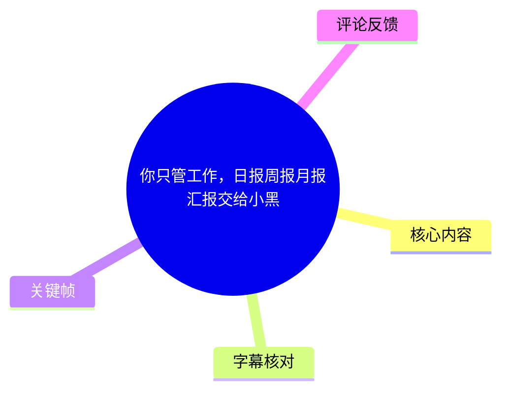
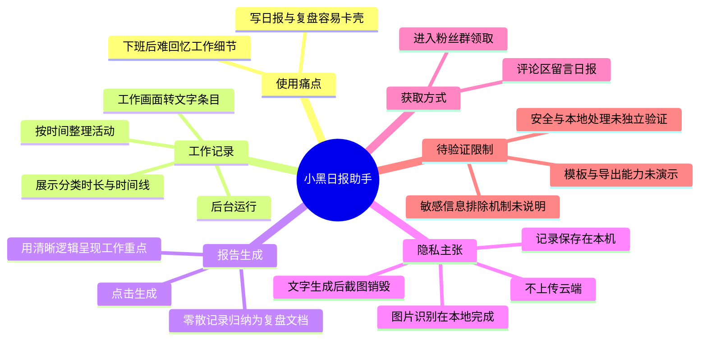
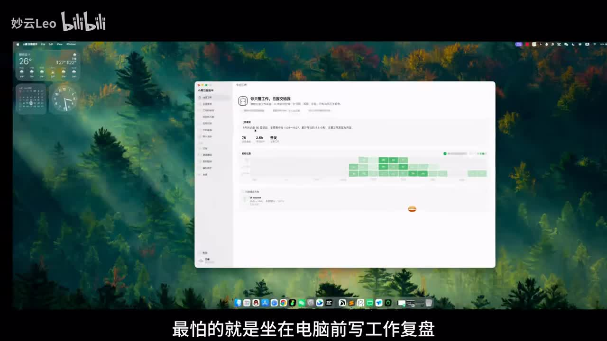
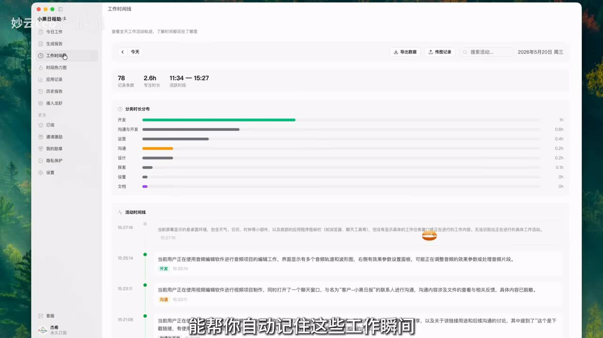
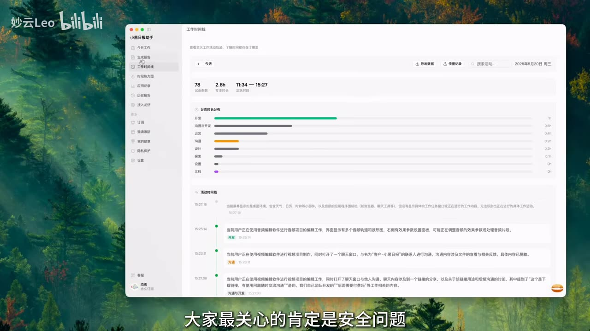
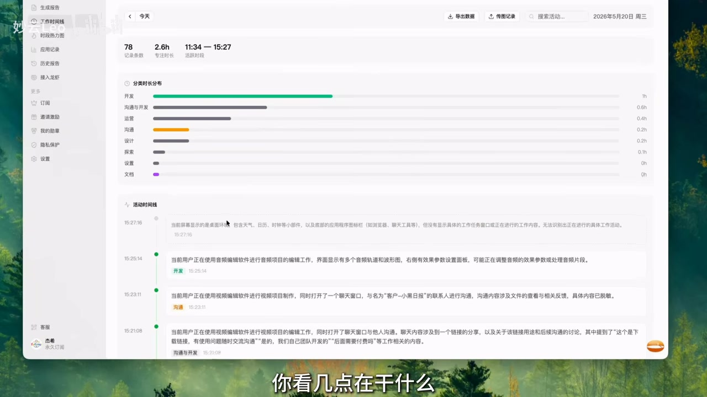

# 你只管工作，日报周报月报汇报交给小黑

> 来源：[Bilibili 视频](https://www.bilibili.com/video/BV1MTju67Ei5) 
> UP 主：妙云Leo｜发布时间：2026-06-16｜视频时长：01:37｜分辨率：3840×2160

## 小结

视频介绍“小黑日报助手”这一工作记录与报告生成工具，针对的痛点是：用户完成一天工作后，虽然做了很多事，却难以回忆细节、组织出清晰的日报或复盘。

视频所述的基本链路是：工具在后台运行，将工作画面转为带时间的信息条目，再把零散记录归纳为复盘文档。展示画面中可见“工作时间线”、分类时长分布、活动记录与“生成报告”等功能入口，说明其定位不仅是写作辅助，也包括工作活动的汇总与回溯。

隐私是视频的核心卖点。UP 主称，图片识别在本地完成，文字生成后截图立即销毁，记录仅存于用户自己的电脑而不上传云端。视频简介还补充了“API 点对点直连”的说法；但这些均为视频与简介中的产品声明，素材未提供独立测试、隐私政策或技术文档，不能据此视为已审计的安全结论。

生成报告时，视频强调工具并非“替用户说话”，而是将已有工作记录以更专业、清晰的逻辑呈现。视频口播明确提到“日报”；标题、简介及标签则宣称支持日报、周报、月报和汇报。实际模板种类、导出格式、是否可编辑、识别准确率、资源占用及收费方式，均未在素材中演示或说明。

适合需要周期性提交工作日报、希望减少回忆和整理成本的电脑办公用户参考。由于该工具会记录屏幕相关活动，使用前仍应重点确认敏感页面排除能力、记录开关、保留期限、模型/API 数据路径及组织的数据合规要求。

## 思维导图

## 目录

- [问题：日报难写不等于没有工作](#问题日报难写不等于没有工作)
- [记录机制：把工作画面整理为时间线](#记录机制把工作画面整理为时间线)
- [隐私主张：本地识别、截图销毁与本机存储](#隐私主张本地识别截图销毁与本机存储)
- [价值转化：从流水记录到复盘文档](#价值转化从流水记录到复盘文档)
- [实践路径与可见参数](#实践路径与可见参数)
- [获取方式与时效性](#获取方式与时效性)
- [结论与限制](#结论与限制)
- [字幕比对](#字幕比对)
- [评论分析](#评论分析)
- [处理记录](#处理记录)

## [问题：日报难写不等于没有工作](https://www.bilibili.com/video/BV1MTju67Ei5?t=0)

视频开场描述典型的下班场景：忙了一整天，坐到电脑前写工作复盘时却容易卡壳；即使当天实际完成了不少工作，也会因记不清过程而遗漏细节。

UP 主据此提出工具的目标：自动记住工作中的瞬间，减少用户在下班时重新回忆和手工组织材料的负担。这里的“自动记住”在后文具体指向对工作画面的文字化与时间化整理，而不是视频中直接展示的日历、任务管理或手工日志模式。

> 图：关键帧展示桌面上的“小黑日报助手”界面，并以“最怕的就是坐在电脑前写工作复盘”的字幕切入问题。它直观说明视频并非泛谈 AI 写作，而是在介绍一个围绕工作复盘场景的桌面工具。

## [记录机制：把工作画面整理为时间线](https://www.bilibili.com/video/BV1MTju67Ei5?t=21)

视频称，工具在后台运行时，会把用户的“工作画面”自动转成文字条目，并按“几点在干什么”进行整理。UP 主将这一过程概括为“把视觉碎片变成工作记录”。

画面展示的是“工作时间线”页面，左侧菜单可见“今日工作”“生成报告”“工作时间线”“时段热力图”“应用记录”“历史报告”“接入走样”等入口；主区域包含活动统计、分类时长分布和活动时间线。该画面能够佐证产品确有工作记录的界面设计，但不能单凭演示画面验证每条记录的识别准确性。

截图中可辨识的示例数据如下，均应视为演示界面数据，而非用户真实工作统计：

| 可见字段 | 画面展示值 | 含义与注意事项 |
| --- | ---: | --- |
| 记录条数 | 78 | 页面顶部显示的当日记录数量。 |
| 专注时长 | 2.6h | 视频画面展示值；未说明统计口径。 |
| 活跃时段 | 11:34—15:27 | 页面显示的时间范围。 |
| 日期 | 2026年5月20日，周三 | 为界面示例日期。 |
| 分类 | 开发、沟通与开发、运营、沟通、设计、探索、设置、文档 | 画面显示的分类名称；未见分类规则说明。 |
| 分类时长 | 开发约 1h、沟通与开发约 0.6h、运营约 0.4h、沟通/设计各约 0.2h、探索约 0.1h | 仅为图中柱状统计的可见示例，部分分类显示为 0h。 |

> 图：该关键帧完整呈现“工作时间线”页面：顶部有记录条数、专注时长和活跃时段，中部为分类时长条形图，底部为按时间排列的活动记录。这是理解“从画面到文字条目、再到工作轨迹”链路的核心画面依据。

### 视频中的技术表述与边界

视频明确说的是“工作画面自动转成文字条目”，没有交代以下实现细节：

- 截图采集频率、触发条件及是否支持暂停；
- 图像识别、OCR、视觉语言模型或本地模型的具体方案；
- 分类标签由规则、模型还是用户手工维护；
- 对聊天、代码、浏览器、文档等不同应用的识别质量；
- 是否会过滤密码、个人消息、客户资料或其他敏感内容；
- 工作记录是否可手动删除、修订、导出或检索。

因此，合理的理解是：视频展示并宣传了“屏幕活动→文字记录→时间线”的产品流程；其技术实现、可靠性与可控性仍需以产品实际设置和文档为准。

## [隐私主张：本地识别、截图销毁与本机存储](https://www.bilibili.com/video/BV1MTju67Ei5?t=34)

视频预判用户会担心：“记录这么细，个人屏幕信息怎么办？”随后将隐私处理描述为与云端工具不同的卖点，并提出三项主张：

1. **图片识别在本地完成**：视频称所有图片识别都在本地完成。
2. **截图即时销毁**：视频称文字一旦生成，截图就立即销毁。
3. **记录保存在本机**：视频称所有记录只存在自己的电脑里，不上传云端，数据主权由用户掌握。

视频简介进一步写有“隐私金字塔：截图分析后即刻销毁、数据仅存本地、API 点对点直连”。其中“API 点对点直连”未在口播中展开，也未展示 API 服务商、请求内容、是否可关闭网络访问或传输加密细节。

> 图：该帧在“大家最关心的肯定是安全问题”的口播处保留了工作时间线画面。其价值在于把隐私讨论放回具体场景：工具可能接触包含应用操作和文本概述的工作屏幕，而非抽象的普通日报文本。

### 使用这类工具时应核验的隐私事项

以下是基于视频所述能力提出的核验清单，不是视频已证明具备的功能：

- 查看是否能够一键暂停记录，并确认暂停后是否真的不再采集。
- 确认是否支持应用黑名单、网站排除、窗口排除或隐私区域遮挡。
- 确认“截图销毁”的触发时点：是识别成功即删除、定时删除，还是仍保留在回收站、缓存或日志中。
- 确认文字记录、数据库、备份和导出文件的实际存储位置及加密状态。
- 若使用外部 AI/API 生成报告，确认传输的内容范围、服务端保留策略与是否可自行配置模型。
- 在企业环境中，应先确认是否符合公司关于客户信息、源代码、账号信息和屏幕录制的制度。

## [价值转化：从流水记录到复盘文档](https://www.bilibili.com/video/BV1MTju67Ei5?t=53)

视频进一步提出的问题是：即使自动记录足够安全，一堆自动生成的“流水账”是否能变成逻辑清晰、能够体现工作价值的专业报告？

UP 主给出的答案是“一下生成”：工具会将零散记录自动归纳为一份“高质量的复盘文档”。其表达重点不是让 AI 虚构工作内容，而是把已有努力以更专业、更清晰的逻辑呈现出来，使接收日报的管理者能够更快看到工作重点。

这意味着视频中隐含的报告生成链路为：

1. 收集或整理工作画面对应的文字活动条目；
2. 将条目按时间或类别形成工作记录；
3. 点击生成报告；
4. 将零散记录归纳为结构化复盘文档；
5. 用户将日报交付给老板或其他接收者。

> 图：画面放大显示分类时长分布和活动时间线，时间线中的记录以自然语言描述呈现。这张图有助于理解报告生成前的“原料”不是单个标题，而是按时间归集的活动条目。

### 对“高质量复盘”的必要保留

视频没有展示生成后的完整日报正文，也没有展示不同模板、编辑界面或报告对比样例。因此无法从现有素材确认：

- 日报中是否包含成果、风险、问题、下一步计划等常见结构；
- 是否能区分“有效产出”与普通浏览、等待、沟通等活动；
- 是否支持用户删除不应出现的活动、补充上下文或改写结论；
- 是否会因屏幕内容不完整而把非工作活动误写进工作成果；
- 周报、月报是否只是汇总日报，还是具有不同的统计与叙事模板。

视频标题、简介与标签覆盖日报、周报、月报及汇报；但视频实际演示和口播集中于日报与复盘文档，其他报告类型的具体能力尚未展示。

## [实践路径与可见参数](https://www.bilibili.com/video/BV1MTju67Ei5?t=64)

根据视频的实际叙述，可整理出以下使用流程。该流程仅覆盖视频已说明的动作，不补充未展示的安装、账号注册或授权步骤。

### 操作步骤

1. **在工作期间保持工具后台运行**  
   视频称工具会在后台把工作画面转成文字条目。实际启动方式、是否需要系统权限、能否设置采集范围，素材未说明。

2. **查看工作时间线**  
   在“工作时间线”中查看活动记录、发生时间和分类时长，回顾“几点在干什么”。

3. **检查记录是否符合实际**  
   视频将记录作为报告生成基础，但没有演示修改、删除或确认记录的操作。实际使用中，应在提交前检查自动记录是否把非工作内容、敏感信息或错误识别写入。

4. **点击生成报告**  
   视频称“点一下生成”即可将零散记录归纳成复盘文档。视频未展示模板选择、提示词配置、生成时长、失败处理或二次编辑。

5. **人工审阅后再交付**  
   “老板一看就能看到工作重点”是视频的目标表述，不应替代人工审核。尤其当自动记录含有上下文缺失、分类偏差或敏感事项时，仍需由用户对日报内容负责。

### 视频可见的功能入口

| 功能入口 | 素材依据 | 可确认范围 |
| --- | --- | --- |
| 今日工作 | 界面左侧菜单 | 可确认存在入口；具体内容未展开。 |
| 生成报告 | 界面左侧菜单及口播“点一下生成” | 可确认有报告生成定位；模板和结果未展示。 |
| 工作时间线 | 多个关键帧 | 可确认页面展示了记录数、时长、分类与时序记录。 |
| 时段热力图 | 界面左侧菜单 | 仅确认菜单文字可见。 |
| 应用记录 | 界面左侧菜单 | 仅确认菜单文字可见。 |
| 历史报告 | 界面左侧菜单 | 仅确认菜单文字可见。 |
| 隐私保护、设置 | 界面左侧菜单 | 仅确认有对应入口；设置项未演示。 |

## [获取方式与时效性](https://www.bilibili.com/video/BV1MTju67Ei5?t=87)

视频最后给出的获取方式是：在评论区评论“日报”，再进入 UP 主的粉丝群领取工具；UP 主称已将工具整理在粉丝群内。

这是视频发布时的引导方式，不等同于长期稳定的公开下载渠道。粉丝群资格、工具版本、是否收费、是否仍可领取以及支持的平台，均可能随着时间变化。视频素材抓取时间为 2026-07-15，视频元数据发布时间为 2026-06-16；本文不对该领取方式在当前是否有效作保证。

## [结论与限制](https://www.bilibili.com/video/BV1MTju67Ei5?t=78)

### 可迁移的经验

- 报告难写往往是信息回忆与整理成本高，而不一定是工作产出少；先沉淀可追溯的过程记录，可以降低复盘门槛。
- 自动生成报告的价值在于“归纳已有事实”，而不是无依据地扩写工作成果。
- 屏幕活动记录涉及高敏感数据。即使产品宣称本地处理，也应将“可暂停、可排除、可删除、可审计”视作实际部署前的关键检查项。
- 自动分类和总结适合做初稿与回忆辅助，提交给管理者前仍需人工校对事实、优先级和措辞。

### 素材未证实的限制

1. **隐私与安全未经独立验证**：本地识别、截图销毁、本机保存及不上传云端均为视频方声明。
2. **模型与网络路径不明**：未说明报告生成是否调用云端模型，也未展示“API 点对点直连”的实际配置。
3. **识别质量不明**：没有准确率、误识别案例、性能消耗或多应用兼容性数据。
4. **敏感信息治理不明**：未展示网站/应用排除、敏感内容脱敏、权限控制或团队管理能力。
5. **报告能力展示有限**：视频未展示完整报告成品，周报、月报和汇报模板也没有实际演示。
6. **获取渠道有时效性**：评论和粉丝群领取方式可能变化，不能视为永久可用的产品入口。

## [字幕比对](https://www.bilibili.com/video/BV1MTju67Ei5?t=0)

| 字幕来源 | 完整性 | 专有名词 | 时间轴 | 主要问题 |
| --- | --- | --- | --- | --- |
| Bilibili 站内字幕 `p01-ai-zh.srt` | 完整覆盖 00:00—01:36 的口播 | “小黑日报助手”准确；“云端工具”“截图”“复盘文档”等关键表述清楚 | 50 个短分段，起止时间与 97 秒视频时长一致，可直接用于时间轴 | 个别句子被拆分为较短片段，但不影响理解。 |
| 本次 ASR（medium） | 文本总体覆盖主要口播，诊断显示语音覆盖 62.78 秒 | 多处错字或误识别，如“工作时间”应为“工作瞬间”、“自动计账”应为“自动记账”、“集点”应为“几点”、“云段”应为“云端”、“价债转化”应为“价值转化” | 不可靠：首段从 00:33.240 开始却承载开场长文本；第 3 段结束时间为 01:21.820，超过其标注的 01:21.820 前后语义边界，分段极粗且与实际口播位置不匹配 | 仅 4 个超长段落；标点缺失、存在词语错误，时间位置不适合做正文导航。 |

### 最终字幕选择

正文以 **Bilibili 站内字幕** 作为时间轴和口播转写的主要依据，因为它从 00:00 开始连续覆盖全片，短分段时间可直接换算为链接秒数；本次 ASR 已按要求检查，但仅作为交叉核对，不采用其时间戳。

ASR 诊断中**没有** `noAudioStream=true` 标记，且给出了中文语音识别结果，因此不能将其视为无音轨视频。其问题是转写分段与时间戳质量不足，而不是源视频没有音频。

通过站内字幕、画面和上下文校正的重点词语包括：

- ASR“工作时间”校正为站内字幕的“工作瞬间”；
- ASR“自动计账”校正为“自动记账”；
- ASR“你看集点”校正为“你看几点”；
- ASR“云段”校正为“云端”；
- ASR“价债转化”校正为“价值转化”；
- ASR“刀日上”校正为“刀刃上”。

## [评论分析](https://www.bilibili.com/video/BV1MTju67Ei5?t=28)

以下仅分析素材中可获取的热评前三条。评论反映的是观众的疑问或调侃，不构成对产品能力的验证。

1. **也耶丶野夜叶（11 赞）**  
   > “假如……我是说假如啊，假如我刷了一整天B站，他可以帮我生成充实而忙碌的日报吗？”

   这条评论以调侃方式指出核心风险：若工具依据屏幕活动自动生成记录，非工作浏览行为可能也被纳入报告，甚至被包装成“充实”的内容。视频没有展示工作/非工作活动的识别、排除和报告审核机制，因此这一担忧无法仅凭视频排除。

2. **如意白日梦乄（6 赞）**  
   > “我摸鱼的时候，他也给我记录下来了？？？？？”

   评论直接关注持续记录带来的可见性与隐私问题，也与视频在 00:34 后主动讨论的“个人屏幕信息怎么办”相呼应。视频宣称本地识别和本机保存，但没有说明摸鱼、私人聊天等非工作行为是否会被记录，或用户能否删除、暂停及排除相关内容。

3. **Q舒望（4 赞）**  
   > “可以记录非工作内容吗？我可以把它当做生活记录吗？[思考][思考]或者说出个模板？”

   这条评论提出了生活记录与自定义模板的潜在需求。视频主要定位为工作日报助手，虽然标题和简介宣称日报、周报、月报与汇报，但没有说明是否支持非工作内容记录或生活类模板。因此这只是用户期望，不能推断为现有功能。

## [处理记录](https://www.bilibili.com/video/BV1MTju67Ei5?t=0)

- **Worker ID**：worker-mrj0wjed-b0c290ad
- **模型**：gpt-5.6-terra
- **调用工具与素材**：视频元数据、站内字幕 `p01-ai-zh.srt`、本次 ASR 结果 `asr/asr-result.json` 与 `asr/transcript.srt`、关键帧目录 `frames/`、热评数据 `comments/comments.json`。
- **字幕选择**：采用站内字幕作为正文时间轴来源；已检查本次 ASR。ASR 语言识别为中文（置信度约 0.9995），但时间戳和分段异常，故仅用于交叉核对与错字比对。
- **关键帧选择依据**：选择 `frame-001` 表示开场痛点与产品界面；`frame-002` 呈现完整工作时间线和统计数据；`frame-003` 对应安全问题讨论；`frame-004` 放大展示分类时长与活动记录。所选画面均直接服务于正文所述的产品流程与隐私语境。
- **缓存清理**：素材未提供缓存清理执行日志；本文不虚构已完成清理，仅记录该状态未验证。
- **未解决问题**：产品实际安装渠道、版本、支持系统、价格、模板数量、报告编辑能力、屏幕排除策略、模型/API 数据路径、数据加密方式及隐私声明均未在给定素材中得到完整验证。

## 评论分析

- 热评 1：假如。。。我是说假如啊，假如我刷了一整天B站，他可以帮我生成充实而忙碌的日报吗？
- 热评 2：我摸鱼的时候，他也给我记录下来了？？？？？
- 热评 3：可以记录非工作内容吗？我可以把它当做生活记录吗？[思考][思考]或者说出个模板？

以上内容是观众反馈摘录，只用于补充理解视频反响，不作为正文事实依据。
