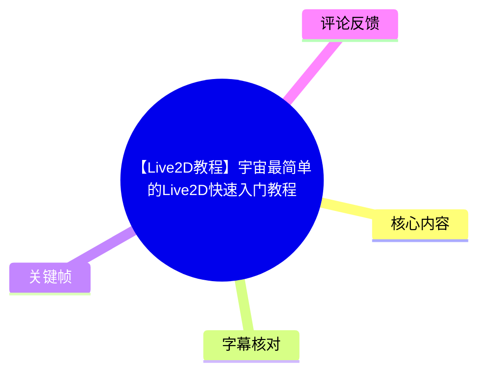
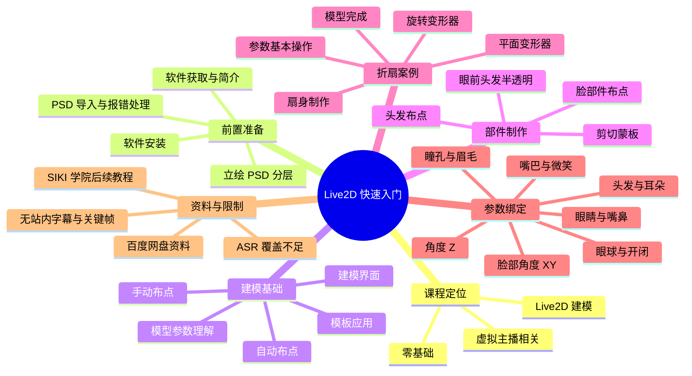

# 【Live2D教程】宇宙最简单的Live2D快速入门教程

> 来源：[Bilibili 视频](https://www.bilibili.com/video/BV11y4y1r7W5)  
> UP 主：o缘の翼o｜发布时间：2020-10-25｜标注总时长：05:47:11｜分辨率：1920×1080  
> 标签：Live2D、零基础、入门、模型、虚拟主播、Vtuber、FaceRig。  
> **素材可用性说明**：本次仅获得约 47.3 秒音频 ASR，且无可用站内字幕、无关键帧；因此本文完整整理已验证的分P课程结构、视频元数据、资源信息与可确认的技术主题，但不将目录标题扩写为未被字幕或画面证实的具体操作细节。

## 小结

这是一个面向零基础学习者的 Live2D Cubism 建模入门系列，视频以 **32 个分P** 组织内容：从软件获取、立绘 PSD 分层、安装与导入，逐步进入建模界面、参数理解、自动/手动布点、头发与脸部部件处理、剪切蒙板、半透明效果，以及以“折扇模型”为案例的变形器和参数操作。

课程后半段的主线是为角色绑定常见运动与表情参数：角度 Z、脸部角度 XY、眼睛、嘴巴、鼻子、头发、耳朵、眼球、眼睛开闭、嘴巴开闭、微笑、瞳孔缩放和眉毛等。按分P标题判断，它覆盖了一个基础 Live2D 角色从素材准备到常见面部参数绑定的完整学习路径。

视频简介提供了资料下载链接、提取码和交流群，同时说明 UP 主已加入 SIKI 学院团队，后续教程将发布至 `@siki学院` 账号。这是发布于 2020 年的课程与资源信息；截至素材抓取时间（2026-07-15），链接、群号、软件界面、模板与兼容性均可能发生变化，应以当前官方文档和实际软件版本复核。

本次 ASR 实际只覆盖 00:00:02.600—00:00:06.940，识别语言为日语，内容为疑似赞助提示，无法支撑对长达 5 小时以上教程主体的逐句转录。源素材**并未标记** `noAudioStream=true`，因此不能称为“视频没有音轨”；实际问题是可供 ASR 的音频文件仅约 47.296 秒，明显短于视频元数据总时长。

适合将本视频当作“课程路线图”和旧版 Live2D 入门资料索引。实际学习时，应以 PSD 图层设计、网格布点质量、变形器层级、参数间联动为重点；但具体菜单位置、操作快捷键、模板名称和参数数值，因缺乏可用主体字幕与画面证据，本文不作推定。

## 思维导图

## 目录

- [课程背景、资料与时效性](#课程背景资料与时效性)
- [已验证的课程结构与分P清单](#已验证的课程结构与分p清单)
- [学习路径：从素材到基础建模](#学习路径从素材到基础建模)
- [折扇案例与变形器主题](#折扇案例与变形器主题)
- [角色参数绑定主题](#角色参数绑定主题)
- [限制、风险与可迁移经验](#限制风险与可迁移经验)
- [字幕比对](#字幕比对)
- [关键帧与画面证据](#关键帧与画面证据)
- [评论分析](#评论分析)
- [处理记录](#处理记录)

## [课程背景、资料与时效性](https://www.bilibili.com/video/BV11y4y1r7W5?t=2)

### 视频定位

视频标题将其定位为“快速入门教程”，分P标题则显示其并非单一短教程，而是围绕 Live2D 建模基础展开的系列化课程。元数据中共有 32 个分P，其中第 32 P 为“关于30集之后视频”，正课涵盖 01—30 共 30 个主题单元，另含前言与后续说明。

视频的标签包含 `LIVE2D`、`FACERIG`、`模型`、`虚拟主播` 与 `Vtuber`。其中只有“FaceRig”作为平台标签出现；素材没有可验证的主体讲解内容，不能据此断言视频演示了 FaceRig 导出、追踪或运行配置。

### 简介中明确提供的信息

UP 主在简介中写明：

- 已加入 SIKI 学院团队，之后教程视频更新将放到 `@siki学院` B 站账号；
- 提供“教室地址”：`https://b23.tv/AWuH7L`，并标注 BV 号 `BV1DV411y79c`；
- 提供资料下载地址：`https://pan.baidu.com/s/1GHpGeOVgYUU4Lj33nC4LqA`；
- 资料提取码：`siki`；
- SIKI 学院 Live2D 交流群：`736712767`；
- UP 交流群：`498151140`、`962136353`。

> 以上仅为视频发布页原始描述中的信息，不代表链接、群组或资料在 2026 年仍可访问，也不代表资料适用于当前 Live2D Cubism 版本。

### 时效性判断

- **发布时间**：2020-10-25。
- **数据抓取时间**：2026-07-15。
- **高时效风险项**：软件下载入口、安装方式、UI 布局、模板功能、导入报错原因、百度网盘资源、QQ群与后续课程发布位置。
- **相对稳定的学习思想**：PSD 分层、部件遮罩关系、网格布点、旋转/平面变形器概念，以及将部件形态绑定到参数的建模工作流。
- **不能从本素材确认的内容**：课程所用 Cubism 具体版本、系统环境、快捷键、导出格式、SDK/运行时版本、FaceRig 对接方式及参数范围。

## [已验证的课程结构与分P清单](https://www.bilibili.com/video/BV11y4y1r7W5?t=2)

> 下表基于页面元数据的分P名称与单P时长整理。由于站内字幕不可用、主体音频未被完整提取，表中的“可确认范围”只解释标题直接表达的学习主题，不补写具体步骤。

| P | 分P标题 | 单P时长 | 可确认范围 |
| --- | --- | ---: | --- |
| 1 | 前言 | 00:00:48 | 课程前言。 |
| 2 | 01-Live2D下载与简介 | 00:08:58 | Live2D 下载与基础介绍。 |
| 3 | 02-立绘分层 | 00:15:12 | 用于建模的立绘分层主题。 |
| 4 | 03-Live2D软件安装 | 00:03:17 | 软件安装主题。 |
| 5 | 04-psd档案导入及出错解决办法 | 00:05:58 | PSD 导入及导入错误处理。 |
| 6 | 05-软件建模界面介绍 | 00:12:31 | 建模软件界面介绍。 |
| 7 | 06-模型参数的理解 | 00:07:33 | 对模型参数概念的理解。 |
| 8 | 07-应用模板 | 00:07:53 | 模板应用主题。 |
| 9 | 08-自动布点 | 00:11:35 | 自动布点主题。 |
| 10 | 09-手动布点基本操作 | 00:11:01 | 手动布点的基础操作。 |
| 11 | 10-头发布点注意事项 | 00:14:50 | 头发网格/布点的注意事项。 |
| 12 | 11-脸部件布点（上） | 00:09:29 | 脸部件布点，上半部分。 |
| 13 | 12-脸部件布点（下） | 00:11:40 | 脸部件布点，下半部分。 |
| 14 | 13-剪切蒙板_简易版折扇制作 | 00:10:20 | 剪切蒙板与简易折扇制作。 |
| 15 | 14-眼睛部分头发半透明 | 00:08:33 | 眼睛区域头发半透明效果。 |
| 16 | 15-折扇模型-参数基本操作（上） | 00:17:23 | 折扇案例中的参数基本操作，上半部分。 |
| 17 | 16-折扇模型-参数基本操作（下） | 00:07:33 | 折扇案例中的参数基本操作，下半部分。 |
| 18 | 17-折扇模型-扇身的制作 | 00:11:42 | 折扇扇身制作。 |
| 19 | 18-折扇模型-旋转变形器 | 00:14:23 | 旋转变形器主题。 |
| 20 | 19-折扇模型-平面变形器 | 00:12:38 | 平面变形器主题。 |
| 21 | 20-折扇模型完成 | 00:15:10 | 折扇模型完成阶段。 |
| 22 | 21-参数绑定-角度Z | 00:10:08 | 参数绑定：角度 Z。 |
| 23 | 22-参数绑定-角度XY-脸 | 00:12:18 | 参数绑定：脸部角度 X/Y。 |
| 24 | 23-参数绑定-角度XY-眼睛-附加另一边复制方法 | 00:13:25 | 参数绑定：眼睛角度 X/Y，以及另一侧复制方法。 |
| 25 | 24-参数绑定-角度XY-嘴巴-鼻子 | 00:11:51 | 参数绑定：嘴巴、鼻子的角度 X/Y。 |
| 26 | 25-参数绑定-角度XY-头发-耳朵 | 00:21:50 | 参数绑定：头发、耳朵的角度 X/Y。 |
| 27 | 26-参数绑定-眼球运动-眼睛开闭 | 00:16:40 | 参数绑定：眼球运动、眼睛开闭。 |
| 28 | 27-参数绑定-嘴巴开闭以及变形 | 00:17:28 | 参数绑定：嘴巴开闭与变形。 |
| 29 | 28-参数绑定-眼睛的微笑 | 00:08:07 | 参数绑定：眼睛微笑。 |
| 30 | 29-参数绑定-眼睛瞳孔缩放 | 00:05:10 | 参数绑定：瞳孔缩放。 |
| 31 | 30-参数绑定-眉毛上下_角度_变形 | 00:11:23 | 参数绑定：眉毛上下、角度与变形。 |
| 32 | 关于30集之后视频 | 00:00:24 | 关于第 30 集之后视频的说明。 |

## [学习路径：从素材到基础建模](https://www.bilibili.com/video/BV11y4y1r7W5?t=2)

### 1. 前置准备阶段

课程前 5 个正课单元构成明确的准备顺序：

1. **获取并认识软件**：`01-Live2D下载与简介`。
2. **处理原始美术素材**：`02-立绘分层`。
3. **安装建模软件**：`03-Live2D软件安装`。
4. **导入 PSD**：`04-psd档案导入及出错解决办法`。
5. **熟悉建模环境**：`05-软件建模界面介绍`。

这一顺序表明，角色建模并非从“拖动参数”开始，而是以可编辑的 PSD 立绘和正确导入为前提。特别是教程专门安排“立绘分层”与“PSD 档案导入及出错解决办法”两个单元，说明素材组织和导入质量被视为后续建模的重要条件。

### 2. 参数与模板认知

紧随其后的两个单元是：

- `06-模型参数的理解`；
- `07-应用模板`。

从命名可确认，课程在正式大规模布点之前，先介绍模型参数，再讨论模板使用。这种编排提示学习者应先建立“部件形状如何随参数变化”的认知，再处理网格和具体部件。

**本素材未能确认的细节**：

- 参数的具体命名规范；
- 参数最小值、最大值、默认值；
- 模板是否为 Live2D 官方模板、示例模板或教程自定义模板；
- 模板应用后是否需要二次修正。

因此，实际操作时不应把本文视为某个版本软件的参数配置说明。

### 3. 自动布点与手动布点

课程将网格/布点拆成四个部分：

1. `08-自动布点`；
2. `09-手动布点基本操作`；
3. `10-头发布点注意事项`；
4. `11-脸部件布点（上）`、`12-脸部件布点（下）`。

从主题划分可知，自动布点和手动布点被分别讲解，并针对头发、脸部件做了进一步细分。可迁移的学习顺序是：

- 先理解自动生成网格这一功能的适用范围；
- 再学习手动调整的基本操作；
- 对头发等细长、易弯曲部件单独处理；
- 对脸部组成部件继续细化。

但“自动布点适用哪些图层”“头发布点应增加还是减少哪些位置”“脸部件具体包括哪些部件”等内容没有可用字幕或画面佐证，不能在本文中虚构为视频明确结论。

### 4. 图层关系与显示效果

课程标题直接涉及两类常见视觉问题：

- `13-剪切蒙板_简易版折扇制作`：剪切蒙板与折扇案例；
- `14-眼睛部分头发半透明`：眼睛区域的头发半透明效果。

这表明课程不只处理几何变形，也处理图层之间的遮挡与透明表现。对初学者而言，可以将这两项理解为：当一个部件需要只在特定区域显示，或需要在遮挡眼睛时仍保留一定可见性时，模型的层级关系和显示控制同样重要。

## [折扇案例与变形器主题](https://www.bilibili.com/video/BV11y4y1r7W5?t=2)

### 折扇作为贯穿案例

从第 13 P 到第 20 P，课程以“折扇模型”为连续案例，包含：

1. 简易版折扇制作；
2. 参数基本操作（上、下）；
3. 扇身制作；
4. 旋转变形器；
5. 平面变形器；
6. 折扇模型完成。

这段案例的价值在于，它将剪切蒙板、部件制作、参数操作和两类变形器放在同一个可见的对象上组织。虽然无法从现有字幕验证每一步的具体做法，但目录已明确说明折扇是用于讲解模型制作和变形器的实践对象。

### 旋转变形器与平面变形器

课程分别设置：

- `18-折扇模型-旋转变形器`；
- `19-折扇模型-平面变形器`。

可确认的是，教程将两类变形器区分讲解。对于学习记录而言，应重点建立以下问题意识，而不是假定视频给出了某一固定配置：

- 某部件的运动更接近围绕轴心转动，还是更接近平面内的整体变形？
- 多个部件是否需要作为整体继承某种运动？
- 变形器的层级是否会影响子部件的表现？
- 参数变化时，部件形态是否需要由单一变形器完成，或由多个层级共同完成？

上述问题是基于分P主题归纳出的学习检查点，不是对视频具体操作的逐字复述。

## [角色参数绑定主题](https://www.bilibili.com/video/BV11y4y1r7W5?t=2)

### 参数绑定覆盖范围

课程第 21—30 集集中讲解“参数绑定”，范围如下：

| 主题 | 对应分P | 可确认的绑定对象 |
| --- | --- | --- |
| 角度 Z | 21 | 角度 Z 参数。 |
| 脸部角度 XY | 22 | 脸部。 |
| 眼睛角度 XY | 23 | 眼睛；并包含“另一边复制方法”。 |
| 嘴巴与鼻子角度 XY | 24 | 嘴巴、鼻子。 |
| 头发与耳朵角度 XY | 25 | 头发、耳朵。 |
| 眼球与眼睛开闭 | 26 | 眼球运动、眼睛开闭。 |
| 嘴巴控制 | 27 | 嘴巴开闭、变形。 |
| 眼睛表情 | 28 | 眼睛的微笑。 |
| 瞳孔效果 | 29 | 眼睛瞳孔缩放。 |
| 眉毛控制 | 30 | 眉毛上下、角度、变形。 |

### 从分P结构可见的建模思路

课程目录显示，角色动作不是一次性绑定完成，而是按部位和功能逐项拆分：

- 先处理整体方向类控制：角度 Z、脸部角度 X/Y；
- 再处理与方向变化强相关的五官和附属部件：眼睛、嘴巴、鼻子、头发、耳朵；
- 再处理表情与局部运动：眼球、眨眼/开闭、嘴巴开闭、眼睛微笑、瞳孔缩放、眉毛变化。

此外，第 23 P 的标题明确写有“附加另一边复制方法”。这至少表明课程包含从一侧眼睛向另一侧复制相关设置的方法主题。由于无主体画面与字幕，无法确认复制的是网格、关键形状、参数键点、变形器设置还是其他对象，故不进一步断言。

### 学习时应记录的验证项

以下并非视频已确认的具体参数值，而是依照其分P主题，建议在实际跟学中自行记录的内容：

- 每个参数的名称、最小值、最大值与默认位置；
- 哪些部件由角度 X/Y/Z 共同影响；
- 左右两侧部件的复制方式及复制后的镜像/方向检查；
- 眼球运动与眼睛开闭之间是否存在联动；
- 嘴巴“开闭”与“变形”是否被拆为不同控制；
- 眉毛“上下”“角度”“变形”是否使用独立参数或同一参数的不同形态；
- 瞳孔缩放时是否需要同步检查高光、眼白、遮罩与边界。

## [限制、风险与可迁移经验](https://www.bilibili.com/video/BV11y4y1r7W5?t=2)

### 已知限制

1. **ASR 覆盖严重不足**：素材中音频文件时长为 47.296 秒，而视频元数据总时长为 20,831 秒；ASR 仅输出 1 段、4.34 秒语音。
2. **识别语言不匹配**：ASR 自动识别为日语，置信度 0.9833984375；其内容为“この協定は、ご覧のスポンサーの伝表でお送りします。”，与中文 Live2D 正课主题不匹配，疑似只捕获了片头或错误音频片段。
3. **站内字幕不可用**：字幕抓取报错 `Invalid URL`，没有提供可供对照的站内 SRT。
4. **关键帧提取失败**：帧提取任务因 ffmpeg 退出码 `-22` 失败，未提供任何 `frames/*.jpg`。
5. **多P定位限制**：已提供每个分P的独立时长和标题，但未提供主体字幕的时间段，不能把分P在全片中的顺序简单换算成站内 `t=` 的精确章节时间。

### 可迁移经验

在不夸大可验证证据的前提下，这套课程目录仍提供了可靠的学习框架：

- **先准备素材，再开始建模**：分层、安装、导入和界面认知排在前面。
- **先理解参数，再进入大量细节制作**：参数理解与模板应用位于布点之前。
- **将网格问题按部件类型拆开处理**：自动布点、手动布点、头发、脸部件被分别讨论。
- **把遮罩/透明与几何变形并列考虑**：剪切蒙板和眼前头发半透明均被单独列为主题。
- **以完整案例承接抽象工具概念**：折扇案例串联参数、扇身、旋转变形器和平面变形器。
- **参数绑定按动作类别逐层推进**：整体角度、五官、附属部件、表情、瞳孔与眉毛依次展开。

## [字幕比对](https://www.bilibili.com/video/BV11y4y1r7W5?t=2)

| 字幕来源 | 完整性 | 专有名词 | 时间轴 | 主要问题 |
| --- | --- | --- | --- | --- |
| Bilibili 站内字幕 | 不可用 | 无法评估 | 无法评估 | 字幕获取工具报错 `Invalid URL`；未提供站内字幕内容。 |
| 本次 ASR 字幕 | 极低，仅 1 条 | 未覆盖 Live2D、PSD、变形器等课程术语 | 有效，仅覆盖 00:00:02.600—00:00:06.940 | 音频输入仅 47.296 秒，远短于全片；自动识别为日语，文本与中文教程主体不对应。 |

### 本次 ASR 检查结果

ASR 使用 `medium` 模型，自动语言识别结果为日语（`ja`），语言置信度为 `0.9833984375`。唯一识别片段为：

> `00:00:02,600 --> 00:00:06,940`  
> この協定は、ご覧のスポンサーの伝表でお送りします。

ASR 诊断信息：

- 语音段数：1；
- 语音时长：4.34 秒；
- 相对音频覆盖率：9.18%；
- 音频时长：47.296 秒；
- 未标记 `noAudioStream=true`。

### 字幕采用结论

本文**不采用 ASR 文本作为教程主体内容依据**，仅将其作为“在 00:00:02.600—00:00:06.940 存在一段日语识别文本”的证据。文章中的课程主题以视频页面提供的分P标题为准；由于没有可用站内字幕、完整 ASR 或关键帧，未对任何 Live2D 操作步骤、菜单项、参数数值和术语解释进行虚构补全。

本文各章节标题中的 [`t=2`](https://www.bilibili.com/video/BV11y4y1r7W5?t=2) 链接使用唯一可验证 ASR 语音段的起始秒数附近作为视频入口，**不表示对应章节内容在全片第 2 秒开始**。现有素材不足以生成其余章节的可靠精确时间轴。

## [关键帧与画面证据](https://www.bilibili.com/video/BV11y4y1r7W5?t=2)

本任务未提供可用关键帧路径。

- 关键帧提取记录显示：`frames failed: ffmpeg 执行失败，退出码 -22`；
- 素材清单中的“关键帧路径”为“无”；
- 因此不存在可引用的 `frames/xxx.jpg` 文件。

为避免引用不存在的相对路径或伪造画面内容，本文未插入图片。若后续重新提取关键帧，优先选择以下画面类型作为正文证据：

1. PSD 图层面板与分层示例画面，用于核验“立绘分层”内容；
2. Cubism 导入界面或报错对话框，用于核验 PSD 导入问题；
3. 自动布点、手动布点及头发网格对比画面，用于核验布点策略；
4. 剪切蒙板与眼前头发透明效果画面，用于核验显示层级；
5. 折扇模型的变形器层级与参数变化画面，用于核验案例操作；
6. 角度 X/Y/Z、眼球、嘴巴、眉毛等参数面板与关键形状画面，用于核验绑定逻辑。

## [评论分析](https://www.bilibili.com/video/BV11y4y1r7W5?t=2)

> 仅获取到 2 条热评，少于要求上限“前三条”；以下仅分析实际可获取内容，不补造第三条评论。

### 1. 晴天的宝石（596 赞）

> “拥有88个硬币的我打算投俩个，但是又怕破坏了520个硬币，谁来打破这个520让我为up主献上2个币？？”

- **观点概括**：评论者以“520”这一数字梗表达对教程的支持意愿。
- **补充信息**：不提供关于 Live2D 技术、课程质量或资源有效性的事实性信息。
- **可信度与价值**：可反映该评论者的正向互动意愿，但不能据此判断教程内容质量。

### 2. 嗷呜呜大魔王（435 赞）

> “收藏夹吃灰[doge][doge](不是”

- **观点概括**：以自嘲方式表达“已收藏但可能不实践”的学习行为。
- **补充信息**：间接反映教程具有被收藏作为学习资料的倾向，但不证明实际学习效果。
- **可信度与价值**：属于常见社区互动，不提供可验证的技术结论，也没有指出课程缺陷或适配版本问题。

## [处理记录](https://www.bilibili.com/video/BV11y4y1r7W5?t=2)

- **Worker ID**：`worker-mrj0www4-e8d79408`
- **模型**：`gpt-5.6-terra`
- **ASR 模型与运行信息**：`medium`；CUDA；`float16`；自动语言识别为日语。
- **调用/使用的素材工具结果**：
  - 音频输出：`audio/audio.wav`；
  - ASR 输出：`asr/transcript.srt`、`asr/asr-result.json`；
  - 站内字幕抓取：失败，错误为 `Invalid URL`；
  - 关键帧提取：失败，ffmpeg 退出码 `-22`。
- **字幕选择**：未获得站内字幕；本次 ASR 已检查，但仅覆盖 47.296 秒音频中的 4.34 秒语音，且内容与教程主体不匹配。正文以页面元数据、分P标题和简介为唯一可靠的课程结构依据。
- **时间轴依据**：唯一可验证 ASR 分段为 `00:00:02.600—00:00:06.940`，故章节入口链接使用 `t=2`；未将分P顺序推算为伪精确时间轴。
- **关键帧选择依据**：无可用关键帧，未引用任何图片；原因是关键帧提取失败且未提供 `frames/` 文件。
- **评论处理范围**：实际获取热评 2 条，均已分析；未虚构缺失的第 3 条。
- **缓存清理**：提供的任务素材未包含缓存清理执行结果，无法确认是否已清理；因此不作“已清理”声明。
- **未解决问题**：
  1. 完整视频音频为何未被提取至 ASR 输入；
  2. 站内字幕是否实际存在及其内容；
  3. 主体课程各分P的精确字幕时间轴；
  4. 关键帧提取失败的具体 ffmpeg 环境原因；
  5. 视频所用 Live2D Cubism 版本、模板与资源链接当前可用性。

## 评论分析

- 热评 1：拥有88个硬币的我打算投俩个，但是又怕破坏了520个硬币，谁来打破这个520让我为up主献上2个币？？
- 热评 2：收藏夹吃灰[doge][doge](不是

以上内容是观众反馈摘录，只用于补充理解视频反响，不作为正文事实依据。
