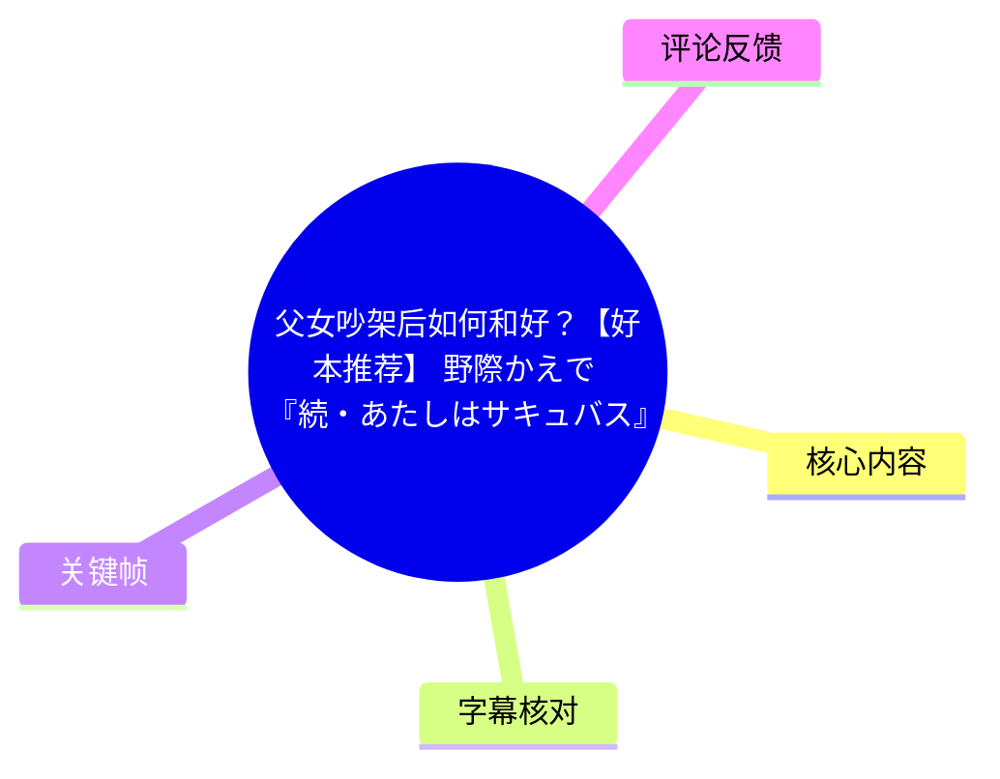
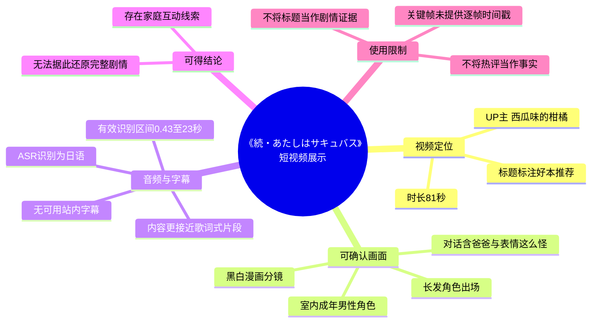
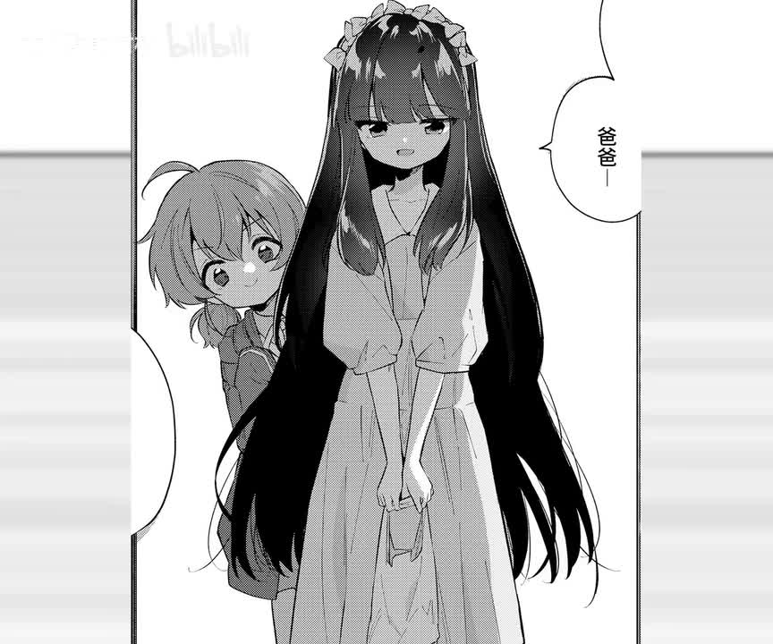
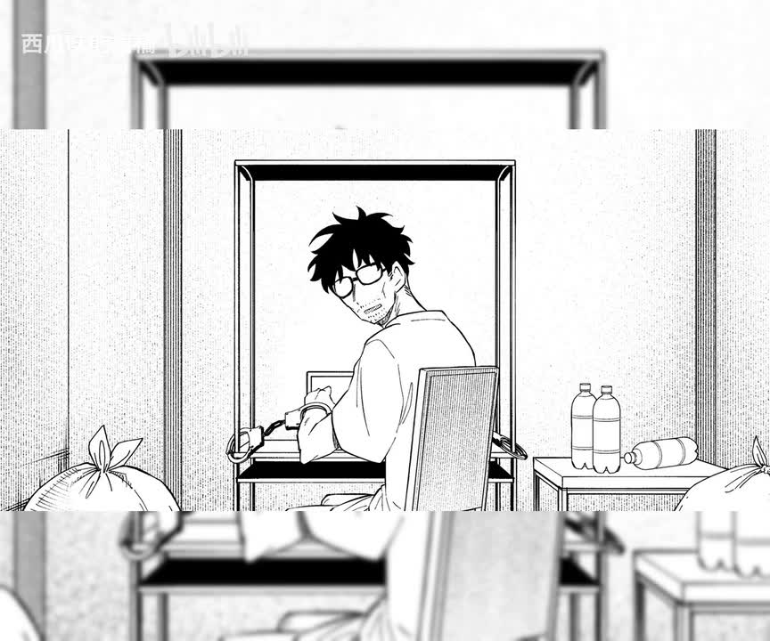
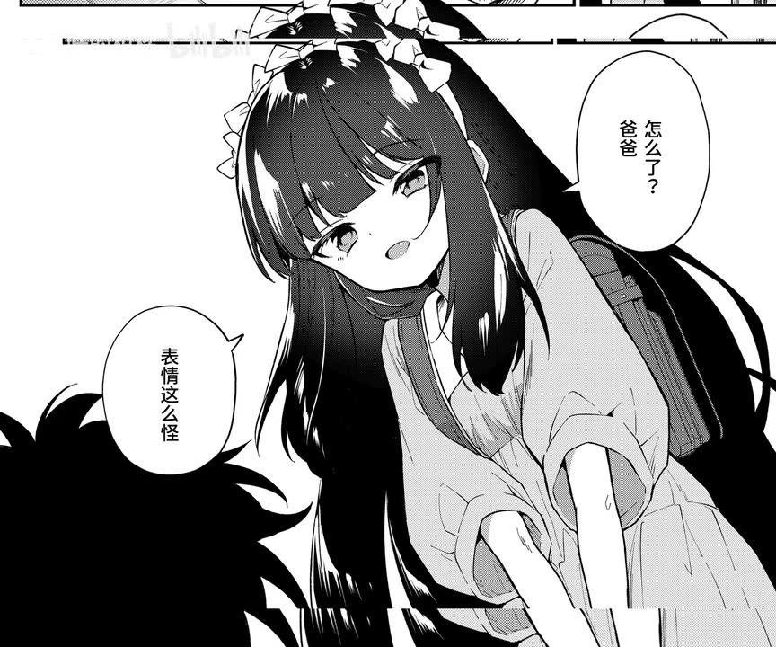

# 父女吵架后如何和好？【好本推荐】[野際かえで]『続・あたしはサキュバス』

> 来源：[Bilibili 视频](https://www.bilibili.com/video/BV1ioLb6DENB) 
> UP 主：西瓜味的柑橘｜时长：81 秒｜分辨率：1298 × 1080 
> 数据抓取时间：2026-07-16｜视频分类收藏：AIcode

## 小结

该视频是 UP 主“西瓜味的柑橘”发布的短篇漫画推荐/展示类视频。标题将主题概括为“父女吵架后如何和好”，并标注作品名为野際かえで的《続・あたしはサキュバス》。但现有可用素材中没有旁白正文，也没有站内字幕，因此不能仅凭标题扩写完整剧情、人物关系细节或“和好”的具体方式。

画面主要由黑白漫画分镜构成：可见一名长发角色、室内坐在桌前的成年男性角色，以及带有“爸爸”“怎么了？爸爸”“表情这么怪”等文字的画面。画面说明视频确实围绕家庭成员间的互动展开，但不足以验证冲突起因、事件转折和最终结局。

本次 ASR 检测到音轨，识别语言为日语，音频时长约 80.016 秒；但实际只在 **00:00:00.430—00:00:23.000** 识别出一段连续日语歌词式文本，语音覆盖率为 **28.21%**。该识别结果没有对应漫画剧情的可用解说信息，且 23 秒后未识别到可转写语音。因此，本整理将 ASR 仅作为音轨存在及其时间范围的证据，不把其内容误作剧情台词。

适合希望快速确认视频主题、作品来源、画面线索与资料可信边界的读者。若需要获取作品完整剧情、角色设定或结局，应进一步查阅原作及其正式出版/发布页面；本视频现有素材不能支持完整复述。

## 思维导图

## 目录

- [视频信息与证据边界](#视频信息与证据边界)
- [开场音轨与首个角色画面](#开场音轨与首个角色画面-000000)
- [室内男性角色与家庭场景](#室内男性角色与家庭场景-000000)
- [可见对话：对父亲异常表情的关注](#可见对话对父亲异常表情的关注-000000)
- [角色特写与叙事留白](#角色特写与叙事留白-000000)
- [技术参数、步骤与限制](#技术参数步骤与限制)
- [时效性与数据快照](#时效性与数据快照)
- [字幕比对](#字幕比对)
- [评论分析](#评论分析)
- [处理记录](#处理记录)

## 视频信息与证据边界

视频标题标明其为“好本推荐”，作品署名为“野際かえで”，并给出日文作品名《続・あたしはサキュバス》。标题还使用“父女吵架后如何和好？”作为引导语；这可以视为发布者对视频主题的概括，但不能替代原作文本，也不能据此补全未在画面或字幕中出现的情节。

视频总时长为 **81 秒**。素材中虽列出 `frames/frame-001.jpg` 至 `frames/frame-012.jpg` 共 12 个关键帧路径，但本次实际可见并可核验内容的图像为前 4 张；且未提供这些关键帧各自对应的采样时间。因此，正文不会为每张关键帧虚构秒数，只在有真实 ASR 时间段支撑的章节使用时间轴链接。

视频的标签包含“漫画”“父女”“女儿”“爸爸”等，进一步表明上传页面将其归入家庭关系与漫画内容范畴；标签属于页面元数据，不等同于对原作所有人物关系和剧情走向的独立证明。

## 开场音轨与首个角色画面 [00:00:00](https://www.bilibili.com/video/BV1ioLb6DENB?t=0)

本次 ASR 的唯一有效分段从 **00:00:00.430** 开始，至 **00:00:23.000** 结束。识别文字为一段日语连续文本：

> 雨が降った 花が散ったただ染まった 頬を持った僕はずっと バケツいっぱいの月光の本当なんだ 夜みたいで薄く透明な口騒いでそうなんだって 笑ってもいいけど

该文本呈现为连续歌词/歌唱式语句，未出现能够稳定对应漫画人物、作品标题或事件的清晰叙事信息。结合 ASR 仅有一个长分段、没有逐句切分的特点，不能据此判断画面人物正在说这些话，也不能将其翻译后作为剧情台词使用。

> 图：画面展示一名长发角色站在前景，后方还有一名体型较小的角色；右侧气泡可见“爸爸—”。这张图的价值在于直接提供了视频中“父亲”称谓的画面证据，并呈现多名角色同框的家庭互动语境。由于缺少完整前后页与可读时间戳，无法判断这句话的具体对象、情绪原因及后续发展。

## 室内男性角色与家庭场景 [00:00:00](https://www.bilibili.com/video/BV1ioLb6DENB?t=0)

画面切换至室内构图：一名戴眼镜、有胡茬的成年男性坐在桌前回头望向画外。其身后可见简洁的室内布置，右侧桌面上摆有多个瓶装物，画面边缘还有袋装物品。

> 图：这张关键帧展示成年男性角色在室内回头的瞬间。它有助于确认视频并非仅展示单一角色立绘，而是包含人物相互注视的连续漫画分镜；但图片中没有足够完整、清晰的对话文字，不能确认他当时的想法或此前发生了何种争执。

从叙事功能看，这一镜头可合理描述为“角色对画外人物或事件作出反应”；这是基于构图的画面理解，而非原作文本的逐字释义。标题所称的“父女吵架”是否正发生在这一页、谁主动发起对话、男性是否就是标题中的父亲，仍应保留为未证实信息。

## 可见对话：对父亲异常表情的关注 [00:00:00](https://www.bilibili.com/video/BV1ioLb6DENB?t=0)

在一张长发角色的近景中，可读到两个中文气泡文字：

- “怎么了？爸爸”
- “表情这么怪”

这表明画面中的说话者注意到“爸爸”的表情异常，并主动询问。它是目前关键帧中最清晰的、可直接支持“家庭成员间发生沟通”的证据。

> 图：画面展示长发角色俯身靠近的姿态，气泡中明确出现“怎么了？爸爸”“表情这么怪”。其价值在于保留了视频可见的具体文本线索：互动的焦点是父亲的异常表情，而非可被任意扩展的完整争吵过程。

需要区分以下层次：

1. **画面可证实**：角色使用了“爸爸”这一称呼，并询问其表情为何异常。
2. **标题可提供的主题线索**：发布者以“父女吵架后如何和好”概括视频卖点。
3. **不能证实的部分**：争吵发生的原因、时间、双方说过的话、具体和好行为，以及结局是否已经在这 81 秒内完整展示。

因此，若把视频作为“亲子沟通案例”参考，最多只能提炼出一个有限经验：当观察到对方状态异常时，先直接表达关切、询问感受，是画面中确实出现的互动动作。不能将其概括为已被视频证明有效的“和好方法论”。

## 角色特写与叙事留白 [00:00:00](https://www.bilibili.com/video/BV1ioLb6DENB?t=0)

后续可见画面为长发角色的面部特写：她以手指靠近嘴部，面部带有轻微微笑或思考式表情。该画面没有可读的完整对话框，无法仅凭表情确认她是在安慰、计划、保守秘密，还是处于其他情绪状态。

> 图：这张图突出角色的面部表情及手指靠近嘴部的动作，适合作为“叙事未明示、依赖上下文理解”的例子。它能说明视频使用特写强化人物情绪，但不能单独证明任何具体剧情结论。

本视频的表现方式更接近“以漫画分镜配合背景音频进行快速展示”，而不是有完整口播解释的书评。对于这类内容，可靠整理应优先记录可见分镜、可读文字、作品署名和音轨事实，而不是把标题、标签或评论中的反应扩展成剧情梗概。

## 技术参数、步骤与限制

### 素材与识别参数

| 项目 | 结果 |
| --- | --- |
| 视频时长 | 81 秒 |
| 原始媒体分辨率 | 1298 × 1080 |
| 页面字幕 | 未提供可用站内字幕 |
| 音轨状态 | 存在音轨；`noAudioStream` 未标记为 `true` |
| ASR 模型 | medium |
| ASR 运行设备 | CUDA |
| 计算精度 | float16 |
| 自动识别语言 | 日语（`ja`） |
| 语言置信度 | 0.9638671875 |
| 音频分析时长 | 80.016 秒 |
| ASR 语音覆盖 | 22.57 秒，占 28.21% |
| ASR 有效分段 | 1 段，00:00:00.430—00:00:23.000 |
| 关键帧目录 | 列出 12 个路径；本次实际可核验画面为所提供的前 4 张 |

### 本整理采用的工作步骤

1. **核对页面元数据**：确认 BV 号、标题、UP 主、时长、分辨率、标签与互动统计。
2. **检查站内字幕可用性**：素材明确说明未提供可用站内字幕，不能将其视作文本依据。
3. **检查本次 ASR**：确认 ASR 并非空结果，且音轨存在；识别语言为日语，但仅覆盖视频前约 23 秒。
4. **评估 ASR 与主题关联性**：ASR 文本不含可靠的人物名、作品名或对话结构，且更像背景歌曲片段，因此不用于还原漫画剧情。
5. **基于关键帧提取可见信息**：仅记录能在已提供画面中直接观察到的角色构图、室内场景及可读文字。
6. **控制推断范围**：以“可证实”“标题线索”“无法确认”三区分结论，避免将标签、评论和表情解释写成既定事实。

### 使用限制

- 关键帧没有附带逐帧采样时间，不能将 `frame-001.jpg` 至 `frame-004.jpg` 精确映射为某一秒的内容。
- ASR 的唯一片段与漫画画面缺乏稳定的语义对应关系，不能替代剧情字幕。
- 视频没有可用站内字幕，也未提供原作页序、完整台词或作品发行信息。
- 标题中的“父女”“吵架”“和好”应作为发布者给出的主题摘要，而不是可独立验证的全部剧情事实。
- 视频标签含有成人向语境可能涉及的词汇，但本整理不据此推断或描述未在现有关键帧中明确呈现的内容。

## 时效性与数据快照

页面统计数据为抓取时快照，后续会随播放、点赞、收藏、评论等用户行为变化，不应视为长期固定值：

| 指标 | 抓取时数值 |
| --- | ---: |
| 播放 | 102,458 |
| 点赞 | 6,248 |
| 收藏 | 12,908 |
| 投币 | 162 |
| 分享 | 309 |
| 弹幕 | 104 |
| 评论 | 248 |

视频元数据的抓取时间为 **2026-07-16**。发布时间字段经 Unix 时间戳换算为 **2026-05-21 10:10:40**，但原始元数据未给出时区，故该时间只能作为时间戳换算结果使用。

作品署名、标题、标签和视频页面状态也可能被发布者或平台后续修改；本页记录的是所给素材范围内的版本。

## 字幕比对

| 字幕来源 | 完整性 | 专有名词 | 时间轴 | 主要问题 |
| --- | --- | --- | --- | --- |
| Bilibili 站内字幕 | 无可用字幕 | 无法核验 | 无 | 素材明确未提供可用站内字幕，不能用于剧情整理。 |
| 本次 ASR 字幕 | 低：仅覆盖约 22.57 秒/80.016 秒音频 | 未识别出作品名、作者名或可确认角色名 | 有：00:00:00.430—00:00:23.000 | 仅 1 个长分段；文字呈日语歌词式连续片段，与漫画剧情缺少可验证对应；后续约 57 秒未形成转写内容。 |

### 最终字幕选择

不采用任何一份字幕作为完整剧情底稿：

- **站内字幕**：无可用文件，无法采用。
- **本次 ASR**：保留其时间信息与日语音轨识别结果，但不把识别文本翻译为人物台词，也不作为作品剧情证据。
- **画面校正方式**：正文以关键帧可见文字为准，已记录“爸爸—”“怎么了？爸爸”“表情这么怪”等内容；这些文字来自画面而非 ASR。

本次 ASR 结果中没有 `noAudioStream=true` 标记，因此应如实判定源视频**有音轨**；问题不在于“工具失败”，而在于该音轨的可识别语音覆盖有限，且没有提供可用于漫画剧情转写的有效解说。

## 评论分析

仅获取到 2 条热评，少于“热评前三条”的上限；以下仅分析可获取内容，不补造第 3 条。

### 1. 掌大胆： “被野际老师吓得到处乱跑”

- **点赞数**：463
- **观点概括**：评论者用夸张表达描述自己被“野际老师”作品内容震撼或惊吓后的反应。
- **可提供的信息**：可侧面反映该评论者认为作品存在出乎意料、冲击感较强的情节或氛围。
- **可信度与边界**：这是主观感受，未说明具体页数、事件或作品质量标准；不能据此确认原作具有何种剧情反转，更不能将“吓人”解释为具体情节事实。

### 2. 弥叶笙： “看到剧情后我的表情belike：”

- **点赞数**：311
- **观点概括**：评论者以网络表达方式暗示自己看到剧情后出现了难以言表的表情反应。
- **可提供的信息**：与第一条一样，说明部分观众将作品体验概括为“意外”或“冲击”。
- **可信度与边界**：评论未给出具体剧情信息，也没有附带可核验论据；它只能代表单个用户的观看反应，不能作为原作内容说明或推荐质量结论。

两条评论的共同点是强调“剧情带来的反应”，但都没有新增可验证事实。由于无法获取第三条热评，本节不对缺失内容进行推测。

## 处理记录

- **Worker ID**：worker-mrj0wjed-b0c290ad
- **模型**：gpt-5.6-terra
- **调用工具与模型信息**：素材侧 ASR 使用 `medium` 模型，运行于 CUDA，计算精度为 float16；本整理依据提供的视频元数据、ASR 诊断、SRT 文本、关键帧与热评 JSON 生成。
- **使用的素材工具产物**：`info.json`、`asr/asr-result.json`、`asr/transcript.srt`、关键帧目录 `frames/`、`comments/comments.json`。
- **字幕选择**：站内字幕不可用；已检查本次 ASR。最终不使用 ASR 作为剧情字幕，仅采用其真实时间段和音轨识别信息；画面中可见中文气泡文字作为有限文本依据。
- **关键帧选择依据**：选用 `frame-001.jpg` 至 `frame-004.jpg`，因为它们是本次素材中实际提供、可直接核验的画面，分别覆盖“爸爸”称呼、室内男性角色、关切父亲表情的对话和角色特写。未为关键帧编造采样秒数。
- **缓存清理**：未提供缓存清理执行日志；本记录不宣称已执行或已验证缓存清理。
- **未解决问题**：缺少可用站内字幕、原作完整文本、关键帧时间戳以及视频后半段可用语音转写；因此无法可靠复原标题所指“吵架后和好”的完整过程与结局。
