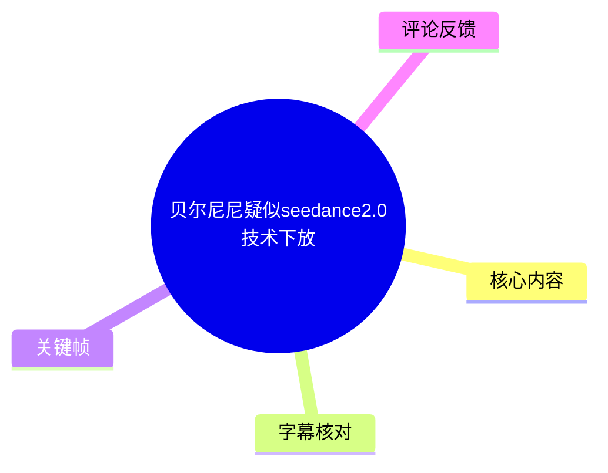
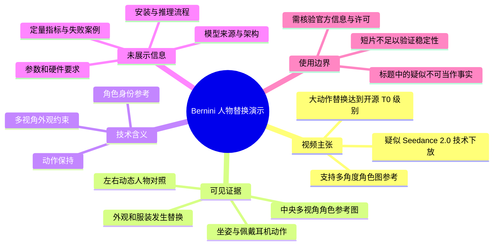
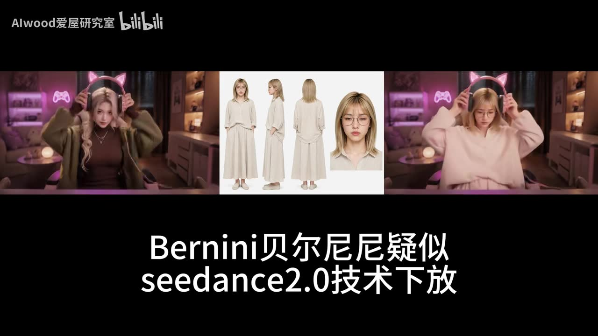
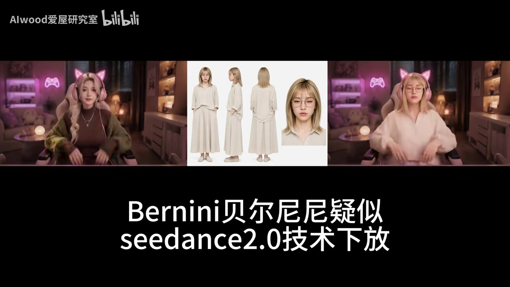

# 贝尔尼尼疑似seedance2.0技术下放

> 来源：[Bilibili 视频](https://www.bilibili.com/video/BV1ZQVv6hEup) 
> UP 主：AIwood爱屋研究室｜发布时间：2026-06-02｜视频时长：11 秒｜分辨率：1920×1080

## 小结

该视频以一组并排画面对照展示名为 **Bernini（贝尔尼尼）** 的人物替换／动作迁移效果。画面中央是一张包含正面、侧面、背面及面部特写的角色参考图；左右两侧则呈现同一室内坐姿与连续动作下、不同外观角色的动态结果。

视频标题提出“**贝尔尼尼疑似 seedance2.0 技术下放**”，而投稿简介进一步声称：实测支持“多角度角色图参考”，且“大动作替换达到开源 T0 级别”。这些属于 UP 主的判断与实测结论，不等同于对模型来源、架构或训练数据的官方确认。

从可见画面看，演示重点是：在人物抬手、佩戴猫耳耳机等连续动作中，目标角色的服装、发型、眼镜等外观特征与中间参考图之间存在对应关系，同时动作节奏保持同步。该演示可以作为“多视角角色参考驱动人物外观替换”的直观样例，但 11 秒素材没有展示模型下载地址、许可证、工作流、推理参数、显存占用、输入图数量上限或失败案例。

本条内容适合关注开源视频生成、ComfyUI 工作流、角色一致性和动作迁移的读者快速了解一个待验证的项目线索。若计划复现或用于生产，应另行核对 Bernini 的官方仓库、模型版本、授权条款及完整测试集；仅凭这段短演示不能证明其与 Seedance 2.0 存在技术继承关系。

时效性方面，视频发布于 2026-06-02，且标题使用“疑似”。模型能力、公开状态、版本与可用工作流都可能在发布后变化；本文仅记录本视频及所给元数据所能支持的事实。

## 思维导图

## 目录

- [视频背景与证据边界](#视频背景与证据边界-0000)
- [画面对照：多视角角色参考与动态替换](#画面对照多视角角色参考与动态替换-0000)
- [可提炼的测试方法与观察维度](#可提炼的测试方法与观察维度-0000)
- [已知参数、限制与时效性](#已知参数限制与时效性-0000)
- [字幕比对](#字幕比对)
- [评论分析](#评论分析)
- [处理记录](#处理记录)

## 视频背景与证据边界 [00:00](https://www.bilibili.com/video/BV1ZQVv6hEup?t=0)

视频标题为“贝尔尼尼疑似seedance2.0技术下放”，投稿标签包含“开源模型”“comfyui”“seedance2.0”“Bernini”。投稿简介给出的完整文字为：

> 实测支持多角度角色图参考，并且大动作替换达到开源T0级别

因此，视频传达的核心信息可拆分为三层：

1. **项目／模型名称线索**：演示对象被称为 Bernini。
2. **能力主张**：支持以多角度角色图作为参考，并进行大动作条件下的人物替换。
3. **横向定位主张**：UP 主将其评为“开源 T0 级别”。

需要严格区分证据等级：

- **可由画面直接确认**：画面中存在多视角人物参考图；两侧存在人物外观不同、动作连续的动态片段；底部显示标题文字。
- **来自投稿简介的陈述**：支持多角度角色参考、大动作替换能力及“开源 T0”评价。
- **尚未被本素材证实的事项**：Bernini 是否开源、是否采用或下放 Seedance 2.0 的具体技术、模型架构、训练数据、权重来源，以及性能是否在系统测试中达到某一排名。

由于本次 ASR 没有生成带时间的语音片段，无法以字幕边界进一步拆分 11 秒内的论述节点。本文所有视频正文时间轴均锚定可确认的视频起点 `00:00`，不根据文字叙述顺序虚构更细时间点。

## 画面对照：多视角角色参考与动态替换 [00:00](https://www.bilibili.com/video/BV1ZQVv6hEup?t=0)

画面采用三栏构图：

- **中间栏**：白底角色参考板，包含同一女性角色的正面、侧面、背面全身形象，以及一张面部近景。角色为浅色长发、圆框眼镜、浅色宽松上衣与长裤。
- **左侧栏**：粉紫色室内场景中的坐姿女性，外观表现为长卷发、深色内搭与绿色外套。
- **右侧栏**：相同或高度相近场景和机位中的坐姿女性，外观表现为金色短发、圆框眼镜、浅粉色宽松上衣。

左右人物会完成抬手、触碰或佩戴猫耳耳机等动作。两侧场景中的椅子、背景灯光、桌面与构图接近，便于观察人物外观变化与动作对应关系。中央参考板中同时提供正侧背面，正好对应投稿简介中“多角度角色图参考”的说法；但视频未公开说明这些图如何输入模型、是否需要固定顺序、是否支持额外图片或是否经过预处理。

> 图：该帧清楚同时呈现左侧原始风格人物、中间正侧背面与脸部参考、右侧目标风格人物，并捕捉到双方抬手接触猫耳耳机的相近动作。它是判断演示确实包含“多视角参考 + 动态动作对照”的关键视觉证据；但无法单独证明底层模型架构或技术来源。

> 图：该帧显示左右人物都处于耳机佩戴后的坐姿阶段，右侧人物保留了参考角色的眼镜、浅色发型和浅色服装特征。其价值在于观察动作完成阶段的角色外观一致性；该单帧不能用于判断长时序稳定性、遮挡恢复质量或复杂镜头切换能力。

从画面可谨慎得出的经验是：若目标是让生成角色在动态片段中尽量保留外观特征，提供正面、侧面、背面和面部信息，比只有单张正脸更有可能覆盖发型、衣物轮廓及侧背面细节。但“更有可能”是基于此演示设计的实践性推论，不是视频给出的定量结论。

## 可提炼的测试方法与观察维度 [00:00](https://www.bilibili.com/video/BV1ZQVv6hEup?t=0)

视频没有提供可执行的 ComfyUI 节点图、命令或参数，因此不能据此编造安装步骤。结合其呈现方式，若要独立复验类似能力，可采用以下**验证流程**；这些是面向复现者的测试建议，不应误写成视频内已经披露的工作流。

### 1. 准备可识别的多视角角色参考

参考视频中央参考板的组织方式，至少分别观察：

- 正面全身：用于约束正脸、正面衣物和整体比例；
- 侧面全身：用于检验侧脸、发型侧轮廓和衣物侧面；
- 背面全身：用于检验背发、背部服装和转身时的身份保持；
- 面部近景：用于强化眼镜、五官与局部发型等高辨识度特征。

素材未给出输入分辨率、图片数量限制、参考图拼接方式或是否必须使用白底，因此这些设置均需以模型文档或实际测试为准。

### 2. 选择含明显肢体变化的视频片段

视频选择了上肢抬起、双手接触头部、佩戴耳机的动作。这类片段能够集中检查：

- 手臂和手部在运动中的形变是否合理；
- 手、耳机与头发接触时是否出现穿帮；
- 头部运动后眼镜、发型和脸部身份是否漂移；
- 大幅动作下服饰轮廓是否能保持。

若仅测试静态坐姿，很难支持“大动作替换”的结论；应另外加入转身、遮挡、快速摆臂、不同景别和镜头运动等未在本视频中展示的案例。

### 3. 用对照布局记录结果

本视频的三栏布局提供了值得借鉴的展示方法：

| 区域 | 展示内容 | 可回答的问题 |
| --- | --- | --- |
| 左侧 | 输入动作视频或源人物片段 | 动作、场景与机位是什么 |
| 中间 | 多视角角色参考 | 目标身份的外观约束来自哪里 |
| 右侧 | 输出结果 | 外观是否随动作保持，是否贴合参考身份 |

复验时建议保留相同随机种子、相同源视频与相同参考图，仅改变一个变量，例如参考图从一张增加至多张，或改变动作幅度。这样才能判断性能变化是否由多视角条件带来，而非提示词、后处理或挑选结果造成。

### 4. 报告失败率与资源条件

短演示只展示了成功片段。若要支撑“开源 T0”这样的比较性结论，至少还需要公开或记录：

- 测试视频数量、总帧数和成功／失败比例；
- 角色参考图数量及其质量；
- 输出时长、帧率、分辨率；
- 模型版本、采样／推理设置和随机种子；
- GPU 型号、显存占用与单次生成耗时；
- 是否使用姿态、深度、分割、光流或其他控制预处理；
- 与哪些开源基线比较，以及使用何种评价标准。

上述数据在现有视频、元数据和字幕中均未提供。

## 已知参数、限制与时效性 [00:00](https://www.bilibili.com/video/BV1ZQVv6hEup?t=0)

### 素材中可确认的参数

| 项目 | 已知值 | 依据 |
| --- | --- | --- |
| 视频时长 | 11 秒（提取音频时长约 10.219 秒） | 视频元数据、ASR 诊断 |
| 画面分辨率 | 1920×1080 | 视频元数据 |
| 演示参考形式 | 正面、侧面、背面全身图 + 面部近景 | 关键帧画面 |
| 画面动作 | 坐姿下抬手并佩戴／调整猫耳耳机 | 关键帧画面 |
| 项目名称 | Bernini／贝尔尼尼 | 标题、标签 |
| 投稿方的能力表述 | 多角度角色图参考；大动作替换 | 投稿简介 |

### 未披露且不能补全的关键参数

以下信息未出现在给定素材中：模型权重或仓库地址、版本号、许可证、支持的平台、ComfyUI 安装方法、节点名称、提示词、采样器、步数、CFG、分辨率限制、视频时长限制、显存要求、推理耗时、输入视频处理策略以及输出后处理流程。

尤其是“疑似 Seedance 2.0 技术下放”只是一则标题判断：没有官方引用、技术论文、代码比对或模型声明时，不能据此断言 Bernini 与 Seedance 2.0 存在直接的代码、权重、架构或数据关系。

### 适用范围与风险

- **可作为视觉线索**：适用于寻找多视角参考人物替换方向、设计演示对照布局和制定动作一致性测试项。
- **不可作为性能保证**：不能外推到长视频、复杂多人互动、快速镜头运动、严重遮挡、极端角度或不同光照条件。
- **身份与肖像风险**：人物替换涉及肖像、角色形象及素材授权。公开视频效果不代表拥有对输入人物、参考图或生成结果的商业使用权。
- **选择性展示风险**：仅有 11 秒成功样例，缺少失败结果和重复试验，不能推导整体稳定性。
- **时效性风险**：模型项目的公开状态、版本和工作流可能已变更。阅读或复现前应以发布者的最新官方渠道为准。

## 字幕比对

站内没有提供可用字幕。本次 ASR 已实际检查：识别模型为 `medium`，自动语言检测结果为英语（概率 `0.541015625`），但最终没有输出任何语音分段，`sentenceCount`、`speechSeconds` 与 `speechCoverage` 均为 `0`。

ASR 诊断仅提示“未识别到语音片段，建议确认是否存在可听语音并使用正确音轨重试”。诊断数据**没有**标记 `noAudioStream=true`，且素材清单中存在 `audio/audio.wav`；因此不能称源视频“没有音轨”，只能如实记录为：本次 ASR 未识别出可转写的语音内容，可能是无语音、以音乐／环境声为主，或语音识别未能覆盖。

| 字幕来源 | 完整性 | 专有名词 | 时间轴 | 主要问题 |
| --- | --- | --- | --- | --- |
| Bilibili 站内字幕 | 不可用 | 无法核对 | 无 | 素材明确说明未提供可用站内字幕 |
| 本次 ASR 字幕 | 空输出 | 无法转写或核对 | 无可用分段 | `medium` 模型未识别到语音片段；语言检测为英语、概率约 0.541，覆盖率为 0 |

最终没有采用字幕文本作为事实来源。本文对“Bernini／贝尔尼尼”“Seedance 2.0”“多角度角色图参考”等词的记录，来自视频标题、投稿简介、标签和关键帧中可见的文字；对动态效果的描述来自关键帧多模态画面理解。由于不存在有效的 SRT 或 ASR 分段，除视频起点外不标注未经证实的细粒度语音时间点。

## 评论分析

本次仅获取到 2 条热评，少于“三条”的上限；以下仅分析已获取的两条，且不将评论中的技术判断视为已验证事实。

### 热评 1：关于姿态预处理与能力边界

- **用户／获赞**：`wuwukasi`，9 赞。
- **观点概括**：评论者称其此前使用 Seedance 2.0 做动作迁移时观察到姿态预处理；并认为本视频中的模型似乎在没有姿态处理的情况下进行人物替换，路线更接近 Mocha，但对“图片的动作迁移”能力表示怀疑。
- **补充价值**：该评论提出了一个重要的复验问题：输出是通过显式姿态条件控制，还是通过端到端视频条件保持动作；两者会影响可控性、适用输入和失败模式。
- **可信度与边界**：这是个人使用经验和技术推测。视频本身没有展示预处理流程、节点图或日志，不能据此确认 Bernini 是否使用姿态预处理，也不能确认其与 Mocha 的技术路线相似。

### 热评 2：关于视频模型的竞争瓶颈

- **用户／获赞**：`影月LuneZ`，7 赞。
- **观点概括**：评论者认为视频生成的瓶颈可能不主要在架构，而在高质量训练数据和训练算力；其理由是若干表现最好的模型背靠大型视频平台。
- **补充价值**：该观点提醒读者，单个视觉样例不足以只从“模型架构”解释效果，训练数据规模、数据清洗、算力和工程系统都可能影响性能。
- **可信度与边界**：这是宏观行业判断，评论没有提供可核查的模型名单、数据规模或对照实验。它可以作为评估开源模型与平台模型差异时的观察框架，但不能作为本视频中 Bernini 技术来源或性能排名的证据。

## 处理记录

- **Worker ID**：`worker-mrj0wbly-5dc4e50c`
- **整理模型**：`gpt-5.6-terra`
- **ASR 模型与运行信息**：`medium`；CUDA；`float16`；自动语言识别为 `en`，概率 `0.541015625`。
- **使用的素材与工具结果**：使用已提供的视频元数据、投稿简介与标签、关键帧目录、音频 ASR 诊断、站内字幕检查结果及热评采集结果；素材清单显示已生成合并视频、WAV 音频、12 张关键帧和 ASR 输出路径。
- **字幕选择**：站内字幕不可用；本次 ASR 已检查但为空输出，未采用任何虚构转写。正文改以标题、简介、标签、关键帧和元数据为证据来源。
- **关键帧选择依据**：选用 `frames/frame-003.jpg` 展示抬手接触耳机时的三栏对照与多视角参考板，选用 `frames/frame-004.jpg` 展示耳机佩戴后阶段的外观保持；两帧均直接服务于“多视角参考”和“动作中的人物替换”两个主题。未将关键帧推定为精确时间点。
- **评论处理范围**：按“可获取热评前三条”限制处理；实际仅获取 2 条，未补造第 3 条。
- **缓存清理**：提供的素材与执行记录中未包含缓存清理日志，无法确认是否已清理，不作未发生证据支持的声明。
- **未解决问题**：缺少官方项目链接、模型版本与许可信息、完整工作流、推理参数、硬件数据、定量对比、失败样本和有效字幕；“疑似 Seedance 2.0 技术下放”的技术关联无法由现有素材验证。
