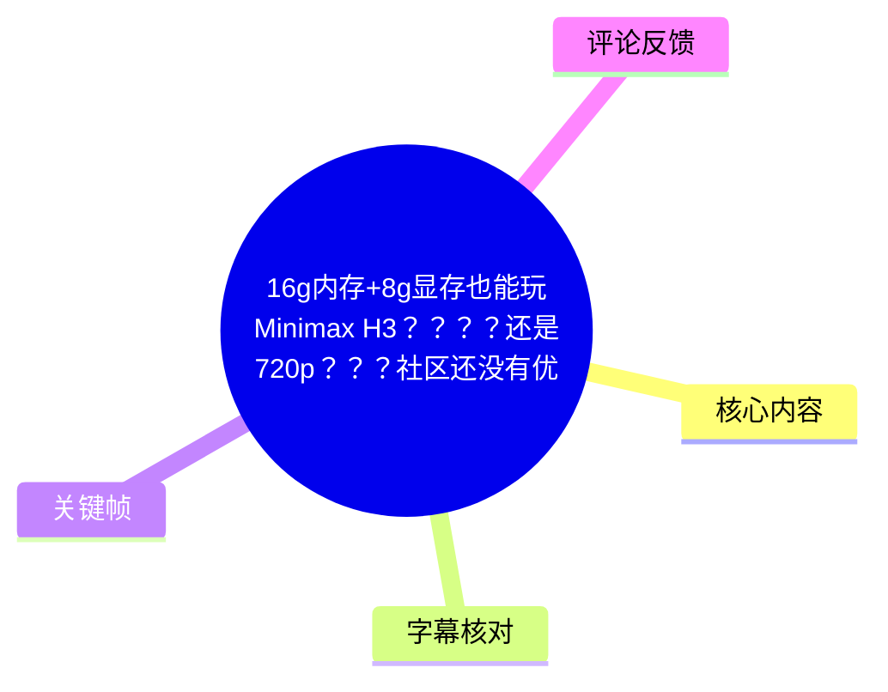
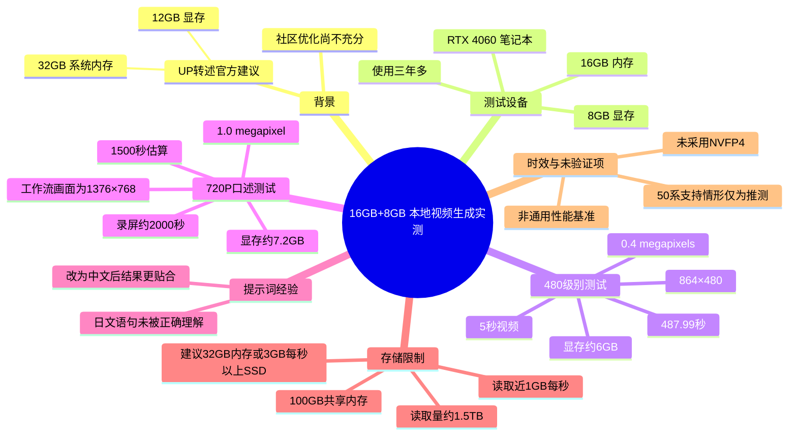
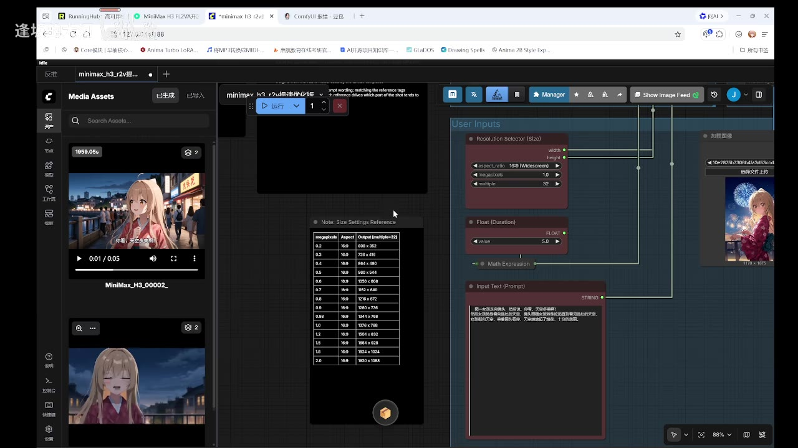
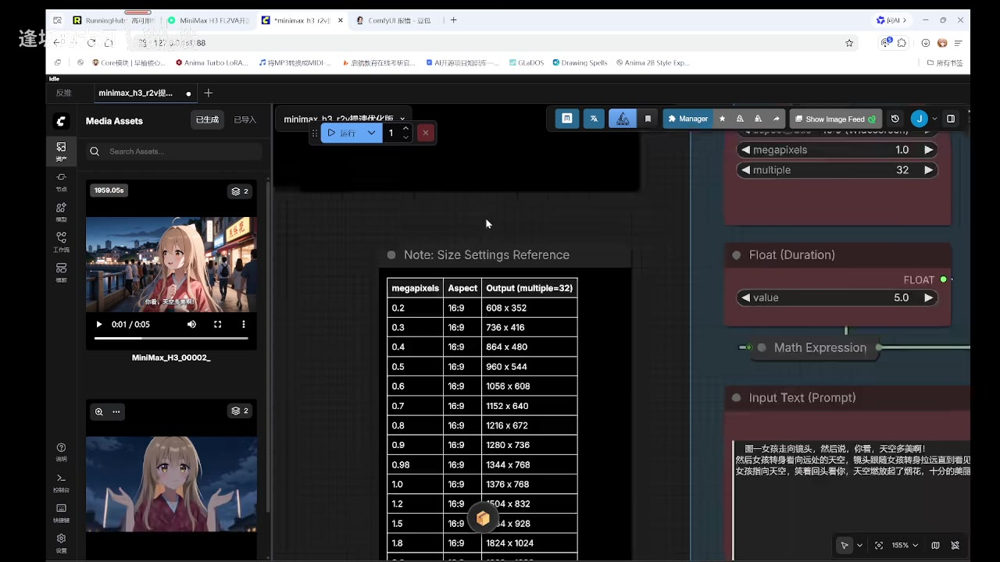
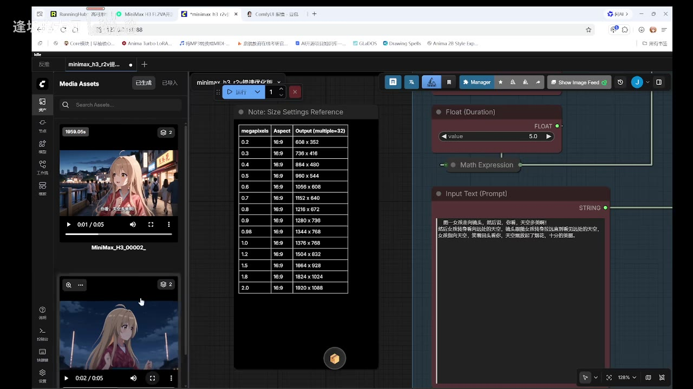
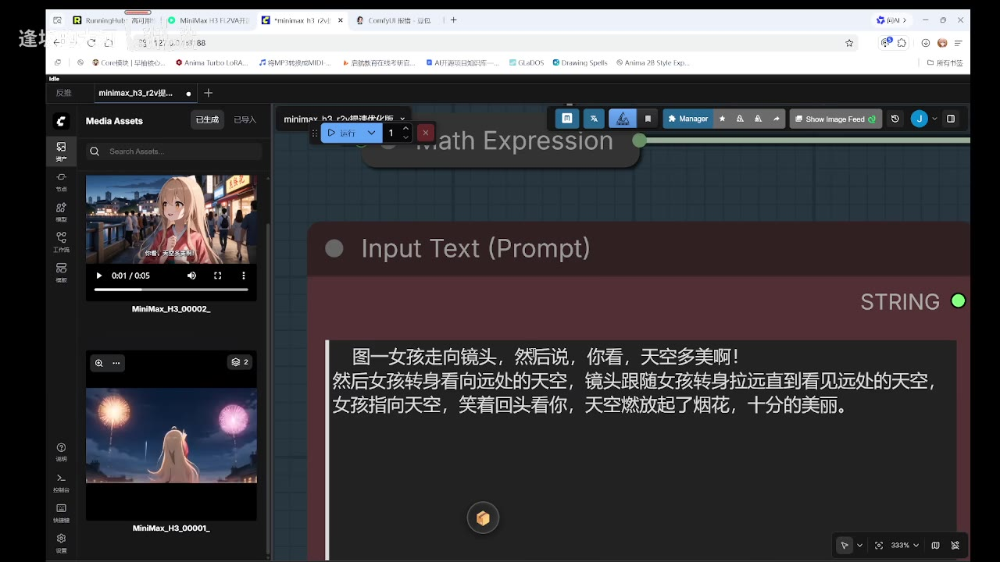

# 16g内存+8g显存也能玩Minimax H3？？？？还是720p？？？社区还没有优化？？？

> 来源：[Bilibili 视频](https://www.bilibili.com/video/BV1XGMR6wE9Z)  
> UP 主：逢坂的大河｜视频时长：3 分 47 秒｜画面规格：1280×720  
> 素材抓取时间：2026-08-03；视频中的模型、社区优化与硬件支持状况均具有明显时效性。

## 小结

视频记录了一次**低于官方建议配置的本地视频生成实测**：UP 主使用配备 **16GB 内存、8GB 显存的 RTX 4060 笔记本**，尝试运行标题所称的 MiniMax H3／视频模型工作流。UP 主转述官方文档建议为“32GB 内存 + 12GB 显存”，且在桌面端 RTX 3060 上也只能勉强运行；但其实测表明，16GB + 8GB 并非完全不能运行。

实测先以工作流中标为 **0.4 megapixels、16:9、864×480** 的尺寸生成 5 秒视频，耗时 **487.99 秒**，即约 8 分钟。UP 主称该过程实际显存使用约 **6GB**。之后改为工作流中标为 **1.0 megapixel、16:9、1376×768** 的尺寸——视频口述称“720P”——显存占用约 **7.2GB**；在未录屏的估算下，5 秒视频约需 **1500 秒（25 分钟）**，录屏时则被拖慢至约 **2000 秒（约 33 分钟）**。

这不是“低配可流畅使用”的结论，而是“**能否启动并完成一次推理**”的验证。其代价是长时间推理，以及对系统内存和磁盘读取性能的高度依赖。UP 主为此开启了 **100GB 共享内存**，并观察到读取接近 **1GB/s**；他认为写入量较少、SSD 擦写压力未必很大，但读取总量可能达到约 **1.5TB**，因此慢盘或状态不佳的 SSD 可能成为实际瓶颈。

视频尤其适合已拥有 RTX 4060 8GB 显存设备、正在评估本地视频模型是否值得尝试的人。需要注意：视频发布时社区仍缺少充分优化；UP 主还提到其模型未使用 **NVFP4**，原因是 40 系设备不支持。因此，不能把本次单机、单工作流、单条提示词的结果外推为所有模型、所有节点版本或所有 4060 设备的稳定表现。

## 思维导图





## 目录

- [背景：官方建议与低配设备疑问](#背景官方建议与低配设备疑问-000001)
- [工作流画面与测试参数](#工作流画面与测试参数-003970)
- [480 级别测试：可运行但耗时约 8 分钟](#480-级别测试可运行但耗时约-8-分钟-010300)
- [“720P”测试：1376×768、约 7.2GB 显存](#720p测试1376768约-72gb-显存-013127)
- [提示词语言：日文失配与中文修正](#提示词语言日文失配与中文修正-010601)
- [内存、共享内存与 SSD 读取压力](#内存共享内存与-ssd-读取压力-025940)
- [可复用的实测步骤与决策建议](#可复用的实测步骤与决策建议-003970)
- [结论、限制与时效性](#结论限制与时效性-022089)
- [字幕比对](#字幕比对-000001)
- [评论分析](#评论分析-000001)
- [处理记录](#处理记录-000001)

## 背景：官方建议与低配设备疑问 [00:00:01](https://www.bilibili.com/video/BV1XGMR6wE9Z?t=1)

UP 主在开头表示，模型开源约三天，社区尚未形成充分优化方案。他转述“官方文档”的运行建议为：

| 项目 | UP 主转述的建议／情况 | 本次实测设备 |
| --- | --- | --- |
| 系统内存 | 建议 32GB | 16GB |
| 显存 | 建议 12GB | 8GB |
| 参考 GPU | 桌面端 RTX 3060 可勉强运行 | RTX 4060 笔记本 |
| 社区环境 | 模型刚发布，优化较少 | 直接进行原始尝试 |

这里的“官方建议”来自 UP 主口述，视频未展示官方原文，因此应视为**视频内转述**，而不是本整理独立核验过的官方配置要求。

UP 主的测试动机很明确：若 RTX 3060 在推荐配置下也较困难，那么自己的 RTX 4060 笔记本、8GB 显存与 16GB 内存是否完全无法尝试？其采取的策略不是等待成熟优化，而是先验证“能不能跑完”。

## 工作流画面与测试参数 [00:00:39](https://www.bilibili.com/video/BV1XGMR6wE9Z?t=39)

关键帧展示了 ComfyUI 风格的节点工作流界面。画面中可见：

- `Resolution Selector (Size)` 节点；
- 画幅比为 `16:9 (Widescreen)`；
- `megapixels` 可选值；
- `multiple` 为 `32`；
- `Float (Duration)` 节点值为 `5.0`，即生成时长 5 秒；
- 输入提示词由 `Input Text (Prompt)` 节点提供。



> 图：该画面同时呈现尺寸选择器、时长参数和提示词输入区，说明视频不是仅口头讨论硬件，而是在实际工作流中运行。它也提供了识别分辨率与时长的重要依据。

画面内的“Size Settings Reference”表列出了 16:9 输出尺寸，且均按 32 对齐：

| `megapixels` | 画幅 | 输出尺寸 |
| ---: | --- | --- |
| 0.2 | 16:9 | 608×352 |
| 0.3 | 16:9 | 736×416 |
| 0.4 | 16:9 | 864×480 |
| 0.5 | 16:9 | 960×544 |
| 0.6 | 16:9 | 1056×608 |
| 0.7 | 16:9 | 1152×640 |
| 0.8 | 16:9 | 1216×672 |
| 0.9 | 16:9 | 1280×736 |
| 0.98 | 16:9 | 1344×768 |
| 1.0 | 16:9 | 1376×768 |
| 1.2 | 16:9 | 1504×832 |
| 1.5 | 16:9 | 1664×928 |
| 1.8 | 16:9 | 1824×1024 |
| 2.0 | 16:9 | 1920×1088 |



> 图：该图是校正 ASR 中模糊分辨率表述的关键证据。视频口述把后一次测试称为“720P”，但工作流尺寸参考表的 1.0 megapixel 对应实际输出为 1376×768，不能将其严格等同于标准 1280×720。

## 480 级别测试：可运行但耗时约 8 分钟 [01:03](https://www.bilibili.com/video/BV1XGMR6wE9Z?t=63)

首次测试使用 `0.4 megapixels` 的 16:9 输出。依据工作流画面中的尺寸表，这一档为 **864×480**，而非仅凭 ASR 中的“0.400 万降速分辨率”字面判断。

UP 主报告的关键结果如下：

| 指标 | 视频内结果 |
| --- | --- |
| 输出规格 | 864×480，16:9 |
| 视频时长 | 5 秒 |
| 推理耗时 | 487.99 秒 |
| 换算时间 | 约 8 分 8 秒 |
| 推理节奏 | UP 主口述“20 秒一步” |
| 显存占用 | 约 6GB |
| 主观质量评价 | UP 主认为质量优于“万快笔尖 SD2.0”（ASR 专名不清，未作产品名校正） |

UP 主强调，在官方建议 12GB 显存的前提下，自己观察到该档任务只使用了约 6GB 显存。这能说明该特定工作流可以在 8GB 显存设备上完成一次生成，但不等于运行全程不存在内存交换、速度下降或其他资源瓶颈。

时间上，487.99 秒与 UP 主随后概括的“八分多钟”一致。对日常迭代而言，约 8 分钟生成 5 秒视频意味着试错成本较高；对只需偶发生成、愿意排队等待的用户，则具有可尝试性。

## “720P”测试：1376×768、约 7.2GB 显存 [01:31](https://www.bilibili.com/video/BV1XGMR6wE9Z?t=91)

在 480 级别测试后，UP 主继续提升尺寸，口述为“跑个 720P”。结合关键帧内尺寸表，工作流设置的 `1.0 megapixel`、16:9 对应 **1376×768**。这是略高于 720 行的 16:9 类分辨率，而非标准 1280×720；本整理因此保留视频中的“720P”称呼，同时记录画面可见的实际尺寸。



> 图：画面同时保留尺寸参考表、`Float (Duration)=5.0` 和左侧生成结果预览，帮助将“720P”“5 秒视频”等口述与工作流中的可见配置对应起来。

该档测试的报告结果为：

| 指标 | 视频内结果 |
| --- | --- |
| 工作流对应尺寸 | 1376×768，16:9，1.0 megapixel |
| 视频口述称呼 | “720P” |
| 视频时长 | 5 秒 |
| 显存占用 | 约 7.2GB |
| 理想／未录屏耗时 | 约 1500 秒，即 25 分钟 |
| 录屏时实际耗时 | 约 2000 秒，即约 33 分 20 秒 |
| 性能影响因素 | UP 主认为录屏消耗性能，导致耗时增加约 500 秒 |

UP 主据此推测，若换成桌面版 4060 或更高档 GPU，例如 4070、4070 Ti、4060 Ti、4080、4090，体验可能更好。但这是基于本次结果的**主观推断**，视频没有提供这些设备的对照测试，不能将其当作性能结论。

## 提示词语言：日文失配与中文修正 [01:46](https://www.bilibili.com/video/BV1XGMR6wE9Z?t=106)

视频不仅观察硬件资源，也展示了提示词语言带来的生成差异。

第一次 480 级别测试中，UP 主称提示词含日文“你看天空多美”一类表达，模型未能正确理解，最终语音／文本表现为乱码或不自然内容。第二次，他将提示词修改为中文，并展示了更贴合“你看天空多美啊”的结果。



> 图：提示词节点清晰展示了中文描述，是判断“第二次改用中文提示词”而非仅依据 ASR 的直接画面证据。

画面中可辨识的中文提示词大意为：

> 图一女孩走向镜头，然后说：“你看，天空多美啊！”  
> 然后女孩转身看向远处的天空，镜头跟随女孩转身拉远直到看见远处的天空，女孩指向天空，笑着回头看你，天空燃放起了烟花，十分的美丽。

这段经验的可迁移点是：在同一模型、相近工作流下，**文本语言与模型的理解效果直接影响最终视频语义和语音表现**。不过，视频未进行多次重复、不同语言的对照实验，也没有给出模型的正式语言支持列表；因此只能说此次样例中中文提示词效果更符合 UP 主预期，不能概括为模型必然不支持日文。

## 内存、共享内存与 SSD 读取压力 [02:59](https://www.bilibili.com/video/BV1XGMR6wE9Z?t=179)

为在 16GB 物理内存条件下完成任务，UP 主开启了 **100GB 共享内存**。视频中的资源判断可拆分为两部分：

1. **写入磨损判断**  
   UP 主观察到磁盘写入量较少，因此认为对 SSD 的擦写率较低、未必会明显伤害磁盘寿命。这是他针对本次运行情况的经验判断，不是对所有系统、驱动、缓存策略和工作流的通用保证。

2. **读取压力判断**  
   他观察到读取速度接近 **1GB/s**，并称一次约 1800 秒量级的生成任务可能读取接近 **1500GB（约 1.5TB）** 数据。ASR 在“1800m”处不够清晰，无法仅凭字幕确定其精确单位；但“读取接近 1GB/s”和“约 1500GB”的表述在视频中明确，核心含义是：**分页／共享内存会把瓶颈转移到 SSD 持续读取能力上**。

据此，UP 主给出的二选一建议是：

- 直接升级至 **32GB 内存**；或
- 使用读取性能较好的 SSD，建议读取速度在 **3GB/s 以上**。

这不是完整的硬件选型指南。除了顺序读取标称值，实际体验还会受到 SSD 容量余量、温度降速、随机读取、系统后台负载、PCIe 通道、内存压缩和工作流实现方式影响。视频没有给出具体 SSD 型号、监控工具读数截图或 RAM／VRAM 峰值曲线，故不能据此精确估算硬件下限。

## 可复用的实测步骤与决策建议 [00:00:39](https://www.bilibili.com/video/BV1XGMR6wE9Z?t=39)

以下是按视频实际操作逻辑整理出的测试路径，不包含视频未展示的安装命令、模型下载地址或节点配置细节。

### 1. 先确认自己的资源短板

至少记录：

- GPU 型号与显存容量；
- 系统内存容量；
- 系统盘／缓存盘的读取性能和健康状态；
- 是否会同时录屏、剪辑或运行其他占用 GPU 的软件。

本例的关键背景是 RTX 4060 笔记本、8GB 显存、16GB 内存，且设备已使用三年多。笔记本 GPU 的功耗、散热、CPU 与 SSD 配置都可能造成同型号间差异。

### 2. 从较低像素档和短时长开始

视频首先选择：

```text
画幅：16:9
像素档：0.4 megapixels
对应尺寸：864×480
时长：5.0 秒
尺寸对齐：32
```

先用低尺寸、短时长验证能否完成整个推理流程，再决定是否提高尺寸。这比直接冲击高分辨率更容易判断是显存不足、内存不足还是存储读取受限。

### 3. 记录每次运行的三个核心指标

视频至少提供了以下记录维度：

```text
输出尺寸 / 时长
总耗时
显存占用
```

对于实际复现，建议在不改变工作流的前提下补充记录系统内存峰值、共享内存使用量、磁盘读取速度、磁盘温度与是否录屏。后几项并非视频已经给出的数值，而是为了区分“模型本身慢”和“系统发生 I/O 交换”所需的观察项。

### 4. 升级尺寸时，区分“显示命名”与“实际像素”

视频把第二档称作“720P”，但工作流表中 1.0 megapixel 对应的是 **1376×768**。实际复测时应以节点中最终分辨率为准，避免仅以“480P／720P”等笼统名称横向比较耗时和显存。

### 5. 避免将录屏数据直接视为基准

UP 主称录屏使任务从约 1500 秒拖至约 2000 秒。需要性能基准时，应：

- 关闭录屏、浏览器视频播放和其他 GPU 密集型任务；
- 多次运行同一任务；
- 区分首次加载与第二次运行；
- 单独记录“可展示的录屏耗时”和“空载下耗时”。

### 6. 出现内存不足时，评估 SSD 是否适合作为代价承担者

100GB 共享内存可以让低内存设备完成任务，但不代表代价为零。视频的实务结论是：如果磁盘读取吞吐不佳，优先增加物理内存；若依赖共享内存，则需要性能更好的 SSD。尤其不应在空间紧张、温度容易降速或健康状态异常的系统盘上长时间盲测。

## 结论、限制与时效性 [03:30](https://www.bilibili.com/video/BV1XGMR6wE9Z?t=210)

本视频给出的最有价值信息不是“16GB + 8GB 能替代推荐配置”，而是一个边界案例：**在当时的模型与工作流下，RTX 4060 笔记本的 8GB 显存配合 16GB 内存、100GB 共享内存，能够完成 5 秒、1376×768 的一次视频生成。**

应同时保留以下限制：

- **样本极少**：视频展示的是单台设备、有限提示词、5 秒时长和少数尺寸档位，并非系统跑分。
- **耗时很长**：864×480 约 488 秒；1376×768 在未录屏估算下约 1500 秒。可完成不代表适合高频创作。
- **“720P”并非严格标准 720p**：关键帧表中对应值是 1376×768。
- **提示词影响显著**：日文示例的理解不佳、中文示例更贴合预期，但尚不足以得出通用语言支持结论。
- **存储可能是隐性瓶颈**：共享内存降低了物理内存门槛，却引入近 1GB/s 读取负担和可能很高的累计读取量。
- **NVFP4 未参与本次测试**：UP 主表示其 40 系设备不支持 NVFP4；对于 50 系设备可能更快的说法是推测，未在视频验证。
- **生态会变化**：UP 主及其热评均提到当时社区优化仍不成熟。后续可能出现注意力优化、量化版本或节点调整，性能数据会失效或变化。

因此，面向 8GB 显存用户的合理决策是：若目标是偶发体验和学习工作流，可以从 864×480、5 秒任务开始实测；若目标是稳定、频繁地生成较高分辨率视频，则 32GB 内存和更高性能 GPU／存储仍更符合视频自身呈现的资源规律。

## 字幕比对 [00:00:01](https://www.bilibili.com/video/BV1XGMR6wE9Z?t=1)

| 字幕来源 | 完整性 | 专有名词与数值 | 时间轴 | 主要问题 |
| --- | --- | --- | --- | --- |
| Bilibili 站内字幕 | 未提供可用字幕 | 无法核验 | 无可用分段 | 素材记录显示字幕工具因 `Invalid URL` 退出；本任务未获得站内字幕文本。 |
| 本次 ASR 字幕 | 较高；15 段，语音覆盖约 199.78 秒／226.496 秒，覆盖率 88.2% | 存在同音、断词和术语误识别 | 可用；SRT 提供毫秒级起止时间 | 如“昼存／显出”“磅盘”“0.400万降速”“1800m”等明显不准确或含义不清。 |

本次 ASR 使用模型为 `large-v3-turbo`，识别语言为中文，语言置信度 `0.998046875`，在 CUDA 上以 `int8_float16` 运行。诊断结果未标记 `noAudioStream=true`；相反，ASR 识别到稳定语音，因此本视频**有可用音轨**，不存在“无音轨而只能依靠画面”的情况。

最终采用策略为：**以本次 ASR 的时间戳为章节定位依据，以关键帧中的工作流可见文字校正关键参数，以不确定转写保留不确定性**。主要校正如下：

| ASR 表述 | 处理方式 | 校正依据 |
| --- | --- | --- |
| “0.400万降速分辨率的这个480P” | 整理为 `0.4 megapixels`、864×480、16:9 | 关键帧中的尺寸选择器和参考表。 |
| “720p分面语” | 整理为视频口述“720P”；实际节点对应 1376×768 | 关键帧尺寸表的 `1.0 → 1376×768`。 |
| “昼存／显出” | 统一为“显存” | 上下文均在讨论 GPU VRAM 占用。 |
| “磅盘” | 不擅自断定具体术语，正文以“SSD／磁盘”描述 | 语义指向磁盘读写与 SSD 寿命，但 ASR 发音不可靠。 |
| “1800m” | 保留为“约 1800 秒量级任务，原始单位不清” | ASR 文字含混，画面未提供该数值。 |
| “万快笔尖 SD2.0” | 不当作可确认产品名称 | 无站内字幕或关键帧可校正该专名。 |

## 评论分析 [00:00:01](https://www.bilibili.com/video/BV1XGMR6wE9Z?t=1)

仅处理本次可获取的热评前三条，评论内容反映用户态度与补充观点，不等同于已验证事实。

### 1. 太平岛逃兵（15 赞）

评论将当前开源 AI 生态形容为“入坑以来最好的夏天”，列举了其朋友购置高配电脑、使用 Anima 生成大量图像，以及 Krea2 int8 turbo 单张约 10 秒等体验。

- **观点**：开源模型与高性能硬件结合，正在显著降低高质量生图的时间成本，社区氛围积极。
- **与视频的关联**：从更宽泛的生图生态侧面呼应视频对“开源后可本地尝试”的兴奋感。
- **可信度与边界**：属于个人转述和主观评价；评论没有给出硬件、分辨率、版本、工作流或测量方法，不能用于验证本视频的视频生成性能。

### 2. 逢坂的大河（UP 主，14 赞）

UP 主补充称，AI 群里许多人担心模型跑不动或担心“烧固态”；他希望替处于 RTX 4060 档位的用户完成试探。评论还提到其测试“多半没上 saga attention”，社区优化尚未完善，部分模型甚至为 FP16；并以“等生态完善”表达对后续表现的期待。

- **观点**：本视频的定位是替 4060 用户验证下限，而不是宣称完成了成熟优化。
- **补充信息**：UP 主自述可能未使用 `saga attention`，并指出部分模型仍为 FP16，这可以解释当前资源占用和速度并不理想。
- **可信度与边界**：这是作者对自身环境的第一手补充，但“多半没上”的措辞并不构成精确配置清单；具体注意力实现、量化格式和版本仍需看实际工作流文件或后续说明。

### 3. 吃零食睡觉（1 赞）

评论称自己刚在秋叶社区看到 UP 主内容，随后就在 Bilibili 被推荐到该视频。

- **观点**：反映内容可能在多个 AI 社区间传播，并获得平台推荐。
- **与视频的关联**：仅说明传播路径与用户体验，不补充模型、硬件或性能事实。
- **可信度与边界**：属于个人平台使用体验，无法由此判断视频技术结论的准确性。

## 处理记录 [00:00:01](https://www.bilibili.com/video/BV1XGMR6wE9Z?t=1)

- **Worker ID**：`worker-mrj0wjed-b0c290ad`
- **整理模型**：`gpt-5.6-terra`
- **ASR 模型**：`large-v3-turbo`，中文识别，CUDA，`int8_float16`
- **可用素材**：视频元数据、ASR 分段 JSON、ASR SRT、4 张已提供的关键帧画面、热评前三条。
- **字幕检查与选择**：
  - 已检查站内字幕状态：未提供可用站内字幕；素材警告显示字幕工具遇到 `Invalid URL`。
  - 已检查本次 ASR：存在 15 个带毫秒时间戳的有效分段，且未标记 `noAudioStream=true`。
  - 正文采用 ASR SRT 时间轴；尺寸、时长和中文提示词以关键帧可见文字交叉校正。
- **关键帧选择依据**：
  - `frames/frame-001.jpg`：同时呈现尺寸选择、5 秒时长、提示词节点及工作流结构。
  - `frames/frame-002.jpg`：清晰展示 `megapixels` 与 16:9 输出尺寸的对应关系，用于校正 864×480、1376×768。
  - `frames/frame-003.jpg`：展示中文长提示词，支撑“改用中文提示词”的描述。
  - `frames/frame-004.jpg`：同时呈现尺寸表、时长与生成预览，帮助理解“720P”口述和实际设置之间的区别。
- **缓存清理**：提供的素材中未包含缓存清理执行日志；本整理未对原始媒体、ASR 文件、关键帧或评论缓存执行删除操作，故无法声明已清理。
- **未解决问题**：
  - 无法取得站内字幕，不能与官方字幕逐句对照。
  - 视频未给出模型版本、完整工作流、SSD 型号、驱动版本和监控工具截图。
  - ASR 对个别术语及“1800m”单位识别不可靠，已在正文保留不确定性。
  - “官方建议配置”、`NVFP4` 支持范围及后续社区优化状态均未在本任务中进行外部核验。

## 评论分析

- 热评 1：前些天，跑ai的朋友和我说，这是入坑以来最好的夏天。 他跟着开源生态入了一套高配电脑。 用anima跑了这辈子都看不完的图。 生图模型到处都是，想要看高质量图krea2 int8 tubro跑一张图只要等10秒就够。 前天逛c站，整个社区都停下手拥抱在一起，就好像在黄金时代一样。
- 热评 2：这事真不小了，我在ai交流群和很多人聊，他们要不怕跑不了，要不就是怕烧固态，反正说来说去没人愿意尝试，我相信还是有不少人卡在4060这个区间的，我替你们试过了，我多半还是没上saga attention的，社区优化还没好，部分模型甚至是fp16的，等后面生态完善了，我只能说，wan？flux？不熟！！
- 热评 3：牛批，刚在秋叶社区刷到你，小破站就推荐出来了

以上内容是观众反馈摘录，只用于补充理解视频反响，不作为正文事实依据。
