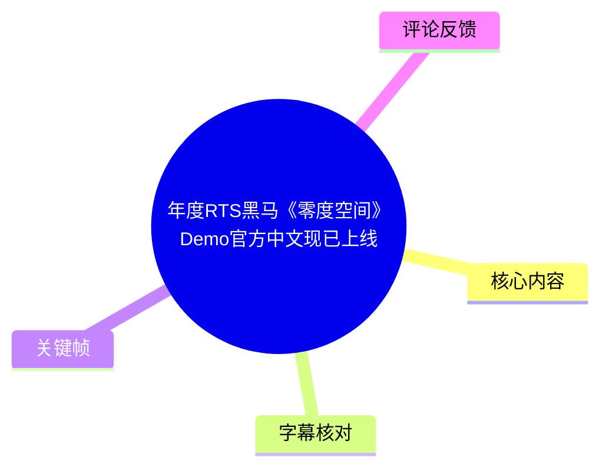
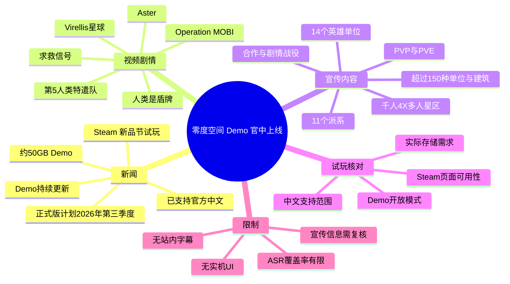
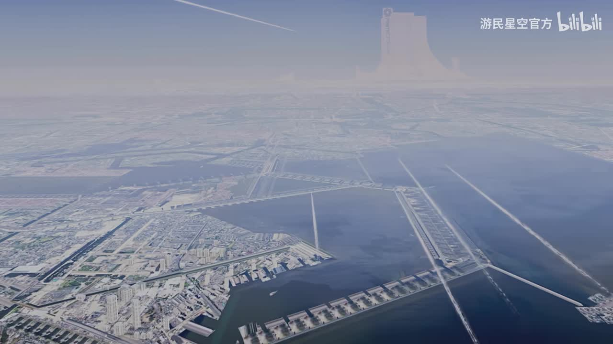
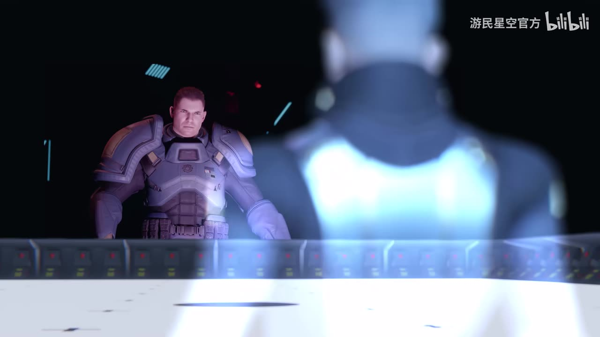
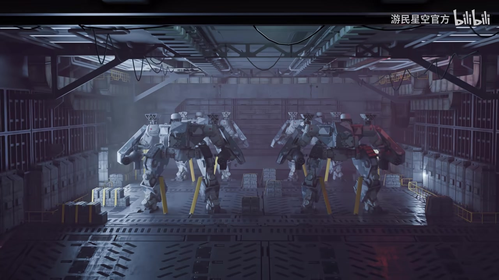
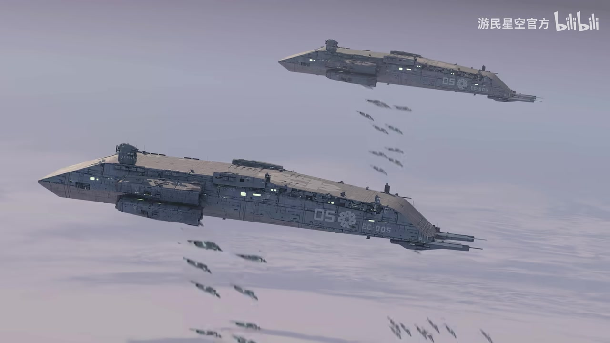

## 小结

视频《年度RTS黑马〈零度空间〉Demo官方中文现已上线》是一支时长 112 秒的科幻 RTS 宣传片。视频本体以英文电影化过场、军事指挥、机甲整备和舰队空降画面为主；投稿说明则公布了产品新闻：由 Starlance Studios 与 Ironward 共同打造的《零度空间（ZeroSpace）》Demo 已进入 Steam 新品节试玩活动，约 **50GB**，现已支持**官方中文**，且仍在更新中。

依据本次 ASR 的真实时间轴，剧情中可确认第 5 人类特遣队被命令执行 **Operation MOBI**，目标是迅速控制 **Virellis** 星球；受命对象包含 **Aster**，并被要求立即发起突击空降。中段出现“求救信号”，后段再次提到 **Prefect Aster**，并以“如今我们是盾牌”的人类阵营宣言收束。站内没有可用字幕，因此专有名词保留 ASR 英文拼写，不擅自编造官方中文译名。

投稿说明还宣称正式版计划于 **2026 年第三季度**发售，完整游戏将有 11 个派系、14 个英雄、超过 150 种单位与建筑，并包含 PVP、PVE、多人合作、剧情战役和千人规模 4X 多人即时星区等内容。这些属于投稿方的产品宣传和规划；视频画面未逐项展示，不能据此认定具体模式均已在 Demo 开放。

对准备试玩的玩家，最应核对的是 Steam 商店页当前是否仍提供 Demo、官方中文具体覆盖范围、实际磁盘占用及版本号。视频没有 RTS 实机 UI、资源运营、建造队列、快捷键、单位属性或联机过程，因而无法凭本片判断操作深度、平衡性、性能与 PVP 质量。

## 思维导图

## 目录

- [视频定位与时效性](#视频定位与时效性-0000)
- [剧情开场：MOBI 行动与 Virellis 目标](#剧情开场mobi-行动与-virellis-目标-0006)
- [中段事件：求救信号](#中段事件求救信号-0050)
- [后段台词：Aster 与人类阵营叙事](#后段台词aster-与人类阵营叙事-0121)
- [Demo 新闻、规模与内容承诺](#demo-新闻规模与内容承诺-0000)
- [Steam 获取与试玩核对步骤](#steam-获取与试玩核对步骤-0000)
- [关键参数、适用对象与限制](#关键参数适用对象与限制-0000)
- [字幕比对](#字幕比对)
- [评论分析](#评论分析)
- [处理记录](#处理记录)

# 年度RTS黑马《零度空间》Demo官方中文现已上线

> 来源：[Bilibili 视频](https://www.bilibili.com/video/BV1y2jN6PELk)  
> UP 主：游民星空官方  
> 视频时长：112 秒  
> 合集：AIcode  
> BVID：BV1y2jN6PELk  
> 发布时间：2026-06-15（按任务元数据中的发布日记录）

## 视频定位与时效性 [00:00](https://www.bilibili.com/video/BV1y2jN6PELk?t=0)

这是一支科幻军事风格的游戏宣传片，主要展示城市远景、舰内人物、机甲整备、战舰及空降编队等电影化画面，并配有少量英文剧情对白。它不是实机教学、PVP 对局、建造流程或性能测试视频。

> 图：画面给出近未来海港城市、海面与远方大型建筑，承担世界观建立功能。其价值在于说明视频的开场重点是科幻军事氛围，而不是 RTS 操作界面；素材未提供该关键帧的精确抽帧时间，因此不把它作为精确时间戳证据。

标题中的“年度 RTS 黑马”属于宣传性评价，不能视为已经由市场表现或玩家口碑验证的事实。相对可核对的产品新闻来自投稿说明：Demo 已进入 Steam 新品节试玩活动、约为 50GB、已支持官方中文，并持续更新；正式版计划于 2026 年第三季度发售。

上述状态均具有时效性：Steam 新品节活动、Demo 开放状态、下载体积、语言支持、更新版本和正式发售窗口可能在视频发布后发生改变。实际下载或购买前，应以 Steam 当前商店页和官方公告为准。

## 剧情开场：MOBI 行动与 Virellis 目标 [00:06](https://www.bilibili.com/video/BV1y2jN6PELk?t=6)

本次 ASR 在 **00:06.800—00:24.880** 识别到以下连续英文台词：

> “5th Terran Task Force, begin Operation MOBI. Secure planet Virellis quickly and decisively. The entire warfront depends on it. Aster, I don't need to remind you how important this mission is. Begin your assault drop now!”

依据这段有时间戳的识别结果，可以确认以下剧情信息：

1. 命令对象是 **第 5 人类特遣队**（`5th Terran Task Force`）。
2. 行动代号为 **Operation MOBI**。
3. 任务目标是迅速且果断地控制、确保或夺取 **Virellis** 星球。
4. 说话者强调整条战线都依赖这次行动，表示任务具有重要战略地位。
5. 名为 **Aster** 的人物被要求立即开始 `assault drop`，可谨慎理解为突击空降或登陆行动。

`Secure planet` 仅能说明任务是确保对该星球的控制或安全，并未说明敌方阵营、具体胜利条件、兵力规模或剧情最终结果。由于没有站内官方中文字幕，`MOBI`、`Virellis` 和 `Aster` 均保留英文，不将其强行译为未经证实的中文名称。

> 图：画面显示重型装甲人物在指挥控制台前与另一人物对峙，适合辅助理解任务下达和军事决策的语境。但画面本身没有姓名标签，不能单独证明其中人物就是 Aster。

> 图：多台双足机甲在运输舱内等待部署，直观体现视频强调的机械化军事单位与登陆作战氛围。该图不含 RTS 单位面板、属性、生产队列或控制信息，不能据此推断机甲的实际玩法功能。

## 中段事件：求救信号 [00:50](https://www.bilibili.com/video/BV1y2jN6PELk?t=50)

在开场任务命令结束后，ASR 于 **00:24.880—00:50.770** 出现较长空白区间。下一段可识别对白为：

> **00:50.770—00:53.230**：“Stop. HQ, are you seeing this?”  
> **00:54.560—00:56.520**：“We are receiving a distress signal.”

此处能够确认的是：角色发现了异常情况，并向总部询问；总部随后确认正在接收一个**求救信号**（`distress signal`）。

该事件为此前“尽快控制 Virellis 星球”的军事行动增加了叙事变数，但现有字幕并未说明：

- 求救信号的发出者是谁；
- 信号来自何处；
- 其是否与 Virellis 星球直接相关；
- 角色是否因此改变原任务；
- 信号是否对应游戏中的分支选择或实际关卡机制。

投稿说明提及游戏希望呈现政治动荡、人物羁绊与艰难抉择，但这属于内容宣传，不能将“求救信号”直接延伸解释为某个已经证实的剧情分支。

> 图：两艘大型战舰下方可见成列投放的飞行器或登陆单位，与 ASR 中的“Begin your assault drop now”形成画面语义呼应。图片价值在于建立“突击空降”的视觉关联；但未展示单位名称、数量、操作方式或战术规则。

## 后段台词：Aster 与人类阵营叙事 [01:21](https://www.bilibili.com/video/BV1y2jN6PELk?t=81)

后段 ASR 仅识别到两句短台词：

- **01:21.280—01:24.160**：`It is most important to you, Prefect Aster.`
- **01:37.030—01:40.990**：`It's been the spirit of mankind, but now we're the shield!`

第一句再次明确提到 **Aster**，并使用 `Prefect` 这一职位称呼。`Prefect` 在不同语境中可能可译为行政官、长官、执政官等，但视频没有可用官方中文字幕，因此不能确认正式中文职位译法，本文保留原文 **Prefect Aster**。

第二句表达出强烈的人类阵营动员色彩。由于前半句 `It's been the spirit of mankind` 的语法与语义可能受混音、角色发音或 ASR 识别影响，本文不对其作过度引申；较为明确的是后半句 `now we're the shield`，即“如今我们是盾牌”，强调防卫、守护或承担战争屏障的定位。

ASR 在 **00:56.520—01:21.280** 及 **01:24.160—01:37.030** 分别存在长空白区间。没有识别到的对白不应以剧情常识补写。

## Demo 新闻、规模与内容承诺 [00:00](https://www.bilibili.com/video/BV1y2jN6PELk?t=0)

以下信息主要来自视频投稿说明，而非对 112 秒画面的逐帧读取。应区分“当前产品新闻”与“完整游戏的宣传承诺”。

### 当前产品信息

| 项目 | 投稿说明所述 | 使用时的核对重点 |
| --- | --- | --- |
| 试玩活动 | 已加入 Steam 新品节试玩活动 | 活动与试玩资格可能变化，应查看 Steam 当前状态。 |
| Demo 大小 | 约 50GB | 应按 Steam 客户端显示的下载量与安装空间准备存储。 |
| 中文支持 | Demo 已支持官方中文 | 仍需核对界面、字幕、文本与配音分别支持到何种程度。 |
| 更新状态 | Demo 在不断更新中 | 旧攻略、性能评价、截图和版本结论可能快速过时。 |
| 正式版窗口 | 计划于 2026 年第三季度发售 | 属于计划窗口，不是不可变更的固定发售日。 |
| 商店入口 | 投稿说明提供 Steam 链接 | <https://store.steampowered.com/app/1605850/ZeroSpace/> |

### 宣传中的内容规模

投稿说明将《零度空间》描述为由 **Starlance Studios** 与 **Ironward** 共同打造的“电影级 RTS”，并称有 Scarlett、CatZ、PiG 等职业《星际争霸》选手参与打磨，以及具有《家园》《孤岛惊魂》等作品背景的开发成员参与。

投稿说明还列出以下功能或规模：

- **11 个不同派系**；
- **14 个英雄单位**；
- **超过 150 种单位和建筑**；
- PVP、PVE、多人合作及剧情战役；
- 受《质量效应》《博德之门》启发的剧情叙事与选择；
- 最多可与 **1000 名真实玩家**处于同一个 4X 大型多人即时星区；
- 可组织由部队、生物、外星人和重型装甲单位构成的舰队，开展领土防卫与星系征服。

这些信息能够说明其宣传定位不局限于传统 1v1 RTS，而是试图覆盖剧情战役、合作、PVP 与大规模多人战略等多个方向。不过，视频本体并未展示 11 个派系、14 名英雄、150 余种单位建筑、1000 人星区或 4X 操作界面，因此这些内容是否已进入当前 Demo、具体如何实现，均应以商店页、版本公告与实机试玩复核。

## Steam 获取与试玩核对步骤 [00:00](https://www.bilibili.com/video/BV1y2jN6PELk?t=0)

视频未展示 Steam 下载过程。以下步骤根据投稿说明中的官方商店链接整理，用于玩家自行验证当前可玩状态，并非视频内的实机操作演示。

1. 打开 Steam 商店页：<https://store.steampowered.com/app/1605850/ZeroSpace/>。
2. 查看当前是否仍存在 Demo 下载、请求访问或新品节试玩入口。活动结束后，Demo 的开放状态可能不同。
3. 检查语言支持栏。应分别确认“界面”“字幕”和“完全音频”是否支持简体中文；“支持官方中文”不必然代表中文配音。
4. 查看实际系统需求、磁盘空间和当前下载体积。投稿说明所称“约 50GB”应视为参考值，实际安装占用可能随版本更新变化。
5. 下载后记录 Demo 版本号，并在游戏内确认语言设置是否已正确切换。
6. 按自身需求检查当前 Demo 是否开放对应模式，例如单人内容、PVE、合作或 PVP；完整游戏的宣传模式不一定全部可在试玩版体验。
7. 进行 RTS 体验时，应独立观察资源循环、建造逻辑、生产队列、单位响应、编队与快捷键、镜头控制、战斗可读性、AI、联机质量和性能表现。

最后一项尤其重要：本视频没有提供资源栏、科技树、建造菜单、单位属性、操作指令或帧率数据，不能代替实机验证。

## 关键参数、适用对象与限制 [00:00](https://www.bilibili.com/video/BV1y2jN6PELk?t=0)

### 参数速览

| 类别 | 信息 | 证据来源 |
| --- | --- | --- |
| 视频时长 | 112 秒 | 视频元数据 |
| 视频分辨率 | 3840 × 2160 | 视频元数据 |
| Demo 体量 | 约 50GB | 投稿说明 |
| 语言 | 已支持官方中文 | 投稿说明 |
| 开发方 | Starlance Studios、Ironward | 投稿说明 |
| 派系数量 | 11 个 | 投稿说明 |
| 英雄数量 | 14 个 | 投稿说明 |
| 单位与建筑 | 超过 150 种 | 投稿说明 |
| 多人规模 | 宣传称同一 4X 星区最多可有 1000 名真实玩家 | 投稿说明 |
| 正式版计划 | 2026 年第三季度 | 投稿说明 |
| 已识别剧情专名 | Operation MOBI、Virellis、Aster、Prefect Aster | 本次 ASR |
| RTS 实机 UI | 本素材未展示 | 视频画面与 ASR |

### 适合关注的用户

- 希望了解《零度空间》Demo 是否已有官方中文支持的玩家；
- 偏好科幻军事美术、机甲、舰队与电影化叙事的 RTS 爱好者；
- 想通过试玩判断“职业《星际争霸》选手参与打磨”这一宣传卖点实际效果的用户；
- 同时关注战役、PVE、合作、PVP 与大规模多人战略构想的玩家；
- 有足够本地存储空间，能够接受约 50GB Demo 下载规模的用户。

### 不能由本视频得出的结论

1. **不能确认 RTS 操作深度。** 没有展示资源采集、建造、生产队列、科技树、热键或微操。
2. **不能确认性能。** 电影过场画面的表现不能等同于高单位密度实机战斗的帧率和稳定性。
3. **不能确认 Demo 的模式开放范围。** 投稿说明介绍的是产品整体定位，未证明所有模式已纳入当前试玩版。
4. **不能确认中文本地化质量。** “支持官方中文”不等于已验证文本完整度、术语统一性、UI 适配和中文配音。
5. **不能确认平衡性或 PVP 强度。** 视频没有对局数据、版本信息、匹配流程或竞技环境。
6. **不能确认“年度黑马”。** 这是标题中的营销判断，需要以玩家体验、后续更新、市场表现和正式版品质验证。

## 字幕比对

| 字幕来源 | 完整性 | 专有名词 | 时间轴 | 主要问题 |
| --- | --- | --- | --- | --- |
| Bilibili 站内字幕 | 未提供可用站内字幕，无法使用 | 无法核验官方中文译名 | 无可用分段 | 无法取得完整中文对白、官方术语与逐句时间轴。 |
| 本次 ASR 字幕 | 共 6 段、约 29.34 秒有效语音，覆盖率约 26.25% | 识别出 `MOBI`、`Virellis`、`Aster`、`Prefect Aster` | 有效，范围为 00:06.800—01:40.990 | 存在多个大间隔；末句前半段可能受混音、口音或识别误差影响。 |

本次已检查 ASR 结果。ASR 使用 `medium` 模型，自动识别语言为英语，语言置信度约 **0.9644**；音频时长约 111.77 秒，识别结果具有有效时间戳。诊断中**没有** `noAudioStream=true` 标记，且确实识别到英文对白，因此不能将字幕不完整归因于“无音轨”。

站内字幕未提供可用文件，最终字幕依据为本次 ASR 的 6 个真实时间段，并结合关键帧和投稿说明补充画面及产品新闻。具体处理原则如下：

- `Operation MOBI`、`Virellis`、`Aster`、`Prefect Aster` 保留 ASR 原文拼写，不虚构官方中文名称。
- `assault drop` 仅按军事语境解释为突击空降或登陆，不将其直接认定为某项 RTS 可操作机制。
- `distress signal` 可确认是求救信号，但信号来源与后续剧情没有字幕证据，不作补写。
- ASR 大空白区间为 **00:24.880—00:50.770**、**00:56.520—01:21.280**、**01:24.160—01:37.030**；这些区间不根据常见叙事套路补全对白。
- 关键帧可验证机甲、装甲人物、舰船、空降编队和科幻城市的视觉存在，但不能替代字幕确认角色身份、单位功能、故事因果或玩法参数。

## 评论分析

仅分析当前可获取的热评前三条。以下内容反映评论者观点与观众争议，不作为游戏品质、预算、玩法强度或开发投入的事实证据。

1. **BaD_RapuTAtion（263 赞）**  
   评论：“名字像卫生巾，人物像光晕，模型像星际。”

   - 观点：评论者以调侃方式评价作品名称、人物装甲设计和模型风格。
   - 可提取的观感：部分观众会把片中人物与机甲的美术联想到《光环》《星际争霸》等科幻军事作品。
   - 限制：这是主观审美类比，不能据此证明作品存在模仿、抄袭，或证明玩法、模型质量与相关作品相同。

2. **supremecommader（363 赞）**  
   评论：“我看连人家900MB大小的dust front rts的一半强度都没有啊[doge]钱都花哪去了[doge]”

   - 观点：评论者质疑本作所呈现的内容或视觉效果与约 50GB Demo 体量是否匹配，并将其与 `dust front rts` 进行对比。
   - 可提取的争议：约 50GB 的下载体积提高了玩家对内容密度和呈现质量的预期。
   - 限制：评论没有给出对比版本、测试场景、玩法数据、帧率或成本资料；文件大小不能直接换算为游戏“强度”、开发预算或完成度。

3. **喀秋莎酋长（118 赞）**  
   评论：“提前开始吹的东西能叫黑马吗[笑哭]”

   - 观点：评论者质疑视频标题中“黑马”的措辞，认为未经市场与玩家检验的作品不宜过早定性。
   - 可提取的争议：该评论聚焦营销定位与产品实际表现之间的时间差。
   - 限制：这是对宣传用语的价值判断，并不构成游戏没有潜力或品质不佳的实证结论。

## 处理记录

- Worker ID：`worker-mrj0wjed-b0c290ad`
- 模型：`gpt-5.6-terra`
- 任务视频：`BV1y2jN6PELk`
- 使用素材与工具：视频元数据、投稿说明、ASR 结果 JSON、ASR SRT 时间轴、关键帧文件、热评 JSON。
- ASR 工具信息：`medium` 模型；CUDA；`float16`；自动语言识别为英语；输出包含真实分段时间戳。
- 字幕选择：站内未提供可用字幕；已检查本次 ASR，确认源视频有音轨且 ASR 识别到英文对白。最终以 ASR 的 6 个时间段作为剧情时间轴依据，并明确标注低覆盖率与空白区间。
- 关键帧选择依据：
  - `frames/frame-001.jpg`：用于说明科幻城市与世界观开场；
  - `frames/frame-002.jpg`：用于辅助理解军事指挥与人物对话场景；
  - `frames/frame-003.jpg`：用于展示舰内整备的双足机甲；
  - `frames/frame-004.jpg`：用于对应突击空降/舰队部署的视觉表达。
- 关键帧使用限制：素材未提供各帧精确抽帧时间，因此图片只用于多模态画面理解，不被用作精确时间轴依据。
- 评论处理：仅处理可获取热评前三条，未把评论主张写成已验证事实。
- 缓存清理：本次仅使用任务已提供的结构化文本和关键帧相对路径，未新增下载文件或可清理的缓存；无额外缓存残留可报告。
- 未解决问题：缺少站内官方字幕；ASR 有效语音覆盖率约 26.25%；视频未展示 RTS 实机 UI 与具体玩法；Demo 当前开放状态、实际系统需求、中文覆盖范围、模式内容和正式发售日期仍需以 Steam 页面及后续官方公告复核。
