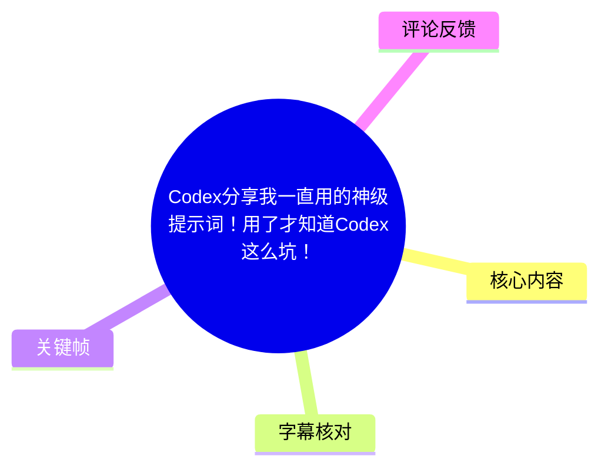
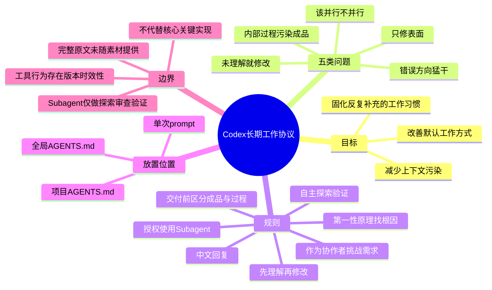
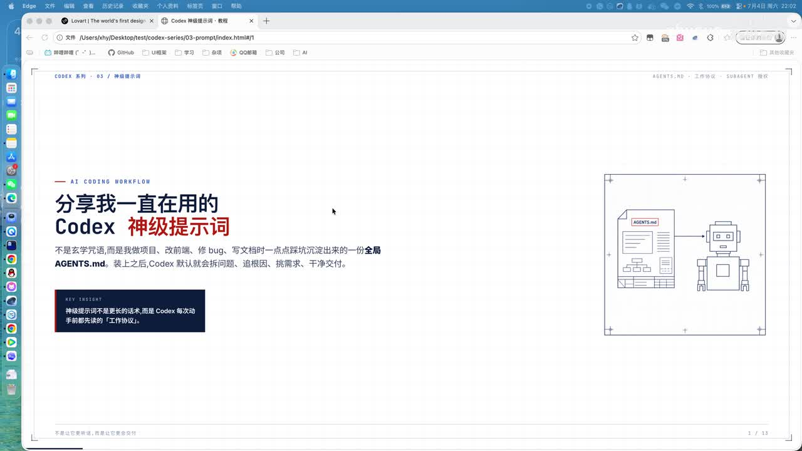
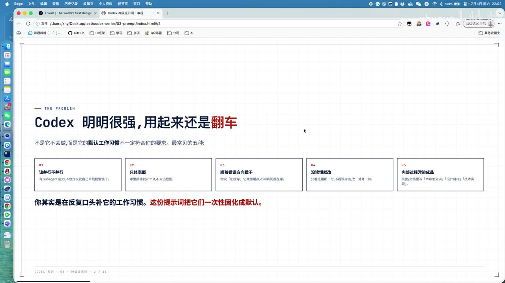
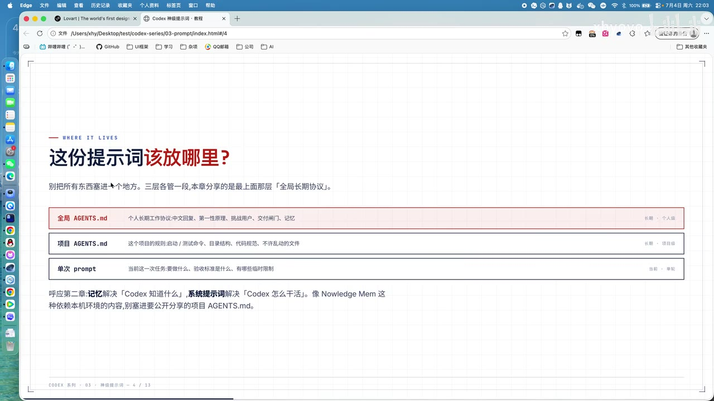

# Codex分享我一直用的神级提示词！用了才知道Codex这么坑！

> 来源：[Bilibili 视频](https://www.bilibili.com/video/BV1ryMP6MEUq) 
> UP 主：xhyovo｜时长：12 分 30 秒｜分辨率：1920×1080｜收录：AIcode  
> 本文将视频中口述的 `Codex`、`AGENTS.md`、`Subagent` 等名称按画面与上下文整理；ASR 对个别英文术语识别不稳定，详见“字幕比对”。

## 小结

本期是 UP 主 Codex 系列中有关“系统提示词／长期工作协议”的一章。其核心并非给某个单次任务写更长的指令，而是把自己在高强度使用 Codex 时反复补充的工作偏好，沉淀到全局 `AGENTS.md` 中，让 Codex 在不同项目和会话中更稳定地遵循一套默认工作方式。

视频归纳了五类常见翻车模式：该并行时不并行、只修表面、沿错误方向持续修改、未理解代码就动手、把实现过程或设计说明泄漏到面向最终读者的成品中。UP 主的提示词设计针对这些问题分别设置了：授权使用 Subagent、以第一性原理定位根因、把模型定位为能挑战需求的协作者、先探索和理解再修改、交付前区分“用户要看什么”和“制作过程是什么”。

其中最具操作性的原则是**分层放置指令**：全局 `AGENTS.md` 放个人长期偏好；项目 `AGENTS.md` 放项目边界、命令与约束；单次 prompt 只写本次任务、验收标准和临时限制。视频强调，系统级长期约定不宜混入项目文件，以免在共享项目中带入个人或本机环境信息。

这不是一份可直接逐字复制的完整提示词文本：UP 主说明会把“十条精炼版”和完整版放在视频评论区，但给定素材没有附上该评论内容。因此本文只记录视频已明确讲解的规则、示例和边界，不补写或臆造缺失的原始 prompt。

适合经常用 Codex 或类似 Coding Agent 做跨文件探索、修 Bug、前端页面和文档/PPT产出的开发者。应注意，视频中的 Subagent 行为、模型分级以及 `AGENTS.md` 的具体支持形式都可能随 Codex 产品版本变化；“允许即可稳定并行”“模型会自动遵循”等效果属于 UP 主经验，应以当前工具文档与实际运行结果复核。

## 思维导图

## 目录

- [背景：为何需要长期提示词](#背景为何需要长期提示词)
- [五类 Codex 翻车模式](#五类-codex-翻车模式)
- [提示词的放置层级](#提示词的放置层级)
- [规则一：语言与 Subagent 使用授权](#规则一语言与-subagent-使用授权)
- [规则二：从表面修复转向根因分析](#规则二从表面修复转向根因分析)
- [规则三：让模型成为协作者](#规则三让模型成为协作者)
- [规则四：先理解、再探索、后修改](#规则四先理解再探索后修改)
- [规则五：避免内部过程污染最终成品](#规则五避免内部过程污染最终成品)
- [落地步骤与适用限制](#落地步骤与适用限制)
- [字幕比对](#字幕比对)
- [评论分析](#评论分析)
- [处理记录](#处理记录)

## 背景：为何需要长期提示词 [00:00](https://www.bilibili.com/video/BV1ryMP6MEUq?t=0)

UP 主将本期定位为 Codex 系列的第三章节，并将其与前一章节所讲的“记忆管理”关联。这里的“神级提示词”不是某次“帮我完成某件事”的临时需求描述，而是一份长期生效的工作协议：以后无论开启何种会话、处理何类项目，都尽量按照同一规范工作。

视频的判断是：Codex 本身能力并不弱，但其**默认工作习惯未必符合用户预期**。开发者看似在不断纠正模型，实质上是在重复补充自己希望它遵守的流程。将这些重复要求固定下来，能够减少每次从零说明的成本。

> 图：该页明确将主题指向“全局 AGENTS.md”，并概括其作用为让 Codex 默认“多问问题、追根因、挑需求、干净交付”。它帮助理解本期讨论的是长期工作规范，而非单一任务技巧。

## 五类 Codex 翻车模式 [00:39](https://www.bilibili.com/video/BV1ryMP6MEUq?t=39)

视频先列出五个用于反推提示词规则的问题：

1. **该并行不并行**：具备 Subagent 能力，但模型可能因没有得到明确授权或工作约定而自己线性推进，导致探索、检索等可拆分工作没有并发处理。
2. **只修表面**：收到 Bug 或错误描述后，只让表象消失，不追问根因，形成治标不治本的修复。
3. **顺着错误方向猛干**：模型接受了不准确的任务描述、假设或用户认知，持续在错误路径上改动。
4. **没读懂就改**：模型没有建立对相关代码、依赖和上下文的理解，就直接改一行、再根据反馈改另一行；修改链条可能不断扩大。
5. **内部过程污染成品**：开发页面、文档或演示材料时，把设计目标、实现说明、占位提示等本应服务于开发者/作者的过程文字直接呈现给最终读者。

> 图：画面集中列出了本期提示词要解决的五个问题，是后续各项规则与问题之间的对应索引。相比仅凭口述，该图更清晰地呈现了视频的完整问题框架。

视频并未声称这些问题只存在于 Codex；其表述更接近于：这些是自己使用 Codex 时遇到、并通过提示词尝试缓解的工作模式问题。因此，以下建议宜视为可迁移的 Agent 协作规范，而不是对某一产品缺陷的绝对定论。

## 提示词的放置层级 [01:24](https://www.bilibili.com/video/BV1ryMP6MEUq?t=84)

视频区分三层信息，不建议“把所有东西塞进同一个地方”：

| 层级 | 载体 | 视频所述内容 | 作用范围 |
| --- | --- | --- | --- |
| 全局层 | 全局 `AGENTS.md` | 个人长期工作协议，例如中文回复、第一性原理、挑战用户、交付前检查等 | 个人级别；对不同项目与会话均生效 |
| 项目层 | 项目 `AGENTS.md` | 项目规则、启动/测试命令、目录结构、代码规范、不许改动的文件 | 当前项目 |
| 单次任务层 | 单次 prompt | 此次要做什么、验收标准、临时约束 | 当前任务/会话语境 |

> 图：这张层级图直接展示了三种载体及其内容边界，且用高亮强调本期分享主要属于“全局长期协议”。它是避免将个人偏好误放入项目配置的关键依据。

视频特别指出：

- 全局层是个人级别的设置，对任何项目都可用。
- 项目层强调的是**项目隔离**。UP 主口述中曾自我修正为“项目隔离，会话不隔离”：也就是说，同一项目下的不同会话仍会共享该项目的规则语境。
- 如 `Knowledge Mem` 一类依赖本机环境或个人记忆的内容，不应塞进需要公开共享的项目 `AGENTS.md`。
- 本期“神级提示词”应该放在最上层的全局长期协议中，因为它解决的是跨项目反复出现的工作习惯问题。

## 规则一：语言与 Subagent 使用授权 [02:15](https://www.bilibili.com/video/BV1ryMP6MEUq?t=135)

### 中文回复

视频提到“中文回复”可写也可不写。UP 主的判断是，较成熟的模型通常会跟随用户输入语言；但在输入法受限、用户用非中文输入却希望得到中文结果等场景，仍可通过显式规则强制中文输出。

因此，这一规则的价值主要在于**稳定输出语言**，不是提高编码能力的关键机制。

### 给 Subagent 显式授权

UP 主认为 Codex 对 Subagent 的主动使用可能不够积极：如果没有明确需求，它未必自行创建 Subagent。提示词中应显式写明：在适合并行的场景允许使用 Subagent，且不必每次先请示用户。

视频给出的适用工作包括：

- Web 搜索；
- 代码搜索；
- 上下文探索；
- 审查；
- 验证。

其逻辑是把过程性交给 Subagent，主 Agent 只接收整理后的结果，从而节省主上下文，降低长任务中上下文被探索细节“污染”的风险。

但视频同时设置边界：Subagent 应承担探索、审查、验证等**非最核心、非关键**的工作；不应无边界地把关键实现全部下放。UP 主还以 Claude Code 对比：其主观观察是 Claude Code 更容易在识别到需求后主动调度 Subagent，而 Codex 需要更明确的环境和提示词支持。该比较是视频经验分享，未提供可复现实验数据。

> 参数/模型信息：UP 主口述称，探索类 Subagent 可能使用较低等级模型（举例“5.3、5.4”）；多 Agent 协作执行可能是另一场景（举例“5.5”）。这些数字未附产品文档、具体模型名称或配置截图，不能据此推导当前 Codex 的实际模型路由规则。

## 规则二：从表面修复转向根因分析 [04:22](https://www.bilibili.com/video/BV1ryMP6MEUq?t=262)

为避免“别套模板／只修表面”，视频建议在长期提示词中引入**第一性原理**的要求：当用户给出 Bug、错误或方案时，模型不能只对症状打补丁，而应拆解：

- 真正的问题是什么；
- 最终目标是什么；
- 矛盾或约束在哪里；
- 是什么原因导致当前现象；
- 应如何解决根因。

视频的重点不是要求模型无限分析，而是让修复的评价标准由“报错/表象暂时消失”转为“造成问题的底层原因被处理”。这尤其适用于 Bug 修复、结构性重构和需要防回归的任务。

实践时仍需保留边界：第一性原理分析并不等于允许模型擅自扩大改动范围。单次 prompt 仍应明确可改范围、不可改文件、验收标准与回归测试要求；这些属于项目/任务层约束，而不应由全局规则替代。

## 规则三：让模型成为协作者 [05:33](https://www.bilibili.com/video/BV1ryMP6MEUq?t=333)

视频提出应让模型从单纯“执行者”转为“协作者”：它不应无脑接受用户提出的需求或技术方案，而应自主反思、审视并在必要时挑战用户的思路。

UP 主举例：如果用户要求“把所有用户数据都存到 LocalStorage”，未加限制的模型可能直接照做；但一个协作者应反问或检查：

- 数据是否敏感；
- 容量是否足够；
- 设备丢失或更换时怎么办；
- 是否有迁移、备份或过期策略。

这里的核心经验是：**听话不等于好用**。模型完全执行一个未经审视的技术方案，可能让用户短期感觉省事，却会把错误设计或安全问题固化进产物。

这项规则也有适用限制。视频鼓励模型挑战需求，但没有给出挑战后的标准交互格式。实际应用中，可在任务层补足决策边界，例如要求模型发现安全、数据一致性、不可逆变更或目标冲突时，先说明风险和替代方案，再等待确认；对已被明确授权的低风险修改则可直接执行。

## 规则四：先理解、再探索、后修改 [06:34](https://www.bilibili.com/video/BV1ryMP6MEUq?t=394)

“先理解代码之后再改”针对的是模型未读懂上下文就直接提交修改的问题。视频描述的失败链条是：

1. 用户报告一个 Bug；
2. 模型立即修改；
3. 用户指出该处改错；
4. 模型继续局部修正；
5. 模型在初始错误方向上越走越远。

UP 主进一步提出“信任自主探索”：不要过度用用户的主观描述限定模型，应允许它检查代码、文件和实际上下文，甚至不完全相信用户的输入或问题归因。其理由是，项目中的代码与文件往往比用户口头描述更接近可验证事实；用户的认知、需求清晰度和错误假设都有可能把模型带偏。

可据视频思路整理为以下工作顺序：

1. **读取与定位**：先查找相关代码、配置、调用链和数据流。
2. **理解与验证假设**：区分用户报告的现象、用户推测的原因与代码事实。
3. **拆解根因与约束**：识别是否存在更底层的问题或需求冲突。
4. **决定修改方案**：必要时挑战原方案或提出澄清问题。
5. **执行与验证**：在约束范围内修改，并以测试、审查或实际验证确认结果。

视频没有展示具体命令、测试脚本或可复制的 prompt 原文，故上述是对已讲流程的结构化整理，并非视频提供的命令级教程。

## 规则五：避免内部过程污染最终成品 [08:00](https://www.bilibili.com/video/BV1ryMP6MEUq?t=480)

视频展示的典型问题发生在前端页面、PPT 或文章生成中：Codex 会把“实现过程”暴露给最终读者。例如页面中出现“丢进目录下面即可，文件名按下方占位提示”之类文字。UP 主认为这些文字可能是模型给自己或开发者的实现指令，而读者并不需要知道。

> 图：画面再次呈现全局/项目/单次任务的区分；结合视频后段的讲解，它也帮助确认“面向开发者的说明”与“面向读者的成品”应分层保存，而不应混排到最终页面中。

视频列举不应直接出现在最终用户界面或读者文档中的内容类型：

- “本页面的设计目标是什么”；
- “这个模块要怎么展示”；
- 前端实现方法；
- “本章我们将学习什么什么”一类讲演者口吻；
- “这里可以录制演示”等制作提示；
- 其他仅服务于开发、作者或 AI 自身的技术细节。

相对地，最终读者需要的是完成后的卡片、内容和功能，而非其生成过程。视频给出了一句交付前自检问题，提问对象是 AI 自身：

> 这句话到底是最终用户要看的，还是作者、开发者、AI 的制作过程？

该规则适用于生成面向最终用户的前端页面、阅读型文档、演示文稿与内容页面。它不意味着技术文档不能有实现细节；关键是先明确文档的受众。面向开发者的设计说明、安装步骤和实现细节可以保留在开发文档中，但不应误混入面向普通读者的成品正文。

## 落地步骤与适用限制 [10:38](https://www.bilibili.com/video/BV1ryMP6MEUq?t=638)

按视频内容，可采用以下落地路径：

1. **回顾重复纠错**：记录自己在 Codex 会话里最常反复强调的行为要求，而非先追求复杂措辞。
2. **把长期规则归入全局 `AGENTS.md`**：例如语言偏好、根因优先、协作者模式、先理解后修改、成品与过程隔离等。
3. **为 Subagent 写清授权和边界**：允许其在探索、搜索、审查、验证任务中并行使用；同时限制其不要承担核心关键实现。
4. **保留项目层规则**：把启动/测试命令、目录结构、代码规范、不可变更文件放在项目 `AGENTS.md`。
5. **保留单次任务层信息**：在 prompt 中写清当前目标、验收标准和临时约束，避免让全局协议承担具体需求。
6. **在交付前执行成品检查**：针对页面、PPT、文章等输出，检查是否泄露了占位语、实现说明、设计过程或作者口吻。
7. **按实际效果迭代**：UP 主明确表示，如果觉得提示词太长或不满意，用户可以自行修改；精炼版是前十条，后续内容主要是术语解释。

视频称完整系统提示词与压缩版会放到评论区供复制，但当前可获取的两条热评中没有该正文。因此，不能从现有素材恢复其完整条目、原始措辞、文件路径或配置方式。

### 时效性、风险与未验证项

- 视频元数据发布时间为 2026 年 7 月；AI 编程产品的 Agent 调度、文件约定与模型能力迭代较快，使用前需检查当前 Codex 官方文档。
- 本视频不包含性能对比、成功率、Token 消耗或上下文长度的量化测试；“节省上下文”“改善长任务执行”等为机制解释和经验判断，尚未在素材中得到数据验证。
- “全局 `AGENTS.md`”在具体客户端、CLI、IDE 集成中的生效路径、优先级和作用域，视频未给出可核验配置步骤。
- 不能因为“先理解再修改”就放松代码评审、测试、备份或敏感数据安全控制。模型可以提出质疑和方案，但项目责任仍由开发者承担。

## 字幕比对 [11:37](https://www.bilibili.com/video/BV1ryMP6MEUq?t=697)

本次已执行 ASR。素材处理日志显示，站内字幕工具因缺少 JSON 资源 URL 退出，未获得可用 Bilibili 站内字幕。

| 字幕来源 | 完整性 | 专有名词 | 时间轴 | 主要问题 |
| --- | --- | --- | --- | --- |
| Bilibili 站内字幕 | 无可用文本 | 无法评估 | 无法评估 | 获取失败：`Missing JSON resource URL` |
| 本次 ASR 字幕 | 覆盖完整视频口述，包含开场至结尾 | 存在明显误识别 | 未提供逐句时间戳 | 中英文混杂、同音词与产品名识别不稳定，部分语句断裂或重复 |

最终以**本次 ASR 字幕**为正文主要依据，并结合标题、视频画面关键帧和上下文校正术语。重要校正包括：

| ASR 原识别或不稳定表述 | 正文采用 | 校正依据 |
| --- | --- | --- |
| `Qraze系列`、`CodeS`、`扣带式` | Codex | 视频标题、封面和画面中明确出现 “Codex” |
| `Agency DMD`、`A-Z2D` | `AGENTS.md` | 关键帧中清晰显示“全局 AGENTS.md”“项目 AGENTS.md” |
| `Sara本身`、`沙杯`、`Sarbinter` | Subagent | ASR 上下文持续讨论并行代理；关键帧文字含 “subagent” |
| `LockStore` | LocalStorage | 口述示例语义为“存储用户数据”，常见 Web API 名称与上下文一致 |
| `Cloud Code` | Claude Code | 视频口述为与 Codex 对比的编程 Agent，ASR 英文近音识别不稳 |
| `PVT` | PPT | 视频讨论“写前端、写 PPT、写文章”的成品污染场景 |

由于没有带时间码的逐字字幕，本文各章节时间轴为根据视频内容进展和总时长整理的定位链接，适用于跳转复看，不应视为逐句转写时间戳。

## 评论分析 [12:04](https://www.bilibili.com/video/BV1ryMP6MEUq?t=724)

可获取热评不足三条，因此仅处理实际返回的前两条，不将缺失的第三条补造。

1. **蟑螂丸：“牛逼”**  
   - 观点：表达对视频的总体认可。  
   - 补充信息：无具体使用反馈、技术细节或可验证案例。  
   - 可信度/价值：可作为即时情绪反馈，不足以验证提示词效果。

2. **缩成团：“这个选题讲得很到位，内容安排循序渐进很容易吸收。看得出作者准备得非常充分！”**  
   - 观点：认可选题切中痛点，以及内容组织的循序渐进。  
   - 补充信息：从观感层面印证视频具有较清楚的“问题—规则—放置位置—示例”叙述结构。  
   - 可信度/价值：这是主观学习体验，并未提供实际使用 Codex、配置 `AGENTS.md` 或复现效果的证据，不能作为技术结论。

## 评论分析

本次流程未获取到可用热评，因此不推断观众态度或额外结论。

## 处理记录

- **Worker ID**：`worker-mrj0wjed-b0c290ad`
- **模型**：`gpt-5.6-terra`
- **调用工具与素材**：视频元数据、音频 ASR 输出、关键帧目录、评论 JSON、素材处理日志。
- **使用的应用工具**：视频素材合并产物 `merged.mp4`、音频 `audio/audio.wav`、ASR 目录 `asr/`、关键帧目录 `frames/`、评论文件 `comments/comments.json`。
- **字幕选择**：已执行本次 ASR；站内字幕未提供可用内容，且工具日志记录获取失败（缺少 JSON 资源 URL）。正文采用 ASR，并以画面和上下文校正 Codex、`AGENTS.md`、Subagent、Claude Code、LocalStorage、PPT 等关键术语。
- **关键帧选择依据**：  
  - `frames/frame-001.jpg`：主题页，确认“Codex 神级提示词”与全局 `AGENTS.md` 的定位；  
  - `frames/frame-002.jpg`：完整呈现五类翻车问题，支撑问题框架；  
  - `frames/frame-003.jpg`：清楚展示全局/项目/单次 prompt 三层结构，是规则放置位置的直接视觉依据；  
  - `frames/frame-004.jpg`：与层级和面向受众的分层讨论相关，用于辅助理解“过程说明不应混入成品”的原则。  
- **评论处理范围**：仅分析接口可获取的热评前两条；请求上限为三条，但返回结果只有两条。
- **缓存清理**：素材清单未提供缓存清理执行日志或结果；本文不宣称已完成缓存清理。
- **未解决问题**：完整提示词原文及评论区下载地址未随素材提供；ASR 无逐句时间戳；Subagent 的具体配置、模型路由与 Codex 当前版本行为未获得官方文档或运行日志验证。
